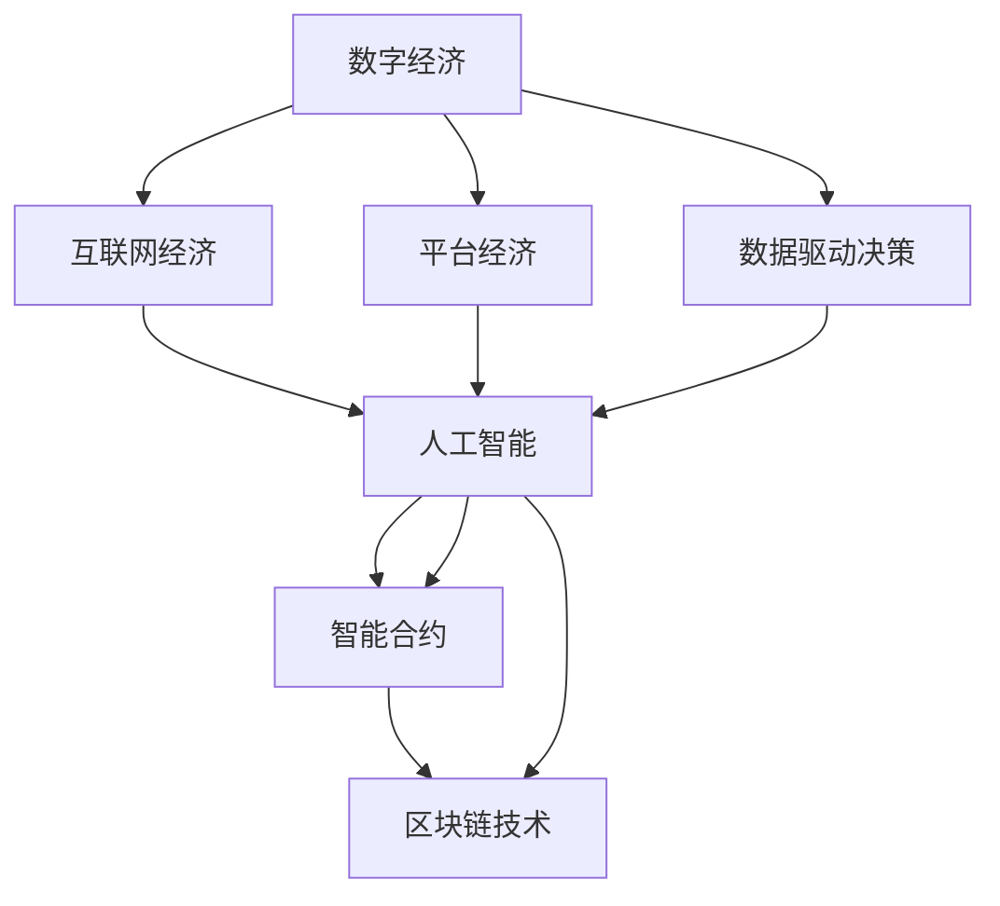

                 

## 1. 背景介绍

### 1.1 问题由来

随着全球科技的飞速发展，数字经济成为了推动社会进步的重要力量。其核心是利用数字化手段优化资源配置、提升经济效率，促进创新驱动、智能化转型。数字经济涵盖信息通讯技术（ICT）、大数据、人工智能、云计算等多个方面，贯穿生产、流通、消费各个环节，对产业升级、就业结构、社会治理等产生了深远影响。

1. **信息技术的普及与融合**：移动互联网、物联网、区块链、5G等技术的快速应用，为数字经济的繁荣奠定了坚实基础。
2. **数据与算法的双轮驱动**：海量数据的积累与先进算法的创新，推动了数据驱动决策的兴起，企业运营效率、产品个性化水平大幅提升。
3. **云计算与边缘计算**：云基础设施的部署与应用，为海量数据的存储与处理提供了可能，同时边缘计算的兴起满足了实时响应与数据安全的需求。
4. **人工智能与自动化**：机器学习、深度学习等技术的突破，助力自动化生产、智能客服、推荐系统等应用，显著提升了用户体验和企业竞争力。
5. **电子商务与社交媒体**：电商平台的兴起，改变了消费习惯与模式，社交媒体的广泛使用，改变了信息传播与用户互动的方式。

### 1.2 问题核心关键点

在数字经济的浪潮中，经济活动越来越多地在线上展开，这不仅改变了传统的商业模式，还对社会结构、文化生态、法律法规等方面产生了深远影响。以下是几个核心关键点：

- **数据驱动决策**：企业通过数据分析和算法优化，实现了更加精准的市场预测、库存管理、客户服务等，大幅提高了运营效率和竞争力。
- **云计算与平台化**：公有云、私有云、混合云的普及，加速了企业的数字化转型，同时为各领域提供了一致的计算基础设施。
- **人工智能的落地应用**：AI技术在金融、医疗、教育、交通等多个领域的应用，显著提高了服务质量和工作效率，但也带来数据隐私和伦理问题。
- **智能合约与区块链**：区块链技术的应用，为数字经济中的信任机制和透明交易提供了新的解决方案，智能合约的出现则进一步提升了合同执行的自动化和智能性。

## 2. 核心概念与联系

### 2.1 核心概念概述

为更好地理解数字经济的原理和实践，本节将介绍几个关键概念及其相互联系：

- **数字经济**：通过数字技术和数字化手段，优化资源配置，提升经济效率的经济发展模式。
- **互联网经济**：基于互联网平台和网络效应，提供更高效、更低成本的服务模式。
- **平台经济**：以平台为中心，集成资源、用户和服务，形成商业生态系统。
- **数据驱动决策**：基于数据分析和算法优化，实现更加精准和自动化的决策过程。
- **人工智能**：通过算法和数据训练，使机器能够模拟人类智能，执行任务和提供服务。
- **区块链技术**：利用加密和分布式共识算法，实现数据安全与透明交易的保障。
- **智能合约**：使用代码实现合约条款，自动执行合同，提高交易效率和信任度。

这些核心概念通过网络效应、规模经济、数据驱动决策、AI赋能等机制相互联系，共同构成了数字经济的生态体系。

### 2.2 核心概念原理和架构的 Mermaid 流程图(Mermaid 流程节点中不要有括号、逗号等特殊字符)



这个流程图展示了数字经济中核心概念之间的联系：

1. 数字经济以互联网为基石，通过平台经济整合资源和服务。
2. 平台经济基于网络效应，规模经济，增强了服务的覆盖面和质量。
3. 数据驱动决策利用AI和大数据，优化运营决策和业务流程。
4. AI技术提供自动化和智能化解决方案，提升服务效率。
5. 区块链技术保障数据安全，提供透明和可信的交易环境。
6. 智能合约实现自动化的合同执行，简化和提升交易效率。

## 3. 核心算法原理 & 具体操作步骤

### 3.1 算法原理概述

数字经济的核心在于利用数字技术优化资源配置，提升经济效率。基于算法和数据分析，实现更加精准和自动化的决策过程，是数字经济的重要特征。以下是一些关键算法和原则：

- **机器学习与深度学习**：利用算法和大数据，实现预测、分类、聚类等任务，优化决策过程。
- **自然语言处理（NLP）**：通过语义分析、情感分析、文本生成等技术，提升用户互动和自动化客服效率。
- **优化算法**：如遗传算法、模拟退火等，在网络资源优化、供应链管理等方面，优化经济活动的效率。
- **强化学习**：通过奖励机制，提升智能系统在复杂环境中的决策能力，如自动驾驶、智能投融资等。
- **分布式算法**：在云计算和边缘计算环境中，实现大规模数据处理和分布式协作。

### 3.2 算法步骤详解

数字经济的实践通常包括以下几个关键步骤：

**Step 1: 数据收集与预处理**
- 通过传感器、网络、社交媒体等渠道，收集与业务相关的数据。
- 对数据进行清洗、归一化、特征工程等预处理，确保数据的质量和可用性。

**Step 2: 数据存储与分析**
- 利用数据库、数据仓库、数据湖等技术，进行数据存储和管理。
- 使用统计分析、数据挖掘、机器学习等技术，对数据进行分析和建模。

**Step 3: 模型训练与优化**
- 选择合适的算法和模型，利用标注数据进行训练。
- 使用交叉验证、网格搜索等技术，优化模型参数和超参数。

**Step 4: 模型部署与监控**
- 将训练好的模型部署到生产环境中，进行实时推理和预测。
- 使用监控工具，实时监测模型性能和异常情况，确保系统稳定性。

**Step 5: 迭代优化与更新**
- 根据反馈和数据更新，进行模型迭代和优化，持续提升模型效果。
- 定期对模型进行重训和更新，适应新数据和新需求。

### 3.3 算法优缺点

数字经济的算法和实践具有以下优点：

- **高效性**：利用数据驱动和算法优化，显著提升经济活动的效率和精准度。
- **灵活性**：通过算法和模型迭代，适应不断变化的市场需求和业务场景。
- **智能化**：AI和大数据技术的应用，实现更加智能和自动化的决策支持。

同时，也存在以下缺点：

- **数据依赖性高**：高质量的数据是算法优化的前提，数据获取和处理成本较高。
- **技术门槛高**：算法和模型开发需要高水平的数据科学和工程能力，对企业要求较高。
- **隐私与安全问题**：大量数据的收集和处理，带来数据隐私和安全风险。

### 3.4 算法应用领域

数字经济的算法和实践已经广泛应用于多个领域，具体包括：

- **电子商务**：通过推荐系统、个性化定价、自动化客服等技术，提升用户体验和销售转化率。
- **金融科技**：利用大数据、机器学习、智能投融资等技术，提升金融服务的效率和安全性。
- **医疗健康**：通过电子病历、健康数据分析、智能诊断等技术，提升医疗服务的质量和可及性。
- **智能制造**：利用物联网、工业互联网、自动化生产等技术，优化生产流程和提高效率。
- **智慧城市**：通过物联网、云计算、大数据等技术，提升城市管理和服务水平。

## 4. 数学模型和公式 & 详细讲解 & 举例说明（备注：数学公式请使用latex格式，latex嵌入文中独立段落使用 $$，段落内使用 $)
### 4.1 数学模型构建

本节将使用数学语言对数字经济的算法和实践进行严格刻画。

假设某电商平台利用推荐系统优化用户体验，目标是在用户浏览和购买过程中，最大化销售额和用户满意度。设用户集合为 $U$，商品集合为 $I$，用户对商品的评价集合为 $R$，用户历史浏览和购买记录为 $H$，推荐系统模型为 $M$。则推荐系统的目标函数可以表示为：

$$
\max_{M} \sum_{u \in U} \sum_{i \in I} R_{ui}M_{ui} \times \text{Sat}_{ui}
$$

其中 $R_{ui}$ 表示用户 $u$ 对商品 $i$ 的评分，$M_{ui}$ 表示模型推荐给用户 $u$ 商品 $i$ 的概率，$\text{Sat}_{ui}$ 表示用户 $u$ 对商品 $i$ 的满意度评分。

### 4.2 公式推导过程

为了最大化目标函数，可以通过优化算法求解推荐模型 $M$。设 $\theta$ 为推荐模型的参数，优化过程可以表示为：

$$
\theta^* = \arg\max_{\theta} \sum_{u \in U} \sum_{i \in I} R_{ui}M_{ui} \times \text{Sat}_{ui}
$$

在实际计算中，通常使用近似求解的方法，如梯度下降法、随机梯度下降法等。例如，使用梯度下降法优化推荐模型时，目标函数对 $\theta$ 的梯度为：

$$
\nabla_{\theta}\mathcal{L} = -\frac{1}{N}\sum_{u \in U} \sum_{i \in I} \frac{\partial \mathcal{L}}{\partial M_{ui}} \frac{\partial M_{ui}}{\partial \theta}
$$

其中 $N$ 为训练样本数量。使用随机梯度下降法时，每次迭代仅考虑一个样本，梯度更新公式为：

$$
\theta \leftarrow \theta - \eta \nabla_{\theta}\mathcal{L}
$$

其中 $\eta$ 为学习率。

### 4.3 案例分析与讲解

以电商平台推荐系统为例，分析推荐模型的构建和优化过程：

**Step 1: 数据收集与预处理**
- 收集用户的历史浏览记录、购买记录、评分记录等。
- 对数据进行清洗和归一化处理，消除异常值和噪声。

**Step 2: 数据存储与分析**
- 利用分布式数据库存储用户数据和商品信息。
- 使用协同过滤、基于内容的推荐、深度学习等算法，构建推荐模型。

**Step 3: 模型训练与优化**
- 选择适当的损失函数和优化算法，如交叉熵损失、Adam优化器等。
- 使用交叉验证和超参数调优，确保模型的泛化能力和稳定性。

**Step 4: 模型部署与监控**
- 将训练好的模型部署到生产环境中，进行实时推荐。
- 使用监控工具实时监测模型性能和用户反馈，及时发现和修复问题。

**Step 5: 迭代优化与更新**
- 定期使用新数据进行模型重训，提升推荐效果。
- 结合用户反馈和市场变化，不断优化推荐策略和算法。

## 5. 项目实践：代码实例和详细解释说明

### 5.1 开发环境搭建

在进行数字经济项目的开发时，需要搭建相应的开发环境。以下是Python环境的搭建步骤：

1. 安装Anaconda：从官网下载并安装Anaconda，用于创建独立的Python环境。
2. 创建并激活虚拟环境：
```bash
conda create -n your_env python=3.8 
conda activate your_env
```
3. 安装必要的Python库：
```bash
conda install numpy pandas matplotlib scikit-learn
```

### 5.2 源代码详细实现

以下是一个简单的电商推荐系统的Python代码实现，通过协同过滤算法为用户推荐商品：

```python
import pandas as pd
import numpy as np
from scipy.sparse import csr_matrix

# 数据集
data = pd.read_csv('data.csv')

# 构建用户-商品矩阵
U = data['user_id'].unique().tolist()
I = data['item_id'].unique().tolist()
rating_matrix = np.zeros((len(U), len(I)))
for i, row in data.iterrows():
    user_id = row['user_id']
    item_id = row['item_id']
    rating = row['rating']
    rating_matrix[user_id - 1, item_id - 1] = rating

# 使用L1归一化
rating_matrix = np.divide(rating_matrix, np.linalg.norm(rating_matrix, ord=1, axis=1))

# 计算相似度矩阵
similarity_matrix = 1 - np.abs(rating_matrix - np.divide(rating_matrix, np.linalg.norm(rating_matrix, ord=1, axis=0)))

# 计算预测评分
predictions = np.dot(similarity_matrix, rating_matrix)

# 输出推荐结果
print(predictions)
```

### 5.3 代码解读与分析

**数据预处理**：首先，我们需要从数据集中获取用户ID、商品ID和评分信息，并构建用户-商品矩阵。数据集中的用户ID和商品ID可能存在重复，因此需要先去重并重新编号。使用L1归一化对评分进行标准化处理，使得所有用户和商品的评分均值为0，方差为1。

**相似度计算**：使用欧拉距离计算用户和商品之间的相似度。欧拉距离越小，表示用户对商品的评分越接近，即用户对商品越喜欢。

**预测评分**：将用户和商品的相似度矩阵与用户-商品评分矩阵相乘，得到预测评分矩阵。预测评分矩阵中的每个元素表示用户对商品的预测评分。

**推荐结果**：根据预测评分矩阵，对用户进行推荐。例如，对于用户1，其评分最高的商品为商品3，评分4.5。

## 6. 实际应用场景

### 6.1 智能制造

智能制造是大数据和人工智能在制造业中的重要应用。通过物联网、工业互联网等技术，实现设备、人员、流程的数字化，提升生产效率和产品质量。

具体应用场景包括：

- **设备维护**：利用传感器监测设备运行状态，预测设备故障，自动生成维护计划。
- **质量控制**：通过图像识别、机器视觉技术，实时检测产品缺陷，优化生产流程。
- **生产调度**：利用优化算法和模拟仿真，优化生产计划和资源分配。
- **供应链管理**：利用区块链技术，实现供应链的透明和可追溯，提高供应链管理效率。

### 6.2 智慧城市

智慧城市是数字经济的重要应用领域，通过物联网、云计算、大数据等技术，提升城市管理和服务水平。

具体应用场景包括：

- **智能交通**：利用实时数据监测和分析，优化交通信号灯控制，减少交通拥堵。
- **智慧医疗**：通过电子病历、远程诊疗、健康数据分析等技术，提升医疗服务的质量和可及性。
- **智能安防**：利用视频分析、人脸识别等技术，提升公共安全和应急响应能力。
- **环境监测**：利用传感器和数据分析，监测城市环境质量，优化城市管理。

### 6.3 金融科技

金融科技是大数据和人工智能在金融领域的重要应用。通过数据驱动和算法优化，提升金融服务的效率和安全性。

具体应用场景包括：

- **风险管理**：利用大数据和机器学习，评估信用风险、市场风险等，优化风险管理策略。
- **智能投融资**：通过量化投资、算法交易等技术，提升投资回报率。
- **金融风控**：利用深度学习、图像识别技术，防范欺诈和风险。
- **智能客服**：通过自然语言处理和机器学习，提升客服响应速度和客户满意度。

## 7. 工具和资源推荐

### 7.1 学习资源推荐

为了帮助开发者系统掌握数字经济的算法和实践，这里推荐一些优质的学习资源：

1. **《机器学习》（周志华）**：全面介绍机器学习算法和应用，适合初学者和进阶者。
2. **《深度学习》（Ian Goodfellow）**：深度学习领域的经典教材，涵盖各种深度学习算法和应用。
3. **《人工智能：一种现代方法》（Stuart Russell, Peter Norvig）**：经典教材，涵盖人工智能的基本原理和应用。
4. **Coursera的《深度学习》课程**：由Andrew Ng主讲，介绍深度学习的基本原理和应用。
5. **Udacity的《机器学习工程师纳米学位》**：系统介绍机器学习、深度学习、自然语言处理等技术的综合应用。

通过对这些资源的学习实践，相信你一定能够快速掌握数字经济的精髓，并用于解决实际的数字经济问题。

### 7.2 开发工具推荐

高效的开发离不开优秀的工具支持。以下是几款用于数字经济开发的常用工具：

1. **PyTorch**：基于Python的开源深度学习框架，灵活易用，适合研究和开发深度学习算法。
2. **TensorFlow**：由Google主导开发的深度学习框架，支持分布式计算，适合大规模工程应用。
3. **Jupyter Notebook**：轻量级开发工具，支持代码编写、数据可视化和协作开发。
4. **Visual Studio Code**：功能强大的开发环境，支持多种编程语言和插件。
5. **Docker**：容器化技术，支持跨平台、容器化应用部署。
6. **Kubernetes**：容器编排工具，支持大规模集群管理和资源调度。

合理利用这些工具，可以显著提升数字经济项目的开发效率，加快创新迭代的步伐。

### 7.3 相关论文推荐

数字经济的研究源于学界的持续研究。以下是几篇奠基性的相关论文，推荐阅读：

1. **《深度学习》（Ian Goodfellow, Yoshua Bengio, Aaron Courville）**：深度学习领域的经典教材，涵盖各种深度学习算法和应用。
2. **《神经网络的数学原理》（Michael Nielsen）**：介绍神经网络的基本原理和数学推导。
3. **《机器学习实战》（Peter Harrington）**：介绍机器学习算法的实现和应用。
4. **《自然语言处理综论》（Daniel Jurafsky, James H. Martin）**：全面介绍自然语言处理的基本原理和应用。
5. **《大数据》（Joel Grus）**：介绍大数据技术和应用，涵盖数据收集、存储、分析和可视化等。

这些论文代表了大数据和人工智能的研究方向，通过学习这些前沿成果，可以帮助研究者把握学科前进方向，激发更多的创新灵感。

## 8. 总结：未来发展趋势与挑战

### 8.1 总结

本文对数字经济的基本原理和实践进行了全面系统的介绍。首先阐述了数字经济的背景和意义，明确了数字经济在推动经济和社会发展方面的重要价值。其次，从原理到实践，详细讲解了数字经济的算法和关键步骤，给出了数字经济项目开发的完整代码实例。同时，本文还广泛探讨了数字经济在智能制造、智慧城市、金融科技等多个领域的应用前景，展示了数字经济技术的广阔应用前景。

通过本文的系统梳理，可以看到，数字经济已经成为推动社会进步的重要力量。得益于大数据和人工智能的加持，数字经济正在不断拓展其应用边界，提升社会经济活动的效率和智能化水平。未来，伴随技术的持续演进，数字经济必将在更多领域大放异彩，深刻影响人类的生产生活方式。

### 8.2 未来发展趋势

展望未来，数字经济的未来发展趋势可能包括以下几个方向：

1. **数据治理与安全**：数据隐私和安全问题将成为数字经济发展的关键，未来需要构建更加完善的数据治理和安全保障体系。
2. **云计算与边缘计算**：云计算和边缘计算的融合，将提供更加灵活、高效的计算资源，推动数字经济的广泛应用。
3. **区块链与智能合约**：区块链技术的应用将进一步增强数字经济的信任机制和透明性，智能合约的普及将提升合约执行的自动化和智能性。
4. **物联网与工业互联网**：物联网和工业互联网的广泛应用，将进一步提升生产效率和质量，推动智能制造的普及。
5. **人工智能与自动化**：人工智能和自动化技术的应用将进一步提升经济活动的智能化水平，推动经济活动的自动化转型。

以上趋势凸显了数字经济技术的广阔前景。这些方向的探索发展，必将进一步提升数字经济系统的性能和应用范围，为社会进步和经济繁荣提供新的动力。

### 8.3 面临的挑战

尽管数字经济已经取得了显著成就，但在迈向更加智能化、普适化应用的过程中，仍面临诸多挑战：

1. **数据隐私与安全**：海量数据的收集和处理，带来了数据隐私和安全风险，如何保障数据安全，防止数据滥用，将是一大难题。
2. **技术门槛高**：数字经济的发展需要高水平的数据科学和工程能力，如何降低技术门槛，普及数字技术，将是一个重要课题。
3. **伦理与法规**：数字经济的发展带来了伦理和法规方面的新挑战，如何建立健全的法律法规体系，保障公平竞争和数据安全，将是一个关键问题。
4. **计算资源消耗**：大规模数据处理和深度学习模型训练，带来了巨大的计算资源消耗，如何优化资源消耗，提高计算效率，将是一个重要研究方向。
5. **市场竞争激烈**：数字经济的快速发展和竞争激烈的市场环境，对企业的创新能力和竞争力提出了更高要求。

这些挑战需要政府、企业和社会共同努力，才能保障数字经济的健康和可持续发展。

### 8.4 研究展望

面对数字经济面临的诸多挑战，未来的研究需要在以下几个方面寻求新的突破：

1. **数据隐私保护**：开发更加高效的数据隐私保护技术，如差分隐私、联邦学习等，保障数据安全和隐私。
2. **普惠化技术**：开发更加普及和易用的数字经济技术，降低技术门槛，推动数字经济的普惠化发展。
3. **伦理与法规**：建立健全的数字经济伦理和法规体系，保障公平竞争和数据安全。
4. **高效计算**：开发高效计算技术，如加速计算、模型压缩等，优化资源消耗，提升计算效率。
5. **市场竞争规范**：制定公平竞争的市场规范，推动数字经济的可持续发展。

这些研究方向的探索，必将引领数字经济技术迈向更高的台阶，为经济社会的可持续发展提供新的动力。

## 9. 附录：常见问题与解答

**Q1: 数字经济的核心是什么？**

A: 数字经济的核心是通过数字化手段优化资源配置，提升经济活动的效率和质量。核心技术包括大数据、云计算、人工智能等，这些技术通过数据驱动、算法优化，实现智能决策和自动化执行。

**Q2: 如何构建数字经济项目？**

A: 构建数字经济项目通常包括以下几个步骤：数据收集与预处理、数据存储与分析、模型训练与优化、模型部署与监控、迭代优化与更新。使用Python、R等编程语言，结合机器学习、深度学习等算法，可以高效构建数字经济项目。

**Q3: 数字经济对社会有什么影响？**

A: 数字经济正在深刻改变人类的生产生活方式。其影响包括提高生产效率、优化资源配置、推动创新驱动、提升服务质量等。同时，数字经济也带来了数据隐私、伦理法规等方面的新挑战，需要社会各界的共同努力。

**Q4: 数字经济面临的挑战有哪些？**

A: 数字经济面临的挑战包括数据隐私与安全、技术门槛高、伦理与法规、计算资源消耗、市场竞争激烈等。如何克服这些挑战，是数字经济健康发展的重要课题。

**Q5: 未来数字经济的发展方向是什么？**

A: 数字经济的未来发展方向包括数据治理与安全、云计算与边缘计算、区块链与智能合约、物联网与工业互联网、人工智能与自动化等。这些方向将推动数字经济技术的不断进步和应用。

---

作者：禅与计算机程序设计艺术 / Zen and the Art of Computer Programming

