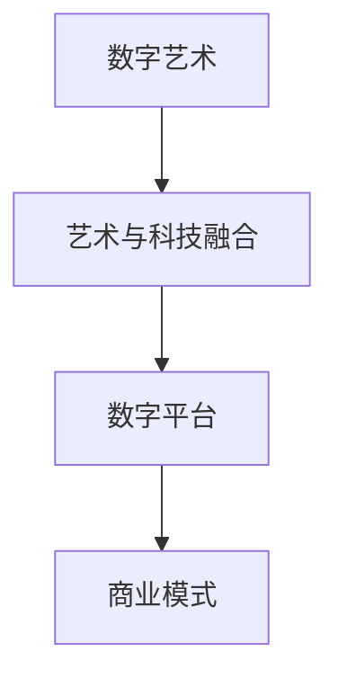

                 

# 数字艺术创业：艺术与科技的完美融合

## 1. 背景介绍

### 1.1 问题由来
随着数字技术的飞速发展，艺术创作和展示的方式也在经历一场颠覆性的变革。数字艺术不仅仅是一种新的艺术表现形式，更是艺术与科技融合的产物。越来越多的艺术家开始使用计算机图形、编程语言、虚拟现实、增强现实等数字技术，创造出前所未有的视觉体验和互动体验。同时，随着互联网的普及和社交媒体的兴起，数字艺术作品可以快速传播，被更多人欣赏和讨论。

### 1.2 问题核心关键点
数字艺术创业的核心关键点在于如何有效结合艺术与科技，通过创新的数字艺术作品吸引观众，并转化为可持续的商业模式。其核心在于以下几点：

1. **创意与技术的结合**：如何将艺术家的创意与最新的技术手段（如机器学习、深度学习、人工智能等）结合，创造出独具特色的数字艺术作品。
2. **数字平台的构建**：如何构建一个能够高效展示、传播和交易数字艺术作品的平台。
3. **商业模式创新**：如何通过数字艺术作品，实现商业价值的最大化。

### 1.3 问题研究意义
数字艺术创业不仅为传统艺术行业带来新机遇，也开辟了数字经济的新空间。它能够打破时空限制，使艺术作品更具互动性和沉浸感，提升观众的体验和参与度。同时，数字艺术作品易于复制和传播，降低了艺术传播的门槛，使得更多人能够接触到优质的艺术作品。数字艺术创业的探索与实践，对于推动艺术与科技的深度融合，激发新的创意和产业形态具有重要意义。

## 2. 核心概念与联系

### 2.1 核心概念概述

为更好地理解数字艺术创业的原理和实践，本节将介绍几个密切相关的核心概念：

- **数字艺术(Digital Art)**：利用数字技术创造的艺术作品，包括计算机图形、交互式装置、虚拟现实、增强现实等。
- **艺术与科技融合**：将艺术创作与最新科技成果（如人工智能、机器学习、虚拟现实等）结合，创造出新的艺术形式。
- **数字平台(Digital Platform)**：基于互联网的在线平台，用于展示、传播和交易数字艺术作品。
- **商业模式(Monetization Model)**：通过数字艺术作品获得收入的方式，包括版权销售、会员订阅、广告收入、授权使用等。

这些核心概念之间的逻辑关系可以通过以下Mermaid流程图来展示：



这个流程图展示出数字艺术创作与展示的过程，以及如何通过数字平台和商业模式实现商业化。

## 3. 核心算法原理 & 具体操作步骤
### 3.1 算法原理概述

数字艺术创业的核心在于艺术与科技的深度融合，利用数字技术创造出独特的艺术作品。其核心算法原理主要包括：

- **数据采集与处理**：通过摄像头、扫描仪等设备采集艺术家的创作过程，或者通过现有艺术品的数据库进行采集。
- **机器学习与深度学习**：利用机器学习和深度学习技术对采集到的数据进行处理，提取特征，生成新的艺术作品。
- **虚拟现实与增强现实**：利用虚拟现实和增强现实技术，创建沉浸式的互动体验，使观众能够更深入地体验艺术作品。
- **智能合约与区块链技术**：利用智能合约和区块链技术，实现数字艺术作品的版权保护和交易。

### 3.2 算法步骤详解

数字艺术创业的算法步骤主要包括以下几个关键步骤：

**Step 1: 数据采集与预处理**
- 收集艺术家的创作数据，包括图像、视频、音频等。
- 对数据进行清洗、去噪、增强等预处理，确保数据质量。

**Step 2: 特征提取与生成**
- 利用深度学习模型（如卷积神经网络CNN、生成对抗网络GAN等）提取数据中的艺术特征。
- 使用生成模型生成新的艺术作品，如通过GAN生成虚拟现实中的艺术品。

**Step 3: 交互设计**
- 设计互动界面和交互逻辑，确保用户能够与数字艺术作品进行互动。
- 利用虚拟现实和增强现实技术，增强互动体验。

**Step 4: 版权保护与交易**
- 利用区块链和智能合约技术，实现数字艺术作品的版权登记和交易。
- 使用智能合约自动执行版权交易，确保交易的透明和安全性。

**Step 5: 平台构建与推广**
- 构建数字艺术展示平台，提供高质量的数字艺术作品展示、互动体验和交易功能。
- 利用社交媒体和数字营销手段，推广平台和作品。

### 3.3 算法优缺点

数字艺术创业的算法具有以下优点：
1. **创新性强**：数字技术与艺术的结合，创造出新的艺术形式，提升观众的体验和参与度。
2. **可复制性强**：数字艺术作品易于复制和传播，降低了艺术传播的门槛。
3. **互动性强**：利用虚拟现实和增强现实技术，提供沉浸式互动体验。
4. **商业模式多样**：结合版权销售、会员订阅、广告收入、授权使用等多种方式，实现商业价值最大化。

同时，该算法也存在一定的局限性：
1. **技术门槛高**：需要掌握计算机图形学、机器学习、区块链等多领域的知识。
2. **版权保护难度大**：数字作品的版权保护较传统艺术品更为复杂。
3. **用户接受度问题**：部分用户可能对新兴的数字艺术形式接受度不高。
4. **技术成本高**：开发和维护数字艺术平台需要较大的技术投入。

尽管存在这些局限性，但就目前而言，数字艺术创业的算法仍然是大有潜力的。未来相关研究的重点在于如何进一步降低技术门槛，提高版权保护效率，同时兼顾用户接受度和技术成本等因素。

### 3.4 算法应用领域

数字艺术创业的算法在多个领域得到了应用，例如：

- **虚拟现实艺术(VR Art)**：利用虚拟现实技术，创造沉浸式的艺术体验。
- **增强现实艺术(AR Art)**：结合现实环境，创造增强现实的互动艺术作品。
- **数字雕塑(Digital Sculpture)**：利用计算机图形学技术，创作数字雕塑作品。
- **交互式装置(Interactive Installations)**：通过传感器和计算机控制，创建交互式的艺术装置。
- **数字版画(Digital Printmaking)**：使用数字技术创作版画作品。
- **动画与游戏设计(Animation & Game Design)**：结合动画和游戏设计，创作互动性的艺术作品。

除了上述这些经典领域外，数字艺术创业的算法也被创新性地应用到更多场景中，如艺术教育、艺术版权管理、艺术创作众包等，为数字艺术产业带来了新的创新和变革。

## 4. 数学模型和公式 & 详细讲解  
### 4.1 数学模型构建

数字艺术创业的数学模型主要包括以下几个方面：

- **计算机视觉模型**：用于图像和视频的采集、处理和特征提取，常用的模型包括卷积神经网络(CNN)、循环神经网络(RNN)等。
- **深度生成模型**：用于生成新的艺术作品，常用的模型包括生成对抗网络(GAN)、变分自编码器(VAE)等。
- **交互设计模型**：用于设计虚拟现实和增强现实中的互动体验，常用的模型包括时序模型、感知模型等。
- **智能合约与区块链模型**：用于实现数字艺术作品的版权保护和交易，常用的模型包括智能合约、区块链共识算法等。

### 4.2 公式推导过程

以下我们以生成对抗网络(GAN)为例，推导其生成模型的公式及其梯度计算。

假设原始数据集为 $\{x_i\}_{i=1}^N$，其中 $x_i \in \mathbb{R}^d$ 为 $N$ 个样本。生成器 $G$ 和判别器 $D$ 分别由神经网络组成，生成器的输入为随机噪声 $z \sim p(z)$，判别器的输入为真实数据 $x$ 和生成数据 $G(z)$。

生成器的输出为 $G(z)$，判别器的输出为 $D(x)$ 和 $D(G(z))$。生成器希望生成与真实数据难以区分的假数据，判别器希望正确区分真实数据和假数据。

训练目标函数为：

$$
\min_G \max_D V(D,G) = \mathbb{E}_{x \sim p(x)} [\log D(x)] + \mathbb{E}_{z \sim p(z)} [\log (1 - D(G(z)))]
$$

其中 $V(D,G)$ 为生成器和判别器的对抗损失函数，$p(x)$ 为真实数据的概率分布，$p(z)$ 为噪声分布。

使用梯度上升的方法优化判别器，使用梯度下降的方法优化生成器。判别器的梯度计算为：

$$
\nabla_D V(D,G) = \frac{1}{N} \sum_{i=1}^N [\nabla_D \log D(x_i) + \nabla_D \log (1 - D(G(z_i)))]
$$

生成器的梯度计算为：

$$
\nabla_G V(D,G) = -\frac{1}{N} \sum_{i=1}^N [\nabla_G \log (1 - D(G(z_i)))]
$$

在得到损失函数的梯度后，即可带入优化算法进行模型训练。重复上述过程直至收敛，最终得到生成器的最优参数 $\theta_G$。

### 4.3 案例分析与讲解

GAN在数字艺术创业中的应用非常广泛，以下是两个典型案例：

**案例1: 虚拟现实艺术展览**
- **需求描述**：设计一个虚拟现实艺术展览，展示艺术家的数字艺术作品，并允许观众进行互动。
- **实现步骤**：
  1. 收集艺术家的创作数据，包括图像和视频。
  2. 使用CNN提取特征，生成新的艺术作品。
  3. 设计虚拟现实场景，将艺术作品嵌入虚拟环境。
  4. 实现观众与艺术作品的互动，如点击、移动、旋转等。
  5. 利用智能合约和区块链技术，保护作品的版权，记录交易信息。

**案例2: 交互式装置设计**
- **需求描述**：设计一个交互式艺术装置，通过传感器和计算机控制，创作实时变化的艺术作品。
- **实现步骤**：
  1. 收集装置环境数据，包括光线、温度、声音等。
  2. 使用RNN处理环境数据，提取特征。
  3. 设计互动逻辑，控制装置的行为和艺术作品的变化。
  4. 实现观众与装置的互动，如通过手势、声音控制作品。
  5. 利用区块链技术，记录互动数据和作品展示信息。

这些案例展示了数字艺术创业在虚拟现实和交互设计领域的应用，通过算法实现艺术与科技的深度融合，创造出独特、沉浸的艺术体验。

## 5. 项目实践：代码实例和详细解释说明
### 5.1 开发环境搭建

在进行数字艺术创业的实践前，我们需要准备好开发环境。以下是使用Python进行PyTorch开发的环境配置流程：

1. 安装Anaconda：从官网下载并安装Anaconda，用于创建独立的Python环境。

2. 创建并激活虚拟环境：
```bash
conda create -n digital_art_env python=3.8 
conda activate digital_art_env
```

3. 安装PyTorch：根据CUDA版本，从官网获取对应的安装命令。例如：
```bash
conda install pytorch torchvision torchaudio cudatoolkit=11.1 -c pytorch -c conda-forge
```

4. 安装TensorFlow：如果需要，可以安装TensorFlow。

5. 安装各类工具包：
```bash
pip install numpy pandas scikit-learn matplotlib tqdm jupyter notebook ipython
```

完成上述步骤后，即可在`digital_art_env`环境中开始实践。

### 5.2 源代码详细实现

这里我们以生成对抗网络(GAN)为例，展示数字艺术创业的代码实现。

```python
import torch
import torch.nn as nn
import torch.optim as optim
from torchvision import datasets, transforms

# 定义生成器
class Generator(nn.Module):
    def __init__(self, z_dim, out_channels):
        super(Generator, self).__init__()
        self.fc1 = nn.Linear(z_dim, 256)
        self.fc2 = nn.Linear(256, 128)
        self.fc3 = nn.Linear(128, out_channels)
        
    def forward(self, x):
        x = self.fc1(x)
        x = self.fc2(x)
        x = self.fc3(x)
        return x

# 定义判别器
class Discriminator(nn.Module):
    def __init__(self, in_channels):
        super(Discriminator, self).__init__()
        self.fc1 = nn.Linear(in_channels, 128)
        self.fc2 = nn.Linear(128, 256)
        self.fc3 = nn.Linear(256, 1)
        
    def forward(self, x):
        x = self.fc1(x)
        x = self.fc2(x)
        x = self.fc3(x)
        return x

# 定义损失函数
def gen_loss(D, G, x_real, x_fake):
    real_loss = -torch.mean(torch.log(D(x_real)))
    fake_loss = -torch.mean(torch.log(1 - D(x_fake)))
    loss = real_loss + fake_loss
    return loss

# 定义优化器
optimizer_G = optim.Adam(G.parameters(), lr=0.0002)
optimizer_D = optim.Adam(D.parameters(), lr=0.0002)

# 训练模型
for epoch in range(100):
    for batch_idx, (x, _) in enumerate(train_loader):
        x = x.to(device)
        
        # 生成假数据
        z = torch.randn(batch_size, z_dim).to(device)
        x_fake = G(z)
        
        # 训练判别器
        optimizer_D.zero_grad()
        D_real = D(x_real)
        D_fake = D(x_fake)
        D_real_loss = gen_loss(D, G, x_real, x_fake)
        D_fake_loss = gen_loss(D, G, x_fake, x_fake)
        D_loss = D_real_loss + D_fake_loss
        D_loss.backward()
        optimizer_D.step()
        
        # 训练生成器
        optimizer_G.zero_grad()
        D_fake = D(x_fake)
        G_loss = gen_loss(D, G, x_fake, x_fake)
        G_loss.backward()
        optimizer_G.step()
        
    print(f"Epoch {epoch+1}, D_loss: {D_loss.item()}, G_loss: {G_loss.item()}")
```

以上代码展示了如何使用PyTorch实现一个简单的生成对抗网络(GAN)，用于生成数字艺术作品。

### 5.3 代码解读与分析

让我们再详细解读一下关键代码的实现细节：

**Generator类**：
- `__init__`方法：定义生成器的结构，包括两个全连接层和一个输出层。
- `forward`方法：定义生成器的前向传播过程。

**Discriminator类**：
- `__init__`方法：定义判别器的结构，包括两个全连接层和一个输出层。
- `forward`方法：定义判别器的前向传播过程。

**gen_loss函数**：
- 定义生成器和判别器的对抗损失函数，用于训练生成器和判别器。

**optimizer变量**：
- 定义优化器的参数，用于更新模型参数。

**训练模型**：
- 循环迭代epoch次数，每次训练一个batch的数据。
- 在每个batch上，先生成假数据，然后训练判别器和生成器。
- 分别计算判别器和生成器的损失函数，并回传梯度进行参数更新。

这个例子展示了如何使用PyTorch实现一个简单的GAN，用于生成数字艺术作品。需要注意的是，实际应用中可能需要更加复杂的模型和更精细的训练策略，以获得更好的效果。

## 6. 实际应用场景
### 6.1 数字艺术展览

数字艺术展览是数字艺术创业的一个重要应用场景。通过虚拟现实技术，观众可以在虚拟环境中参观艺术展览，欣赏到不同艺术家的数字艺术作品。此外，数字艺术展览还可以提供互动体验，增强观众的参与感。

**案例1: VR艺术展览平台**
- **需求描述**：开发一个VR艺术展览平台，展示艺术家的数字艺术作品，并允许观众进行互动。
- **实现步骤**：
  1. 收集艺术家的创作数据，包括图像和视频。
  2. 使用CNN提取特征，生成新的艺术作品。
  3. 设计虚拟现实场景，将艺术作品嵌入虚拟环境。
  4. 实现观众与艺术作品的互动，如点击、移动、旋转等。
  5. 利用智能合约和区块链技术，保护作品的版权，记录交易信息。

**案例2: 增强现实艺术装置**
- **需求描述**：设计一个增强现实艺术装置，通过传感器和计算机控制，创作实时变化的艺术作品。
- **实现步骤**：
  1. 收集装置环境数据，包括光线、温度、声音等。
  2. 使用RNN处理环境数据，提取特征。
  3. 设计互动逻辑，控制装置的行为和艺术作品的变化。
  4. 实现观众与装置的互动，如通过手势、声音控制作品。
  5. 利用区块链技术，记录互动数据和作品展示信息。

### 6.2 数字艺术教育

数字艺术教育是数字艺术创业的另一个重要应用场景。通过虚拟现实和增强现实技术，学生可以在虚拟环境中进行艺术创作和学习，提升艺术技能和创意能力。

**案例1: VR艺术创作课程**
- **需求描述**：开发一个VR艺术创作课程，学生可以在虚拟环境中进行艺术创作，并进行互动和交流。
- **实现步骤**：
  1. 设计虚拟艺术创作环境，包括虚拟画室、虚拟雕塑室等。
  2. 提供虚拟画笔、虚拟刀具等工具，供学生创作使用。
  3. 实现学生之间的互动和交流，如讨论作品、分享创作心得等。
  4. 利用智能合约和区块链技术，保护学生的创作版权，记录创作过程。

**案例2: AR艺术导览系统**
- **需求描述**：开发一个AR艺术导览系统，学生可以通过手机或平板，查看现实环境中的艺术作品。
- **实现步骤**：
  1. 收集现实环境中的艺术作品，包括图片和视频。
  2. 使用AR技术，将艺术作品投影到现实环境中。
  3. 提供互动功能，如点击、旋转、放大等。
  4. 记录学生的浏览记录和互动信息，供学习评估和分析使用。

### 6.3 数字艺术版权管理

数字艺术版权管理是数字艺术创业的重要保障。通过区块链和智能合约技术，可以有效保护数字艺术作品的版权，防止侵权和盗版。

**案例1: 数字版权登记平台**
- **需求描述**：开发一个数字版权登记平台，艺术家可以在平台上登记其数字艺术作品的版权信息。
- **实现步骤**：
  1. 设计平台界面，艺术家可以在线登记版权信息。
  2. 利用区块链技术，将版权信息记录在区块链上。
  3. 提供版权信息查询和验证功能。
  4. 利用智能合约，自动执行版权交易和授权使用。

**案例2: 数字艺术交易平台**
- **需求描述**：开发一个数字艺术交易平台，艺术家可以出售其数字艺术作品，买家可以购买和收藏作品。
- **实现步骤**：
  1. 设计平台界面，艺术家可以发布和展示作品。
  2. 提供作品交易功能，买家可以购买和收藏作品。
  3. 利用智能合约，自动执行作品交易和支付。
  4. 记录交易信息，保护版权，确保交易透明和安全。

## 7. 工具和资源推荐
### 7.1 学习资源推荐

为了帮助开发者系统掌握数字艺术创业的理论基础和实践技巧，这里推荐一些优质的学习资源：

1. **《数字艺术与计算机视觉》**：一本详细介绍数字艺术与计算机视觉技术的书籍，涵盖图像处理、生成模型等核心内容。
2. **《数字艺术与虚拟现实》**：一本详细介绍虚拟现实技术的书籍，涵盖虚拟现实艺术展览、交互设计等内容。
3. **《区块链与数字艺术》**：一本详细介绍区块链技术的书籍，涵盖智能合约、数字版权管理等内容。
4. **《深度学习与艺术创作》**：一本详细介绍深度学习在艺术创作中应用的书籍，涵盖GAN、CNN等技术。
5. **《数字艺术创业实战指南》**：一本详细介绍数字艺术创业的实战指南，涵盖平台开发、商业模式等内容。

通过学习这些资源，相信你一定能够快速掌握数字艺术创业的理论基础和实践技巧，并用于解决实际的创业问题。

### 7.2 开发工具推荐

高效的开发离不开优秀的工具支持。以下是几款用于数字艺术创业开发的常用工具：

1. **PyTorch**：基于Python的开源深度学习框架，灵活动态的计算图，适合快速迭代研究。大部分预训练语言模型都有PyTorch版本的实现。
2. **TensorFlow**：由Google主导开发的开源深度学习框架，生产部署方便，适合大规模工程应用。同样有丰富的预训练语言模型资源。
3. **Unity3D**：一款跨平台的3D游戏引擎，支持虚拟现实和增强现实开发，是实现虚拟艺术展览的重要工具。
4. **Unreal Engine**：一款跨平台的3D游戏引擎，支持虚拟现实和增强现实开发，是实现增强现实艺术装置的重要工具。
5. **Blockchain Explorer**：用于查看区块链上的交易信息和版权信息，方便艺术家和用户查询。

合理利用这些工具，可以显著提升数字艺术创业的开发效率，加快创新迭代的步伐。

### 7.3 相关论文推荐

数字艺术创业的研究源于学界的持续研究。以下是几篇奠基性的相关论文，推荐阅读：

1. **《虚拟现实中的艺术创作》**：介绍虚拟现实技术在艺术创作中的应用。
2. **《数字艺术与区块链技术》**：探讨数字艺术版权保护和交易的技术。
3. **《生成对抗网络在艺术创作中的应用》**：研究生成对抗网络在数字艺术创作中的应用。
4. **《数字艺术教育与虚拟现实》**：探讨虚拟现实技术在数字艺术教育中的应用。
5. **《数字艺术创业与商业模式》**：探讨数字艺术创业的商业模式和应用场景。

这些论文代表了大艺术创业研究的发展脉络。通过学习这些前沿成果，可以帮助研究者把握学科前进方向，激发更多的创新灵感。

## 8. 总结：未来发展趋势与挑战

### 8.1 总结

本文对数字艺术创业进行了全面系统的介绍。首先阐述了数字艺术创业的背景和意义，明确了数字艺术与科技结合的核心价值。其次，从原理到实践，详细讲解了数字艺术创业的数学模型和关键步骤，给出了数字艺术创业的代码实例。同时，本文还广泛探讨了数字艺术创业在多个领域的应用前景，展示了数字艺术创业的广阔空间。最后，本文精选了数字艺术创业的学习资源、开发工具和相关论文，力求为读者提供全方位的技术指引。

通过本文的系统梳理，可以看到，数字艺术创业不仅为传统艺术行业带来新机遇，也开辟了数字经济的新空间。它能够打破时空限制，使艺术作品更具互动性和沉浸感，提升观众的体验和参与度。数字艺术创业的探索与实践，对于推动艺术与科技的深度融合，激发新的创意和产业形态具有重要意义。

### 8.2 未来发展趋势

展望未来，数字艺术创业将呈现以下几个发展趋势：

1. **技术融合加速**：数字艺术创业将继续与其他新兴技术进行深度融合，如5G、物联网、人工智能等，推动艺术形式和展示方式的创新。
2. **跨界合作加强**：数字艺术创业将更加注重跨界合作，如艺术与科技、艺术与音乐、艺术与时尚等，拓展艺术创作和展示的多样性。
3. **社会影响力增强**：数字艺术创业将进一步影响社会文化和生活方式，提升公众的艺术素养和文化水平。
4. **商业模式创新**：数字艺术创业将探索更多商业模式，如艺术拍卖、艺术投资、艺术衍生品等，实现经济价值的最大化。
5. **全球化进程加快**：数字艺术创业将加速全球化进程，促进不同文化背景下的艺术交流与合作。

这些趋势凸显了数字艺术创业的广阔前景。这些方向的探索发展，必将进一步提升数字艺术作品的传播力和影响力，为艺术与科技的融合注入新的活力。

### 8.3 面临的挑战

尽管数字艺术创业已经取得了显著成果，但在迈向更加智能化、普适化应用的过程中，它仍面临诸多挑战：

1. **技术门槛高**：数字艺术创业需要掌握计算机图形学、机器学习、区块链等多领域的知识，技术门槛较高。
2. **版权保护难度大**：数字作品的版权保护较传统艺术品更为复杂，需要创新技术手段。
3. **用户体验问题**：部分用户对新兴的数字艺术形式接受度不高，需要更多的用户体验优化。
4. **技术成本高**：开发和维护数字艺术平台需要较大的技术投入，可能面临资金压力。

尽管存在这些挑战，但数字艺术创业依然是大有潜力的。未来相关研究的重点在于如何进一步降低技术门槛，提高版权保护效率，同时兼顾用户接受度和技术成本等因素。

### 8.4 研究展望

面对数字艺术创业所面临的种种挑战，未来的研究需要在以下几个方面寻求新的突破：

1. **技术融合与创新**：探索数字艺术与其他新兴技术的深度融合，如5G、物联网、人工智能等，推动艺术形式和展示方式的创新。
2. **版权保护技术**：研究更加高效、安全的版权保护技术，如区块链智能合约、数字指纹等，确保数字作品的知识产权。
3. **用户体验优化**：设计更加直观、易用的数字艺术平台和作品，提升用户体验，促进数字艺术的普及和传播。
4. **商业模式探索**：探索更多数字艺术创业的商业模式，如艺术拍卖、艺术投资、艺术衍生品等，实现经济价值的最大化。
5. **全球化合作**：加强全球范围内的艺术合作与交流，推动数字艺术全球化进程，促进文化多样性。

这些研究方向的探索，必将引领数字艺术创业迈向更高的台阶，为艺术与科技的融合注入新的活力。面向未来，数字艺术创业技术还需要与其他人工智能技术进行更深入的融合，如知识表示、因果推理、强化学习等，多路径协同发力，共同推动数字艺术作品的创新和传播。只有勇于创新、敢于突破，才能不断拓展数字艺术作品的边界，让数字艺术创业技术更好地造福人类社会。

## 9. 附录：常见问题与解答

**Q1: 数字艺术创业如何与其他技术进行融合？**

A: 数字艺术创业可以通过与其他技术的融合，创造出更加多样化和互动性的艺术作品。例如，可以将虚拟现实技术融入数字艺术创作和展示中，提供沉浸式的互动体验。或者将区块链技术应用于数字艺术作品的版权保护和交易，确保作品的独特性和真实性。此外，还可以将人工智能技术用于艺术作品的生成和创作，提高创作的效率和多样性。

**Q2: 数字艺术创业如何保护数字作品的版权？**

A: 数字艺术创业可以通过区块链和智能合约技术，实现数字作品的版权保护和交易。具体来说，可以使用区块链技术记录作品的创作信息和版权信息，确保信息的不可篡改性和可追溯性。利用智能合约技术，自动执行版权交易和授权使用，确保交易的透明和安全性。此外，还可以通过数字指纹等技术，对作品进行唯一标识，防止盗版和侵权。

**Q3: 数字艺术创业如何吸引用户？**

A: 数字艺术创业可以通过多种方式吸引用户，包括：
1. 提供高质量的数字艺术作品，满足用户的艺术需求。
2. 设计易用的交互界面和互动体验，提升用户的参与感。
3. 开展多种形式的营销活动，如线上展览、艺术比赛等，增加作品的曝光度和吸引力。
4. 与艺术家、机构、学校等合作，建立广泛的艺术社区，促进用户间的交流和互动。
5. 提供优惠和折扣，吸引新用户试用和注册。

这些措施可以帮助数字艺术创业吸引更多的用户，提升平台的知名度和影响力。

**Q4: 数字艺术创业如何实现盈利？**

A: 数字艺术创业可以通过多种方式实现盈利，包括：
1. 销售数字艺术作品的版权，如在线下载、授权使用等。
2. 提供会员订阅服务，收取用户的订阅费用。
3. 开展艺术拍卖、艺术投资等业务，获得交易佣金和增值服务收入。
4. 通过广告收入、品牌合作等方式，增加平台的商业价值。
5. 提供数据分析和人工智能服务等增值服务，收取服务费用。

这些盈利方式可以帮助数字艺术创业实现可持续的发展，提供更多的商业机会和价值。

---

作者：禅与计算机程序设计艺术 / Zen and the Art of Computer Programming

