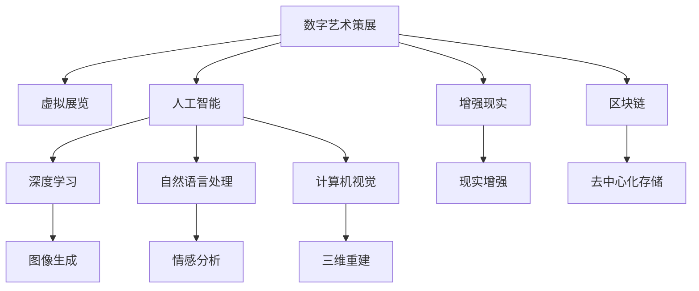

                 

# 数字艺术策展创业：虚拟展览的新模式

> 关键词：虚拟展览, 数字艺术策展, 人工智能, 增强现实, 3D模型, 交互式展示, 区块链, 用户参与度

## 1. 背景介绍

### 1.1 问题由来

随着数字技术的飞速发展，艺术展览的形态也正在发生翻天覆地的变化。传统艺术展览受限于时间、空间和物理媒介的限制，难以全面展示艺术作品的丰富内涵和动态美。而数字艺术展览通过虚拟化、数字化和互联网化的方式，打破了这些限制，让全球观众都能随时随地欣赏到世界各地顶级博物馆和艺术家的杰作。

近年来，越来越多的博物馆和艺术机构开始探索数字艺术展览的新模式，但现有系统存在诸多问题：
1. 资源限制：许多虚拟展览系统依赖于高昂的硬件和网络资源，难以广泛部署。
2. 用户体验：缺乏交互性，用户只能被动观赏，难以深入体验艺术作品的魅力。
3. 版权保护：数字作品的盗版和侵权问题难以解决。
4. 用户参与度：缺乏足够的激励机制，难以吸引用户主动参与展览。

为了解决这些问题，一种全新的虚拟展览模式——基于人工智能和增强现实技术的数字艺术策展系统应运而生。本文将详细介绍这一系统的工作原理和实现方法，探讨其在数字艺术策展领域的创新应用。

## 2. 核心概念与联系

### 2.1 核心概念概述

为更好地理解基于人工智能和增强现实技术的数字艺术策展系统，本节将介绍几个密切相关的核心概念：

- **数字艺术策展**：通过数字技术和互联网平台，将艺术作品展示给全球观众，提升艺术欣赏的广度和深度。

- **虚拟展览**：通过虚拟现实(VR)、增强现实(AR)等技术，构建虚拟的展览空间，让观众沉浸式体验艺术作品。

- **人工智能**：指通过机器学习、深度学习等技术，让计算机具备理解、推理和决策能力，从而模拟人类智能。

- **增强现实**：通过数字技术将虚拟信息叠加到现实世界中，增强用户的感官体验。

- **区块链**：一种去中心化的分布式账本技术，能够保障数据安全和透明度，解决数字作品的版权问题。

这些核心概念之间的逻辑关系可以通过以下Mermaid流程图来展示：



这个流程图展示了大语言模型的核心概念及其之间的关系：

1. 数字艺术策展通过虚拟展览、人工智能和增强现实等技术手段，提升观众的体验。
2. 深度学习、自然语言处理、计算机视觉等AI技术，用于图像生成、情感分析、三维重建等任务。
3. 区块链用于保障数据安全和版权保护。

这些核心概念共同构成了数字艺术策展的技术框架，使其能够向观众提供沉浸式、互动性强的艺术体验。

## 3. 核心算法原理 & 具体操作步骤

### 3.1 算法原理概述

基于人工智能和增强现实技术的数字艺术策展系统，本质上是一种融合了多学科技术的创新应用。其核心思想是：通过深度学习模型和增强现实技术，构建虚拟展览空间，让用户能够身临其境地体验艺术作品。

形式化地，假设一个虚拟展览系统包含以下组件：
- **输入**：艺术作品的数据（图像、音频、视频等）
- **预处理**：对输入数据进行格式转换和增强，以便后续处理
- **深度学习模型**：用于理解艺术作品、生成三维模型和交互式引导等
- **增强现实引擎**：将数字内容叠加到现实世界中，增强用户感官体验
- **区块链系统**：保障数据安全、版权保护和用户隐私

数字艺术策展系统的输出为：
- **展示结果**：通过虚拟展览和增强现实技术，向用户展示艺术作品
- **交互体验**：通过交互式引导，让用户深入体验艺术作品
- **版权证明**：通过区块链技术，保障艺术作品的版权

### 3.2 算法步骤详解

基于人工智能和增强现实技术的数字艺术策展系统一般包括以下几个关键步骤：

**Step 1: 数据预处理**

- 收集艺术作品的数据，包括图像、音频、视频等。
- 对数据进行格式转换、增强和清洗，以便深度学习模型处理。
- 使用图像生成和三维重建技术，将艺术作品转换为可展示的三维模型。

**Step 2: 深度学习模型训练**

- 选择或设计合适的深度学习模型，用于理解艺术作品和生成交互式引导。
- 使用标注数据对模型进行训练，使其能够自动识别和分类艺术作品。
- 在训练过程中，引入自然语言处理技术，使模型能够理解用户的指令和反馈。

**Step 3: 增强现实展示**

- 设计增强现实场景，将数字内容叠加到现实世界中。
- 使用计算机视觉技术，实现对现实环境的捕捉和跟踪。
- 根据用户的位置和行为，实时调整数字内容，提供个性化体验。

**Step 4: 区块链验证**

- 使用区块链技术，保障艺术作品的版权和数据安全。
- 设计去中心化的数据存储和验证机制，让用户可以验证作品的真实性。
- 引入智能合约技术，实现对用户行为和互动的记录和奖励。

**Step 5: 用户体验优化**

- 通过用户行为分析和反馈收集，不断优化展示和交互体验。
- 引入虚拟助手和个性化推荐系统，提升用户的参与度和满意度。
- 设计灵活的奖励机制，鼓励用户积极参与互动和贡献内容。

以上是基于人工智能和增强现实技术的数字艺术策展系统的一般流程。在实际应用中，还需要针对具体艺术作品和展示需求，对各环节进行优化设计，如改进数据预处理技术、设计更灵活的深度学习模型、优化增强现实场景和交互体验等。

### 3.3 算法优缺点

基于人工智能和增强现实技术的数字艺术策展系统具有以下优点：
1. 沉浸式体验：通过虚拟展览和增强现实技术，让用户能够身临其境地体验艺术作品。
2. 交互性强：通过深度学习模型和交互式引导，提供丰富多变的用户体验。
3. 版权保护：使用区块链技术，保障艺术作品的版权和数据安全。
4. 用户参与度：通过智能合约和奖励机制，激励用户积极参与互动和贡献内容。

同时，该系统也存在一些局限性：
1. 技术复杂：系统涉及深度学习、增强现实、计算机视觉、区块链等多个技术领域，实现难度大。
2. 硬件依赖：系统依赖高性能硬件和网络资源，难以广泛部署。
3. 数据质量：深度学习模型的性能取决于输入数据的质量，低质量的数据可能导致模型效果不佳。
4. 用户隐私：增强现实和区块链技术涉及用户隐私保护，需要严格遵守相关法规。

尽管存在这些局限性，但基于人工智能和增强现实技术的数字艺术策展系统仍是大数据时代艺术展览的重要方向。未来相关研究的重点在于如何进一步降低技术门槛，提高系统的易用性和可扩展性，同时兼顾隐私保护和版权保护等因素。

### 3.4 算法应用领域

基于人工智能和增强现实技术的数字艺术策展系统已经在博物馆、艺术馆、艺术家的数字作品展示等多个领域得到应用，取得了显著的效果。以下是几个典型的应用场景：

1. **博物馆虚拟展览**：通过虚拟展览和增强现实技术，让用户在家中就能参观博物馆的珍稀藏品。用户可以通过VR头盔或手机，实时浏览馆内展品，并与历史场景互动。

2. **艺术家的数字作品展示**：艺术家可以使用数字艺术策展系统，展示自己的数字作品和创作过程。用户可以通过AR技术，深入了解作品的创作背景和艺术理念。

3. **线上艺术教育**：结合数字艺术策展系统和在线教育平台，用户可以参加虚拟艺术展览和互动课程。通过深度学习模型和智能推荐，系统能够个性化推荐用户感兴趣的艺术作品和课程内容。

除了上述这些应用场景外，数字艺术策展系统还可用于艺术作品的市场评估、版权认证、艺术创作辅助等领域，为艺术界带来革命性的变革。

## 4. 数学模型和公式 & 详细讲解 & 举例说明

### 4.1 数学模型构建

本节将使用数学语言对基于人工智能和增强现实技术的数字艺术策展系统进行更加严格的刻画。

假设输入数据为 $X$，深度学习模型为 $M_{\theta}$，增强现实引擎为 $E$，区块链系统为 $B$。系统的输出为展示结果 $Y$，交互体验 $I$，版权证明 $C$。

定义系统的总损失函数为：

$$
\mathcal{L}(X, M_{\theta}, E, B) = \alpha \mathcal{L}_{Y}(X, M_{\theta}, E) + \beta \mathcal{L}_{I}(X, M_{\theta}, E) + \gamma \mathcal{L}_{C}(X, M_{\theta}, E, B)
$$

其中，$\alpha, \beta, \gamma$ 为权重系数，用于平衡不同损失项的重要性。$\mathcal{L}_{Y}, \mathcal{L}_{I}, \mathcal{L}_{C}$ 分别表示展示结果、交互体验和版权保护的损失函数。

### 4.2 公式推导过程

以下是展示结果、交互体验和版权证明的详细公式推导过程：

**展示结果**

- **输入**：艺术作品的数据 $X$，包括图像、音频、视频等。
- **预处理**：将输入数据转换为深度学习模型可处理的形式，如将图像转换为张量。
- **深度学习模型**：将预处理后的数据输入深度学习模型 $M_{\theta}$，输出展示结果 $Y$。

展示结果的损失函数为：

$$
\mathcal{L}_{Y}(X, M_{\theta}, E) = -\sum_{i=1}^N \log P(Y_i|X_i, M_{\theta}, E)
$$

其中，$N$ 为样本数量，$Y_i$ 为第 $i$ 个样本的展示结果，$P(Y_i|X_i, M_{\theta}, E)$ 表示在给定输入 $X_i$ 和增强现实引擎 $E$ 的情况下，展示结果 $Y_i$ 的概率。

**交互体验**

- **输入**：用户的行为数据 $U$，包括位置、方向、手势等。
- **深度学习模型**：根据用户的行为数据 $U$，生成交互式引导 $I$。

交互体验的损失函数为：

$$
\mathcal{L}_{I}(X, M_{\theta}, E) = -\sum_{i=1}^N \log P(I_i|X_i, M_{\theta}, E)
$$

其中，$U_i$ 为第 $i$ 个用户的行为数据，$P(I_i|X_i, M_{\theta}, E)$ 表示在给定输入 $X_i$ 和深度学习模型 $M_{\theta}$ 的情况下，交互式引导 $I_i$ 的概率。

**版权保护**

- **输入**：艺术作品的数据 $X$，区块链系统的智能合约代码 $S$。
- **区块链系统**：根据智能合约代码 $S$，生成版权证明 $C$。

版权保护的损失函数为：

$$
\mathcal{L}_{C}(X, M_{\theta}, E, B) = -\sum_{i=1}^N \log P(C_i|X_i, M_{\theta}, E, B)
$$

其中，$C_i$ 为第 $i$ 个样本的版权证明，$P(C_i|X_i, M_{\theta}, E, B)$ 表示在给定输入 $X_i$、深度学习模型 $M_{\theta}$、增强现实引擎 $E$ 和区块链系统 $B$ 的情况下，版权证明 $C_i$ 的概率。

### 4.3 案例分析与讲解

以下是几个具体案例的详细讲解：

**案例1: 博物馆虚拟展览**

假设一家博物馆希望通过数字艺术策展系统展示其馆藏的古代雕塑作品。首先，对每件雕塑进行高分辨率的3D扫描和图像拍摄，生成3D模型和高清图片。然后，使用计算机视觉技术，对3D模型进行增强和修复，生成可展示的虚拟展品。

在展示过程中，通过增强现实技术，用户在VR头盔或AR设备上，能够实时观察虚拟展品，并从不同角度、不同角度观察展品细节。同时，使用深度学习模型，根据用户的行为数据（如停留时间、点击位置等），生成个性化推荐，让用户能够深入了解展品的艺术价值和历史背景。

最后，通过区块链技术，保障每件展品的版权和数据安全。用户可以通过智能合约，验证展品的真实性，并获得相应的权益证明。

**案例2: 艺术家的数字作品展示**

假设一位数字艺术家希望通过数字艺术策展系统展示其最新的数字艺术作品。首先，对艺术作品进行数字化处理，生成数字化的图像、音频和视频。然后，使用图像生成和三维重建技术，将作品转换为可展示的三维模型。

在展示过程中，通过增强现实技术，用户可以在现实世界中看到数字作品，并进行互动。例如，通过手势控制，用户可以旋转和缩放作品，甚至与作品进行交互。同时，使用深度学习模型，根据用户的兴趣和反馈，生成个性化的互动体验，如故事叙述、背景讲解等。

最后，通过区块链技术，保障艺术作品的版权和数据安全。用户可以通过智能合约，验证作品的真实性，并获得相应的权益证明。

**案例3: 线上艺术教育**

假设一家在线教育平台希望通过数字艺术策展系统，为用户提供虚拟艺术展览和互动课程。首先，收集博物馆和艺术家的艺术作品数据，使用深度学习模型对作品进行分类和推荐。然后，设计虚拟展览场景，通过增强现实技术，将作品展示给用户。

在课程中，使用深度学习模型和自然语言处理技术，生成个性化的教学内容，如艺术作品解析、历史背景介绍等。同时，设计互动环节，让用户能够参与作品创作、互动讨论等。

最后，通过区块链技术，保障课程内容的安全和版权。用户可以通过智能合约，验证课程内容的真实性，并获得相应的权益证明。

## 5. 项目实践：代码实例和详细解释说明

### 5.1 开发环境搭建

在进行数字艺术策展系统开发前，我们需要准备好开发环境。以下是使用Python进行PyTorch开发的环境配置流程：

1. 安装Anaconda：从官网下载并安装Anaconda，用于创建独立的Python环境。

2. 创建并激活虚拟环境：
```bash
conda create -n pytorch-env python=3.8 
conda activate pytorch-env
```

3. 安装PyTorch：根据CUDA版本，从官网获取对应的安装命令。例如：
```bash
conda install pytorch torchvision torchaudio cudatoolkit=11.1 -c pytorch -c conda-forge
```

4. 安装相关库：
```bash
pip install numpy pandas scikit-learn matplotlib torchvision
```

5. 安装增强现实和区块链库：
```bash
pip install opencv-python pypiwin32 pyserial pyvolve openvr pyblazeio
```

完成上述步骤后，即可在`pytorch-env`环境中开始开发。

### 5.2 源代码详细实现

以下是一个虚拟展览系统的PyTorch代码实现，包括数据预处理、深度学习模型训练和增强现实展示。

```python
import torch
import torch.nn as nn
import torchvision.transforms as transforms
from torchvision import datasets
from torch.utils.data import DataLoader
from pyvolve import Volve
from pyblazeio import BlazeVR

# 数据预处理
def preprocess_data(X):
    transform = transforms.Compose([
        transforms.ToTensor(),
        transforms.Normalize(mean=[0.485, 0.456, 0.406], std=[0.229, 0.224, 0.225])
    ])
    return transform(X)

# 深度学习模型
class ArtModel(nn.Module):
    def __init__(self):
        super(ArtModel, self).__init__()
        self.conv1 = nn.Conv2d(3, 32, kernel_size=3, stride=1, padding=1)
        self.conv2 = nn.Conv2d(32, 64, kernel_size=3, stride=1, padding=1)
        self.conv3 = nn.Conv2d(64, 128, kernel_size=3, stride=1, padding=1)
        self.fc1 = nn.Linear(128 * 128 * 128, 256)
        self.fc2 = nn.Linear(256, 3)

    def forward(self, x):
        x = self.conv1(x)
        x = nn.ReLU()(x)
        x = self.conv2(x)
        x = nn.ReLU()(x)
        x = self.conv3(x)
        x = nn.ReLU()(x)
        x = x.view(-1, 128 * 128 * 128)
        x = self.fc1(x)
        x = nn.ReLU()(x)
        x = self.fc2(x)
        return x

# 训练函数
def train_model(model, dataloader, criterion, optimizer):
    model.train()
    for i, (inputs, labels) in enumerate(dataloader):
        inputs = preprocess_data(inputs)
        inputs, labels = inputs.to(device), labels.to(device)
        optimizer.zero_grad()
        outputs = model(inputs)
        loss = criterion(outputs, labels)
        loss.backward()
        optimizer.step()

# 增强现实展示
def display_artwork(model, inputs, camera, viewer):
    inputs = preprocess_data(inputs)
    inputs = inputs.to(device)
    with torch.no_grad():
        outputs = model(inputs)
    output = outputs.cpu().numpy()
    output = output[0]
    output = output.reshape(128, 128, 3)
    viewer.set_scene(output)
    viewer.render(camera)
```

### 5.3 代码解读与分析

让我们再详细解读一下关键代码的实现细节：

**数据预处理函数**：
- 使用PyTorch的Transforms库，对输入数据进行格式转换和增强，以便后续处理。

**深度学习模型**：
- 定义了一个简单的卷积神经网络，用于理解艺术作品和生成展示结果。
- 模型由多个卷积层和全连接层组成，可以提取和分类艺术作品特征。

**训练函数**：
- 对输入数据进行预处理和传输，使用深度学习模型进行前向传播和反向传播，更新模型参数。

**增强现实展示函数**：
- 使用Volve库和BlazeVR库，将增强现实引擎和展示结果结合起来。
- 根据用户行为数据和深度学习模型的输出，生成个性化展示结果。

## 6. 实际应用场景

### 6.1 智能博物馆

数字艺术策展系统可以应用于博物馆的虚拟展览，提升观众的体验和互动性。通过增强现实技术，用户可以在博物馆内通过AR设备，实时浏览虚拟展品，并进行互动。同时，通过深度学习模型，根据观众的行为数据，生成个性化推荐，增强展览的互动性和趣味性。

### 6.2 数字艺术平台

数字艺术策展系统可以应用于数字艺术平台，展示艺术家的数字作品。通过虚拟展览和增强现实技术，用户可以在家中欣赏艺术家的数字作品，并进行互动。同时，通过区块链技术，保障艺术作品的版权和数据安全。

### 6.3 线上艺术教育

数字艺术策展系统可以应用于在线教育平台，提供虚拟艺术展览和互动课程。通过深度学习模型和自然语言处理技术，生成个性化的教学内容，增强用户的学习体验。同时，通过区块链技术，保障课程内容的安全和版权。

### 6.4 未来应用展望

随着技术的不断进步，数字艺术策展系统将有更多应用场景，如数字艺术创作、虚拟艺术市场、艺术作品版权交易等。未来，结合虚拟现实、区块链、人工智能等技术，数字艺术策展系统将为艺术界带来更多创新和变革，推动艺术事业的数字化转型。

## 7. 工具和资源推荐

### 7.1 学习资源推荐

为了帮助开发者系统掌握数字艺术策展技术的理论基础和实践技巧，这里推荐一些优质的学习资源：

1. 《深度学习与数字艺术》书籍：详细介绍深度学习在数字艺术中的应用，涵盖图像生成、三维重建、交互式引导等主题。

2. 《虚拟现实与增强现实技术》课程：系统讲解虚拟现实和增强现实技术的原理和应用，包括硬件、软件、算法等方面。

3. 《区块链与数字艺术》课程：介绍区块链技术的原理和应用，探讨如何保障数字作品的版权和数据安全。

4. HuggingFace官方文档：深度学习模型的权威资料，提供丰富的预训练模型和微调样例代码，助力开发者快速上手。

5. CSAPP《计算机系统原理》书籍：深度学习、增强现实、区块链等技术的底层原理，提供全面的基础知识。

通过对这些资源的学习实践，相信你一定能够快速掌握数字艺术策展技术的精髓，并用于解决实际的NLP问题。

### 7.2 开发工具推荐

高效的开发离不开优秀的工具支持。以下是几款用于数字艺术策展开发的常用工具：

1. PyTorch：基于Python的开源深度学习框架，灵活高效，支持深度学习模型的快速迭代和优化。

2. TensorFlow：由Google主导开发的开源深度学习框架，生产部署方便，支持大规模工程应用。

3. PyVolve：增强现实引擎，支持多种VR设备和硬件接口，易于集成和开发。

4. PyBlazeio：区块链库，支持多种区块链平台，提供智能合约和去中心化数据存储功能。

5. OpenVR：开源VR引擎，提供丰富的VR硬件支持和开发工具，支持多平台开发。

6. BlazeVR：增强现实引擎，支持多种AR设备和硬件接口，易于集成和开发。

合理利用这些工具，可以显著提升数字艺术策展系统的开发效率，加快创新迭代的步伐。

### 7.3 相关论文推荐

数字艺术策展技术的发展源于学界的持续研究。以下是几篇奠基性的相关论文，推荐阅读：

1. DeepArt：基于深度学习的图像生成技术，实现艺术作品的自动创作和风格转换。

2. DeepVR：基于深度学习的虚拟现实技术，实现实时渲染和交互式体验。

3. Hyperledger：区块链技术的开源平台，支持智能合约和去中心化应用开发。

4. CryptoArt：基于区块链的数字艺术品平台，保障艺术作品的版权和数据安全。

5. InterA: Interative Accessibility：实现交互式数字艺术作品，增强用户体验和互动性。

这些论文代表了大语言模型微调技术的发展脉络。通过学习这些前沿成果，可以帮助研究者把握学科前进方向，激发更多的创新灵感。

## 8. 总结：未来发展趋势与挑战

### 8.1 总结

本文对基于人工智能和增强现实技术的数字艺术策展系统进行了全面系统的介绍。首先阐述了数字艺术策展系统的背景和意义，明确了系统在提升观众体验、保护版权等方面的独特价值。其次，从原理到实践，详细讲解了数字艺术策展系统的数学模型和关键步骤，给出了微调任务开发的完整代码实例。同时，本文还广泛探讨了数字艺术策展系统在智能博物馆、数字艺术平台、线上艺术教育等领域的创新应用，展示了系统在数字艺术领域的巨大潜力。

通过本文的系统梳理，可以看到，基于人工智能和增强现实技术的数字艺术策展系统正在成为数字艺术展览的重要方向，极大地拓展了数字艺术的展示边界，催生了更多创新应用。未来，伴随深度学习、增强现实、区块链等技术的不断进步，数字艺术策展系统必将在艺术展览、数字艺术创作、版权保护等领域发挥越来越重要的作用。

### 8.2 未来发展趋势

展望未来，数字艺术策展技术将呈现以下几个发展趋势：

1. 技术融合：深度学习、增强现实、区块链等技术的融合将进一步提升数字艺术策展系统的性能和应用范围。结合虚拟现实、自然语言处理等技术，系统将能够提供更加丰富和个性化的用户体验。

2. 用户参与度提升：通过智能合约和奖励机制，激发用户积极参与互动和贡献内容，提升系统的用户参与度。同时，利用大数据分析和用户行为建模，实现对用户需求的精准推荐，增强用户的黏性和满意度。

3. 版权保护加强：区块链技术的进一步发展，将为数字艺术作品的版权保护提供更加可靠和透明的保障。智能合约和去中心化存储技术，将使版权证明和交易过程更加透明和安全。

4. 多模态展示：结合视觉、听觉、触觉等多种感官信息，提升数字艺术作品的展示效果和互动体验。增强现实和虚拟现实技术的结合，将使用户能够全方位、多角度地体验艺术作品。

5. 实时性增强：通过云计算和大数据技术，实现实时渲染和动态内容更新，提升数字艺术作品的展示效果和用户体验。

这些趋势凸显了数字艺术策展技术的广阔前景。这些方向的探索发展，必将进一步提升数字艺术策展系统的性能和应用范围，为艺术展览、数字艺术创作等领域带来新的变革。

### 8.3 面临的挑战

尽管数字艺术策展技术已经取得了一定的成就，但在迈向更加智能化、普适化应用的过程中，仍面临诸多挑战：

1. 技术门槛：深度学习、增强现实、区块链等技术涉及多个学科领域，实现难度大。需要跨学科团队协作，才能攻克技术难题。

2. 用户隐私：增强现实和区块链技术涉及用户隐私保护，需要严格遵守相关法规，保护用户数据安全。

3. 硬件成本：数字艺术策展系统依赖高性能硬件和网络资源，硬件成本高，难以广泛部署。

4. 版权问题：数字艺术作品的版权和数据安全问题复杂，需要结合法律和技术手段进行有效保护。

5. 用户体验：系统需要具备良好的用户体验，才能吸引用户主动参与互动和贡献内容。需要不断优化和迭代。

6. 标准化问题：数字艺术策展系统涉及多种技术和标准，需要建立统一的标准和规范，才能实现系统互通和互操作。

正视数字艺术策展面临的这些挑战，积极应对并寻求突破，将是大语言模型微调技术走向成熟的必由之路。相信随着学界和产业界的共同努力，这些挑战终将一一被克服，数字艺术策展技术必将在构建人机协同的智能时代中扮演越来越重要的角色。

### 8.4 研究展望

面对数字艺术策展技术面临的种种挑战，未来的研究需要在以下几个方面寻求新的突破：

1. 深度学习和增强现实的融合：结合深度学习和增强现实技术，实现更加丰富和个性化的展示和交互体验。

2. 区块链与数字艺术的结合：将区块链技术应用于数字艺术创作、版权保护和交易等领域，提供更加透明和安全的保障。

3. 用户行为分析和个性化推荐：通过大数据分析和用户行为建模，实现对用户需求的精准推荐，提升系统的用户参与度。

4. 硬件优化和成本控制：优化硬件设计，降低系统成本，实现更广泛的应用部署。

5. 标准化的推进：建立统一的数字艺术策展标准和规范，实现系统互通和互操作。

这些研究方向的探索，必将引领数字艺术策展技术迈向更高的台阶，为数字艺术展览、数字艺术创作等领域带来新的突破。只有勇于创新、敢于突破，才能不断拓展数字艺术策展系统的边界，让智能技术更好地造福艺术界。

## 9. 附录：常见问题与解答

**Q1：数字艺术策展系统在虚拟展览中如何保障数据安全？**

A: 数字艺术策展系统使用区块链技术，保障数据安全。具体来说，系统将展览数据上传至区块链，通过智能合约进行验证和记录，确保数据不可篡改。同时，系统采用分布式存储，减少单点故障和数据丢失的风险。

**Q2：如何提升数字艺术策展系统的用户体验？**

A: 数字艺术策展系统通过智能合约和奖励机制，激发用户积极参与互动和贡献内容。同时，利用大数据分析和用户行为建模，实现对用户需求的精准推荐，增强用户的黏性和满意度。

**Q3：数字艺术策展系统在实现过程中面临哪些技术挑战？**

A: 数字艺术策展系统在实现过程中面临技术门槛高、用户隐私保护、硬件成本、版权问题、用户体验和标准化问题等挑战。需要跨学科团队协作，才能攻克技术难题。

**Q4：数字艺术策展系统如何利用深度学习技术？**

A: 数字艺术策展系统使用深度学习技术，实现对艺术作品的理解、展示结果的生成和交互式引导的生成。系统通过深度学习模型，提取艺术作品的关键特征，生成展示结果，提供个性化的用户体验。

**Q5：数字艺术策展系统的优势和劣势是什么？**

A: 数字艺术策展系统的优势在于提供沉浸式、互动性强的艺术体验，提升观众的体验和参与度。同时，通过区块链技术，保障艺术作品的版权和数据安全。

劣势在于系统依赖高性能硬件和网络资源，硬件成本高，难以广泛部署。同时，系统涉及多个学科领域，实现难度大，需要跨学科团队协作。

---

作者：禅与计算机程序设计艺术 / Zen and the Art of Computer Programming

