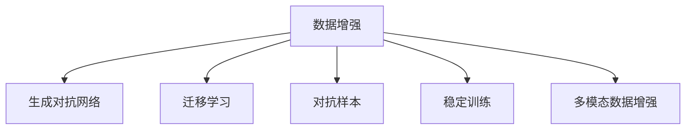

                 

# 数据增强技术：克服AI训练数据稀缺的利器

> 关键词：数据增强, AI训练, 数据稀缺, 数据扩充, 生成对抗网络

## 1. 背景介绍

在人工智能（AI）领域，尤其是深度学习模型训练中，数据量常常是决定模型性能的关键因素。丰富的训练数据可以提供更充分的统计信息，帮助模型学习到更加复杂和准确的特征，从而提升预测能力。然而，在许多实际应用场景中，高质量的标注数据获取成本高昂，且数据分布不均衡，这给模型训练带来了重大挑战。数据增强（Data Augmentation, DA）技术由此应运而生，通过在原有数据上生成新的样本，以扩充数据集，从而解决数据稀缺问题。

### 1.1 数据稀缺问题

数据稀缺（Data Scarcity）是许多AI应用面临的共同问题。以医疗图像识别为例，获取高质量、多样化的医疗影像数据成本极高，且不同疾病的影像数据分布不均。传统机器学习模型依靠单一、有限的数据集，难以捕捉复杂的特征，导致模型的泛化能力差，在实际应用中表现不佳。数据增强技术通过扩展数据集，使用生成的新样本作为训练数据，使得模型可以在更多的数据样本上学习，从而显著提高模型性能。

### 1.2 数据增强的重要性

随着深度学习的发展，数据增强技术的重要性日益凸显。模型性能的提升不再单纯依赖于数据量的增加，更重要的是数据的丰富性和多样性。数据增强通过改变数据的形式或参数，生成新的训练样本，有效扩充了数据集。这不仅提高了模型的泛化能力，还减少了过拟合的风险。

## 2. 核心概念与联系

### 2.1 核心概念概述

为了更好地理解数据增强技术，我们先介绍几个关键概念：

- **数据增强**（Data Augmentation）：通过变换已有数据集，生成新的训练样本，以扩充数据集，提高模型的泛化能力。

- **生成对抗网络**（Generative Adversarial Networks, GANs）：一种生成模型，通过两个神经网络的对抗训练，生成逼真的新数据样本。

- **迁移学习**（Transfer Learning）：指将一个领域学到的知识，迁移到另一个相关领域的学习过程，数据增强技术常用于迁移学习中，提高模型的迁移学习能力。

- **对抗样本**（Adversarial Examples）：为测试模型鲁棒性而生成的一些看似合理但可能导致模型错误输出的样本。

- **稳定训练**（Stable Training）：指在训练过程中避免过拟合和模型退化，保持模型的稳定性和泛化能力。

- **多模态数据增强**（Multi-modal Data Augmentation）：在不同类型的数据上进行增强，如文本、图像、音频等，增强模型的多模态处理能力。

这些概念之间的逻辑关系可以通过以下Mermaid流程图来展示：



这个流程图展示数据增强技术与其他关键概念的联系：

1. 数据增强通过生成对抗网络、迁移学习等方式，提升模型的泛化能力和迁移学习能力。
2. 数据增强生成的对抗样本，有助于测试模型的鲁棒性，提升稳定训练效果。
3. 数据增强技术应用于多模态数据上，可以增强模型的多模态处理能力。

## 3. 核心算法原理 & 具体操作步骤

### 3.1 算法原理概述

数据增强技术的核心思想是在现有数据集上，通过对数据进行随机变换，生成新的训练样本。这些变换包括但不限于旋转、缩放、平移、翻转、裁剪等。通过这些变换，生成的新样本保留了原有样本的信息，但改变了数据的分布，从而使得模型能够学习到更加丰富的特征。

### 3.2 算法步骤详解

数据增强技术的具体实现流程如下：

1. **选择数据增强方式**：根据数据类型和任务需求，选择适合的增强方式。

2. **生成新样本**：使用所选方式对原始数据进行变换，生成新的样本。

3. **添加到训练集中**：将生成的新样本添加到训练集中，与原始样本一起参与训练。

4. **调整训练策略**：根据数据增强后的训练集，调整模型的训练策略，如学习率、批次大小等。

### 3.3 算法优缺点

数据增强技术的主要优点包括：

- **扩充数据集**：通过数据增强，可以大幅扩充数据集，有效缓解数据稀缺问题。

- **提升泛化能力**：生成的样本分布更广，有助于模型学习到更多样的特征，提升泛化能力。

- **减少过拟合**：新样本的出现，降低了模型对训练数据的依赖，减少了过拟合的风险。

然而，数据增强技术也存在一些缺点：

- **生成样本质量**：增强方式不当或参数设置不合理，可能导致生成样本质量不高，甚至引入噪声。

- **计算资源消耗**：数据增强需要额外的计算资源进行样本生成，增加了训练时间。

- **数据分布变化**：增强后的样本分布可能与真实数据分布不一致，需要额外调整训练策略。

### 3.4 算法应用领域

数据增强技术被广泛应用于图像、文本、语音等多种AI应用中，以下是几个主要应用领域：

1. **图像增强**：通过旋转、缩放、裁剪等方式，生成新的图像样本。广泛应用于医学影像、自动驾驶、安防监控等领域。

2. **文本增强**：通过同义词替换、句子重构等方式，生成新的文本样本。应用于机器翻译、文本分类、信息检索等领域。

3. **语音增强**：通过变音、变速、加噪声等方式，生成新的语音样本。应用于语音识别、语音合成、情感分析等领域。

4. **视频增强**：通过剪辑、变速、添加水印等方式，生成新的视频样本。应用于视频监控、视频生成、视频分类等领域。

## 4. 数学模型和公式 & 详细讲解 & 举例说明

### 4.1 数学模型构建

数据增强技术通常使用简单的几何变换或随机变换来生成新样本。这里以图像增强为例，介绍常见的变换方式及其数学模型。

设输入图像为 $X \in \mathbb{R}^{H \times W \times C}$，其中 $H$ 为高度，$W$ 为宽度，$C$ 为通道数。常见的图像增强方式包括：

- **随机旋转**：将图像随机旋转一个角度 $\theta$，其中 $\theta$ 服从均匀分布 $U(-\pi, \pi)$。

- **随机翻转**：以一定概率水平或垂直翻转图像。

- **随机裁剪**：从图像中随机裁剪出一个小区域作为输出。

### 4.2 公式推导过程

以随机旋转为例，描述生成新样本的数学模型。设 $X$ 为输入图像，$Y$ 为输出图像。随机旋转角度 $\theta$ 在 $U(-\pi, \pi)$ 内均匀分布，旋转矩阵 $R_{\theta}$ 为：

$$
R_{\theta} = \begin{bmatrix}
\cos(\theta) & -\sin(\theta) \\
\sin(\theta) & \cos(\theta)
\end{bmatrix}
$$

输出图像 $Y$ 可以通过以下公式计算：

$$
Y = R_{\theta} \cdot X
$$

### 4.3 案例分析与讲解

以医学影像增强为例，介绍数据增强的具体应用。在医学影像中，数据集通常较小且分布不均衡。通过随机旋转和翻转，生成新的影像样本，可以显著扩充数据集。

具体步骤如下：

1. **数据预处理**：对原始影像进行预处理，如标准化、归一化等。

2. **随机旋转**：对预处理后的影像，随机旋转一个角度 $\theta$，生成新的影像。

3. **随机翻转**：以一定概率水平或垂直翻转影像，生成新的影像。

4. **添加到训练集**：将生成的新影像与原始影像一起添加到训练集中。

## 5. 项目实践：代码实例和详细解释说明

### 5.1 开发环境搭建

在进行数据增强实践前，我们需要准备好开发环境。以下是使用Python进行Keras开发的环境配置流程：

1. 安装Anaconda：从官网下载并安装Anaconda，用于创建独立的Python环境。

2. 创建并激活虚拟环境：
```bash
conda create -n keras-env python=3.8 
conda activate keras-env
```

3. 安装Keras：
```bash
pip install keras tensorflow
```

4. 安装各类工具包：
```bash
pip install numpy pandas scikit-learn matplotlib tqdm jupyter notebook ipython
```

完成上述步骤后，即可在`keras-env`环境中开始数据增强实践。

### 5.2 源代码详细实现

这里我们以图像增强为例，给出使用Keras实现数据增强的代码实现。

```python
from keras.preprocessing.image import ImageDataGenerator

# 创建ImageDataGenerator实例
datagen = ImageDataGenerator(
    rotation_range=20,  # 随机旋转角度范围
    width_shift_range=0.1,  # 随机水平移动范围
    height_shift_range=0.1,  # 随机垂直移动范围
    shear_range=0.2,  # 随机剪切变换范围
    zoom_range=0.2,  # 随机缩放范围
    horizontal_flip=True,  # 随机水平翻转
    fill_mode='nearest'  # 填充方式
)

# 加载图像数据集
train_data = datagen.flow_from_directory(
    'train',
    target_size=(224, 224),  # 图像大小
    batch_size=32,
    class_mode='categorical'  # 类别模式
)

# 训练模型
model.fit_generator(
    train_data,
    steps_per_epoch=len(train_data),
    epochs=10
)
```

以上代码实现了对图像数据集的随机旋转、平移、剪切、缩放和翻转变换，并通过`flow_from_directory`函数加载数据，使用`fit_generator`函数进行模型训练。

### 5.3 代码解读与分析

让我们再详细解读一下关键代码的实现细节：

**ImageDataGenerator类**：
- `rotation_range`参数：设置随机旋转的角度范围。
- `width_shift_range`参数：设置随机水平移动的范围。
- `height_shift_range`参数：设置随机垂直移动的范围。
- `shear_range`参数：设置随机剪切变换的范围。
- `zoom_range`参数：设置随机缩放的范围。
- `horizontal_flip`参数：设置是否随机水平翻转。

**flow_from_directory函数**：
- `target_size`参数：设置图像大小。
- `batch_size`参数：设置批次大小。
- `class_mode`参数：设置类别模式，如分类或回归。

**fit_generator函数**：
- `steps_per_epoch`参数：设置每个epoch的步数。
- `epochs`参数：设置训练的轮数。

可以看到，Keras提供了便捷的API实现数据增强功能。开发者可以根据需求，选择适合的增强方式和参数，快速生成新的训练样本。

### 5.4 运行结果展示

运行上述代码后，可以得到模型在增强数据集上的训练效果。具体结果包括：

1. 生成的图像样本数量。
2. 训练过程中的损失和准确率。
3. 在验证集上的性能指标。

通过比较增强前后的训练效果，可以直观地看到数据增强对模型性能的影响。

## 6. 实际应用场景

### 6.1 医疗影像增强

在医疗影像增强中，数据增强技术被广泛应用于医学影像分割、诊断和预测任务。由于医疗影像数据稀缺且分布不均衡，数据增强技术可以显著提高模型的泛化能力。

具体应用如下：

1. **CT影像增强**：通过随机旋转和翻转，生成新的CT影像样本。
2. **MRI影像增强**：通过剪切和缩放，生成新的MRI影像样本。
3. **病灶分割**：通过随机裁剪和旋转，生成新的病灶分割样本。

这些应用场景中，数据增强技术可以帮助模型更好地学习到影像特征，提高诊断和预测的准确性。

### 6.2 自动驾驶图像增强

在自动驾驶中，图像增强技术被广泛应用于车辆感知、交通识别和环境理解。由于自动驾驶场景复杂多变，数据增强技术可以提升模型的鲁棒性和泛化能力。

具体应用如下：

1. **车辆检测**：通过随机旋转和平移，生成新的车辆检测样本。
2. **行人识别**：通过裁剪和缩放，生成新的行人识别样本。
3. **道路分割**：通过翻转和旋转，生成新的道路分割样本。

这些应用场景中，数据增强技术可以提高模型对复杂场景的适应能力，提升自动驾驶的安全性和可靠性。

### 6.3 文本生成与增强

在文本生成与增强中，数据增强技术被广泛应用于机器翻译、文本分类和信息检索任务。由于文本数据丰富，但高质量标注数据稀缺，数据增强技术可以提升模型的泛化能力。

具体应用如下：

1. **机器翻译**：通过随机替换和重构，生成新的翻译样本。
2. **文本分类**：通过同义词替换和句子重构，生成新的分类样本。
3. **信息检索**：通过随机替换和重组，生成新的检索样本。

这些应用场景中，数据增强技术可以提高模型的多语言处理能力和语义理解能力，提升信息检索的准确性和效率。

## 7. 工具和资源推荐

### 7.1 学习资源推荐

为了帮助开发者系统掌握数据增强技术的理论基础和实践技巧，这里推荐一些优质的学习资源：

1. **《Deep Learning Specialization》**：由Andrew Ng教授主持的深度学习课程，涵盖了数据增强、模型训练等关键内容。

2. **《Data Augmentation for Deep Learning》**：由Cornell University的Geoff Pleiss教授编写的详细教程，介绍了各种数据增强技术及其应用。

3. **Keras官方文档**：提供了Keras框架中的数据增强API和函数，详细说明了各种增强方式的使用。

4. **TensorFlow官方文档**：提供了TensorFlow框架中的数据增强API和函数，详细说明了各种增强方式的使用。

5. **Gans for Images, Video, and Beyond**：由Ian Goodfellow教授撰写的生成对抗网络指南，介绍了GANs在图像、视频等领域的应用。

通过对这些资源的学习实践，相信你一定能够快速掌握数据增强技术的精髓，并用于解决实际的AI问题。

### 7.2 开发工具推荐

高效的开发离不开优秀的工具支持。以下是几款用于数据增强开发的常用工具：

1. **Keras**：Keras提供了便捷的数据增强API，支持快速生成和加载增强数据集。

2. **TensorFlow**：TensorFlow提供了丰富的数据增强API，支持自定义增强方式和参数。

3. **PyTorch**：PyTorch提供了灵活的数据增强函数，支持GPU加速和分布式训练。

4. **Python**：Python作为主流的AI开发语言，拥有丰富的第三方库和工具，支持各种数据增强方式的实现。

5. **Jupyter Notebook**：Jupyter Notebook提供了交互式编程环境，方便开发者调试和测试数据增强算法。

合理利用这些工具，可以显著提升数据增强任务的开发效率，加快创新迭代的步伐。

### 7.3 相关论文推荐

数据增强技术的研究源于学界的持续探索。以下是几篇奠基性的相关论文，推荐阅读：

1. **Image Data Augmentation**：由Jonathan Long等人提出的图像数据增强方法，广泛应用于医学影像增强。

2. **Towards End-to-End Data-to-Text Generation with Attention**：由Ian Goodfellow等人提出的文本生成数据增强方法，广泛应用于机器翻译和文本分类。

3. **Generative Adversarial Nets**：由Ian Goodfellow等人提出的生成对抗网络方法，广泛应用于图像生成和数据增强。

4. **Super-resolution Learning with Generative Adversarial Networks**：由Tao Xu等人提出的图像超分辨率数据增强方法，广泛应用于图像处理和计算机视觉。

这些论文代表了数据增强技术的发展脉络。通过学习这些前沿成果，可以帮助研究者把握学科前进方向，激发更多的创新灵感。

## 8. 总结：未来发展趋势与挑战

### 8.1 总结

本文对数据增强技术进行了全面系统的介绍。首先阐述了数据增强技术在AI训练中解决数据稀缺问题的核心思想和具体方法，并通过实际应用场景展示了其在不同领域的应用效果。其次，从原理到实践，详细讲解了数据增强技术的数学模型、公式推导和具体实现。同时，本文还探讨了数据增强技术的优点、缺点和应用领域，以期为开发者提供全面的技术指引。

通过本文的系统梳理，可以看到，数据增强技术已经成为AI训练中不可或缺的重要手段，显著提升了模型的泛化能力和鲁棒性，降低了数据稀缺带来的风险。未来，伴随深度学习的发展，数据增强技术将在更多领域得到应用，为AI技术的持续进步提供有力支持。

### 8.2 未来发展趋势

展望未来，数据增强技术将呈现以下几个发展趋势：

1. **自动化增强**：自动化数据增强技术将不断涌现，利用深度学习模型自动选择和组合增强方式，生成更加多样和逼真的样本。

2. **多模态增强**：数据增强技术将应用于更多模态的数据上，如文本、图像、音频等，提升模型的多模态处理能力。

3. **自适应增强**：数据增强技术将根据模型的训练状态自适应调整增强策略，避免生成噪声样本。

4. **跨领域增强**：数据增强技术将跨越不同领域的数据，如图像、文本、视频等，形成更加全面和复杂的数据集。

5. **分布式增强**：数据增强技术将利用分布式计算资源，实现大规模数据集的快速生成和加载。

这些趋势预示着数据增强技术将在未来的AI训练中扮演更加重要的角色，为模型训练提供更加多样和丰富的数据支持。

### 8.3 面临的挑战

尽管数据增强技术已经取得了显著进展，但在其发展和应用过程中，仍面临一些挑战：

1. **增强方式选择**：不同的增强方式对生成样本的质量和多样性影响较大，如何选择适合的增强方式，仍是重要的研究课题。

2. **参数调整**：数据增强涉及大量参数的调整，如何在保持生成样本多样性的同时，避免引入噪声，仍需深入研究。

3. **计算资源消耗**：数据增强需要额外的计算资源进行样本生成，如何在保证生成质量的同时，降低计算成本，仍需优化和改进。

4. **数据分布一致性**：增强后的样本分布可能与真实数据分布不一致，如何调整训练策略，确保模型在真实数据上的表现，仍需进一步探索。

5. **对抗样本生成**：生成对抗样本可能导致模型鲁棒性下降，如何在生成新样本的同时，避免引入对抗样本，仍需进行深入研究。

### 8.4 研究展望

面对数据增强技术面临的挑战，未来的研究需要在以下几个方面寻求新的突破：

1. **增强方式优化**：研究和开发新的、更有效的数据增强方式，提升生成样本的质量和多样性。

2. **自动调参**：利用深度学习模型自动选择和调整增强参数，减少人工干预，提高数据增强的效率和效果。

3. **分布式增强**：利用分布式计算资源，实现大规模数据集的快速生成和加载，提升数据增强的效率和灵活性。

4. **鲁棒性提升**：研究和开发鲁棒性更强的数据增强算法，避免生成对抗样本，确保模型在真实数据上的表现。

5. **跨模态增强**：研究和开发跨模态数据增强技术，提升模型对不同模态数据的适应能力，增强多模态处理能力。

6. **可解释性增强**：研究和开发可解释性更强的数据增强方法，增强模型的可解释性和透明度。

这些研究方向将推动数据增强技术的不断进步，为构建更加全面、鲁棒和高效的人工智能系统提供有力支持。

## 9. 附录：常见问题与解答

**Q1：数据增强技术是否适用于所有数据类型？**

A: 数据增强技术主要适用于图像、文本、音频等数据类型，但对于数值数据、时间序列数据等非结构化数据，增强效果有限。需要根据数据类型选择合适的增强方式。

**Q2：数据增强是否会引入噪声？**

A: 数据增强可能会引入一定程度的噪声，尤其是在图像增强中。为了避免噪声对模型训练的影响，可以使用多种增强方式组合，提高生成样本的质量。

**Q3：数据增强如何避免生成对抗样本？**

A: 为了避免生成对抗样本，需要在生成过程中引入对抗训练机制，如生成对抗网络（GANs），同时设置合理的增强参数，确保生成样本的合理性。

**Q4：数据增强是否会增加计算资源消耗？**

A: 数据增强需要额外的计算资源进行样本生成，尤其是在图像增强中。可以通过并行计算、分布式计算等方式降低计算成本，提高数据增强的效率。

**Q5：如何评估数据增强的效果？**

A: 数据增强的效果可以通过训练和测试集上的性能指标进行评估，如准确率、召回率、F1值等。同时可以通过可视化工具，如TensorBoard，实时监控生成样本的分布和质量。

通过这些问题与解答，相信你能够更好地理解数据增强技术，并应用于实际的AI训练中。希望本文能够为你的学习和实践提供有价值的参考和指导。

---

作者：禅与计算机程序设计艺术 / Zen and the Art of Computer Programming

