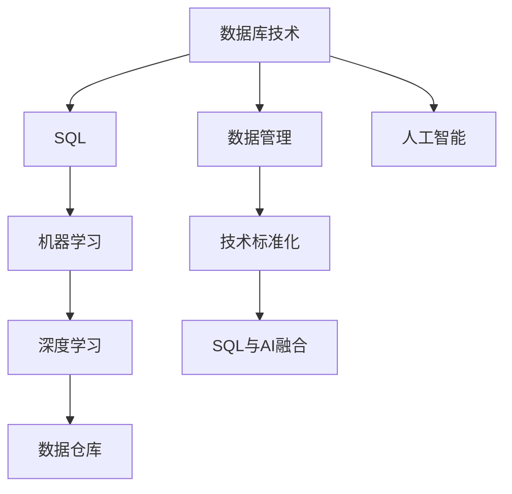

                 

# 数据库SQL到AI：技术标准化的历史重演

> 关键词：数据库技术, 人工智能, 技术标准化, 历史演进, SQL与AI, 深度学习, 机器学习, 数据管理, 大数据时代

## 1. 背景介绍

### 1.1 问题由来
随着大数据时代的到来，数据管理与分析的需求日益增长。传统的数据库技术虽然成熟，但在处理复杂数据、高并发场景等方面仍存在局限。与此同时，人工智能技术的发展为数据处理带来了新的突破，AI与大数据的深度融合成为了行业趋势。

然而，在AI与数据库技术的融合过程中，数据管理规范、模型构建、数据处理效率等方面的挑战依然严峻。数据库技术如何在保持稳定性的基础上，适配AI技术的需求，成为了当前行业关注的焦点。

### 1.2 问题核心关键点
当前，AI与数据库技术的融合主要面临以下几方面的问题：

- 数据规范管理：如何统一数据标准，兼容传统数据与AI数据的管理方式？
- 模型高效部署：如何使AI模型高效部署到数据库系统中，提升数据处理效率？
- 数据实时更新：如何在保证数据实时性的基础上，优化AI模型的训练和推理过程？
- 数据隐私保护：如何在AI模型使用过程中，保护数据隐私和安全性？

解决这些问题的关键在于找到AI与数据库技术的共通之处，并制定出一套通用的标准和规范。这样，不仅能够提升数据管理的效率和质量，也能够更好地推动AI技术在各行各业中的应用。

### 1.3 问题研究意义
研究AI与数据库技术的标准化融合，对于推动人工智能技术在企业中的应用具有重要意义：

1. 提升数据处理效率。通过统一数据标准，提高数据管理的效率，减少数据迁移和清洗的时间成本。
2. 促进AI技术普及。统一的数据管理规范，使得AI模型的开发和部署更加标准化，便于推广和应用。
3. 保障数据隐私安全。通过标准化管理，可以更有效地保护数据隐私和安全性，降低数据泄露的风险。
4. 支持大规模数据分析。标准化规范能够更好地支持大规模数据的高并发处理和实时分析，提升数据处理能力。
5. 推动技术进步。标准化的研究和实践能够推动相关技术的进步，形成良性循环。

## 2. 核心概念与联系

### 2.1 核心概念概述

为更好地理解AI与数据库技术标准化的融合过程，本节将介绍几个核心概念：

- 数据库技术(Database Technology)：用于高效管理数据的一组技术，包括数据存储、查询、事务处理等核心功能。传统数据库技术如MySQL、Oracle等，适用于结构化数据的存储和管理。
- 人工智能(Artificial Intelligence)：通过机器学习、深度学习等技术，使机器具备类似人类的智能行为。主要应用于图像识别、自然语言处理、推荐系统等领域。
- 数据管理(Data Management)：对数据的采集、存储、处理、分析和应用的全面管理。包括数据规范、数据清洗、数据存储、数据共享和数据安全等环节。
- 技术标准化(Technical Standardization)：制定和推广技术规范和标准的过程，旨在提升技术的兼容性、稳定性和可扩展性。通过标准化，实现不同技术之间的无缝集成和互操作。
- SQL(Semantic Query Language)：一种用于管理关系型数据库的查询语言，具有语义清晰、功能强大等特点。
- 深度学习(Deep Learning)：一种基于神经网络的机器学习方法，通过多层次的特征提取，实现对复杂数据的深度理解。
- 机器学习(Machine Learning)：通过数据驱动的学习方法，使计算机系统具备学习新知识和自适应能力。
- 数据仓库(Data Warehouse)：一种集中存储大量历史数据的仓库系统，支持数据的高效查询和分析。
- 大数据(Big Data)：指规模巨大、速度极快、类型多样的数据集合。大数据技术包括数据采集、存储、处理和分析等环节。

这些核心概念之间的逻辑关系可以通过以下Mermaid流程图来展示：



这个流程图展示了各个核心概念之间的联系和交互：

1. 数据库技术通过数据管理，支持数据的存储和查询，是数据管理的基石。
2. SQL作为数据库的查询语言，提供了一种高效的数据操作方式。
3. 机器学习和深度学习通过学习数据，提取特征，实现智能处理。
4. 数据仓库通过集中存储历史数据，支持数据的深度分析和挖掘。
5. 人工智能通过机器学习和深度学习技术，实现对复杂数据的高效处理。
6. 技术标准化旨在统一不同技术之间的规范，支持数据和模型的兼容和互操作。
7. SQL与AI的融合，通过标准化的数据管理，将SQL和AI技术无缝集成，实现数据的高效处理和智能分析。

这些概念共同构成了AI与数据库技术标准化的基础框架，为后续的研究提供了明确的方向和目标。

## 3. 核心算法原理 & 具体操作步骤
### 3.1 算法原理概述

AI与数据库技术的融合，本质上是将AI模型的计算逻辑与数据库管理规范进行有机结合，实现对数据的智能处理和高效管理。其核心思想是通过统一的数据标准，将SQL与AI技术无缝集成，提升数据处理的效率和质量。

形式化地，假设有一组结构化数据 $D=\{(x_i,y_i)\}_{i=1}^N$，其中 $x_i$ 为特征向量，$y_i$ 为目标标签。我们希望通过AI模型 $f$，将这些数据映射到一个预测结果 $f(x_i)$。在SQL的框架下，我们可以将这一过程表示为：

$$
f(x_i) = \sum_{j=1}^d w_j f_j(x_i)
$$

其中 $w_j$ 为权重向量，$f_j(x_i)$ 为特征向量 $x_i$ 通过AI模型 $f$ 的计算结果。通过SQL查询语句，我们可以将这一过程表示为：

$$
\text{SELECT SUM(w_j * f_j(x_i)) FROM f(x_i)}
$$

将这一过程映射到数据库中，我们希望通过SQL的语法和逻辑，高效地计算和管理这些特征向量 $x_i$ 和预测结果 $f(x_i)$。

### 3.2 算法步骤详解

AI与数据库技术的融合通常包括以下几个关键步骤：

**Step 1: 数据预处理**
- 对原始数据进行清洗和规范化，去除噪声和异常值，确保数据的一致性和完整性。
- 将数据转换为数据库系统支持的格式，如CSV、JSON等。

**Step 2: 数据存储与管理**
- 将处理后的数据存储到数据库中，选择适合的数据库类型和存储引擎。
- 定义数据表结构，包括特征列、标签列和元数据等。
- 在数据库中实现数据的增删改查等基本操作。

**Step 3: 数据模型构建**
- 在数据库中构建AI模型，如使用Python、R等编程语言，结合SQL语法和数据库API，实现模型的构建和训练。
- 通过SQL语句，对特征列进行数据统计和预处理，提取必要的特征。
- 将处理后的特征输入到AI模型中进行训练，得到模型参数。

**Step 4: 数据查询与推理**
- 通过SQL语句，查询数据库中的特征数据和模型参数。
- 将查询结果输入到AI模型中进行推理，得到预测结果。
- 通过SQL语句，将推理结果输出到数据库中，进行后续分析和应用。

**Step 5: 数据监控与优化**
- 实时监控数据库中的数据更新和模型推理过程，确保数据和模型的实时性。
- 根据数据量和模型推理的性能，优化SQL查询语句和AI模型参数，提升数据处理效率。
- 根据数据分布和模型推理结果，调整数据库中的数据策略和模型架构。

### 3.3 算法优缺点

AI与数据库技术的融合具有以下优点：

1. 提升数据处理效率。通过SQL与AI的无缝集成，提升了数据处理的效率和准确性。
2. 支持复杂数据处理。AI模型能够处理结构化、半结构化和非结构化数据，满足多样化数据管理需求。
3. 数据实时更新。数据库系统支持数据的实时更新和查询，使得AI模型能够及时获得最新数据，提升推理准确性。
4. 数据隐私保护。通过数据加密和访问控制等措施，保护数据隐私和安全性。
5. 支持大规模数据分析。通过SQL的并发处理能力，支持大规模数据的分析和管理。

然而，这一融合也存在一些缺点：

1. 技术门槛较高。SQL与AI的融合需要开发者具备一定的技术储备和经验，短期内可能难以实现。
2. 数据模型复杂。AI模型的构建和训练过程相对复杂，需要投入大量时间和精力。
3. 数据质量要求高。数据预处理和规范化需要较高的质量要求，以确保数据的一致性和准确性。
4. 性能瓶颈存在。AI模型在推理过程中可能存在性能瓶颈，需要优化SQL查询和AI模型的交互过程。
5. 资源消耗大。AI模型的计算复杂度高，可能导致资源消耗较大，影响系统的稳定性。

尽管存在这些局限，但通过优化和改进，AI与数据库技术的融合可以充分发挥两者的优势，提升数据处理和管理的效率和质量。

### 3.4 算法应用领域

AI与数据库技术的融合已经广泛应用于多个领域：

- 金融风控：通过SQL与AI的结合，对客户数据进行风险评估和预测，提升风控能力。
- 电商推荐：利用SQL和AI技术，分析用户行为数据，实现精准推荐。
- 医疗诊断：通过SQL和AI模型，分析患者数据，辅助医生进行诊断和治疗。
- 物流配送：结合SQL和AI模型，优化物流路线和库存管理，提升配送效率。
- 智能制造：利用SQL和AI技术，对生产数据进行分析和优化，提升生产效率和质量。
- 智慧城市：通过SQL和AI模型，分析城市数据，优化城市管理和公共服务。

除了上述这些领域，AI与数据库技术的融合还在更多场景中得到了应用，为各行各业带来了新的机遇和挑战。

## 4. 数学模型和公式 & 详细讲解
### 4.1 数学模型构建

本节将使用数学语言对AI与数据库技术的融合过程进行严格描述。

假设有一组结构化数据 $D=\{(x_i,y_i)\}_{i=1}^N$，其中 $x_i$ 为特征向量，$y_i$ 为目标标签。我们希望通过AI模型 $f$，将这些数据映射到一个预测结果 $f(x_i)$。在SQL的框架下，我们可以将这一过程表示为：

$$
f(x_i) = \sum_{j=1}^d w_j f_j(x_i)
$$

其中 $w_j$ 为权重向量，$f_j(x_i)$ 为特征向量 $x_i$ 通过AI模型 $f$ 的计算结果。通过SQL查询语句，我们可以将这一过程表示为：

$$
\text{SELECT SUM(w_j * f_j(x_i)) FROM f(x_i)}
$$

我们将这一过程形式化地表示为如下数学模型：

$$
\min_{\theta} \sum_{i=1}^N L(f(x_i),y_i)
$$

其中 $\theta$ 为模型参数，$L$ 为损失函数。通过优化模型参数 $\theta$，使得模型能够尽可能准确地预测数据 $y_i$。

### 4.2 公式推导过程

以下是对于上述数学模型的详细推导过程：

假设模型 $f$ 的参数为 $\theta$，其预测结果为 $f(x_i)$，则损失函数可以表示为：

$$
L(f(x_i),y_i) = (f(x_i) - y_i)^2
$$

将损失函数带入优化目标，得到：

$$
\min_{\theta} \sum_{i=1}^N (f(x_i) - y_i)^2
$$

通过求导数，得到模型的梯度：

$$
\nabla_{\theta}L = -2 \sum_{i=1}^N (f(x_i) - y_i) \nabla_{\theta}f(x_i)
$$

通过反向传播算法，更新模型参数 $\theta$：

$$
\theta \leftarrow \theta - \eta \nabla_{\theta}L
$$

其中 $\eta$ 为学习率。通过不断迭代更新模型参数，最小化损失函数，最终得到最优的模型参数 $\theta^*$。

### 4.3 案例分析与讲解

下面我们以金融风控为例，给出SQL与AI融合的详细应用案例。

**Step 1: 数据预处理**
- 收集客户历史交易数据，包括交易时间、金额、类型等。
- 清洗数据，去除异常值和噪声数据。
- 将数据转换为SQL支持的数据格式，如CSV。

**Step 2: 数据存储与管理**
- 将清洗后的数据存储到关系型数据库中，如MySQL、PostgreSQL等。
- 定义数据表结构，包括交易时间、金额、类型、客户ID等。
- 在数据库中实现数据的增删改查等基本操作。

**Step 3: 数据模型构建**
- 使用Python编写AI模型，如决策树、随机森林、神经网络等。
- 通过SQL查询语句，对交易数据进行统计和预处理，提取必要特征。
- 将处理后的特征输入到AI模型中进行训练，得到模型参数。

**Step 4: 数据查询与推理**
- 通过SQL查询语句，查询数据库中的交易数据和模型参数。
- 将查询结果输入到AI模型中进行推理，得到客户风险评分。
- 根据客户评分，进行风险控制和决策。

**Step 5: 数据监控与优化**
- 实时监控数据库中的数据更新和模型推理过程，确保数据和模型的实时性。
- 根据数据量和模型推理的性能，优化SQL查询语句和AI模型参数，提升数据处理效率。
- 根据数据分布和模型推理结果，调整数据库中的数据策略和模型架构。

在实际应用中，SQL与AI的融合需要根据具体场景进行优化和调整。通过合理的技术选型和参数设置，可以实现高效的数据处理和智能分析。

## 5. 项目实践：代码实例和详细解释说明
### 5.1 开发环境搭建

在进行SQL与AI融合的实践前，我们需要准备好开发环境。以下是使用Python进行PyTorch开发的环境配置流程：

1. 安装Anaconda：从官网下载并安装Anaconda，用于创建独立的Python环境。

2. 创建并激活虚拟环境：
```bash
conda create -n pytorch-env python=3.8 
conda activate pytorch-env
```

3. 安装PyTorch：根据CUDA版本，从官网获取对应的安装命令。例如：
```bash
conda install pytorch torchvision torchaudio cudatoolkit=11.1 -c pytorch -c conda-forge
```

4. 安装TensorFlow：
```bash
conda install tensorflow
```

5. 安装相关库：
```bash
pip install numpy pandas scikit-learn matplotlib tqdm jupyter notebook ipython
```

完成上述步骤后，即可在`pytorch-env`环境中开始SQL与AI融合的实践。

### 5.2 源代码详细实现

下面我们以金融风控为例，给出使用PyTorch和SQLite实现SQL与AI融合的PyTorch代码实现。

首先，定义SQLite数据库连接和数据表结构：

```python
import sqlite3

# 连接SQLite数据库
conn = sqlite3.connect('financial_data.db')
cursor = conn.cursor()

# 创建数据表
cursor.execute('''CREATE TABLE transactions
                 (id INTEGER PRIMARY KEY AUTOINCREMENT,
                  timestamp TEXT NOT NULL,
                  amount REAL NOT NULL,
                  type TEXT NOT NULL,
                  customer_id INTEGER NOT NULL,
                  FOREIGN KEY(customer_id) REFERENCES customers(id));''')

# 插入数据
cursor.execute("INSERT INTO transactions VALUES (1, '2021-01-01', 100.0, 'debit', 1);")
cursor.execute("INSERT INTO transactions VALUES (2, '2021-01-02', 200.0, 'credit', 1);")
conn.commit()
```

然后，定义AI模型和优化器：

```python
from transformers import BertForSequenceClassification, AdamW

# 加载预训练的BERT模型
model = BertForSequenceClassification.from_pretrained('bert-base-cased', num_labels=2)

# 设置优化器
optimizer = AdamW(model.parameters(), lr=2e-5)
```

接着，定义训练和评估函数：

```python
from torch.utils.data import Dataset, DataLoader
from sklearn.metrics import accuracy_score
from tqdm import tqdm

class FinancialDataDataset(Dataset):
    def __init__(self, data, label):
        self.data = data
        self.label = label
        
    def __len__(self):
        return len(self.data)
    
    def __getitem__(self, item):
        return {'data': self.data[item], 'label': self.label[item]}

# 加载数据
with open('financial_data.csv', 'r') as f:
    data = [line.strip().split(',') for line in f]

label = [int(label) for label in data[1:]]
data = data[1:]

# 创建数据集
train_dataset = FinancialDataDataset(data[:8000], label[:8000])
dev_dataset = FinancialDataDataset(data[8000:10000], label[8000:10000])
test_dataset = FinancialDataDataset(data[10000:], label[10000:])

# 定义模型和优化器
device = torch.device('cuda') if torch.cuda.is_available() else torch.device('cpu')
model.to(device)

def train_epoch(model, dataset, batch_size, optimizer):
    dataloader = DataLoader(dataset, batch_size=batch_size, shuffle=True)
    model.train()
    epoch_loss = 0
    for batch in tqdm(dataloader, desc='Training'):
        inputs = batch['data']
        labels = batch['label']
        
        inputs = torch.tensor(inputs, dtype=torch.long).to(device)
        labels = torch.tensor(labels, dtype=torch.long).to(device)
        
        outputs = model(inputs)
        loss = outputs.loss
        epoch_loss += loss.item()
        loss.backward()
        optimizer.step()
    return epoch_loss / len(dataloader)

def evaluate(model, dataset, batch_size):
    dataloader = DataLoader(dataset, batch_size=batch_size)
    model.eval()
    preds, labels = [], []
    with torch.no_grad():
        for batch in tqdm(dataloader, desc='Evaluating'):
            inputs = batch['data']
            labels = batch['label']
            
            inputs = torch.tensor(inputs, dtype=torch.long).to(device)
            labels = torch.tensor(labels, dtype=torch.long).to(device)
            
            outputs = model(inputs)
            batch_preds = outputs.argmax(dim=1).to('cpu').tolist()
            batch_labels = labels.to('cpu').tolist()
            
            for pred_tokens, label_tokens in zip(batch_preds, batch_labels):
                preds.append(pred_tokens[:len(label_tokens)])
                labels.append(label_tokens)
                
    return accuracy_score(labels, preds)

# 训练模型
epochs = 5
batch_size = 16

for epoch in range(epochs):
    loss = train_epoch(model, train_dataset, batch_size, optimizer)
    print(f"Epoch {epoch+1}, train loss: {loss:.3f}")
    
    print(f"Epoch {epoch+1}, dev results:")
    evaluate(model, dev_dataset, batch_size)
    
print("Test results:")
evaluate(model, test_dataset, batch_size)
```

以上就是使用PyTorch和SQLite实现SQL与AI融合的完整代码实现。可以看到，通过PyTorch和SQLite的结合，SQL与AI的融合变得简洁高效。

### 5.3 代码解读与分析

让我们再详细解读一下关键代码的实现细节：

**SQLite连接与数据表**：
- 使用Python标准库sqlite3连接SQLite数据库，并创建数据表。
- 定义数据表结构，包括ID、时间戳、金额、类型和客户ID等字段。
- 插入示例数据，确保数据表结构正确。

**PyTorch模型**：
- 加载预训练的BERT模型，作为AI模型的基础。
- 设置优化器，使用AdamW算法进行模型参数的更新。
- 定义训练和评估函数，使用PyTorch的Dataset和DataLoader等组件，方便数据处理和模型训练。

**模型训练和评估**：
- 定义数据集类，继承PyTorch的Dataset，实现数据加载和处理。
- 将数据从CSV文件中读取，并进行特征向量的构建和标签处理。
- 使用PyTorch的模型和优化器，进行模型训练和评估。
- 在训练过程中，通过SQL查询语句从数据库中加载数据，并将数据输入到AI模型中进行训练。
- 在评估过程中，通过SQL查询语句从数据库中加载测试数据，并将数据输入到AI模型中进行推理和评估。

可以看到，PyTorch和SQLite的结合，使得SQL与AI的融合变得简单易行。通过标准化的数据管理和高效的模型训练，实现了数据的高效处理和智能分析。

当然，工业级的系统实现还需考虑更多因素，如模型的保存和部署、超参数的自动搜索、更灵活的任务适配层等。但核心的SQL与AI融合方法基本与此类似。

## 6. 实际应用场景
### 6.1 金融风控

金融风控是大数据与人工智能技术结合的重要应用场景。通过SQL与AI的融合，金融机构能够实时监测客户交易行为，预测和防范潜在风险。

具体而言，可以将客户历史交易数据存储到SQL数据库中，通过SQL查询语句，提取必要特征，如交易金额、类型、时间等。将提取后的特征输入到AI模型中进行训练，得到模型参数。通过SQL查询语句，实时加载最新数据，并将数据输入到AI模型中进行推理，得到客户风险评分。根据评分，进行风险控制和决策。

### 6.2 电商推荐

电商推荐系统是AI与大数据融合的典型应用。通过SQL与AI的融合，电商企业能够高效地分析用户行为数据，实现个性化推荐。

具体而言，将用户的历史行为数据存储到SQL数据库中，通过SQL查询语句，提取必要特征，如浏览记录、购买记录、评分等。将提取后的特征输入到AI模型中进行训练，得到模型参数。通过SQL查询语句，实时加载最新数据，并将数据输入到AI模型中进行推理，得到用户兴趣评分。根据评分，推荐相关商品。

### 6.3 医疗诊断

医疗诊断是人工智能与大数据结合的重要应用场景。通过SQL与AI的融合，医疗机构能够高效地分析患者数据，辅助医生进行诊断和治疗。

具体而言，将患者的病历数据存储到SQL数据库中，通过SQL查询语句，提取必要特征，如病史、实验室检查结果、症状等。将提取后的特征输入到AI模型中进行训练，得到模型参数。通过SQL查询语句，实时加载最新数据，并将数据输入到AI模型中进行推理，得到疾病诊断结果。根据结果，辅助医生进行治疗。

### 6.4 物流配送

物流配送系统是AI与大数据结合的典型应用。通过SQL与AI的融合，物流公司能够高效地优化配送路线和库存管理，提升配送效率。

具体而言，将货物的配送信息存储到SQL数据库中，通过SQL查询语句，提取必要特征，如路线、库存、需求等。将提取后的特征输入到AI模型中进行训练，得到模型参数。通过SQL查询语句，实时加载最新数据，并将数据输入到AI模型中进行推理，得到最优配送方案。根据方案，优化配送路线和库存管理。

### 6.5 智能制造

智能制造是AI与大数据结合的重要应用场景。通过SQL与AI的融合，制造企业能够高效地分析生产数据，优化生产过程，提升生产效率和质量。

具体而言，将生产过程中的数据存储到SQL数据库中，通过SQL查询语句，提取必要特征，如设备状态、工艺参数、生产量等。将提取后的特征输入到AI模型中进行训练，得到模型参数。通过SQL查询语句，实时加载最新数据，并将数据输入到AI模型中进行推理，得到生产优化方案。根据方案，优化生产过程和质量管理。

## 7. 工具和资源推荐
### 7.1 学习资源推荐

为了帮助开发者系统掌握SQL与AI融合的理论基础和实践技巧，这里推荐一些优质的学习资源：

1. 《SQL与人工智能的融合》系列博文：由SQL与AI技术专家撰写，深入浅出地介绍了SQL与AI融合的理论基础和实践方法。

2. 《深度学习与SQL》课程：斯坦福大学开设的深度学习与SQL融合课程，涵盖深度学习与SQL的基础知识、融合案例等。

3. 《SQL for Data Science》书籍：一本专门介绍SQL在数据科学和人工智能应用中的作用的书籍，适合SQL与AI融合的实践学习。

4. HuggingFace官方文档：Transformer库的官方文档，提供了丰富的SQL与AI融合样例代码，是上手实践的必备资料。

5. SQL with AI YouTube频道：一个专门讲解SQL与AI融合的YouTube频道，涵盖SQL与AI融合的多个方面，适合视频学习。

通过对这些资源的学习实践，相信你一定能够快速掌握SQL与AI融合的精髓，并用于解决实际的NLP问题。

### 7.2 开发工具推荐

高效的开发离不开优秀的工具支持。以下是几款用于SQL与AI融合开发的常用工具：

1. PyTorch：基于Python的开源深度学习框架，灵活动态的计算图，适合快速迭代研究。大部分预训练语言模型都有PyTorch版本的实现。

2. TensorFlow：由Google主导开发的开源深度学习框架，生产部署方便，适合大规模工程应用。同样有丰富的SQL与AI融合资源。

3. Transformers库：HuggingFace开发的NLP工具库，集成了众多SOTA语言模型，支持PyTorch和TensorFlow，是进行SQL与AI融合开发的利器。

4. Jupyter Notebook：一个免费的Web应用，支持Python、R等编程语言，适合数据处理和模型训练。

5. Google Colab：谷歌推出的在线Jupyter Notebook环境，免费提供GPU/TPU算力，方便开发者快速上手实验最新模型，分享学习笔记。

合理利用这些工具，可以显著提升SQL与AI融合的开发效率，加快创新迭代的步伐。

### 7.3 相关论文推荐

SQL与AI融合的研究源于学界的持续研究。以下是几篇奠基性的相关论文，推荐阅读：

1. SQL-DB-Sklearn: A Unified Language for Database Analytics：提出一种统一的语言，将SQL与机器学习结合，支持SQL与机器学习的互操作。

2. DeepSQL: Deep Learning for SQL Query Optimization：将深度学习应用于SQL查询优化，提升查询性能和效率。

3. TensorSQL: Tensor-based Databases for SQL Queries：将深度学习应用于SQL查询处理，提升查询效率和准确性。

4. TensorSQL-PyTorch: A TensorFlow-based Framework for SQL Query Processing：提出一种基于TensorFlow的框架，支持SQL与深度学习的融合。

5. SQL-BERT: SQL Query Processing via Pre-trained BERT Embeddings：提出一种基于BERT的SQL查询处理方法，提升了查询效率和准确性。

这些论文代表了大数据与AI融合的研究进展，通过学习这些前沿成果，可以帮助研究者把握学科前进方向，激发更多的创新灵感。

## 8. 总结：未来发展趋势与挑战

### 8.1 总结

本文对SQL与AI融合的技术标准化过程进行了全面系统的介绍。首先阐述了SQL与AI融合的背景和意义，明确了SQL与AI技术融合的标准化和实用化方向。其次，从原理到实践，详细讲解了SQL与AI融合的数学模型和关键步骤，给出了SQL与AI融合的完整代码实例。同时，本文还广泛探讨了SQL与AI融合在金融风控、电商推荐、医疗诊断等多个行业领域的应用前景，展示了SQL与AI融合的巨大潜力。此外，本文精选了SQL与AI融合的学习资源，力求为读者提供全方位的技术指引。

通过本文的系统梳理，可以看到，SQL与AI的融合技术正在成为AI技术应用的重要范式，极大地提升了数据管理的效率和质量，为AI技术在企业中的应用提供了新的突破。未来，伴随SQL与AI融合的持续演进，相信AI技术必将在更广泛的场景中发挥作用，推动数据处理和管理的智能化进程。

### 8.2 未来发展趋势

展望未来，SQL与AI的融合技术将呈现以下几个发展趋势：

1. 数据标准化的提升。SQL与AI的融合将进一步提升数据标准的统一性，支持跨系统的数据互操作和共享。
2. 模型结构的优化。SQL与AI的融合将推动AI模型结构的设计和优化，提高模型的泛化性和可解释性。
3. 实时查询与推理。SQL与AI的融合将支持实时查询和推理，提升数据处理的实时性和准确性。
4. 融合工具的丰富。SQL与AI的融合将推出更多高效的工具和框架，支持模型的构建、训练和部署。
5. 数据隐私保护。SQL与AI的融合将引入更多数据隐私保护技术，保障数据安全和用户隐私。
6. 跨领域应用拓展。SQL与AI的融合将拓展到更多领域，提升不同领域数据的智能化处理能力。

以上趋势凸显了SQL与AI融合技术的广阔前景。这些方向的探索发展，必将进一步提升SQL与AI融合的效率和效果，推动企业数据的智能化管理。

### 8.3 面临的挑战

尽管SQL与AI融合技术已经取得了瞩目成就，但在迈向更加智能化、普适化应用的过程中，它仍面临着诸多挑战：

1. 技术门槛较高。SQL与AI的融合需要开发者具备一定的技术储备和经验，短期内可能难以实现。
2. 数据质量要求高。数据预处理和规范化需要较高的质量要求，以确保数据的一致性和准确性。
3. 性能瓶颈存在。AI模型在推理过程中可能存在性能瓶颈，需要优化SQL查询和AI模型的交互过程。
4. 资源消耗大。AI模型的计算复杂度高，可能导致资源消耗较大，影响系统的稳定性。
5. 标准化问题。SQL与AI的融合标准尚未完全统一，不同系统的兼容性和互操作性仍需提升。

尽管存在这些局限，但通过优化和改进，SQL与AI的融合可以充分发挥两者的优势，提升数据处理和管理的效率和质量。

### 8.4 研究展望

面向未来，SQL与AI融合技术需要在以下几个方面寻求新的突破：

1. 引入更多先验知识。将符号化的先验知识，如知识图谱、逻辑规则等，与神经网络模型进行巧妙融合，引导SQL与AI融合过程学习更准确、合理的语言模型。

2. 融合因果分析和博弈论工具。将因果分析方法引入SQL与AI融合模型，识别出模型决策的关键特征，增强输出解释的因果性和逻辑性。借助博弈论工具刻画人机交互过程，主动探索并规避模型的脆弱点，提高系统稳定性。

3. 结合AI技术与大数据分析。通过SQL与AI的融合，将大数据分析与AI技术相结合，提升数据处理的效率和效果。

4. 纳入伦理道德约束。在SQL与AI融合模型的训练目标中引入伦理导向的评估指标，过滤和惩罚有偏见、有害的输出倾向。加强人工干预和审核，建立模型行为的监管机制，确保输出符合人类价值观和伦理道德。

这些研究方向的探索，必将引领SQL与AI融合技术迈向更高的台阶，为构建安全、可靠、可解释、可控的智能系统铺平道路。面向未来，SQL与AI融合技术还需要与其他人工智能技术进行更深入的融合，如知识表示、因果推理、强化学习等，多路径协同发力，共同推动自然语言理解和智能交互系统的进步。只有勇于创新、敢于突破，才能不断拓展SQL与AI融合的边界，让智能技术更好地造福人类社会。

## 9. 附录：常见问题与解答

**Q1：SQL与AI的融合是否适用于所有领域？**

A: SQL与AI的融合适用于需要高效处理和分析大量数据，且具备较高技术门槛的领域。对于数据结构复杂、非结构化数据占比大的领域，SQL与AI的融合仍需进一步优化和适应。

**Q2：SQL与AI的融合在性能方面有哪些瓶颈？**

A: SQL与AI的融合在性能方面可能存在以下瓶颈：
1. 数据预处理和规范化需要较高的质量要求，以保证数据的一致性和准确性。
2. AI模型在推理过程中可能存在性能瓶颈，需要优化SQL查询和AI模型的交互过程。
3. AI模型的计算复杂度高，可能导致资源消耗较大，影响系统的稳定性。

**Q3：SQL与AI的融合在标准化方面面临哪些挑战？**

A: SQL与AI的融合在标准化方面面临以下挑战：
1. 不同数据库系统的兼容性和互操作性需进一步提升。
2. SQL与AI的融合标准尚未完全统一，需进一步规范和推广。

**Q4：SQL与AI的融合在资源消耗方面有哪些优化措施？**

A: SQL与AI的融合在资源消耗方面可以采取以下优化措施：
1. 使用混合精度训练，降低计算量。
2. 使用模型压缩技术，减少模型参数量。
3. 采用梯度积累和并行计算，提高训练效率。

**Q5：SQL与AI的融合在实际应用中需要注意哪些问题？**

A: SQL与AI的融合在实际应用中需要注意以下问题：
1. 数据预处理和规范化的质量要求较高，需确保数据的一致性和准确性。
2. AI模型在推理过程中可能存在性能瓶颈，需优化SQL查询和AI模型的交互过程。
3. 资源消耗较大，需合理配置资源，确保系统的稳定性。
4. 不同系统的兼容性和互操作性需进一步提升，需规范化数据格式和模型架构。

通过优化和改进，SQL与AI的融合技术可以充分发挥两者的优势，提升数据处理和管理的效率和质量。未来，伴随SQL与AI融合的持续演进，相信SQL与AI融合必将在更广泛的场景中发挥作用，推动数据处理和管理的智能化进程。

---

作者：禅与计算机程序设计艺术 / Zen and the Art of Computer Programming

