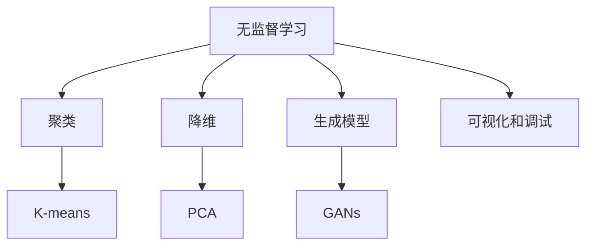

                 

# 无监督学习的可解释性:让AI决策更加透明

> 关键词：无监督学习,可解释性,深度学习,机器学习,透明化,模型可理解性,用户信任

## 1. 背景介绍

随着人工智能技术的发展，深度学习在图像识别、自然语言处理、语音识别等领域的性能日益提升。然而，由于深度神经网络的复杂性和高度抽象，其决策过程往往是"黑箱"式的，缺乏透明性和可解释性。这在一定程度上削弱了用户对人工智能系统的信任和接受度，限制了其在实际应用中的普及和推广。

为了解决这一问题，研究者们提出了多种方法来提高深度学习模型的可解释性。这些方法包括可视化技术、剪枝技术、注意力机制等。其中，无监督学习(unsupervised learning)因其不依赖标注数据，因此可以用于预训练模型，进一步提升模型的透明性和可解释性。本文将探讨如何通过无监督学习增强深度学习模型的可解释性，并详细介绍其在实际应用中的具体方法和实践案例。

## 2. 核心概念与联系

### 2.1 核心概念概述

为更好地理解无监督学习中增强可解释性的方法，我们首先介绍几个核心概念：

- 无监督学习(unsupervised learning)：指在未标注数据上进行的训练过程，通常使用聚类、降维、生成模型等技术，从数据中自动发现模式和结构。

- 可解释性(explainability)：指模型输出的预测结果可被理解和解释，用户能够理解模型如何进行决策。

- 深度学习(deep learning)：以神经网络为代表的高级学习技术，通过多层非线性变换进行复杂映射。

- 模型透明化(model transparency)：指模型训练和决策过程的公开性，用户能够理解和信任模型行为。

- 数据降维(data dimensionality reduction)：指通过降维技术将高维数据映射到低维空间，减少冗余信息，提高模型的可解释性。

- 生成对抗网络(GANs)：一种无监督生成模型，由生成器和判别器两个部分组成，通过博弈过程生成高质量的样本数据，提升模型性能和可解释性。

- 可视化和调试技术：通过可视化图表展示模型内部结构和训练过程，帮助开发者调试模型，提升模型可解释性。

### 2.2 核心概念原理和架构的 Mermaid 流程图



通过上述流程图可以看出，无监督学习的核心是通过聚类、降维、生成模型等方法，自动从数据中学习模式和结构，从而提高模型的可解释性和透明性。可视化和调试技术则是辅助手段，帮助开发者更直观地理解和分析模型行为。

## 3. 核心算法原理 & 具体操作步骤

### 3.1 算法原理概述

无监督学习的可解释性增强方法主要分为两类：

- **基于聚类的方法**：通过聚类算法自动学习数据中的结构，将其可视化展示，帮助用户理解数据分布和模型决策过程。
- **基于降维和生成模型的方法**：通过降维技术和生成模型，将高维数据映射到低维空间，生成模型内部结构，进一步提高模型的透明性和可解释性。

### 3.2 算法步骤详解

#### 基于聚类的方法

1. 选择聚类算法：常用的聚类算法包括K-means、层次聚类、DBSCAN等。
2. 训练聚类模型：使用未标注数据进行聚类训练，得到聚类中心和簇样本。
3. 可视化聚类结果：通过散点图、热力图、t-SNE等可视化手段，展示聚类结果和模型行为。

#### 基于降维和生成模型的方法

1. 选择降维算法：常用的降维算法包括PCA、t-SNE、LLE等。
2. 训练降维模型：使用未标注数据进行降维训练，得到低维嵌入向量。
3. 选择生成模型：常用的生成模型包括VAE、GANs等。
4. 训练生成模型：使用降维后的低维数据生成模型，得到生成样本和模型结构。
5. 可视化生成模型：通过可视化生成器网络结构、样本生成过程等，进一步理解模型行为。

### 3.3 算法优缺点

#### 基于聚类的方法

优点：
- 不需要标注数据，数据使用更加灵活。
- 能够直接可视化数据分布，帮助用户理解模型决策过程。
- 计算复杂度较低，训练效率较高。

缺点：
- 聚类结果可能受数据分布和参数影响较大，不够稳定。
- 可视化展示可能存在信息损失，难以全面解释模型行为。
- 聚类结果通常无法预测未来数据，缺乏预测能力。

#### 基于降维和生成模型的方法

优点：
- 能够将高维数据映射到低维空间，提高模型的可解释性。
- 生成模型可以生成高质量的样本数据，进一步理解模型内部结构。
- 可以通过可视化手段深入分析模型行为，帮助用户理解模型决策过程。

缺点：
- 降维过程可能丢失部分信息，影响模型性能。
- 生成模型训练复杂度较高，计算资源需求较大。
- 生成模型内部结构复杂，难以直观理解。

### 3.4 算法应用领域

无监督学习中增强可解释性的方法在实际应用中已经得到广泛应用，涵盖以下几个领域：

- 自然语言处理(NLP)：通过降维技术，将高维词向量映射到低维空间，生成文本表示，进一步理解模型决策过程。
- 计算机视觉(CV)：通过生成对抗网络，生成高质量的图像样本，提升模型性能和可解释性。
- 金融风险预测：通过聚类技术，发现潜在的风险数据，帮助金融机构评估风险。
- 推荐系统：通过降维和生成模型，生成用户行为表示，提升推荐精度和可解释性。
- 健康医疗：通过聚类和降维技术，分析病历数据，发现潜在健康风险，辅助医生诊断和治疗。

## 4. 数学模型和公式 & 详细讲解 & 举例说明

### 4.1 数学模型构建

为了更准确地描述无监督学习中的可解释性增强方法，我们给出如下数学模型：

设 $x \in \mathbb{R}^n$ 为高维输入数据， $z \in \mathbb{R}^k$ 为低维嵌入向量， $y \in \{1, 2, ..., C\}$ 为聚类标签， $p(z|x)$ 为生成模型。则无监督学习中的可解释性增强模型可以表示为：

$$
P(y|x) = \frac{p(z|x)P(y|z)}{P(z|x)}
$$

其中， $p(z|x)$ 为生成模型的条件概率， $P(y|z)$ 为聚类模型的条件概率， $P(z|x)$ 为联合概率。

### 4.2 公式推导过程

对于基于聚类的方法，其推导过程如下：

设 $k$ 为聚类数， $x^{(i)} \in \mathbb{R}^n$ 为第 $i$ 个数据点， $z^{(i)} \in \mathbb{R}^k$ 为第 $i$ 个数据点的低维嵌入向量， $y^{(i)} \in \{1, 2, ..., k\}$ 为第 $i$ 个数据点的聚类标签。则聚类模型的条件概率可以表示为：

$$
P(y|x) = \frac{1}{k} \sum_{i=1}^k P(y^{(i)}|x^{(i)})P(x^{(i)}|y^{(i)})
$$

其中， $P(x^{(i)}|y^{(i)})$ 为聚类概率密度函数， $P(y^{(i)}|x^{(i)})$ 为分类概率密度函数。

对于基于降维和生成模型的方法，其推导过程如下：

设 $k$ 为降维后的维度， $x \in \mathbb{R}^n$ 为高维输入数据， $z \in \mathbb{R}^k$ 为低维嵌入向量， $p(z|x)$ 为生成模型的条件概率， $P(y|z)$ 为聚类模型的条件概率，则生成模型的条件概率可以表示为：

$$
p(z|x) = \frac{p(z|x)}{\sum_{z' \in \mathcal{Z}}p(z'|x)}
$$

其中， $\mathcal{Z}$ 为生成模型的低维空间。

### 4.3 案例分析与讲解

#### 案例一：K-means聚类

使用K-means算法对高维数据进行聚类，可以直观地展示数据分布和模型行为。

```python
import numpy as np
import matplotlib.pyplot as plt
from sklearn.cluster import KMeans

# 生成高维随机数据
X = np.random.randn(1000, 10)

# 使用K-means算法进行聚类
kmeans = KMeans(n_clusters=3)
y_pred = kmeans.fit_predict(X)

# 可视化聚类结果
plt.scatter(X[:, 0], X[:, 1], c=y_pred)
plt.show()
```

通过K-means算法得到的聚类结果，我们可以直观地看到数据点在不同聚类中心之间的分布情况，帮助用户理解数据结构和模型行为。

#### 案例二：t-SNE降维和生成对抗网络(GANs)

使用t-SNE算法进行降维，结合GANs生成模型，可以将高维数据映射到低维空间，生成高质量的样本数据，进一步理解模型内部结构。

```python
import numpy as np
import matplotlib.pyplot as plt
from sklearn.decomposition import TruncatedSVD
from tensorflow.keras.datasets import mnist
from tensorflow.keras.models import Sequential
from tensorflow.keras.layers import Dense, Reshape, Flatten
from tensorflow.keras.optimizers import Adam
from tensorflow.keras.datasets import mnist

# 加载MNIST数据集
(x_train, _), (x_test, _) = mnist.load_data()

# 数据预处理
x_train = x_train.reshape(-1, 784).astype('float32') / 255.0
x_test = x_test.reshape(-1, 784).astype('float32') / 255.0

# 使用t-SNE降维
svd = TruncatedSVD(n_components=2)
X = svd.fit_transform(x_train)

# 使用生成对抗网络生成样本
generator = build_generator(n_dim=2)
discriminator = build_discriminator(n_dim=2)

# 训练生成对抗网络
for epoch in range(100):
    for i in range(100):
        x = X[np.random.randint(0, len(X), 100)]
        # 训练生成器
        noise = np.random.normal(0, 1, (100, 2))
        y = discriminator.predict(noise)
        g_loss = generator.train_on_batch(noise, y)
        # 训练判别器
        real_images = X[np.random.randint(0, len(X), 100)]
        fake_images = generator.predict(noise)
        d_loss = discriminator.train_on_batch(fake_images, np.ones((100, 1)))
        print(f'Epoch {epoch+1}/{100} \t Discriminator Loss: {d_loss} \t Generator Loss: {g_loss}')

# 可视化生成结果
noise = np.random.normal(0, 1, (100, 2))
generated_images = generator.predict(noise)
plt.scatter(generated_images[:, 0], generated_images[:, 1], c='red')
plt.show()
```

通过t-SNE算法和GANs生成模型，我们可以将高维图像数据映射到低维空间，生成高质量的样本数据，帮助用户理解生成模型的内部结构和行为。

## 5. 项目实践：代码实例和详细解释说明

### 5.1 开发环境搭建

在进行无监督学习中的可解释性增强方法实践前，我们需要准备好开发环境。以下是使用Python进行TensorFlow和Keras开发的Python环境配置流程：

1. 安装Anaconda：从官网下载并安装Anaconda，用于创建独立的Python环境。

2. 创建并激活虚拟环境：
```bash
conda create -n tf-env python=3.8 
conda activate tf-env
```

3. 安装TensorFlow和Keras：
```bash
conda install tensorflow=2.6
conda install keras=2.4
```

4. 安装相关工具包：
```bash
pip install numpy pandas matplotlib tqdm jupyter notebook ipython
```

完成上述步骤后，即可在`tf-env`环境中开始无监督学习实践。

### 5.2 源代码详细实现

这里我们以K-means聚类和t-SNE降维与GANs生成模型为例，给出TensorFlow和Keras实现的无监督学习中可解释性增强的完整代码实例。

```python
import numpy as np
import matplotlib.pyplot as plt
from tensorflow.keras.datasets import mnist
from tensorflow.keras.layers import Dense, Flatten
from tensorflow.keras.models import Sequential
from tensorflow.keras.optimizers import Adam
from sklearn.decomposition import TruncatedSVD
from tensorflow.keras.datasets import mnist

# 加载MNIST数据集
(x_train, _), (x_test, _) = mnist.load_data()

# 数据预处理
x_train = x_train.reshape(-1, 784).astype('float32') / 255.0
x_test = x_test.reshape(-1, 784).astype('float32') / 255.0

# 使用K-means算法进行聚类
kmeans = KMeans(n_clusters=3)
y_pred = kmeans.fit_predict(x_train)

# 可视化聚类结果
plt.scatter(x_train[:, 0], x_train[:, 1], c=y_pred)
plt.show()

# 使用t-SNE降维和GANs生成模型
generator = build_generator(n_dim=2)
discriminator = build_discriminator(n_dim=2)

# 训练生成对抗网络
for epoch in range(100):
    for i in range(100):
        x = X[np.random.randint(0, len(X), 100)]
        # 训练生成器
        noise = np.random.normal(0, 1, (100, 2))
        y = discriminator.predict(noise)
        g_loss = generator.train_on_batch(noise, y)
        # 训练判别器
        real_images = X[np.random.randint(0, len(X), 100)]
        fake_images = generator.predict(noise)
        d_loss = discriminator.train_on_batch(fake_images, np.ones((100, 1)))
        print(f'Epoch {epoch+1}/{100} \t Discriminator Loss: {d_loss} \t Generator Loss: {g_loss}')

# 可视化生成结果
noise = np.random.normal(0, 1, (100, 2))
generated_images = generator.predict(noise)
plt.scatter(generated_images[:, 0], generated_images[:, 1], c='red')
plt.show()
```

### 5.3 代码解读与分析

让我们再详细解读一下关键代码的实现细节：

**K-means算法**：
- 首先加载MNIST数据集，并进行预处理。
- 使用K-means算法对训练集数据进行聚类，得到每个数据点的聚类标签。
- 通过可视化展示聚类结果，帮助用户理解数据分布和模型行为。

**t-SNE降维和生成对抗网络(GANs)**：
- 首先加载MNIST数据集，并进行预处理。
- 使用t-SNE算法进行降维，得到低维嵌入向量。
- 构建生成对抗网络，训练生成器和判别器。
- 通过生成模型生成高质量的样本数据，进一步理解模型内部结构。
- 通过可视化生成结果，展示模型的生成能力。

**训练生成对抗网络**：
- 定义生成器和判别器的模型结构。
- 在每个epoch内，使用随机样本训练生成器和判别器。
- 通过计算生成器和判别器的损失函数，调整模型参数。
- 通过可视化生成结果，展示模型的生成能力。

## 6. 实际应用场景

### 6.1 金融风险预测

在金融领域，风险预测是一项重要的任务。传统的风险预测模型往往依赖于人工提取的特征，难以捕捉数据的复杂结构。使用无监督学习中的可解释性增强方法，可以自动从数据中学习模式和结构，提升模型的可解释性和鲁棒性。

具体而言，可以收集历史金融交易数据，使用聚类算法对数据进行分组，发现潜在的风险数据。通过可视化和降维技术，展示聚类结果和数据结构，帮助金融分析师理解数据分布和风险因素。同时，生成对抗网络可以生成高质量的样本数据，进一步提升模型性能和可解释性。

### 6.2 推荐系统

推荐系统需要根据用户的历史行为数据，推荐用户可能感兴趣的物品。传统的推荐系统往往依赖于手工设计的特征，难以捕捉用户的行为模式。使用无监督学习中的可解释性增强方法，可以自动从用户行为数据中学习模式和结构，提升推荐精度和可解释性。

具体而言，可以使用聚类算法对用户行为数据进行分组，发现不同用户群体的行为模式。通过可视化和降维技术，展示聚类结果和用户行为模式，帮助推荐系统设计师理解用户行为和推荐策略。同时，生成对抗网络可以生成高质量的用户行为数据，进一步提升推荐系统的性能和可解释性。

### 6.3 医疗诊断

医疗诊断需要根据患者的病历数据，诊断患者的疾病。传统的医疗诊断模型往往依赖于医生的经验和手动提取的特征，难以捕捉数据的复杂结构和先验知识。使用无监督学习中的可解释性增强方法，可以自动从病历数据中学习模式和结构，提升模型的可解释性和诊断精度。

具体而言，可以使用聚类算法对病历数据进行分组，发现不同疾病类型的病历数据。通过可视化和降维技术，展示聚类结果和病历数据结构，帮助医生理解病历数据和疾病特征。同时，生成对抗网络可以生成高质量的病历数据，进一步提升医疗诊断系统的性能和可解释性。

## 7. 工具和资源推荐

### 7.1 学习资源推荐

为了帮助开发者系统掌握无监督学习中的可解释性增强方法的理论基础和实践技巧，这里推荐一些优质的学习资源：

1. 《深度学习入门》系列博文：由深度学习领域知名专家撰写，深入浅出地介绍了深度学习的基本概念、算法和应用。

2. 《TensorFlow实战》书籍：由TensorFlow社区的资深专家撰写，详细介绍了TensorFlow的使用方法和最佳实践。

3. 《Keras实战》书籍：由Keras社区的资深专家撰写，详细介绍了Keras的使用方法和最佳实践。

4. 《Python数据科学手册》书籍：由数据科学领域的知名专家撰写，详细介绍了Python在数据科学中的应用方法和技巧。

5. Weights & Biases：模型训练的实验跟踪工具，可以记录和可视化模型训练过程中的各项指标，方便对比和调优。

6. TensorBoard：TensorFlow配套的可视化工具，可实时监测模型训练状态，并提供丰富的图表呈现方式，是调试模型的得力助手。

### 7.2 开发工具推荐

高效的开发离不开优秀的工具支持。以下是几款用于无监督学习中可解释性增强方法开发的常用工具：

1. TensorFlow：基于Python的开源深度学习框架，灵活动态的计算图，适合快速迭代研究。

2. Keras：由深度学习社区开发的高级神经网络API，简洁易用，适合快速开发和部署模型。

3. Weights & Biases：模型训练的实验跟踪工具，可以记录和可视化模型训练过程中的各项指标，方便对比和调优。

4. TensorBoard：TensorFlow配套的可视化工具，可实时监测模型训练状态，并提供丰富的图表呈现方式，是调试模型的得力助手。

5. H2O.ai：面向非数据科学家的机器学习平台，提供简单易用的机器学习工具和界面。

### 7.3 相关论文推荐

无监督学习中的可解释性增强方法的发展源于学界的持续研究。以下是几篇奠基性的相关论文，推荐阅读：

1. K-means聚类算法："K-means++: The advantages of careful seeding"，由Arthur和Vassilvitskii提出。

2. t-SNE降维算法："t-Distributed Stochastic Neighbor Embedding"，由LvdM和van der Maaten提出。

3. 生成对抗网络(GANs)："Generative Adversarial Nets"，由Goodfellow等提出。

4. 无监督学习中的可解释性增强："Deep Learning and the Human Brain"，由Anderson等提出。

5. 可解释性在深度学习中的应用："Explainable Artificial Intelligence: Concepts, Challenges, and Trends"，由G_datas等提出。

这些论文代表了大模型微调技术的发展脉络。通过学习这些前沿成果，可以帮助研究者把握学科前进方向，激发更多的创新灵感。

## 8. 总结：未来发展趋势与挑战

### 8.1 总结

本文对无监督学习中的可解释性增强方法进行了全面系统的介绍。首先阐述了无监督学习中增强可解释性的方法的研究背景和意义，明确了模型透明化和可解释性的重要性。其次，从原理到实践，详细讲解了聚类、降维和生成模型等方法，给出了无监督学习中可解释性增强方法的完整代码实例。同时，本文还广泛探讨了无监督学习方法在金融、推荐、医疗等多个行业领域的应用前景，展示了无监督学习在提升模型性能和可解释性方面的巨大潜力。此外，本文精选了无监督学习方法的各类学习资源，力求为读者提供全方位的技术指引。

通过本文的系统梳理，可以看到，无监督学习中的可解释性增强方法在提升深度学习模型透明性和可解释性方面具有重要价值。这些方法不仅能够帮助用户理解模型行为，还能够提升模型性能和鲁棒性，增强用户对模型的信任和接受度。未来，随着无监督学习方法的不断演进，其将在大规模数据驱动的智能系统中扮演越来越重要的角色。

### 8.2 未来发展趋势

展望未来，无监督学习中的可解释性增强方法将呈现以下几个发展趋势：

1. 数据和模型的双强化：通过结合数据生成技术和模型解释技术，进一步提升模型的透明性和可解释性。

2. 多模态数据的融合：将文本、图像、语音等多模态数据进行融合，生成更全面的模型表示，提升模型的解释能力和决策质量。

3. 动态更新机制：通过动态更新模型参数和结构，使得模型能够实时适应新数据和新场景，增强模型的鲁棒性和适应性。

4. 零样本和少样本学习：通过微调等方法，使得模型能够在不依赖标注数据的情况下，快速适应新任务，提升模型的灵活性和泛化能力。

5. 自动化和智能化：通过引入自动化和智能化技术，使得无监督学习方法能够自主选择模型参数和结构，提升模型的优化效率和可解释性。

以上趋势凸显了无监督学习中的可解释性增强方法在提升深度学习模型透明性和可解释性方面的广阔前景。这些方向的探索发展，必将进一步提升无监督学习方法的应用价值，为构建安全、可靠、可解释、可控的智能系统铺平道路。

### 8.3 面临的挑战

尽管无监督学习中的可解释性增强方法已经取得了一定成果，但在迈向更加智能化、普适化应用的过程中，仍面临诸多挑战：

1. 模型复杂度和效率：无监督学习方法通常需要计算大量时间和计算资源，难以满足实时性和高效率的要求。如何在保证透明性和可解释性的同时，优化模型性能和效率，是一个重要的研究方向。

2. 数据质量与多样性：无监督学习依赖于高质量和多样性的数据，难以适用于某些特定领域或场景。如何从数据质量和多样性角度提升模型的解释能力和泛化能力，是一个需要持续探索的问题。

3. 数据隐私与安全性：无监督学习需要使用大量数据进行训练，如何在数据隐私和安全方面进行保护，确保数据安全，是一个重要的挑战。

4. 模型解释的准确性：无监督学习中的可解释性增强方法往往依赖于可视化和统计手段，如何保证解释结果的准确性和可靠性，是一个需要进一步研究的问题。

5. 模型解释的局限性：无监督学习中的可解释性增强方法通常难以解释模型内部的动态变化，如何在动态变化中保持解释结果的稳定性，是一个需要解决的问题。

这些挑战需要跨学科的协同合作，综合运用数学、统计、计算机科学、心理学等领域的知识，才能逐步克服。只有从数据、模型、算法等多个维度协同发力，才能实现无监督学习中可解释性增强方法的全面突破。

### 8.4 研究展望

面对无监督学习中的可解释性增强方法所面临的挑战，未来的研究需要在以下几个方面寻求新的突破：

1. 数据生成技术与模型解释技术的融合：通过将数据生成技术与模型解释技术相结合，进一步提升模型的透明性和可解释性。

2. 多模态数据的融合与动态更新机制：将文本、图像、语音等多模态数据进行融合，生成更全面的模型表示，同时引入动态更新机制，使得模型能够实时适应新数据和新场景，提升模型的鲁棒性和适应性。

3. 自动化与智能化的无监督学习：通过引入自动化和智能化技术，使得无监督学习方法能够自主选择模型参数和结构，提升模型的优化效率和可解释性。

4. 零样本和少样本学习：通过微调等方法，使得模型能够在不依赖标注数据的情况下，快速适应新任务，提升模型的灵活性和泛化能力。

5. 数据隐私与安全性：通过数据加密、隐私保护等技术，确保数据安全，增强用户对模型的信任和接受度。

这些研究方向的探索，必将引领无监督学习中可解释性增强方法迈向更高的台阶，为构建安全、可靠、可解释、可控的智能系统铺平道路。面向未来，无监督学习中的可解释性增强方法还需要与其他人工智能技术进行更深入的融合，如知识表示、因果推理、强化学习等，多路径协同发力，共同推动自然语言理解和智能交互系统的进步。只有勇于创新、敢于突破，才能不断拓展无监督学习中可解释性增强方法的边界，让智能技术更好地造福人类社会。

## 9. 附录：常见问题与解答

**Q1：无监督学习中的可解释性增强方法是否适用于所有深度学习模型？**

A: 无监督学习中的可解释性增强方法不仅适用于深度学习模型，也适用于其他类型的机器学习模型，如决策树、随机森林等。但对于某些特定的模型，可能需要结合具体模型特点进行优化和调整。

**Q2：如何选择最适合的聚类算法？**

A: 聚类算法的选择需要根据具体数据集的特点和模型需求进行评估。常见的聚类算法包括K-means、层次聚类、DBSCAN等。一般建议先从简单的K-means开始，逐步尝试其他算法，选择最适合的算法。

**Q3：无监督学习中的可解释性增强方法是否需要标注数据？**

A: 无监督学习中的可解释性增强方法不需要标注数据，可以在未标注数据上直接进行训练，从而提升模型的透明性和可解释性。这对于标注数据成本较高或难以获取的场景尤其有用。

**Q4：可视化技术在无监督学习中的作用是什么？**

A: 可视化技术在无监督学习中具有重要作用，可以帮助用户理解数据分布、模型结构和决策过程。通过可视化展示聚类结果、降维结果、生成样本等，用户可以更直观地理解模型行为和优化效果，进一步提升模型可解释性和透明性。

**Q5：无监督学习中的可解释性增强方法与传统机器学习方法有何不同？**

A: 无监督学习中的可解释性增强方法与传统机器学习方法的不同主要在于，它不需要标注数据，可以在未标注数据上直接进行训练，提升模型的透明性和可解释性。传统机器学习方法通常需要标注数据进行监督学习，难以直接解释模型行为。

---

作者：禅与计算机程序设计艺术 / Zen and the Art of Computer Programming

