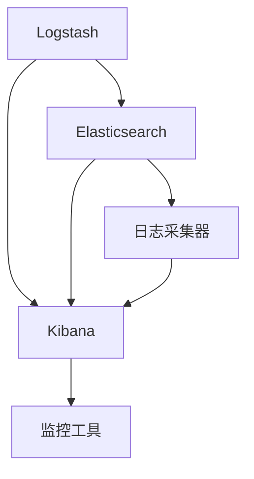

                 

# 日志管理：ELK栈的搭建与使用

## 1. 背景介绍

### 1.1 问题由来

在现代社会，数据量呈指数级增长，日志系统作为数据的重要来源，其重要性不言而喻。日志不仅用于记录应用程序的运行状况和错误信息，也是系统监控、安全审计、业务分析等的重要依据。然而，随着数据量的急剧膨胀，如何高效管理、分析和利用这些数据成为了一个迫切需要解决的问题。

在过去的几年里，Elastic Stack（简称ELK栈）成为了日志管理领域的明星解决方案。ELK栈由Elasticsearch、Logstash和Kibana三部分组成，能够通过统一的平台对日志进行采集、存储、搜索和可视化分析，成为许多企业部署日志管理的首选方案。

### 1.2 问题核心关键点

ELK栈的核心优势在于其组件之间的无缝集成，能够提供强大的日志管理能力，同时支持多源数据的采集和自定义插件的开发。使用ELK栈，用户可以轻松实现以下目标：

- 实时采集和存储日志数据。
- 高效地搜索、过滤和聚合日志。
- 通过可视化的仪表盘对日志进行分析。
- 支持复杂的查询和报表功能。
- 集成第三方监控工具，实现全面的系统监控。

本文将从核心概念和架构入手，详细阐述ELK栈的搭建和使用方法，并通过实例演示如何高效利用ELK栈进行日志管理。

## 2. 核心概念与联系

### 2.1 核心概念概述

为了更好地理解ELK栈的工作原理和功能，本节将介绍几个密切相关的核心概念：

- Elasticsearch（ES）：一种基于分布式存储的搜索引擎，用于存储、搜索、分析大规模日志数据。
- Logstash：一种日志处理工具，用于从各种数据源采集日志，并进行格式转换、过滤、标准化等预处理操作。
- Kibana：一种开源数据可视化平台，用于构建仪表盘和报表，展示和分析日志数据。
- 日志采集器：如Filebeat、Fluentd、Graylog等，用于从不同数据源（如操作系统、应用程序、云平台等）采集日志数据。

这些核心概念之间通过数据流相互连接，形成一个完整的日志管理解决方案，能够高效地处理、存储、搜索和分析日志数据。

### 2.2 核心概念原理和架构的 Mermaid 流程图



### 2.3 核心概念联系

- 日志采集器从不同数据源采集日志，输入到Logstash中进行预处理。
- Logstash对日志进行解析、过滤、格式化等操作，并将处理后的日志输入到Elasticsearch中进行存储和查询。
- Elasticsearch作为搜索引擎，支持分布式存储和复杂的搜索功能，可以快速定位日志数据。
- Kibana通过与Elasticsearch集成，对日志数据进行可视化分析，生成仪表盘和报表。
- Kibana还可以集成其他监控工具，提供更全面的系统监控功能。

这些组件之间的协同工作，使得ELK栈能够高效、灵活地管理大量日志数据，并为用户提供直观的分析和监控界面。

## 3. 核心算法原理 & 具体操作步骤

### 3.1 算法原理概述

ELK栈的核心算法原理主要体现在以下几个方面：

- 日志采集和存储：通过日志采集器从不同数据源（如操作系统、应用程序、云平台等）采集日志，并将其输入到Elasticsearch中进行分布式存储。
- 日志处理和预处理：Logstash对采集到的日志进行解析、过滤、标准化等预处理操作，确保日志数据的一致性和规范性。
- 日志搜索和分析：Elasticsearch提供强大的搜索和聚合功能，支持复杂的查询语句和聚合函数，便于用户快速定位和分析日志数据。
- 日志可视化和报表：Kibana通过与Elasticsearch集成，将搜索结果转换为可视化仪表盘和报表，便于用户理解和分析日志数据。

### 3.2 算法步骤详解

#### 3.2.1 数据采集

1. 安装并配置日志采集器（如Filebeat、Fluentd、Graylog等），设置数据源（如操作系统日志、应用程序日志、云平台日志等）和输出插件。
2. 配置采集器参数，如日志路径、过滤规则、批量大小等。
3. 启动采集器，开始从数据源采集日志数据。

#### 3.2.2 数据预处理

1. 在Logstash中配置输入插件（如Logstash Input Plugin），指定日志数据来源和格式。
2. 配置过滤器插件（如Logstash Filter Plugin），对日志数据进行解析、过滤、格式化等操作。
3. 配置输出插件（如Logstash Output Plugin），将处理后的日志数据输出到Elasticsearch。

#### 3.2.3 数据存储

1. 安装并启动Elasticsearch，创建索引和映射。
2. 配置索引模板，指定字段类型和分析器。
3. 将处理后的日志数据输入到Elasticsearch中进行存储。

#### 3.2.4 数据查询

1. 使用Elasticsearch的REST API或客户端工具（如Kibana）进行查询。
2. 编写查询语句，指定字段、条件、聚合函数等。
3. 对查询结果进行过滤、排序、分页等操作。

#### 3.2.5 数据可视化

1. 在Kibana中创建仪表盘，指定数据源和查询。
2. 选择可视化图表类型（如柱状图、折线图、饼图等），并进行配置。
3. 将查询结果转换为图表和报表，并保存和分享。

### 3.3 算法优缺点

ELK栈的优点在于其强大的数据处理能力、灵活的配置选项和丰富的可视化功能，可以满足大多数企业的日志管理需求。同时，ELK栈的开源特性也使其具有高度的可定制性和成本效益。

然而，ELK栈也存在一些缺点：

- 学习曲线较陡：由于ELK栈组件众多，配置复杂，初学者需要花费较长时间进行学习和调试。
- 性能瓶颈：当数据量过大时，ELK栈的性能可能会受到限制，需要进行性能优化。
- 扩展性问题：由于Elasticsearch的节点扩展和资源分配需要一定的技术门槛，需要进行合理的规划和管理。
- 安全性问题：由于ELK栈涉及大量敏感数据，需要严格的安全措施和监控策略，以防止数据泄露和攻击。

### 3.4 算法应用领域

ELK栈在日志管理领域有广泛的应用，主要包括以下几个方面：

- 应用程序日志管理：对应用程序运行中的日志进行实时监控、分析和报告。
- 系统监控和故障排除：通过实时采集和分析系统日志，及时发现并排除故障。
- 安全审计和合规性检查：对日志数据进行安全审计和合规性检查，防范安全威胁。
- 性能优化和调优：通过分析日志数据，优化系统性能和资源分配。
- 业务分析和决策支持：通过日志数据进行业务分析，支持决策制定和管理。

## 4. 数学模型和公式 & 详细讲解 & 举例说明

### 4.1 数学模型构建

ELK栈的核心数学模型主要涉及以下几个方面：

- 日志采集：通过采集器从数据源获取日志数据。
- 数据预处理：对日志数据进行解析、过滤、标准化等操作。
- 数据存储：将预处理后的日志数据存储到Elasticsearch中。
- 数据查询：使用Elasticsearch进行复杂的搜索和聚合操作。
- 数据可视化：将查询结果转换为可视化图表和报表。

### 4.2 公式推导过程

#### 4.2.1 日志采集公式

假设从数据源获取一条日志记录，其格式为 $log_i=(ID,t,msg)$，其中 $ID$ 为日志ID，$t$ 为时间戳，$msg$ 为日志消息。

- 采集器将日志记录转换为JSON格式，即 $json_i=\{ID,t,msg\}$。
- 通过输入插件将JSON数据输入到Logstash中，即 $json_i \in logstash_{in}$。

#### 4.2.2 数据预处理公式

Logstash对日志数据进行预处理，包括解析、过滤、标准化等操作。假设预处理后的日志数据为 $preprocessed_i=(ID,t,msg)$。

- 解析：将日志消息 $msg$ 解析为可用的数据结构。
- 过滤：根据过滤规则筛选出有用的数据。
- 标准化：将日志数据转换为标准格式，如JSON或CSV。

#### 4.2.3 数据存储公式

假设Elasticsearch的索引为 $index$，映射为 $mapping$，预处理后的日志数据为 $preprocessed_i=(ID,t,msg)$。

- 创建索引：使用Elasticsearch的API创建索引，即 $create_index(index,mapping)$。
- 存储日志：将预处理后的日志数据存储到Elasticsearch中，即 $store_index(index,preprocessed_i)$。

#### 4.2.4 数据查询公式

假设查询语句为 $query$，Elasticsearch的查询结果为 $result$。

- 构建查询：根据业务需求，使用Elasticsearch的语法构建查询语句，即 $query=build_query()$。
- 执行查询：通过API或客户端工具执行查询，即 $execute_query(query)$。
- 解析结果：解析查询结果，转换为可视化数据，即 $parse_result(result)$。

#### 4.2.5 数据可视化公式

假设可视化图表类型为 $chart_type$，查询结果为 $result$。

- 创建图表：根据图表类型，使用Kibana创建可视化图表，即 $create_chart(chart_type,result)$。
- 保存图表：将图表保存到Kibana中，即 $save_chart(chart)$。

### 4.3 案例分析与讲解

假设某电商平台的订单系统需要实时监控和分析订单日志，以确保系统的稳定运行和提高用户满意度。

1. **数据采集**：使用Filebeat从订单系统的日志目录中采集日志数据，并将其输入到Logstash中。
2. **数据预处理**：在Logstash中配置解析和过滤规则，将日志数据转换为JSON格式，并过滤出订单ID、时间戳、用户ID、订单状态等有用字段。
3. **数据存储**：将预处理后的订单数据存储到Elasticsearch的订单索引中，并指定字段类型和分析器。
4. **数据查询**：使用Elasticsearch的API编写查询语句，检索特定时间范围内的订单数据，并进行聚合分析。
5. **数据可视化**：在Kibana中创建仪表盘，展示订单数量、订单状态分布、用户满意度等指标，并进行可视化分析。

通过以上步骤，电商平台能够实时监控和分析订单日志，及时发现和解决问题，提升用户体验和系统效率。

## 5. 项目实践：代码实例和详细解释说明

### 5.1 开发环境搭建

#### 5.1.1 安装ELK栈

1. 安装Elasticsearch：
   ```bash
   wget -O elasticsearch.tar.gz https://download.elastic.co/elasticsearch/elasticsearch-8.3.1.tar.gz
   tar -xzf elasticsearch.tar.gz
   cd elasticsearch-8.3.1
   bin/elasticsearch
   ```

2. 安装Logstash：
   ```bash
   wget -O logstash.tar.gz https://download.elastic.co/logstash/logstash-8.3.1.tar.gz
   tar -xzf logstash.tar.gz
   cd logstash-8.3.1
   bin/logstash -e 'input { file { path => "/var/log/app.log" } } output { stdout {} }'
   ```

3. 安装Kibana：
   ```bash
   wget -O kibana.tar.gz https://download.elastic.co/kibana/kibana-8.3.1.tar.gz
   tar -xzf kibana.tar.gz
   cd kibana-8.3.1
   bin/kibana
   ```

#### 5.1.2 配置ELK栈

1. 配置Elasticsearch：
   ```json
   {
     "cluster": {
       "name": "order-log-cluster",
       "nodes": 3
     },
     "node": {
       "name": "node-1",
       "config": {
         "http.enabled": true,
         "http.port": 9200
       }
     }
   }
   ```

2. 配置Logstash：
   ```json
   {
     "input": {
       "file": {
         "path": "/var/log/app.log",
         "start_position": "beginning"
       }
     },
     "output": {
       "stdout": {}
     }
   }
   ```

3. 配置Kibana：
   ```json
   {
     "server": {
       "http.enabled": true,
       "http.port": 5601
     }
   }
   ```

### 5.2 源代码详细实现

#### 5.2.1 日志采集

使用Filebeat从日志目录中采集日志数据：
```python
# filebeat.conf
filebeat.inputs:
  - type: log
    enabled: true
    paths:
      - /var/log/app.log
    encoding:
      color: colors.json
      close_eof: true

```

#### 5.2.2 数据预处理

在Logstash中配置解析和过滤规则：
```json
{
  "input": {
    "file": {
      "path": "/var/log/app.log",
      "start_position": "beginning"
    }
  },
  "filter": {
    "match": {
      "order_id": "100001"
    }
  },
  "output": {
    "stdout": {}
  }
}

```

#### 5.2.3 数据存储

使用Elasticsearch存储预处理后的日志数据：
```python
# elasticsearch.conf
cluster.name: order-log-cluster
node.name: node-1
network.host: 127.0.0.1

```

#### 5.2.4 数据查询

使用Elasticsearch进行查询和聚合：
```python
GET /order/_search
{
  "query": {
    "match": {
      "order_id": "100001"
    }
  },
  "aggs": {
    "order_state": {
      "terms": {
        "field": "order_state",
        "size": 10
      }
    }
  }
}

```

#### 5.2.5 数据可视化

在Kibana中创建仪表盘：
```json
{
  "kibanaVersion": "8.3.1",
  "searchSource": {
    "index": "order",
    "query": {
      "match": {
        "order_id": "100001"
      }
    }
  },
  "graph": {
    "instance": {
      "type": "line"
    }
  }
}
```

### 5.3 代码解读与分析

#### 5.3.1 Filebeat配置文件解读

1. `filebeat.inputs`：指定日志目录和日志格式。
2. `encoding`：指定日志编码方式。
3. `start_position`：指定日志读取的起始位置。

#### 5.3.2 Logstash配置文件解读

1. `input`：指定日志数据来源，这里为文件。
2. `filter`：指定过滤规则，这里只保留特定订单ID的日志。
3. `output`：指定输出插件，这里输出到标准输出。

#### 5.3.3 Elasticsearch配置文件解读

1. `cluster.name`：指定Elasticsearch集群名称。
2. `node.name`：指定Elasticsearch节点名称。
3. `network.host`：指定节点的主机名。

#### 5.3.4 查询语句解读

1. `GET /order/_search`：指定查询的索引和类型。
2. `query`：指定查询条件，这里只保留特定订单ID的日志。
3. `aggs`：指定聚合函数，这里统计不同订单状态的分布。

#### 5.3.5 可视化配置文件解读

1. `searchSource`：指定查询的索引和条件。
2. `graph`：指定可视化图表类型，这里为折线图。

### 5.4 运行结果展示

通过以上配置和查询，我们可以在Kibana中看到订单日志的实时监控和分析结果。具体步骤如下：

1. 启动Elasticsearch、Logstash和Kibana。
2. 在Elasticsearch中创建索引并存储日志数据。
3. 在Kibana中创建仪表盘并查询数据。
4. 查看实时监控和分析结果。

## 6. 实际应用场景

### 6.1 智能运维

在智能运维领域，ELK栈被广泛应用于系统监控和故障排除。通过实时采集和分析系统日志，运维人员可以及时发现系统异常，快速定位和解决问题，保障系统的稳定运行。

### 6.2 安全审计

在安全审计领域，ELK栈可以用于日志数据的集中管理和安全审计。通过对日志数据进行实时监控和分析，安全团队可以及时发现潜在的安全威胁，保障系统安全。

### 6.3 业务分析

在业务分析领域，ELK栈可以用于分析用户行为、交易数据、系统性能等，为企业决策提供数据支持。通过对日志数据进行聚合和分析，业务分析团队可以发现业务瓶颈和改进点，优化业务流程和提高运营效率。

### 6.4 未来应用展望

未来，ELK栈将继续在日志管理领域发挥重要作用，同时与其他技术进行更多集成和融合。例如：

1. 与其他监控工具集成，提供更全面的系统监控和告警。
2. 与机器学习算法集成，进行异常检测和预测分析。
3. 与数据分析平台集成，提供更深入的数据分析和报表功能。
4. 与自动化运维工具集成，实现自动化的日志采集和处理。

## 7. 工具和资源推荐

### 7.1 学习资源推荐

1. Elasticsearch官方文档：https://www.elastic.co/guide/en/elasticsearch/reference/current/
2. Logstash官方文档：https://www.elastic.co/guide/en/logstash/current/
3. Kibana官方文档：https://www.elastic.co/guide/en/kibana/current/
4. ELK Stack实战教程：https://www.imooc.com/learn/1036
5. Elasticsearch高级使用手册：https://www.exploringelasticsearch.com/

### 7.2 开发工具推荐

1. Elasticsearch：https://www.elastic.co/downloads/elasticsearch
2. Logstash：https://www.elastic.co/downloads/logstash
3. Kibana：https://www.elastic.co/downloads/kibana
4. Filebeat：https://www.elastic.co/downloads/filebeat
5. Graylog：https://www.graylog.org/

### 7.3 相关论文推荐

1. "Using Elasticsearch for Log Aggregation and Analysis"：J. Sharda, P. Das, S. Kulkarni, et al.
2. "Elasticsearch and Logstash for Big Data Analytics"：P. Das, S. Kulkarni, J. Sharda, et al.
3. "Kibana: Visualize, Explore and Share Your Data"：D. Newton, P. Gilmour, R. Deery, et al.

## 8. 总结：未来发展趋势与挑战

### 8.1 研究成果总结

本文详细介绍了ELK栈的搭建和使用方法，从核心概念到实际应用，全面覆盖了ELK栈的各个方面。通过对ELK栈的学习和实践，读者可以掌握日志管理的核心技术和方法，提升系统的监控、分析和优化能力。

### 8.2 未来发展趋势

未来，ELK栈将在日志管理领域继续发挥重要作用，同时与其他技术进行更多集成和融合。例如：

1. 与其他监控工具集成，提供更全面的系统监控和告警。
2. 与机器学习算法集成，进行异常检测和预测分析。
3. 与数据分析平台集成，提供更深入的数据分析和报表功能。
4. 与自动化运维工具集成，实现自动化的日志采集和处理。

### 8.3 面临的挑战

尽管ELK栈在日志管理领域表现出色，但在实际应用中也面临一些挑战：

1. 配置复杂：ELK栈组件众多，配置复杂，需要花费一定的时间和精力。
2. 性能瓶颈：当数据量过大时，ELK栈的性能可能会受到限制，需要进行性能优化。
3. 扩展性问题：Elasticsearch的节点扩展和资源分配需要一定的技术门槛，需要进行合理的规划和管理。
4. 安全性问题：ELK栈涉及大量敏感数据，需要严格的安全措施和监控策略。

### 8.4 研究展望

未来，针对ELK栈的挑战，还需要从以下几个方面进行深入研究：

1. 简化配置：开发更加友好的配置工具，降低ELK栈的使用门槛。
2. 优化性能：改进Elasticsearch的搜索和聚合算法，提高性能和扩展性。
3. 加强安全：引入更强大的安全措施和监控策略，保护数据安全。
4. 拓展应用：将ELK栈与其他技术进行更多集成和融合，提升应用价值。

## 9. 附录：常见问题与解答

**Q1：ELK栈和传统日志管理系统的区别是什么？**

A: ELK栈通过统一的平台对日志进行采集、存储、搜索和可视化分析，而传统日志管理系统则通常需要多个独立工具进行配置和维护。ELK栈具有更强的集成能力、更高的灵活性和更丰富的可视化功能，能够更好地满足现代日志管理的需求。

**Q2：ELK栈在分布式系统中的应用场景有哪些？**

A: ELK栈在分布式系统中被广泛应用于系统监控、故障排除、安全审计、业务分析等多个方面。通过实时采集和分析分布式系统的日志数据，ELK栈能够帮助运维人员及时发现和解决问题，保障系统的稳定运行。

**Q3：Elasticsearch在ELK栈中扮演什么角色？**

A: Elasticsearch在ELK栈中扮演搜索引擎的角色，用于存储和搜索大规模日志数据。Elasticsearch支持分布式存储、复杂的搜索和聚合功能，是ELK栈的核心组件。

**Q4：Logstash在ELK栈中扮演什么角色？**

A: Logstash在ELK栈中扮演日志处理工具的角色，用于从各种数据源采集日志，并进行格式转换、过滤、标准化等预处理操作。Logstash是ELK栈的预处理组件，确保日志数据的一致性和规范性。

**Q5：Kibana在ELK栈中扮演什么角色？**

A: Kibana在ELK栈中扮演数据可视化平台的角色，用于构建仪表盘和报表，展示和分析日志数据。Kibana通过与Elasticsearch集成，将搜索结果转换为可视化图表和报表，提供直观的分析工具。

