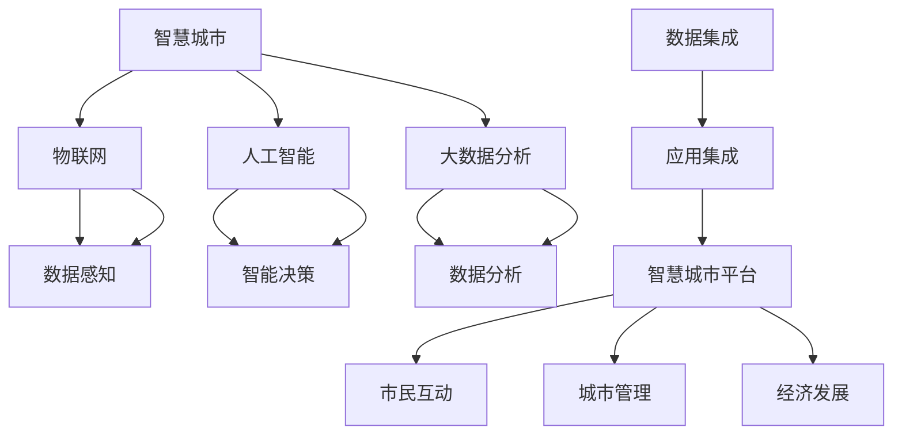

                 

# 智慧城市创业：打造未来宜居环境

> 关键词：智慧城市,宜居环境,人工智能,物联网,城市管理,城市数据

## 1. 背景介绍

### 1.1 问题由来
随着城市化进程的加速，世界各地的城市面临着诸如交通拥堵、能源消耗、环境污染、城市病等一系列挑战。传统的城市管理方式已经无法满足日益增长的需求，如何通过技术创新，提升城市运行效率，改善市民生活质量，成为各地城市管理者的迫切需求。

### 1.2 问题核心关键点
智慧城市是利用信息通信技术（ICT）和大数据，结合人工智能、物联网等前沿技术，优化城市管理，提高公共服务效率，提升市民幸福感的城市发展模式。智慧城市建设需要解决的核心问题包括：

- 数据采集：实现城市各项数据的实时采集和传输。
- 数据存储与处理：建立强大的数据存储和处理基础设施。
- 智能决策：通过数据分析和算法，提升决策的科学性和准确性。
- 应用集成：将各类智能应用无缝集成，形成统一的智慧城市平台。
- 人机协同：利用AI技术实现人机协作，优化城市运行。

### 1.3 问题研究意义
智慧城市建设不仅能提高城市运行效率，提升市民生活质量，还能推动经济发展，促进产业升级，为城市可持续发展提供动力。通过智慧城市创业，可以带动大量相关产业的发展，创造就业机会，推动社会进步。

## 2. 核心概念与联系

### 2.1 核心概念概述

智慧城市（Smart City）是融合信息技术、大数据分析、人工智能、物联网等技术的现代城市发展模式。智慧城市建设的关键在于实现数据感知、数据分析、智能决策和应用集成，形成一个全面的智慧城市生态系统。

物联网（Internet of Things, IoT）是实现智慧城市数据感知的基础设施。通过传感器、摄像头、智能终端等设备，实时采集城市各领域的各种数据，包括交通流量、环境污染、能源消耗、公共设施状态等。

人工智能（Artificial Intelligence, AI）是智慧城市智能决策的核心。通过机器学习、深度学习等算法，从大量数据中挖掘规律，提升决策的科学性和准确性。

大数据分析（Big Data Analysis）是智慧城市数据处理的关键技术。通过对采集到的海量数据进行分析，提取有用的信息和知识，为智慧城市应用提供支撑。

### 2.2 核心概念原理和架构的 Mermaid 流程图



这个流程图展示了智慧城市中各个核心概念之间的关系。数据感知层通过物联网设备采集城市数据，智能决策层利用人工智能算法分析数据，形成科学决策，应用集成层通过大数据分析技术整合各类应用，形成统一的智慧城市平台。市民和城市管理者可以通过平台互动，优化城市运行。

## 3. 核心算法原理 & 具体操作步骤

### 3.1 算法原理概述

智慧城市建设的算法原理主要包括以下几个方面：

- 数据感知：通过物联网设备采集各类城市数据。
- 数据分析：利用大数据技术处理和分析数据，提取有用信息。
- 智能决策：通过机器学习和深度学习算法，进行预测和决策。
- 应用集成：将各类智能应用无缝集成，形成统一的智慧城市平台。

### 3.2 算法步骤详解

智慧城市建设主要包括以下几个步骤：

**Step 1: 数据感知**

1. 部署物联网设备：在城市各个角落部署传感器、摄像头、智能终端等设备。
2. 实时数据采集：通过设备采集城市各领域的数据，如交通流量、环境污染、公共设施状态等。
3. 数据传输：将采集到的数据通过无线网络传输到数据存储平台。

**Step 2: 数据分析**

1. 数据清洗：对采集到的数据进行清洗和预处理，去除噪声和异常值。
2. 数据存储：建立数据仓库，将处理后的数据存储起来。
3. 数据处理：利用大数据技术进行数据挖掘和分析，提取有用的信息和知识。

**Step 3: 智能决策**

1. 模型选择：根据任务需求选择合适的机器学习或深度学习模型。
2. 模型训练：使用标注数据训练模型，使其能够进行预测和决策。
3. 模型应用：将训练好的模型应用到实际场景中，进行预测和决策。

**Step 4: 应用集成**

1. 应用开发：开发各类智能应用，如交通管理、能源管理、环境监测等。
2. 应用集成：将各类应用集成到一个统一的智慧城市平台，实现数据共享和协同工作。
3. 系统测试：对智慧城市平台进行测试，确保系统的稳定性和可靠性。

### 3.3 算法优缺点

智慧城市建设算法的主要优点包括：

- 提升效率：通过智能化手段，提升城市管理的效率和精度。
- 优化决策：利用大数据和机器学习算法，提升决策的科学性和准确性。
- 实现协同：各类应用集成在一个平台上，实现数据共享和协同工作。

同时，算法也存在一些缺点：

- 数据隐私：大量数据的采集和使用可能涉及隐私问题，需要严格的数据管理和保护措施。
- 技术复杂：智慧城市建设涉及的技术复杂，需要跨学科的知识和经验。
- 成本高昂：建设智慧城市需要大量资金投入，且对硬件设施和网络环境要求较高。
- 维护困难：智慧城市系统复杂，维护难度大，需要专业的技术团队进行维护。

### 3.4 算法应用领域

智慧城市建设的算法主要应用于以下领域：

- 交通管理：利用交通监控设备和智能算法，优化交通流，减少拥堵。
- 能源管理：通过智能电网和数据分析，优化能源分配，提高能源利用效率。
- 环境监测：利用传感器和数据分析，监测环境污染，提供实时环境报告。
- 公共安全：通过视频监控和智能分析，提高公共安全水平。
- 城市规划：利用数据分析，优化城市规划和资源配置。

## 4. 数学模型和公式 & 详细讲解 & 举例说明

### 4.1 数学模型构建

智慧城市建设涉及的数学模型主要包括：

- 机器学习模型：用于预测和决策，如回归、分类、聚类等。
- 深度学习模型：用于处理复杂数据，如图像、视频、语音等。
- 大数据分析模型：用于数据挖掘和知识提取。

### 4.2 公式推导过程

以交通流量预测为例，假设城市交通流量数据为 $X = \{x_1, x_2, ..., x_n\}$，预测未来交通流量为 $Y = \{y_1, y_2, ..., y_n\}$，则可以使用线性回归模型进行预测，公式如下：

$$
y_i = \beta_0 + \beta_1x_i + \epsilon_i
$$

其中 $\beta_0$ 和 $\beta_1$ 为模型的系数，$\epsilon_i$ 为误差项。

利用训练数据集 $D = \{(x_i, y_i)\}_{i=1}^n$，通过最小二乘法求解 $\beta_0$ 和 $\beta_1$，公式如下：

$$
\hat{\beta} = (X^TX)^{-1}X^TY
$$

### 4.3 案例分析与讲解

以城市能源管理为例，假设城市能源消耗数据为 $X = \{x_1, x_2, ..., x_n\}$，预测未来能源消耗为 $Y = \{y_1, y_2, ..., y_n\}$，则可以使用时间序列模型进行预测，公式如下：

$$
y_t = \alpha + \beta t + \gamma \sum_{i=1}^{t-1} y_i + \epsilon_t
$$

其中 $\alpha$ 和 $\beta$ 为模型参数，$\gamma$ 为权重系数，$\epsilon_t$ 为误差项。

利用历史能源消耗数据 $D = \{(x_t, y_t)\}_{t=1}^n$，通过最小化误差平方和 $E = \sum_{t=1}^n (y_t - \hat{y}_t)^2$，求解 $\alpha$ 和 $\beta$，公式如下：

$$
\hat{\alpha}, \hat{\beta} = \arg\min_{\alpha, \beta} E
$$

## 5. 项目实践：代码实例和详细解释说明

### 5.1 开发环境搭建

在进行智慧城市创业实践前，我们需要准备好开发环境。以下是使用Python进行开发的环境配置流程：

1. 安装Anaconda：从官网下载并安装Anaconda，用于创建独立的Python环境。

2. 创建并激活虚拟环境：
```bash
conda create -n smart-city-env python=3.8 
conda activate smart-city-env
```

3. 安装必要的库：
```bash
pip install pandas numpy matplotlib seaborn scikit-learn scipy stats
```

### 5.2 源代码详细实现

以下是使用Python进行智慧城市数据采集和分析的代码实现。

**数据采集**

```python
import pandas as pd
from pyspark.sql import SparkSession

# 创建SparkSession
spark = SparkSession.builder.appName("Smart City Data Collection").getOrCreate()

# 读取传感器数据
df = spark.read.csv("sensor_data.csv", header=True, inferSchema=True)

# 展示数据前5行
df.show()
```

**数据清洗**

```python
# 去除缺失值
df = df.dropna()

# 数据转换
df["time"] = pd.to_datetime(df["time"])

# 展示数据前5行
df.show()
```

**数据分析**

```python
# 数据可视化
df.plot(x="time", y="temperature", title="Temperature over Time", xlabel="Time", ylabel="Temperature")

# 统计分析
mean_temp = df["temperature"].mean()
median_temp = df["temperature"].median()
std_temp = df["temperature"].std()

print("Mean Temperature: ", mean_temp)
print("Median Temperature: ", median_temp)
print("Standard Deviation: ", std_temp)
```

### 5.3 代码解读与分析

让我们再详细解读一下关键代码的实现细节：

**数据采集**

- `spark` 模块是Apache Spark的Python API，用于分布式数据处理。通过Spark读取传感器数据，将数据存储在数据帧 `df` 中。

**数据清洗**

- 使用 `dropna()` 方法去除缺失值，确保数据完整性。
- 将时间列转换为Python的 `datetime` 类型，方便时间序列分析。

**数据分析**

- 使用 `plot()` 方法进行数据可视化，展示温度随时间变化的情况。
- 计算温度的均值、中位数和标准差，了解数据的分布情况。

## 6. 实际应用场景

### 6.1 智能交通管理

智能交通管理系统通过实时监控交通流量，利用大数据分析和机器学习算法，优化交通信号灯、智能导航等应用，提升交通管理效率。

具体而言，可以利用摄像头和传感器采集实时交通数据，利用数据分析技术挖掘交通规律，使用机器学习算法预测交通流量，优化交通信号灯和导航系统。例如，在特定路段发生拥堵时，智能系统可以自动调整信号灯周期，疏导交通，减少延误时间。

### 6.2 能源智能管理

能源智能管理系统通过智能电网和数据分析技术，优化能源分配，提高能源利用效率，降低能耗成本。

具体而言，可以利用智能电表和传感器采集能源消耗数据，利用大数据技术分析能源使用模式，使用机器学习算法预测能源需求，优化能源分配策略。例如，在夜间低谷时段，智能系统可以自动降低非必要的能源使用，节省能源费用。

### 6.3 公共安全监控

公共安全监控系统通过视频监控和智能分析，提高公共安全水平，保障市民安全。

具体而言，可以利用摄像头和传感器采集视频和环境数据，利用机器学习算法进行异常检测，识别异常行为和事件。例如，在公共场所发生可疑行为时，智能系统可以自动报警，通知安全人员进行处理。

### 6.4 未来应用展望

未来，随着技术的发展和应用场景的拓展，智慧城市建设将呈现以下几个趋势：

- 数据融合：通过物联网设备和传感器，实现城市各领域数据的全面采集和融合。
- 实时决策：利用大数据和人工智能技术，实现实时数据分析和决策。
- 智能协同：各类智能应用无缝集成，实现数据共享和协同工作。
- 人机交互：通过语音助手和虚拟现实技术，提升市民的智慧城市体验。

## 7. 工具和资源推荐

### 7.1 学习资源推荐

为了帮助开发者系统掌握智慧城市建设的技术基础和实践技巧，这里推荐一些优质的学习资源：

1. 《智能城市大数据分析》书籍：深入浅出地介绍了智慧城市大数据分析的方法和实践案例。

2. CS236《人工智能基础》课程：斯坦福大学开设的AI入门课程，涵盖了AI的原理和应用。

3. 《机器学习实战》书籍：全面介绍了机器学习和深度学习的实战技巧，适合初学者。

4. 《智慧城市与物联网》课程：了解智慧城市和物联网的基本概念和技术框架。

5. 《Python for Data Science》书籍：介绍Python在数据科学和机器学习中的实践应用。

通过对这些资源的学习实践，相信你一定能够快速掌握智慧城市建设的技术精髓，并用于解决实际问题。

### 7.2 开发工具推荐

高效的开发离不开优秀的工具支持。以下是几款用于智慧城市建设开发的常用工具：

1. Python：用于数据分析和机器学习，拥有丰富的第三方库和框架。

2. Apache Spark：用于分布式数据处理，支持大规模数据集的操作。

3. Apache Hadoop：用于大规模数据存储和分布式计算。

4. Apache Kafka：用于实时数据流处理，支持高吞吐量的数据采集。

5. Elasticsearch：用于全文搜索和数据分析，支持大规模数据索引和查询。

6. Tableau：用于数据可视化，支持复杂的数据分析和图表展示。

合理利用这些工具，可以显著提升智慧城市建设的开发效率，加快创新迭代的步伐。

### 7.3 相关论文推荐

智慧城市建设的研究始于学界的持续研究。以下是几篇奠基性的相关论文，推荐阅读：

1. Smart Cities: Research Directions, Survey, and Emerging Trends：全面综述了智慧城市的定义、研究方向和应用前景。

2. Smart City by Design: Merging Big Data and Smart City Applications：介绍了大数据技术在智慧城市中的应用。

3. Towards a Smart City: A Conceptual Framework for Smart City Implementation：提出了智慧城市实施的框架和方法。

4. Data Mining and Statistical Learning in Smart Cities：介绍了数据挖掘和机器学习在智慧城市中的应用。

5. Smart City and Internet of Things: A Survey of Architectures, Features, and Services：综述了智慧城市和物联网的架构、特征和服务。

这些论文代表了大规模城市数据处理和智慧城市建设的研究进展，通过学习这些前沿成果，可以帮助研究者把握学科前进方向，激发更多的创新灵感。

## 8. 总结：未来发展趋势与挑战

### 8.1 总结

本文对智慧城市建设的算法原理和操作步骤进行了全面系统的介绍。首先阐述了智慧城市的定义和核心技术，明确了数据感知、数据分析、智能决策和应用集成的关键步骤。其次，从原理到实践，详细讲解了智慧城市数据采集、数据分析和智能决策的算法流程，给出了完整的代码实现。同时，本文还广泛探讨了智慧城市建设在智能交通管理、能源智能管理、公共安全监控等多个行业领域的应用前景，展示了智慧城市技术的广阔应用空间。此外，本文精选了智慧城市建设的学习资源、开发工具和相关论文，力求为读者提供全方位的技术指引。

通过本文的系统梳理，可以看到，智慧城市建设是一个复杂而庞大的工程，涉及城市管理的各个方面。然而，通过技术创新和系统整合，智慧城市建设能够显著提升城市运行效率，改善市民生活质量，推动经济社会发展。未来，伴随着技术的不断进步和应用的不断拓展，智慧城市建设必将为全球城市管理带来新的革命性变化。

### 8.2 未来发展趋势

展望未来，智慧城市建设将呈现以下几个趋势：

- 数据融合：通过物联网设备和传感器，实现城市各领域数据的全面采集和融合。
- 实时决策：利用大数据和人工智能技术，实现实时数据分析和决策。
- 智能协同：各类智能应用无缝集成，实现数据共享和协同工作。
- 人机交互：通过语音助手和虚拟现实技术，提升市民的智慧城市体验。
- 跨领域应用：智慧城市技术将逐步应用于更多行业，如医疗、教育、农业等，提升各领域的管理水平。

### 8.3 面临的挑战

尽管智慧城市建设已经取得了显著成果，但在迈向更加智能化、普适化应用的过程中，仍面临诸多挑战：

- 数据隐私：大量数据的采集和使用可能涉及隐私问题，需要严格的数据管理和保护措施。
- 技术复杂：智慧城市建设涉及的技术复杂，需要跨学科的知识和经验。
- 成本高昂：建设智慧城市需要大量资金投入，且对硬件设施和网络环境要求较高。
- 维护困难：智慧城市系统复杂，维护难度大，需要专业的技术团队进行维护。

### 8.4 研究展望

面对智慧城市建设所面临的种种挑战，未来的研究需要在以下几个方面寻求新的突破：

- 数据隐私保护：开发隐私保护算法和技术，确保数据的采集和使用安全。
- 技术集成优化：优化智慧城市各应用之间的集成，提升系统的稳定性和可靠性。
- 资源优化利用：通过资源优化技术，提高智慧城市的运行效率和成本效益。
- 人机协作机制：研究人机协作机制，提升市民的智慧城市体验。
- 标准化和规范：制定智慧城市建设的标准和规范，促进不同系统和应用之间的互操作性。

这些研究方向的探索，必将引领智慧城市建设技术迈向更高的台阶，为构建更加智能、安全、便捷的城市提供新的动力。

## 9. 附录：常见问题与解答

**Q1: 智慧城市建设的核心技术是什么？**

A: 智慧城市建设的核心技术包括数据感知、数据分析、智能决策和应用集成。其中数据感知通过物联网设备和传感器实现，数据分析通过大数据技术处理和挖掘，智能决策通过机器学习和深度学习算法实现，应用集成通过平台集成和数据共享实现。

**Q2: 智慧城市建设需要哪些基础设施？**

A: 智慧城市建设需要以下基础设施：
- 高性能网络：支持大规模数据的实时传输和处理。
- 大规模数据存储：支持海量数据的存储和管理。
- 高性能计算：支持大规模数据和复杂算法的处理。
- 智能终端设备：支持数据采集和实时监控。

**Q3: 智慧城市建设对数据隐私有哪些要求？**

A: 智慧城市建设对数据隐私的要求包括：
- 数据匿名化：在数据采集和使用过程中，确保个人隐私不被泄露。
- 数据加密：在数据传输和存储过程中，确保数据安全。
- 数据访问控制：在数据访问过程中，确保只有授权人员才能获取数据。
- 数据生命周期管理：确保数据在整个生命周期内的安全性和完整性。

**Q4: 智慧城市建设对技术有哪些要求？**

A: 智慧城市建设对技术的要求包括：
- 高可用性：系统需要具有高可用性，保证数据的可靠性和系统的稳定性。
- 高性能：系统需要具有高性能，支持大规模数据和复杂算法的处理。
- 可扩展性：系统需要具有可扩展性，能够适应数据量的增长和技术的发展。
- 安全性：系统需要具有安全性，确保数据和系统的安全。

**Q5: 智慧城市建设对人员有哪些要求？**

A: 智慧城市建设对人员的要求包括：
- 跨学科知识：需要具备数据科学、计算机科学、城市规划等多学科知识。
- 项目管理能力：需要具备项目管理和团队协作能力。
- 技术创新能力：需要具备技术创新和应用推广能力。

这些问题的解答可以帮助你更好地理解智慧城市建设的原理和挑战，为智慧城市创业提供全面的技术指引。

---

作者：禅与计算机程序设计艺术 / Zen and the Art of Computer Programming

