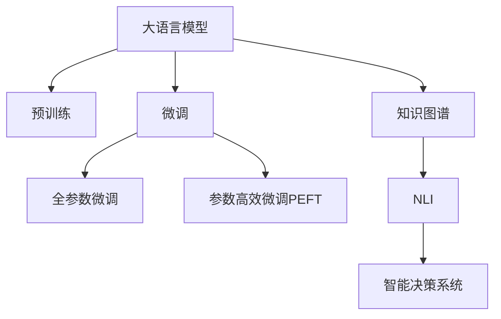

                 

# 智慧城市：LLM 增强的城市管理和服务

> 关键词：大语言模型,智能城市,智慧管理,智能服务,公共安全,城市运行,数据分析,优化决策

## 1. 背景介绍

### 1.1 问题由来
随着城市化进程的加快和智能技术的普及，智慧城市建设成为当今世界各国城市治理的热点。智慧城市不仅涵盖交通、能源、环境、公共安全等各个方面，还涉及数据融合、模型优化、决策支持等多个维度。传统城市管理和服务模式在数据量庞大、结构复杂、需求多样的背景下显得力不从心。因此，如何运用智能技术实现城市精细化管理，提升服务效率，优化决策质量，成为亟待解决的问题。

### 1.2 问题核心关键点
智慧城市建设的关键在于智能技术的应用和数据分析能力的提升。大语言模型（Large Language Models, LLMs）作为当前AI领域的前沿技术，其强大的自然语言处理能力，能够帮助城市管理者更高效地处理海量文本数据，提取关键信息，优化决策过程。基于大语言模型的智能城市管理和服务解决方案，有望大幅提升城市治理的智能化水平，实现智慧城市的理想目标。

### 1.3 问题研究意义
智慧城市建设依赖于数据分析、智能决策和精准服务三大要素，大语言模型能够在这些方面提供强有力的支撑。具体而言，其作用体现在：
1. 数据处理：自动分析各类文本数据，提取有用信息，如城市运行日志、新闻报道、社交媒体评论等，为城市管理者提供决策依据。
2. 智能决策：通过自然语言推理、知识图谱等技术，辅助城市管理者制定政策、规划城市布局、预测未来趋势。
3. 精准服务：利用自然语言生成技术，自动生成公告、通知、服务指南等内容，提升市民满意度。

## 2. 核心概念与联系

### 2.1 核心概念概述

为更好地理解LLM在智慧城市中的应用，本节将介绍几个密切相关的核心概念：

- 大语言模型(Large Language Models, LLMs)：以Transformer模型为代表，通过在大规模无标签文本语料上进行自监督预训练，学习到丰富的语言表示。能够进行文本分类、文本生成、问答等自然语言处理任务。
- 预训练(Pre-training)：指在大规模无标签文本语料上，通过自监督学习任务训练通用语言模型的过程。常见的预训练任务包括语言建模、掩码语言建模等。
- 微调(Fine-tuning)：指在预训练模型的基础上，使用下游任务的少量标注数据，通过有监督学习优化模型在该任务上的性能。
- 迁移学习(Transfer Learning)：指将一个领域学习到的知识，迁移应用到另一个不同但相关的领域的学习范式。大模型的预训练-微调过程即是一种典型的迁移学习方式。
- 知识图谱(Knowledge Graph)：基于结构化的实体关系数据构建的知识库，支持知识推理、信息检索等高级应用。
- 自然语言推理(Natural Language Inference, NLI)：指判断两个句子间逻辑关系的任务，是智慧城市中智能决策的重要基础。
- 智能决策系统(Decision Support System, DSS)：利用数据、模型和算法，辅助城市管理者进行决策的系统。

这些核心概念之间的逻辑关系可以通过以下Mermaid流程图来展示：



这个流程图展示了大语言模型的核心概念及其之间的关系：

1. 大语言模型通过预训练获得基础能力。
2. 微调是对预训练模型进行任务特定的优化，可以分为全参数微调和参数高效微调（PEFT）。
3. 知识图谱是数据融合和知识推理的基础，为大语言模型提供了额外的信息支持。
4. NLI是智慧决策中的关键技术，通过判断自然语言描述的逻辑关系，为决策提供更可靠的依据。
5. 智能决策系统利用数据、模型和知识，辅助城市管理者进行科学的决策。

这些概念共同构成了LLM在智慧城市中的应用框架，使其能够在各种场景下发挥强大的自然语言理解和处理能力。通过理解这些核心概念，我们可以更好地把握LLM在智慧城市中的作用和潜力。

## 3. 核心算法原理 & 具体操作步骤
### 3.1 算法原理概述

基于LLM的智慧城市管理和服务，本质上是一个有监督的细粒度迁移学习过程。其核心思想是：将预训练的LLM模型视作一个强大的"特征提取器"，通过在智慧城市相关任务上执行有监督微调，使得模型输出能够匹配特定任务的需求，从而实现城市管理的智能化和高效化。

形式化地，假设预训练模型为 $M_{\theta}$，其中 $\theta$ 为预训练得到的模型参数。给定智慧城市任务 $T$ 的标注数据集 $D=\{(x_i, y_i)\}_{i=1}^N$，微调的目标是找到新的模型参数 $\hat{\theta}$，使得：

$$
\hat{\theta}=\mathop{\arg\min}_{\theta} \mathcal{L}(M_{\theta},D)
$$

其中 $\mathcal{L}$ 为针对任务 $T$ 设计的损失函数，用于衡量模型预测输出与真实标签之间的差异。常见的损失函数包括交叉熵损失、均方误差损失等。

通过梯度下降等优化算法，微调过程不断更新模型参数 $\theta$，最小化损失函数 $\mathcal{L}$，使得模型输出逼近真实标签。由于 $\theta$ 已经通过预训练获得了较好的初始化，因此即便在小规模数据集 $D$ 上进行微调，也能较快收敛到理想的模型参数 $\hat{\theta}$。

### 3.2 算法步骤详解

基于监督学习的大语言模型微调一般包括以下几个关键步骤：

**Step 1: 准备预训练模型和数据集**
- 选择合适的预训练语言模型 $M_{\theta}$ 作为初始化参数，如 BERT、GPT等。
- 准备智慧城市任务 $T$ 的标注数据集 $D$，划分为训练集、验证集和测试集。一般要求标注数据与预训练数据的分布不要差异过大。

**Step 2: 添加任务适配层**
- 根据任务类型，在预训练模型顶层设计合适的输出层和损失函数。
- 对于分类任务，通常在顶层添加线性分类器和交叉熵损失函数。
- 对于生成任务，通常使用语言模型的解码器输出概率分布，并以负对数似然为损失函数。

**Step 3: 设置微调超参数**
- 选择合适的优化算法及其参数，如 AdamW、SGD 等，设置学习率、批大小、迭代轮数等。
- 设置正则化技术及强度，包括权重衰减、Dropout、Early Stopping 等。
- 确定冻结预训练参数的策略，如仅微调顶层，或全部参数都参与微调。

**Step 4: 执行梯度训练**
- 将训练集数据分批次输入模型，前向传播计算损失函数。
- 反向传播计算参数梯度，根据设定的优化算法和学习率更新模型参数。
- 周期性在验证集上评估模型性能，根据性能指标决定是否触发 Early Stopping。
- 重复上述步骤直到满足预设的迭代轮数或 Early Stopping 条件。

**Step 5: 测试和部署**
- 在测试集上评估微调后模型 $M_{\hat{\theta}}$ 的性能，对比微调前后的精度提升。
- 使用微调后的模型对新样本进行推理预测，集成到实际的应用系统中。
- 持续收集新的数据，定期重新微调模型，以适应数据分布的变化。

以上是基于监督学习微调大语言模型的一般流程。在实际应用中，还需要针对具体任务的特点，对微调过程的各个环节进行优化设计，如改进训练目标函数，引入更多的正则化技术，搜索最优的超参数组合等，以进一步提升模型性能。

### 3.3 算法优缺点

基于LLM的智慧城市管理和服务方法具有以下优点：
1. 数据处理能力强：LLM能够高效处理大量文本数据，提取关键信息，辅助城市管理者进行决策。
2. 智能化水平高：利用自然语言推理、知识图谱等技术，提高决策的科学性和可靠性。
3. 适应性强：微调模型能够根据数据分布的变化，进行动态调整，保持高效性。

同时，该方法也存在一定的局限性：
1. 依赖标注数据：微调的效果很大程度上取决于标注数据的质量和数量，获取高质量标注数据的成本较高。
2. 迁移能力有限：当目标任务与预训练数据的分布差异较大时，微调的性能提升有限。
3. 技术门槛高：智慧城市管理涉及多领域的知识，需要综合应用多种AI技术，对开发者的技术要求较高。
4. 系统复杂度高：智慧城市管理涉及的数据量大、任务复杂，系统集成和维护难度较大。

尽管存在这些局限性，但就目前而言，基于LLM的微调方法仍是大规模智慧城市建设的重要手段。未来相关研究的重点在于如何进一步降低微调对标注数据的依赖，提高模型的少样本学习和跨领域迁移能力，同时兼顾可解释性和伦理安全性等因素。

### 3.4 算法应用领域

基于LLM的智慧城市管理和服务方法，在多个领域得到应用：

- 公共安全：利用自然语言处理技术，自动分析新闻、社交媒体、报警电话等信息，实时监控并预警潜在的公共安全风险。
- 城市运行监测：通过分析交通、电力、水务等城市运行日志，识别异常事件，及时采取应对措施。
- 应急管理：利用自然语言推理和知识图谱，判断事件类型和影响范围，优化应急资源分配。
- 城市规划：利用文本数据分析和知识图谱，辅助城市规划决策，优化城市布局。
- 市民服务：通过自动生成公告、通知、服务指南等内容，提升市民体验和满意度。

除了上述这些应用领域，LLM在智慧城市中的潜在价值还包括智能交通、智慧医疗、智慧环保等多个方面，为其注入新的活力。

## 4. 数学模型和公式 & 详细讲解  
### 4.1 数学模型构建

本节将使用数学语言对基于LLM的智慧城市管理和服务过程进行更加严格的刻画。

记预训练语言模型为 $M_{\theta}$，其中 $\theta$ 为预训练得到的模型参数。假设智慧城市任务 $T$ 的训练集为 $D=\{(x_i,y_i)\}_{i=1}^N, x_i \in \mathcal{X}, y_i \in \mathcal{Y}$。

定义模型 $M_{\theta}$ 在数据样本 $(x,y)$ 上的损失函数为 $\ell(M_{\theta}(x),y)$，则在数据集 $D$ 上的经验风险为：

$$
\mathcal{L}(\theta) = \frac{1}{N} \sum_{i=1}^N \ell(M_{\theta}(x_i),y_i)
$$

微调的优化目标是最小化经验风险，即找到最优参数：

$$
\theta^* = \mathop{\arg\min}_{\theta} \mathcal{L}(\theta)
$$

在实践中，我们通常使用基于梯度的优化算法（如SGD、Adam等）来近似求解上述最优化问题。设 $\eta$ 为学习率，$\lambda$ 为正则化系数，则参数的更新公式为：

$$
\theta \leftarrow \theta - \eta \nabla_{\theta}\mathcal{L}(\theta) - \eta\lambda\theta
$$

其中 $\nabla_{\theta}\mathcal{L}(\theta)$ 为损失函数对参数 $\theta$ 的梯度，可通过反向传播算法高效计算。

### 4.2 公式推导过程

以下我们以公共安全事件监控为例，推导交叉熵损失函数及其梯度的计算公式。

假设模型 $M_{\theta}$ 在输入 $x$ 上的输出为 $\hat{y}=M_{\theta}(x) \in [0,1]$，表示样本属于紧急情况的预测概率。真实标签 $y \in \{0,1\}$。则二分类交叉熵损失函数定义为：

$$
\ell(M_{\theta}(x),y) = -[y\log \hat{y} + (1-y)\log (1-\hat{y})]
$$

将其代入经验风险公式，得：

$$
\mathcal{L}(\theta) = -\frac{1}{N}\sum_{i=1}^N [y_i\log M_{\theta}(x_i)+(1-y_i)\log(1-M_{\theta}(x_i))]
$$

根据链式法则，损失函数对参数 $\theta_k$ 的梯度为：

$$
\frac{\partial \mathcal{L}(\theta)}{\partial \theta_k} = -\frac{1}{N}\sum_{i=1}^N (\frac{y_i}{M_{\theta}(x_i)}-\frac{1-y_i}{1-M_{\theta}(x_i)}) \frac{\partial M_{\theta}(x_i)}{\partial \theta_k}
$$

其中 $\frac{\partial M_{\theta}(x_i)}{\partial \theta_k}$ 可进一步递归展开，利用自动微分技术完成计算。

在得到损失函数的梯度后，即可带入参数更新公式，完成模型的迭代优化。重复上述过程直至收敛，最终得到适应智慧城市任务的最优模型参数 $\theta^*$。

## 5. 项目实践：代码实例和详细解释说明
### 5.1 开发环境搭建

在进行智慧城市管理和服务开发前，我们需要准备好开发环境。以下是使用Python进行PyTorch开发的环境配置流程：

1. 安装Anaconda：从官网下载并安装Anaconda，用于创建独立的Python环境。

2. 创建并激活虚拟环境：
```bash
conda create -n pytorch-env python=3.8 
conda activate pytorch-env
```

3. 安装PyTorch：根据CUDA版本，从官网获取对应的安装命令。例如：
```bash
conda install pytorch torchvision torchaudio cudatoolkit=11.1 -c pytorch -c conda-forge
```

4. 安装Transformers库：
```bash
pip install transformers
```

5. 安装各类工具包：
```bash
pip install numpy pandas scikit-learn matplotlib tqdm jupyter notebook ipython
```

完成上述步骤后，即可在`pytorch-env`环境中开始开发实践。

### 5.2 源代码详细实现

下面我们以智慧城市中的公共安全事件监控为例，给出使用Transformers库对BERT模型进行微调的PyTorch代码实现。

首先，定义公共安全事件监控任务的标注数据处理函数：

```python
from transformers import BertTokenizer
from torch.utils.data import Dataset
import torch

class PublicSafetyDataset(Dataset):
    def __init__(self, texts, labels, tokenizer, max_len=128):
        self.texts = texts
        self.labels = labels
        self.tokenizer = tokenizer
        self.max_len = max_len
        
    def __len__(self):
        return len(self.texts)
    
    def __getitem__(self, item):
        text = self.texts[item]
        label = self.labels[item]
        
        encoding = self.tokenizer(text, return_tensors='pt', max_length=self.max_len, padding='max_length', truncation=True)
        input_ids = encoding['input_ids'][0]
        attention_mask = encoding['attention_mask'][0]
        
        # 对label进行编码
        encoded_label = label2id[label] 
        encoded_label = torch.tensor(encoded_label, dtype=torch.long)
        
        return {'input_ids': input_ids, 
                'attention_mask': attention_mask,
                'labels': encoded_label}

# 标签与id的映射
label2id = {'low_severity': 0, 'high_severity': 1}
id2label = {v: k for k, v in label2id.items()}

# 创建dataset
tokenizer = BertTokenizer.from_pretrained('bert-base-cased')

train_dataset = PublicSafetyDataset(train_texts, train_labels, tokenizer)
dev_dataset = PublicSafetyDataset(dev_texts, dev_labels, tokenizer)
test_dataset = PublicSafetyDataset(test_texts, test_labels, tokenizer)
```

然后，定义模型和优化器：

```python
from transformers import BertForTokenClassification, AdamW

model = BertForTokenClassification.from_pretrained('bert-base-cased', num_labels=len(label2id))

optimizer = AdamW(model.parameters(), lr=2e-5)
```

接着，定义训练和评估函数：

```python
from torch.utils.data import DataLoader
from tqdm import tqdm
from sklearn.metrics import classification_report

device = torch.device('cuda') if torch.cuda.is_available() else torch.device('cpu')
model.to(device)

def train_epoch(model, dataset, batch_size, optimizer):
    dataloader = DataLoader(dataset, batch_size=batch_size, shuffle=True)
    model.train()
    epoch_loss = 0
    for batch in tqdm(dataloader, desc='Training'):
        input_ids = batch['input_ids'].to(device)
        attention_mask = batch['attention_mask'].to(device)
        labels = batch['labels'].to(device)
        model.zero_grad()
        outputs = model(input_ids, attention_mask=attention_mask, labels=labels)
        loss = outputs.loss
        epoch_loss += loss.item()
        loss.backward()
        optimizer.step()
    return epoch_loss / len(dataloader)

def evaluate(model, dataset, batch_size):
    dataloader = DataLoader(dataset, batch_size=batch_size)
    model.eval()
    preds, labels = [], []
    with torch.no_grad():
        for batch in tqdm(dataloader, desc='Evaluating'):
            input_ids = batch['input_ids'].to(device)
            attention_mask = batch['attention_mask'].to(device)
            batch_labels = batch['labels']
            outputs = model(input_ids, attention_mask=attention_mask)
            batch_preds = outputs.logits.argmax(dim=2).to('cpu').tolist()
            batch_labels = batch_labels.to('cpu').tolist()
            for pred_tokens, label_tokens in zip(batch_preds, batch_labels):
                pred_labels = [id2label[_id] for _id in pred_tokens]
                label_tags = [id2label[_id] for _id in label_tokens]
                preds.append(pred_labels[:len(label_tags)])
                labels.append(label_tags)
                
    print(classification_report(labels, preds))
```

最后，启动训练流程并在测试集上评估：

```python
epochs = 5
batch_size = 16

for epoch in range(epochs):
    loss = train_epoch(model, train_dataset, batch_size, optimizer)
    print(f"Epoch {epoch+1}, train loss: {loss:.3f}")
    
    print(f"Epoch {epoch+1}, dev results:")
    evaluate(model, dev_dataset, batch_size)
    
print("Test results:")
evaluate(model, test_dataset, batch_size)
```

以上就是使用PyTorch对BERT进行智慧城市中公共安全事件监控任务微调的完整代码实现。可以看到，得益于Transformers库的强大封装，我们可以用相对简洁的代码完成BERT模型的加载和微调。

### 5.3 代码解读与分析

让我们再详细解读一下关键代码的实现细节：

**PublicSafetyDataset类**：
- `__init__`方法：初始化文本、标签、分词器等关键组件。
- `__len__`方法：返回数据集的样本数量。
- `__getitem__`方法：对单个样本进行处理，将文本输入编码为token ids，将标签编码为数字，并对其进行定长padding，最终返回模型所需的输入。

**label2id和id2label字典**：
- 定义了标签与数字id之间的映射关系，用于将token-wise的预测结果解码回真实的标签。

**训练和评估函数**：
- 使用PyTorch的DataLoader对数据集进行批次化加载，供模型训练和推理使用。
- 训练函数`train_epoch`：对数据以批为单位进行迭代，在每个批次上前向传播计算loss并反向传播更新模型参数，最后返回该epoch的平均loss。
- 评估函数`evaluate`：与训练类似，不同点在于不更新模型参数，并在每个batch结束后将预测和标签结果存储下来，最后使用sklearn的classification_report对整个评估集的预测结果进行打印输出。

**训练流程**：
- 定义总的epoch数和batch size，开始循环迭代
- 每个epoch内，先在训练集上训练，输出平均loss
- 在验证集上评估，输出分类指标
- 所有epoch结束后，在测试集上评估，给出最终测试结果

可以看到，PyTorch配合Transformers库使得BERT微调的代码实现变得简洁高效。开发者可以将更多精力放在数据处理、模型改进等高层逻辑上，而不必过多关注底层的实现细节。

当然，工业级的系统实现还需考虑更多因素，如模型的保存和部署、超参数的自动搜索、更灵活的任务适配层等。但核心的微调范式基本与此类似。

## 6. 实际应用场景
### 6.1 智能交通管理

基于大语言模型的智慧城市管理，在智能交通管理中有着广泛的应用。交通系统复杂多变，涉及行车数据、信号控制数据、天气信息等多种信息源。如何实时分析和处理这些海量数据，辅助交通管理决策，是智能交通的核心问题。

利用大语言模型，可以实现智能交通信息的自动提取和分析，优化交通流控制，降低交通事故和拥堵率。具体而言，通过交通摄像头获取的实时图像，大语言模型能够自动识别车牌信息、行人、车辆等关键信息，辅助交通监控系统实现车辆自动追踪、流量预测等功能。

### 6.2 城市运行数据分析

城市运行数据分析是智慧城市建设的重要环节，涉及电力、水务、供热等多个领域。如何从海量运营日志中提取关键信息，为城市管理者提供决策依据，是数据分析的核心任务。

利用大语言模型，可以实现城市运营数据的自动标注和分析，提取重要的性能指标和异常事件。例如，对于水务系统，通过自动分析水表数据，可以识别出漏损事件、爆管事件等异常情况，并及时采取维修措施，降低水资源浪费。

### 6.3 智慧医疗服务

智慧医疗是智慧城市的重要组成部分，涉及医疗资源分配、疾病预测、健康监测等多个环节。如何利用数据驱动医疗决策，提高医疗服务质量，是当前面临的挑战。

利用大语言模型，可以实现智能化的医疗数据分析和预测。例如，通过自动分析患者病历和社交媒体数据，大语言模型能够预测患者的疾病趋势，辅助医生制定治疗方案。同时，通过自然语言处理技术，可以实现智能化的健康咨询和电子病历管理，提升医疗服务效率。

### 6.4 未来应用展望

随着大语言模型和智慧城市技术的发展，基于大语言模型的智慧城市管理和服务将呈现以下几个发展趋势：

1. 多模态数据融合：除了文本数据，未来大语言模型将更多地应用图像、语音、视频等多模态数据，实现跨领域的信息融合和知识推理。
2. 实时化处理：通过边缘计算等技术，大语言模型将在云端和本地同时处理数据，实现低延迟的实时分析和决策。
3. 自适应学习：利用主动学习和迁移学习等技术，大语言模型能够不断从新数据中学习，优化模型性能。
4. 开放性平台：构建开放性智慧城市管理平台，实现数据的开放共享，提升城市管理的透明性和参与度。
5. 伦理性治理：在智慧城市管理中引入伦理导向的决策机制，确保决策过程符合人类价值观和伦理道德。

这些趋势将进一步提升大语言模型在智慧城市中的应用价值，构建更加安全、高效、透明、可解释的智慧城市生态系统。

## 7. 工具和资源推荐
### 7.1 学习资源推荐

为了帮助开发者系统掌握大语言模型在智慧城市中的应用，这里推荐一些优质的学习资源：

1. 《智慧城市技术概论》系列博文：由智慧城市技术专家撰写，介绍智慧城市的基本概念、技术架构和应用案例。

2. 《自然语言处理综述》课程：斯坦福大学开设的NLP经典课程，涵盖深度学习、自然语言推理等核心内容，适合初学者入门。

3. 《智慧城市数据分析与建模》书籍：系统介绍智慧城市中的数据分析和建模技术，包含大量实际案例和代码实现。

4. 《智慧城市建设与运营》视频课程：由行业专家讲解智慧城市建设的最新进展和实践经验，适合行业从业者学习。

5. Kaggle平台：全球最大的数据科学竞赛平台，提供丰富的数据集和模型优化算法，适合实践操作。

通过对这些资源的学习实践，相信你一定能够快速掌握大语言模型在智慧城市中的应用技巧，并用于解决实际的智慧城市问题。
###  7.2 开发工具推荐

高效的开发离不开优秀的工具支持。以下是几款用于大语言模型在智慧城市中应用的常用工具：

1. PyTorch：基于Python的开源深度学习框架，灵活动态的计算图，适合快速迭代研究。大部分预训练语言模型都有PyTorch版本的实现。

2. TensorFlow：由Google主导开发的开源深度学习框架，生产部署方便，适合大规模工程应用。同样有丰富的预训练语言模型资源。

3. Transformers库：HuggingFace开发的NLP工具库，集成了众多SOTA语言模型，支持PyTorch和TensorFlow，是进行智慧城市微调任务开发的利器。

4. Weights & Biases：模型训练的实验跟踪工具，可以记录和可视化模型训练过程中的各项指标，方便对比和调优。与主流深度学习框架无缝集成。

5. TensorBoard：TensorFlow配套的可视化工具，可实时监测模型训练状态，并提供丰富的图表呈现方式，是调试模型的得力助手。

6. Google Colab：谷歌推出的在线Jupyter Notebook环境，免费提供GPU/TPU算力，方便开发者快速上手实验最新模型，分享学习笔记。

合理利用这些工具，可以显著提升智慧城市管理和服务系统的开发效率，加快创新迭代的步伐。

### 7.3 相关论文推荐

大语言模型在智慧城市中的应用源于学界的持续研究。以下是几篇奠基性的相关论文，推荐阅读：

1. Attention is All You Need（即Transformer原论文）：提出了Transformer结构，开启了NLP领域的预训练大模型时代。

2. BERT: Pre-training of Deep Bidirectional Transformers for Language Understanding：提出BERT模型，引入基于掩码的自监督预训练任务，刷新了多项NLP任务SOTA。

3. Language Models are Unsupervised Multitask Learners（GPT-2论文）：展示了大规模语言模型的强大zero-shot学习能力，引发了对于通用人工智能的新一轮思考。

4. Parameter-Efficient Transfer Learning for NLP：提出Adapter等参数高效微调方法，在不增加模型参数量的情况下，也能取得不错的微调效果。

5. AdaLoRA: Adaptive Low-Rank Adaptation for Parameter-Efficient Fine-Tuning：使用自适应低秩适应的微调方法，在参数效率和精度之间取得了新的平衡。

这些论文代表了大语言模型在智慧城市中的应用发展脉络。通过学习这些前沿成果，可以帮助研究者把握学科前进方向，激发更多的创新灵感。

## 8. 总结：未来发展趋势与挑战
### 8.1 总结

本文对基于大语言模型的智慧城市管理和服务进行了全面系统的介绍。首先阐述了大语言模型和智慧城市建设的研究背景和意义，明确了LLM在智慧城市中的应用价值。其次，从原理到实践，详细讲解了基于LLM的微调方法，给出了智慧城市管理和服务任务的代码实现。同时，本文还广泛探讨了LLM在智慧城市中的实际应用场景，展示了LLM在智能交通、城市运行数据分析、智慧医疗等方面的潜力。最后，本文精选了LLM的各类学习资源，力求为读者提供全方位的技术指引。

通过本文的系统梳理，可以看到，基于大语言模型的智慧城市管理和服务方法正在成为智慧城市建设的重要手段，极大地提升了城市治理的智能化水平，提高了公共服务质量。未来，伴随大语言模型的进一步发展，基于LLM的智慧城市管理和服务必将迎来更广阔的应用前景。

### 8.2 未来发展趋势

展望未来，基于LLM的智慧城市管理和服务将呈现以下几个发展趋势：

1. 智能化水平持续提升：随着大语言模型的演进，智能化的水平将持续提升，能够处理更加复杂多变的城市管理任务。
2. 跨领域融合深入：智慧城市管理涉及多领域的知识，未来LLM将更多地融合不同领域的数据和知识，提升决策的全面性和科学性。
3. 实时化处理普及：通过边缘计算等技术，LLM将在云端和本地同时处理数据，实现低延迟的实时分析和决策。
4. 自适应学习能力增强：利用主动学习和迁移学习等技术，LLM能够不断从新数据中学习，优化模型性能。
5. 伦理性治理加强：在智慧城市管理中引入伦理导向的决策机制，确保决策过程符合人类价值观和伦理道德。

这些趋势将进一步提升基于LLM的智慧城市管理和服务系统的性能和应用范围，为构建安全、高效、透明、可解释的智慧城市生态系统提供技术支持。

### 8.3 面临的挑战

尽管基于LLM的智慧城市管理和服务方法已经取得了瞩目成就，但在迈向更加智能化、普适化应用的过程中，它仍面临着诸多挑战：

1. 数据隐私和安全：智慧城市管理涉及大量市民个人数据，如何保障数据隐私和安全，防止数据滥用，是首要挑战。
2. 系统复杂度高：智慧城市管理涉及多领域的数据和任务，系统集成和维护难度较大，需要考虑数据一致性、服务协同等问题。
3. 技术门槛高：智慧城市管理涉及多种AI技术，对开发者的技术要求较高，需要综合应用自然语言处理、知识图谱、机器学习等多个领域的知识。
4. 性能和效率优化：智慧城市管理涉及海量数据处理，如何提升处理速度和系统效率，是技术实现的难点。
5. 伦理和社会接受度：如何平衡技术应用与人类价值观，确保智慧城市管理的公平性和公正性，是重要的伦理问题。

尽管存在这些挑战，但就目前而言，基于LLM的智慧城市管理和服务方法仍是大规模智慧城市建设的重要手段。未来相关研究的重点在于如何进一步提升模型的实时性、可靠性和可解释性，同时降低系统的复杂度和技术门槛，保障数据隐私和安全。

### 8.4 研究展望

面对LLM在智慧城市管理和服务中面临的挑战，未来的研究需要在以下几个方面寻求新的突破：

1. 实时化处理技术：开发更高效的算法和模型结构，实现实时化的数据处理和分析。
2. 自适应学习机制：引入自适应学习技术，使LLM能够不断从新数据中学习，优化模型性能。
3. 可解释性和透明性：提高模型的可解释性，使其输出具有透明性，便于决策者和公众理解和监督。
4. 多模态融合技术：融合图像、语音、视频等多模态数据，提升信息融合和知识推理能力。
5. 伦理和社会责任：引入伦理导向的决策机制，确保智慧城市管理符合人类价值观和伦理道德。

这些研究方向将引领基于LLM的智慧城市管理和服务方法迈向更高的台阶，为构建更加安全、高效、透明、可解释的智慧城市生态系统提供新的动力。面向未来，LLM在智慧城市中的研究和应用将不断拓展，为智能城市的建设和发展注入新的活力。

## 9. 附录：常见问题与解答

**Q1：如何选择合适的预训练语言模型？**

A: 选择合适的预训练语言模型需要考虑以下几个因素：
1. 任务的复杂度：对于简单的NLP任务，如文本分类，BERT等较小的模型即可；对于复杂的任务，如问答、生成，应选择更大的模型。
2. 数据规模：数据规模较大的任务，如大规模语料预训练，应选择规模更大的模型。
3. 计算资源：计算资源有限的情况下，应选择参数量较小的模型，避免过拟合。
4. 应用场景：不同场景对模型的实时性、准确性等要求不同，应选择适合的模型。

**Q2：微调过程中如何进行数据增强？**

A: 数据增强是提升模型泛化能力的重要手段，可以通过以下方法进行：
1. 回译：将文本回译为其他语言，增加数据样本的多样性。
2. 近义词替换：将文本中的词汇替换为同义词，增加数据样本的多样性。
3. 文本扰动：通过随机插入、删除、替换等手段，生成新的文本样本。
4. 数据扩充：通过将不同来源的数据合并，增加数据样本的多样性。

**Q3：智慧城市管理中如何保障数据隐私和安全？**

A: 保障数据隐私和安全是智慧城市管理的重要任务，可以通过以下方法：
1. 数据加密：对敏感数据进行加密处理，防止数据泄露。
2. 匿名化处理：对个人数据进行匿名化处理，防止个人隐私泄露。
3. 访问控制：设置严格的访问权限，防止未经授权的数据访问。
4. 安全审计：定期进行安全审计，确保系统安全。
5. 数据合规：遵循相关法律法规，确保数据处理合规。

**Q4：智慧城市管理中如何优化模型性能？**

A: 优化模型性能可以通过以下方法：
1. 模型裁剪：去除不必要的层和参数，减小模型尺寸，加快推理速度。
2. 量化加速：将浮点模型转为定点模型，压缩存储空间，提高计算效率。
3. 模型并行：使用模型并行技术，提升模型的并行处理能力。
4. 模型蒸馏：通过模型蒸馏技术，将大模型转化为小模型，提升推理速度和效率。
5. 微调策略优化：选择适当的微调策略和超参数，提高微调效果。

**Q5：智慧城市管理中如何引入伦理性治理？**

A: 引入伦理性治理可以保障智慧城市管理的公平性和公正性，可以通过以下方法：
1. 伦理导向的决策机制：引入伦理导向的决策机制，确保决策过程符合人类价值观和伦理道德。
2. 透明性：提高智慧城市管理的透明性，便于公众监督和参与。
3. 社会责任：在智慧城市管理中引入社会责任意识，确保系统的公平性和公正性。
4. 公众参与：鼓励公众参与智慧城市管理，提高治理的民主性和参与性。

这些问题的解答提供了智慧城市管理和服务中的常见技术和方法，希望能为你提供帮助和启发。

---

作者：禅与计算机程序设计艺术 / Zen and the Art of Computer Programming

