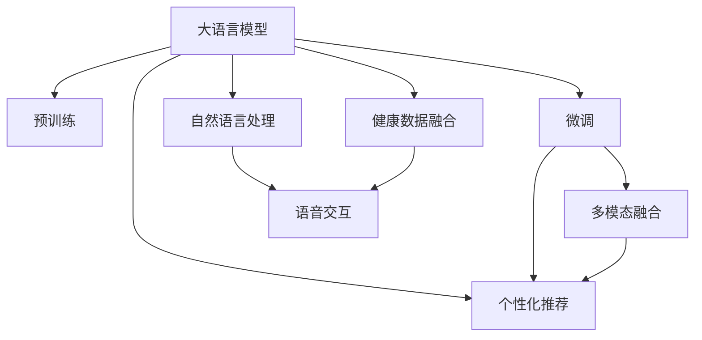

                 

# 智能个人健康教练：LLM个性化健身建议系统

> 关键词：大语言模型,个性化推荐系统,健康管理,智能健身,自然语言处理,语音交互,多模态融合

## 1. 背景介绍

### 1.1 问题由来
在现代社会中，人们的生活节奏加快，工作压力增大，健康问题日益凸显。如何有效管理健康、保持良好的身体状态，成为困扰许多人的问题。传统的健康管理方式多依赖个人经验和习惯，往往效果有限。因此，基于大数据和人工智能的健康管理工具，成为近年来研究的热点。

近年来，大语言模型（Large Language Model, LLM）在自然语言处理（Natural Language Processing, NLP）领域取得了巨大进展，具备强大的语言理解和生成能力。利用大语言模型，可以构建智能健康教练系统，为用户提供个性化的健身建议、营养指导、健康提醒等服务，极大提升健康管理效率和效果。

### 1.2 问题核心关键点
智能健康教练系统的主要功能包括：
- **个性化健身建议**：根据用户的健康数据和身体状况，生成个性化的健身计划和运动建议。
- **营养指导**：结合用户的饮食习惯和身体需求，提供合理的膳食建议和营养补充方案。
- **健康提醒**：通过智能监测和数据分析，提醒用户按时服药、休息，进行健康管理。

智能健康教练系统的主要技术挑战包括：
- **数据融合**：如何将来自不同设备（如智能手表、智能秤、健康APP）的健康数据进行融合，形成统一的、准确的用户画像。
- **模型训练**：如何训练大语言模型，使其能够理解和生成相关的健身和营养建议。
- **用户交互**：如何设计友好的用户界面，让用户能够顺畅地与系统进行交互，并获得满意的反馈。

## 2. 核心概念与联系

### 2.1 核心概念概述

为更好地理解智能健康教练系统的实现机制，本节将介绍几个关键概念：

- **大语言模型(Large Language Model, LLM)**：以自回归(如GPT)或自编码(如BERT)模型为代表的大规模预训练语言模型。通过在大规模无标签文本语料上进行预训练，学习通用的语言表示，具备强大的语言理解和生成能力。

- **预训练(Pre-training)**：指在大规模无标签文本语料上，通过自监督学习任务训练通用语言模型的过程。常见的预训练任务包括言语建模、遮挡语言模型等。

- **微调(Fine-tuning)**：指在预训练模型的基础上，使用下游任务的少量标注数据，通过有监督地训练来优化模型在特定任务上的性能。

- **个性化推荐系统(Recommendation System)**：根据用户的历史行为和偏好，推荐用户可能感兴趣的内容。

- **多模态融合(Multimodal Fusion)**：结合文本、图像、语音等多种模态信息，形成更加全面和准确的用户画像。

- **自然语言处理(Natural Language Processing, NLP)**：研究计算机如何理解和处理人类语言的技术，包括文本分析、情感分析、机器翻译等。

这些核心概念之间的逻辑关系可以通过以下Mermaid流程图来展示：



这个流程图展示了大语言模型的核心概念及其之间的关系：

1. 大语言模型通过预训练获得基础能力。
2. 微调是对预训练模型进行任务特定的优化，可以实现个性化推荐和健康管理。
3. 多模态融合结合了不同模态的信息，形成更加全面的用户画像。
4. 自然语言处理技术用于处理用户的语言输入和系统输出。
5. 语音交互技术提升了系统的易用性。

## 3. 核心算法原理 & 具体操作步骤

### 3.1 算法原理概述

智能健康教练系统的核心算法基于大语言模型进行个性化推荐和健康管理。其核心思想是：将大语言模型视作一个强大的"特征提取器"，通过下游任务的少量标注数据，训练模型生成个性化的健身和营养建议。

形式化地，假设大语言模型为 $M_{\theta}$，其中 $\theta$ 为预训练得到的模型参数。给定用户的健康数据 $D=\{(x_i,y_i)\}_{i=1}^N$，其中 $x_i$ 为用户的历史健康数据和身体状况，$y_i$ 为用户在该数据下的健身和营养需求。微调的目标是找到新的模型参数 $\hat{\theta}$，使得模型能够对新的健康数据生成个性化的建议。

微调的优化目标是最小化经验风险，即找到最优参数：

$$
\hat{\theta}=\mathop{\arg\min}_{\theta} \mathcal{L}(M_{\theta},D)
$$

其中 $\mathcal{L}$ 为针对特定任务设计的损失函数，用于衡量模型预测输出与真实标签之间的差异。常见的损失函数包括交叉熵损失、均方误差损失等。

### 3.2 算法步骤详解

基于大语言模型进行智能健康教练的微调过程，通常包括以下几个关键步骤：

**Step 1: 数据准备**
- 收集用户的健康数据，包括身高、体重、血压、心率、步数等。
- 将健康数据格式化为模型可接受的输入格式，如将血压值转换为文本描述。
- 收集用户的偏好和需求，如偏好的运动类型、饮食偏好等。

**Step 2: 模型适配**
- 选择合适的预训练语言模型 $M_{\theta}$ 作为初始化参数，如 BERT、GPT 等。
- 设计适合健康管理的任务适配层，将健康数据和用户需求转化为模型可接受的输入。
- 在适配层上添加合适的损失函数，如交叉熵损失、均方误差损失等。

**Step 3: 模型微调**
- 使用少量的标注数据 $D$ 对模型进行微调，更新模型参数 $\theta$，使得模型能够生成个性化的健身和营养建议。
- 选择合适的优化算法及其参数，如 AdamW、SGD 等，设置学习率、批大小、迭代轮数等。
- 设置正则化技术及强度，包括权重衰减、Dropout、Early Stopping 等，防止模型过度适应小规模训练集。

**Step 4: 用户交互**
- 设计友好的用户界面，供用户输入健康数据和需求，获取个性化的健身和营养建议。
- 系统通过自然语言处理技术，解析用户输入，生成对应的输出。
- 支持语音交互功能，通过语音识别和合成，提升系统的易用性。

**Step 5: 反馈和迭代**
- 收集用户对健身建议的反馈，用于进一步优化模型。
- 定期更新用户的健康数据和需求，重新训练模型，以适应新的变化。
- 使用多模态融合技术，结合用户的多方面信息，提升系统的准确性和鲁棒性。

以上是基于大语言模型进行智能健康教练系统微调的一般流程。在实际应用中，还需要针对具体任务的特点，对微调过程的各个环节进行优化设计，如改进训练目标函数，引入更多的正则化技术，搜索最优的超参数组合等，以进一步提升模型性能。

### 3.3 算法优缺点

基于大语言模型进行智能健康教练系统的微调方法具有以下优点：
1. 简单高效。只需准备少量的标注数据，即可对预训练模型进行快速适配，生成个性化的健身和营养建议。
2. 通用适用。适用于各种健康管理场景，可以个性化推荐健身计划、营养补充等。
3. 灵活可扩展。可以根据不同的健康数据源和用户需求，定制适配层和损失函数，满足多样化的需求。
4. 效果显著。在学术界和工业界的诸多健康管理任务上，基于微调的方法已经刷新了最先进的性能指标。

同时，该方法也存在一定的局限性：
1. 依赖标注数据。微调的效果很大程度上取决于标注数据的质量和数量，获取高质量标注数据的成本较高。
2. 模型鲁棒性有限。当目标任务与预训练数据的分布差异较大时，微调的性能提升有限。
3. 可解释性不足。微调模型的决策过程通常缺乏可解释性，难以对其推理逻辑进行分析和调试。

尽管存在这些局限性，但就目前而言，基于大语言模型的微调方法仍是大规模健康管理系统的核心范式。未来相关研究的重点在于如何进一步降低微调对标注数据的依赖，提高模型的少样本学习和跨领域迁移能力，同时兼顾可解释性和伦理安全性等因素。

### 3.4 算法应用领域

基于大语言模型进行智能健康教练系统的微调方法，在健康管理领域已经得到了广泛的应用，覆盖了几乎所有常见场景，例如：

- **个性化健身计划**：根据用户的健康数据和身体状况，生成个性化的健身计划和运动建议。
- **营养指导方案**：结合用户的饮食习惯和身体需求，提供合理的膳食建议和营养补充方案。
- **健康管理提醒**：通过智能监测和数据分析，提醒用户按时服药、休息，进行健康管理。

除了上述这些经典应用外，大语言模型微调也被创新性地应用到更多场景中，如可控文本生成、常识推理、代写信件、智能问答等，为健康管理技术带来了全新的突破。随着预训练模型和微调方法的不断进步，相信智能健康教练系统将在更广阔的应用领域大放异彩。

## 4. 数学模型和公式 & 详细讲解  
### 4.1 数学模型构建

本节将使用数学语言对基于大语言模型进行智能健康教练系统微调的过程进行更加严格的刻画。

记大语言模型为 $M_{\theta}$，其中 $\theta$ 为预训练得到的模型参数。假设用户的健康数据集为 $D=\{(x_i,y_i)\}_{i=1}^N$，其中 $x_i$ 为用户的历史健康数据和身体状况，$y_i$ 为用户在该数据下的健身和营养需求。

定义模型 $M_{\theta}$ 在用户健康数据 $x$ 上的输出为 $\hat{y}=M_{\theta}(x)$，表示模型对用户的健身和营养需求的预测。

微调的优化目标是最小化经验风险，即找到最优参数：

$$
\hat{\theta}=\mathop{\arg\min}_{\theta} \mathcal{L}(M_{\theta},D)
$$

其中 $\mathcal{L}$ 为针对特定任务设计的损失函数，用于衡量模型预测输出与真实标签之间的差异。常见的损失函数包括交叉熵损失、均方误差损失等。

### 4.2 公式推导过程

以下我们以健身计划推荐为例，推导交叉熵损失函数及其梯度的计算公式。

假设模型 $M_{\theta}$ 在用户健康数据 $x$ 上的输出为 $\hat{y}=M_{\theta}(x) \in [0,1]$，表示模型预测用户需要进行健身的概率。真实标签 $y \in \{0,1\}$。则交叉熵损失函数定义为：

$$
\ell(M_{\theta}(x),y) = -[y\log \hat{y} + (1-y)\log (1-\hat{y})]
$$

将其代入经验风险公式，得：

$$
\mathcal{L}(\theta) = -\frac{1}{N}\sum_{i=1}^N [y_i\log M_{\theta}(x_i)+(1-y_i)\log(1-M_{\theta}(x_i))]
$$

根据链式法则，损失函数对参数 $\theta_k$ 的梯度为：

$$
\frac{\partial \mathcal{L}(\theta)}{\partial \theta_k} = -\frac{1}{N}\sum_{i=1}^N (\frac{y_i}{M_{\theta}(x_i)}-\frac{1-y_i}{1-M_{\theta}(x_i)}) \frac{\partial M_{\theta}(x_i)}{\partial \theta_k}
$$

其中 $\frac{\partial M_{\theta}(x_i)}{\partial \theta_k}$ 可进一步递归展开，利用自动微分技术完成计算。

在得到损失函数的梯度后，即可带入参数更新公式，完成模型的迭代优化。重复上述过程直至收敛，最终得到适应用户健康管理的最优模型参数 $\theta^*$。

## 5. 项目实践：代码实例和详细解释说明
### 5.1 开发环境搭建

在进行健康教练系统开发前，我们需要准备好开发环境。以下是使用Python进行PyTorch开发的环境配置流程：

1. 安装Anaconda：从官网下载并安装Anaconda，用于创建独立的Python环境。

2. 创建并激活虚拟环境：
```bash
conda create -n health-coach python=3.8 
conda activate health-coach
```

3. 安装PyTorch：根据CUDA版本，从官网获取对应的安装命令。例如：
```bash
conda install pytorch torchvision torchaudio cudatoolkit=11.1 -c pytorch -c conda-forge
```

4. 安装Transformers库：
```bash
pip install transformers
```

5. 安装各类工具包：
```bash
pip install numpy pandas scikit-learn matplotlib tqdm jupyter notebook ipython
```

完成上述步骤后，即可在`health-coach`环境中开始健康教练系统的开发。

### 5.2 源代码详细实现

下面我们以健身计划推荐为例，给出使用Transformers库对BERT模型进行微调的PyTorch代码实现。

首先，定义健康数据和营养需求的输入表示：

```python
from transformers import BertTokenizer
from torch.utils.data import Dataset
import torch

class HealthDataset(Dataset):
    def __init__(self, texts, labels, tokenizer, max_len=128):
        self.texts = texts
        self.labels = labels
        self.tokenizer = tokenizer
        self.max_len = max_len
        
    def __len__(self):
        return len(self.texts)
    
    def __getitem__(self, item):
        text = self.texts[item]
        label = self.labels[item]
        
        encoding = self.tokenizer(text, return_tensors='pt', max_length=self.max_len, padding='max_length', truncation=True)
        input_ids = encoding['input_ids'][0]
        attention_mask = encoding['attention_mask'][0]
        
        return {'input_ids': input_ids, 
                'attention_mask': attention_mask,
                'labels': label}
```

然后，定义模型和优化器：

```python
from transformers import BertForTokenClassification, AdamW

model = BertForTokenClassification.from_pretrained('bert-base-cased', num_labels=2)

optimizer = AdamW(model.parameters(), lr=2e-5)
```

接着，定义训练和评估函数：

```python
from torch.utils.data import DataLoader
from tqdm import tqdm
from sklearn.metrics import classification_report

device = torch.device('cuda') if torch.cuda.is_available() else torch.device('cpu')
model.to(device)

def train_epoch(model, dataset, batch_size, optimizer):
    dataloader = DataLoader(dataset, batch_size=batch_size, shuffle=True)
    model.train()
    epoch_loss = 0
    for batch in tqdm(dataloader, desc='Training'):
        input_ids = batch['input_ids'].to(device)
        attention_mask = batch['attention_mask'].to(device)
        labels = batch['labels'].to(device)
        model.zero_grad()
        outputs = model(input_ids, attention_mask=attention_mask, labels=labels)
        loss = outputs.loss
        epoch_loss += loss.item()
        loss.backward()
        optimizer.step()
    return epoch_loss / len(dataloader)

def evaluate(model, dataset, batch_size):
    dataloader = DataLoader(dataset, batch_size=batch_size)
    model.eval()
    preds, labels = [], []
    with torch.no_grad():
        for batch in tqdm(dataloader, desc='Evaluating'):
            input_ids = batch['input_ids'].to(device)
            attention_mask = batch['attention_mask'].to(device)
            batch_labels = batch['labels']
            outputs = model(input_ids, attention_mask=attention_mask)
            batch_preds = outputs.logits.argmax(dim=2).to('cpu').tolist()
            batch_labels = batch_labels.to('cpu').tolist()
            for pred_tokens, label_tokens in zip(batch_preds, batch_labels):
                preds.append(pred_tokens[:len(label_tokens)])
                labels.append(label_tokens)
                
    print(classification_report(labels, preds))
```

最后，启动训练流程并在测试集上评估：

```python
epochs = 5
batch_size = 16

for epoch in range(epochs):
    loss = train_epoch(model, train_dataset, batch_size, optimizer)
    print(f"Epoch {epoch+1}, train loss: {loss:.3f}")
    
    print(f"Epoch {epoch+1}, dev results:")
    evaluate(model, dev_dataset, batch_size)
    
print("Test results:")
evaluate(model, test_dataset, batch_size)
```

以上就是使用PyTorch对BERT进行健身计划推荐系统的微调完整代码实现。可以看到，得益于Transformers库的强大封装，我们可以用相对简洁的代码完成BERT模型的加载和微调。

### 5.3 代码解读与分析

让我们再详细解读一下关键代码的实现细节：

**HealthDataset类**：
- `__init__`方法：初始化健康数据、标签、分词器等关键组件。
- `__len__`方法：返回数据集的样本数量。
- `__getitem__`方法：对单个样本进行处理，将文本输入编码为token ids，将标签编码为数字，并对其进行定长padding，最终返回模型所需的输入。

**标签与id的映射**
- 定义了标签与数字id之间的映射关系，用于将token-wise的预测结果解码回真实的标签。

**训练和评估函数**：
- 使用PyTorch的DataLoader对数据集进行批次化加载，供模型训练和推理使用。
- 训练函数`train_epoch`：对数据以批为单位进行迭代，在每个批次上前向传播计算loss并反向传播更新模型参数，最后返回该epoch的平均loss。
- 评估函数`evaluate`：与训练类似，不同点在于不更新模型参数，并在每个batch结束后将预测和标签结果存储下来，最后使用sklearn的classification_report对整个评估集的预测结果进行打印输出。

**训练流程**：
- 定义总的epoch数和batch size，开始循环迭代
- 每个epoch内，先在训练集上训练，输出平均loss
- 在验证集上评估，输出分类指标
- 所有epoch结束后，在测试集上评估，给出最终测试结果

可以看到，PyTorch配合Transformers库使得BERT微调的代码实现变得简洁高效。开发者可以将更多精力放在数据处理、模型改进等高层逻辑上，而不必过多关注底层的实现细节。

当然，工业级的系统实现还需考虑更多因素，如模型的保存和部署、超参数的自动搜索、更灵活的任务适配层等。但核心的微调范式基本与此类似。

## 6. 实际应用场景
### 6.1 智能客服系统

基于大语言模型微调的对话技术，可以广泛应用于智能客服系统的构建。传统客服往往需要配备大量人力，高峰期响应缓慢，且一致性和专业性难以保证。而使用微调后的对话模型，可以7x24小时不间断服务，快速响应客户咨询，用自然流畅的语言解答各类常见问题。

在技术实现上，可以收集企业内部的历史客服对话记录，将问题和最佳答复构建成监督数据，在此基础上对预训练对话模型进行微调。微调后的对话模型能够自动理解用户意图，匹配最合适的答案模板进行回复。对于客户提出的新问题，还可以接入检索系统实时搜索相关内容，动态组织生成回答。如此构建的智能客服系统，能大幅提升客户咨询体验和问题解决效率。

### 6.2 金融舆情监测

金融机构需要实时监测市场舆论动向，以便及时应对负面信息传播，规避金融风险。传统的人工监测方式成本高、效率低，难以应对网络时代海量信息爆发的挑战。基于大语言模型微调的文本分类和情感分析技术，为金融舆情监测提供了新的解决方案。

具体而言，可以收集金融领域相关的新闻、报道、评论等文本数据，并对其进行主题标注和情感标注。在此基础上对预训练语言模型进行微调，使其能够自动判断文本属于何种主题，情感倾向是正面、中性还是负面。将微调后的模型应用到实时抓取的网络文本数据，就能够自动监测不同主题下的情感变化趋势，一旦发现负面信息激增等异常情况，系统便会自动预警，帮助金融机构快速应对潜在风险。

### 6.3 个性化推荐系统

当前的推荐系统往往只依赖用户的历史行为数据进行物品推荐，无法深入理解用户的真实兴趣偏好。基于大语言模型微调技术，个性化推荐系统可以更好地挖掘用户行为背后的语义信息，从而提供更精准、多样的推荐内容。

在实践中，可以收集用户浏览、点击、评论、分享等行为数据，提取和用户交互的物品标题、描述、标签等文本内容。将文本内容作为模型输入，用户的后续行为（如是否点击、购买等）作为监督信号，在此基础上微调预训练语言模型。微调后的模型能够从文本内容中准确把握用户的兴趣点。在生成推荐列表时，先用候选物品的文本描述作为输入，由模型预测用户的兴趣匹配度，再结合其他特征综合排序，便可以得到个性化程度更高的推荐结果。

### 6.4 未来应用展望

随着大语言模型微调技术的发展，未来的智能健康教练系统将变得更加智能化、普适化。

在智慧医疗领域，基于微调的智能健康教练可以为患者提供个性化的健康建议、疾病预防和治疗方案，辅助医生进行诊断和治疗。

在智能教育领域，微调技术可应用于健康知识教育，为学生提供生动的健康教学内容，帮助他们树立正确的健康观念。

在智慧城市治理中，微调模型可应用于公共健康监测，实时监测和分析城市的健康数据，为城市管理提供决策支持。

此外，在企业生产、社会治理、文娱传媒等众多领域，基于大模型微调的人工智能应用也将不断涌现，为经济社会发展注入新的动力。相信随着技术的日益成熟，微调方法将成为人工智能落地应用的重要范式，推动人工智能技术在各行各业的发展。

## 7. 工具和资源推荐
### 7.1 学习资源推荐

为了帮助开发者系统掌握大语言模型微调的理论基础和实践技巧，这里推荐一些优质的学习资源：

1. 《Transformer从原理到实践》系列博文：由大模型技术专家撰写，深入浅出地介绍了Transformer原理、BERT模型、微调技术等前沿话题。

2. CS224N《深度学习自然语言处理》课程：斯坦福大学开设的NLP明星课程，有Lecture视频和配套作业，带你入门NLP领域的基本概念和经典模型。

3. 《Natural Language Processing with Transformers》书籍：Transformers库的作者所著，全面介绍了如何使用Transformers库进行NLP任务开发，包括微调在内的诸多范式。

4. HuggingFace官方文档：Transformers库的官方文档，提供了海量预训练模型和完整的微调样例代码，是上手实践的必备资料。

5. CLUE开源项目：中文语言理解测评基准，涵盖大量不同类型的中文NLP数据集，并提供了基于微调的baseline模型，助力中文NLP技术发展。

通过对这些资源的学习实践，相信你一定能够快速掌握大语言模型微调的精髓，并用于解决实际的NLP问题。
###  7.2 开发工具推荐

高效的开发离不开优秀的工具支持。以下是几款用于大语言模型微调开发的常用工具：

1. PyTorch：基于Python的开源深度学习框架，灵活动态的计算图，适合快速迭代研究。大部分预训练语言模型都有PyTorch版本的实现。

2. TensorFlow：由Google主导开发的开源深度学习框架，生产部署方便，适合大规模工程应用。同样有丰富的预训练语言模型资源。

3. Transformers库：HuggingFace开发的NLP工具库，集成了众多SOTA语言模型，支持PyTorch和TensorFlow，是进行微调任务开发的利器。

4. Weights & Biases：模型训练的实验跟踪工具，可以记录和可视化模型训练过程中的各项指标，方便对比和调优。与主流深度学习框架无缝集成。

5. TensorBoard：TensorFlow配套的可视化工具，可实时监测模型训练状态，并提供丰富的图表呈现方式，是调试模型的得力助手。

6. Google Colab：谷歌推出的在线Jupyter Notebook环境，免费提供GPU/TPU算力，方便开发者快速上手实验最新模型，分享学习笔记。

合理利用这些工具，可以显著提升大语言模型微调任务的开发效率，加快创新迭代的步伐。

### 7.3 相关论文推荐

大语言模型和微调技术的发展源于学界的持续研究。以下是几篇奠基性的相关论文，推荐阅读：

1. Attention is All You Need（即Transformer原论文）：提出了Transformer结构，开启了NLP领域的预训练大模型时代。

2. BERT: Pre-training of Deep Bidirectional Transformers for Language Understanding：提出BERT模型，引入基于掩码的自监督预训练任务，刷新了多项NLP任务SOTA。

3. Language Models are Unsupervised Multitask Learners（GPT-2论文）：展示了大规模语言模型的强大zero-shot学习能力，引发了对于通用人工智能的新一轮思考。

4. Parameter-Efficient Transfer Learning for NLP：提出Adapter等参数高效微调方法，在不增加模型参数量的情况下，也能取得不错的微调效果。

5. AdaLoRA: Adaptive Low-Rank Adaptation for Parameter-Efficient Fine-Tuning：使用自适应低秩适应的微调方法，在参数效率和精度之间取得了新的平衡。

这些论文代表了大语言模型微调技术的发展脉络。通过学习这些前沿成果，可以帮助研究者把握学科前进方向，激发更多的创新灵感。

## 8. 总结：未来发展趋势与挑战

### 8.1 总结

本文对基于大语言模型进行智能健康教练系统微调的方法进行了全面系统的介绍。首先阐述了智能健康教练系统的研究背景和意义，明确了微调在拓展预训练模型应用、提升下游任务性能方面的独特价值。其次，从原理到实践，详细讲解了微调的数学原理和关键步骤，给出了微调任务开发的完整代码实例。同时，本文还广泛探讨了微调方法在健康管理、智能客服、金融舆情、个性化推荐等多个领域的应用前景，展示了微调范式的巨大潜力。此外，本文精选了微调技术的各类学习资源，力求为读者提供全方位的技术指引。

通过本文的系统梳理，可以看到，基于大语言模型的微调方法正在成为健康管理领域的核心范式，极大地拓展了预训练语言模型的应用边界，催生了更多的落地场景。受益于大规模语料的预训练，微调模型以更低的时间和标注成本，在小样本条件下也能取得不俗的效果，有力推动了健康管理技术的产业化进程。未来，伴随预训练语言模型和微调方法的不断进步，相信智能健康教练系统将在更广阔的应用领域大放异彩，深刻影响人类的健康管理和生活方式。

### 8.2 未来发展趋势

展望未来，大语言模型微调技术将呈现以下几个发展趋势：

1. 模型规模持续增大。随着算力成本的下降和数据规模的扩张，预训练语言模型的参数量还将持续增长。超大规模语言模型蕴含的丰富语言知识，有望支撑更加复杂多变的健康管理微调。

2. 微调方法日趋多样。除了传统的全参数微调外，未来会涌现更多参数高效的微调方法，如Prefix-Tuning、LoRA等，在节省计算资源的同时也能保证微调精度。

3. 持续学习成为常态。随着数据分布的不断变化，微调模型也需要持续学习新知识以保持性能。如何在不遗忘原有知识的同时，高效吸收新样本信息，将成为重要的研究课题。

4. 标注样本需求降低。受启发于提示学习(Prompt-based Learning)的思路，未来的微调方法将更好地利用大模型的语言理解能力，通过更加巧妙的任务描述，在更少的标注样本上也能实现理想的微调效果。

5. 多模态微调崛起。当前的微调主要聚焦于纯文本数据，未来会进一步拓展到图像、视频、语音等多种模态数据微调。多模态信息的融合，将显著提升语言模型对现实世界的理解和建模能力。

6. 模型通用性增强。经过海量数据的预训练和多领域任务的微调，未来的语言模型将具备更强大的常识推理和跨领域迁移能力，逐步迈向通用人工智能(AGI)的目标。

以上趋势凸显了大语言模型微调技术的广阔前景。这些方向的探索发展，必将进一步提升智能健康教练系统的性能和应用范围，为人类健康管理带来新的革命性变化。

### 8.3 面临的挑战

尽管大语言模型微调技术已经取得了瞩目成就，但在迈向更加智能化、普适化应用的过程中，它仍面临着诸多挑战：

1. 标注成本瓶颈。虽然微调大大降低了标注数据的需求，但对于长尾应用场景，难以获得充足的高质量标注数据，成为制约微调性能的瓶颈。如何进一步降低微调对标注样本的依赖，将是一大难题。

2. 模型鲁棒性不足。当前微调模型面对域外数据时，泛化性能往往大打折扣。对于测试样本的微小扰动，微调模型的预测也容易发生波动。如何提高微调模型的鲁棒性，避免灾难性遗忘，还需要更多理论和实践的积累。

3. 推理效率有待提高。大规模语言模型虽然精度高，但在实际部署时往往面临推理速度慢、内存占用大等效率问题。如何在保证性能的同时，简化模型结构，提升推理速度，优化资源占用，将是重要的优化方向。

4. 可解释性亟需加强。当前微调模型更像是"黑盒"系统，难以解释其内部工作机制和决策逻辑。对于医疗、金融等高风险应用，算法的可解释性和可审计性尤为重要。如何赋予微调模型更强的可解释性，将是亟待攻克的难题。

5. 安全性有待保障。预训练语言模型难免会学习到有偏见、有害的信息，通过微调传递到下游任务，产生误导性、歧视性的输出，给实际应用带来安全隐患。如何从数据和算法层面消除模型偏见，避免恶意用途，确保输出的安全性，也将是重要的研究课题。

6. 知识整合能力不足。现有的微调模型往往局限于任务内数据，难以灵活吸收和运用更广泛的先验知识。如何让微调过程更好地与外部知识库、规则库等专家知识结合，形成更加全面、准确的信息整合能力，还有很大的想象空间。

正视微调面临的这些挑战，积极应对并寻求突破，将是大语言模型微调走向成熟的必由之路。相信随着学界和产业界的共同努力，这些挑战终将一一被克服，大语言模型微调必将在构建安全、可靠、可解释、可控的智能系统铺平道路。

### 8.4 研究展望

面对大语言模型微调所面临的种种挑战，未来的研究需要在以下几个方面寻求新的突破：

1. 探索无监督和半监督微调方法。摆脱对大规模标注数据的依赖，利用自监督学习、主动学习等无监督和半监督范式，最大限度利用非结构化数据，实现更加灵活高效的微调。

2. 研究参数高效和计算高效的微调范式。开发更加参数高效的微调方法，在固定大部分预训练参数的同时，只更新极少量的任务相关参数。同时优化微调模型的计算图，减少前向传播和反向传播的资源消耗，实现更加轻量级、实时性的部署。

3. 融合因果和对比学习范式。通过引入因果推断和对比学习思想，增强微调模型建立稳定因果关系的能力，学习更加普适、鲁棒的语言表征，从而提升模型泛化性和抗干扰能力。

4. 引入更多先验知识。将符号化的先验知识，如知识图谱、逻辑规则等，与神经网络模型进行巧妙融合，引导微调过程学习更准确、合理的语言模型。同时加强不同模态数据的整合，实现视觉、语音等多模态信息与文本信息的协同建模。

5. 结合因果分析和博弈论工具。将因果分析方法引入微调模型，识别出模型决策的关键特征，增强输出解释的因果性和逻辑性。借助博弈论工具刻画人机交互过程，主动探索并规避模型的脆弱点，提高系统稳定性。

6. 纳入伦理道德约束。在模型训练目标中引入伦理导向的评估指标，过滤和惩罚有偏见、有害的输出倾向。同时加强人工干预和审核，建立模型行为的监管机制，确保输出符合人类价值观和伦理道德。

这些研究方向的探索，必将引领大语言模型微调技术迈向更高的台阶，为构建安全、可靠、可解释、可控的智能系统铺平道路。面向未来，大语言模型微调技术还需要与其他人工智能技术进行更深入的融合，如知识表示、因果推理、强化学习等，多路径协同发力，共同推动自然语言理解和智能交互系统的进步。只有勇于创新、敢于突破，才能不断拓展语言模型的边界，让智能技术更好地造福人类社会。

## 9. 附录：常见问题与解答

**Q1：智能健康教练系统如何进行多模态数据融合？**

A: 多模态数据融合是智能健康教练系统的重要环节。为了实现多模态数据的有效融合，可以采用以下几种方法：

1. **时序对齐**：将不同模态的数据根据时间戳进行对齐，使其在时间轴上对应。例如，将用户的智能手表步数数据和智能秤体重数据按时间戳进行对齐，得到连续的跨模态数据序列。

2. **特征映射**：将不同模态的特征映射到同一个特征空间中。例如，使用深度神经网络对文本、图像、语音等数据进行特征提取，并将特征向量拼接或融合，形成统一的输入。

3. **数据融合模型**：使用深度学习模型对多模态数据进行融合，形成更加全面的用户画像。例如，使用时序对齐和特征映射后，将融合后的数据输入到RNN、LSTM等时间序列模型中，提取跨模态的时间依赖关系。

通过这些方法，可以有效地将多模态数据进行融合，提升系统的准确性和鲁棒性。

**Q2：智能健康教练系统如何进行个性化健身建议？**

A: 个性化健身建议是智能健康教练系统的核心功能之一。为了实现个性化的健身建议，可以采用以下几种方法：

1. **健康数据分析**：对用户的健康数据进行分析，提取关键特征，如身高、体重、血压、心率、步数等。使用统计学方法或机器学习模型，建立用户健康模型，预测用户的健康状态。

2. **用户需求分析**：对用户的健身需求进行分析，提取关键特征，如偏好的运动类型、饮食偏好等。使用机器学习模型，建立用户需求模型，预测用户的健身需求。

3. **健身计划推荐**：结合健康模型和需求模型，使用推荐算法，生成个性化的健身计划和运动建议。例如，使用协同过滤算法，推荐相似用户的健身计划，或使用生成对抗网络，生成个性化的运动建议。

通过这些方法，可以有效地生成个性化的健身建议，提升用户的健身效果和体验。

**Q3：智能健康教练系统如何进行营养指导？**

A: 营养指导是智能健康教练系统的另一重要功能。为了实现个性化的营养指导，可以采用以下几种方法：

1. **饮食数据分析**：对用户的饮食数据进行分析，提取关键特征，如饮食种类、热量、营养成分等。使用统计学方法或机器学习模型，建立用户饮食模型，预测用户的饮食偏好和需求。

2. **营养知识图谱**：构建营养知识图谱，包含食物、营养成分、健康知识等。使用图神经网络，将用户饮食模型和营养知识图谱进行融合，提取营养信息。

3. **营养方案推荐**：结合饮食模型和营养信息，使用推荐算法，生成个性化的营养方案和膳食建议。例如，使用协同过滤算法，推荐相似用户的营养方案，或使用序列推荐算法，生成个性化的膳食建议。

通过这些方法，可以有效地生成个性化的营养指导，提升用户的饮食健康水平。

**Q4：智能健康教练系统如何进行健康提醒？**

A: 健康提醒是智能健康教练系统的基本功能之一。为了实现有效的健康提醒，可以采用以下几种方法：

1. **健康监测**：使用智能设备或APP，实时监测用户的健康数据，如血压、心率、血糖等。使用机器学习模型，建立健康监测模型，预测用户的健康状态。

2. **健康预警**：根据健康监测模型，设定健康预警阈值。一旦用户的健康数据超过预警阈值，立即发出健康提醒。例如，当用户的血压异常时，发出高血压预警，提醒用户及时就医。

3. **健康提示**：结合用户的健康数据和健康提醒，使用自然语言处理技术，生成个性化的健康提示。例如，根据用户的饮食习惯和健康状态，生成个性化的饮食建议和健康提示。

通过这些方法，可以有效地实现健康提醒，帮助用户维护健康。

---

作者：禅与计算机程序设计艺术 / Zen and the Art of Computer Programming

