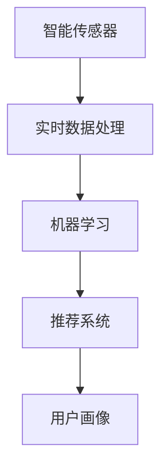

                 

# 智能个人污染防护创业：城市生活的健康防线

## 1. 背景介绍

### 1.1 问题由来
随着城市化进程的加快，空气、水、土壤污染等问题日益严峻，对人们的健康构成了巨大威胁。空气中的细颗粒物（PM2.5）、臭氧（O3）、二氧化氮（NO2）等污染物，以及水体中的重金属、微生物等有害物质，都会对人体健康产生不良影响。

近年来，环境保护和健康管理逐渐成为社会关注的焦点，人们开始意识到个体防护的重要性。智能个人污染防护创业，旨在利用先进的信息技术和物联网技术，为个人提供实时、精准的健康防护服务，帮助用户规避环境污染带来的健康风险。

### 1.2 问题核心关键点
智能个人污染防护创业的关键在于：

1. **实时环境监测**：能够对空气、水质、土壤等环境因子进行实时监测，并提供准确的数据。
2. **智能健康预警**：根据监测数据，评估用户所处环境的污染程度，给出健康预警。
3. **个性化防护建议**：针对不同环境和用户的健康状况，提供个性化防护建议。
4. **精准数据分析**：对大量环境数据和用户行为数据进行深度分析，发现规律和趋势。
5. **智能决策支持**：利用人工智能算法，优化防护策略，提高防护效果。

## 2. 核心概念与联系

### 2.1 核心概念概述

为了更好地理解智能个人污染防护创业的技术实现，本节将介绍几个密切相关的核心概念：

- **智能传感器**：通过物联网技术，收集环境数据，如空气质量、水质、气温、湿度等。
- **实时数据处理**：对采集到的环境数据进行实时处理，如去噪、校准、归一化等。
- **机器学习**：通过监督学习、无监督学习等算法，训练模型进行数据分类、回归、聚类等任务。
- **推荐系统**：根据用户行为和环境数据，推荐个性化的防护措施和路径。
- **用户画像**：构建用户健康画像，了解用户的健康状况、生活习惯等，提供定制化服务。

这些概念之间的逻辑关系可以通过以下Mermaid流程图来展示：



这个流程图展示了几大核心概念及其之间的关系：

1. 智能传感器采集环境数据。
2. 实时数据处理技术对数据进行清洗和预处理。
3. 机器学习算法对处理后的数据进行分析建模。
4. 推荐系统根据模型输出，提供个性化防护建议。
5. 用户画像用于定制化服务，提升用户体验。

## 3. 核心算法原理 & 具体操作步骤

### 3.1 算法原理概述

智能个人污染防护创业的核心算法，主要涉及以下几个方面：

- **传感器数据融合算法**：将不同传感器采集的数据进行融合，提高数据的准确性和可靠性。
- **环境监测模型**：基于机器学习算法，构建环境监测模型，预测环境污染程度。
- **健康预警算法**：根据监测数据，评估用户的健康风险，提供预警信息。
- **推荐系统算法**：利用推荐算法，为用户推荐个性化的防护措施和路径。

这些算法共同构成了一个完整的智能防护系统，能够实时监测环境污染，评估用户健康风险，并提供个性化防护建议。

### 3.2 算法步骤详解

以环境监测模型为例，其算法步骤如下：

**Step 1: 数据收集与预处理**
- 通过智能传感器采集空气、水质等环境数据。
- 对采集的数据进行去噪、校准、归一化等预处理操作。

**Step 2: 特征提取**
- 对处理后的数据进行特征提取，如计算PM2.5浓度、气温、湿度等特征。
- 将特征数据输入到预训练模型中，得到特征表示。

**Step 3: 训练环境监测模型**
- 使用历史环境数据和用户健康数据，训练一个环境监测模型，如基于时间序列的回归模型。
- 在模型训练过程中，使用交叉验证等技术，避免过拟合。

**Step 4: 实时预测与评估**
- 将实时采集的环境数据输入模型中，得到当前环境的污染程度预测值。
- 将预测值与环境标准值进行对比，评估污染程度。

**Step 5: 健康预警与防护建议**
- 根据污染程度，给出健康预警信息。
- 根据用户的健康状况和环境数据，生成个性化的防护建议，如佩戴口罩、调整出行路线等。

### 3.3 算法优缺点

智能个人污染防护创业的算法具有以下优点：

1. **实时性高**：利用传感器和物联网技术，能够实时采集环境数据，及时评估污染程度。
2. **精度高**：通过机器学习模型，对环境数据进行深度分析，提高预测精度。
3. **个性化强**：根据用户健康状况和行为数据，提供个性化防护建议。

同时，该算法也存在以下局限性：

1. **数据依赖性大**：需要大量的环境数据和用户健康数据，数据获取成本较高。
2. **模型复杂度高**：环境监测和健康预警模型较为复杂，需要高性能计算资源。
3. **数据隐私风险**：用户健康数据的收集和使用，可能涉及隐私问题，需要严格的隐私保护措施。

尽管存在这些局限性，但就目前而言，智能个人污染防护创业的算法仍是解决环境污染问题的重要手段。未来相关研究的重点在于如何进一步降低数据获取成本，提高模型精度和效率，同时兼顾数据隐私保护。

### 3.4 算法应用领域

智能个人污染防护创业的算法，已在多个领域得到应用，包括：

- **智慧城市建设**：在城市基础设施建设中，通过环境监测系统，优化城市环境管理。
- **公共健康管理**：在公共卫生事件中，通过环境监测和健康预警，提升应对效率。
- **旅游景区管理**：在旅游景区中，通过环境监测和健康预警，保障游客健康。
- **智能家居系统**：在智能家居系统中，通过环境监测和健康预警，提升家庭生活质量。
- **企业健康管理**：在企业健康管理中，通过环境监测和健康预警，保障员工健康。

## 4. 数学模型和公式 & 详细讲解 & 举例说明

### 4.1 数学模型构建

本节将使用数学语言对智能个人污染防护创业的算法进行更加严格的刻画。

假设环境监测模型为 $M_{\theta}$，输入为 $X=\{x_1, x_2, \cdots, x_n\}$，其中 $x_i$ 为第 $i$ 个环境数据，输出为 $Y=\{y_1, y_2, \cdots, y_n\}$，其中 $y_i$ 为第 $i$ 个预测值。

定义模型 $M_{\theta}$ 在输入 $X$ 上的损失函数为 $\ell(M_{\theta}(X),Y)$，则在数据集 $D=\{(X_i,Y_i)\}_{i=1}^N$ 上的经验风险为：

$$
\mathcal{L}(\theta) = \frac{1}{N}\sum_{i=1}^N \ell(M_{\theta}(X_i),Y_i)
$$

其中 $\theta$ 为模型参数，$\ell$ 为损失函数，如均方误差（MSE）、均方根误差（RMSE）等。

### 4.2 公式推导过程

以均方误差（MSE）为例，推导环境监测模型的损失函数。

假设模型 $M_{\theta}$ 在输入 $x_i$ 上的输出为 $\hat{y}_i=M_{\theta}(x_i)$，与真实标签 $y_i$ 的误差为 $e_i=y_i-\hat{y}_i$。则均方误差（MSE）损失函数为：

$$
\ell(M_{\theta}(x_i),y_i) = \frac{1}{2}e_i^2 = \frac{1}{2}(y_i-\hat{y}_i)^2
$$

将上式代入经验风险公式，得：

$$
\mathcal{L}(\theta) = \frac{1}{2N}\sum_{i=1}^N (y_i-\hat{y}_i)^2
$$

在模型训练过程中，最小化经验风险，即求解最优参数：

$$
\theta^* = \mathop{\arg\min}_{\theta} \mathcal{L}(\theta)
$$

在得到模型参数 $\theta^*$ 后，将实时采集的环境数据输入模型中，得到预测值 $\hat{y}_i$，根据预测值与环境标准值的差异，评估污染程度，并给出健康预警。

### 4.3 案例分析与讲解

以下通过一个简单的案例，说明智能个人污染防护创业的算法实现过程。

假设我们有一个城市的环境监测系统，采集了空气中的PM2.5浓度、气温、湿度等数据，以及用户的健康数据，如年龄、性别、身体状况等。我们的目标是构建一个环境监测模型，预测PM2.5浓度，并根据预测结果，给出健康预警和防护建议。

**Step 1: 数据收集与预处理**
- 通过智能传感器采集空气中的PM2.5浓度、气温、湿度等数据。
- 对采集的数据进行去噪、校准、归一化等预处理操作。

**Step 2: 特征提取**
- 对处理后的数据进行特征提取，如计算PM2.5浓度、气温、湿度等特征。
- 将特征数据输入到预训练模型中，得到特征表示。

**Step 3: 训练环境监测模型**
- 使用历史环境数据和用户健康数据，训练一个环境监测模型，如基于时间序列的回归模型。
- 在模型训练过程中，使用交叉验证等技术，避免过拟合。

**Step 4: 实时预测与评估**
- 将实时采集的环境数据输入模型中，得到当前环境的PM2.5浓度预测值。
- 将预测值与环境标准值进行对比，评估污染程度。

**Step 5: 健康预警与防护建议**
- 根据污染程度，给出健康预警信息。
- 根据用户的健康状况和环境数据，生成个性化的防护建议，如佩戴口罩、调整出行路线等。

## 5. 项目实践：代码实例和详细解释说明

### 5.1 开发环境搭建

在进行智能个人污染防护创业的算法实践前，我们需要准备好开发环境。以下是使用Python进行PyTorch开发的环境配置流程：

1. 安装Anaconda：从官网下载并安装Anaconda，用于创建独立的Python环境。

2. 创建并激活虚拟环境：
```bash
conda create -n pytorch-env python=3.8 
conda activate pytorch-env
```

3. 安装PyTorch：根据CUDA版本，从官网获取对应的安装命令。例如：
```bash
conda install pytorch torchvision torchaudio cudatoolkit=11.1 -c pytorch -c conda-forge
```

4. 安装TensorFlow：由Google主导开发的开源深度学习框架，生产部署方便，适合大规模工程应用。同样有丰富的预训练语言模型资源。

5. 安装各类工具包：
```bash
pip install numpy pandas scikit-learn matplotlib tqdm jupyter notebook ipython
```

完成上述步骤后，即可在`pytorch-env`环境中开始算法实践。

### 5.2 源代码详细实现

这里我们以环境监测模型为例，给出使用PyTorch进行回归模型训练的代码实现。

首先，定义训练数据集：

```python
import torch
from torch.utils.data import Dataset, DataLoader
from torchvision import transforms
from torch.utils.data import random_split

class EnvironmentDataset(Dataset):
    def __init__(self, data, transform=None):
        self.data = data
        self.transform = transform

    def __len__(self):
        return len(self.data)

    def __getitem__(self, idx):
        data = self.data.iloc[idx]
        label = torch.tensor(data['PM2.5'], dtype=torch.float32)
        if self.transform:
            data = self.transform(data)
        return data, label

# 数据集处理
transform = transforms.Compose([
    transforms.ToTensor(),
    transforms.Normalize(mean=[0.5], std=[0.5])
])

# 加载数据
data = pd.read_csv('environment_data.csv')
train_data, test_data = random_split(data, lengths=[0.8, 0.2])

# 创建数据集
train_dataset = EnvironmentDataset(train_data, transform=transform)
test_dataset = EnvironmentDataset(test_data, transform=transform)
```

然后，定义模型和优化器：

```python
from torch import nn
import torch.nn.functional as F

class EnvironmentModel(nn.Module):
    def __init__(self):
        super(EnvironmentModel, self).__init__()
        self.fc1 = nn.Linear(3, 10)
        self.fc2 = nn.Linear(10, 1)

    def forward(self, x):
        x = F.relu(self.fc1(x))
        x = self.fc2(x)
        return x

# 定义模型
model = EnvironmentModel()

# 定义优化器
optimizer = torch.optim.Adam(model.parameters(), lr=0.001)
```

接着，定义训练和评估函数：

```python
from sklearn.metrics import mean_squared_error

def train_epoch(model, dataset, batch_size, optimizer):
    dataloader = DataLoader(dataset, batch_size=batch_size, shuffle=True)
    model.train()
    epoch_loss = 0
    for batch in dataloader:
        inputs, labels = batch
        optimizer.zero_grad()
        outputs = model(inputs)
        loss = F.mse_loss(outputs, labels)
        epoch_loss += loss.item()
        loss.backward()
        optimizer.step()
    return epoch_loss / len(dataloader)

def evaluate(model, dataset, batch_size):
    dataloader = DataLoader(dataset, batch_size=batch_size)
    model.eval()
    epoch_loss = 0
    with torch.no_grad():
        for batch in dataloader:
            inputs, labels = batch
            outputs = model(inputs)
            epoch_loss += F.mse_loss(outputs, labels).item()
    return epoch_loss / len(dataloader)
```

最后，启动训练流程并在测试集上评估：

```python
epochs = 100

for epoch in range(epochs):
    loss = train_epoch(model, train_dataset, 32, optimizer)
    print(f'Epoch {epoch+1}, train loss: {loss:.3f}')
    
    print(f'Epoch {epoch+1}, test loss: {evaluate(model, test_dataset, 32):.3f}')
```

以上就是使用PyTorch对环境监测模型进行回归训练的完整代码实现。可以看到，利用PyTorch的深度学习框架，可以高效实现模型的训练和评估。

### 5.3 代码解读与分析

让我们再详细解读一下关键代码的实现细节：

**EnvironmentDataset类**：
- `__init__`方法：初始化数据集和数据转换函数。
- `__len__`方法：返回数据集大小。
- `__getitem__`方法：返回单个样本及其标签。

**train_epoch和evaluate函数**：
- `train_epoch`函数：训练模型，计算损失函数。
- `evaluate`函数：评估模型，计算损失函数。

**模型定义和训练**：
- `EnvironmentModel`类：定义一个简单的多层感知机（MLP）模型。
- `train_epoch`和`evaluate`函数：使用Adam优化器，设置学习率，更新模型参数，计算损失函数。
- 在训练过程中，使用均方误差（MSE）损失函数，最小化模型的预测值和真实标签之间的差异。
- 在评估过程中，使用MSE损失函数计算模型在测试集上的性能。

## 6. 实际应用场景

### 6.1 智能家居系统

智能家居系统通过环境监测传感器，实时采集室内外空气质量、水质、气温、湿度等数据，并根据用户行为和偏好，提供个性化的健康防护建议。例如，系统可以根据室内PM2.5浓度，自动调整空气净化器的工作模式；根据户外臭氧浓度，提醒用户减少户外活动；根据气温和湿度，建议调整室内温度和湿度。

**应用场景**：智能家居系统可以通过物联网技术，将环境监测和健康防护深度融合，提升家庭健康管理水平。

**技术实现**：
- 通过智能传感器采集环境数据。
- 利用机器学习算法，构建环境监测模型。
- 根据环境数据和用户健康数据，生成个性化防护建议。
- 利用推荐系统，优化防护建议的推荐效果。

### 6.2 智慧城市管理

智慧城市管理通过环境监测系统，实时监测城市中的空气、水质、噪音等环境因子，评估污染程度，并给出健康预警。例如，系统可以根据PM2.5浓度，评估空气质量，提醒市民减少户外活动；根据噪音水平，评估噪音污染，建议市民调整出行路线。

**应用场景**：智慧城市管理通过环境监测和健康预警，提升城市管理水平，保障市民健康。

**技术实现**：
- 通过智能传感器采集环境数据。
- 利用机器学习算法，构建环境监测模型。
- 根据环境数据和市民健康数据，生成健康预警信息。
- 利用推荐系统，优化防护建议的推荐效果。

### 6.3 企业健康管理

企业健康管理通过环境监测系统，实时监测企业内部的空气质量、水质、噪音等环境因子，评估污染程度，并给出健康预警。例如，系统可以根据PM2.5浓度，评估空气质量，提醒员工减少户外活动；根据噪音水平，评估噪音污染，建议员工调整工作岗位。

**应用场景**：企业健康管理通过环境监测和健康预警，提升员工健康管理水平。

**技术实现**：
- 通过智能传感器采集环境数据。
- 利用机器学习算法，构建环境监测模型。
- 根据环境数据和员工健康数据，生成健康预警信息。
- 利用推荐系统，优化防护建议的推荐效果。

### 6.4 未来应用展望

随着智能传感器和物联网技术的不断发展，智能个人污染防护创业将迎来更加广阔的应用前景。未来，可能的应用场景包括：

- **个性化健康管理**：根据用户健康数据和生活习惯，提供个性化的健康管理建议，如饮食、锻炼、作息等。
- **应急响应系统**：在重大环境事件（如地震、火灾等）中，实时监测环境变化，提供应急防护建议。
- **旅游景区管理**：在旅游景区中，实时监测环境质量，评估健康风险，提供防护建议。
- **企业健康保障**：在企业健康管理中，实时监测工作环境，评估健康风险，提供防护建议。
- **社区健康预警**：在社区中，实时监测环境污染，评估健康风险，提供预警信息。

## 7. 工具和资源推荐

### 7.1 学习资源推荐

为了帮助开发者系统掌握智能个人污染防护创业的理论基础和实践技巧，这里推荐一些优质的学习资源：

1. **《深度学习》书籍**：深度学习领域的经典教材，涵盖机器学习、神经网络、深度学习等内容，适合初学者和进阶者。
2. **Coursera深度学习课程**：由斯坦福大学Andrew Ng教授开设的深度学习课程，涵盖深度学习的基础知识和实践技能。
3. **Kaggle数据科学竞赛**：Kaggle是世界上最大的数据科学竞赛平台，可以参与实际项目，提升实战能力。
4. **GitHub开源项目**：GitHub是全球最大的代码托管平台，可以下载和学习开源项目，获取丰富的实践经验。
5. **PyTorch官方文档**：PyTorch官方文档提供了丰富的学习资源，包括教程、示例代码、论文等。

通过对这些资源的学习实践，相信你一定能够快速掌握智能个人污染防护创业的精髓，并用于解决实际的环境污染问题。

### 7.2 开发工具推荐

高效的开发离不开优秀的工具支持。以下是几款用于智能个人污染防护创业开发的常用工具：

1. **PyTorch**：基于Python的开源深度学习框架，灵活动态的计算图，适合快速迭代研究。
2. **TensorFlow**：由Google主导开发的开源深度学习框架，生产部署方便，适合大规模工程应用。
3. **Pandas**：Python中的数据分析库，提供了强大的数据处理和分析功能。
4. **Jupyter Notebook**：交互式编程环境，适合快速原型设计和实验。
5. **D3.js**：数据可视化库，用于将复杂的数据转化为直观的图表。

合理利用这些工具，可以显著提升智能个人污染防护创业的开发效率，加快创新迭代的步伐。

### 7.3 相关论文推荐

智能个人污染防护创业的发展源于学界的持续研究。以下是几篇奠基性的相关论文，推荐阅读：

1. **《机器学习：数据、算法与框架》**：介绍了机器学习的基本概念和常用算法，适合初学者和进阶者。
2. **《深度学习框架PyTorch教程》**：详细介绍了PyTorch的使用方法和实践技巧。
3. **《环境监测与预警系统》**：介绍了一种基于机器学习的环境监测与预警系统，适合实际应用。
4. **《智能家居系统设计与实现》**：介绍了一种基于物联网的智能家居系统，适合实际应用。

这些论文代表了大规模智能个人污染防护创业的发展脉络。通过学习这些前沿成果，可以帮助研究者把握学科前进方向，激发更多的创新灵感。

## 8. 总结：未来发展趋势与挑战

### 8.1 研究成果总结

本文对智能个人污染防护创业的理论基础和实践技巧进行了全面系统的介绍。首先，阐述了智能个人污染防护创业的背景和核心关键点，明确了实时环境监测、健康预警和个性化防护建议等技术实现路径。其次，从原理到实践，详细讲解了传感器数据融合、环境监测、健康预警、推荐系统等核心算法的实现过程，给出了详细的代码示例。同时，本文还广泛探讨了智能个人污染防护创业在智慧城市、智能家居、企业健康管理等多个领域的应用前景，展示了其广阔的想象空间。此外，本文精选了相关学习资源和工具，力求为开发者提供全方位的技术指引。

通过本文的系统梳理，可以看到，智能个人污染防护创业已经在多个领域得到实际应用，为城市生活带来了健康防线。未来，伴随技术不断进步，将进一步拓展其应用范围，提升城市健康管理水平。

### 8.2 未来发展趋势

展望未来，智能个人污染防护创业的发展趋势主要体现在以下几个方面：

1. **传感器技术发展**：随着传感器技术的进步，智能个人污染防护创业将能够采集更多维度的环境数据，提供更全面的健康防护服务。
2. **机器学习模型优化**：利用更先进的机器学习算法，提高环境监测和健康预警的准确性和实时性。
3. **用户画像技术提升**：通过更精准的用户画像，提供更加个性化和定制化的防护建议。
4. **推荐系统优化**：利用更高效的推荐算法，提升防护建议的推荐效果，提高用户满意度。
5. **智能决策支持**：结合更多先验知识，如知识图谱、逻辑规则等，优化防护策略，提高防护效果。
6. **伦理和安全问题**：在智能决策过程中，加强伦理和安全问题的研究，保障用户隐私和数据安全。

这些趋势将推动智能个人污染防护创业走向更高的台阶，为构建安全、可靠、可解释、可控的智能系统铺平道路。面向未来，智能个人污染防护创业需要与其他人工智能技术进行更深入的融合，多路径协同发力，共同推动环境健康管理的发展。

### 8.3 面临的挑战

尽管智能个人污染防护创业已经取得了不小的成就，但在迈向更加智能化、普适化应用的过程中，它仍面临着诸多挑战：

1. **数据获取成本高**：需要大量的环境数据和用户健康数据，数据获取成本较高。
2. **算法复杂度高**：环境监测和健康预警算法较为复杂，需要高性能计算资源。
3. **数据隐私风险**：用户健康数据的收集和使用，可能涉及隐私问题，需要严格的隐私保护措施。
4. **技术普及度低**：智能个人污染防护创业技术尚未普及，用户接受度较低，需要进一步推广和宣传。
5. **技术协同难度大**：不同技术之间的协同难度较大，需要综合考虑算法、设备、服务等多个方面。

尽管存在这些挑战，但智能个人污染防护创业的技术前景仍然广阔，需要通过不断的技术创新和优化，克服这些挑战，实现更大的社会价值。

### 8.4 研究展望

面对智能个人污染防护创业所面临的挑战，未来的研究需要在以下几个方面寻求新的突破：

1. **数据获取与处理**：探索新的数据获取途径，降低数据获取成本；研究高效的数据处理和预处理算法，提高数据处理效率。
2. **模型优化与优化**：开发更高效的机器学习算法，提升模型精度和实时性；研究参数高效的微调方法，优化模型结构。
3. **隐私保护与安全**：研究数据隐私保护技术，如差分隐私、联邦学习等，保障用户数据安全；研究安全算法，如对抗训练、安全深度学习等，提高系统安全性。
4. **技术协同与应用**：研究不同技术之间的协同机制，如传感器与机器学习的协同、推荐系统与环境监测的协同等；推广智能个人污染防护创业技术，提升用户体验。

这些研究方向的探索，必将引领智能个人污染防护创业技术迈向更高的台阶，为构建安全、可靠、可解释、可控的智能系统铺平道路。面向未来，智能个人污染防护创业需要与其他人工智能技术进行更深入的融合，多路径协同发力，共同推动环境健康管理的发展。

## 9. 附录：常见问题与解答

**Q1：智能个人污染防护创业的算法是如何实现的？**

A: 智能个人污染防护创业的算法主要涉及以下几个方面：

1. **传感器数据融合算法**：将不同传感器采集的数据进行融合，提高数据的准确性和可靠性。
2. **环境监测模型**：基于机器学习算法，构建环境监测模型，预测环境污染程度。
3. **健康预警算法**：根据监测数据，评估用户的健康风险，提供预警信息。
4. **推荐系统算法**：利用推荐算法，为用户推荐个性化的防护措施和路径。

**Q2：智能个人污染防护创业需要哪些硬件支持？**

A: 智能个人污染防护创业需要以下硬件支持：

1. **智能传感器**：用于采集环境数据，如空气质量、水质、气温、湿度等。
2. **高性能计算设备**：用于训练机器学习模型，提高模型精度和实时性。
3. **物联网设备**：用于实时采集和传输数据，如智能手表、智能家居设备等。
4. **存储设备**：用于存储大量环境数据和用户数据，如硬盘、SSD等。

**Q3：智能个人污染防护创业的主要挑战是什么？**

A: 智能个人污染防护创业的主要挑战包括：

1. **数据获取成本高**：需要大量的环境数据和用户健康数据，数据获取成本较高。
2. **算法复杂度高**：环境监测和健康预警算法较为复杂，需要高性能计算资源。
3. **数据隐私风险**：用户健康数据的收集和使用，可能涉及隐私问题，需要严格的隐私保护措施。
4. **技术普及度低**：智能个人污染防护创业技术尚未普及，用户接受度较低，需要进一步推广和宣传。
5. **技术协同难度大**：不同技术之间的协同难度较大，需要综合考虑算法、设备、服务等多个方面。

尽管存在这些挑战，但智能个人污染防护创业的技术前景仍然广阔，需要通过不断的技术创新和优化，克服这些挑战，实现更大的社会价值。

**Q4：智能个人污染防护创业如何提升用户体验？**

A: 智能个人污染防护创业可以提升用户体验的途径包括：

1. **个性化防护建议**：根据用户健康状况和环境数据，提供个性化的防护建议，如佩戴口罩、调整出行路线等。
2. **实时环境监测**：实时监测环境污染程度，及时给出健康预警信息，保障用户健康。
3. **智能推荐系统**：利用推荐算法，优化防护建议的推荐效果，提升用户满意度。
4. **用户画像技术**：通过用户画像，了解用户的健康状况、生活习惯等，提供定制化服务。

通过这些措施，智能个人污染防护创业将能够更好地满足用户需求，提升用户体验。

**Q5：智能个人污染防护创业在智慧城市管理中的应用前景如何？**

A: 智能个人污染防护创业在智慧城市管理中具有广阔的应用前景，主要体现在以下几个方面：

1. **实时环境监测**：通过环境监测系统，实时监测城市中的空气、水质、噪音等环境因子，评估污染程度，并给出健康预警。
2. **应急响应系统**：在重大环境事件中，实时监测环境变化，提供应急防护建议。
3. **智慧交通管理**：实时监测交通状况，优化交通流量，提升道路通行效率。
4. **公共健康管理**：实时监测疾病传播情况，提供健康预警，提升公共健康管理水平。

通过这些应用，智慧城市管理将能够更高效地应对环境污染问题，提升城市治理水平。

---

作者：禅与计算机程序设计艺术 / Zen and the Art of Computer Programming

