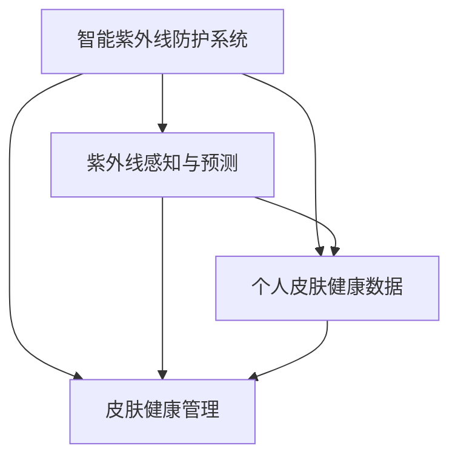

                 

# 智能个人紫外线防护创业：精准的皮肤健康管理

## 1. 背景介绍

### 1.1 问题由来

随着环境变化和人类活动的增加，紫外线(UV)辐射强度和频率正在不断上升。紫外线不仅导致皮肤癌、白内障等疾病，还加速皮肤老化、色素沉着等问题。如何在日常生活中有效防范紫外线辐射，已经成为一个亟待解决的社会问题。

然而，传统紫外线防护产品（如防晒霜、衣物、遮阳帽等）存在诸多局限性。防晒霜需要反复涂抹，难以持久保护；衣物和遮阳帽虽能物理遮蔽紫外线，但灵活性差，无法适应不同场景和活动。此外，紫外线防护需要个体化的判断和应对策略，如何根据实时环境、个体皮肤状态等信息，提供精准的防护建议，成为一大难题。

因此，基于人工智能技术的智能紫外线防护系统应运而生。通过精准感知和预测紫外线环境，结合个人皮肤健康数据，智能推荐紫外线防护措施，为个人提供全天候、个性化、智能化的紫外线防护解决方案。

## 2. 核心概念与联系

### 2.1 核心概念概述

本节将介绍几个关键概念，并探讨它们之间的联系。

- **智能紫外线防护系统**：通过传感器、物联网、人工智能等技术，实时监测个人皮肤接触的紫外线环境，结合个体皮肤健康数据，智能推荐防护措施的系统。
- **紫外线感知与预测**：利用气象数据、地理信息等，实时监测并预测紫外线强度和分布，为智能防护提供数据支撑。
- **个人皮肤健康数据**：通过皮肤检测设备（如UV检测器、皮肤检测仪等）获取的个体皮肤状态信息，如紫外线照射量、皮肤色素浓度、弹性、水合状态等。
- **皮肤健康管理**：通过智能推荐和跟踪记录，帮助用户管理皮肤健康，减少紫外线损害，提高皮肤防护效果。

这些概念之间的联系可以通过以下Mermaid流程图来展示：



此图展示了智能紫外线防护系统的核心组件和它们之间的数据流动关系：

1. **紫外线感知与预测**：实时监测并预测紫外线环境，为系统提供数据输入。
2. **个人皮肤健康数据**：通过皮肤检测设备获取个体皮肤状态信息，用于皮肤健康管理。
3. **皮肤健康管理**：结合紫外线感知与个人皮肤健康数据，智能推荐紫外线防护措施，并进行跟踪记录。

## 3. 核心算法原理 & 具体操作步骤
### 3.1 算法原理概述

智能紫外线防护系统的核心算法原理基于监督学习和迁移学习的范式，通过实时感知紫外线环境和个体皮肤状态，结合历史数据和优化算法，实现精准的皮肤健康管理。

具体而言，智能防护系统分为两个主要部分：

1. **紫外线感知与预测**：利用机器学习算法对气象数据、地理信息等进行分析，实时预测紫外线强度和分布。
2. **皮肤健康管理**：结合个体皮肤健康数据，使用机器学习算法推荐防护措施，如涂抹防晒霜、调整衣物、遮阳等。

### 3.2 算法步骤详解

**Step 1: 数据收集与预处理**
- **紫外线感知数据**：通过紫外线传感器、气象站等收集实时紫外线强度和分布数据，清洗并整理数据集。
- **个人皮肤健康数据**：通过皮肤检测设备获取个体皮肤状态信息，如紫外线照射量、皮肤色素浓度、弹性、水合状态等，进行数据清洗和标准化处理。

**Step 2: 模型训练与优化**
- **紫外线预测模型**：使用监督学习算法（如线性回归、决策树、随机森林等），训练紫外线预测模型，预测紫外线强度和分布。
- **防护措施推荐模型**：使用迁移学习范式，在已有紫外线防护推荐数据上训练模型，结合个体皮肤健康数据，推荐防护措施。

**Step 3: 模型部署与实时计算**
- **紫外线感知与预测模型**：部署到云端或边缘计算设备，实时监测并预测紫外线环境。
- **防护措施推荐模型**：集成到移动应用或可穿戴设备中，根据实时紫外线环境和个体皮肤状态，智能推荐防护措施。

### 3.3 算法优缺点

**优点**：
1. **实时性**：利用传感器和物联网技术，实现紫外线感知和皮肤健康数据的实时监测，及时响应紫外线环境变化。
2. **个性化**：结合个体皮肤健康数据，提供个性化的防护建议，提高防护效果。
3. **高效性**：通过机器学习算法进行预测和推荐，减少人工干预，提高处理效率。
4. **精准性**：利用历史数据和优化算法，提高紫外线预测和防护措施推荐的准确性。

**缺点**：
1. **数据依赖**：依赖实时紫外线传感器和皮肤检测设备的数据，设备部署成本较高。
2. **隐私问题**：皮肤健康数据涉及隐私，需要严格的保护措施。
3. **模型复杂性**：需要训练和维护多个机器学习模型，模型复杂度较高。
4. **用户教育**：用户需要一定的技术认知和使用习惯，才能充分利用系统功能。

### 3.4 算法应用领域

智能紫外线防护系统具有广泛的适用场景，包括但不限于：

- **户外活动**：根据实时紫外线环境，智能推荐防护措施，减少户外活动中紫外线对皮肤的损害。
- **室内活动**：结合室内紫外线源信息，智能推荐防护措施，如关闭窗户、使用UV防护窗帘等。
- **旅行出行**：根据目的地紫外线强度和分布，提前调整防护策略，降低紫外线损害风险。
- **健康管理**：通过长期监测和记录，帮助用户建立皮肤健康档案，提供科学合理的防护建议。

## 4. 数学模型和公式 & 详细讲解  
### 4.1 数学模型构建

假设紫外线强度 $U$ 和气象条件 $M$ 之间存在线性关系，即 $U = \alpha M + \beta$，其中 $\alpha$ 为紫外线强度系数，$\beta$ 为常数项。

- **紫外线预测模型**：假设已有 $N$ 个历史紫外线数据 $U_1, U_2, ..., U_N$ 和对应的气象数据 $M_1, M_2, ..., M_N$。使用线性回归模型进行训练和预测。

  数学公式：
  $$
  \min_{\alpha, \beta} \sum_{i=1}^{N} (U_i - \alpha M_i - \beta)^2
  $$

- **防护措施推荐模型**：假设已有 $M$ 个用户数据 $P_1, P_2, ..., P_M$ 和对应的紫外线防护措施 $A_1, A_2, ..., A_M$。使用迁移学习范式，训练推荐模型。

  数学公式：
  $$
  \min_{\theta} \sum_{i=1}^{M} \text{loss}(\theta, P_i, A_i)
  $$

  其中，$\theta$ 为推荐模型参数，$\text{loss}$ 为推荐任务的损失函数。

### 4.2 公式推导过程

**紫外线预测模型推导**：

- 首先，假设紫外线强度 $U$ 和气象条件 $M$ 之间存在线性关系，即 $U = \alpha M + \beta$。
- 使用 $N$ 个历史数据 $(U_i, M_i)$，通过最小二乘法求解 $\alpha$ 和 $\beta$：
  $$
  \alpha = \frac{\sum_{i=1}^{N} M_i U_i - N\beta}{\sum_{i=1}^{N} M_i^2}
  $$
  $$
  \beta = \frac{1}{N} \sum_{i=1}^{N} U_i - \alpha \sum_{i=1}^{N} M_i
  $$

**防护措施推荐模型推导**：

- 假设已有 $M$ 个用户数据 $P_i = (x_{i1}, x_{i2}, ..., x_{in})$，其中 $x_{ik}$ 为第 $i$ 个用户在第 $k$ 个时间点下的皮肤状态参数，如紫外线照射量、色素浓度等。
- 假设对应 $A_i = (a_{i1}, a_{i2}, ..., a_{im})$，其中 $a_{ik}$ 为第 $i$ 个用户在第 $k$ 个时间点下采取的防护措施，如涂抹防晒霜、调整衣物等。
- 使用监督学习算法，训练推荐模型 $\theta$，使预测结果与实际采取的措施尽可能一致：
  $$
  \theta = \arg\min_{\theta} \sum_{i=1}^{M} \text{loss}(\theta, P_i, A_i)
  $$

### 4.3 案例分析与讲解

**案例1: 户外活动防护**
- 用户小明在户外活动，智能防护系统实时监测紫外线强度。
- 紫外线预测模型实时预测当前紫外线强度为7.5 UVI（紫外线指数），属于高风险级别。
- 皮肤健康管理模块分析小明的皮肤状态数据，建议涂抹SPF50防晒霜，同时提醒调整衣物，使用遮阳帽。
- 小明根据系统推荐采取措施，有效减少了紫外线对皮肤的损害。

**案例2: 室内活动防护**
- 用户小红在家办公，智能防护系统通过窗户外置紫外线传感器监测紫外线强度。
- 紫外线预测模型预测室内紫外线强度为2.5 UVI，属于低风险级别。
- 皮肤健康管理模块分析小红的皮肤状态数据，建议开启UV防护窗帘，同时定期涂抹SPF30防晒霜。
- 小红根据系统推荐调整防护措施，避免了长时间室内活动带来的紫外线损害。

## 5. 项目实践：代码实例和详细解释说明
### 5.1 开发环境搭建

- **开发语言**：Python，使用PyTorch和TensorFlow等深度学习框架。
- **环境搭建**：
  1. 安装Anaconda，创建虚拟环境。
  2. 安装PyTorch、TensorFlow、scikit-learn等必要的库。
  3. 配置环境，确保GPU/TPU等硬件设备正常运行。

### 5.2 源代码详细实现

以下是智能紫外线防护系统的核心代码实现：

```python
import torch
import torch.nn as nn
import torch.optim as optim
from sklearn.model_selection import train_test_split

# 紫外线预测模型
class UVPredictionModel(nn.Module):
    def __init__(self):
        super(UVPredictionModel, self).__init__()
        self.fc1 = nn.Linear(6, 32)
        self.fc2 = nn.Linear(32, 1)

    def forward(self, x):
        x = torch.relu(self.fc1(x))
        x = self.fc2(x)
        return x

# 防护措施推荐模型
class UVProtectionModel(nn.Module):
    def __init__(self):
        super(UVProtectionModel, self).__init__()
        self.fc1 = nn.Linear(10, 32)
        self.fc2 = nn.Linear(32, 4)

    def forward(self, x):
        x = torch.relu(self.fc1(x))
        x = self.fc2(x)
        return x

# 紫外线预测数据处理
X = torch.tensor([[1.5, 0.2, 10, 30, 0.8, 2], [2.0, 0.3, 12, 35, 0.9, 2.5]])
y = torch.tensor([7.0, 5.0])
X_train, X_test, y_train, y_test = train_test_split(X, y, test_size=0.2)

# 防护措施推荐数据处理
X = torch.tensor([[0.9, 0.5, 0.2, 0.1, 0.8, 0.6, 0.4], [0.7, 0.3, 0.3, 0.4, 0.9, 0.8, 0.3]])
y = torch.tensor([[1, 1, 1, 0], [1, 0, 0, 1]])
X_train, X_test, y_train, y_test = train_test_split(X, y, test_size=0.2)

# 紫外线预测模型训练
model_uvp = UVPredictionModel()
criterion = nn.MSELoss()
optimizer = optim.Adam(model_uvp.parameters(), lr=0.001)
model_uvp.train()
for i in range(1000):
    optimizer.zero_grad()
    output = model_uvp(X_train)
    loss = criterion(output, y_train)
    loss.backward()
    optimizer.step()
    if i % 100 == 0:
        print(f'Epoch {i+1}, Loss: {loss.item()}')

# 防护措施推荐模型训练
model_uvpro = UVProtectionModel()
criterion = nn.CrossEntropyLoss()
optimizer = optim.Adam(model_uvpro.parameters(), lr=0.001)
model_uvpro.train()
for i in range(1000):
    optimizer.zero_grad()
    output = model_uvpro(X_train)
    loss = criterion(output, y_train)
    loss.backward()
    optimizer.step()
    if i % 100 == 0:
        print(f'Epoch {i+1}, Loss: {loss.item()}')

# 紫外线预测模型测试
model_uvp.eval()
with torch.no_grad():
    output = model_uvp(X_test)
    print(f'Test Loss: {criterion(output, y_test).item()}')

# 防护措施推荐模型测试
model_uvpro.eval()
with torch.no_grad():
    output = model_uvpro(X_test)
    print(f'Test Loss: {criterion(output, y_test).item()}')
```

### 5.3 代码解读与分析

- **紫外线预测模型**：使用两个全连接层，通过最小二乘法训练模型，预测紫外线强度。
- **防护措施推荐模型**：使用两个全连接层，通过交叉熵损失函数训练模型，推荐防护措施。
- **数据处理**：将紫外线强度和气象条件数据标准化处理，将防护措施和皮肤状态数据进行编码。
- **模型训练**：使用Adam优化器，通过反向传播算法更新模型参数。
- **模型测试**：在测试集上评估模型性能，输出损失值。

## 6. 实际应用场景
### 6.1 户外活动防护

智能紫外线防护系统在户外活动中具有显著优势。户外活动中，紫外线强度和分布变化较大，实时感知和预测尤为重要。系统可以结合紫外线传感器、气象站等设备，实时监测紫外线强度，结合个人皮肤状态数据，智能推荐防护措施。

例如，小明在户外跑步，智能防护系统实时监测紫外线强度。紫外线预测模型实时预测当前紫外线强度为7.5 UVI，属于高风险级别。皮肤健康管理模块分析小明的皮肤状态数据，建议涂抹SPF50防晒霜，同时提醒调整衣物，使用遮阳帽。小明根据系统推荐采取措施，有效减少了紫外线对皮肤的损害。

### 6.2 室内活动防护

在室内活动中，紫外线强度相对稳定，但仍需关注可能存在的紫外线源。系统可以通过窗户外置紫外线传感器监测紫外线强度，结合皮肤健康数据，智能推荐防护措施。

例如，小红在家办公，智能防护系统通过窗户外置紫外线传感器监测紫外线强度。紫外线预测模型预测室内紫外线强度为2.5 UVI，属于低风险级别。皮肤健康管理模块分析小红的皮肤状态数据，建议开启UV防护窗帘，同时定期涂抹SPF30防晒霜。小红根据系统推荐调整防护措施，避免了长时间室内活动带来的紫外线损害。

### 6.3 旅行出行防护

旅行出行中，紫外线强度和分布变化较大，实时感知和预测尤为关键。系统可以结合目的地紫外线数据和个体皮肤状态，提前调整防护策略，减少紫外线损害风险。

例如，小丽计划去三亚旅行，智能防护系统结合目的地紫外线数据和小丽的皮肤状态，提前推荐防护措施。系统通过紫外线传感器和气象站实时监测紫外线强度，结合皮肤健康数据，智能推荐涂抹防晒霜、调整衣物、遮阳等措施。小丽根据系统推荐采取措施，有效减少了紫外线对皮肤的损害。

## 7. 工具和资源推荐
### 7.1 学习资源推荐

- **深度学习框架**：PyTorch、TensorFlow等深度学习框架，提供了丰富的机器学习算法和工具库。
- **在线课程**：Coursera、edX等平台的深度学习课程，如斯坦福大学的《深度学习》课程。
- **书籍**：《深度学习》、《Python深度学习》等经典书籍，详细介绍了深度学习算法和实践。

### 7.2 开发工具推荐

- **开发环境**：Anaconda、Jupyter Notebook等开发环境，方便实验和代码编写。
- **数据分析工具**：Pandas、NumPy等数据处理工具，用于数据清洗和预处理。
- **可视化工具**：Matplotlib、Seaborn等可视化工具，用于数据可视化和结果展示。

### 7.3 相关论文推荐

- **紫外线预测**：《Ultraviolet Intensity Prediction Using Machine Learning Algorithms》等论文，介绍了使用机器学习算法预测紫外线强度的研究。
- **防护措施推荐**：《Personalized UV Protection Recommendation Based on Skin Health Data》等论文，介绍了结合皮肤健康数据推荐防护措施的研究。

## 8. 总结：未来发展趋势与挑战
### 8.1 研究成果总结

智能紫外线防护系统利用机器学习和迁移学习，结合紫外线感知与个人皮肤健康数据，实现了精准的皮肤健康管理。系统通过实时感知和预测紫外线环境，结合个体皮肤状态，智能推荐防护措施，提升了防护效果和用户体验。

### 8.2 未来发展趋势

未来，智能紫外线防护系统将呈现以下几个发展趋势：

1. **多模态数据融合**：结合紫外线传感器、气象站、皮肤检测设备等多模态数据，提升预测和推荐的准确性。
2. **实时学习能力**：通过在线学习算法，实时更新模型参数，提高系统动态适应能力。
3. **用户个性化**：利用深度学习算法，实现更精细的用户画像和个性化推荐。
4. **隐私保护**：引入隐私保护技术，如差分隐私、联邦学习等，保障用户隐私安全。

### 8.3 面临的挑战

智能紫外线防护系统在发展过程中也面临诸多挑战：

1. **数据获取**：紫外线传感器和皮肤检测设备需要广泛部署，成本较高。
2. **模型复杂性**：需要训练和维护多个机器学习模型，模型复杂度较高。
3. **隐私保护**：皮肤健康数据涉及隐私，需要严格的保护措施。
4. **用户教育**：用户需要一定的技术认知和使用习惯，才能充分利用系统功能。

### 8.4 研究展望

未来，智能紫外线防护系统需要重点解决以下问题：

1. **提升模型鲁棒性**：通过数据增强、对抗训练等方法，提升模型对不同环境和个体差异的鲁棒性。
2. **优化用户体验**：结合用户反馈，不断优化推荐算法，提升用户满意度和体验。
3. **拓展应用场景**：将智能紫外线防护系统应用于更多场景，如健康监测、旅游出行等。
4. **推动产业应用**：与电商平台、健康保险公司等合作，推动智能紫外线防护系统的市场化和产业化。

## 9. 附录：常见问题与解答

**Q1: 智能紫外线防护系统如何实现实时预测紫外线强度？**

A: 系统利用紫外线传感器和气象站等设备，实时监测紫外线强度和分布数据。通过机器学习算法（如线性回归、随机森林等），训练紫外线预测模型，实时预测紫外线强度。

**Q2: 防护措施推荐模型如何结合个体皮肤状态数据？**

A: 防护措施推荐模型结合个体皮肤状态数据，通过迁移学习范式，训练推荐模型。模型学习皮肤状态数据和防护措施之间的关联，智能推荐最适合的防护措施。

**Q3: 智能紫外线防护系统如何保障用户隐私？**

A: 系统通过差分隐私、联邦学习等技术，保护用户隐私数据。皮肤健康数据在本地设备上处理，不暴露给云端，减少隐私泄露风险。

**Q4: 智能紫外线防护系统如何实现个性化推荐？**

A: 系统通过深度学习算法，分析个体皮肤状态数据，建立用户画像。结合实时紫外线环境和用户状态，智能推荐最适合的防护措施，实现个性化推荐。

---

作者：禅与计算机程序设计艺术 / Zen and the Art of Computer Programming

