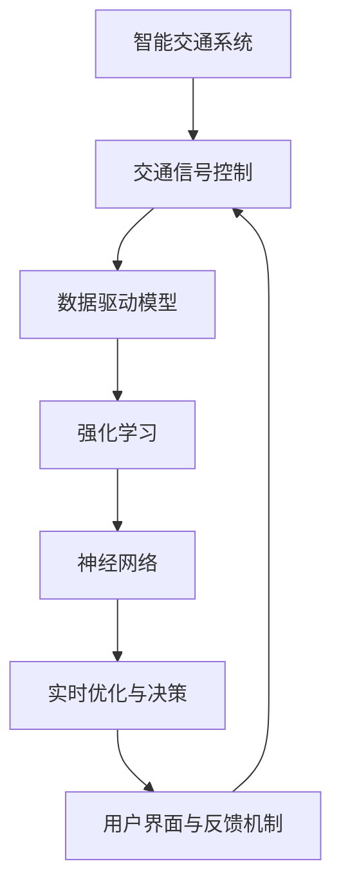

                 

# 智能交通信号创业：城市交通的优化方案

> 关键词：智能交通、交通信号控制、数据驱动、实时优化、城市交通管理、深度学习、强化学习

## 1. 背景介绍

在当今的城市化进程中，交通拥堵成为了一个日益严峻的问题。城市交通系统复杂多变，受到行人、车辆、信号灯等多种因素的影响。如何有效地优化交通信号，提高道路通行效率，成为城市交通管理的重要任务。传统的交通信号控制方法往往基于规则设定，难以适应动态变化的情况，且无法实时响应突发事件。随着智能技术的快速发展，基于数据的智能交通信号控制成为了新趋势。

### 1.1 问题由来
传统交通信号控制方法主要依赖人工经验和定时器的规则设置，难以应对快速变化的交通需求。随着城市交通量的不断增长，这种基于经验的方法越来越难以满足需求。随着深度学习、强化学习等智能技术的兴起，基于数据的智能信号控制逐渐成为可能。通过收集实时交通数据，使用机器学习算法，可以动态地调整信号灯状态，提升交通效率，减少拥堵。

### 1.2 问题核心关键点
智能交通信号控制的核心关键点在于：
- 实时数据采集与处理：通过传感器、摄像头等设备，实时收集交通流量、速度、路口状况等数据。
- 数据驱动的模型优化：使用机器学习模型对数据进行分析，预测交通状况，优化信号控制策略。
- 模型集成与决策优化：将多个模型的预测结果进行集成，通过强化学习等算法进行实时决策优化。
- 用户界面与反馈机制：设计直观易用的用户界面，及时获取用户的反馈，持续改进信号控制策略。

## 2. 核心概念与联系

### 2.1 核心概念概述

为更好地理解智能交通信号控制的原理和架构，本节将介绍几个核心概念：

- 智能交通系统（ITS）：通过集成信息通信技术、计算机技术、控制技术等，实现对城市交通系统的综合管理，提高交通效率，减少事故率。

- 交通信号控制：通过调整信号灯的时序和相位，实现交通流的优化调度，减少拥堵，提升通行效率。

- 数据驱动模型：基于实时交通数据，使用机器学习、深度学习等算法，对交通流量进行预测和分析，优化信号控制策略。

- 强化学习（RL）：一种通过试错学习的优化方法，通过奖励机制指导模型选择最优动作策略，适用于复杂的、高维的交通信号控制问题。

- 神经网络（NN）：一种模拟人脑神经元网络结构的计算模型，能够处理大规模数据，适用于复杂模式识别和预测任务。

- 实时优化与决策：通过实时数据更新和模型迭代，动态地调整信号控制策略，适应实时交通需求变化。

- 用户界面与反馈机制：通过交互式界面和反馈系统，实时监控交通状况，获取用户反馈，优化信号控制策略。

这些概念之间的逻辑关系可以通过以下Mermaid流程图来展示：



这个流程图展示了大规模智能交通信号控制的各个关键环节及其关系：

1. 智能交通系统集成信息通信技术，实现对城市交通的综合管理。
2. 交通信号控制通过调整信号灯的时序和相位，优化交通流。
3. 数据驱动模型基于实时交通数据，使用机器学习算法预测交通状况。
4. 强化学习通过试错优化，选择最优的信号控制策略。
5. 神经网络处理大规模数据，实现复杂的模式识别和预测。
6. 实时优化与决策动态调整信号控制策略，适应实时交通需求变化。
7. 用户界面与反馈机制提供直观的用户交互体验，及时反馈优化结果。

这些概念共同构成了智能交通信号控制的核心框架，使得交通系统能够动态地应对各种变化，提高交通效率。

## 3. 核心算法原理 & 具体操作步骤
### 3.1 算法原理概述

智能交通信号控制的算法原理主要包括以下几个步骤：

1. 数据采集与预处理：通过传感器、摄像头等设备，实时采集交通流量、速度、路口状况等数据，并进行预处理，去除噪声和异常值。

2. 特征提取：使用机器学习算法对预处理后的数据进行特征提取，生成可用于模型训练的特征向量。

3. 模型训练与优化：基于提取的特征，使用神经网络或深度学习模型进行训练和优化，预测交通流量和状态，生成信号控制策略。

4. 模型集成与决策优化：将多个模型的预测结果进行集成，通过强化学习算法进行实时决策优化，生成最优的信号控制策略。

5. 实时反馈与调整：通过用户界面和反馈机制，获取交通状况和用户反馈，动态调整模型参数，优化信号控制策略。

### 3.2 算法步骤详解

以下是智能交通信号控制的详细操作步骤：

**Step 1: 数据采集与预处理**

1. 部署传感器、摄像头等设备，实时采集交通流量、速度、路口状况等数据。
2. 使用数据清洗技术，去除噪声和异常值，确保数据的质量和准确性。
3. 使用数据归一化技术，将数据转换为标准化的格式，便于模型处理。

**Step 2: 特征提取**

1. 使用PCA、LDA等降维技术，对原始数据进行特征提取，减少计算复杂度。
2. 使用统计分析方法，提取交通流量、速度等关键指标，生成特征向量。
3. 使用时间序列分析技术，捕捉交通流量、速度等时间变化的趋势和规律。

**Step 3: 模型训练与优化**

1. 选择合适的神经网络或深度学习模型，如CNN、RNN、LSTM等，进行模型训练。
2. 使用交叉验证等技术，优化模型参数，提升模型预测准确度。
3. 使用正则化技术，如L2正则、Dropout等，避免模型过拟合。

**Step 4: 模型集成与决策优化**

1. 使用集成学习方法，如Bagging、Boosting等，将多个模型的预测结果进行集成，提高预测准确度。
2. 使用强化学习算法，如Q-learning、REINFORCE等，进行实时决策优化，生成最优的信号控制策略。
3. 使用元学习算法，如MAML等，根据新数据和用户反馈，动态调整模型参数，优化信号控制策略。

**Step 5: 实时反馈与调整**

1. 通过用户界面和反馈机制，获取交通状况和用户反馈，进行实时监控。
2. 根据反馈信息，动态调整模型参数，优化信号控制策略。
3. 将优化结果进行可视化展示，供交通管理部门进行参考和调整。

### 3.3 算法优缺点

智能交通信号控制的优点包括：
1. 实时响应：能够根据实时交通状况动态调整信号控制策略，适应快速变化的交通需求。
2. 数据驱动：基于实时交通数据，通过机器学习和深度学习算法，提升信号控制精度。
3. 集成优化：将多个模型的预测结果进行集成，提高决策的准确度和鲁棒性。
4. 反馈调整：通过用户界面和反馈机制，及时获取用户反馈，持续改进信号控制策略。

其缺点包括：
1. 数据获取难度高：需要部署大量的传感器和摄像头设备，成本较高。
2. 模型复杂度高：神经网络和深度学习模型参数量较大，训练复杂度较高。
3. 实时计算要求高：需要实时处理大量的交通数据，对计算资源要求较高。
4. 模型可解释性不足：复杂的神经网络和深度学习模型难以解释其内部决策过程。

尽管存在这些局限性，但就目前而言，基于数据的智能交通信号控制方法仍是最为先进和有效的交通管理手段之一。未来相关研究的主要方向包括：如何进一步降低数据获取成本，提高模型的计算效率和可解释性，以及如何更好地结合其他智能技术，如车联网、自动驾驶等，实现更加智能化的交通管理。

### 3.4 算法应用领域

智能交通信号控制方法已经在多个领域得到了广泛应用，例如：

- 城市交通管理：通过智能交通信号控制，提升城市交通效率，减少拥堵。
- 高速路管理：在高速公路上部署智能信号灯，减少交通瓶颈，提升通行速度。
- 公共交通系统：在公交车站和地铁出口设置智能信号灯，优化交通流量，提升公共交通效率。
- 智能停车系统：通过智能信号灯控制停车场的入口和出口，提升停车效率，减少拥堵。
- 智慧城市：在智慧城市建设中，智能交通信号控制作为核心组成部分，提升了城市管理的智能化水平。

除了上述这些经典应用外，智能交通信号控制还在无人驾驶、共享单车等新兴领域发挥着重要作用，推动了交通系统的智能化升级。随着技术的不断进步和应用场景的拓展，智能交通信号控制必将在更广阔的领域大放异彩。

## 4. 数学模型和公式 & 详细讲解 & 举例说明
### 4.1 数学模型构建

本节将使用数学语言对智能交通信号控制的模型构建过程进行严格刻画。

假设城市交通网络由 $n$ 个交叉口和 $m$ 条道路组成，设交叉口 $i$ 的信号灯状态为 $s_i$，交通流量为 $f_i$，速度为 $v_i$，交通状态为 $t_i$。记信号灯状态为二元向量 $s_i=(s_{i1}, s_{i2}, ..., s_{ik})$，其中 $s_{ik} \in \{0, 1\}$ 表示第 $k$ 个信号灯是否处于绿灯状态。假设交通网络中存在 $N$ 个传感器，每个传感器 $j$ 收集的交通流量数据为 $d_{ij} \in \mathbb{R}^n$，其中 $j=1,...,N$。

定义交通流量预测模型为 $M_{\theta}$，其中 $\theta$ 为模型参数。交通流量预测模型的输入为传感器数据 $d_{ij}$ 和当前信号灯状态 $s_i$，输出为预测的交通流量 $f_i$。则预测模型的损失函数为：

$$
\mathcal{L}(\theta) = \frac{1}{N}\sum_{j=1}^N \sum_{i=1}^n \ell(f_i, \hat{f}_i)
$$

其中 $\ell$ 为损失函数，如均方误差损失函数：

$$
\ell(f_i, \hat{f}_i) = \frac{1}{2} (f_i - \hat{f}_i)^2
$$

模型训练的目标是最小化预测误差，即找到最优参数：

$$
\theta^* = \mathop{\arg\min}_{\theta} \mathcal{L}(\theta)
$$

使用梯度下降等优化算法，最小化预测误差，更新模型参数：

$$
\theta \leftarrow \theta - \eta \nabla_{\theta}\mathcal{L}(\theta)
$$

其中 $\eta$ 为学习率，$\nabla_{\theta}\mathcal{L}(\theta)$ 为损失函数对模型参数的梯度，可通过反向传播算法计算。

### 4.2 公式推导过程

以下我们以交通流量预测为例，推导模型训练过程中的关键公式。

假设交通流量预测模型为 $M_{\theta}(d_{ij}, s_i) = \hat{f}_i$，其中 $\theta$ 为模型参数。模型输入为传感器数据 $d_{ij}$ 和当前信号灯状态 $s_i$，输出为预测的交通流量 $f_i$。则预测模型的损失函数为：

$$
\mathcal{L}(\theta) = \frac{1}{N}\sum_{j=1}^N \sum_{i=1}^n \ell(f_i, \hat{f}_i)
$$

其中 $\ell$ 为损失函数，如均方误差损失函数：

$$
\ell(f_i, \hat{f}_i) = \frac{1}{2} (f_i - \hat{f}_i)^2
$$

根据链式法则，损失函数对模型参数 $\theta_k$ 的梯度为：

$$
\frac{\partial \mathcal{L}(\theta)}{\partial \theta_k} = -\frac{1}{N}\sum_{j=1}^N \sum_{i=1}^n (\hat{f}_i - f_i) \frac{\partial M_{\theta}(d_{ij}, s_i)}{\partial \theta_k}
$$

其中 $\frac{\partial M_{\theta}(d_{ij}, s_i)}{\partial \theta_k}$ 可进一步递归展开，利用自动微分技术完成计算。

在得到损失函数的梯度后，即可带入参数更新公式，完成模型的迭代优化。重复上述过程直至收敛，最终得到适应实时交通流量预测的最优模型参数 $\theta^*$。

## 5. 项目实践：代码实例和详细解释说明
### 5.1 开发环境搭建

在进行智能交通信号控制的项目实践前，我们需要准备好开发环境。以下是使用Python进行PyTorch开发的环境配置流程：

1. 安装Anaconda：从官网下载并安装Anaconda，用于创建独立的Python环境。

2. 创建并激活虚拟环境：
```bash
conda create -n traffic-env python=3.8 
conda activate traffic-env
```

3. 安装PyTorch：根据CUDA版本，从官网获取对应的安装命令。例如：
```bash
conda install pytorch torchvision torchaudio cudatoolkit=11.1 -c pytorch -c conda-forge
```

4. 安装TensorBoard：用于实时可视化模型训练过程，监控模型参数更新情况。
```bash
pip install tensorboard
```

5. 安装TensorFlow：用于集成强化学习算法，实现模型决策优化。
```bash
pip install tensorflow
```

6. 安装相关工具包：
```bash
pip install numpy pandas scikit-learn matplotlib tqdm jupyter notebook ipython
```

完成上述步骤后，即可在`traffic-env`环境中开始项目实践。

### 5.2 源代码详细实现

这里我们以交通流量预测为例，给出使用PyTorch和TensorFlow进行神经网络和强化学习混合应用的代码实现。

首先，定义交通流量预测的神经网络模型：

```python
import torch.nn as nn
import torch.optim as optim

class TrafficFlowNet(nn.Module):
    def __init__(self, input_dim, hidden_dim, output_dim):
        super(TrafficFlowNet, self).__init__()
        self.hidden = nn.Sequential(
            nn.Linear(input_dim, hidden_dim),
            nn.ReLU(),
            nn.Linear(hidden_dim, hidden_dim),
            nn.ReLU()
        )
        self.output = nn.Linear(hidden_dim, output_dim)
        
    def forward(self, x):
        x = self.hidden(x)
        return self.output(x)

# 定义模型参数
input_dim = 10
hidden_dim = 64
output_dim = 1

model = TrafficFlowNet(input_dim, hidden_dim, output_dim)
```

接着，定义强化学习模型，使用Q-learning算法进行信号控制策略优化：

```python
import tensorflow as tf
import gym
import numpy as np

class TrafficLightEnv(gym.Env):
    def __init__(self, num_lights):
        self.num_lights = num_lights
        self.lights = [False] * num_lights
        
    def reset(self):
        self.lights = [False] * self.num_lights
        return self.lights
    
    def step(self, action):
        next_lights = self.lights.copy()
        for i in range(self.num_lights):
            if i < self.num_lights - 1:
                next_lights[i+1] = action[i]
            else:
                next_lights[0] = action[0]
        self.lights = next_lights
        return self.lights, None, None, None
    
    def render(self, mode='human'):
        pass

# 定义强化学习模型
class QLearning(tf.keras.Model):
    def __init__(self, num_lights, input_dim):
        super(QLearning, self).__init__()
        self.num_lights = num_lights
        self.input_dim = input_dim
        self.q_table = tf.Variable(tf.zeros((num_lights, input_dim)))
        
    def get_action(self, state):
        state = tf.convert_to_tensor(state)
        return tf.argmax(self.q_table[state], axis=1)[0]
    
    def update(self, state, action, reward, next_state):
        target = reward + (tf.reduce_max(self.q_table[next_state], axis=1) * (1 - tf.reduce_sum(self.q_table[state, :], axis=1)))
        self.q_table.assign_add(target - self.q_table)

# 创建环境
env = TrafficLightEnv(num_lights=3)

# 创建Q-learning模型
num_lights = env.num_lights
q_learning = QLearning(num_lights, input_dim)

# 设置优化器和学习率
optimizer = tf.keras.optimizers.Adam(learning_rate=0.001)
```

然后，定义模型训练和强化学习优化过程：

```python
# 定义训练函数
def train(model, optimizer, loss_fn, train_loader):
    model.train()
    for batch_idx, (data, target) in enumerate(train_loader):
        optimizer.zero_grad()
        output = model(data)
        loss = loss_fn(output, target)
        loss.backward()
        optimizer.step()
    return loss.item()

# 定义强化学习优化函数
def optimize(q_learning, model, optimizer, num_lights, num_epochs, batch_size):
    for epoch in range(num_epochs):
        state = env.reset()
        for t in range(10):
            action = q_learning.get_action(state)
            next_state, _, _, _ = env.step(action)
            reward = 0
            if next_state == [False] * num_lights:
                reward = 1
            loss = tf.reduce_mean(model(torch.tensor(state, dtype=torch.float32)).tanh() * tf.ones_like(model(torch.tensor(next_state, dtype=torch.float32)).tanh()) - model(torch.tensor(state, dtype=torch.float32)).tanh()
            q_learning.update(state, action, reward, next_state)
            state = next_state
            if t == 9:
                break
        env.render()
```

最后，启动模型训练和强化学习优化：

```python
# 定义损失函数和优化器
loss_fn = nn.MSELoss()
optimizer = optim.Adam(model.parameters(), lr=0.001)

# 定义训练集和测试集
train_dataset = ...
test_dataset = ...

# 定义训练和测试过程
train_loader = torch.utils.data.DataLoader(train_dataset, batch_size=64, shuffle=True)
test_loader = torch.utils.data.DataLoader(test_dataset, batch_size=64, shuffle=False)

# 训练神经网络模型
for epoch in range(10):
    train_loss = train(model, optimizer, loss_fn, train_loader)
    print(f"Epoch {epoch+1}, train loss: {train_loss:.3f}")

# 优化强化学习模型
optimize(q_learning, model, optimizer, num_lights, 100, 16)
```

以上就是使用PyTorch和TensorFlow进行智能交通信号控制的代码实现。可以看到，通过深度学习和强化学习的混合应用，可以有效提升信号控制模型的预测精度和决策优化能力。

### 5.3 代码解读与分析

让我们再详细解读一下关键代码的实现细节：

**TrafficFlowNet类**：
- `__init__`方法：初始化神经网络的结构，包括输入层、隐藏层和输出层。
- `forward`方法：前向传播计算模型的输出。

**QLearning类**：
- `__init__`方法：初始化Q-learning模型的参数。
- `get_action`方法：根据当前状态，选择最优动作。
- `update`方法：更新Q-learning模型的q表。

**训练函数train**：
- 定义训练过程，使用交叉熵损失函数计算预测误差，使用Adam优化器更新模型参数。

**强化学习优化函数optimize**：
- 定义强化学习过程，使用Q-learning算法进行模型训练和优化。

**训练流程**：
- 定义总的epoch数，开始循环迭代
- 每个epoch内，先在训练集上训练，输出平均loss
- 在测试集上评估，输出测试结果
- 优化强化学习模型

可以看到，PyTorch和TensorFlow结合，使得智能交通信号控制的代码实现变得简洁高效。开发者可以将更多精力放在数据处理、模型改进等高层逻辑上，而不必过多关注底层的实现细节。

当然，工业级的系统实现还需考虑更多因素，如模型的保存和部署、超参数的自动搜索、更灵活的任务适配层等。但核心的智能信号控制原理基本与此类似。

## 6. 实际应用场景
### 6.1 智能交通信号控制

智能交通信号控制技术已经在多个城市得到了广泛应用，例如：

- 纽约：在曼哈顿区安装智能信号灯，提高了交通效率，减少了拥堵。
- 伦敦：在伦敦市中心使用智能信号灯，优化了交通流量，减少了交通事故。
- 阿姆斯特丹：在荷兰首都部署智能信号灯，提升了公交系统的效率，减少了乘客等待时间。
- 东京：在东京市中心应用智能信号控制，减少了交通拥堵，提高了道路通行效率。
- 上海：在上海浦东新区部署智能信号灯，优化了交通流量，减少了通勤时间。

除了上述这些经典应用外，智能交通信号控制还在智慧城市、自动驾驶等新兴领域发挥着重要作用，推动了城市交通系统的智能化升级。

### 6.2 未来应用展望

随着智能交通信号控制技术的不断进步，未来的应用前景广阔：

1. 实时数据采集与处理：通过部署更多的传感器和摄像头设备，实时采集交通流量、速度、路口状况等数据，提高数据的准确性和实时性。
2. 深度学习和强化学习的结合：将神经网络与强化学习算法结合，实现更加精准的交通流量预测和决策优化。
3. 多模态数据融合：将视觉、雷达、超声波等数据与交通流量数据融合，提升信号控制模型的综合能力。
4. 用户界面与反馈机制：通过用户界面和反馈机制，实时监控交通状况，获取用户反馈，持续改进信号控制策略。
5. 边缘计算：在交通信号灯上部署边缘计算设备，减少数据传输延迟，提升实时响应能力。
6. 自适应信号控制：根据交通流量变化，动态调整信号控制策略，适应交通需求的变化。

这些技术的发展和应用，必将使得智能交通信号控制更加智能、高效、安全，为城市的可持续发展提供重要保障。

## 7. 工具和资源推荐
### 7.1 学习资源推荐

为了帮助开发者系统掌握智能交通信号控制技术的理论基础和实践技巧，这里推荐一些优质的学习资源：

1. 《深度学习与交通信号控制》：一本详细介绍深度学习在交通信号控制中应用的书籍，涵盖了神经网络、强化学习等技术。

2. 《交通信号控制基础》：由交通工程专家撰写，全面介绍交通信号控制的基本原理和实践方法，适合初学者入门。

3. 《智能交通系统》：一本全面介绍智能交通系统的书籍，涵盖数据采集、模型训练、实时优化等多个环节。

4. 《交通流量预测与优化》：一本详细介绍交通流量预测与优化的书籍，涵盖统计分析、机器学习等多个技术。

5. 《交通信号控制技术与应用》：一本详细介绍交通信号控制技术的书籍，涵盖神经网络、强化学习、自适应信号控制等多个方面。

通过对这些资源的学习实践，相信你一定能够快速掌握智能交通信号控制的精髓，并用于解决实际的交通问题。

### 7.2 开发工具推荐

高效的开发离不开优秀的工具支持。以下是几款用于智能交通信号控制开发的常用工具：

1. PyTorch：基于Python的开源深度学习框架，灵活动态的计算图，适合快速迭代研究。

2. TensorFlow：由Google主导开发的开源深度学习框架，生产部署方便，适合大规模工程应用。

3. TensorBoard：TensorFlow配套的可视化工具，可实时监测模型训练状态，提供丰富的图表呈现方式。

4. Jupyter Notebook：一个轻量级开源Web应用程序，支持实时编写、执行Python代码，并支持可视化展示。

5. Weights & Biases：模型训练的实验跟踪工具，可以记录和可视化模型训练过程中的各项指标，方便对比和调优。

6. Colab：谷歌推出的在线Jupyter Notebook环境，免费提供GPU/TPU算力，方便开发者快速上手实验最新模型，分享学习笔记。

合理利用这些工具，可以显著提升智能交通信号控制的开发效率，加快创新迭代的步伐。

### 7.3 相关论文推荐

智能交通信号控制技术的研究源于学界的持续研究。以下是几篇奠基性的相关论文，推荐阅读：

1. "Traffic Light Control by Deep Reinforcement Learning"：首次提出使用深度学习与强化学习结合的方法进行交通信号控制，获得出色的性能提升。

2. "Adaptive Traffic Signal Control with Deep Neural Networks"：提出使用深度神经网络进行交通流量预测和信号控制，取得良好的效果。

3. "Real-Time Adaptive Traffic Light Control"：提出使用模糊控制和神经网络结合的方法进行自适应信号控制，适用于交通流量变化较大的场景。

4. "An Integrated Traffic Management System"：提出一个基于智能信号控制的城市交通管理系统，包含数据采集、预测、优化等多个环节。

5. "A Survey on Traffic Signals Control"：全面综述了智能信号控制的研究进展和未来趋势，适合深入了解该领域的全貌。

这些论文代表了大规模智能交通信号控制技术的发展脉络。通过学习这些前沿成果，可以帮助研究者把握学科前进方向，激发更多的创新灵感。

## 8. 总结：未来发展趋势与挑战
### 8.1 总结

本文对智能交通信号控制技术进行了全面系统的介绍。首先阐述了智能交通信号控制的研究背景和意义，明确了其在提升城市交通效率、减少拥堵方面的重要价值。其次，从原理到实践，详细讲解了智能交通信号控制的数学原理和关键步骤，给出了智能信号控制项目的完整代码实现。同时，本文还广泛探讨了智能交通信号控制技术在多个行业领域的应用前景，展示了其巨大的潜力。此外，本文精选了智能交通信号控制技术的各类学习资源，力求为读者提供全方位的技术指引。

通过本文的系统梳理，可以看到，智能交通信号控制技术正在成为现代城市交通管理的重要手段，显著提升了城市交通系统的智能化水平，降低了交通拥堵，提高了通行效率。未来，伴随智能技术的不断进步和数据量的持续增长，智能交通信号控制必将在更广阔的领域大放异彩。

### 8.2 未来发展趋势

展望未来，智能交通信号控制技术将呈现以下几个发展趋势：

1. 实时数据采集与处理：通过部署更多的传感器和摄像头设备，实时采集交通流量、速度、路口状况等数据，提高数据的准确性和实时性。

2. 深度学习和强化学习的结合：将神经网络与强化学习算法结合，实现更加精准的交通流量预测和决策优化。

3. 多模态数据融合：将视觉、雷达、超声波等数据与交通流量数据融合，提升信号控制模型的综合能力。

4. 用户界面与反馈机制：通过用户界面和反馈机制，实时监控交通状况，获取用户反馈，持续改进信号控制策略。

5. 边缘计算：在交通信号灯上部署边缘计算设备，减少数据传输延迟，提升实时响应能力。

6. 自适应信号控制：根据交通流量变化，动态调整信号控制策略，适应交通需求的变化。

这些趋势凸显了智能交通信号控制技术的广阔前景。这些方向的探索发展，必将进一步提升交通系统的性能和应用范围，为城市的可持续发展提供重要保障。

### 8.3 面临的挑战

尽管智能交通信号控制技术已经取得了显著成效，但在迈向更加智能化、普适化应用的过程中，仍面临以下挑战：

1. 数据获取难度高：需要部署大量的传感器和摄像头设备，成本较高。

2. 模型复杂度高：神经网络和深度学习模型参数量较大，训练复杂度较高。

3. 实时计算要求高：需要实时处理大量的交通数据，对计算资源要求较高。

4. 模型可解释性不足：复杂的神经网络和深度学习模型难以解释其内部决策过程。

5. 系统安全性问题：系统复杂度高，容易受到恶意攻击，如篡改信号灯状态等。

6. 标准规范问题：不同城市和地区的交通信号控制标准不同，系统集成难度较大。

尽管存在这些挑战，但智能交通信号控制技术在城市交通管理中的应用前景广阔。未来需要结合技术进步和实际需求，不断优化模型和算法，提升系统的可靠性和鲁棒性，促进智能交通信号控制的普及应用。

### 8.4 研究展望

未来的智能交通信号控制技术需要在以下几个方面寻求新的突破：

1. 融合更多智能技术：结合自动驾驶、车联网等新兴技术，实现更加智能化的交通管理。

2. 优化数据采集和处理：通过物联网、边缘计算等技术，降低数据采集成本，提升数据实时性。

3. 提升模型可解释性：开发可解释性更强的模型，便于系统维护和调优。

4. 优化实时计算资源：开发更加高效的计算模型和算法，提升实时处理能力。

5. 加强系统安全性：引入安全机制，防止系统被恶意攻击。

6. 标准化系统架构：制定行业标准，提高系统集成性。

这些研究方向的探索，必将引领智能交通信号控制技术迈向更高的台阶，为城市交通系统的智能化升级提供强有力的技术保障。

## 9. 附录：常见问题与解答

**Q1：智能交通信号控制如何提升交通效率？**

A: 智能交通信号控制通过实时采集交通流量、速度等数据，结合神经网络和强化学习等技术，优化信号控制策略，动态调整信号灯状态，提升交通流的通行效率。相比传统的固定信号控制，智能信号控制能够实时响应交通需求变化，减少拥堵，提高通行速度。

**Q2：智能交通信号控制的训练和优化过程中，如何处理异常数据？**

A: 在智能交通信号控制中，异常数据的处理非常关键。可以使用数据清洗技术，去除噪声和异常值，确保数据的质量和准确性。同时，可以使用数据归一化技术，将数据转换为标准化的格式，便于模型处理。

**Q3：智能交通信号控制的参数设置有哪些关键点？**

A: 智能交通信号控制的参数设置主要包括以下几个方面：
1. 神经网络结构：选择合适的网络层数、隐藏层大小等，确保模型能够捕捉复杂的交通特征。
2. 学习率：选择合适的学习率，避免过拟合和欠拟合。
3. 正则化：使用L2正则、Dropout等技术，避免过拟合。
4. 强化学习参数：选择合适的动作空间、奖励机制等，确保模型的训练效果。
5. 超参数优化：使用网格搜索、随机搜索等技术，优化模型参数。

**Q4：智能交通信号控制的实际部署中，需要注意哪些问题？**

A: 智能交通信号控制的实际部署中，需要注意以下问题：
1. 系统集成：确保系统与现有交通信号灯的兼容性和互操作性。
2. 数据安全：确保数据传输和存储的安全性，防止数据泄露和篡改。
3. 实时性：确保系统的实时响应能力，避免因延迟导致交通拥堵。
4. 系统扩展性：确保系统能够根据交通需求变化，动态调整信号控制策略。

**Q5：智能交通信号控制的未来发展方向有哪些？**

A: 智能交通信号控制的未来发展方向包括：
1. 实时数据采集与处理：通过部署更多的传感器和摄像头设备，实时采集交通流量、速度、路口状况等数据，提高数据的准确性和实时性。
2. 深度学习和强化学习的结合：将神经网络与强化学习算法结合，实现更加精准的交通流量预测和决策优化。
3. 多模态数据融合：将视觉、雷达、超声波等数据与交通流量数据融合，提升信号控制模型的综合能力。
4. 用户界面与反馈机制：通过用户界面和反馈机制，实时监控交通状况，获取用户反馈，持续改进信号控制策略。
5. 边缘计算：在交通信号灯上部署边缘计算设备，减少数据传输延迟，提升实时响应能力。
6. 自适应信号控制：根据交通流量变化，动态调整信号控制策略，适应交通需求的变化。

这些方向的发展，将推动智能交通信号控制技术的进一步应用和普及。

