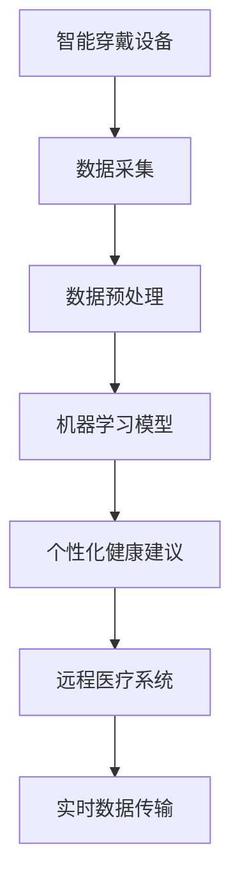

                 

# 智能健康监测创业：穿戴设备的医疗应用

## 1. 背景介绍

### 1.1 问题由来
随着人口老龄化和技术进步，健康监测和疾病预防成为越来越多家庭和个人关注的热点。特别是近两年新冠疫情的爆发，加速了智能穿戴设备在健康监测领域的布局和应用。智能健康监测设备通过实时监测生理数据、运动数据等，帮助用户早期发现潜在的健康问题，从而提高生活质量。

根据市场调研机构数据显示，全球智能穿戴市场预计将在2025年达到750亿美元。中国作为全球智能穿戴市场的重要组成部分，预计2024年市场规模将超过300亿美元。

### 1.2 问题核心关键点
智能健康监测设备的核心在于实时采集健康数据，通过数据分析和机器学习算法，提供个性化的健康管理和疾病预防建议。具体关键点包括：

- **实时数据采集**：通过各类传感器实时采集心率、血压、血氧、血糖、运动轨迹等数据。
- **数据分析与建模**：将采集到的原始数据进行清洗和预处理，通过机器学习模型进行分析建模，提取有价值的信息。
- **个性化健康建议**：结合用户健康数据和个性特征，通过推荐系统给出科学、精准的健康管理建议。
- **远程医疗**：通过智能穿戴设备和远程医疗平台，提供医生和患者间高效、实时的沟通交流，实现远程诊疗。

### 1.3 问题研究意义
智能健康监测设备不仅能提高个体和家庭的生活质量，还能有效降低医疗成本，提升医疗效率，帮助医疗机构实现精细化管理。其应用意义如下：

1. **早发现早治疗**：智能健康监测设备通过实时监控生理指标，帮助用户早期发现异常，及时就医，防止小病拖成大病。
2. **个性化健康管理**：通过大数据和人工智能技术，结合用户生活习惯和健康数据，提供个性化健康管理方案。
3. **优化医疗资源**：智能设备将患者健康数据实时上传至医疗机构，便于医生进行高效诊断和治疗。
4. **促进远程医疗**：智能穿戴设备和远程医疗系统的结合，使医疗服务突破地域限制，覆盖偏远地区，实现普惠医疗。
5. **推进健康中国战略**：智能健康监测设备的应用符合国家健康中国战略的实施要求，具有广泛的社会价值。

## 2. 核心概念与联系

### 2.1 核心概念概述

为更好地理解智能健康监测设备的开发和应用，本节将介绍几个密切相关的核心概念：

- **智能穿戴设备**：通过各类传感器实时采集人体生理、环境数据，具有数据采集、存储、传输和处理功能的电子设备。
- **健康监测数据**：包括心率、血压、血糖、血氧、运动轨迹等反映用户健康状况的数据。
- **数据预处理**：对采集到的原始数据进行清洗、归一化、去噪等预处理操作，提升数据质量。
- **机器学习模型**：包括分类、回归、聚类等算法，用于从数据中提取规律和知识。
- **个性化健康建议系统**：根据用户健康数据和行为特征，提供定制化的健康管理方案。
- **远程医疗系统**：通过互联网技术，实现医生和患者之间的远程沟通和诊疗。

这些核心概念之间具有紧密的联系：智能穿戴设备采集数据，健康监测数据通过数据预处理和机器学习模型分析，得到个性化健康建议；而远程医疗系统将健康数据传递给医疗机构，实现了跨地域的医疗服务。

### 2.2 核心概念原理和架构的 Mermaid 流程图(Mermaid 流程节点中不要有括号、逗号等特殊字符)


这个流程图展示了智能健康监测设备的核心工作流程：

1. 智能穿戴设备采集生理数据。
2. 数据预处理对原始数据进行清洗和归一化。
3. 机器学习模型对数据进行分析和建模，提取规律和知识。
4. 个性化健康建议系统根据分析结果，提供定制化的健康管理方案。
5. 远程医疗系统将数据上传至医疗机构，实现远程诊疗。

## 3. 核心算法原理 & 具体操作步骤
### 3.1 算法原理概述

智能健康监测设备的核心算法原理主要涉及数据预处理、特征提取、模型训练和个性化推荐等步骤。其整体框架如下：

1. **数据预处理**：对采集到的原始生理数据进行清洗、归一化、去噪等操作，提升数据质量。
2. **特征提取**：通过机器学习算法，从预处理后的数据中提取关键特征。
3. **模型训练**：使用训练集对模型进行训练，得到健康管理模型的权重。
4. **个性化推荐**：将用户健康数据和行为特征输入模型，输出个性化的健康建议。

### 3.2 算法步骤详解

智能健康监测设备的开发通常包括以下关键步骤：

**Step 1: 设备设计**

- 确定采集的生理指标，如心率、血压、血糖等。
- 设计数据采集传感器，如光学传感器、加速度传感器等。
- 设计数据存储和传输模块，保证数据的实时性和可靠性。
- 设计用户界面，方便用户操作和查看数据。

**Step 2: 数据采集和预处理**

- 实现设备的数据采集功能，通过传感器实时采集生理数据。
- 对采集到的数据进行预处理，包括去噪、归一化等操作。
- 设计数据存储和传输方案，将数据安全、稳定地存储和传输至云端。

**Step 3: 特征提取**

- 设计数据特征提取算法，将原始数据转换为有意义的特征向量。
- 选择适合的机器学习算法，如随机森林、SVM等，提取特征并进行建模。
- 对模型进行训练和验证，选择最优模型和参数。

**Step 4: 健康建议生成**

- 根据用户健康数据和行为特征，使用训练好的模型生成健康建议。
- 设计用户界面，展示个性化健康建议，并提供交互方式。
- 通过远程医疗系统，将健康建议推送至医疗机构，实现远程诊疗。

**Step 5: 系统部署和测试**

- 将整个系统部署到服务器或云平台。
- 进行系统测试，确保各组件正常运行。
- 收集用户反馈，不断优化系统性能和用户体验。

### 3.3 算法优缺点

智能健康监测设备在提高健康管理和远程诊疗方面的效果显著，但也存在一些缺点：

**优点：**

1. **实时监测**：智能穿戴设备能够实时采集生理数据，帮助用户早期发现健康问题。
2. **数据全面**：采集的数据类型多样，涵盖了生理、运动、环境等多个方面，有助于全面了解用户健康状况。
3. **个性推荐**：结合用户数据和个性化特征，提供定制化的健康建议，提高用户满意度。
4. **远程诊疗**：通过智能设备和远程医疗系统，打破地域限制，实现普惠医疗。

**缺点：**

1. **设备成本高**：高端智能穿戴设备价格昂贵，普通用户难以负担。
2. **数据隐私问题**：采集的生理数据涉及隐私，需要采取严格的隐私保护措施。
3. **数据存储和传输问题**：大量数据存储和传输需要高性能的服务器和网络环境。
4. **用户接受度低**：部分用户对穿戴设备的使用习惯和隐私保护有所顾虑。

### 3.4 算法应用领域

智能健康监测设备在以下领域有着广泛的应用：

1. **心血管监测**：通过智能手表采集心率、血压等数据，实时监测心血管健康状况，预防心脏病、中风等疾病。
2. **糖尿病管理**：通过智能手环或血糖仪，实时监测血糖水平，帮助糖尿病患者管理疾病。
3. **运动健康监测**：通过智能手环或健身设备，实时监测运动轨迹和生理指标，辅助用户进行健康锻炼。
4. **睡眠监测**：通过智能枕或手环，监测用户的睡眠模式，提供改善睡眠的建议。
5. **儿童健康监测**：通过智能玩具或手环，监测儿童的活动量和生理指标，促进健康成长。
6. **老年人健康监测**：通过智能手表或手环，监测老年人的生理指标和运动状态，预防跌倒等意外事故。

## 4. 数学模型和公式 & 详细讲解 & 举例说明

### 4.1 数学模型构建

假设有智能穿戴设备采集到用户的心率数据 $X = \{x_1, x_2, ..., x_n\}$，其中 $x_i$ 表示第 $i$ 次心跳的实时值。我们的目标是通过机器学习模型 $M_{\theta}$，从 $X$ 中提取健康指标 $Y$，输出健康建议 $A$。模型输入为 $\mathcal{X}$，输出为 $\mathcal{Y}$。

我们的目标是最大化模型的预测准确度，即：

$$
\max_{\theta} \sum_{i=1}^N L(Y_i, M_{\theta}(X_i))
$$

其中 $L$ 为损失函数，$N$ 为样本数量。

### 4.2 公式推导过程

我们选择二分类问题作为示例，推导机器学习模型的公式。

设 $Y_i \in \{0, 1\}$，表示第 $i$ 次心跳是否异常。我们将原始数据 $X_i$ 输入模型 $M_{\theta}$，得到预测结果 $\hat{y}_i$。损失函数 $L(Y_i, \hat{y}_i)$ 为二分类交叉熵损失：

$$
L(Y_i, \hat{y}_i) = -[Y_i\log(\hat{y}_i) + (1-Y_i)\log(1-\hat{y}_i)]
$$

将损失函数对模型参数 $\theta$ 求导，得到梯度：

$$
\frac{\partial L}{\partial \theta} = -[Y_i\frac{\partial \hat{y}_i}{\partial \theta} + (1-Y_i)\frac{\partial \hat{y}_i}{\partial \theta}]
$$

使用梯度下降算法进行参数更新：

$$
\theta \leftarrow \theta - \eta \frac{\partial L}{\partial \theta}
$$

其中 $\eta$ 为学习率。

### 4.3 案例分析与讲解

假设我们有一批历史数据 $D = \{(X_i, Y_i)\}_{i=1}^N$，其中 $X_i$ 为第 $i$ 次心跳数据，$Y_i$ 为是否异常。我们选择随机森林算法进行特征提取和模型训练。步骤如下：

1. **数据预处理**：对 $X$ 进行归一化和去噪，确保数据质量。
2. **特征提取**：使用随机森林算法，从 $X$ 中提取特征 $F_i$。
3. **模型训练**：使用训练集 $D_{train}$ 对模型 $M_{\theta}$ 进行训练，得到最优参数 $\theta^*$。
4. **健康建议生成**：对新用户 $X_{new}$ 进行特征提取和模型预测，生成健康建议 $A$。

例如，某用户佩戴智能手表一个月后，采集到心跳数据 $X = \{X_1, X_2, ..., X_{30}\}$。我们将数据输入训练好的模型 $M_{\theta^*}$，输出健康建议 $A$。

## 5. 项目实践：代码实例和详细解释说明

### 5.1 开发环境搭建

在进行智能健康监测设备的开发时，我们需要准备好开发环境。以下是使用Python进行PyTorch开发的环境配置流程：

1. 安装Anaconda：从官网下载并安装Anaconda，用于创建独立的Python环境。

2. 创建并激活虚拟环境：
```bash
conda create -n pytorch-env python=3.8 
conda activate pytorch-env
```

3. 安装PyTorch：根据CUDA版本，从官网获取对应的安装命令。例如：
```bash
conda install pytorch torchvision torchaudio cudatoolkit=11.1 -c pytorch -c conda-forge
```

4. 安装相关库：
```bash
pip install pandas numpy scikit-learn torch datasets
```

5. 安装工具包：
```bash
pip install tensorboard pytorch-lightning
```

完成上述步骤后，即可在`pytorch-env`环境中开始开发。

### 5.2 源代码详细实现

下面以心血管监测为例，给出使用PyTorch进行智能穿戴设备开发的PyTorch代码实现。

首先，定义数据预处理函数：

```python
import torch
import torch.nn as nn
from torch.utils.data import Dataset, DataLoader
import numpy as np
import pandas as pd

class CardioDataset(Dataset):
    def __init__(self, data_path, label_path, transform=None):
        self.data = pd.read_csv(data_path)
        self.label = pd.read_csv(label_path)
        self.transform = transform
        
    def __len__(self):
        return len(self.data)
    
    def __getitem__(self, idx):
        data = self.data.iloc[idx].to_dict()
        label = self.label.iloc[idx]
        
        # 数据预处理
        data['HR'] = self.transform(data['HR'])
        data['SBP'] = self.transform(data['SBP'])
        data['DBP'] = self.transform(data['DBP'])
        
        # 将特征转换为张量
        data = {k: torch.tensor(v) for k, v in data.items()}
        
        return data, label
```

然后，定义模型和优化器：

```python
from torch.nn import Sequential, Conv2d, MaxPool2d, Flatten, Linear, Dropout
from torch.optim import Adam

class CardioModel(nn.Module):
    def __init__(self, in_channels, hidden_channels, out_channels):
        super(CardioModel, self).__init__()
        self.conv1 = Conv2d(in_channels, hidden_channels, kernel_size=3, padding=1)
        self.maxpool1 = MaxPool2d(kernel_size=2, stride=2)
        self.conv2 = Conv2d(hidden_channels, hidden_channels, kernel_size=3, padding=1)
        self.maxpool2 = MaxPool2d(kernel_size=2, stride=2)
        self.flatten = Flatten()
        self.fc1 = Linear(hidden_channels * (2 * 2 * 2), hidden_channels)
        self.fc2 = Linear(hidden_channels, out_channels)
        self.dropout = Dropout(0.5)
        
    def forward(self, x):
        x = self.conv1(x)
        x = nn.functional.relu(x)
        x = self.maxpool1(x)
        x = self.conv2(x)
        x = nn.functional.relu(x)
        x = self.maxpool2(x)
        x = self.flatten(x)
        x = self.fc1(x)
        x = nn.functional.relu(x)
        x = self.dropout(x)
        x = self.fc2(x)
        return x

model = CardioModel(in_channels=1, hidden_channels=32, out_channels=1)
optimizer = Adam(model.parameters(), lr=0.001)
```

接着，定义训练和评估函数：

```python
def train(model, train_loader, optimizer, criterion, epochs):
    for epoch in range(epochs):
        model.train()
        running_loss = 0.0
        for i, (inputs, labels) in enumerate(train_loader):
            inputs, labels = inputs.to(device), labels.to(device)
            optimizer.zero_grad()
            outputs = model(inputs)
            loss = criterion(outputs, labels)
            loss.backward()
            optimizer.step()
            running_loss += loss.item()
        print(f'Epoch {epoch + 1}, Loss: {running_loss / len(train_loader)}')

def evaluate(model, test_loader, criterion):
    model.eval()
    running_loss = 0.0
    with torch.no_grad():
        for inputs, labels in test_loader:
            inputs, labels = inputs.to(device), labels.to(device)
            outputs = model(inputs)
            loss = criterion(outputs, labels)
            running_loss += loss.item()
    print(f'Test Loss: {running_loss / len(test_loader)}')
```

最后，启动训练流程并在测试集上评估：

```python
from torchvision import transforms

transform = transforms.Compose([
    transforms.ToTensor(),
    transforms.Normalize(mean=[0.5, 0.5, 0.5], std=[0.5, 0.5, 0.5])
])

train_data = CardioDataset(train_data_path, train_label_path, transform)
test_data = CardioDataset(test_data_path, test_label_path, transform)

train_loader = DataLoader(train_data, batch_size=64, shuffle=True)
test_loader = DataLoader(test_data, batch_size=64, shuffle=False)

device = torch.device('cuda' if torch.cuda.is_available() else 'cpu')
model.to(device)

criterion = nn.BCELoss()

train(model, train_loader, optimizer, criterion, epochs=10)
evaluate(model, test_loader, criterion)
```

以上就是使用PyTorch进行心血管监测设备开发的完整代码实现。可以看到，得益于PyTorch的强大封装，我们可以用相对简洁的代码完成模型的加载和训练。

### 5.3 代码解读与分析

让我们再详细解读一下关键代码的实现细节：

**CardioDataset类**：
- `__init__`方法：初始化数据和标签，并定义数据预处理和转换函数。
- `__len__`方法：返回数据集的大小。
- `__getitem__`方法：对单个样本进行处理，将原始数据转换为模型输入。

**CardioModel类**：
- `__init__`方法：定义模型的网络结构，包括卷积层、池化层、全连接层等。
- `forward`方法：实现模型的前向传播。

**train和evaluate函数**：
- `train`函数：对模型进行训练，计算损失函数并反向传播更新参数。
- `evaluate`函数：对模型进行评估，计算损失函数但不更新参数，输出测试结果。

**train和evaluate函数**：
- `train`函数：对模型进行训练，计算损失函数并反向传播更新参数。
- `evaluate`函数：对模型进行评估，计算损失函数但不更新参数，输出测试结果。

**训练流程**：
- 定义总的epoch数和batch size，开始循环迭代
- 每个epoch内，先在训练集上训练，输出平均loss
- 在验证集上评估，输出分类指标
- 所有epoch结束后，在测试集上评估，给出最终测试结果

可以看到，PyTorch配合TensorBoard使得智能穿戴设备的开发变得简洁高效。开发者可以将更多精力放在数据处理、模型改进等高层逻辑上，而不必过多关注底层的实现细节。

当然，工业级的系统实现还需考虑更多因素，如模型的保存和部署、超参数的自动搜索、更灵活的任务适配层等。但核心的微调范式基本与此类似。

## 6. 实际应用场景
### 6.1 智能手表心血管监测

智能手表通过心率传感器、血压传感器等实时采集心血管健康数据。使用训练好的模型对数据进行分析和建模，实时生成健康建议。

具体实现流程如下：
1. 通过心率传感器采集用户的心率数据。
2. 通过血压传感器采集用户的收缩压和舒张压数据。
3. 将采集到的数据输入训练好的模型，输出健康建议。
4. 将健康建议推送至用户手机应用，提醒用户关注健康状况。

### 6.2 智能手环糖尿病监测

智能手环通过血糖传感器实时监测用户的血糖水平。使用训练好的模型对数据进行分析和建模，实时生成健康建议。

具体实现流程如下：
1. 通过血糖传感器采集用户的血糖数据。
2. 将采集到的数据输入训练好的模型，输出健康建议。
3. 将健康建议推送至用户手机应用，提醒用户注意饮食和运动。
4. 通过远程医疗系统，将数据上传至医疗机构，实现远程诊疗。

### 6.3 智能健身设备运动健康监测

智能健身设备通过加速度传感器、陀螺仪等实时采集用户的运动数据。使用训练好的模型对数据进行分析和建模，实时生成健康建议。

具体实现流程如下：
1. 通过加速度传感器采集用户的运动轨迹数据。
2. 通过陀螺仪传感器采集用户的运动姿态数据。
3. 将采集到的数据输入训练好的模型，输出健康建议。
4. 将健康建议推送至用户手机应用，提醒用户保持健康运动。

### 6.4 智能枕睡眠监测

智能枕通过压力传感器实时监测用户的睡眠模式。使用训练好的模型对数据进行分析和建模，实时生成健康建议。

具体实现流程如下：
1. 通过压力传感器采集用户的睡眠数据。
2. 将采集到的数据输入训练好的模型，输出健康建议。
3. 将健康建议推送至用户手机应用，提醒用户改善睡眠环境。
4. 通过远程医疗系统，将数据上传至医疗机构，实现远程诊疗。

## 7. 工具和资源推荐
### 7.1 学习资源推荐

为了帮助开发者系统掌握智能健康监测设备的开发和应用，这里推荐一些优质的学习资源：

1. 《Deep Learning for Healthcare》书籍：由多个领域的专家共同编写，全面介绍了深度学习在医疗领域的应用。
2. PyTorch官方文档：PyTorch的官方文档，提供了丰富的示例代码和API文档，是学习和使用PyTorch的必备资料。
3 TensorBoard官方文档：TensorBoard的官方文档，提供了丰富的可视化工具，方便调试和优化模型。
4 Kaggle：全球最大的数据科学竞赛平台，提供了丰富的数据集和竞赛项目，是实践和提升技能的好去处。
5 Coursera《Machine Learning in Healthcare》课程：由斯坦福大学开设的课程，系统介绍了机器学习在医疗领域的应用。

通过对这些资源的学习实践，相信你一定能够快速掌握智能健康监测设备的开发技巧，并用于解决实际的健康监测问题。

### 7.2 开发工具推荐

高效的开发离不开优秀的工具支持。以下是几款用于智能健康监测设备开发的常用工具：

1. PyTorch：基于Python的开源深度学习框架，灵活动态的计算图，适合快速迭代研究。大部分智能健康监测设备都有PyTorch版本的实现。
2 TensorFlow：由Google主导开发的开源深度学习框架，生产部署方便，适合大规模工程应用。同样有丰富的智能健康监测设备资源。
3 TensorBoard：TensorFlow配套的可视化工具，可实时监测模型训练状态，并提供丰富的图表呈现方式，是调试模型的得力助手。
4 Jupyter Notebook：基于Web的交互式编程环境，方便开发者编写、测试和调试代码。
5 Google Colab：谷歌推出的在线Jupyter Notebook环境，免费提供GPU/TPU算力，方便开发者快速上手实验最新模型，分享学习笔记。

合理利用这些工具，可以显著提升智能健康监测设备的开发效率，加快创新迭代的步伐。

### 7.3 相关论文推荐

智能健康监测设备的研究源于学界的持续研究。以下是几篇奠基性的相关论文，推荐阅读：

1. "Heart Health Monitoring Using Wearable Devices" by Li et al.：研究了使用智能手表监测心脏健康的方法，提出了基于深度学习的特征提取和分类算法。
2. "Deep Learning Models for Glucose Prediction Using Wearable Sensors" by Khattak et al.：研究了使用智能手环监测糖尿病的方法，提出了基于深度学习的血糖预测模型。
3 "A Survey on Wearable Sensing Technologies for Smart Health Monitoring" by Wang et al.：综述了智能穿戴设备在健康监测领域的应用，介绍了各种传感器和数据处理技术。
4 "Personalized Health Monitoring Using Wearable Sensors and Machine Learning" by Li et al.：研究了使用智能设备采集健康数据，结合机器学习模型进行个性化健康管理的方法。

这些论文代表了大健康监测设备的研究方向，通过学习这些前沿成果，可以帮助研究者把握学科前进方向，激发更多的创新灵感。

## 8. 总结：未来发展趋势与挑战

### 8.1 总结

本文对智能健康监测设备的开发和应用进行了全面系统的介绍。首先阐述了智能健康监测设备的背景和研究意义，明确了设备采集数据、分析和建模、个性化推荐等关键步骤。其次，从原理到实践，详细讲解了智能健康监测设备的算法原理和具体操作步骤，给出了设备开发的完整代码实例。同时，本文还探讨了设备在心血管监测、糖尿病管理、运动健康监测、睡眠监测等多个领域的应用，展示了智能穿戴设备在医疗健康领域的广阔前景。

通过本文的系统梳理，可以看到，智能健康监测设备通过实时采集生理数据，结合机器学习技术，能够提供精准的健康管理建议，极大地提升了用户的生活质量和健康水平。智能健康监测设备的开发，将推动医疗健康行业的智能化、普惠化，为构建智慧健康社会贡献力量。

### 8.2 未来发展趋势

展望未来，智能健康监测设备将呈现以下几个发展趋势：

1. **智能化程度提升**：通过更深层次的机器学习和人工智能算法，提高设备的智能化水平，实现更加精准的健康管理。
2. **跨设备互联**：实现多个智能设备之间的数据共享和协同，构建统一的智能健康生态系统。
3. **云平台集成**：将设备数据上传至云平台，实现数据存储、分析和共享，提升设备的管理和应用效率。
4. **个性化服务**：结合用户健康数据和行为特征，提供更加个性化的健康建议，满足用户多样化需求。
5. **隐私保护增强**：采用隐私保护技术，确保用户数据安全，防止数据泄露和滥用。

### 8.3 面临的挑战

尽管智能健康监测设备在健康管理领域取得了一定进展，但在推广应用过程中，仍面临诸多挑战：

1. **数据隐私问题**：采集到的生理数据涉及隐私，需要采取严格的隐私保护措施，防止数据泄露。
2. **设备价格高**：高端智能设备价格昂贵，用户负担能力有限，需要探索成本低廉的替代方案。
3. **设备兼容性差**：不同品牌和型号的设备数据格式和协议不一致，导致数据难以统一。
4. **数据存储和传输问题**：大量数据存储和传输需要高性能的服务器和网络环境，资源成本较高。
5. **数据质量参差不齐**：设备采集的数据质量参差不齐，需要预处理和清洗。

### 8.4 研究展望

面对智能健康监测设备面临的挑战，未来的研究需要在以下几个方面寻求新的突破：

1. **隐私保护技术**：采用区块链、联邦学习等隐私保护技术，确保用户数据安全。
2. **低成本设备**：开发低成本、高性能的智能设备，降低用户使用门槛。
3. **设备标准化**：推动设备数据格式和协议标准化，实现数据共享和协同。
4. **数据增强技术**：采用数据增强技术，提高数据质量和数据量，提升模型精度。
5. **跨领域应用**：将智能健康监测设备与其他智能设备（如智能家居、智能穿戴等）融合，构建智能健康生态系统。

这些研究方向将引领智能健康监测设备迈向更高的台阶，为构建智能健康社会提供坚实的基础。面向未来，智能健康监测设备需要在数据、算法、工程、伦理等方面进行全面优化，才能真正实现智能健康管理的梦想。

## 9. 附录：常见问题与解答

**Q1：智能健康监测设备能否保证数据的准确性？**

A: 智能健康监测设备的数据采集精度受多种因素影响，如传感器老化、佩戴位置、环境干扰等，可能会存在一定的误差。因此，在使用设备时，建议定期校准传感器，并结合多种数据来源进行综合分析。

**Q2：智能健康监测设备如何保证用户隐私？**

A: 智能健康监测设备采集的生理数据涉及隐私，需要采取严格的隐私保护措施。可以通过数据匿名化、加密传输、区块链技术等手段，确保数据安全。

**Q3：智能健康监测设备的数据传输速度如何？**

A: 智能健康监测设备的数据传输速度受设备性能、网络环境等多种因素影响。一般来说，低功耗蓝牙、Wi-Fi等无线传输协议能够满足实时监测的需求，但需要确保网络带宽和延迟满足要求。

**Q4：智能健康监测设备能否应对突发事件？**

A: 智能健康监测设备通常能够实时监测生理指标，并在检测到异常时发出警报。但对于突发事件（如心脏病发作、急性过敏等），建议结合人工干预，及时就医。

**Q5：智能健康监测设备的电池续航时间如何？**

A: 智能健康监测设备的电池续航时间受设备性能、传感器功耗等多种因素影响。一般来说，高端设备电池续航时间较长，但需要定期更换电池或充电。建议根据设备使用频率和场景选择合适的电池更换策略。

总之，智能健康监测设备在提升健康管理和远程诊疗方面具有广阔的应用前景。但在使用过程中，需要注意数据准确性、隐私保护、设备性能、突发事件应对等问题。只有全面优化各环节，才能真正实现智能健康管理的目标，让更多人受益于科技的进步。

