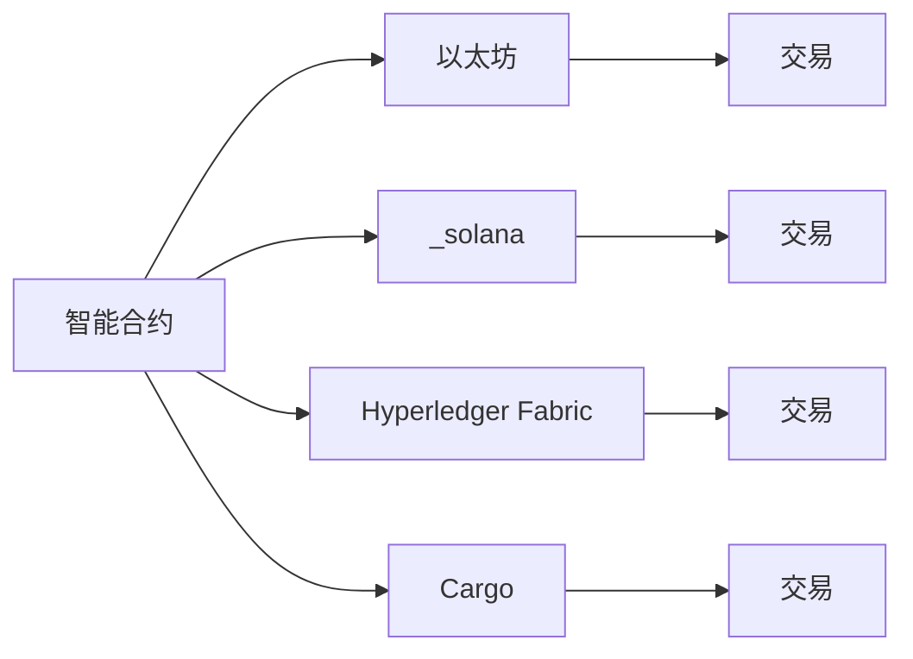

                 

# 智能合约开发：以太坊与其他平台比较

在区块链技术的浪潮中，智能合约已迅速崛起，成为去中心化应用（DApps）的核心引擎。随着越来越多的开发者和企业涌入这个领域，智能合约的可扩展性、安全性、执行效率和应用场景多样性变得尤为重要。本文将详细探讨以太坊及其竞争对手，如solana、fabric、cargo等平台，比较它们在智能合约开发方面的优势与不足，为开发者选择适合的技术栈提供参考。

## 1. 背景介绍

### 1.1 问题由来

智能合约的概念最早由尼克·萨博于1994年提出，旨在通过程序自动执行合约条款，减少人为干预。近年来，以太坊凭借其高度的定制化、丰富的第三方库和活跃的开发者社区，成为了智能合约开发的主流平台。

然而，随着技术的演进，新的区块链平台如solana、fabric和cargo等也陆续涌现，带来了不同的解决方案和优势。如何选择合适的平台进行智能合约开发，成为了每个开发者必须面对的问题。

### 1.2 问题核心关键点

智能合约开发需要考虑的主要因素包括：

- 平台可扩展性：能否支持大规模的交易量和并发请求？
- 安全性：是否具备完善的安全机制，避免51%攻击和重放攻击等威胁？
- 执行效率：智能合约的执行速度如何？
- 应用场景：是否支持各类复杂的业务逻辑和数据存储需求？
- 社区与生态：平台是否有活跃的开发者社区和丰富的工具链支持？

选择适合的技术栈将直接关系到项目的成功率和持续维护成本。本文将对以太坊和其他主流平台的上述关键点进行深入比较。

## 2. 核心概念与联系

### 2.1 核心概念概述

- **智能合约**：基于区块链技术，由代码编写的合同，可自动执行和执行结果可验证。
- **以太坊(Ethereum)**：一种开源区块链平台，支持智能合约的编写、部署和执行。
- **Solana**：一种高吞吐量、低延迟的区块链平台，支持智能合约的部署和执行。
- **Hyperledger Fabric**：由Linux基金会开发的企业级区块链平台，支持智能合约的部署和管理。
- **Cargo**：一种基于波卡的智能合约平台，支持跨链互操作性和丰富的功能扩展。

### 2.2 核心概念原理和架构的 Mermaid 流程图



## 3. 核心算法原理 & 具体操作步骤

### 3.1 算法原理概述

智能合约的编写和执行过程包括：

- 编写智能合约代码，通过Solidity、Rust、Solang等语言编写合约逻辑。
- 将合约代码部署到区块链平台，生成智能合约地址。
- 执行智能合约，通过调用合约中的函数执行特定操作。

不同的区块链平台在智能合约的编写、部署和执行过程上存在差异，但核心原理类似。

### 3.2 算法步骤详解

**以太坊**：

1. 编写智能合约代码，使用Solidity语言。
2. 通过以太坊钱包或合约编写工具如Remix，将合约代码部署到以太坊网络。
3. 通过以太坊客户端或API调用合约中的函数执行操作。

**Solana**：

1. 编写智能合约代码，使用Rust或Solana原生语言。
2. 通过Solana钱包或命令行工具，将合约代码部署到Solana网络。
3. 通过Solana客户端或API调用合约中的函数执行操作。

**Hyperledger Fabric**：

1. 编写智能合约代码，使用Go或Java语言。
2. 通过Hyperledger Fabric控制台或链码部署工具，将合约代码部署到Hyperledger Fabric网络。
3. 通过Hyperledger Fabric客户端或API调用合约中的链码函数执行操作。

**Cargo**：

1. 编写智能合约代码，使用Rust语言。
2. 通过Cargo CLI工具，将合约代码部署到Cargo网络。
3. 通过Cargo客户端或API调用合约中的函数执行操作。

### 3.3 算法优缺点

**以太坊**：

- **优点**：
  - 高度定制化，支持复杂的业务逻辑和数据存储。
  - 丰富的第三方库和活跃的开发者社区，易于开发和调试。
  - 具备完善的安全机制，如EVM虚拟机和共识算法。

- **缺点**：
  - 执行效率较低，交易费用高昂。
  - 网络拥堵严重，交易延迟较高。

**Solana**：

- **优点**：
  - 高吞吐量，支持每秒百万级的交易量。
  - 低延迟，交易速度极快。
  - 具备完善的安全机制，如共识算法和智能合约验证。

- **缺点**：
  - 开发工具和社区相对较少，开发难度较高。
  - 缺乏丰富的第三方库和框架，扩展性较弱。

**Hyperledger Fabric**：

- **优点**：
  - 支持企业级应用，具备良好的安全性和隐私保护机制。
  - 提供丰富的治理和管理工具，支持多机构协作。
  - 具备完善的开发工具和社区支持。

- **缺点**：
  - 执行效率较低，交易费用较高。
  - 部署和运维复杂，需要较高的技术门槛。

**Cargo**：

- **优点**：
  - 支持跨链互操作性，可以与多种区块链平台无缝集成。
  - 具备强大的生态系统和丰富的功能扩展。
  - 具备完善的安全机制，如零知识证明和加密算法。

- **缺点**：
  - 开发难度较高，需要具备较高的Rust编程水平。
  - 社区相对较小，资源相对有限。

### 3.4 算法应用领域

- **以太坊**：广泛用于金融、供应链、游戏等各类场景，是智能合约开发的代表性平台。
- **Solana**：适用于高吞吐量的应用场景，如DeFi、NFT等，尤其在速度要求高的场景中具有优势。
- **Hyperledger Fabric**：适用于企业级应用，如供应链金融、医疗健康、身份验证等，具备良好的治理和管理能力。
- **Cargo**：适用于需要跨链互操作性的应用场景，如跨链交易、去中心化金融等。

## 4. 数学模型和公式 & 详细讲解 & 举例说明

### 4.1 数学模型构建

智能合约的执行过程可以通过以下数学模型描述：

设智能合约代码为 $C(x_1, x_2, ..., x_n)$，其中 $x_i$ 表示输入参数。智能合约执行过程分为三个步骤：

1. 输入验证：检查输入参数 $x_i$ 是否符合要求。
2. 合约执行：根据合约逻辑 $C$ 执行特定操作。
3. 输出验证：检查执行结果 $y$ 是否符合预期。

数学模型如下：

$$
y = C(x_1, x_2, ..., x_n)
$$

### 4.2 公式推导过程

以以太坊为例，智能合约的执行过程推导如下：

1. 输入验证：使用Solidity语言编写的合约代码中，可以对输入参数进行类型检查和范围检查，确保输入符合要求。

2. 合约执行：以太坊虚拟机（EVM）解释执行Solidity代码，计算出执行结果 $y$。

3. 输出验证：EVM将执行结果返回给智能合约，合约可以验证输出是否符合预期。

数学公式如下：

$$
y = C_{\text{Solidity}}(x_1, x_2, ..., x_n)
$$

### 4.3 案例分析与讲解

以智能合约执行以太币转账为例：

1. 输入验证：检查转账地址是否合法，转账金额是否在合理范围内。
2. 合约执行：调用以太币合约中的函数，将以太币从发送者账户转移到接收者账户。
3. 输出验证：检查转账是否成功，资金是否转入接收者账户。

## 5. 项目实践：代码实例和详细解释说明

### 5.1 开发环境搭建

**以太坊**：

1. 安装Node.js和npm。
2. 安装Truffle或 Remix等开发工具。
3. 搭建以太坊测试网络或使用Infura等公有网络。

**Solana**：

1. 安装Rust语言环境。
2. 安装Solana CLI工具和SLS框架。
3. 搭建Solana测试网络或使用Solana主网。

**Hyperledger Fabric**：

1. 安装Java或Go语言环境。
2. 安装Hyperledger Fabric CLI工具。
3. 搭建Hyperledger Fabric测试网络或使用Fabric主网。

**Cargo**：

1. 安装Rust语言环境。
2. 安装Cargo CLI工具。
3. 搭建Cargo测试网络或使用波卡主网。

### 5.2 源代码详细实现

**以太坊**：

```solidity
pragma solidity ^0.8.0;

contract Transfer {
    address payable public owner;
    uint256 public balance;
    
    constructor() payable {
        owner = msg.sender;
        balance = msg.value;
    }
    
    function transfer(address payable _addr, uint256 _amount) public payable {
        require(_amount > 0, "Amount must be greater than zero");
        require(msg.sender != owner, "You can only transfer from the contract owner");
        require(_amount <= balance, "Insufficient balance");
        
        owner.send(_amount);
        balance -= _amount;
        emit Transfer(owner, _addr, _amount);
    }
}
```

**Solana**：

```rust
// 示例智能合约代码，使用solana原生语言
#[solana_sdk]
mod hello_world {
    use hello_world_account::entrypoint;
    use solana_program::entrypoint;
    use solana_program::program::invoke;
    use solana_program::pubkey::Pubkey;
    use solana_program::system_instruction::transfer;

    // 声明程序ID和入口函数
    pub const HELLO_WORLD_PROGRAM_ID: &[u8] = &b"1yD0j9O8L1LC6S9a4WrUU1v9Dc36JYH4Jp1Q1WQ3b2";

    // 定义智能合约函数
    pub fn hello_world_function(
        program_id: &Pubkey,
        from_pubkey: &Pubkey,
        to_pubkey: &Pubkey,
        amount: u64,
    ) -> Result<(), solana_program::invoke::Error> {
        let account_keys = &[from_pubkey, to_pubkey];
        let transfer_accounts = [from_pubkey, to_pubkey];

        // 调用transfer函数进行转账
        invoke(program_id, &hello_world_function_address(), account_keys, &transfer_accounts, amount)
    }
}
```

**Hyperledger Fabric**：

```go
package main

import (
    "github.com/hyperledger/fabric-contract-api-go/contractapi"
)

type HelloWorldContract struct {
}

// 部署合约函数
func NewHelloWorldContract() contractapi.Contract {
    return &HelloWorldContract{}
}

// 调用合约函数
func (c *HelloWorldContract) Transfer(ctx contractapi.ContractContext, from string, to string, amount float64) contractapi.Response {
    // 执行转账操作
    // ...
    return contractapi.Response{
        "msg": "Transfer successful",
    }
}
```

**Cargo**：

```rust
// 示例智能合约代码，使用Rust语言
// Cargo.toml文件配置
// [dependencies]
// cargo = "0.1.5"
// crypto = "0.1.3"
// crypto_signatures = "0.1.2"
// wavelet = "0.1.0"
// zero = "0.1.0"

// 智能合约代码
use cargo_api::{build_pallet, pallet};

// 声明合约函数
pub trait Pallet {
    fn transfer(from: Pallet, to: Pallet, amount: u64) -> Result<(), Error>;
}

// 定义智能合约结构体
struct HelloWorldPallet {
    pallet: pallet::Pallet,
}

impl HelloWorldPallet {
    pub fn new(pallet: pallet::Pallet) -> HelloWorldPallet {
        HelloWorldPallet { pallet }
    }

    pub fn transfer(from: Pallet, to: Pallet, amount: u64) -> Result<(), Error> {
        // 执行转账操作
        // ...
    }
}
```

### 5.3 代码解读与分析

**以太坊**：

- 使用Solidity语言编写智能合约。
- 定义合约变量 `owner` 和 `balance`。
- 编写 `transfer` 函数，实现以太币转账。
- 通过 `emit` 关键字定义事件，记录转账操作。

**Solana**：

- 使用solana原生语言编写智能合约。
- 定义智能合约函数 `hello_world_function`，实现转账操作。
- 使用 `invoke` 函数调用系统指令，执行转账操作。

**Hyperledger Fabric**：

- 使用Go语言编写智能合约。
- 定义合约结构体 `HelloWorldContract`。
- 实现 `Transfer` 函数，执行转账操作。

**Cargo**：

- 使用Rust语言编写智能合约。
- 声明智能合约接口 `Pallet`，定义 `transfer` 函数。
- 实现智能合约结构体 `HelloWorldPallet`，执行转账操作。

### 5.4 运行结果展示

以太坊、solana、Hyperledger Fabric和Cargo的智能合约运行结果类似，通常为执行成功的消息或返回的特定状态码。

## 6. 实际应用场景

### 6.1 智能合约在金融中的应用

智能合约在金融领域有广泛的应用，如智能合约借贷、智能合约保险等。以太坊和Hyperledger Fabric在金融场景中应用广泛，具有较高的可扩展性和安全性。

**以太坊**：

- 智能合约借贷：用户通过智能合约借款，合同自动执行放款、还款和违约处理。
- 智能合约保险：保险公司自动检测出险情况，并自动触发理赔流程，减少人工操作和欺诈风险。

**Solana**：

- 智能合约借贷：支持高吞吐量的交易量，适用于大规模贷款申请和还款处理。
- 智能合约保险：通过高频率的交易验证，提高理赔处理的及时性和准确性。

**Hyperledger Fabric**：

- 智能合约借贷：支持多机构协作，具备完善的治理和合规机制。
- 智能合约保险：具备高度的隐私保护机制，防止泄露用户隐私。

**Cargo**：

- 智能合约借贷：支持跨链互操作性，可以与多种区块链平台无缝集成。
- 智能合约保险：支持多种治理模式和共识算法，具备灵活性和扩展性。

### 6.2 智能合约在供应链中的应用

智能合约在供应链领域也有广泛的应用，如智能合约物流、智能合约采购等。Hyperledger Fabric和Cargo在供应链场景中应用较多，具有较强的治理和互操作性。

**Hyperledger Fabric**：

- 智能合约物流：物流公司自动执行订单处理、货物跟踪和异常处理。
- 智能合约采购：供应商自动执行订单生成、交货验证和付款处理。

**Cargo**：

- 智能合约物流：支持跨链互操作性，可以与多种物流平台无缝集成。
- 智能合约采购：具备强大的生态系统和丰富的功能扩展，支持多种供应链协议。

### 6.3 智能合约在医疗中的应用

智能合约在医疗领域的应用主要集中在医疗数据共享和隐私保护方面。Cargo在医疗场景中应用较多，具有较强的隐私保护和安全机制。

**Cargo**：

- 智能合约数据共享：医疗机构自动执行数据共享协议，确保数据安全和隐私保护。
- 智能合约隐私保护：通过零知识证明等技术，确保患者隐私不被泄露。

## 7. 工具和资源推荐

### 7.1 学习资源推荐

**以太坊**：

1. Solidity官方文档：详细介绍了Solidity语言的语法和智能合约的编写方法。
2. Ethereum官方文档：提供了以太坊网络的详细介绍和API接口。
3. Truffle和Remix官方文档：提供了智能合约开发工具的详细介绍和使用方法。

**Solana**：

1. Solana官方文档：详细介绍了Solana语言的语法和智能合约的编写方法。
2. Solana官方教程：提供了Solana网络的详细介绍和开发指南。
3. SLS官方文档：提供了Solana智能合约框架的详细介绍和使用方法。

**Hyperledger Fabric**：

1. Hyperledger Fabric官方文档：详细介绍了Hyperledger Fabric的架构和智能合约的编写方法。
2. Hyperledger Fabric官方教程：提供了Hyperledger Fabric网络的详细介绍和开发指南。
3. Go官方文档：提供了Go语言的详细介绍和编程指南。

**Cargo**：

1. Cargo官方文档：详细介绍了Cargo的用法和智能合约的编写方法。
2. Polkadot官方文档：提供了Cargo网络的详细介绍和开发指南。
3. Rust官方文档：提供了Rust语言的详细介绍和编程指南。

### 7.2 开发工具推荐

**以太坊**：

1. Truffle：用于智能合约开发的IDE。
2. Remix：用于智能合约开发的在线编辑器。
3. MetaMask：用于以太坊钱包和智能合约调用的浏览器插件。

**Solana**：

1. Solana CLI：用于智能合约开发和部署的命令行工具。
2. VSCode扩展：用于Solana智能合约开发的IDE插件。
3. Phantom：用于Solana钱包和智能合约调用的浏览器插件。

**Hyperledger Fabric**：

1. Eclipse Masterson：用于智能合约开发的IDE。
2. Fabric CLI：用于Hyperledger Fabric开发和部署的命令行工具。
3. Go官方IDE：用于Go语言开发的IDE。

**Cargo**：

1. Cargo CLI：用于智能合约开发和部署的命令行工具。
2. VSCode扩展：用于Cargo智能合约开发的IDE插件。
3. Parachain Browser：用于波卡智能合约调用的浏览器插件。

### 7.3 相关论文推荐

**以太坊**：

1. Ethereum Yellow Paper：介绍了以太坊的架构和技术细节。
2. ConsenSys Ethereum Development Manual：提供了以太坊网络的详细介绍和开发指南。
3. Vitalik Buterin的博客：Vitalik Buterin的博客中包含大量关于以太坊的深度文章和技术讨论。

**Solana**：

1. Solana White Paper：介绍了Solana的架构和技术细节。
2. Solana官方白皮书：提供了Solana网络的详细介绍和开发指南。
3. Solana开发者论坛：提供了Solana社区和开发者的交流平台。

**Hyperledger Fabric**：

1. Hyperledger Fabric White Paper：介绍了Hyperledger Fabric的架构和技术细节。
2. Hyperledger Fabric官方白皮书：提供了Hyperledger Fabric网络的详细介绍和开发指南。
3. Hyperledger开发者论坛：提供了Hyperledger社区和开发者的交流平台。

**Cargo**：

1. Parachain Yellow Paper：介绍了Cargo的架构和技术细节。
2. Polkadot官方白皮书：提供了Cargo网络的详细介绍和开发指南。
3. Substrate开发者论坛：提供了Cargo社区和开发者的交流平台。

## 8. 总结：未来发展趋势与挑战

### 8.1 研究成果总结

本文对以太坊、solana、Hyperledger Fabric和Cargo这四个主流智能合约平台进行了深入比较，探讨了它们在智能合约开发中的优势和不足。通过比较，我们发现不同平台的适用场景和优势各异，开发者应根据具体需求选择合适的平台进行开发。

### 8.2 未来发展趋势

智能合约的发展趋势包括以下几个方面：

1. 可扩展性：未来的智能合约平台将更加注重可扩展性，支持更大规模的交易量和并发请求。
2. 安全性：未来的智能合约平台将更加注重安全性，具备完善的安全机制和抗攻击能力。
3. 执行效率：未来的智能合约平台将更加注重执行效率，提高智能合约的执行速度和性能。
4. 跨链互操作性：未来的智能合约平台将更加注重跨链互操作性，支持多种区块链平台无缝集成。
5. 隐私保护：未来的智能合约平台将更加注重隐私保护，确保数据和用户隐私不被泄露。

### 8.3 面临的挑战

智能合约的发展面临以下挑战：

1. 可扩展性：现有的智能合约平台面临交易量和技术扩展性的瓶颈。
2. 安全性：智能合约平台的安全机制和抗攻击能力需要进一步提升。
3. 执行效率：智能合约的执行速度和性能有待进一步提升。
4. 跨链互操作性：不同区块链平台之间的互操作性有待进一步提高。
5. 隐私保护：智能合约平台的隐私保护机制需要进一步完善。

### 8.4 研究展望

未来的研究重点包括：

1. 提升智能合约的可扩展性，支持更大规模的交易量和并发请求。
2. 增强智能合约的安全性，具备完善的安全机制和抗攻击能力。
3. 提高智能合约的执行效率，优化交易速度和性能。
4. 实现跨链互操作性，支持多种区块链平台无缝集成。
5. 加强隐私保护，确保数据和用户隐私不被泄露。

## 9. 附录：常见问题与解答

**Q1：智能合约开发是否需要具备区块链技术基础？**

A: 智能合约开发需要一定的区块链技术基础，包括了解区块链的架构和机制，掌握智能合约的编写和部署方法。建议初学者先从区块链基础知识入手，掌握基本概念和术语。

**Q2：不同平台的智能合约语言有哪些区别？**

A: 不同平台的智能合约语言有所不同。以太坊主要使用Solidity，Solana主要使用Rust和Solana原生语言，Hyperledger Fabric主要使用Go和Java，Cargo主要使用Rust。建议根据平台特性选择合适的语言。

**Q3：智能合约开发有哪些工具和框架可用？**

A: 智能合约开发有许多工具和框架可供选择。以太坊有Truffle、Remix等工具，Solana有SLS框架，Hyperledger Fabric有Fabric CLI和Go官方IDE，Cargo有Cargo CLI和VSCode扩展。建议根据平台特性选择合适的工具。

**Q4：智能合约开发有哪些安全注意事项？**

A: 智能合约开发需要考虑以下安全事项：
1. 输入验证：检查输入参数是否符合要求，防止攻击者利用漏洞。
2. 输出验证：检查执行结果是否符合预期，防止攻击者篡改合约状态。
3. 防止重放攻击：使用随机数或时间戳防止重放攻击。
4. 防止51%攻击：使用共识算法和治理机制防止51%攻击。

**Q5：智能合约开发有哪些常见陷阱？**

A: 智能合约开发常见陷阱包括：
1. 重入攻击：攻击者利用重入机制执行恶意代码。
2. 溢出攻击：攻击者利用溢出漏洞篡改合约状态。
3. 智能合约漏洞：攻击者利用智能合约漏洞进行攻击。
4. 合约地址泄露：智能合约地址泄露会导致资产丢失。

---

作者：禅与计算机程序设计艺术 / Zen and the Art of Computer Programming

