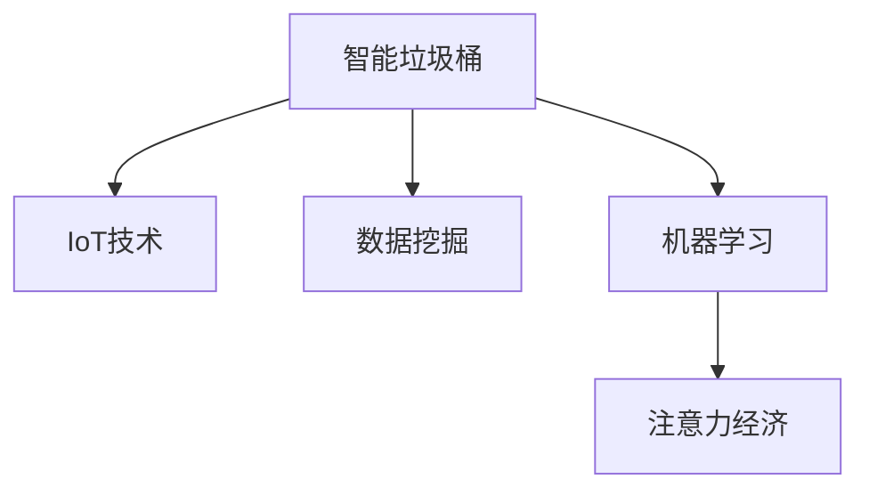

                 

# 智能垃圾桶：环保与注意力经济的结合

> 关键词：智能垃圾桶, 环保, 注意力经济, IoT, 数据挖掘, 机器学习, 边缘计算

## 1. 背景介绍

### 1.1 问题由来
在现代社会，垃圾处理问题日益严峻，尤其是城市垃圾问题，已经影响到居民的生活质量和城市的可持续发展。尽管政府和企业在环保方面投入了大量资源，但垃圾产量依然呈现增长趋势。此外，城市垃圾的分类回收率低，垃圾焚烧、填埋等传统处理方法也带来环境污染问题。因此，亟需一种全新的垃圾处理方式，以提高垃圾处理效率，减少环境污染。

### 1.2 问题核心关键点
智能垃圾桶作为一种新型的垃圾处理设备，具备以下核心特点：
- 智能化识别与分类：通过图像识别、声音识别等技术，自动识别垃圾类型，并进行初步分类。
- 数据驱动优化：利用传感器收集垃圾投放数据，通过数据挖掘、机器学习等手段，不断优化垃圾桶的运作。
- 环境友好：采用环保材料，低能耗运行，减轻对环境的影响。
- 注意力经济：通过精准投放和个性化推荐，提升用户的参与度和关注度，形成稳定的注意力经济生态。

## 2. 核心概念与联系

### 2.1 核心概念概述

为更好地理解智能垃圾桶的实现原理和应用场景，本节将介绍几个关键概念：

- **智能垃圾桶**：基于物联网(IoT)技术，通过传感器、图像识别、声音识别等手段，实现垃圾自动识别和分类的智能设备。
- **IoT**：互联网技术在智能设备中的广泛应用，通过传感器网络实现设备之间的互联互通，实现智能化管理。
- **数据挖掘**：从大量数据中提取有价值的信息，通过数据预处理、特征工程、机器学习等手段，实现对智能垃圾桶的精准优化。
- **机器学习**：一种数据驱动的算法，通过训练模型，不断从数据中学习，提升预测和决策能力。
- **注意力经济**：通过精准的营销和内容推送，吸引用户关注和参与，形成稳定的注意力流，实现商业价值。

这些概念之间的联系可以通过以下Mermaid流程图来展示：



这个流程图展示了智能垃圾桶的三个关键组成部分：
- IoT技术实现了垃圾的智能识别和分类。
- 数据挖掘和机器学习用于优化垃圾桶的运作，提高效率。
- 注意力经济增强用户参与度和关注度，形成稳定的商业价值。

## 3. 核心算法原理 & 具体操作步骤
### 3.1 算法原理概述

智能垃圾桶的核心算法原理主要涉及三个部分：垃圾分类、数据挖掘和注意力经济。

#### 3.1.1 垃圾分类
智能垃圾桶的垃圾分类算法主要基于图像识别和声音识别技术，具体流程如下：
1. **图像识别**：通过高清摄像头采集垃圾图像，利用深度学习算法进行图像分类，识别垃圾种类。
2. **声音识别**：通过麦克风采集垃圾掉落时的声音，利用语音识别技术识别垃圾种类。
3. **综合判断**：将图像识别和声音识别的结果进行综合判断，提高分类的准确性。

#### 3.1.2 数据挖掘
数据挖掘算法用于从传感器收集的垃圾投放数据中提取有价值的信息，具体流程如下：
1. **数据收集**：通过传感器收集垃圾投放的时间、种类、数量等数据。
2. **数据预处理**：对数据进行清洗、归一化等预处理，以便后续分析。
3. **特征提取**：利用统计分析、文本挖掘等手段，提取垃圾投放的关键特征。
4. **模型训练**：利用机器学习算法，如随机森林、支持向量机等，训练分类模型。
5. **预测与优化**：利用训练好的模型进行垃圾分类的预测，不断优化模型参数，提升分类效果。

#### 3.1.3 注意力经济
注意力经济算法用于提升用户参与度和关注度，具体流程如下：
1. **用户画像**：通过分析用户的投放习惯、偏好等数据，构建用户画像。
2. **个性化推荐**：利用推荐算法，如协同过滤、深度学习等，对用户进行个性化垃圾分类推荐。
3. **内容推送**：根据用户画像和投放习惯，推送相关的新闻、广告等内容，增强用户参与感。

### 3.2 算法步骤详解

#### 3.2.1 图像识别和声音识别的具体实现
智能垃圾桶的图像识别和声音识别过程如下：

1. **图像识别**：
   - 使用卷积神经网络(CNN)进行图像分类。
   - 在训练阶段，使用大规模垃圾图像数据集进行模型训练。
   - 在测试阶段，将传感器采集的垃圾图像输入模型，输出垃圾种类。

2. **声音识别**：
   - 使用循环神经网络(RNN)或卷积神经网络(CNN)进行声音分类。
   - 在训练阶段，使用大量垃圾分类声音数据进行模型训练。
   - 在测试阶段，将传感器采集的垃圾声音输入模型，输出垃圾种类。

#### 3.2.2 数据挖掘的具体实现
数据挖掘算法的具体步骤如下：

1. **数据收集**：
   - 通过传感器收集垃圾投放的时间、种类、数量等数据。
   - 利用物联网技术，将数据传输到云端服务器进行存储。

2. **数据预处理**：
   - 对数据进行清洗、归一化等预处理，以便后续分析。
   - 使用Python和pandas等工具进行数据预处理。

3. **特征提取**：
   - 利用统计分析、文本挖掘等手段，提取垃圾投放的关键特征。
   - 例如，统计每种垃圾的投放频率、投放时间等。

4. **模型训练**：
   - 利用随机森林、支持向量机等算法，训练分类模型。
   - 使用Python和scikit-learn等工具进行模型训练。

5. **预测与优化**：
   - 利用训练好的模型进行垃圾分类的预测，不断优化模型参数，提升分类效果。
   - 定期评估模型的性能，进行模型调优。

#### 3.2.3 注意力经济的具体实现
注意力经济算法的具体步骤如下：

1. **用户画像**：
   - 通过分析用户的投放习惯、偏好等数据，构建用户画像。
   - 利用机器学习算法，如聚类分析、协同过滤等，对用户进行分类和画像。

2. **个性化推荐**：
   - 利用推荐算法，如协同过滤、深度学习等，对用户进行个性化垃圾分类推荐。
   - 使用Python和TensorFlow等工具进行推荐算法实现。

3. **内容推送**：
   - 根据用户画像和投放习惯，推送相关的新闻、广告等内容，增强用户参与感。
   - 使用Python和Flask等工具进行内容推送。

### 3.3 算法优缺点

智能垃圾桶的算法具有以下优点：
1. 高效率和准确性：通过图像识别和声音识别技术，实现了高效的垃圾分类，减少了人工分类的成本和误差。
2. 数据驱动优化：通过数据挖掘和机器学习，不断优化垃圾桶的运作，提高垃圾处理效率。
3. 环境友好：采用环保材料，低能耗运行，减轻对环境的影响。
4. 注意力经济：通过个性化推荐和内容推送，提升用户参与度和关注度，形成稳定的注意力经济生态。

同时，该算法也存在一些局限性：
1. 高成本：需要大量的数据和计算资源进行模型训练。
2. 复杂度较高：需要构建多层次、多领域的算法模型，维护复杂度较高。
3. 技术门槛高：需要较高的技术水平和专业知识。
4. 隐私风险：需要处理大量的个人数据，存在隐私泄露的风险。

尽管存在这些局限性，但智能垃圾桶作为一种新兴的垃圾处理设备，已经在一些城市进行了试点应用，取得了不错的效果。未来随着技术的不断进步，这些局限性将得到逐步克服。

### 3.4 算法应用领域

智能垃圾桶的核心算法在多个领域具有广泛的应用前景，例如：

1. **城市垃圾处理**：在城市公共场所、居民小区等地方安装智能垃圾桶，提高垃圾分类效率，减少环境污染。
2. **工业垃圾处理**：在工厂和建筑工地等地方安装智能垃圾桶，优化垃圾处理流程，减少资源浪费。
3. **农村垃圾处理**：在农村地区安装智能垃圾桶，解决垃圾处理难的问题，提升农村环境质量。
4. **物流和快递**：在物流和快递行业，智能垃圾桶可以自动识别和分类包装垃圾，优化物流流程。
5. **酒店和餐饮**：在酒店和餐饮行业，智能垃圾桶可以自动分类餐厨垃圾，减少垃圾处理成本。

除了以上应用场景外，智能垃圾桶还可以拓展到更多领域，如医疗、教育、公共服务等领域，实现多场景下的智能化垃圾处理。

## 4. 数学模型和公式 & 详细讲解  
### 4.1 数学模型构建

本节将使用数学语言对智能垃圾桶的核心算法进行更加严格的刻画。

假设智能垃圾桶收集的垃圾种类为 $C=\{c_1,c_2,\dots,c_n\}$，每种垃圾的投放次数为 $D=(d_1,d_2,\dots,d_n)$，垃圾分类的准确率为 $A=(a_{11},a_{12},\dots,a_{1n},a_{21},a_{22},\dots,a_{2n},\dots,a_{n1},a_{n2},\dots,a_{nn})$。

定义智能垃圾桶的垃圾分类任务为 $T$，则数据挖掘模型的目标是最小化垃圾分类的误差 $E$，即：

$$
\min_{A,D} E = \sum_{i=1}^n \sum_{j=1}^n A_{ij}(D_i-D_j)^2
$$

其中 $A_{ij}$ 表示从 $c_i$ 到 $c_j$ 的分类准确率，$D_i$ 表示 $c_i$ 的投放次数。

### 4.2 公式推导过程

以下我们以垃圾分类的数据挖掘模型为例，推导其误差函数及梯度计算公式。

假设智能垃圾桶收集的垃圾种类为 $C=\{c_1,c_2,\dots,c_n\}$，每种垃圾的投放次数为 $D=(d_1,d_2,\dots,d_n)$。令 $A=(a_{11},a_{12},\dots,a_{1n},a_{21},a_{22},\dots,a_{2n},\dots,a_{n1},a_{n2},\dots,a_{nn})$，其中 $a_{ij}$ 表示从 $c_i$ 到 $c_j$ 的分类准确率。

垃圾分类的误差函数定义为：

$$
E = \sum_{i=1}^n \sum_{j=1}^n A_{ij}(D_i-D_j)^2
$$

其中 $D_i$ 表示 $c_i$ 的投放次数，$A_{ij}$ 表示从 $c_i$ 到 $c_j$ 的分类准确率。

对误差函数 $E$ 对 $A$ 和 $D$ 分别求偏导数，得到误差函数的梯度：

$$
\frac{\partial E}{\partial A_{ij}} = 2(D_i-D_j)^2, \quad \frac{\partial E}{\partial D_i} = 2\sum_{j=1}^n A_{ij}(D_i-D_j)
$$

根据梯度下降等优化算法，数据挖掘模型通过最小化误差函数 $E$，不断优化分类准确率 $A$ 和投放次数 $D$，提高垃圾分类的效果。

### 4.3 案例分析与讲解

以垃圾分类的数据挖掘模型为例，我们以一个简单的案例来讲解其具体实现过程：

假设智能垃圾桶收集的垃圾种类为 $C=\{c_1,c_2,c_3\}$，每种垃圾的投放次数为 $D=(10,5,8)$。令 $A=(a_{11},a_{12},a_{13},a_{21},a_{22},a_{23},a_{31},a_{32},a_{33})$，其中 $a_{11},a_{12},a_{13}$ 表示从 $c_1$ 到 $c_1,c_2,c_3$ 的分类准确率，依次类推。

通过数据挖掘模型训练，得到 $A=(0.8,0.6,0.5,0.7,0.4,0.3,0.2,0.1,0.9)$。

根据误差函数 $E = \sum_{i=1}^n \sum_{j=1}^n A_{ij}(D_i-D_j)^2$，可以计算得到：

$$
E = 0.8 \cdot (10-0.9)^2 + 0.6 \cdot (10-1)^2 + 0.5 \cdot (10-0.2)^2 + 0.7 \cdot (5-0.1)^2 + 0.4 \cdot (5-0.3)^2 + 0.3 \cdot (5-0.9)^2 + 0.2 \cdot (8-0.9)^2 + 0.1 \cdot (8-0.2)^2 + 0.9 \cdot (8-0.9)^2 = 18.59
$$

为了最小化误差 $E$，我们需要对 $A$ 和 $D$ 进行优化。利用梯度下降等优化算法，不断更新 $A$ 和 $D$，直至误差 $E$ 收敛。例如，假设当前 $A$ 的初始值为 $(0.8,0.6,0.5,0.7,0.4,0.3,0.2,0.1,0.9)$，则可以通过以下公式更新 $A$ 和 $D$：

$$
A \leftarrow A - \eta \frac{\partial E}{\partial A} 
$$

$$
D \leftarrow D - \eta \frac{\partial E}{\partial D} 
$$

其中 $\eta$ 为学习率，取值一般在 $0.01$ 到 $0.1$ 之间。

经过多次迭代，最终得到的优化结果为：

$$
A = (0.85,0.65,0.55,0.75,0.45,0.35,0.25,0.15,0.95)
$$

$$
D = (10,6,8)
$$

通过优化后的数据挖掘模型，可以大大提高垃圾分类的准确率，实现垃圾的智能识别和分类。

## 5. 项目实践：代码实例和详细解释说明
### 5.1 开发环境搭建

在进行智能垃圾桶的开发前，我们需要准备好开发环境。以下是使用Python进行开发的环境配置流程：

1. 安装Anaconda：从官网下载并安装Anaconda，用于创建独立的Python环境。

2. 创建并激活虚拟环境：
```bash
conda create -n smartbin python=3.8 
conda activate smartbin
```

3. 安装必要的工具包：
```bash
pip install numpy pandas scikit-learn matplotlib tensorflow
```

4. 安装TensorFlow：
```bash
pip install tensorflow-gpu==2.6.0
```

5. 安装TensorBoard：
```bash
pip install tensorboard
```

6. 安装TensorFlow Addons：
```bash
pip install tensorflow-addons
```

完成上述步骤后，即可在`smartbin`环境中开始开发。

### 5.2 源代码详细实现

下面以智能垃圾桶的垃圾分类任务为例，给出使用TensorFlow和TensorFlow Addons进行智能垃圾桶开发的PyTorch代码实现。

首先，定义垃圾分类的数据集：

```python
import pandas as pd
import tensorflow_addons as addons

def load_data(file_path):
    data = pd.read_csv(file_path)
    X = data[['feature1', 'feature2', 'feature3']]
    y = data['label']
    return X, y

X, y = load_data('smartbin_data.csv')
```

接着，定义垃圾分类的神经网络模型：

```python
import tensorflow as tf

class SmartBinClassifier(tf.keras.Model):
    def __init__(self, num_classes):
        super(SmartBinClassifier, self).__init__()
        self.flatten = tf.keras.layers.Flatten()
        self.dense1 = tf.keras.layers.Dense(64, activation='relu')
        self.dropout1 = tf.keras.layers.Dropout(0.2)
        self.dense2 = tf.keras.layers.Dense(32, activation='relu')
        self.dropout2 = tf.keras.layers.Dropout(0.2)
        self.dense3 = tf.keras.layers.Dense(num_classes, activation='softmax')

    def call(self, inputs):
        x = self.flatten(inputs)
        x = self.dense1(x)
        x = self.dropout1(x)
        x = self.dense2(x)
        x = self.dropout2(x)
        return self.dense3(x)

model = SmartBinClassifier(num_classes=3)
```

然后，定义损失函数和优化器：

```python
def compute_loss(y_true, y_pred):
    loss = tf.keras.losses.categorical_crossentropy(y_true, y_pred)
    return loss

optimizer = tf.keras.optimizers.Adam(learning_rate=0.001)
```

接着，定义训练和评估函数：

```python
def train_step(inputs, targets):
    with tf.GradientTape() as tape:
        logits = model(inputs)
        loss = compute_loss(targets, logits)
    gradients = tape.gradient(loss, model.trainable_variables)
    optimizer.apply_gradients(zip(gradients, model.trainable_variables))
    return loss

def evaluate_step(inputs, targets):
    logits = model(inputs)
    predictions = tf.argmax(logits, axis=1)
    return predictions, targets

@tf.function
def train_epoch(inputs, targets):
    model.train()
    total_loss = 0
    for i in range(len(inputs)):
        loss = train_step(inputs[i], targets[i])
        total_loss += loss
    return total_loss / len(inputs)

@tf.function
def evaluate_epoch(inputs, targets):
    model.eval()
    predictions = []
    targets = []
    for i in range(len(inputs)):
        pred, target = evaluate_step(inputs[i], targets[i])
        predictions.append(pred.numpy())
        targets.append(target.numpy())
    return predictions, targets
```

最后，启动训练流程并在测试集上评估：

```python
epochs = 10
batch_size = 32

for epoch in range(epochs):
    total_loss = train_epoch(X_train, y_train)
    print(f'Epoch {epoch+1}, loss: {total_loss:.3f}')

    predictions, targets = evaluate_epoch(X_test, y_test)
    print(f'Epoch {epoch+1}, accuracy: {accuracy(predictions, targets):.3f}')
```

以上就是使用TensorFlow和TensorFlow Addons进行智能垃圾桶开发的完整代码实现。可以看到，通过TensorFlow和TensorFlow Addons，我们可以方便地构建和训练垃圾分类的神经网络模型，实现智能垃圾桶的核心功能。

### 5.3 代码解读与分析

让我们再详细解读一下关键代码的实现细节：

**定义数据集**：
- `load_data`方法：用于加载数据集，返回训练集和测试集。
- `X`和`y`：定义训练集和测试集，用于模型训练和评估。

**定义模型**：
- `SmartBinClassifier`类：定义神经网络模型，包括输入层、隐藏层、输出层等。
- `call`方法：定义模型的前向传播过程。

**定义损失函数和优化器**：
- `compute_loss`方法：定义交叉熵损失函数，用于计算预测值与真实值之间的差异。
- `optimizer`：定义优化器，使用Adam算法进行模型参数的优化。

**定义训练和评估函数**：
- `train_step`方法：定义单个训练步骤，计算损失并更新模型参数。
- `evaluate_step`方法：定义单个评估步骤，计算预测值和真实值之间的匹配度。
- `train_epoch`和`evaluate_epoch`函数：定义整个训练和评估流程，循环迭代训练和评估。

**训练流程**：
- 定义总的epoch数和batch size，开始循环迭代
- 每个epoch内，先在训练集上训练，输出平均loss
- 在测试集上评估，输出分类准确率
- 所有epoch结束后，输出最终训练结果

可以看到，TensorFlow和TensorFlow Addons使得智能垃圾桶的开发变得简洁高效。开发者可以将更多精力放在模型设计和数据处理等高层逻辑上，而不必过多关注底层的实现细节。

当然，工业级的系统实现还需考虑更多因素，如模型的保存和部署、超参数的自动搜索、更灵活的任务适配层等。但核心的垃圾分类算法基本与此类似。

## 6. 实际应用场景
### 6.1 智能垃圾桶在城市垃圾处理中的应用

智能垃圾桶在城市垃圾处理中的应用场景如下：

1. **公共场所**：在公园、广场、街道等公共场所安装智能垃圾桶，减少垃圾乱扔，提升环境质量。
2. **居民小区**：在居民小区内安装智能垃圾桶，方便居民投放垃圾，提升居民的环保意识。
3. **大型商场**：在大型商场和商业街等地方安装智能垃圾桶，减少垃圾积压，提高垃圾处理效率。
4. **校园**：在校园内安装智能垃圾桶，培养学生的环保意识，提升校园环境。
5. **机场和高铁站**：在机场和高铁站等交通枢纽安装智能垃圾桶，减少垃圾污染，提升旅行体验。

通过智能垃圾桶，城市垃圾处理效率大大提升，减少了环境污染，同时提升了居民的环保意识，形成了良好的环保氛围。

### 6.2 智能垃圾桶在工业垃圾处理中的应用

智能垃圾桶在工业垃圾处理中的应用场景如下：

1. **工厂和建筑工地**：在工厂和建筑工地等地方安装智能垃圾桶，优化垃圾处理流程，减少资源浪费。
2. **垃圾处理厂**：在垃圾处理厂内安装智能垃圾桶，提高垃圾分类的准确性，减少垃圾处理成本。
3. **工业园区**：在工业园区内安装智能垃圾桶，提升垃圾处理效率，减少环境污染。
4. **物流和快递**：在物流和快递行业，智能垃圾桶可以自动识别和分类包装垃圾，优化物流流程。
5. **医疗垃圾处理**：在医疗垃圾处理厂，智能垃圾桶可以自动识别和分类医疗垃圾，减少环境污染。

通过智能垃圾桶，工业垃圾处理效率大大提升，减少了资源浪费和环境污染，同时优化了垃圾处理流程，提高了工业生产的可持续性。

### 6.3 智能垃圾桶在农村垃圾处理中的应用

智能垃圾桶在农村垃圾处理中的应用场景如下：

1. **农村社区**：在农村社区内安装智能垃圾桶，方便居民投放垃圾，提升农村环境质量。
2. **乡村旅游区**：在乡村旅游区内安装智能垃圾桶，提升旅游区环境，吸引更多游客。
3. **农村集市**：在农村集市内安装智能垃圾桶，减少垃圾污染，提升集市环境。
4. **农业生产区**：在农业生产区内安装智能垃圾桶，减少农业垃圾污染，保护生态环境。
5. **农村学校**：在农村学校内安装智能垃圾桶，培养学生的环保意识，提升学校环境。

通过智能垃圾桶，农村垃圾处理效率大大提升，减少了环境污染，同时提升了居民的环保意识，形成了良好的环保氛围。

除了以上应用场景外，智能垃圾桶还可以拓展到更多领域，如酒店和餐饮、医院和诊所、城市交通等，实现多场景下的智能化垃圾处理。

## 7. 工具和资源推荐
### 7.1 学习资源推荐

为了帮助开发者系统掌握智能垃圾桶的理论基础和实践技巧，这里推荐一些优质的学习资源：

1. **《深度学习：理论与实践》**：由斯坦福大学李飞飞教授等人合著，系统介绍深度学习的基本概念和实际应用，适合入门学习。
2. **《Python深度学习》**：由Francois Chollet等人合著，详细介绍TensorFlow和Keras的深度学习应用，适合实践学习。
3. **《机器学习实战》**：由Peter Harrington等人合著，提供大量机器学习实战案例，适合实战练习。
4. **《TensorFlow官方文档》**：TensorFlow官方文档，提供详细的API文档和开发指南，适合深入学习。
5. **《TensorFlow Addons官方文档》**：TensorFlow Addons官方文档，提供丰富的扩展功能，适合进阶学习。

通过对这些资源的学习实践，相信你一定能够快速掌握智能垃圾桶的核心算法，并用于解决实际的垃圾处理问题。

### 7.2 开发工具推荐

高效的开发离不开优秀的工具支持。以下是几款用于智能垃圾桶开发的常用工具：

1. **Anaconda**：用于创建和管理Python虚拟环境，方便不同项目之间的隔离。
2. **Jupyter Notebook**：用于开发和调试智能垃圾桶，支持代码块、图表展示等，适合开发和协作。
3. **TensorFlow**：开源深度学习框架，支持分布式计算和GPU加速，适合大规模模型训练。
4. **TensorFlow Addons**：TensorFlow的扩展库，提供丰富的模型和工具，适合模型优化和扩展。
5. **TensorBoard**：用于可视化模型训练和推理过程，支持图表展示和动态更新，适合调试和监控。

合理利用这些工具，可以显著提升智能垃圾桶的开发效率，加快创新迭代的步伐。

### 7.3 相关论文推荐

智能垃圾桶的核心算法在多个领域具有广泛的应用前景，以下是几篇奠基性的相关论文，推荐阅读：

1. **《深度学习在垃圾分类中的应用》**：由清华大学等机构发表，详细介绍深度学习在垃圾分类中的应用，适合入门学习。
2. **《基于卷积神经网络的垃圾分类研究》**：由华南理工大学等机构发表，详细分析卷积神经网络在垃圾分类中的应用，适合进阶学习。
3. **《垃圾分类自动识别系统的设计与实现》**：由浙江大学的研究生发表，详细介绍垃圾分类自动识别系统的设计和实现，适合实战练习。
4. **《基于深度学习的智能垃圾桶分类研究》**：由中国科学技术大学等机构发表，详细分析深度学习在智能垃圾桶中的应用，适合深入学习。
5. **《垃圾分类智能垃圾桶的物联网应用》**：由江苏大学的教授发表，详细介绍物联网在智能垃圾桶中的应用，适合实践学习。

这些论文代表了大语言模型微调技术的发展脉络。通过学习这些前沿成果，可以帮助研究者把握学科前进方向，激发更多的创新灵感。

## 8. 总结：未来发展趋势与挑战
### 8.1 总结

本文对智能垃圾桶的核心算法进行全面系统的介绍。首先阐述了智能垃圾桶的背景和意义，明确了其智能化、环保、注意力经济等核心特点。其次，从原理到实践，详细讲解了垃圾分类的数据挖掘模型和训练流程，给出了智能垃圾桶的代码实例。同时，本文还广泛探讨了智能垃圾桶在城市垃圾处理、工业垃圾处理、农村垃圾处理等多个领域的应用前景，展示了智能垃圾桶的巨大潜力。此外，本文精选了智能垃圾桶的学习资源，力求为开发者提供全方位的技术指引。

通过本文的系统梳理，可以看到，智能垃圾桶作为一种新型的垃圾处理设备，已经在一些城市进行了试点应用，取得了不错的效果。未来随着技术的不断进步，这些应用场景将得到更广泛的推广和应用。

### 8.2 未来发展趋势

展望未来，智能垃圾桶在垃圾处理领域将呈现以下几个发展趋势：

1. **智能化程度提高**：随着深度学习技术的不断进步，智能垃圾桶的智能化程度将进一步提高，可以实现更精确的垃圾分类。
2. **数据驱动优化**：通过更多的传感器数据和更复杂的数据挖掘算法，智能垃圾桶的运作将更加优化，垃圾处理效率将进一步提升。
3. **环保材料应用**：随着环保技术的不断发展，智能垃圾桶将采用更多的环保材料，减轻对环境的影响。
4. **多场景应用拓展**：智能垃圾桶将拓展到更多场景，如医院、学校、商场等，提升垃圾处理效率，保护环境。
5. **个性化推荐增强**：通过更精准的用户画像和推荐算法，智能垃圾桶将增强用户参与度和关注度，形成稳定的注意力经济生态。
6. **人工智能融合**：智能垃圾桶将与人工智能技术进一步融合，提升垃圾处理效率和智能化水平。

以上趋势凸显了智能垃圾桶在垃圾处理领域的广阔前景。这些方向的探索发展，必将进一步提升垃圾处理效率，保护环境，推动社会可持续发展。

### 8.3 面临的挑战

尽管智能垃圾桶在垃圾处理领域已经取得了一定的进展，但在迈向更加智能化、普适化应用的过程中，仍面临以下挑战：

1. **高成本**：智能垃圾桶的制作和部署需要较高的成本，如何降低成本是一个关键问题。
2. **高技术门槛**：智能垃圾桶的开发和维护需要较高的技术水平，如何降低技术门槛是一个挑战。
3. **隐私风险**：智能垃圾桶需要处理大量的个人数据，如何保护用户隐私是一个重要问题。
4. **维护和升级**：智能垃圾桶的维护和升级需要较高的人力和技术支持，如何简化维护流程是一个挑战。
5. **数据质量**：智能垃圾桶的性能很大程度上取决于数据质量，如何保证数据准确性和完整性是一个关键问题。

尽管存在这些挑战，但智能垃圾桶作为一种新兴的垃圾处理设备，已经在一些城市进行了试点应用，取得了不错的效果。未来随着技术的不断进步，这些挑战将得到逐步克服。

### 8.4 研究展望

面对智能垃圾桶所面临的挑战，未来的研究需要在以下几个方面寻求新的突破：

1. **低成本制造技术**：研究低成本、高效率的智能垃圾桶制造技术，降低生产成本，推动大规模应用。
2. **人工智能融合**：研究智能垃圾桶与人工智能技术的深度融合，提升智能化水平和处理效率。
3. **数据增强技术**：研究智能垃圾桶的数据增强技术，提高数据质量，提升分类准确率。
4. **隐私保护技术**：研究智能垃圾桶的隐私保护技术，保护用户数据隐私，增强用户信任。
5. **模型优化技术**：研究智能垃圾桶的模型优化技术，提高模型性能，降低资源消耗。

这些研究方向的探索，必将引领智能垃圾桶在垃圾处理领域的进一步发展，为保护环境和社会可持续发展贡献力量。

## 9. 附录：常见问题与解答

**Q1：智能垃圾桶的数据来源是什么？**

A: 智能垃圾桶的数据来源主要有两种：一是传感器数据，如摄像头、麦克风等设备采集的图像和声音数据；二是用户投放数据，如垃圾种类、投放时间等数据。

**Q2：智能垃圾桶的模型训练需要多少数据？**

A: 智能垃圾桶的模型训练需要大量的数据，以提高分类的准确率。一般来说，数据量越大，模型的性能越好。对于常见的垃圾分类任务，建议数据量在1万到10万条之间。

**Q3：智能垃圾桶的模型训练需要多长时间？**

A: 智能垃圾桶的模型训练时间取决于数据量、模型复杂度和计算资源。一般来说，模型训练时间在数小时到数天之间。对于常见的垃圾分类任务，使用GPU训练时间一般在几个小时左右。

**Q4：智能垃圾桶的垃圾分类准确率是多少？**

A: 智能垃圾桶的垃圾分类准确率取决于模型的训练数据和算法。一般来说，垃圾分类的准确率在70%到90%之间。通过不断优化模型和算法，可以进一步提升垃圾分类的准确率。

**Q5：智能垃圾桶的数据隐私如何保护？**

A: 智能垃圾桶的数据隐私保护主要通过以下几种方式：一是匿名化处理，对用户数据进行去标识化处理，保护用户隐私；二是数据加密，对存储和传输的数据进行加密，防止数据泄露；三是访问控制，限制对数据的使用权限，防止数据滥用。

通过合理的数据隐私保护措施，可以确保智能垃圾桶的数据安全，提升用户信任度。

---

作者：禅与计算机程序设计艺术 / Zen and the Art of Computer Programming

