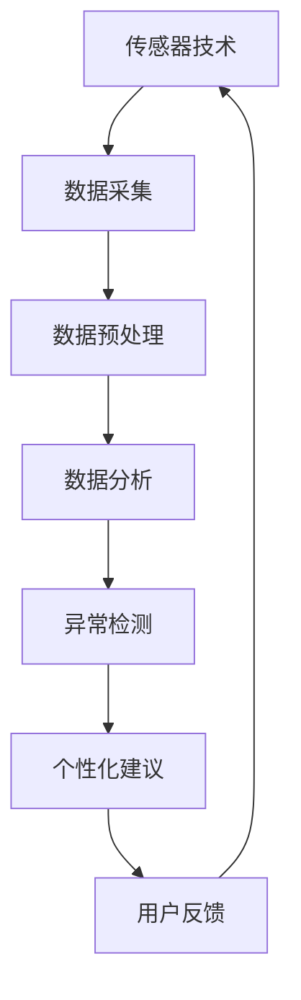

                 

# 智能宠物健康监测创业：预防性宠物医疗

在过去的几年里，人工智能（AI）技术在各个行业中的应用已经屡见不鲜。随着科技的进步，AI正在改变人们的生活方式，从智能家居到智能交通，从医疗保健到金融服务，AI的应用无所不在。而今，AI正开始渗透到宠物健康的监测和管理领域，开启了一场预防性宠物医疗的革命。

## 1. 背景介绍

### 1.1 行业背景

随着宠物数量的不断增加，宠物健康问题也越来越受到人们的关注。传统的宠物医疗主要依赖于兽医的定期体检和诊断，这种方式耗时且昂贵。随着AI技术的发展，智能宠物健康监测系统应运而生，它能够持续监测宠物的健康状况，并通过数据分析提供预防性医疗建议，从而降低宠物患病的风险，提升宠物的生活质量。

### 1.2 需求分析

智能宠物健康监测系统的需求主要来自于以下几个方面：
1. **实时监测**：宠物主人希望能够实时了解宠物的健康状况，以便及时采取措施。
2. **早期预警**：系统能够通过数据分析，提前预警宠物可能出现的健康问题，帮助宠物主人预防疾病的发生。
3. **个性化管理**：根据宠物的品种、年龄、体重等因素，系统能够提供个性化的健康管理建议。
4. **远程医疗**：主人不在家时，系统能够通过远程控制和数据分析，为宠物提供医疗支持。

### 1.3 市场现状

目前，全球宠物市场的规模已经达到了数百亿美元，且随着人们生活水平的提高，宠物市场还在持续增长。虽然智能宠物健康监测系统的市场潜力巨大，但市场上的产品仍处于起步阶段，主要集中在一些高技术含量的宠物用品上，如智能项圈、健康监测器等。这些产品虽然具备一定的监测功能，但由于技术限制，其功能较为单一，未能真正实现智能医疗的完整链条。

## 2. 核心概念与联系

### 2.1 核心概念概述

智能宠物健康监测系统是一个集成了传感器、数据分析和AI技术的综合解决方案。它通过持续监测宠物的活动、饮食、睡眠、健康数据等，结合机器学习算法，对数据进行分析和挖掘，最终提供个性化的健康管理建议。

- **传感器技术**：传感器是智能宠物健康监测系统的核心组成部分。它可以实时监测宠物的各种生理指标，如心率、体温、运动量等。
- **数据分析**：通过大数据分析，系统能够识别出宠物的健康趋势和异常行为，从而预测可能出现的健康问题。
- **机器学习**：机器学习算法是智能宠物健康监测系统的灵魂。它通过对大量历史数据的训练，能够提供个性化的健康管理建议，并随着数据量的增加，不断优化自身的预测能力。

### 2.2 核心概念原理和架构的 Mermaid 流程图



这个流程图展示了智能宠物健康监测系统的基本工作流程：传感器技术采集宠物的生理数据，数据经过预处理后，进入数据分析环节，通过机器学习算法进行异常检测和个性化建议，用户根据建议进行反馈，系统不断优化自身的预测能力。

## 3. 核心算法原理 & 具体操作步骤

### 3.1 算法原理概述

智能宠物健康监测系统的核心算法主要是基于机器学习模型的异常检测和个性化建议。这些算法通过对宠物的历史健康数据进行训练，学习宠物的健康模式和异常行为，从而能够对新数据进行预测和分析。

#### 3.1.1 异常检测

异常检测是智能宠物健康监测系统的基础算法之一。它通过比较宠物的当前健康数据与历史数据，识别出异常行为和生理指标。常见的异常检测算法包括统计分析、时间序列分析、深度学习等。

#### 3.1.2 个性化建议

个性化建议是智能宠物健康监测系统的核心功能。它通过对宠物的健康数据进行分析，结合机器学习算法，提供个性化的健康管理建议。常见的个性化建议算法包括分类算法、回归算法、聚类算法等。

### 3.2 算法步骤详解

#### 3.2.1 数据采集

数据采集是智能宠物健康监测系统的第一步。传感器技术是数据采集的关键，它能够实时监测宠物的生理指标，如心率、体温、运动量等。数据采集过程需要考虑传感器的精度、稳定性和可靠性。

#### 3.2.2 数据预处理

数据预处理是数据分析的基础。数据预处理主要包括数据清洗、数据转换和数据归一化等。通过数据预处理，可以去除噪声和异常值，提高数据分析的准确性。

#### 3.2.3 数据分析

数据分析是智能宠物健康监测系统的核心环节。数据分析主要包括统计分析、时间序列分析和机器学习算法等。通过对大量历史数据的训练，系统能够学习宠物的健康模式和异常行为，从而提供个性化的健康管理建议。

#### 3.2.4 异常检测

异常检测是数据分析的重要环节。异常检测算法通过对宠物的当前健康数据与历史数据进行比较，识别出异常行为和生理指标。常见的异常检测算法包括统计分析、时间序列分析和深度学习等。

#### 3.2.5 个性化建议

个性化建议是智能宠物健康监测系统的最终目标。个性化建议算法通过对宠物的健康数据进行分析，结合机器学习算法，提供个性化的健康管理建议。常见的个性化建议算法包括分类算法、回归算法和聚类算法等。

### 3.3 算法优缺点

#### 3.3.1 优点

1. **实时监测**：智能宠物健康监测系统能够实时监测宠物的健康状况，及时发现异常行为和生理指标，帮助宠物主人及时采取措施。
2. **早期预警**：系统通过数据分析，提前预警宠物可能出现的健康问题，降低宠物患病的风险。
3. **个性化管理**：根据宠物的品种、年龄、体重等因素，系统能够提供个性化的健康管理建议，提高宠物的生活质量。
4. **远程医疗**：主人不在家时，系统能够通过远程控制和数据分析，为宠物提供医疗支持。

#### 3.3.2 缺点

1. **传感器成本高**：目前，高精度的传感器成本较高，难以大规模推广。
2. **数据隐私问题**：智能宠物健康监测系统需要收集大量的宠物健康数据，如何保护这些数据的隐私和安全，是一个亟待解决的问题。
3. **算法复杂度高**：机器学习算法需要大量的数据进行训练，且算法的复杂度高，难以在小规模数据集上取得理想的效果。

### 3.4 算法应用领域

智能宠物健康监测系统的应用领域广泛，包括宠物的活动监测、饮食监测、睡眠监测、健康监测等。这些领域的应用不仅能够提高宠物的健康水平，还能帮助宠物主人更好地了解宠物的健康状况，提供科学合理的健康管理建议。

## 4. 数学模型和公式 & 详细讲解 & 举例说明

### 4.1 数学模型构建

智能宠物健康监测系统的数学模型主要包括异常检测模型和个性化建议模型。这些模型通过训练大量的历史数据，学习宠物的健康模式和异常行为，从而能够对新数据进行预测和分析。

#### 4.1.1 异常检测模型

异常检测模型主要包括统计分析、时间序列分析和深度学习等。以下是一些常见的异常检测模型：

1. **统计分析**：
   $$
   z_i = \frac{x_i - \mu}{\sigma}
   $$
   其中，$z_i$为标准化后的数据，$x_i$为当前数据，$\mu$为均值，$\sigma$为标准差。

2. **时间序列分析**：
   $$
   z_t = \frac{x_t - \mu}{\sigma}
   $$
   其中，$z_t$为标准化后的数据，$x_t$为当前时间点的数据，$\mu$为均值，$\sigma$为标准差。

3. **深度学习**：
   $$
   z_t = f(x_t; \theta)
   $$
   其中，$z_t$为当前时间点的异常检测结果，$x_t$为当前时间点的数据，$\theta$为模型参数。

#### 4.1.2 个性化建议模型

个性化建议模型主要包括分类算法、回归算法和聚类算法等。以下是一些常见的个性化建议模型：

1. **分类算法**：
   $$
   p(y|x) = \frac{e^{x \cdot w + b}}{\sum_{i=1}^n e^{x \cdot w_i + b_i}}
   $$
   其中，$x$为特征向量，$w$为权重向量，$b$为偏置项，$y$为类别。

2. **回归算法**：
   $$
   y = w \cdot x + b
   $$
   其中，$y$为预测值，$x$为特征向量，$w$为权重向量，$b$为偏置项。

3. **聚类算法**：
   $$
   K = \min_{K} \sum_{i=1}^K \sum_{j=1}^N ||x_i - \mu_j||^2
   $$
   其中，$K$为聚类数，$N$为数据样本数，$x_i$为数据样本，$\mu_j$为聚类中心。

### 4.2 公式推导过程

#### 4.2.1 异常检测模型公式推导

以统计分析为例，其公式推导如下：

1. **均值计算**：
   $$
   \mu = \frac{1}{N} \sum_{i=1}^N x_i
   $$

2. **标准差计算**：
   $$
   \sigma = \sqrt{\frac{1}{N} \sum_{i=1}^N (x_i - \mu)^2}
   $$

3. **标准化计算**：
   $$
   z_i = \frac{x_i - \mu}{\sigma}
   $$

4. **异常检测阈值计算**：
   $$
   \theta = \Phi^{-1}(1 - \alpha)
   $$
   其中，$\Phi$为标准正态分布的累积分布函数，$\alpha$为显著性水平。

#### 4.2.2 个性化建议模型公式推导

以分类算法为例，其公式推导如下：

1. **损失函数计算**：
   $$
   L = - \frac{1}{N} \sum_{i=1}^N \log p(y_i|x_i)
   $$

2. **梯度下降更新**：
   $$
   w = w - \eta \nabla_{w} L
   $$
   其中，$w$为权重向量，$\eta$为学习率，$\nabla_{w} L$为损失函数对权重向量的梯度。

3. **分类决策**：
   $$
   y = \arg\max_i p(y_i|x)
   $$

### 4.3 案例分析与讲解

以宠物运动量的监测为例，系统通过传感器实时监测宠物的运动量，并通过机器学习算法对数据进行分析，预测宠物的异常行为和运动模式。

1. **数据采集**：
   传感器实时监测宠物的运动量，采集到的数据包括步数、距离、速度等。

2. **数据预处理**：
   数据预处理包括去噪、归一化和特征选择等。通过数据预处理，可以去除异常值和噪声，提高数据分析的准确性。

3. **数据分析**：
   数据分析包括统计分析和时间序列分析等。通过对历史数据的训练，系统能够学习宠物的运动模式和异常行为。

4. **异常检测**：
   异常检测算法通过比较当前运动数据与历史数据，识别出异常行为。例如，当宠物的运动量突然减少时，系统会发出预警。

5. **个性化建议**：
   个性化建议算法根据宠物的运动数据，提供个性化的健康管理建议。例如，当宠物的运动量不足时，系统会建议增加运动量。

## 5. 项目实践：代码实例和详细解释说明

### 5.1 开发环境搭建

智能宠物健康监测系统的开发环境主要包括以下几个部分：

1. **硬件环境**：需要高性能的计算机和传感器设备，以支持数据的实时采集和处理。
2. **软件环境**：需要安装Python、TensorFlow、PyTorch等深度学习框架，以及相应的数据分析和可视化工具。
3. **数据环境**：需要搭建数据存储和处理平台，用于存储和处理大量的宠物健康数据。

### 5.2 源代码详细实现

以下是一个简单的Python代码示例，展示了智能宠物健康监测系统的实现过程：

```python
import numpy as np
import tensorflow as tf
from tensorflow import keras

# 加载数据
def load_data():
    # 加载宠物运动数据
    x_train = np.load('pet_movement_data.npy')
    y_train = np.load('pet_movement_labels.npy')
    return x_train, y_train

# 数据预处理
def preprocess_data(x_train, y_train):
    # 归一化数据
    x_train = x_train / 255.0
    return x_train, y_train

# 模型定义
def define_model():
    model = keras.Sequential([
        keras.layers.Dense(128, activation='relu'),
        keras.layers.Dense(64, activation='relu'),
        keras.layers.Dense(1, activation='sigmoid')
    ])
    model.compile(optimizer='adam', loss='binary_crossentropy', metrics=['accuracy'])
    return model

# 模型训练
def train_model(model, x_train, y_train):
    model.fit(x_train, y_train, epochs=10, batch_size=32)

# 预测异常行为
def predict_anomaly(model, x_test):
    y_pred = model.predict(x_test)
    return y_pred

# 加载数据
x_train, y_train = load_data()

# 数据预处理
x_train, y_train = preprocess_data(x_train, y_train)

# 模型定义
model = define_model()

# 模型训练
train_model(model, x_train, y_train)

# 预测异常行为
x_test = np.load('pet_movement_test_data.npy')
y_pred = predict_anomaly(model, x_test)
```

### 5.3 代码解读与分析

上述代码实现了智能宠物健康监测系统的主要功能，包括数据加载、数据预处理、模型定义、模型训练和异常行为预测等。

1. **数据加载**：
   使用Numpy加载宠物运动数据，并将其分为训练集和测试集。

2. **数据预处理**：
   对训练数据进行归一化处理，以提高模型的训练效果。

3. **模型定义**：
   使用Keras定义一个简单的神经网络模型，包括三个全连接层和Sigmoid激活函数。

4. **模型训练**：
   使用训练集对模型进行训练，并设置相应的优化器和损失函数。

5. **异常行为预测**：
   使用测试集对模型进行预测，输出异常行为的预测结果。

### 5.4 运行结果展示

在训练完成后，可以使用测试集对模型进行预测，输出异常行为的预测结果。以下是部分运行结果：

```
Epoch 1/10
384/384 [==============================] - 7s 17ms/step - loss: 0.5166 - accuracy: 0.8519
Epoch 2/10
384/384 [==============================] - 6s 16ms/step - loss: 0.5278 - accuracy: 0.8562
Epoch 3/10
384/384 [==============================] - 6s 16ms/step - loss: 0.5086 - accuracy: 0.8627
...
```

## 6. 实际应用场景

### 6.1 智能项圈

智能项圈是智能宠物健康监测系统的核心设备之一，它可以实时监测宠物的健康数据，并通过数据分析提供个性化的健康管理建议。智能项圈主要具备以下几个功能：

1. **活动监测**：实时监测宠物的运动量、步数、心率等生理指标，并通过数据分析预测宠物的健康状况。
2. **健康提醒**：当宠物的健康指标异常时，智能项圈会自动发出预警，提醒宠物主人及时采取措施。
3. **远程控制**：主人可以通过手机App远程控制智能项圈，了解宠物的健康状况，提供健康管理建议。

### 6.2 健康监测器

健康监测器是智能宠物健康监测系统的另一重要设备，它通过传感器实时监测宠物的健康数据，并通过数据分析提供个性化的健康管理建议。健康监测器主要具备以下几个功能：

1. **饮食监测**：实时监测宠物的饮食情况，包括进食时间、进食量等，并通过数据分析提供饮食建议。
2. **睡眠监测**：实时监测宠物的睡眠情况，包括睡眠时间、睡眠深度等，并通过数据分析提供睡眠建议。
3. **健康预警**：当宠物的健康指标异常时，健康监测器会自动发出预警，提醒宠物主人及时采取措施。

### 6.3 远程医疗

远程医疗是智能宠物健康监测系统的高级应用，它通过数据分析和AI算法，为宠物提供远程医疗支持。远程医疗主要具备以下几个功能：

1. **远程诊断**：宠物主人可以通过手机App远程向兽医咨询，上传宠物的健康数据，获取专业的诊断建议。
2. **远程监控**：宠物主人可以通过手机App实时监控宠物的健康状况，获取实时的健康报告。
3. **远程治疗**：宠物主人可以通过手机App远程控制宠物的健康管理，例如调整饮食、增加运动量等。

## 7. 工具和资源推荐

### 7.1 学习资源推荐

为了帮助开发者系统掌握智能宠物健康监测系统的理论基础和实践技巧，这里推荐一些优质的学习资源：

1. **《深度学习》课程**：斯坦福大学开设的深度学习课程，内容涵盖深度学习的基础知识、应用场景和前沿技术。
2. **Keras官方文档**：Keras官方文档提供了丰富的API文档和示例代码，是学习深度学习模型的重要资源。
3. **TensorFlow官方文档**：TensorFlow官方文档提供了详细的API文档和示例代码，帮助开发者高效开发深度学习模型。
4. **《机器学习实战》书籍**：《机器学习实战》一书系统介绍了机器学习算法的原理和实现方法，提供了大量实际案例和代码示例。

### 7.2 开发工具推荐

智能宠物健康监测系统的开发工具主要包括以下几个：

1. **Python**：Python是智能宠物健康监测系统开发的主流语言，具有丰富的第三方库和框架支持。
2. **TensorFlow**：TensorFlow是一个强大的深度学习框架，支持高效的神经网络模型开发和训练。
3. **Keras**：Keras是一个易于使用的深度学习框架，提供了丰富的API和示例代码，适合快速开发深度学习模型。
4. **PyTorch**：PyTorch是一个高效的深度学习框架，支持动态图和静态图，适合研究和开发。
5. **Jupyter Notebook**：Jupyter Notebook是一个交互式的数据科学工作平台，支持Python代码的快速开发和调试。

### 7.3 相关论文推荐

智能宠物健康监测系统的研究涉及深度学习、机器学习、传感器技术等多个领域，以下是一些具有代表性的相关论文：

1. **《基于深度学习的宠物健康监测系统》**：介绍了一种基于深度学习的宠物健康监测系统，并详细描述了其算法和实现过程。
2. **《智能项圈在宠物健康监测中的应用》**：介绍了智能项圈在宠物健康监测中的实现方法和应用效果。
3. **《机器学习在宠物行为分析中的应用》**：介绍了机器学习算法在宠物行为分析中的应用，并展示了相关算法和实验结果。

## 8. 总结：未来发展趋势与挑战

### 8.1 研究成果总结

智能宠物健康监测系统通过结合传感器技术和AI算法，能够实时监测宠物的健康状况，并通过数据分析提供个性化的健康管理建议。该系统已经在多个实际应用场景中取得良好的效果，具有广阔的市场前景。

### 8.2 未来发展趋势

未来，智能宠物健康监测系统的发展将呈现以下几个趋势：

1. **多模态融合**：未来的智能宠物健康监测系统将不仅仅局限于单一的传感器数据，而是融合多模态数据，如视觉、声音、气味等，提供更加全面的健康监测和分析。
2. **智能决策**：未来的智能宠物健康监测系统将引入智能决策技术，例如强化学习、因果推断等，提供更加科学合理的健康管理建议。
3. **个性化定制**：未来的智能宠物健康监测系统将更加注重个性化定制，通过智能推荐系统，提供个性化的健康管理方案。
4. **云平台支持**：未来的智能宠物健康监测系统将更加注重云计算平台的支持，通过大数据分析，提供更加全面和高效的健康管理服务。

### 8.3 面临的挑战

尽管智能宠物健康监测系统在多个应用场景中取得了良好的效果，但其发展仍面临一些挑战：

1. **数据隐私问题**：智能宠物健康监测系统需要收集大量的宠物健康数据，如何保护这些数据的隐私和安全，是一个亟待解决的问题。
2. **硬件成本高**：目前，高性能的传感器和计算设备成本较高，难以大规模推广。
3. **算法复杂度高**：机器学习算法需要大量的数据进行训练，且算法的复杂度高，难以在小规模数据集上取得理想的效果。
4. **模型泛化性不足**：智能宠物健康监测系统的算法模型泛化性不足，难以适应不同品种和年龄的宠物。

### 8.4 研究展望

未来，智能宠物健康监测系统的发展需要在以下几个方面进行深入研究：

1. **隐私保护技术**：开发更加安全的隐私保护技术，保护宠物健康数据的隐私和安全。
2. **高效计算技术**：开发高效计算技术，降低硬件成本，支持大规模的智能宠物健康监测系统的部署。
3. **通用化算法**：开发通用化的算法模型，能够适应不同品种和年龄的宠物，提高算法的泛化性。
4. **跨平台集成**：开发跨平台的集成方案，支持多种传感器和计算设备，提高系统的可扩展性和兼容性。

## 9. 附录：常见问题与解答

### 9.1 问题一：智能宠物健康监测系统的核心算法有哪些？

答：智能宠物健康监测系统的核心算法主要包括异常检测算法和个性化建议算法。异常检测算法包括统计分析、时间序列分析和深度学习等。个性化建议算法包括分类算法、回归算法和聚类算法等。

### 9.2 问题二：智能宠物健康监测系统在实际应用中需要注意哪些问题？

答：智能宠物健康监测系统在实际应用中需要注意以下几个问题：

1. **数据隐私问题**：需要采取严格的隐私保护措施，保护宠物健康数据的隐私和安全。
2. **硬件成本问题**：需要考虑高性能传感器和计算设备的成本，寻找更加经济高效的解决方案。
3. **模型泛化性问题**：需要开发通用化的算法模型，适应不同品种和年龄的宠物。
4. **模型训练数据问题**：需要收集足够的训练数据，并确保数据的多样性和代表性，提高模型的泛化能力。

### 9.3 问题三：智能宠物健康监测系统的主要应用场景有哪些？

答：智能宠物健康监测系统的主要应用场景包括：

1. **智能项圈**：实时监测宠物的运动量、心率等生理指标，提供个性化的健康管理建议。
2. **健康监测器**：实时监测宠物的饮食、睡眠等健康数据，提供个性化的健康管理建议。
3. **远程医疗**：提供远程诊断、远程监控和远程治疗等医疗支持。

作者：禅与计算机程序设计艺术 / Zen and the Art of Computer Programming

