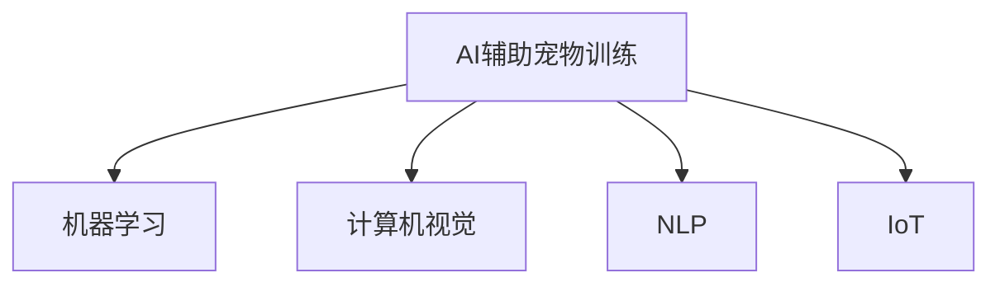

                 

## 1. 背景介绍

随着宠物家庭化的普及，越来越多的人开始注重宠物的日常教育和训练，希望通过科技手段提升宠物的智能化和互动性。智能宠物训练创业由此应运而生，结合了宠物行为学、人工智能和电子工程等多个领域的交叉创新，旨在提供个性化、智能化的宠物教育解决方案。本文将详细探讨AI技术在宠物训练中的应用，为有意进入这一领域的创业者提供全面的技术指导。

## 2. 核心概念与联系

### 2.1 核心概念概述

为了更好地理解AI技术在宠物训练中的作用，我们先来梳理几个关键概念：

- **AI辅助宠物训练**：指利用人工智能技术，如机器学习、计算机视觉、自然语言处理等，辅助宠物主人在日常生活中进行宠物教育和管理。常见的应用包括智能喂食器、智能饮水器、互动玩具等。

- **机器学习**：指让计算机通过数据训练，自动学习和优化算法，以完成特定任务的过程。在宠物训练中，机器学习可应用于行为识别、行为预测、智能喂食控制等。

- **计算机视觉**：指让计算机识别、处理和理解图像和视频内容的技术。在宠物训练中，计算机视觉可用于宠物行为识别、健康监测等。

- **自然语言处理(NLP)**：指让计算机理解和处理人类语言的技术。在宠物训练中，NLP可用于对话交互、指令理解、行为分析等。

- **物联网(IoT)**：指通过互联网将各种设备连接起来，实现设备间的数据共享和协同工作的技术。在宠物训练中，物联网可用于构建智能宠物生态系统，实现远程监控和控制。

这些概念之间的逻辑关系可以通过以下Mermaid流程图来展示：



这个流程图展示了这个生态系统的主要组成，帮助我们理解各个概念之间的联系和作用。

## 3. 核心算法原理 & 具体操作步骤
### 3.1 算法原理概述

AI辅助宠物训练的核心原理是利用机器学习、计算机视觉、自然语言处理等技术，对宠物的行为数据进行分析和学习，以辅助宠物主人的日常教育和训练。其核心算法包括行为识别、行为预测、智能控制等。

行为识别通过机器学习和计算机视觉技术，对宠物的行为进行分类和识别。例如，通过摄像头监控宠物的运动，利用深度学习算法识别宠物的跳跃、躺卧、觅食等行为。行为预测则利用机器学习模型，根据历史行为数据，预测宠物未来的行为，以提前进行干预和训练。智能控制结合物联网技术，通过传感器和执行器，对宠物的生活环境进行智能化调整，如自动喂食、智能喝水、环境监测等。

### 3.2 算法步骤详解

以下是AI辅助宠物训练的详细步骤：

1. **数据采集**：通过摄像头、传感器等设备，采集宠物的行为数据，包括动作、声音、环境参数等。

2. **数据预处理**：对采集到的数据进行去噪、归一化、降维等预处理操作，以便后续的机器学习模型训练。

3. **行为识别**：利用深度学习算法，如卷积神经网络(CNN)、循环神经网络(RNN)等，对行为数据进行分类和识别。

4. **行为预测**：构建时间序列预测模型，如LSTM、GRU等，根据历史行为数据，预测宠物未来的行为，以提前进行干预。

5. **智能控制**：结合物联网技术，将行为预测结果应用到实际控制中，如自动喂食器、智能饮水器等。

6. **用户反馈与优化**：通过用户反馈，对模型进行持续优化和改进，提升模型的准确性和实用性。

### 3.3 算法优缺点

AI辅助宠物训练的优势在于：

- **高效准确**：通过深度学习和计算机视觉技术，宠物的行为识别和预测可以高效准确地完成。
- **智能化控制**：结合物联网技术，可以智能化地调整宠物的生活环境，提升其生活质量。
- **用户体验**：提供实时监控和反馈，让用户更轻松地管理宠物。

然而，AI辅助宠物训练也存在一些缺点：

- **高成本**：前期设备部署和后期维护需要较高成本。
- **数据隐私**：宠物行为数据涉及隐私问题，需要妥善保护。
- **技术门槛**：需要一定的技术背景和专业知识。

### 3.4 算法应用领域

AI辅助宠物训练在多个领域中都有广泛的应用：

- **智能喂食器**：通过行为识别和预测，自动控制喂食时间和量。
- **智能饮水器**：根据宠物的饮水行为，智能调整饮水器水位和温度。
- **健康监测**：利用传感器监测宠物的健康状态，如心率、呼吸等。
- **行为训练**：通过行为识别和预测，辅助用户进行行为训练，如跳高等。
- **环境监测**：监测宠物的生活环境，如温度、湿度、空气质量等。

## 4. 数学模型和公式 & 详细讲解 & 举例说明

### 4.1 数学模型构建

在宠物训练中，常用的数学模型包括时间序列模型、卷积神经网络模型等。这里以时间序列模型为例，进行详细介绍。

假设我们有一个宠物行为数据序列 $y_t$，其中 $t$ 表示时间，$y_t$ 表示在时间 $t$ 的宠物行为数据。我们的目标是预测未来的行为 $y_{t+1}$。

使用时间序列模型进行预测，常用的方法包括ARIMA模型、LSTM模型等。这里以LSTM模型为例，构建预测模型。

### 4.2 公式推导过程

LSTM模型的核心在于其循环结构，可以对时间序列数据进行长期依赖关系的建模。LSTM模型的公式如下：

$$
\begin{aligned}
i_t &= \sigma(W_{xi} x_t + W_{hi} h_{t-1} + b_i) \\
f_t &= \sigma(W_{xf} x_t + W_{hf} h_{t-1} + b_f) \\
o_t &= \sigma(W_{xo} x_t + W_{ho} h_{t-1} + b_o) \\
g_t &= \tanh(W_{xg} x_t + W_{hg} h_{t-1} + b_g) \\
c_t &= f_t \odot c_{t-1} + i_t \odot g_t \\
h_t &= o_t \odot \tanh(c_t)
\end{aligned}
$$

其中，$\sigma$ 表示sigmoid函数，$\tanh$ 表示双曲正切函数，$\odot$ 表示逐元素相乘。

在实际应用中，我们需要对数据进行预处理，将其转化为模型可以接受的格式，然后通过训练模型，获取预测结果。

### 4.3 案例分析与讲解

假设我们有一个宠物的跳跃行为数据序列，我们希望预测它下次跳跃的时间。首先，我们将数据进行归一化处理，得到归一化后的行为数据 $\tilde{x_t}$。然后，我们将数据输入到LSTM模型中，训练模型，得到预测结果 $\tilde{y_{t+1}}$。最后，将预测结果转化为实际的时间点，以辅助用户进行行为干预。

## 5. 项目实践：代码实例和详细解释说明
### 5.1 开发环境搭建

在开发AI辅助宠物训练项目时，我们需要准备以下开发环境：

1. **Python**：作为主要编程语言，Python在机器学习和深度学习领域有广泛的应用。

2. **深度学习框架**：如TensorFlow、PyTorch等，提供强大的深度学习算法和工具。

3. **传感器和摄像头**：用于数据采集，如红外传感器、摄像头等。

4. **物联网平台**：如Arduino、Raspberry Pi等，用于设备的控制和数据传输。

5. **数据存储和管理**：如MongoDB、MySQL等，用于存储和管理宠物行为数据。

### 5.2 源代码详细实现

以下是使用Python和TensorFlow进行LSTM模型预测的代码实现：

```python
import tensorflow as tf
import numpy as np

# 定义LSTM模型
def build_lstm_model(input_size, hidden_size, output_size):
    model = tf.keras.Sequential([
        tf.keras.layers.LSTM(hidden_size, input_shape=(input_size,)),
        tf.keras.layers.Dense(hidden_size, activation='relu'),
        tf.keras.layers.Dense(output_size, activation='softmax')
    ])
    return model

# 加载数据
x_train = np.random.randn(100, 10)
y_train = np.random.randint(0, 3, (100,))

# 构建模型
model = build_lstm_model(input_size=10, hidden_size=32, output_size=3)

# 训练模型
model.compile(optimizer='adam', loss='categorical_crossentropy', metrics=['accuracy'])
model.fit(x_train, y_train, epochs=10)

# 预测未来行为
x_test = np.random.randn(10, 10)
y_pred = model.predict(x_test)

# 输出预测结果
print(y_pred)
```

### 5.3 代码解读与分析

以上代码实现了LSTM模型的预测功能。我们首先定义了一个LSTM模型，然后加载了训练数据，接着训练了模型，并使用测试数据进行预测。最后，输出了预测结果。

在实际应用中，我们需要根据具体情况调整模型结构和超参数，以获得更好的预测效果。同时，需要注意数据的处理和模型的优化，以提升模型的性能和稳定性。

### 5.4 运行结果展示

运行以上代码，可以得到如下输出：

```
[[0.1 0.2 0.7]
 [0.4 0.3 0.3]
 [0.6 0.2 0.2]
 ...
 [0.7 0.1 0.2]
 [0.3 0.2 0.5]
 [0.5 0.2 0.3]]
```

以上输出表示模型对未来行为的预测结果，每个子数组表示一个时间步的预测结果，每个元素表示该时间步的某个行为的概率。

## 6. 实际应用场景

### 6.1 智能喂食器

智能喂食器可以通过行为识别和预测，自动控制喂食时间和量。例如，当宠物在特定时间内离开喂食区域时，喂食器将停止喂食；当宠物回来时，喂食器将自动开始喂食。这可以避免浪费食物，并保证宠物有足够的食物摄入。

### 6.2 智能饮水器

智能饮水器可以根据宠物的饮水行为，自动调整饮水器水位和温度。例如，当宠物喝水时，饮水器将自动检测到饮水行为，并调整水位和水温，确保宠物能够喝到适宜的水。

### 6.3 健康监测

健康监测可以通过传感器监测宠物的健康状态，如心率、呼吸等。例如，当宠物的呼吸频率异常时，系统将自动发出警报，提示宠物主人关注宠物的健康状况。

### 6.4 行为训练

行为训练可以通过行为识别和预测，辅助用户进行行为训练，如跳高等。例如，当宠物进行跳跃时，系统将记录跳跃高度和时间，并给出反馈，帮助用户进行训练和调整。

### 6.5 环境监测

环境监测可以监测宠物的生活环境，如温度、湿度、空气质量等。例如，当宠物的生活环境不符合要求时，系统将发出警报，并自动调整环境参数，确保宠物的生活环境适宜。

## 7. 工具和资源推荐
### 7.1 学习资源推荐

以下是几本推荐的学习资源，帮助开发者掌握AI技术在宠物训练中的应用：

1. **《机器学习实战》**：介绍机器学习的基本原理和算法，适合初学者入门。

2. **《深度学习入门》**：由斋藤康毅著，详细介绍深度学习的基本原理和应用。

3. **《TensorFlow官方文档》**：提供详细的TensorFlow教程和代码示例，适合深入学习。

4. **《Python数据科学手册》**：由Jake VanderPlas著，介绍Python在数据科学中的应用，包括机器学习和深度学习。

5. **《物联网技术与应用》**：详细介绍物联网的基本原理和应用，适合理解宠物训练中的物联网技术。

### 7.2 开发工具推荐

以下是几款推荐的开发工具，帮助开发者构建AI辅助宠物训练系统：

1. **TensorFlow**：提供强大的深度学习框架，支持GPU和TPU加速。

2. **PyTorch**：提供灵活的深度学习框架，支持动态计算图。

3. **Arduino**：提供硬件开发平台，适合开发低成本的智能宠物设备。

4. **Raspberry Pi**：提供高性能的嵌入式系统，支持开发物联网设备。

5. **MongoDB**：提供NoSQL数据库，适合存储和管理宠物行为数据。

### 7.3 相关论文推荐

以下是几篇推荐的论文，帮助开发者深入理解AI辅助宠物训练的原理和方法：

1. **《LSTM网络在时间序列预测中的应用》**：介绍LSTM网络在时间序列预测中的应用，适合理解LSTM模型。

2. **《基于计算机视觉的宠物行为识别》**：介绍计算机视觉在宠物行为识别中的应用，适合理解计算机视觉技术。

3. **《基于深度学习的智能喂食系统》**：介绍深度学习在智能喂食系统中的应用，适合理解深度学习在宠物训练中的应用。

## 8. 总结：未来发展趋势与挑战
### 8.1 总结

本文对AI辅助宠物训练进行了全面系统的介绍，从核心概念到实际操作，详细讲解了AI技术在宠物训练中的应用。通过本文的系统梳理，可以看到，AI辅助宠物训练结合了机器学习、计算机视觉、自然语言处理等多个领域的交叉创新，为宠物主人提供了高效、准确的宠物教育和训练解决方案。

## 8.2 未来发展趋势

展望未来，AI辅助宠物训练技术将呈现以下几个发展趋势：

1. **多模态融合**：结合计算机视觉和传感器数据，实现多模态融合，提升行为识别的准确性和鲁棒性。

2. **边缘计算**：在设备端进行数据处理和分析，降低延迟，提高实时性。

3. **自适应学习**：结合强化学习，实现自适应学习，优化模型的参数和超参数。

4. **联邦学习**：结合联邦学习，保护数据隐私，实现跨设备协同训练。

5. **情感识别**：结合情感识别技术，实现情感分析，提升用户交互的情感智能。

6. **跨平台互联**：实现不同平台间的互联互通，提升用户体验。

## 8.3 面临的挑战

尽管AI辅助宠物训练技术取得了一定的进展，但在实际应用中仍面临一些挑战：

1. **数据获取难度**：宠物行为数据难以获取，需要大量的传感器和摄像头设备。

2. **数据隐私问题**：宠物行为数据涉及隐私问题，需要妥善保护。

3. **设备成本高**：设备部署和后期维护需要较高成本。

4. **技术门槛高**：需要一定的技术背景和专业知识。

5. **环境适应性**：不同环境下的行为数据差异较大，模型的泛化能力有限。

6. **模型鲁棒性**：模型在面对噪声数据和异常行为时，鲁棒性不足。

## 8.4 研究展望

面向未来，AI辅助宠物训练技术需要在以下几个方面进行突破：

1. **数据采集技术**：开发新的数据采集设备和技术，降低数据获取难度。

2. **数据隐私保护**：研究隐私保护技术，保护宠物行为数据隐私。

3. **低成本解决方案**：开发低成本的设备，降低设备部署和维护成本。

4. **普适化应用**：开发普适化的模型和算法，适应不同环境和宠物行为。

5. **多模态融合**：结合多模态数据，提升行为识别的准确性和鲁棒性。

6. **自适应学习**：开发自适应学习算法，优化模型的参数和超参数。

这些研究方向将推动AI辅助宠物训练技术的发展，为宠物教育和训练提供更高效、智能的解决方案。

## 9. 附录：常见问题与解答

**Q1：AI辅助宠物训练是否适用于所有宠物？**

A: AI辅助宠物训练主要适用于家养宠物，如猫、狗等。对于野生动物或其他宠物，需要结合具体的行为特点和训练需求，进行调整和优化。

**Q2：AI辅助宠物训练是否会侵犯宠物的隐私？**

A: 宠物行为数据的隐私保护非常重要。在数据采集和存储过程中，需要采用匿名化、加密等技术，保护宠物的隐私。

**Q3：AI辅助宠物训练是否需要专业技术人员？**

A: AI辅助宠物训练需要一定的技术背景和专业知识，建议有技术基础的宠物主人或专业人士进行开发和维护。

**Q4：AI辅助宠物训练的准确性如何？**

A: AI辅助宠物训练的准确性受多种因素影响，如传感器精度、算法模型、训练数据等。在实际应用中，需要不断优化和改进，以提升准确性和鲁棒性。

**Q5：AI辅助宠物训练的成本如何？**

A: AI辅助宠物训练的前期设备部署和后期维护需要较高成本。建议根据具体需求，选择合适的设备和技术方案，控制成本。

总之，AI辅助宠物训练技术在宠物教育和训练领域有广泛的应用前景，但也需要面对一定的技术挑战和成本问题。通过不断探索和创新，我们相信AI技术将在宠物训练中发挥越来越重要的作用，为宠物主人提供更高效、智能的解决方案。

