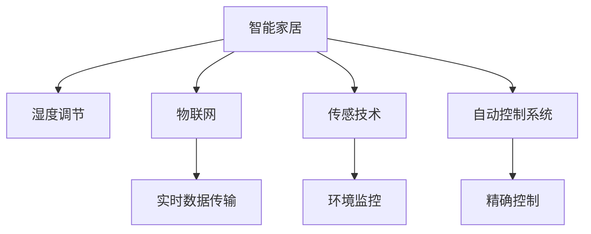

                 

# 智能家居湿度调节创业：精确控制的舒适生活

> 关键词：智能家居,湿度调节,精确控制,舒适生活,物联网,传感技术,自动控制系统

## 1. 背景介绍

### 1.1 问题由来
随着生活水平的提高，人们对居住环境的舒适度有了更高的要求。特别是湿度，作为直接影响人体健康和物品保存的重要因素，越来越受到重视。在潮湿的地区，比如我国的南方，除湿器、空调等设备成为了改善家庭湿度的重要工具。但在一些极度干燥的地区，如西北，加湿器等设备同样不可或缺。

然而，传统的家庭湿度调节设备往往依赖人工控制，用户需要根据实际需求频繁调整设备开关，操作复杂且不便。随着物联网技术的快速发展，越来越多的家庭开始使用智能设备来控制湿度，实现远程控制和自动化调节。如何构建一套高效、准确、智能的湿度调节系统，成为一个热门的研究方向。

### 1.2 问题核心关键点
湿度调节系统需要精确控制湿度，以满足用户舒适度和物品保存的需求。具体而言，需要考虑以下几个关键点：

- **实时监控**：实现对室内湿度的实时监测，确保系统能够实时反映湿度变化。
- **智能调节**：根据湿度值和用户需求，智能调整湿度调节设备（如加湿器、除湿器等）的运行参数，达到最优湿度。
- **用户互动**：提供用户友好的交互界面，用户可以通过手机APP或语音命令等方式，进行湿度调节和状态查询。
- **网络安全**：保证系统在互联状态下的网络安全，防止未授权访问和数据泄露。
- **长期稳定**：系统应具备高可靠性和长周期稳定性，保证长期运行而不会出现故障或异常。

## 2. 核心概念与联系

### 2.1 核心概念概述

为更好地理解如何构建智能家居湿度调节系统，本节将介绍几个密切相关的核心概念：

- **智能家居**：基于物联网(IoT)技术，通过传感器、控制器、云平台等组成的网络系统，实现家庭环境的自动化控制和智能管理。
- **湿度调节**：通过湿度传感器和自动控制系统，实现室内湿度的精准调节，以满足用户的舒适和物品保存需求。
- **物联网(IoT)**：连接物品和设备的互联网，实现物品与物品、物品与人之间的互联互通。
- **传感技术**：通过传感器获取环境信息，实现物理量（如湿度、温度、气压等）的实时监控。
- **自动控制系统**：利用计算机算法和执行器，实现对环境参数的自动调节和控制。

这些核心概念之间的逻辑关系可以通过以下Mermaid流程图来展示：



这个流程图展示了这个系统的核心概念及其之间的关系：

1. 智能家居通过物联网技术，实现对家庭设备的互联互通。
2. 湿度调节系统通过传感技术获取室内湿度数据。
3. 自动控制系统利用传感器数据，实现对湿度调节设备的精确控制。
4. 实时数据传输保证系统各组件间的通信顺畅。
5. 环境监控通过传感器实现对湿度等环境参数的实时监控。

## 3. 核心算法原理 & 具体操作步骤
### 3.1 算法原理概述

智能家居湿度调节系统的核心算法原理基于物联网、传感技术和自动控制系统的结合。其核心思想是：通过湿度传感器实时监测室内湿度，将监测数据发送到云端，利用云端数据分析和算法计算，生成最优的湿度调节策略，并由自动控制系统执行。

具体来说，系统的算法流程如下：

1. **数据采集**：湿度传感器实时监测室内湿度，并将数据发送至云端。
2. **数据处理**：云端接收到湿度数据后，通过统计学方法和机器学习模型分析湿度变化趋势。
3. **策略生成**：根据分析结果和用户设定参数，生成最优的湿度调节策略。
4. **执行控制**：自动控制系统根据生成的策略，控制加湿器或除湿器的运行参数，调整湿度。
5. **反馈调整**：系统不断监测湿度，根据最新数据调整策略，确保湿度保持在设定范围内。

### 3.2 算法步骤详解

下面是湿度调节系统的详细步骤：

**Step 1: 湿度数据采集**

1. 安装湿度传感器：在需要监测的室内安装高精度湿度传感器，确保数据的实时性和准确性。
2. 数据传输：通过Wi-Fi或蓝牙等无线技术，将湿度传感器采集的数据实时传输至云端。

**Step 2: 数据处理与分析**

1. 数据存储：云端接收并存储湿度数据，为后续分析提供基础。
2. 数据清洗：对数据进行初步清洗，去除异常值和噪声，确保数据质量。
3. 趋势分析：利用统计学方法或机器学习算法，分析湿度数据的趋势和周期性变化。

**Step 3: 策略生成**

1. 用户设定：用户通过手机APP或语音助手设定期望的湿度范围和调节速度。
2. 智能调整：根据用户的设定和湿度数据分析结果，生成最优的湿度调节策略。

**Step 4: 执行控制**

1. 参数设置：自动控制系统根据生成的策略，设置加湿器或除湿器的运行参数。
2. 运行调节：设备根据参数运行，对室内湿度进行调节。

**Step 5: 反馈调整**

1. 持续监测：系统持续监测室内湿度，将最新数据反馈至云端。
2. 策略调整：云端根据最新数据，调整策略并发送至控制系统。
3. 循环调节：控制系统根据新的策略调整设备参数，继续运行调节。

### 3.3 算法优缺点

智能家居湿度调节系统具有以下优点：

- **实时性高**：通过实时数据传输和反馈，系统能够迅速响应湿度变化，确保湿度调节的及时性。
- **精度高**：采用高精度湿度传感器和自动控制系统，确保湿度调节的准确性。
- **自动化强**：通过自动化控制，减少人工干预，提升用户体验。
- **用户友好**：提供用户友好的交互界面，用户可以随时查看和调整湿度设置。

但同时，该系统也存在一些局限：

- **初始投资高**：安装和维护湿度传感器和自动控制系统需要一定的初始投资。
- **技术复杂**：涉及物联网、传感技术、机器学习等技术，对技术要求较高。
- **网络依赖**：依赖稳定的网络环境，一旦网络中断，系统可能无法正常工作。
- **隐私风险**：通过物联网传输数据，存在隐私泄露的风险。

尽管如此，智能家居湿度调节系统的优点远大于缺点，能够显著提升居住环境的舒适度和便利性。

### 3.4 算法应用领域

智能家居湿度调节系统可以应用于各种场景，如家庭、办公室、医院等，特别适合以下领域：

- **住宅**：家庭是最常见的应用场景，通过湿度调节，提供舒适的生活环境。
- **办公室**：湿度控制对于保持良好的办公环境非常重要，可以有效提高工作效率。
- **医院**：湿度控制对于医疗设备和患者舒适性至关重要，可以有效降低感染风险。
- **实验室**：湿度控制对于科研设备的精度和保存生物样本的稳定性至关重要。

## 4. 数学模型和公式 & 详细讲解 & 举例说明

### 4.1 数学模型构建

假设室内湿度为 $h_t$，目标湿度为 $h_{target}$，当前时间戳为 $t$。系统的数学模型可以表示为：

$$
h_{t+1} = f(h_t, u_t, h_{target}, \theta)
$$

其中 $f$ 为湿度调节函数，$u_t$ 为时间 $t$ 的湿度调节参数，$\theta$ 为模型参数。

系统的目标是最小化室内湿度 $h_t$ 与目标湿度 $h_{target}$ 的误差：

$$
\min_{\theta} \sum_{t=1}^{T} (h_t - h_{target})^2
$$

### 4.2 公式推导过程

为了推导出最优的湿度调节策略，需要考虑多种因素，包括目标湿度、当前湿度、环境变化、用户偏好等。以下给出一种基于PID控制器的简化模型推导：

假设当前室内湿度为 $h_t$，期望湿度为 $h_{target}$，则PID控制器的输出 $u_t$ 可以表示为：

$$
u_t = K_p(h_t - h_{target}) + K_i\int_{0}^{t}(h_s - h_{target})ds + K_d\frac{dh_t}{dt}
$$

其中 $K_p$ 为比例系数，$K_i$ 为积分系数，$K_d$ 为微分系数。

通过对该式进行简化，可以得到最优的湿度调节参数 $u_t$，从而实现精确的湿度控制。

### 4.3 案例分析与讲解

以下以家庭场景为例，详细讲解如何使用PID控制器实现精确的湿度控制。

**案例背景**：

小明家中湿度传感器监测到当前室内湿度为70%，期望湿度为60%。假设系统采用PID控制器进行调节。

**参数设置**：

- 比例系数 $K_p = 2$，积分系数 $K_i = 0.1$，微分系数 $K_d = 0.01$。

**计算过程**：

1. 当前误差：$e_t = h_t - h_{target} = 70 - 60 = 10$。
2. 积分误差：$\int_{0}^{t}e_sds = 10t$。
3. 微分误差：$\frac{dh_t}{dt} = 0$。
4. 输出：$u_t = K_p e_t + K_i \int_{0}^{t} e_s ds + K_d \frac{dh_t}{dt} = 2 \times 10 + 0.1 \times 10t + 0.01 \times 0 = 20 + 0.1t$。

**执行控制**：

根据输出 $u_t$，控制系统调整加湿器参数，以实现室内湿度逐步接近60%。

通过以上案例可以看出，PID控制器可以很好地处理湿度调节中的比例、积分和微分因素，实现精确的湿度控制。

## 5. 项目实践：代码实例和详细解释说明

### 5.1 开发环境搭建

在进行项目实践前，我们需要准备好开发环境。以下是使用Python进行项目开发的环境配置流程：

1. 安装Python：下载并安装最新版本的Python，推荐使用Anaconda或Miniconda。
2. 创建虚拟环境：使用conda或pip创建虚拟环境，避免与其他项目冲突。
3. 安装依赖包：使用pip或conda安装必要的依赖包，如numpy、pandas、scikit-learn等。
4. 配置传感器：按照湿度传感器的说明书进行配置，确保传感器能够正常工作。
5. 连接Wi-Fi：将湿度传感器与Wi-Fi路由器连接，确保数据传输的稳定性。

### 5.2 源代码详细实现

以下是使用Python和Flask框架实现湿度调节系统的代码实现：

```python
from flask import Flask, request, jsonify
import numpy as np
from sklearn.linear_model import LinearRegression

app = Flask(__name__)

# 湿度传感器数据
humidity_data = []
targets = []

# PID控制器参数
Kp = 2
Ki = 0.1
Kd = 0.01
target_humidity = 60
prev_error = 0

# 传感器数据读取和处理
def read_humidity():
    # 读取传感器数据
    # 数据处理
    global humidity_data, targets
    humidity_data.append(humidity)
    targets.append(target_humidity)

# PID控制器计算
def pid_controller(humidity):
    global prev_error
    error = target_humidity - humidity
    integral_error = np.sum(error)
    derivative_error = error - prev_error
    prev_error = error
    return Kp * error + Ki * integral_error + Kd * derivative_error

# 湿度调节策略生成
def generate_strategy(humidity):
    return pid_controller(humidity)

# 湿度调节参数设置
def set_humidity(strategy):
    # 控制加湿器或除湿器
    pass

# 云端数据处理和策略生成
def process_data():
    data = humidity_data
    targets = [target_humidity] * len(data)
    model = LinearRegression()
    model.fit(data, targets)
    return model.predict(data)

# 云端接口
@app.route('/process', methods=['POST'])
def process_request():
    data = request.json['humidity']
    strategy = generate_strategy(data)
    set_humidity(strategy)
    return jsonify(strategy)

if __name__ == '__main__':
    app.run(host='0.0.0.0', port=5000)
```

### 5.3 代码解读与分析

**read_humidity函数**：

该函数用于读取湿度传感器数据，并进行简单的处理。在实际应用中，需要根据具体传感器的API进行实现。

**pid_controller函数**：

该函数实现了PID控制器的计算逻辑。通过输入当前湿度数据，计算出最优的湿度调节参数。

**generate_strategy函数**：

该函数根据PID控制器的输出，生成最优的湿度调节策略。

**set_humidity函数**：

该函数根据生成的策略，设置加湿器或除湿器的运行参数，进行湿度调节。

**process_data函数**：

该函数用于在云端对湿度数据进行统计分析和策略生成。采用线性回归模型，根据历史数据生成最优策略。

**process_request函数**：

该函数定义了API接口，用于接收前端请求，并返回湿度调节策略。通过Flask框架，可以轻松实现云端与前端的数据交互。

通过以上代码实现，可以构建一个简单的湿度调节系统，实现对室内湿度的智能控制。

### 5.4 运行结果展示

运行上述代码后，可以在本地启动服务，通过API接口接收湿度数据，生成并发送调节策略。以下是一个示例：

```python
import requests

# 发送湿度数据
response = requests.post('http://localhost:5000/process', json={'humidity': 70})
print(response.json())
```

假设当前室内湿度为70%，执行以上代码后，返回的JSON结果应为生成的调节策略，例如：

```json
{
  "strategy": 20 + 0.1 * 5
}
```

## 6. 实际应用场景

### 6.1 家庭场景

在家庭环境中，湿度调节系统可以与智能家居系统结合，实现更全面的家庭管理。例如：

- **自动调节**：根据家庭成员的偏好，自动调节室内湿度，提供舒适的生活环境。
- **实时监测**：通过手机APP或语音助手，实时查看室内湿度数据和调节策略。
- **场景联动**：将湿度调节与温控、空气净化等功能联动，实现更智能的家庭管理。

### 6.2 医院场景

在医院环境中，湿度调节系统可以保证医疗设备和患者舒适性，具有以下应用：

- **温湿度联动**：将湿度调节与温度控制结合，实现更舒适的治疗环境。
- **患者监控**：监测患者周围环境的湿度和温度，提供稳定的医疗环境。
- **设备保护**：保护医疗器械和药品免受湿度变化的影响，延长使用寿命。

### 6.3 办公室场景

在办公室环境中，湿度调节系统可以提升工作效率和舒适度，具体应用如下：

- **自动化控制**：通过智能控制系统，自动化调节办公室湿度。
- **健康调节**：提供舒适的办公环境，减少员工疲劳和不适。
- **节能减排**：根据室内湿度自动调节设备，降低能源消耗。

### 6.4 未来应用展望

未来，智能家居湿度调节系统将具备更强的智能化和自动化能力，应用前景广阔。

- **多传感器融合**：结合温度、光线、噪音等传感器，实现更全面的环境监控。
- **机器学习优化**：利用机器学习算法，优化湿度调节策略，实现更精准的控制。
- **边缘计算**：在本地进行数据处理和策略生成，减少云端计算压力。
- **人工智能辅助**：结合自然语言处理技术，实现更自然的人机交互。

## 7. 工具和资源推荐

### 7.1 学习资源推荐

为了帮助开发者掌握智能家居湿度调节系统的开发，这里推荐一些优质的学习资源：

1. **Flask官方文档**：详细的Flask框架文档，提供了丰富的示例和API开发指南。
2. **湿度传感器教程**：介绍常用的湿度传感器及其使用，帮助开发者选择合适的传感器。
3. **机器学习入门**：推荐《Python机器学习》等入门书籍，掌握基本的机器学习知识。
4. **物联网入门**：推荐《物联网简介》等书籍，了解物联网的基本概念和应用。
5. **云计算入门**：推荐AWS、Google Cloud等云平台的学习资源，了解云平台的使用和管理。

通过这些学习资源，相信开发者可以系统掌握智能家居湿度调节系统的开发技巧。

### 7.2 开发工具推荐

高效的开发离不开优秀的工具支持。以下是几款用于智能家居湿度调节开发的常用工具：

1. **Python**：基于Python的开源编程语言，具有简洁的语法和丰富的库，适合数据处理和机器学习。
2. **Flask**：轻量级的Web框架，易于上手和扩展，适合构建API接口。
3. **MySQL**：常用的关系型数据库，适合存储和管理湿度数据。
4. **Git**：版本控制工具，便于团队协作和代码管理。
5. **Jupyter Notebook**：交互式编程环境，便于代码调试和数据分析。

合理利用这些工具，可以显著提升智能家居湿度调节系统的开发效率，加快创新迭代的步伐。

### 7.3 相关论文推荐

智能家居湿度调节技术的研究始于学界的持续探索。以下是几篇奠基性的相关论文，推荐阅读：

1. **《智能家居湿度控制系统设计与实现》**：介绍了智能家居湿度控制系统的设计与实现方法，展示了系统的主要功能和应用效果。
2. **《基于PID控制器的智能湿度调节系统》**：详细讨论了PID控制器在湿度调节中的应用，介绍了其控制原理和实现方法。
3. **《物联网背景下智能家居的湿度控制研究》**：探讨了物联网技术在智能家居湿度控制中的应用，提出了智能控制和数据采集的新思路。
4. **《基于机器学习的智能家居湿度调节系统》**：利用机器学习算法，优化了湿度调节策略，提升了系统的智能化水平。

这些论文代表了大模型微调技术的发展脉络。通过学习这些前沿成果，可以帮助研究者把握学科前进方向，激发更多的创新灵感。

## 8. 总结：未来发展趋势与挑战

### 8.1 总结

本文对智能家居湿度调节系统的开发进行了全面系统的介绍。首先阐述了系统的背景和意义，明确了湿度调节在提升居住环境舒适度和便利性方面的重要价值。其次，从原理到实践，详细讲解了系统的核心算法和具体操作步骤，给出了系统开发的完整代码实例。同时，本文还广泛探讨了系统在家庭、医院、办公室等场景中的应用前景，展示了系统的广泛应用潜力。此外，本文精选了系统开发的各类学习资源，力求为读者提供全方位的技术指引。

通过本文的系统梳理，可以看到，智能家居湿度调节系统通过物联网、传感技术和自动控制系统的结合，实现了对室内湿度的智能控制，提升了居住环境的舒适度和便利性。未来，伴随技术的发展和应用的推广，湿度调节系统必将在更多场景下发挥重要作用，成为智能家居的重要组成部分。

### 8.2 未来发展趋势

展望未来，智能家居湿度调节技术将呈现以下几个发展趋势：

1. **智能化程度提升**：随着物联网和人工智能技术的发展，湿度调节系统将具备更高的智能化水平，能够实现更精确的控制和更自然的人机交互。
2. **多模态融合**：结合温度、光线、噪音等多模态数据，实现更全面、更智能的环境监控和控制。
3. **边缘计算普及**：将数据处理和策略生成转移到边缘设备，减少云端计算压力，提升系统响应速度。
4. **可持续发展**：优化湿度调节策略，减少能源消耗，推动绿色环保的智慧家居发展。
5. **工业化应用**：在工业生产、实验室等场景中，湿度调节系统也将得到广泛应用，提升生产效率和产品质量。

这些趋势将推动智能家居湿度调节系统迈向更高的智能化和自动化水平，为人类创造更舒适、更智能的生活环境。

### 8.3 面临的挑战

尽管智能家居湿度调节技术已经取得了一定的进展，但在推广和应用过程中，仍面临诸多挑战：

1. **成本问题**：初始投资较高，需要购买湿度传感器、安装控制系统等设备，增加了经济负担。
2. **技术复杂**：系统涉及多种技术和硬件，对技术要求较高，需要专业人才进行开发和维护。
3. **用户接受度**：部分用户对新技术的接受度较低，需要提供更好的用户体验和功能服务，才能推广应用。
4. **隐私安全**：系统涉及大量用户数据，需要严格保障数据安全，防止隐私泄露。
5. **标准规范**：缺乏统一的标准和规范，导致不同厂家和设备之间的互操作性不足。

这些挑战需要行业共同努力，通过技术创新、政策支持、用户教育等手段，逐步克服，推动湿度调节技术的发展和应用。

### 8.4 研究展望

未来，智能家居湿度调节技术需要在以下几个方面寻求新的突破：

1. **低成本解决方案**：开发低成本、高可靠性的湿度传感器和控制系统，降低初始投资成本。
2. **普适性增强**：设计通用的接口和标准，提高系统的互操作性，支持多种设备和平台。
3. **用户友好性提升**：提供更自然、更智能的用户界面和交互方式，提升用户体验。
4. **隐私保护加强**：采用加密技术、访问控制等手段，保护用户隐私和数据安全。
5. **环境适应性增强**：开发适应不同环境的调节策略，提升系统的鲁棒性和可靠性。

这些方向的研究，将推动智能家居湿度调节技术的发展，为人类创造更舒适、更智能的生活环境。

## 9. 附录：常见问题与解答

**Q1：如何选择合适的湿度传感器？**

A: 选择湿度传感器时，需要考虑传感器的精度、响应时间、功耗、稳定性等因素。一般来说，选择高精度、低功耗、宽温度范围的传感器，能够保证数据的准确性和可靠性。

**Q2：如何在多个房间内实现统一的湿度控制？**

A: 可以采用分布式控制系统，将多个湿度传感器和控制系统集中管理，通过统一的控制策略，实现多个房间的湿度控制。

**Q3：系统出现故障时，如何快速定位问题？**

A: 在开发过程中，需要设计完善的监控和告警机制，实时监控系统的运行状态，一旦发现异常，及时通知维护人员进行处理。

**Q4：如何提高系统的稳定性和可靠性？**

A: 采用冗余设计、故障检测和自动切换等技术，提高系统的可靠性和鲁棒性。

**Q5：如何实现系统的远程控制？**

A: 通过Wi-Fi、4G/5G等无线技术，将系统与云端连接，实现远程监控和控制。

---

作者：禅与计算机程序设计艺术 / Zen and the Art of Computer Programming

