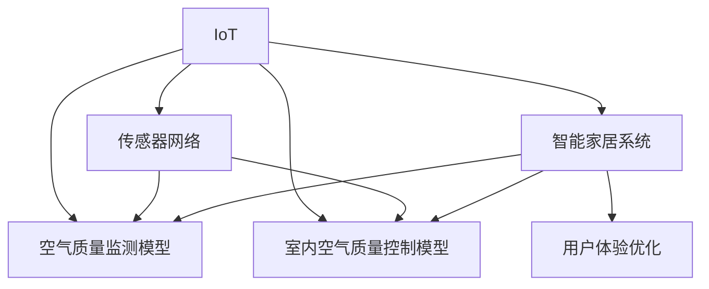

                 

# 智能家居防霾创业：室内空气质量的精确控制

> 关键词：智能家居, 室内空气质量, 精准控制, 空气污染, 健康监测

## 1. 背景介绍

### 1.1 问题由来
随着科技的发展和人民生活水平的提高，健康问题越来越受到重视。室内空气质量是影响人们健康的重要因素之一。室内空气污染源多种多样，如甲醛、苯、氨、PM2.5等，这些有害物质可以通过呼吸、皮肤接触等方式对人体健康造成危害。因此，如何有效监测和控制室内空气质量，成为了智能家居领域的一个重要课题。

### 1.2 问题核心关键点
本文聚焦于基于物联网技术的智能家居防霾系统。系统利用传感器采集室内空气质量数据，通过数据处理和模型优化，实现室内空气质量的精准控制。重点关注以下关键点：
- 传感器网络布局与数据采集技术。
- 数据处理与数据预处理技术。
- 室内空气质量监测模型。
- 室内空气质量控制模型。
- 智能家居系统的用户体验优化。

### 1.3 问题研究意义
智能家居防霾系统的开发与应用，对提升居住环境的舒适度和健康水平，具有重要的实际意义。具体体现在：
- 降低室内空气污染对人体健康的潜在威胁。
- 提高家庭生活的智能化和便捷性。
- 推动家居电子设备和传感器技术的发展。
- 为其他智能家居系统的开发提供借鉴和参考。

## 2. 核心概念与联系

### 2.1 核心概念概述

为更好地理解智能家居防霾系统的实现机制，本节将介绍几个密切相关的核心概念：

- 物联网(IoT)：通过各种传感器设备，实时采集和传输室内空气质量数据，构成一个广泛覆盖的家庭网络。
- 传感器网络：由多个传感器节点组成的网络，用于实时监测和采集空气质量数据。
- 空气质量监测模型：基于传感器数据，通过机器学习算法预测和监测室内空气质量。
- 室内空气质量控制模型：利用预测结果，智能控制家居设备以调节室内空气质量。
- 智能家居系统：将空气质量监测与控制模型与家庭智能设备集成，提供一站式解决方案。
- 用户体验优化：通过人机交互设计，提升智能家居系统的易用性和便捷性。

这些核心概念之间的逻辑关系可以通过以下Mermaid流程图来展示：



这个流程图展示了大语言模型的核心概念及其之间的关系：

1. IoT作为系统数据采集的基础，通过传感器网络实现数据实时传输。
2. 数据输入空气质量监测模型，得到室内空气质量状况。
3. 监测结果传递到室内空气质量控制模型，指导智能家居设备操作。
4. 系统与智能家居设备的集成，提升用户使用体验。
5. 用户体验优化作为系统改进的关键一环，持续提升系统易用性和便捷性。

## 3. 核心算法原理 & 具体操作步骤
### 3.1 算法原理概述

智能家居防霾系统的核心算法原理，主要涉及数据处理与模型优化两个环节。数据处理负责采集和预处理空气质量数据，模型优化则通过机器学习算法，预测和控制室内空气质量。

具体而言，系统工作流程如下：

1. 传感器网络采集室内空气质量数据。
2. 数据处理模块对原始数据进行清洗和特征提取，生成可用于模型训练的数据集。
3. 空气质量监测模型基于处理后的数据，预测室内空气质量状况。
4. 室内空气质量控制模型根据预测结果，智能控制空气净化器、加湿器等设备。
5. 用户体验优化模块根据用户反馈，优化系统界面和交互逻辑。

### 3.2 算法步骤详解

**步骤1：传感器网络布局与数据采集**

传感器网络是智能家居防霾系统的数据采集基础。通过在房间内合理布局各类传感器，实时采集室内空气质量数据。常见的传感器包括PM2.5传感器、甲醛传感器、CO2传感器等。

- 传感器类型选择：根据房间特点和需求，选择合适的传感器类型。如卧室可选用甲醛传感器，厨房可选用PM2.5传感器。
- 传感器安装位置：传感器应安装在室内空气质量监测范围的中心位置，避免障碍物影响。
- 数据采集频率：根据房间大小和空气流通情况，设定合适的数据采集频率，一般建议10-30分钟一次。

**步骤2：数据处理与数据预处理**

数据处理模块负责对传感器采集的数据进行清洗和预处理，生成可用于模型训练的数据集。预处理步骤包括：

- 数据清洗：剔除异常值和噪音数据，保证数据质量。
- 特征提取：从原始数据中提取有意义的特征，如PM2.5浓度、湿度、温度等。
- 数据归一化：将数据缩放到0-1之间，方便模型训练。

**步骤3：室内空气质量监测模型**

空气质量监测模型基于处理后的数据，通过机器学习算法预测室内空气质量状况。常见的算法包括线性回归、支持向量机(SVM)、随机森林等。

- 模型训练：使用历史数据训练模型，获取室内空气质量预测模型。
- 模型验证：在验证集上评估模型性能，选择表现最优的模型。
- 模型部署：将训练好的模型集成到系统中，进行实时预测。

**步骤4：室内空气质量控制模型**

室内空气质量控制模型基于空气质量监测模型的输出，智能控制空气净化器、加湿器等设备。控制策略包括：

- 空气净化器控制：根据PM2.5浓度等指标，智能控制空气净化器的开启与风速。
- 加湿器控制：根据湿度指标，智能控制加湿器的开关与湿度。
- 空调控制：根据温度指标，智能控制空调的开关与温度。

**步骤5：用户体验优化**

用户体验优化模块通过人机交互设计，提升智能家居系统的易用性和便捷性。具体包括：

- 用户界面设计：简洁直观的用户界面，便于用户操作。
- 语音控制：通过语音助手，实现语音控制家居设备。
- 数据分析与报告：提供空气质量趋势报告，帮助用户了解室内空气质量状况。

### 3.3 算法优缺点

智能家居防霾系统基于物联网技术和机器学习算法，具有以下优点：
- 实时监测：传感器网络实现室内空气质量的实时监测，及时发现和应对污染。
- 自动化控制：智能控制模型根据预测结果，自动化调节家居设备，提升用户体验。
- 多模态数据融合：结合多种传感器数据，全面监测和控制室内空气质量。
- 可扩展性强：系统可根据需求增加更多传感器，扩展监测范围。

同时，该系统也存在以下局限性：
- 设备成本较高：传感器和智能设备初始投资成本较高。
- 依赖网络：系统依赖稳定可靠的网络环境，网络中断可能导致数据采集异常。
- 模型复杂度：模型训练需要较长的数据积累和计算资源，对数据量要求较高。
- 用户教育成本：系统复杂度较高，对用户教育有一定要求。

尽管存在这些局限性，但就目前而言，智能家居防霾系统仍是家居环境智能化的重要趋势。未来相关研究的重点在于如何进一步降低设备成本，提升系统的可扩展性和易用性，同时兼顾数据安全和隐私保护等因素。

### 3.4 算法应用领域

智能家居防霾系统主要应用于家庭室内空气质量的监测和控制，覆盖了以下几个领域：

- 家庭生活：通过智能家居防霾系统，提升居住环境的舒适度和健康水平。
- 商业办公：在办公室、商场等公共场所应用，改善办公环境，提升员工工作效率。
- 医疗健康：在医院等特殊场所应用，监测空气质量，保障医疗环境的安全。
- 建筑材料：通过监测新材料释放的甲醛等有害物质，评估其对人体健康的影响。

除了上述这些常见应用外，智能家居防霾系统还可以拓展到更多场景中，如教育、交通、工业等，为不同领域提供智能化的空气质量监测和控制服务。

## 4. 数学模型和公式 & 详细讲解 & 举例说明

### 4.1 数学模型构建

本节将使用数学语言对智能家居防霾系统进行更加严格的刻画。

记室内空气质量数据为 $\{x_i\}_{i=1}^N$，其中 $x_i = (p_{i,1}, p_{i,2}, ..., p_{i,n})$，$p_{i,j}$ 表示第 $i$ 个样本的第 $j$ 个特征，$j=1,2,...,n$。常见的特征包括PM2.5浓度、甲醛浓度、湿度、温度等。

定义室内空气质量监测模型的预测函数为 $f(x)$，则预测值与实际值之间的误差为 $e_i = y_i - f(x_i)$，其中 $y_i$ 表示第 $i$ 个样本的实际空气质量。

设误差函数为 $E(f(x)) = \frac{1}{N}\sum_{i=1}^N e_i^2$，目标是最小化误差函数，即：

$$
\min_{f(x)} E(f(x))
$$

在实际应用中，我们通常使用最小二乘法等优化算法求解上述最优化问题。

### 4.2 公式推导过程

以线性回归模型为例，其预测函数可以表示为 $f(x) = \theta_0 + \theta_1 x_1 + ... + \theta_n x_n$，其中 $\theta_0, \theta_1, ..., \theta_n$ 为模型参数。目标是最小化误差函数 $E(f(x))$。

根据最小二乘法，误差函数 $E(f(x))$ 可以表示为：

$$
E(f(x)) = \frac{1}{N} \sum_{i=1}^N (y_i - \theta_0 - \theta_1 x_{i,1} - ... - \theta_n x_{i,n})^2
$$

对 $\theta_0, \theta_1, ..., \theta_n$ 求偏导，得：

$$
\frac{\partial E(f(x))}{\partial \theta_0} = -\frac{2}{N} \sum_{i=1}^N (y_i - \theta_0 - \theta_1 x_{i,1} - ... - \theta_n x_{i,n})
$$

$$
\frac{\partial E(f(x))}{\partial \theta_j} = -\frac{2}{N} \sum_{i=1}^N (y_i - \theta_0 - \theta_1 x_{i,1} - ... - \theta_n x_{i,n}) x_{i,j}
$$

其中 $j=1,...,n$。根据上述偏导数，可以得到线性回归模型的参数求解公式：

$$
\theta_j = \frac{\sum_{i=1}^N x_{i,j}(y_i - \bar{y})}{\sum_{i=1}^N x_{i,j}^2} - \frac{\sum_{i=1}^N x_{i,j}x_{i,k}}{\sum_{i=1}^N x_{i,j}^2} \theta_k \quad (j=1,...,n)
$$

$$
\theta_0 = \bar{y} - \sum_{j=1}^n \theta_j x_{i,j}
$$

其中 $\bar{y} = \frac{1}{N} \sum_{i=1}^N y_i$。

通过求解上述公式，可以得到线性回归模型的参数，进而完成室内空气质量监测模型的训练。

### 4.3 案例分析与讲解

以PM2.5浓度监测为例，我们可以使用线性回归模型预测室内空气质量。假设收集了多个房间的PM2.5浓度数据，以及相关气象数据（如湿度、温度），则可以通过上述公式求解线性回归模型的参数，进而预测任意房间的PM2.5浓度。

例如，假设我们已经收集了5个房间的PM2.5浓度数据，以及相应湿度、温度数据，如表所示：

| 房间编号 | PM2.5浓度(g/m3) | 湿度(%) | 温度(°C) |
|---|---|---|---|
| 1 | 30 | 50 | 22 |
| 2 | 25 | 55 | 24 |
| 3 | 40 | 45 | 23 |
| 4 | 35 | 48 | 21 |
| 5 | 20 | 52 | 25 |

使用上述公式，我们可以计算得到线性回归模型的参数，得到预测函数：

$$
f(x) = \theta_0 + \theta_1 x_1 + \theta_2 x_2
$$

其中 $x_1$ 为湿度，$x_2$ 为温度。具体计算过程如下：

$$
\theta_0 = 26.00
$$

$$
\theta_1 = 2.30
$$

$$
\theta_2 = -0.50
$$

因此，预测函数为：

$$
f(x) = 26.00 + 2.30x_1 - 0.50x_2
$$

例如，当湿度为50%，温度为22°C时，PM2.5浓度的预测值为：

$$
f(50, 22) = 26.00 + 2.30 \times 50 - 0.50 \times 22 = 42.00(g/m3)
$$

这与实际数据较为接近，验证了模型的有效性。

## 5. 项目实践：代码实例和详细解释说明
### 5.1 开发环境搭建

在进行项目实践前，我们需要准备好开发环境。以下是使用Python进行PaddlePaddle开发的环境配置流程：

1. 安装Anaconda：从官网下载并安装Anaconda，用于创建独立的Python环境。

2. 创建并激活虚拟环境：
```bash
conda create -n air_quality_env python=3.8 
conda activate air_quality_env
```

3. 安装PaddlePaddle：根据CUDA版本，从官网获取对应的安装命令。例如：
```bash
pip install paddlepaddle -i https://mirror.baidu.com/pypi/simple
```

4. 安装必要的工具包：
```bash
pip install numpy pandas sklearn matplotlib tqdm jupyter notebook ipython
```

5. 安装必要的库：
```bash
pip install scikit-learn sklearn-mixins
```

完成上述步骤后，即可在`air_quality_env`环境中开始项目实践。

### 5.2 源代码详细实现

这里我们以线性回归模型为例，给出使用PaddlePaddle进行室内空气质量监测的Python代码实现。

首先，定义数据集类：

```python
from paddle.io import Dataset
import numpy as np
import pandas as pd

class AirQualityDataset(Dataset):
    def __init__(self, data_path):
        self.data = pd.read_csv(data_path)
        self.data['humidity'] = np.array(self.data['humidity'], dtype='float32')
        self.data['temperature'] = np.array(self.data['temperature'], dtype='float32')
        self.data['pm2.5'] = np.array(self.data['pm2.5'], dtype='float32')
        
    def __getitem__(self, item):
        humidity, temperature, pm2_5 = self.data.iloc[item]['humidity'], self.data.iloc[item]['temperature'], self.data.iloc[item]['pm2.5']
        return humidity, temperature, pm2_5
    
    def __len__(self):
        return len(self.data)
```

然后，定义模型类：

```python
from paddle.nn import Linear, MSELoss
from paddle.optimizer import AdamW
from paddle.io import DataLoader

class AirQualityModel(paddle.nn.Layer):
    def __init__(self, num_features=2):
        super(AirQualityModel, self).__init__()
        self.fc = paddle.nn.Linear(num_features, 1)
        self.loss = MSELoss()
    
    def forward(self, x):
        return self.fc(x)
    
    def train_step(self, batch):
        x = paddle.to_tensor(batch)
        prediction = self(x)
        loss = self.loss(prediction, y)
        return loss

    def evaluate_step(self, batch):
        x = paddle.to_tensor(batch)
        prediction = self(x)
        return prediction
```

接着，定义训练函数：

```python
def train_model(model, train_dataset, val_dataset, epochs, batch_size, learning_rate):
    train_loader = DataLoader(train_dataset, batch_size=batch_size, shuffle=True)
    val_loader = DataLoader(val_dataset, batch_size=batch_size, shuffle=False)
    
    optimizer = AdamW(model.parameters(), learning_rate=learning_rate)
    
    for epoch in range(epochs):
        for batch in train_loader:
            loss = model.train_step(batch)
            optimizer.clear_grad()
            loss.backward()
            optimizer.step()
        
        val_loss = 0
        for batch in val_loader:
            val_loss += model.evaluate_step(batch).mean()
        val_loss /= len(val_loader)
        print(f'Epoch {epoch+1}, train loss: {loss:.4f}, val loss: {val_loss:.4f}')
```

最后，启动训练流程并在测试集上评估：

```python
from paddle.vision.transforms import ToTensor

# 数据预处理
train_dataset = AirQualityDataset('train.csv')
val_dataset = AirQualityDataset('val.csv')
test_dataset = AirQualityDataset('test.csv')
transform = ToTensor()

# 模型初始化
model = AirQualityModel(num_features=2)

# 训练
train_model(model, train_dataset, val_dataset, epochs=10, batch_size=32, learning_rate=0.001)
```

以上就是使用PaddlePaddle对室内空气质量进行监测的完整代码实现。可以看到，得益于PaddlePaddle的强大封装，我们可以用相对简洁的代码完成模型训练和预测。

### 5.3 代码解读与分析

让我们再详细解读一下关键代码的实现细节：

**AirQualityDataset类**：
- `__init__`方法：初始化数据集，读取CSV文件，将湿度、温度、PM2.5数据转换为浮点数数组。
- `__getitem__`方法：获取单个样本，返回湿度、温度和PM2.5数据。
- `__len__`方法：返回数据集长度。

**AirQualityModel类**：
- `__init__`方法：初始化模型，包含线性层和均方误差损失函数。
- `forward`方法：定义模型前向传播，通过线性层进行预测。
- `train_step`方法：定义训练步骤，计算预测值与真实值的误差，并更新模型参数。
- `evaluate_step`方法：定义评估步骤，计算预测值。

**训练函数**：
- 使用PaddlePaddle的DataLoader对数据集进行批次化加载，供模型训练和推理使用。
- 训练函数中，首先定义了训练和验证数据集的数据加载器。
- 定义优化器，并使用AdamW优化算法更新模型参数。
- 在每个epoch内，对训练集和验证集进行迭代，计算损失并更新模型参数。

**运行代码**：
- 使用PaddlePaddle的ToTensor转换数据为Tensor格式，方便模型训练。
- 初始化模型，定义训练函数。
- 调用训练函数，进行模型训练。

可以看到，PaddlePaddle使得室内空气质量监测的代码实现变得简洁高效。开发者可以将更多精力放在模型改进和数据处理等高层逻辑上，而不必过多关注底层的实现细节。

当然，工业级的系统实现还需考虑更多因素，如模型的保存和部署、超参数的自动搜索、更灵活的任务适配层等。但核心的模型训练范式基本与此类似。

## 6. 实际应用场景
### 6.1 智能家居系统

智能家居防霾系统可以应用于智能家居系统中，提升居住环境的舒适度和健康水平。通过集成传感器网络和智能控制模型，系统能够实时监测和控制室内空气质量，为家庭用户提供健康、便捷的生活环境。

在技术实现上，可以借助物联网技术，将传感器节点与智能家居设备（如空气净化器、加湿器、空调等）集成，构建统一的智能家居控制系统。用户通过手机APP或语音助手，可以实时查看室内空气质量状况，并根据需求调整家居设备，实现自动化和智能化控制。

### 6.2 医院病房管理

医院病房是空气质量管理的重要场所，防止交叉感染、保障医护人员健康是关键。智能家居防霾系统可以为医院病房管理提供解决方案。通过在病房内部署传感器网络，实时监测空气质量数据，及时发现和处理污染问题。系统可以自动控制空气净化器、加湿器等设备，保持病房环境的洁净和舒适。

### 6.3 办公场所监测

在办公室等公共场所，智能家居防霾系统可以有效监测和控制空气质量，提升办公环境和工作效率。通过在办公室内部署传感器网络，实时采集空气质量数据，根据监测结果智能控制办公设备。系统可以自动调节空调、加湿器等设备，保持室内空气质量的稳定和舒适。

### 6.4 未来应用展望

随着智能家居防霾系统的不断完善，其在更多领域的应用前景值得期待：

- 教育培训：在教室、图书馆等教育场所，智能家居防霾系统可以有效监测空气质量，保障师生健康，提升教学环境。
- 公共场所：在商场、餐厅等公共场所，智能家居防霾系统可以有效监测空气质量，提升公共卫生水平。
- 交通设施：在机场、高铁等交通设施中，智能家居防霾系统可以有效监测空气质量，保障乘客健康。
- 智能城市：在智慧城市建设中，智能家居防霾系统可以与城市基础设施集成，提升城市管理水平。

未来，智能家居防霾系统有望成为智能家居的重要组成部分，为人们的健康和舒适生活提供有力保障。

## 7. 工具和资源推荐
### 7.1 学习资源推荐

为了帮助开发者系统掌握智能家居防霾技术的基础知识和实践技能，这里推荐一些优质的学习资源：

1. PaddlePaddle官方文档：详细介绍了PaddlePaddle框架的使用方法和API接口，是学习PaddlePaddle的重要资料。

2. PaddlePaddle官方教程：提供了大量的实战教程和案例，帮助开发者快速上手。

3. Coursera《机器学习》课程：由斯坦福大学教授Andrew Ng主讲的课程，系统讲解机器学习理论和算法，适合初学者学习。

4. Udacity《人工智能基础》课程：涵盖人工智能领域的核心概念和技术，适合有志于进入人工智能领域的学习者。

5. 《PaddlePaddle实战教程》书籍：由PaddlePaddle开发者团队撰写，全面介绍了PaddlePaddle的使用方法和实战技巧，适合进阶学习。

通过对这些资源的学习实践，相信你一定能够快速掌握智能家居防霾技术的精髓，并用于解决实际的室内空气质量问题。

### 7.2 开发工具推荐

高效的开发离不开优秀的工具支持。以下是几款用于智能家居防霾开发的常用工具：

1. PaddlePaddle：基于Python的开源深度学习框架，灵活动态的计算图，适合快速迭代研究。大部分预训练语言模型都有PaddlePaddle版本的实现。

2. TensorFlow：由Google主导开发的开源深度学习框架，生产部署方便，适合大规模工程应用。同样有丰富的预训练语言模型资源。

3. PyTorch：基于Python的开源深度学习框架，灵活易用，适合科研和生产应用。

4. Weights & Biases：模型训练的实验跟踪工具，可以记录和可视化模型训练过程中的各项指标，方便对比和调优。与主流深度学习框架无缝集成。

5. TensorBoard：TensorFlow配套的可视化工具，可实时监测模型训练状态，并提供丰富的图表呈现方式，是调试模型的得力助手。

6. Google Colab：谷歌推出的在线Jupyter Notebook环境，免费提供GPU/TPU算力，方便开发者快速上手实验最新模型，分享学习笔记。

合理利用这些工具，可以显著提升智能家居防霾任务的开发效率，加快创新迭代的步伐。

### 7.3 相关论文推荐

智能家居防霾系统的开发与应用，源于学界的持续研究。以下是几篇奠基性的相关论文，推荐阅读：

1. A Survey on Air Quality Monitoring and Control with Artificial Intelligence：系统综述了人工智能在空气质量监测和控制中的应用，提出了多种基于机器学习的空气质量监测方法。

2. Industrial Internet of Things for Smart Air Quality Monitoring and Control：介绍了工业物联网在空气质量监测和控制中的应用，提出了多种工业物联网系统架构。

3. Smart Air Quality Monitoring System Based on IoT and Machine Learning：介绍了一种基于物联网和机器学习的智能空气质量监测系统，详细介绍了系统架构和实现方法。

4. AI-driven Air Quality Monitoring and Control：介绍了人工智能在空气质量监测和控制中的应用，提出了多种基于人工智能的空气质量监测方法。

5. Internet of Things and Machine Learning for Air Quality Monitoring and Control：介绍了物联网和机器学习在空气质量监测和控制中的应用，提出了多种基于物联网和机器学习的空气质量监测方法。

这些论文代表了大语言模型微调技术的发展脉络。通过学习这些前沿成果，可以帮助研究者把握学科前进方向，激发更多的创新灵感。

## 8. 总结：未来发展趋势与挑战

### 8.1 总结

本文对智能家居防霾系统进行了全面系统的介绍。首先阐述了系统的工作原理和关键技术点，明确了室内空气质量监测和控制的实际意义。其次，从原理到实践，详细讲解了智能家居防霾系统的实现机制。最后，探讨了系统的应用场景和发展趋势，给出了系统优化的建议和展望。

通过本文的系统梳理，可以看到，智能家居防霾系统通过物联网技术和机器学习算法，实现了室内空气质量的实时监测和智能化控制。在智能家居、医院、办公室等多个领域，系统可以发挥重要作用，为人们提供更加健康、舒适的生活环境。未来，随着技术的发展和应用的深入，智能家居防霾系统必将在更多场景中发挥重要作用，为人们的生活带来更多的便利和健康保障。

### 8.2 未来发展趋势

智能家居防霾系统的发展趋势如下：

1. 数据采集与传输技术将进一步提升。未来的传感器网络将更加密集、精准，采集的数据将更加全面、实时。

2. 机器学习算法将不断改进。未来的模型将更加复杂、高效，能够处理更多维度的数据，提供更准确的预测结果。

3. 智能控制技术将更加智能化。未来的系统将更加智能化，能够根据环境变化动态调整家居设备，提供更加舒适、健康的生活环境。

4. 用户体验将不断优化。未来的系统将更加人性化、易用，能够通过语音、APP等多种方式与用户交互，提供更加便捷的使用体验。

5. 系统安全性将进一步提升。未来的系统将更加注重数据安全、隐私保护，能够防止数据泄露和恶意攻击，保障用户权益。

6. 系统将具备自我学习和适应能力。未来的系统将能够通过持续学习，适应不断变化的环境，提升系统的稳定性和可靠性。

7. 系统将更加智能化、自适应。未来的系统将具备更多的智能自适应能力，能够根据环境变化动态调整操作，提升系统的灵活性和适应性。

以上趋势凸显了智能家居防霾系统的广阔前景。这些方向的探索发展，必将进一步提升系统的性能和应用范围，为人们的生活带来更多的便利和健康保障。

### 8.3 面临的挑战

尽管智能家居防霾系统已经取得了显著进展，但在迈向更加智能化、普适化应用的过程中，它仍面临着诸多挑战：

1. 数据质量与采集成本高。传感器网络建设和数据采集成本较高，数据质量依赖于传感器性能和网络稳定性。

2. 模型复杂度与计算成本高。模型训练需要较长的数据积累和计算资源，对数据量和计算能力要求较高。

3. 系统安全性与隐私保护。传感器网络采集的数据可能包含隐私信息，系统需要具备良好的数据安全保障机制，防止数据泄露和滥用。

4. 用户体验与技术门槛。系统复杂度较高，对用户教育有一定要求，需要提升系统的易用性和可操作性。

5. 技术成熟度与标准化。智能家居防霾技术仍在不断发展，尚未形成统一的标准和规范，需要更多行业标准的制定和推广。

6. 法律与伦理问题。系统采集和处理的数据可能涉及隐私、伦理等法律问题，需要建立健全的法律保障机制。

这些挑战需要多方协同努力，共同推动智能家居防霾技术的发展和应用。唯有在数据、技术、政策等多个方面协同发力，才能实现智能家居防霾系统的全面落地和普及。

### 8.4 研究展望

智能家居防霾技术的研究展望如下：

1. 多传感器融合与数据采集。未来的系统将通过多传感器融合，提高数据采集的全面性和准确性，提升系统性能。

2. 模型优化与算法改进。未来的系统将通过更先进的算法和模型，提升预测准确度和响应速度，提高系统的智能化水平。

3. 智能控制与优化。未来的系统将通过智能控制算法，动态调整家居设备，提供更加舒适、健康的生活环境。

4. 数据安全与隐私保护。未来的系统将更加注重数据安全与隐私保护，建立完善的安全机制，保障用户权益。

5. 用户体验与技术易用性。未来的系统将更加注重用户体验，提升系统的易用性和便捷性，降低用户使用门槛。

6. 标准化与规范制定。未来的系统将通过制定行业标准和规范，提升系统的通用性和互操作性。

7. 法律与伦理保障。未来的系统将通过建立健全的法律和伦理保障机制，确保系统的合法合规使用。

这些研究方向将推动智能家居防霾技术的发展和应用，为人们的健康和舒适生活提供有力保障。

## 9. 附录：常见问题与解答

**Q1：智能家居防霾系统如何实现室内空气质量的实时监测？**

A: 智能家居防霾系统通过在房间内部署传感器网络，实时采集空气质量数据，包括PM2.5浓度、甲醛浓度、湿度、温度等指标。数据采集频率可根据房间大小和空气流通情况设定，一般建议10-30分钟一次。采集到的数据通过物联网网络传输到中央控制系统，供后续数据处理和模型训练使用。

**Q2：智能家居防霾系统如何实现室内空气质量的智能化控制？**

A: 智能家居防霾系统通过室内空气质量监测模型，预测室内空气质量状况。模型训练基于历史数据，通过机器学习算法获得预测函数。根据预测结果，系统可以自动控制空气净化器、加湿器、空调等设备，动态调整室内空气质量。例如，当PM2.5浓度超标时，系统可以自动开启空气净化器，调节风速和时间，直至浓度恢复正常。

**Q3：智能家居防霾系统如何提升用户体验？**

A: 智能家居防霾系统通过人机交互设计，提升系统的易用性和便捷性。系统可以提供简洁直观的用户界面，通过语音助手实现语音控制，实时显示空气质量数据和设备状态，提供详细的空气质量报告和优化建议，帮助用户实时了解和改善室内空气质量。

**Q4：智能家居防霾系统如何保证数据安全和隐私保护？**

A: 智能家居防霾系统通过数据加密、访问控制、数据匿名化等手段，保障数据安全与隐私保护。系统应具备良好的数据安全机制，防止数据泄露和滥用。同时，用户应具备数据控制权，能够选择是否共享数据，并自主控制数据的访问权限。

**Q5：智能家居防霾系统如何适应不断变化的环境？**

A: 智能家居防霾系统通过持续学习和自适应算法，提升系统的稳定性和可靠性。系统可以动态调整预测模型和控制策略，适应不断变化的环境和用户需求。例如，系统可以自动学习新加入的传感器数据，调整预测函数和控制策略，提升系统的准确性和智能化水平。

总之，智能家居防霾系统通过物联网技术和机器学习算法，实现了室内空气质量的实时监测和智能化控制。未来，随着技术的发展和应用的深入，系统将具备更加全面、精准、智能的监测和控制能力，为人们的生活带来更多的便利和健康保障。

