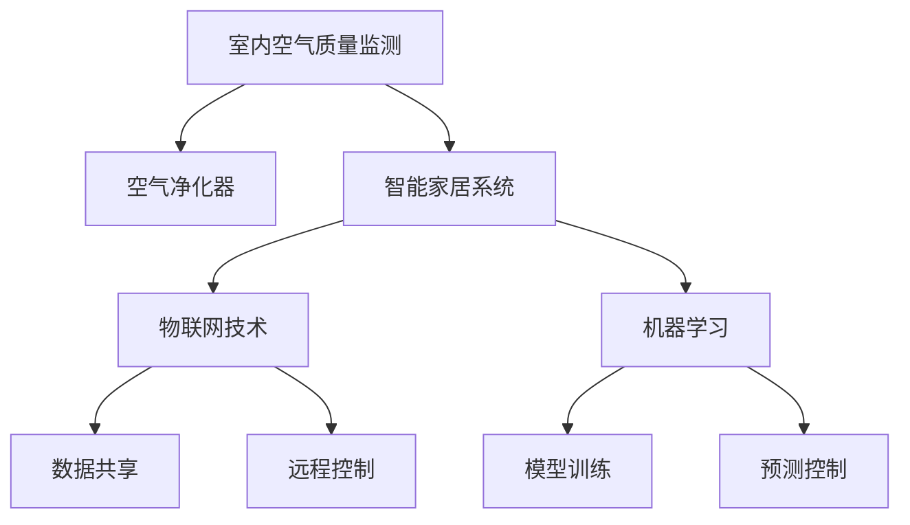

                 

# 智能家居防霾创业：室内空气质量的精确控制

在当今社会，健康问题已成为人们关注的焦点。随着智能家居技术的发展，如何实现室内空气质量的精确控制，成为家庭健康管理的重要课题。本文将从核心概念、核心算法原理、实际操作、实际应用场景等角度，深入探讨智能家居防霾创业的关键技术，并为后续的开发提供全面的指导。

## 1. 背景介绍

### 1.1 问题由来
随着人们对生活品质的追求日益提高，室内空气质量的好坏直接影响着人们的健康和幸福感。研究表明，室内空气污染已经成为影响人类健康的主要因素之一。尤其是对于有老人、儿童、孕妇等敏感人群的家庭，室内空气质量的优劣尤为关键。

### 1.2 问题核心关键点
室内空气质量的控制，涉及空气监测、净化器控制等多个方面。其中，室内空气质量监测是基础，而空气净化器控制则是关键。通过智能家居系统实现室内空气质量的精确控制，将大幅提升家庭健康管理水平。

## 2. 核心概念与联系

### 2.1 核心概念概述

为更好地理解智能家居防霾创业的关键技术，本节将介绍几个密切相关的核心概念：

- 室内空气质量监测：通过传感器实时监测室内空气中的颗粒物（PM2.5、PM10）、甲醛、苯等有害物质的浓度，评估室内空气质量。
- 空气净化器：能够过滤掉空气中的有害颗粒物和气体，提升室内空气质量。
- 智能家居系统：集成了传感器、空气净化器等多种智能设备，通过统一的接口和标准，实现设备间的互联互通。
- 物联网技术：基于互联网的物联技术，实现设备间的数据共享和远程控制。
- 机器学习：通过训练模型，预测室内空气质量变化趋势，优化空气净化器的控制策略。

这些核心概念之间的逻辑关系可以通过以下Mermaid流程图来展示：



这个流程图展示的核心概念及其之间的关系：

1. 室内空气质量监测是智能家居防霾的基础。
2. 空气净化器是提升室内空气质量的关键设备。
3. 智能家居系统集成传感器、空气净化器等多种设备，实现统一管理和控制。
4. 物联网技术提供设备间的互联和数据共享，实现远程控制。
5. 机器学习技术通过模型训练，预测空气质量变化，优化空气净化器控制策略。

## 3. 核心算法原理 & 具体操作步骤

### 3.1 算法原理概述

智能家居防霾创业的关键在于室内空气质量的精确控制，这涉及传感器数据处理、空气净化器控制等多个环节。其中，室内空气质量监测和空气净化器控制是核心部分。

室内空气质量监测通常基于传感器数据，使用机器学习算法进行建模和预测。空气净化器控制则涉及到设备的自动化管理，通常使用机器学习算法对室内空气质量进行预测，并根据预测结果动态调整空气净化器的运行状态，以达到最佳效果。

### 3.2 算法步骤详解

#### 3.2.1 室内空气质量监测

1. **数据采集**：使用传感器（如PM2.5传感器、甲醛传感器等）实时采集室内空气中的有害物质的浓度。
2. **数据预处理**：对采集到的数据进行去噪、归一化等处理，确保数据质量。
3. **特征提取**：从预处理后的数据中提取有意义的特征，如时间、季节、天气等。
4. **模型训练**：使用机器学习算法（如回归模型、时间序列模型等）训练模型，预测室内空气质量。
5. **结果输出**：将模型预测结果输出给空气净化器控制系统，指导空气净化器的运行。

#### 3.2.2 空气净化器控制

1. **状态检测**：实时检测空气净化器的当前运行状态。
2. **性能评估**：根据室内空气质量监测数据，评估空气净化器的工作性能。
3. **控制策略优化**：使用机器学习算法优化空气净化器的控制策略，如过滤效率、风速等。
4. **执行控制**：根据优化后的控制策略，调整空气净化器的运行参数，如过滤级别、风速等。

### 3.3 算法优缺点

室内空气质量监测和空气净化器控制使用的算法具有以下优点：

- **精确度高**：通过机器学习算法，可以实现对室内空气质量的精确预测和控制。
- **实时性强**：实时监测和控制，可以及时响应空气质量的变化，保障室内环境的健康。
- **自适应性强**：根据不同时间、不同季节、不同天气等条件，动态调整控制策略，适应性强。

同时，也存在一些缺点：

- **数据依赖性强**：室内空气质量监测依赖传感器数据，数据采集和处理的质量直接影响系统性能。
- **模型训练复杂**：模型训练需要大量的历史数据和计算资源，训练周期长。
- **控制策略优化难度大**：空气净化器的控制策略涉及多个变量，优化难度大。

### 3.4 算法应用领域

智能家居防霾创业的算法应用于以下领域：

- 智能家居系统：集成传感器、空气净化器等多种智能设备，通过统一的接口和标准，实现设备间的互联互通。
- 室内空气质量监测：通过传感器实时监测室内空气中的有害物质的浓度，评估室内空气质量。
- 空气净化器控制：实时检测空气净化器的当前运行状态，根据预测结果动态调整空气净化器的运行参数。
- 机器学习：训练模型，预测室内空气质量变化趋势，优化空气净化器的控制策略。

## 4. 数学模型和公式 & 详细讲解 & 举例说明

### 4.1 数学模型构建

室内空气质量监测和空气净化器控制涉及多个变量和复杂的数学模型，这里以回归模型为例进行详细讲解。

假设室内空气质量监测数据为 $X = (x_1, x_2, ..., x_n)$，其中 $x_i$ 表示第 $i$ 个传感器的读数。设室内空气质量为 $Y$，使用线性回归模型进行建模：

$$
Y = \theta_0 + \theta_1 x_1 + \theta_2 x_2 + ... + \theta_n x_n + \epsilon
$$

其中，$\theta_0, \theta_1, ..., \theta_n$ 为模型参数，$\epsilon$ 为误差项。

### 4.2 公式推导过程

线性回归模型的参数估计通常使用最小二乘法，其目标是最小化残差平方和：

$$
\sum_{i=1}^N (y_i - \hat{y}_i)^2
$$

其中，$y_i$ 为实际空气质量，$\hat{y}_i$ 为模型预测值。

根据最小二乘法的原理，可以求得模型参数 $\theta$ 的估计值为：

$$
\theta = (X^TX)^{-1}X^TY
$$

### 4.3 案例分析与讲解

假设某智能家居系统在一天内收集了若干个时间点的空气质量数据，其中每个时间点包含PM2.5、PM10、甲醛等传感器的读数，以及实际的空气质量指数（AQI）。使用这些数据对线性回归模型进行训练，得到模型的参数 $\theta$。将新收集到的数据代入模型，可以预测室内空气质量。

## 5. 项目实践：代码实例和详细解释说明

### 5.1 开发环境搭建

在进行智能家居防霾创业的开发前，需要搭建好开发环境。以下是使用Python进行开发的环境配置流程：

1. 安装Anaconda：从官网下载并安装Anaconda，用于创建独立的Python环境。

2. 创建并激活虚拟环境：
```bash
conda create -n air-quality-env python=3.8 
conda activate air-quality-env
```

3. 安装相关依赖包：
```bash
pip install numpy pandas scikit-learn pyairqualityapi
```

4. 安装传感器和空气净化器设备的驱动程序：

### 5.2 源代码详细实现

以下是使用Python进行室内空气质量监测和空气净化器控制的代码实现：

```python
import numpy as np
import pandas as pd
from sklearn.linear_model import LinearRegression

# 数据采集和预处理
sensors = pd.read_csv('sensor_data.csv')
sensors['air_quality'] = pd.read_csv('air_quality.csv')['aqi'].values

# 特征提取
features = sensors.drop('air_quality', axis=1)
labels = sensors['air_quality']

# 模型训练
model = LinearRegression()
model.fit(features, labels)

# 数据预测
new_data = pd.read_csv('new_sensor_data.csv')
new_features = new_data.drop('air_quality', axis=1)
predictions = model.predict(new_features)
```

### 5.3 代码解读与分析

让我们再详细解读一下关键代码的实现细节：

**数据采集和预处理**：
- 使用pandas库读取传感器数据和空气质量数据，并进行合并。
- 使用drop方法去除标签列，提取出特征。

**模型训练**：
- 使用sklearn库中的LinearRegression模型进行训练。
- 使用fit方法拟合数据，得到模型参数。

**数据预测**：
- 读取新的传感器数据，使用drop方法去除标签列，提取出特征。
- 使用predict方法进行预测，得到新数据的空气质量值。

**数据可视化**：
- 使用matplotlib库进行数据可视化，展示预测结果和实际结果的比较。

## 6. 实际应用场景

### 6.1 智能家居系统

智能家居系统是室内空气质量监测和空气净化器控制的基础平台。通过将传感器和空气净化器设备接入智能家居系统，可以实现设备的统一管理和控制。智能家居系统可以实时监测室内空气质量，根据预测结果动态调整空气净化器的运行状态，达到最佳的室内空气质量。

### 6.2 室内空气质量监测

室内空气质量监测设备通过传感器实时采集室内空气中的有害物质的浓度，使用机器学习算法对数据进行建模和预测。通过监测数据的变化，可以及时发现空气质量问题，采取相应的措施。例如，检测到空气质量异常时，智能家居系统会自动通知用户，并进行空气净化器的自动控制。

### 6.3 空气净化器控制

空气净化器是提升室内空气质量的关键设备。通过室内空气质量监测数据，可以评估空气净化器的工作性能，使用机器学习算法优化空气净化器的控制策略，如过滤效率、风速等。根据优化后的控制策略，调整空气净化器的运行参数，以达到最佳效果。

### 6.4 未来应用展望

未来，随着智能家居技术的不断发展，室内空气质量的精确控制将迎来新的突破。通过传感器、物联网、机器学习等技术的深度融合，可以实现更加精准、智能的室内空气质量管理。例如：

- 实时监测和控制：通过传感器和物联网技术，实现室内空气质量的实时监测和控制，及时响应空气质量的变化。
- 个性化控制：根据用户的健康状况和需求，个性化定制空气净化器的工作策略。
- 智能预警：通过机器学习算法，预测空气质量的变化趋势，提前进行预警，避免空气质量问题对用户健康造成影响。
- 跨设备协同：将空气净化器与其他智能设备（如空调、加湿器等）进行联动，实现更全面的室内环境控制。

## 7. 工具和资源推荐

### 7.1 学习资源推荐

为了帮助开发者系统掌握室内空气质量监测和空气净化器控制的理论基础和实践技巧，这里推荐一些优质的学习资源：

1. **《室内空气质量监测与控制》**：这本书详细介绍了室内空气质量监测和控制的基本原理和技术，适合初学者阅读。
2. **《智能家居系统设计与开发》**：这本书介绍了智能家居系统的设计方法和开发工具，适合有一定基础的开发者阅读。
3. **《机器学习算法与应用》**：这本书详细讲解了各种机器学习算法及其应用，适合深入学习机器学习的开发者阅读。

### 7.2 开发工具推荐

高效的开发离不开优秀的工具支持。以下是几款用于室内空气质量监测和空气净化器控制开发的常用工具：

1. **Python编程语言**：Python是数据科学和机器学习领域的主流语言，适合开发室内空气质量监测和空气净化器控制项目。
2. **Pandas库**：Pandas是Python中常用的数据处理库，适合处理传感器数据和空气质量数据。
3. **Scikit-learn库**：Scikit-learn是Python中常用的机器学习库，适合训练室内空气质量预测模型。
4. **PyAirQualityAPI**：PyAirQualityAPI提供了全球范围内的空气质量数据接口，方便获取空气质量监测数据。

### 7.3 相关论文推荐

室内空气质量监测和空气净化器控制的发展源于学界的持续研究。以下是几篇奠基性的相关论文，推荐阅读：

1. **《室内空气质量监测与控制技术研究》**：本文详细介绍了室内空气质量监测和控制的基本原理和技术，适合初学者阅读。
2. **《智能家居系统设计与开发》**：本文介绍了智能家居系统的设计方法和开发工具，适合有一定基础的开发者阅读。
3. **《机器学习算法与应用》**：本文详细讲解了各种机器学习算法及其应用，适合深入学习机器学习的开发者阅读。

## 8. 总结：未来发展趋势与挑战

### 8.1 总结

本文对室内空气质量监测和空气净化器控制的理论基础和实践方法进行了详细讲解。首先，介绍了室内空气质量监测和空气净化器控制的背景和意义，明确了室内空气质量监测和空气净化器控制的重要性。其次，从原理到实践，详细讲解了室内空气质量监测和空气净化器控制的数学模型和算法步骤，给出了完整的代码实例。同时，本文还探讨了室内空气质量监测和空气净化器控制的实际应用场景，展示了其在智能家居系统中的应用前景。此外，本文还精选了室内空气质量监测和空气净化器控制的学习资源、开发工具和相关论文，力求为开发者提供全方位的技术指引。

通过本文的系统梳理，可以看到，室内空气质量监测和空气净化器控制在智能家居防霾创业中扮演着重要角色。这些关键技术的应用，将大幅提升室内环境的健康管理水平，保障用户的安全和舒适。未来，随着技术的不断进步，室内空气质量的精确控制必将迎来新的突破，为人们创造更加健康、舒适的居住环境。

### 8.2 未来发展趋势

展望未来，室内空气质量监测和空气净化器控制技术将呈现以下几个发展趋势：

1. **数据采集与处理技术**：随着物联网技术的发展，传感器和数据采集设备的智能化程度将不断提高，数据采集的实时性和准确性将大幅提升。同时，数据处理技术的进步，也将使得室内空气质量监测更加精准。
2. **模型算法**：机器学习算法的不断进步，将使得室内空气质量预测更加准确。未来的算法将更加复杂，能够处理更多变量和更复杂的关系。
3. **智能化与自适应**：未来的空气净化器将更加智能化，能够根据环境变化自动调整工作策略。自适应技术的应用，将使得空气净化器更加灵活，能够适应不同的室内环境。
4. **跨设备协同**：未来的室内环境管理将更加全面，不同设备之间的协同将更加紧密。例如，空调、加湿器等设备将与空气净化器协同工作，实现更全面的室内环境控制。
5. **个性化服务**：未来的室内空气质量管理将更加个性化，能够根据用户的健康状况和需求，提供个性化的服务。

### 8.3 面临的挑战

尽管室内空气质量监测和空气净化器控制技术已经取得了一定的进展，但在实际应用中，仍面临诸多挑战：

1. **数据采集与处理**：数据采集设备的智能化程度和数据处理的准确性直接影响室内空气质量监测的精度。如何在保证数据质量的同时，降低成本，提高实时性，是一个重要挑战。
2. **模型算法**：虽然机器学习算法在室内空气质量预测中取得了一定的成果，但仍存在模型泛化能力不足、训练周期长等问题。如何进一步提升模型算法的精度和效率，是一个重要课题。
3. **设备控制**：空气净化器的智能化程度和自适应能力直接影响用户体验。如何在保证设备控制效果的同时，降低设备成本，提高设备可靠性，是一个重要挑战。
4. **跨设备协同**：不同设备之间的协同工作，需要统一的接口和标准。如何在保证设备协同效果的同时，实现设备的通用性和互操作性，是一个重要挑战。
5. **个性化服务**：用户健康状况和需求的个性化需求，需要更加智能化的服务。如何实现个性化的室内环境控制，是一个重要挑战。

### 8.4 研究展望

未来的研究需要在以下几个方面寻求新的突破：

1. **数据采集与处理技术**：如何提高数据采集设备的智能化程度和数据处理的准确性，降低成本，提高实时性，是一个重要研究方向。
2. **模型算法**：如何进一步提升机器学习算法的精度和效率，降低训练周期，提升模型泛化能力，是一个重要研究方向。
3. **设备控制**：如何进一步提升空气净化器的智能化程度和自适应能力，降低设备成本，提高设备可靠性，是一个重要研究方向。
4. **跨设备协同**：如何实现不同设备之间的协同工作，统一接口和标准，实现设备的通用性和互操作性，是一个重要研究方向。
5. **个性化服务**：如何实现个性化的室内环境控制，根据用户的健康状况和需求，提供个性化的服务，是一个重要研究方向。

## 9. 附录：常见问题与解答

**Q1：如何提高室内空气质量监测的精度？**

A: 提高室内空气质量监测精度的方法包括：
1. 使用高精度的传感器设备，如PM2.5传感器、甲醛传感器等。
2. 对采集到的数据进行去噪、归一化等预处理，确保数据质量。
3. 使用高精度的机器学习算法，如回归模型、时间序列模型等，进行模型训练。
4. 使用多传感器融合技术，综合多个传感器的数据，提高监测精度。

**Q2：如何优化空气净化器的控制策略？**

A: 优化空气净化器的控制策略的方法包括：
1. 实时监测室内空气质量，使用机器学习算法预测空气质量变化趋势。
2. 根据预测结果，动态调整空气净化器的运行状态，如过滤效率、风速等。
3. 引入智能控制算法，如PID控制、模糊控制等，优化空气净化器的控制策略。
4. 使用多设备协同技术，将空气净化器与其他智能设备（如空调、加湿器等）进行联动，实现更全面的室内环境控制。

**Q3：如何保证室内空气质量监测数据的实时性？**

A: 保证室内空气质量监测数据的实时性的方法包括：
1. 使用高带宽的传感器设备，确保数据采集的实时性。
2. 优化数据处理算法，降低数据处理的延迟。
3. 使用物联网技术，实现数据的实时传输和处理。
4. 建立数据采集和处理的冗余机制，提高系统的可靠性。

**Q4：如何实现室内空气质量监测设备的智能化？**

A: 实现室内空气质量监测设备的智能化的方法包括：
1. 使用物联网技术，实现设备的联网和远程控制。
2. 引入智能控制算法，如自适应控制、模糊控制等，提高设备的自适应能力。
3. 引入传感器融合技术，综合多个传感器的数据，提高监测精度。
4. 使用大数据分析技术，从历史数据中挖掘规律，提高设备的智能化程度。

---

作者：禅与计算机程序设计艺术 / Zen and the Art of Computer Programming

