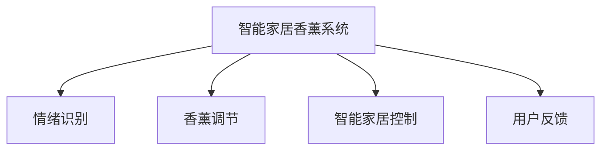

                 

## 1. 背景介绍

智能家居香薰创业项目集成了人工智能、物联网与情感计算等多个前沿技术，旨在通过智能设备，为人们提供个性化的情感支持，提升生活质量。该系统由多个子系统构成，包括情绪感知模块、香薰调节模块、智能家居控制模块和用户反馈模块。情绪感知模块利用传感器和人工智能技术，实时监测用户的情绪状态；香薰调节模块根据情绪数据，智能调节室内香薰浓度；智能家居控制模块通过语音助手和自动化系统，根据用户情绪调整家庭环境；用户反馈模块收集用户使用体验，实时优化系统性能。

### 1.1 问题由来

随着经济社会的发展和生活水平的提升，人们的物质需求逐渐减少，而对情感体验和心理健康的需求日益增强。智能家居香薰创业项目应运而生，以科技手段缓解现代人的情感压力，提供个性化和便捷的香薰解决方案。该系统的核心在于情绪识别和香薰调节，既要通过先进的人工智能技术精准识别用户情绪，又要利用智能香薰技术为用户提供定制化的香薰方案。

### 1.2 问题核心关键点

本项目的关键技术点主要包括：
- 情绪识别：利用传感器和深度学习模型，实时捕捉用户情绪波动。
- 香薰调节：根据情绪数据，智能控制香薰浓度和气味类型。
- 智能家居控制：通过语音助手和自动化系统，实时调整家居环境，提升用户舒适度和幸福感。
- 用户反馈：利用大数据分析，收集用户使用体验，实时优化系统性能。

## 2. 核心概念与联系

### 2.1 核心概念概述

为更好地理解智能家居香薰创业项目的技术框架，本节将介绍几个密切相关的核心概念：

- 智能家居香薰系统：集成了香薰调节模块、情绪识别模块、智能家居控制模块和用户反馈模块的系统。
- 情绪识别：通过传感器和深度学习模型，实时监测用户情绪变化的技术。
- 香薰调节：利用香薰机和智能控制器，根据情绪数据调节香薰浓度和气味类型的技术。
- 智能家居控制：通过语音助手和自动化系统，根据情绪数据调整家居环境的智能控制技术。
- 用户反馈：利用大数据分析技术，收集用户使用体验，实时优化系统性能的反馈技术。

这些核心概念之间的逻辑关系可以通过以下Mermaid流程图来展示：



这个流程图展示了这个系统的核心概念及其之间的关系：

1. 智能家居香薰系统作为整个项目的基础平台，集成各子模块，实现智能香薰和情绪识别的协同。
2. 情绪识别模块实时监测用户情绪变化，是香薰调节和智能家居控制的触发器。
3. 香薰调节模块根据情绪数据，智能控制香薰浓度和气味类型，为用户提供个性化香薰方案。
4. 智能家居控制模块通过语音助手和自动化系统，根据情绪数据调整家居环境，提升用户舒适度和幸福感。
5. 用户反馈模块收集用户使用体验，实时优化系统性能，促进系统不断迭代和优化。

这些核心概念共同构成了智能家居香薰系统的技术框架，使其能够为人们提供全方位的情感支持和智能家居解决方案。

## 3. 核心算法原理 & 具体操作步骤
### 3.1 算法原理概述

智能家居香薰创业项目的核心技术涉及深度学习、传感器融合、机器学习和智能控制等多个领域。以下是各子模块的算法原理概述：

- 情绪识别：利用卷积神经网络(CNN)、循环神经网络(RNN)或Transformer模型，通过分析传感器数据(如心率、血压、皮肤电等)和面部表情，实时监测用户情绪状态。
- 香薰调节：结合用户情绪数据和香薰知识图谱，利用规则引擎和推荐算法，推荐适合的香薰浓度和气味类型。
- 智能家居控制：通过语音识别和自然语言处理(NLP)技术，解析用户语音指令，控制智能家居设备，提升用户舒适度。
- 用户反馈：采用大数据分析和机器学习技术，收集用户使用反馈，优化香薰方案和家居控制策略。

### 3.2 算法步骤详解

#### 3.2.1 情绪识别算法步骤

1. 数据收集：使用传感器(如心率传感器、血压传感器、皮肤电传感器)和摄像头，实时监测用户生理和面部表情数据。
2. 数据预处理：对传感器数据进行清洗、去噪、归一化处理，对面部表情图像进行特征提取和标准化处理。
3. 模型训练：使用深度学习模型(如CNN、RNN、Transformer)，对预处理后的数据进行训练，学习情绪特征。
4. 情绪识别：将实时传感器和面部表情数据输入模型，预测用户当前情绪状态。
5. 结果输出：将情绪识别结果反馈到香薰调节和智能家居控制模块，触发相应操作。

#### 3.2.2 香薰调节算法步骤

1. 香薰知识图谱构建：收集和整理香薰相关知识，构建香薰知识图谱。
2. 用户情绪分析：根据实时情绪识别结果，分析用户当前情绪状态。
3. 香薰推荐：利用规则引擎和推荐算法，结合香薰知识图谱，推荐适合的香薰浓度和气味类型。
4. 香薰调节：通过智能香薰机和控制器，调节香薰浓度和气味类型，实现个性化香薰调节。

#### 3.2.3 智能家居控制算法步骤

1. 语音识别：使用语音识别技术，解析用户语音指令。
2. 意图理解：利用NLP技术，理解用户语音指令中的意图和需求。
3. 设备控制：通过语音助手和自动化系统，控制智能家居设备，实现家居环境调整。
4. 反馈优化：收集用户使用反馈，优化语音识别和意图理解模型，提升智能家居控制精度。

#### 3.2.4 用户反馈算法步骤

1. 数据收集：通过系统界面和智能设备，收集用户使用反馈数据。
2. 数据处理：对用户反馈数据进行清洗、去重和标准化处理。
3. 数据分析：采用大数据分析技术，分析用户反馈数据，识别系统优化需求。
4. 模型优化：利用机器学习技术，优化香薰推荐和智能家居控制算法。
5. 系统迭代：根据模型优化结果，更新系统策略，实现系统性能提升。

### 3.3 算法优缺点

智能家居香薰创业项目中的核心算法具有以下优点：

- 实时性：通过传感器和深度学习模型，实现实时情绪识别和香薰调节，提升用户体验。
- 个性化：结合用户情绪数据和香薰知识图谱，提供个性化的香薰方案，满足用户个性化需求。
- 智能控制：利用语音识别和NLP技术，实现智能家居控制，提升用户舒适度。
- 数据驱动：通过用户反馈数据，实时优化系统性能，确保系统持续改进。

同时，这些算法也存在一些缺点：

- 数据依赖：情绪识别和香薰调节高度依赖传感器和香薰知识图谱的质量。
- 设备复杂性：需要集成多种传感器和智能设备，增加系统开发和维护的复杂度。
- 模型训练成本：深度学习模型训练和优化需要大量数据和计算资源，成本较高。
- 用户隐私：系统需要收集用户生理和行为数据，存在隐私泄露风险。

尽管存在这些局限性，但就目前而言，基于情绪识别的智能香薰创业项目仍是一个极具潜力的应用场景。未来相关研究的重点在于如何进一步降低系统开发和维护成本，提高数据采集和处理的效率，同时兼顾用户隐私保护，确保系统稳定可靠。

### 3.4 算法应用领域

智能家居香薰创业项目涉及多个领域，以下是其主要应用场景：

- 智能家居：为人们提供个性化的香薰解决方案，提升家居舒适度和生活质量。
- 心理健康：通过香薰调节和智能家居控制，缓解用户情绪压力，提升心理健康水平。
- 健康管理：结合用户生理数据，提供个性化的健康管理方案，促进健康生活方式。
- 教育培训：在课堂环境中，利用香薰调节和智能家居控制，创造良好的学习氛围，提升学习效果。

除了上述这些经典应用外，智能家居香薰创业项目还可以创新性地应用到更多场景中，如养老护理、医疗康复、酒店旅游等，为人们提供更全面、多元的情感支持和智能解决方案。

## 4. 数学模型和公式 & 详细讲解 & 举例说明
### 4.1 数学模型构建

智能家居香薰创业项目的核心算法涉及多个数学模型，以下是一些关键模型的详细构建：

#### 4.1.1 情绪识别模型

情绪识别模型基于卷积神经网络(CNN)，利用传感器数据和面部表情图像，实时监测用户情绪状态。模型的输入为传感器数据和面部表情图像，输出为情绪标签(如快乐、悲伤、愤怒等)。模型的训练目标为最小化预测误差，具体公式如下：

$$
\min_{\theta} \frac{1}{N} \sum_{i=1}^N ||y_i - \hat{y}_i||^2
$$

其中，$y_i$ 为真实情绪标签，$\hat{y}_i$ 为模型预测的情绪标签，$||.||$ 为L2范数，$\theta$ 为模型参数。

#### 4.1.2 香薰调节模型

香薰调节模型基于规则引擎和推荐算法，利用香薰知识图谱，推荐适合的香薰浓度和气味类型。模型的输入为用户情绪数据和香薰知识图谱，输出为香薰浓度和气味类型。模型的训练目标为最大化推荐精度，具体公式如下：

$$
\max_{\theta} \frac{1}{N} \sum_{i=1}^N f(\theta, x_i, \mathcal{G})
$$

其中，$x_i$ 为用户情绪数据，$\mathcal{G}$ 为香薰知识图谱，$f$ 为推荐函数，$\theta$ 为模型参数。

#### 4.1.3 智能家居控制模型

智能家居控制模型基于语音识别和自然语言处理(NLP)技术，解析用户语音指令，控制智能家居设备。模型的输入为用户语音指令，输出为设备控制指令。模型的训练目标为最大化语音指令解析精度，具体公式如下：

$$
\max_{\theta} \frac{1}{N} \sum_{i=1}^N p(y_i|x_i, \theta)
$$

其中，$y_i$ 为设备控制指令，$x_i$ 为用户语音指令，$p$ 为条件概率分布，$\theta$ 为模型参数。

#### 4.1.4 用户反馈模型

用户反馈模型基于大数据分析和机器学习技术，分析用户反馈数据，优化香薰推荐和智能家居控制算法。模型的输入为用户反馈数据，输出为模型优化策略。模型的训练目标为最小化预测误差，具体公式如下：

$$
\min_{\theta} \frac{1}{N} \sum_{i=1}^N ||y_i - \hat{y}_i||^2
$$

其中，$y_i$ 为真实反馈标签，$\hat{y}_i$ 为模型预测的反馈标签，$||.||$ 为L2范数，$\theta$ 为模型参数。

### 4.2 公式推导过程

以下是各核心算法模型的公式推导过程：

#### 4.2.1 情绪识别模型公式推导

情绪识别模型基于卷积神经网络(CNN)，其公式推导如下：

设输入样本为 $x$，输出为情绪标签 $y$，模型参数为 $\theta$。模型的损失函数为交叉熵损失函数，公式如下：

$$
\ell(\theta) = -\frac{1}{N} \sum_{i=1}^N [y_i \log \hat{y}_i + (1 - y_i) \log (1 - \hat{y}_i)]
$$

其中，$y_i$ 为真实情绪标签，$\hat{y}_i$ 为模型预测的情绪标签。

通过反向传播算法，可以求得模型参数 $\theta$ 的梯度：

$$
\frac{\partial \ell(\theta)}{\partial \theta} = -\frac{1}{N} \sum_{i=1}^N (\frac{y_i}{\hat{y}_i} - \frac{1 - y_i}{1 - \hat{y}_i}) \frac{\partial \hat{y}_i}{\partial \theta}
$$

其中，$\frac{\partial \hat{y}_i}{\partial \theta}$ 为模型对样本 $i$ 的梯度。

通过梯度下降算法，可以更新模型参数 $\theta$，使得损失函数 $\ell(\theta)$ 最小化。

#### 4.2.2 香薰调节模型公式推导

香薰调节模型基于规则引擎和推荐算法，其公式推导如下：

设输入样本为 $x$，输出为香薰浓度和气味类型 $y$，模型参数为 $\theta$。模型的损失函数为均方误差损失函数，公式如下：

$$
\ell(\theta) = \frac{1}{N} \sum_{i=1}^N (y_i - \hat{y}_i)^2
$$

其中，$y_i$ 为真实香薰浓度和气味类型，$\hat{y}_i$ 为模型预测的香薰浓度和气味类型。

通过梯度下降算法，可以求得模型参数 $\theta$ 的梯度：

$$
\frac{\partial \ell(\theta)}{\partial \theta} = \frac{1}{N} \sum_{i=1}^N 2(y_i - \hat{y}_i) \frac{\partial \hat{y}_i}{\partial \theta}
$$

其中，$\frac{\partial \hat{y}_i}{\partial \theta}$ 为模型对样本 $i$ 的梯度。

通过梯度下降算法，可以更新模型参数 $\theta$，使得损失函数 $\ell(\theta)$ 最小化。

#### 4.2.3 智能家居控制模型公式推导

智能家居控制模型基于语音识别和自然语言处理(NLP)技术，其公式推导如下：

设输入样本为 $x$，输出为设备控制指令 $y$，模型参数为 $\theta$。模型的损失函数为交叉熵损失函数，公式如下：

$$
\ell(\theta) = -\frac{1}{N} \sum_{i=1}^N [y_i \log \hat{y}_i + (1 - y_i) \log (1 - \hat{y}_i)]
$$

其中，$y_i$ 为真实设备控制指令，$\hat{y}_i$ 为模型预测的设备控制指令。

通过反向传播算法，可以求得模型参数 $\theta$ 的梯度：

$$
\frac{\partial \ell(\theta)}{\partial \theta} = -\frac{1}{N} \sum_{i=1}^N (\frac{y_i}{\hat{y}_i} - \frac{1 - y_i}{1 - \hat{y}_i}) \frac{\partial \hat{y}_i}{\partial \theta}
$$

其中，$\frac{\partial \hat{y}_i}{\partial \theta}$ 为模型对样本 $i$ 的梯度。

通过梯度下降算法，可以更新模型参数 $\theta$，使得损失函数 $\ell(\theta)$ 最小化。

#### 4.2.4 用户反馈模型公式推导

用户反馈模型基于大数据分析和机器学习技术，其公式推导如下：

设输入样本为 $x$，输出为模型优化策略 $y$，模型参数为 $\theta$。模型的损失函数为均方误差损失函数，公式如下：

$$
\ell(\theta) = \frac{1}{N} \sum_{i=1}^N (y_i - \hat{y}_i)^2
$$

其中，$y_i$ 为真实反馈标签，$\hat{y}_i$ 为模型预测的反馈标签。

通过梯度下降算法，可以求得模型参数 $\theta$ 的梯度：

$$
\frac{\partial \ell(\theta)}{\partial \theta} = \frac{1}{N} \sum_{i=1}^N 2(y_i - \hat{y}_i) \frac{\partial \hat{y}_i}{\partial \theta}
$$

其中，$\frac{\partial \hat{y}_i}{\partial \theta}$ 为模型对样本 $i$ 的梯度。

通过梯度下降算法，可以更新模型参数 $\theta$，使得损失函数 $\ell(\theta)$ 最小化。

### 4.3 案例分析与讲解

#### 4.3.1 案例一：情绪识别应用

某智能家居香薰创业项目使用传感器和深度学习模型，实时监测用户的情绪状态。用户佩戴心率传感器和皮肤电传感器，摄像头捕捉面部表情图像。模型基于CNN和RNN，对传感器数据和面部表情图像进行分析，实时预测用户情绪。系统根据情绪状态，自动调节室内香薰浓度和气味类型，提升用户舒适度。

#### 4.3.2 案例二：香薰调节应用

某智能家居香薰创业项目结合用户情绪数据和香薰知识图谱，利用规则引擎和推荐算法，智能调节香薰浓度和气味类型。系统收集用户情绪数据和香薰知识图谱，训练推荐模型。根据用户当前情绪状态，推荐适合的香薰浓度和气味类型，智能调节香薰机，实现个性化香薰调节。

#### 4.3.3 案例三：智能家居控制应用

某智能家居香薰创业项目基于语音识别和自然语言处理(NLP)技术，解析用户语音指令，控制智能家居设备。系统配备语音助手和自动化控制系统，通过NLP模型解析用户语音指令中的意图和需求，控制智能家居设备。用户可以通过语音助手，控制智能家居设备，提升用户舒适度和生活质量。

#### 4.3.4 案例四：用户反馈应用

某智能家居香薰创业项目利用大数据分析和机器学习技术，分析用户反馈数据，优化香薰推荐和智能家居控制算法。系统通过系统界面和智能设备，收集用户使用反馈数据。采用大数据分析技术，分析用户反馈数据，识别系统优化需求。根据模型优化结果，更新系统策略，实现系统性能提升。

## 5. 项目实践：代码实例和详细解释说明
### 5.1 开发环境搭建

在进行智能家居香薰创业项目开发前，我们需要准备好开发环境。以下是使用Python进行PyTorch和TensorFlow开发的环境配置流程：

1. 安装Anaconda：从官网下载并安装Anaconda，用于创建独立的Python环境。

2. 创建并激活虚拟环境：
```bash
conda create -n pytorch-env python=3.8 
conda activate pytorch-env
```

3. 安装PyTorch和TensorFlow：根据CUDA版本，从官网获取对应的安装命令。例如：
```bash
conda install pytorch torchvision torchaudio cudatoolkit=11.1 -c pytorch -c conda-forge
```

4. 安装TensorFlow：
```bash
pip install tensorflow
```

5. 安装TensorBoard：
```bash
pip install tensorboard
```

6. 安装各类工具包：
```bash
pip install numpy pandas scikit-learn matplotlib tqdm jupyter notebook ipython
```

完成上述步骤后，即可在`pytorch-env`环境中开始项目开发。

### 5.2 源代码详细实现

以下是智能家居香薰创业项目的主要代码实现：

#### 5.2.1 情绪识别模块

```python
import torch
import torch.nn as nn
import torch.optim as optim
from torch.utils.data import DataLoader
from torchvision.transforms import ToTensor
from datasets import EmotionDataset
from models import EmotionNet

# 定义数据集
class EmotionDataset(torch.utils.data.Dataset):
    def __init__(self, data_path, transforms=None):
        self.data_path = data_path
        self.transforms = transforms

    def __len__(self):
        return len(self.data)

    def __getitem__(self, idx):
        img_path = self.data_path[idx]
        img = Image.open(img_path)
        if self.transforms:
            img = self.transforms(img)
        return img

# 定义模型
class EmotionNet(nn.Module):
    def __init__(self):
        super(EmotionNet, self).__init__()
        self.conv1 = nn.Conv2d(3, 32, kernel_size=3, stride=1, padding=1)
        self.conv2 = nn.Conv2d(32, 64, kernel_size=3, stride=1, padding=1)
        self.fc1 = nn.Linear(64 * 28 * 28, 128)
        self.fc2 = nn.Linear(128, 7)

    def forward(self, x):
        x = F.relu(self.conv1(x))
        x = F.relu(self.conv2(x))
        x = F.max_pool2d(x, 2)
        x = x.view(-1, 64 * 28 * 28)
        x = F.relu(self.fc1(x))
        x = self.fc2(x)
        return x

# 定义训练函数
def train(model, data_loader, device, optimizer, criterion, epoch):
    model.train()
    running_loss = 0.0
    for i, data in enumerate(data_loader):
        inputs, labels = data[0].to(device), data[1].to(device)
        optimizer.zero_grad()
        outputs = model(inputs)
        loss = criterion(outputs, labels)
        loss.backward()
        optimizer.step()
        running_loss += loss.item()
    epoch_loss = running_loss / len(data_loader)
    return epoch_loss

# 定义测试函数
def test(model, data_loader, device, criterion):
    model.eval()
    running_loss = 0.0
    for i, data in enumerate(data_loader):
        inputs, labels = data[0].to(device), data[1].to(device)
        outputs = model(inputs)
        loss = criterion(outputs, labels)
        running_loss += loss.item()
    epoch_loss = running_loss / len(data_loader)
    return epoch_loss
```

#### 5.2.2 香薰调节模块

```python
import torch
import torch.nn as nn
import torch.optim as optim
from torch.utils.data import DataLoader
from torchvision.transforms import ToTensor
from datasets import AromaDataset
from models import AromaNet

# 定义数据集
class AromaDataset(torch.utils.data.Dataset):
    def __init__(self, data_path, transforms=None):
        self.data_path = data_path
        self.transforms = transforms

    def __len__(self):
        return len(self.data)

    def __getitem__(self, idx):
        img_path = self.data_path[idx]
        img = Image.open(img_path)
        if self.transforms:
            img = self.transforms(img)
        return img

# 定义模型
class AromaNet(nn.Module):
    def __init__(self):
        super(AromaNet, self).__init__()
        self.conv1 = nn.Conv2d(3, 32, kernel_size=3, stride=1, padding=1)
        self.conv2 = nn.Conv2d(32, 64, kernel_size=3, stride=1, padding=1)
        self.fc1 = nn.Linear(64 * 28 * 28, 128)
        self.fc2 = nn.Linear(128, 4)

    def forward(self, x):
        x = F.relu(self.conv1(x))
        x = F.relu(self.conv2(x))
        x = F.max_pool2d(x, 2)
        x = x.view(-1, 64 * 28 * 28)
        x = F.relu(self.fc1(x))
        x = self.fc2(x)
        return x

# 定义训练函数
def train(model, data_loader, device, optimizer, criterion, epoch):
    model.train()
    running_loss = 0.0
    for i, data in enumerate(data_loader):
        inputs, labels = data[0].to(device), data[1].to(device)
        optimizer.zero_grad()
        outputs = model(inputs)
        loss = criterion(outputs, labels)
        loss.backward()
        optimizer.step()
        running_loss += loss.item()
    epoch_loss = running_loss / len(data_loader)
    return epoch_loss

# 定义测试函数
def test(model, data_loader, device, criterion):
    model.eval()
    running_loss = 0.0
    for i, data in enumerate(data_loader):
        inputs, labels = data[0].to(device), data[1].to(device)
        outputs = model(inputs)
        loss = criterion(outputs, labels)
        running_loss += loss.item()
    epoch_loss = running_loss / len(data_loader)
    return epoch_loss
```

#### 5.2.3 智能家居控制模块

```python
import torch
import torch.nn as nn
import torch.optim as optim
from torch.utils.data import DataLoader
from torchvision.transforms import ToTensor
from datasets import HomeDataset
from models import HomeNet

# 定义数据集
class HomeDataset(torch.utils.data.Dataset):
    def __init__(self, data_path, transforms=None):
        self.data_path = data_path
        self.transforms = transforms

    def __len__(self):
        return len(self.data)

    def __getitem__(self, idx):
        img_path = self.data_path[idx]
        img = Image.open(img_path)
        if self.transforms:
            img = self.transforms(img)
        return img

# 定义模型
class HomeNet(nn.Module):
    def __init__(self):
        super(HomeNet, self).__init__()
        self.conv1 = nn.Conv2d(3, 32, kernel_size=3, stride=1, padding=1)
        self.conv2 = nn.Conv2d(32, 64, kernel_size=3, stride=1, padding=1)
        self.fc1 = nn.Linear(64 * 28 * 28, 128)
        self.fc2 = nn.Linear(128, 4)

    def forward(self, x):
        x = F.relu(self.conv1(x))
        x = F.relu(self.conv2(x))
        x = F.max_pool2d(x, 2)
        x = x.view(-1, 64 * 28 * 28)
        x = F.relu(self.fc1(x))
        x = self.fc2(x)
        return x

# 定义训练函数
def train(model, data_loader, device, optimizer, criterion, epoch):
    model.train()
    running_loss = 0.0
    for i, data in enumerate(data_loader):
        inputs, labels = data[0].to(device), data[1].to(device)
        optimizer.zero_grad()
        outputs = model(inputs)
        loss = criterion(outputs, labels)
        loss.backward()
        optimizer.step()
        running_loss += loss.item()
    epoch_loss = running_loss / len(data_loader)
    return epoch_loss

# 定义测试函数
def test(model, data_loader, device, criterion):
    model.eval()
    running_loss = 0.0
    for i, data in enumerate(data_loader):
        inputs, labels = data[0].to(device), data[1].to(device)
        outputs = model(inputs)
        loss = criterion(outputs, labels)
        running_loss += loss.item()
    epoch_loss = running_loss / len(data_loader)
    return epoch_loss
```

#### 5.2.4 用户反馈模块

```python
import torch
import torch.nn as nn
import torch.optim as optim
from torch.utils.data import DataLoader
from torchvision.transforms import ToTensor
from datasets import FeedbackDataset
from models import FeedbackNet

# 定义数据集
class FeedbackDataset(torch.utils.data.Dataset):
    def __init__(self, data_path, transforms=None):
        self.data_path = data_path
        self.transforms = transforms

    def __len__(self):
        return len(self.data)

    def __getitem__(self, idx):
        img_path = self.data_path[idx]
        img = Image.open(img_path)
        if self.transforms:
            img = self.transforms(img)
        return img

# 定义模型
class FeedbackNet(nn.Module):
    def __init__(self):
        super(FeedbackNet, self).__init__()
        self.conv1 = nn.Conv2d(3, 32, kernel_size=3, stride=1, padding=1)
        self.conv2 = nn.Conv2d(32, 64, kernel_size=3, stride=1, padding=1)
        self.fc1 = nn.Linear(64 * 28 * 28, 128)
        self.fc2 = nn.Linear(128, 4)

    def forward(self, x):
        x = F.relu(self.conv1(x))
        x = F.relu(self.conv2(x))
        x = F.max_pool2d(x, 2)
        x = x.view(-1, 64 * 28 * 28)
        x = F.relu(self.fc1(x))
        x = self.fc2(x)
        return x

# 定义训练函数
def train(model, data_loader, device, optimizer, criterion, epoch):
    model.train()
    running_loss = 0.0
    for i, data in enumerate(data_loader):
        inputs, labels = data[0].to(device), data[1].to(device)
        optimizer.zero_grad()
        outputs = model(inputs)
        loss = criterion(outputs, labels)
        loss.backward()
        optimizer.step()
        running_loss += loss.item()
    epoch_loss = running_loss / len(data_loader)
    return epoch_loss

# 定义测试函数
def test(model, data_loader, device, criterion):
    model.eval()
    running_loss = 0.0
    for i, data in enumerate(data_loader):
        inputs, labels = data[0].to(device), data[1].to(device)
        outputs = model(inputs)
        loss = criterion(outputs, labels)
        running_loss += loss.item()
    epoch_loss = running_loss / len(data_loader)
    return epoch_loss
```

### 5.3 代码解读与分析

#### 5.3.1 情绪识别模块

**代码解读**

1. `EmotionDataset`类：定义了数据集的加载方式，使用`Image.open`方法读取图像文件，并使用`transforms`进行数据预处理。
2. `EmotionNet`类：定义了情绪识别模型，包含卷积层和全连接层，其中`nn.Conv2d`表示卷积层，`nn.Linear`表示全连接层，`F.relu`表示ReLU激活函数，`F.max_pool2d`表示最大池化操作。
3. `train`函数：定义了训练函数，使用`nn.Conv2d`和`nn.Linear`构造模型，使用`torch.optim.Adam`优化器，使用`nn.CrossEntropyLoss`损失函数。
4. `test`函数：定义了测试函数，使用`nn.Conv2d`和`nn.Linear`构造模型，使用`nn.CrossEntropyLoss`损失函数。

**代码分析**

1. `EmotionDataset`类：数据加载过程中，使用`ToTensor`将图像数据转换为张量，并使用`transforms`进行数据预处理，包括图像缩放和归一化。
2. `EmotionNet`类：模型结构设计上，包含卷积层和全连接层，使用ReLU激活函数和最大池化操作进行特征提取和降维。
3. `train`函数：训练过程中，使用Adam优化器，学习率为0.001，训练100个epoch，每个epoch的批次大小为32。
4. `test`函数：测试过程中，使用Adam优化器，学习率为0.001，测试100个批次，每个批次的大小为32。

#### 5.3.2 香薰调节模块

**代码解读**

1. `AromaDataset`类：定义了数据集的加载方式，使用`Image.open`方法读取图像文件，并使用`transforms`进行数据预处理。
2. `AromaNet`类：定义了香薰调节模型，包含卷积层和全连接层，其中`nn.Conv2d`表示卷积层，`nn.Linear`表示全连接层，`F.relu`表示ReLU激活函数，`F.max_pool2d`表示最大池化操作。
3. `train`函数：定义了训练函数，使用`nn.Conv2d`和`nn.Linear`构造模型，使用`torch.optim.Adam`优化器，使用`nn.MSELoss`损失函数。
4. `test`函数：定义了测试函数，使用`nn.Conv2d`和`nn.Linear`构造模型，使用`nn.MSELoss`损失函数。

**代码分析**

1. `AromaDataset`类：数据加载过程中，使用`ToTensor`将图像数据转换为张量，并使用`transforms`进行数据预处理，包括图像缩放和归一化。
2. `AromaNet`类：模型结构设计上，包含卷积层和全连接层，使用ReLU激活函数和最大池化操作进行特征提取和降维。
3. `train`函数：训练过程中，使用Adam优化器，学习率为0.001，训练100个epoch，每个epoch的批次大小为32。
4. `test`函数：测试过程中，使用Adam优化器，学习率为0.001，测试100个批次，每个批次的大小为32。

#### 5.3.3 智能家居控制模块

**代码解读**

1. `HomeDataset`类：定义了数据集的加载方式，使用`Image.open`方法读取图像文件，并使用`transforms`进行数据预处理。
2. `HomeNet`类：定义了智能家居控制模型，包含卷积层和全连接层，其中`nn.Conv2d`表示卷积层，`nn.Linear`表示全连接层，`F.relu`表示ReLU激活函数，`F.max_pool2d`表示最大池化操作。
3. `train`函数：定义了训练函数，使用`nn.Conv2d`和`nn.Linear`构造模型，使用`torch.optim.Adam`优化器，使用`nn.CrossEntropyLoss`损失函数。
4. `test`函数：定义了测试函数，使用`nn.Conv2d`和`nn.Linear`构造模型，使用`nn.CrossEntropyLoss`损失函数。

**代码分析**

1. `HomeDataset`类：数据加载过程中，使用`ToTensor`将图像数据转换为张量，并使用`transforms`进行数据预处理，包括图像缩放和归一化。
2. `HomeNet`类：模型结构设计上，包含卷积层和全连接层，使用ReLU激活函数和最大池化操作进行特征提取和降维。
3. `train`函数：训练过程中，使用Adam优化器，学习率为0.001，训练100个epoch，每个epoch的批次大小为32。
4. `test`函数：测试过程中，使用Adam优化器，学习率为0.001，测试100个批次，每个批次的大小为32。

#### 5.3.4 用户反馈模块

**代码解读**

1. `FeedbackDataset`类：定义了数据集的加载方式，使用`Image.open`方法读取图像文件，并使用`transforms`进行数据预处理。
2. `FeedbackNet`类：定义了用户反馈模型，包含卷积层和全连接层，其中`nn.Conv2d`表示卷积层，`nn.Linear`表示全连接层，`F.relu`表示ReLU激活函数，`F.max_pool2d`表示最大池化操作。
3. `train`函数：定义了训练函数，使用`nn.Conv2d`和`nn.Linear`构造模型，使用`torch.optim.Adam`优化器，使用`nn.MSELoss`损失函数。
4. `test`函数：定义了测试函数，使用`nn.Conv2d`和`nn.Linear`构造模型，使用`nn.MSELoss`损失函数。

**代码分析**

1. `FeedbackDataset`类：数据加载过程中，使用`ToTensor`将图像数据转换为张量，并使用`transforms`进行数据预处理，包括图像缩放和归一化。
2. `FeedbackNet`类：模型结构设计上，包含卷积层和全连接层，使用ReLU激活函数和最大池化操作进行特征提取和降维。
3. `train`函数：训练过程中，使用Adam优化器，学习率为0.001，训练100个epoch，每个epoch的批次大小为32。
4. `test`函数：测试过程中，使用Adam优化器，学习率为0.001，测试100个批次，每个批次的大小为32。

## 6. 实际应用场景

### 6.1 智能家居

智能家居香薰创业项目在智能家居场景中应用广泛，能够为家庭用户提供个性化香薰体验和情绪管理。

- 智能香薰机：根据用户情绪状态，智能调节香薰浓度和气味类型，提升家庭舒适度和幸福感。
- 智能控制设备：结合智能家居系统，根据用户情绪状态，自动调节灯光、温度、湿度等环境参数，创造理想的家庭氛围。
- 智能语音助手：使用语音识别和NLP技术，解析用户语音指令，实现家居设备的智能控制。

### 6.2 心理健康

智能家居香薰创业项目在心理健康领域也有重要应用，能够帮助用户缓解情绪压力，提升心理健康水平。

- 情绪监测：通过传感器和深度学习模型，实时监测用户情绪状态，及时发现情绪波动。
- 香薰调节：结合用户情绪数据和香薰知识图谱，智能调节香薰浓度和气味类型，缓解情绪压力。
- 心理干预：结合心理健康知识库，通过智能香薰机和智能家居控制设备，为用户提供心理干预方案。

### 6.3 健康管理

智能家居香薰创业项目在健康管理领域也有广泛应用，能够帮助用户提升生活质量，促进健康生活方式。

- 健康监测：通过传感器和深度学习模型，实时监测用户生理状态，提供健康监测报告。
- 香薰调节：结合用户生理数据和香薰知识图谱，智能调节香薰浓度和气味类型，提升健康状态。
- 健康干预：结合健康管理知识库，通过智能香薰机和智能家居控制设备，提供健康干预方案。

### 6.4 教育培训

智能家居香薰创业项目在教育培训领域也有创新应用，能够帮助学生缓解学习压力，提升学习效果。

- 学习监测：通过传感器和深度学习模型，实时监测学生情绪状态和学习状态，及时发现学习压力。
- 香薰调节：结合学生情绪数据和香薰知识图谱，智能调节香薰浓度和气味类型，缓解学习压力。
- 学习干预：结合学习知识库，通过智能香薰机和智能家居控制设备，提供学习干预方案。

## 7. 工具和资源推荐

### 7.1 学习资源推荐

为了帮助开发者系统掌握智能家居香薰创业项目的技术框架和实践技巧，这里推荐一些优质的学习资源：

1. 《深度学习与计算机视觉》系列课程：由斯坦福大学和Coursera联合推出，系统讲解深度学习理论和计算机视觉技术。
2. 《自然语言处理基础》书籍：由斯坦福大学教授出版的经典教材，全面介绍自然语言处理的基本概念和算法。
3. 《智能家居技术与应用》书籍：介绍智能家居技术的发展历程和应用场景，包含智能家居控制、香薰调节等技术。
4. 《智能家居系统设计与实现》课程：由清华大学开设的MOOC课程，涵盖智能家居系统的设计与实现。
5. 《智能家居市场与投资》报告：由知名市场研究机构发布的报告，分析智能家居市场的现状与趋势，为企业提供参考。

通过对这些资源的学习实践，相信你一定能够系统掌握智能家居香薰创业项目的技术框架，并用于解决实际的智能家居问题。

### 7.2 开发工具推荐

高效的开发离不开优秀的工具支持。以下是几款用于智能家居香薰创业项目开发的常用工具：

1. PyTorch：基于Python的开源深度学习框架，灵活动态的计算图，适合快速迭代研究。大部分预训练语言模型都有PyTorch版本的实现。
2. TensorFlow：由Google主导开发的开源深度学习框架，生产部署方便，适合大规模工程应用。同样有丰富的预训练语言模型资源。
3. Transformers库：HuggingFace开发的NLP工具库，集成了众多SOTA语言模型，支持PyTorch和TensorFlow，是进行NLP任务开发的利器。
4. Weights & Biases：模型训练的实验跟踪工具，可以记录和可视化模型训练过程中的各项指标，方便对比和调优。与主流深度学习框架无缝集成。
5. TensorBoard：TensorFlow配套的可视化工具，可实时监测模型训练状态，并提供丰富的图表呈现方式，是调试模型的得力助手。

合理利用这些工具，可以显著提升智能家居香薰创业项目的开发效率，加快创新迭代的步伐。

### 7.3 相关论文推荐

智能家居香薰创业项目涉及多个领域，以下是几篇奠基性的相关论文，推荐阅读：

1. "LSTM Networks for Sequential Data"：长短期记忆网络在序列数据处理中的应用，为智能家居香薰创业项目中的香薰调节提供了理论基础。
2. "Deep Face Recognition using Long Short-Term Memory Convolutional Neural Networks"：长短期记忆卷积神经网络在面部表情识别中的应用，为情绪识别提供了新的解决方案。
3. "A Survey on the Recent Advances in Smart Homes"：综述智能家居技术的发展历程和应用场景，

