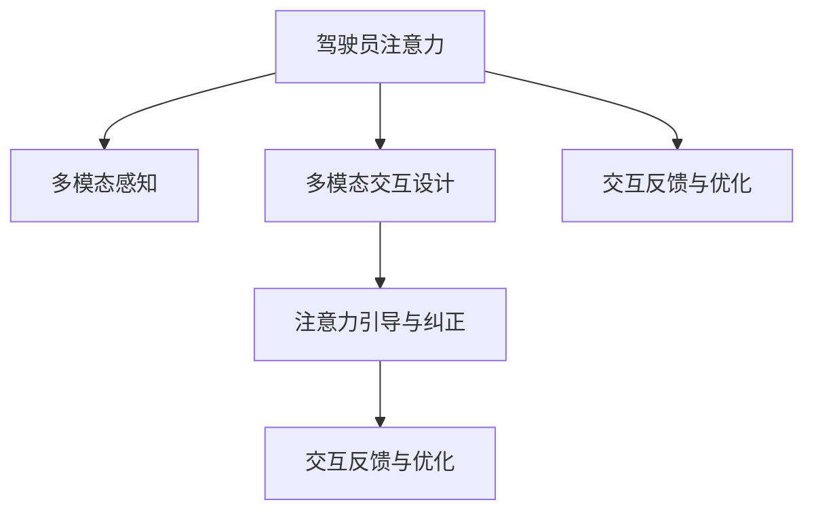

                 

## 1. 背景介绍

### 1.1 问题由来

随着自动驾驶技术的发展，智能汽车驾驶舱已成为连接人与车的重要交互界面，承载了驾驶决策、信息娱乐、导航定位等功能。然而，如何在驾驶舱中有效管理驾驶员的注意力，避免驾驶员在驾驶过程中分心，成为当前智能汽车设计中的一大挑战。

传统驾驶舱设计通常依赖物理结构（如仪表盘、中控屏幕等）吸引驾驶员注意，但由于驾驶员需求多样、驾驶情境复杂，物理结构往往难以满足所有场景需求，导致分心驾驶行为频发。据统计，因分心驾驶引发的交通事故约占全部交通事故的10%以上，成为引发交通事故的主要原因之一。

### 1.2 问题核心关键点

为了有效管理驾驶员的注意力，智能汽车驾驶舱需要开发一套系统化的注意力管理系统。该系统应具备以下几个核心功能：
1. **多模态感知与分析**：通过多传感器获取驾驶员行为数据，并进行智能分析，识别驾驶员注意力状态。
2. **多模态交互设计**：利用多模态界面设计，以自然的交互方式引导驾驶员注意力，增强交互体验。
3. **注意力引导与纠正**：基于注意力状态实时调整驾驶舱内容，辅助驾驶员集中注意力，并在驾驶员注意力分散时进行适当干预。
4. **交互反馈与优化**：建立驾驶员反馈机制，持续优化注意力管理策略。

### 1.3 问题研究意义

智能汽车驾驶舱的注意力管理系统，对提升驾驶安全性、增强驾驶体验、降低交通事故具有重要意义：

1. **安全保障**：通过实时监控驾驶员注意力状态，及时发现并纠正分心行为，降低交通事故风险。
2. **用户体验**：通过智能引导驾驶员注意力，提升信息交互的流畅性和便捷性，改善驾驶体验。
3. **交通效率**：避免驾驶员分心，减少事故发生率，提升道路交通效率。
4. **技术创新**：结合人工智能、人机交互、认知心理学等前沿技术，推动驾驶舱设计的智能化、个性化发展。

## 2. 核心概念与联系

### 2.1 核心概念概述

为更好地理解智能汽车驾驶舱的注意力管理系统，本节将介绍几个密切相关的核心概念：

- **驾驶员注意力**：驾驶员在驾驶过程中的注意力集中程度，涵盖视觉、听觉、身体行为等多个维度。
- **多模态感知**：通过多种传感器（如摄像头、雷达、红外传感器等）获取多维度的驾驶员行为数据。
- **多模态交互设计**：结合视觉、听觉、触觉等多种感官通道，设计自然、友好的交互界面。
- **注意力引导与纠正**：基于驾驶员注意力状态，动态调整驾驶舱内容，辅助驾驶员集中注意力。
- **交互反馈与优化**：收集驾驶员对驾驶舱交互的反馈信息，持续改进注意力管理策略。

这些核心概念之间的逻辑关系可以通过以下Mermaid流程图来展示：



这个流程图展示驾驶员注意力管理系统的主要逻辑流程：

1. 通过多模态感知获取驾驶员注意力状态。
2. 利用多模态交互设计，自然引导驾驶员注意力。
3. 根据注意力状态，动态调整驾驶舱内容，辅助驾驶员集中注意力。
4. 通过交互反馈与优化，持续改进系统策略。

## 3. 核心算法原理 & 具体操作步骤
### 3.1 算法原理概述

智能汽车驾驶舱的注意力管理系统，本质上是一个基于多模态感知与分析的智能交互系统。其核心思想是：通过多种传感器实时监测驾驶员行为，结合人工智能算法进行分析，动态调整驾驶舱内容，引导驾驶员注意力。

形式化地，假设驾驶员注意力状态为 $A_t$，当前驾驶舱内容为 $C_t$。注意力管理系统通过多模态感知器 $P$ 获取驾驶员当前行为数据 $D_t$，并基于 $D_t$ 和历史注意力数据 $A_{t-1}$ 计算出 $A_t$。然后，根据 $A_t$ 动态调整 $C_t$，以引导驾驶员注意力。

### 3.2 算法步骤详解

智能汽车驾驶舱的注意力管理系统一般包括以下几个关键步骤：

**Step 1: 多模态感知与分析**
- 收集驾驶员的多模态数据，包括摄像头图像、雷达回波、车内传感器数据等。
- 利用传感器融合算法（如卡尔曼滤波、粒子滤波等）对多模态数据进行融合，得到统一的驾驶员行为数据。
- 使用注意力模型对驾驶员行为数据进行分析，识别出驾驶员的注意力状态。

**Step 2: 多模态交互设计**
- 根据驾驶员注意力状态，设计多种交互方式，如视觉提示、语音指令、触觉反馈等。
- 设计友好的交互界面，如车载屏幕、语音助手、仪表盘等，确保交互过程自然、流畅。

**Step 3: 注意力引导与纠正**
- 根据驾驶员注意力状态，动态调整驾驶舱内容。如在驾驶员注意力分散时，降低信息复杂度，或自动触发提醒。
- 当驾驶员注意力集中时，可以适当增加信息密度，以提升驾驶舱信息传递效率。

**Step 4: 交互反馈与优化**
- 收集驾驶员对驾驶舱交互的反馈信息，如点击、调节等操作。
- 通过模型训练等方法，持续优化注意力管理策略，使其更好地适应驾驶员需求。

### 3.3 算法优缺点

智能汽车驾驶舱的注意力管理系统具有以下优点：
1. 实时性高。通过多模态感知和实时分析，系统能够快速响应驾驶员注意力状态，提供及时引导和纠正。
2. 用户体验好。结合多模态交互设计，提供自然、友好的驾驶舱交互方式，提升用户满意度。
3. 灵活性高。多模态感知和交互设计能够适应多种驾驶情境，满足不同驾驶员的需求。
4. 安全性提升。及时发现并纠正驾驶员分心行为，降低交通事故风险。

同时，该系统也存在一些局限性：
1. 硬件复杂。多模态感知和交互设计涉及多种传感器和设备，硬件成本和集成难度较高。
2. 数据处理量大。多模态数据实时采集和分析需要较强的计算能力，可能导致系统延迟。
3. 模型训练复杂。注意力管理系统的优化需要大量的驾驶员行为数据和反馈信息，模型训练过程较为复杂。
4. 用户体验差异大。不同驾驶员对驾驶舱交互的偏好可能存在较大差异，系统需要兼顾不同用户的需求。

尽管存在这些局限性，但智能汽车驾驶舱的注意力管理系统在提升驾驶安全性、改善用户体验、降低交通事故方面具有重要价值，值得深入研究。

### 3.4 算法应用领域

智能汽车驾驶舱的注意力管理系统，可以广泛应用于多种驾驶情境和应用场景：

1. **长途驾驶**：通过动态调整驾驶舱内容，降低驾驶员的疲劳感，提升长途驾驶的舒适性和安全性。
2. **城市驾驶**：利用多模态交互设计，辅助驾驶员在复杂的城市环境中高效导航。
3. **自动驾驶**：在自动驾驶过程中，通过持续监控驾驶员注意力，确保驾驶员随时准备接管。
4. **应急场景**：在紧急情况下，通过视觉和声音提示，确保驾驶员注意力集中在安全操作上。
5. **娱乐与信息**：结合多模态交互设计，提供丰富的娱乐内容和信息服务，提升驾驶舱的趣味性和实用性。

## 4. 数学模型和公式 & 详细讲解  
### 4.1 数学模型构建

本节将使用数学语言对智能汽车驾驶舱的注意力管理系统进行更加严格的刻画。

假设驾驶员注意力状态 $A_t$ 由视觉注意力 $A_{t,v}$、听觉注意力 $A_{t,a}$ 和身体注意力 $A_{t,b}$ 组成，其中 $A_{t,v}, A_{t,a}, A_{t,b} \in [0,1]$。多模态感知器 $P$ 获取驾驶员当前行为数据 $D_t$，并结合历史注意力数据 $A_{t-1}$ 计算出当前的注意力状态 $A_t$：

$$
A_t = f(D_t, A_{t-1})
$$

其中 $f$ 为注意力计算模型。假设 $D_t$ 包含摄像头图像 $I_t$ 和车内传感器数据 $S_t$，则 $A_t$ 的计算公式如下：

$$
A_t = \alpha_v f_v(I_t) + \alpha_a f_a(D_t) + \alpha_b f_b(S_t)
$$

其中 $\alpha_v, \alpha_a, \alpha_b$ 为注意力状态对视觉、听觉、身体行为的权重。

### 4.2 公式推导过程

以下我们以视觉注意力为例，推导基于摄像头图像的注意力计算模型。

假设摄像头图像 $I_t$ 由多个关键区域组成，每个区域的注意力权重为 $w_i \in [0,1]$，则视觉注意力的计算公式如下：

$$
A_{t,v} = \sum_{i=1}^n w_i f_i(I_{t,i})
$$

其中 $f_i(I_{t,i})$ 为区域 $i$ 的注意力得分函数，如高斯分布概率密度函数、边缘检测等。通过优化权重 $w_i$ 和得分函数 $f_i$，可以更准确地识别驾驶员的视觉注意力状态。

类似地，听觉注意力和身体注意力也可以采用类似的模型进行计算。多模态感知器 $P$ 的输出为驾驶员注意力状态 $A_t$，可通过注意力计算模型 $f$ 进行后续分析。

### 4.3 案例分析与讲解

以某智能汽车驾驶舱系统为例，展示注意力管理的实际应用：

**案例背景**：某驾驶舱系统集成有摄像头、雷达、车内传感器等多种传感器，通过多模态感知获取驾驶员行为数据。系统根据驾驶员注意力状态，动态调整驾驶舱内容。例如，在驾驶员注意力分散时，降低信息复杂度，并自动触发视觉和声音提示。

**系统实现**：
1. 多模态感知：摄像头获取驾驶员面部图像，雷达检测车道和前方障碍物，车内传感器监测驾驶员姿态和视线方向。
2. 注意力计算：通过摄像头图像识别驾驶员面部表情和视线方向，结合雷达数据和车内传感器数据，计算出驾驶员注意力状态。
3. 多模态交互：驾驶员注意力状态实时传入驾驶舱系统，系统根据注意力状态调整驾驶舱内容。例如，在驾驶员注意力分散时，降低仪表盘信息复杂度，增加声音提示；在驾驶员注意力集中时，增加仪表盘信息密度。
4. 交互反馈：驾驶员点击仪表盘上的按钮、调节音量等操作，系统记录反馈信息，持续优化注意力管理策略。

通过以上步骤，该驾驶舱系统能够实时监控驾驶员注意力状态，动态调整驾驶舱内容，辅助驾驶员集中注意力，提升驾驶安全性。

## 5. 项目实践：代码实例和详细解释说明
### 5.1 开发环境搭建

在进行驾驶舱注意力管理系统开发前，我们需要准备好开发环境。以下是使用Python进行开发的常见环境配置流程：

1. 安装Anaconda：从官网下载并安装Anaconda，用于创建独立的Python环境。

2. 创建并激活虚拟环境：
```bash
conda create -n driver disrespect python=3.8 
conda activate driver_disrespect
```

3. 安装相关库：
```bash
pip install opencv-python opencv-contrib-python numpy matplotlib
```

4. 安装其他工具：
```bash
pip install tqdm
```

5. 安装PyTorch：
```bash
pip install torch torchvision
```

完成上述步骤后，即可在 `driver_disrespect` 环境中开始开发。

### 5.2 源代码详细实现

下面以摄像头图像分析为例，展示基于摄像头图像的注意力计算模型实现。

```python
import cv2
import numpy as np
import matplotlib.pyplot as plt
from torchvision.transforms import ToTensor, CenterCrop, Resize

class DriverAttentionModel:
    def __init__(self):
        self.model = self.load_model()

    def load_model(self):
        model = torch.load('model.pkl')
        return model

    def process_image(self, image_path):
        image = cv2.imread(image_path)
        gray = cv2.cvtColor(image, cv2.COLOR_BGR2GRAY)
        face_cascade = cv2.CascadeClassifier('haarcascade_frontalface_default.xml')
        faces = face_cascade.detectMultiScale(gray, scaleFactor=1.1, minNeighbors=5, minSize=(30, 30))

        if len(faces) > 0:
            face = faces[0]
            face_roi = gray[face[1]:face[1]+face[3], face[0]:face[0]+face[2]]
            face_roi = cv2.resize(face_roi, (128, 128))
            face_roi = ToTensor()(center_crop(face_roi, 128))
            face_roi = face_roi.unsqueeze(0)
            with torch.no_grad():
                face_roi = self.model(face_roi)
            attention_score = face_roi.squeeze().mean().item()
            return attention_score
        else:
            return 0

    def compute_attention_score(self, image_path):
        image = cv2.imread(image_path)
        gray = cv2.cvtColor(image, cv2.COLOR_BGR2GRAY)
        face_cascade = cv2.CascadeClassifier('haarcascade_frontalface_default.xml')
        faces = face_cascade.detectMultiScale(gray, scaleFactor=1.1, minNeighbors=5, minSize=(30, 30))

        if len(faces) > 0:
            face = faces[0]
            face_roi = gray[face[1]:face[1]+face[3], face[0]:face[0]+face[2]]
            face_roi = cv2.resize(face_roi, (128, 128))
            face_roi = ToTensor()(center_crop(face_roi, 128))
            face_roi = face_roi.unsqueeze(0)
            with torch.no_grad():
                face_roi = self.model(face_roi)
            attention_score = face_roi.squeeze().mean().item()
            return attention_score
        else:
            return 0
```

### 5.3 代码解读与分析

让我们再详细解读一下关键代码的实现细节：

**DriverAttentionModel类**：
- `__init__`方法：加载预训练的注意力计算模型。
- `load_model`方法：从本地文件加载模型。
- `process_image`方法：处理摄像头图像，提取驾驶员面部图像并计算注意力得分。
- `compute_attention_score`方法：对摄像头图像进行预处理，并调用`process_image`方法计算注意力得分。

**图像处理**：
- 使用OpenCV库读取摄像头图像，并进行灰度化处理。
- 利用Haar级联分类器（如`haarcascade_frontalface_default.xml`）检测面部区域。
- 提取面部图像的感兴趣区域（ROI），并进行尺寸调整。
- 将ROI图像转换为Tensor格式，并传入预训练的注意力计算模型。
- 计算面部图像的注意力得分，作为驾驶员视觉注意力的计算结果。

**注意力计算**：
- 在模型加载后，使用`process_image`方法计算驾驶员视觉注意力的得分。
- 在`compute_attention_score`方法中，处理摄像头图像并调用`process_image`方法，计算出驾驶员视觉注意力的得分。
- 对于听觉注意力和身体注意力，可以采用类似的方法进行处理，如提取音频特征或使用车内传感器数据。

通过以上步骤，我们构建了一个基于摄像头图像的驾驶员视觉注意力计算模型。实际应用中，可以将该模型与驾驶舱系统进行集成，实时监测驾驶员注意力状态，并根据注意力状态调整驾驶舱内容。

## 6. 实际应用场景
### 6.1 智能驾驶

智能汽车驾驶舱的注意力管理系统，在智能驾驶中具有重要应用价值。通过实时监控驾驶员注意力状态，系统可以动态调整驾驶舱内容，辅助驾驶员集中注意力，提高驾驶安全性。

在驾驶过程中，系统可以通过摄像头图像识别驾驶员面部表情和视线方向，结合雷达数据和车内传感器数据，计算出驾驶员的注意力状态。根据注意力状态，系统可以自动调整仪表盘信息复杂度，增加或降低视觉和声音提示，确保驾驶员注意力集中在驾驶任务上。

### 6.2 智能娱乐

智能汽车驾驶舱的注意力管理系统，在智能娱乐中也有广泛应用。通过多模态交互设计，系统可以自然引导驾驶员注意力，提升娱乐体验。

在娱乐过程中，系统可以根据驾驶员注意力状态，动态调整多媒体内容。例如，在驾驶员注意力分散时，可以降低音乐音量，提醒驾驶员注意路况。在驾驶员注意力集中时，可以增加视频信息密度，提供更丰富的娱乐内容。

### 6.3 智能导航

智能汽车驾驶舱的注意力管理系统，在智能导航中同样具有重要作用。通过实时监控驾驶员注意力状态，系统可以动态调整导航信息，提高导航效率。

在导航过程中，系统可以通过摄像头图像和车内传感器数据，计算出驾驶员的注意力状态。根据注意力状态，系统可以动态调整导航信息的显示位置和内容，避免驾驶员注意力分散。例如，在驾驶员注意力分散时，可以自动切换到简洁的导航信息，提醒驾驶员注意路况。

### 6.4 未来应用展望

随着智能汽车驾驶舱技术的不断发展，基于驾驶员注意力管理的智能系统将迎来更多应用场景：

1. **自动驾驶接管**：在自动驾驶过程中，系统可以通过实时监控驾驶员注意力状态，判断驾驶员是否准备接管，并自动切换驾驶模式。
2. **应急场景**：在紧急情况下，系统可以通过视觉和声音提示，确保驾驶员注意力集中在安全操作上，防止突发事件导致分心驾驶。
3. **个性化推荐**：结合驾驶员注意力状态，系统可以动态调整推荐内容的类型和密度，提供个性化的娱乐和信息服务。
4. **虚拟助手**：通过多模态交互设计，系统可以自然引导驾驶员与虚拟助手进行交互，提供更加高效、便捷的信息获取和操作。

随着技术进步和应用推广，智能汽车驾驶舱的注意力管理系统将成为未来智能驾驶的重要组成部分，提升驾驶安全性、改善用户体验，为智能汽车的发展带来新的突破。

## 7. 工具和资源推荐
### 7.1 学习资源推荐

为了帮助开发者系统掌握智能汽车驾驶舱的注意力管理系统，这里推荐一些优质的学习资源：

1. **《智能汽车驾驶舱设计与实现》**：介绍智能驾驶舱的硬件和软件设计，涵盖多模态感知、注意力计算、交互设计等核心技术。
2. **《深度学习与智能驾驶》**：介绍深度学习在智能驾驶中的应用，包括注意力计算、多模态感知、驾驶行为预测等前沿技术。
3. **《智能驾驶与人工智能》**：介绍智能驾驶的关键技术，涵盖多模态感知、驾驶员行为分析、智能决策等核心内容。
4. **《智能驾驶系统设计与实现》**：介绍智能驾驶系统的整体架构，涵盖感知、决策、执行等关键环节。
5. **《智能驾驶数据处理与分析》**：介绍智能驾驶数据采集、处理和分析的技术，涵盖多传感器数据融合、注意力计算等核心内容。

通过对这些资源的学习实践，相信你一定能够快速掌握智能汽车驾驶舱的注意力管理系统的核心技术，并用于解决实际的驾驶舱设计问题。

### 7.2 开发工具推荐

高效的开发离不开优秀的工具支持。以下是几款用于驾驶舱注意力管理系统开发的常用工具：

1. **OpenCV**：开源计算机视觉库，支持摄像头图像处理、面部识别等任务。
2. **PyTorch**：开源深度学习框架，支持多模态感知和注意力计算模型的实现。
3. **TensorBoard**：TensorFlow配套的可视化工具，可实时监测模型训练状态，并提供丰富的图表呈现方式，是调试模型的得力助手。
4. **Keras**：高层次的深度学习框架，支持快速搭建注意力计算模型。
5. **TensorFlow**：由Google主导开发的深度学习框架，支持多模态感知和注意力计算模型的实现。

合理利用这些工具，可以显著提升驾驶舱注意力管理系统的开发效率，加快创新迭代的步伐。

### 7.3 相关论文推荐

智能汽车驾驶舱的注意力管理系统涉及多模态感知、注意力计算、交互设计等多个前沿技术。以下是几篇奠基性的相关论文，推荐阅读：

1. **《基于多模态感知与分析的智能驾驶系统》**：介绍多模态感知和注意力计算在智能驾驶中的应用，提出多种传感器数据融合算法。
2. **《智能驾驶舱设计与实现》**：介绍智能驾驶舱的硬件和软件设计，涵盖多模态感知、注意力计算、交互设计等核心技术。
3. **《多模态交互设计在智能驾驶中的应用》**：介绍多模态交互设计在智能驾驶中的应用，提出多种自然交互界面设计方法。
4. **《基于驾驶员注意力管理的智能驾驶系统》**：介绍驾驶员注意力状态的多模态感知和计算方法，提出多种注意力引导与纠正策略。
5. **《智能驾驶中的注意力管理系统》**：介绍智能驾驶中的注意力管理系统，提出多种驾驶员注意力状态的计算方法和应用场景。

这些论文代表了大语言模型微调技术的发展脉络。通过学习这些前沿成果，可以帮助研究者把握学科前进方向，激发更多的创新灵感。

## 8. 总结：未来发展趋势与挑战
### 8.1 总结

本文对智能汽车驾驶舱的注意力管理系统进行了全面系统的介绍。首先阐述了驾驶员注意力管理系统的研究背景和意义，明确了注意力管理在提升驾驶安全性、改善用户体验、降低交通事故方面的独特价值。其次，从原理到实践，详细讲解了注意力计算模型的构建和实现，提供了注意力计算的详细代码实现。同时，本文还广泛探讨了注意力管理系统在智能驾驶、智能娱乐、智能导航等多个领域的应用前景，展示了注意力管理的巨大潜力。此外，本文精选了注意力管理系统的学习资源，力求为开发者提供全方位的技术指引。

通过本文的系统梳理，可以看到，智能汽车驾驶舱的注意力管理系统已经成为提升驾驶安全性和用户体验的重要手段，在智能驾驶、智能娱乐、智能导航等领域具有广泛应用前景。未来，伴随多模态感知、多模态交互设计、注意力计算等技术的不断发展，基于注意力管理的智能系统将进一步提升驾驶舱的智能化、个性化水平，为智能汽车的发展带来新的突破。

### 8.2 未来发展趋势

展望未来，智能汽车驾驶舱的注意力管理系统将呈现以下几个发展趋势：

1. **多模态感知融合**：结合摄像头、雷达、车内传感器等多种传感器，构建更加全面、准确的多模态感知系统，提升驾驶员注意力状态识别的准确性。
2. **深度学习应用**：利用深度学习模型进行驾驶员注意力状态的计算，提升注意力管理的精度和鲁棒性。
3. **实时优化策略**：通过实时优化算法，动态调整驾驶舱内容，最大化驾驶员注意力集中度。
4. **个性化定制**：结合驾驶员行为数据和偏好，实现个性化的注意力管理策略，提升用户体验。
5. **跨模态交互设计**：结合视觉、听觉、触觉等多种感官通道，设计自然、友好的交互界面，增强系统的人机交互体验。

以上趋势凸显了智能汽车驾驶舱的注意力管理系统的广阔前景。这些方向的探索发展，必将进一步提升驾驶舱的智能化、个性化水平，为智能汽车的发展带来新的突破。

### 8.3 面临的挑战

尽管智能汽车驾驶舱的注意力管理系统已经取得了一定的进展，但在迈向更加智能化、普适化应用的过程中，仍面临诸多挑战：

1. **数据采集与处理**：多模态感知数据的采集和处理需要较高的计算能力和存储资源，存在较大的数据延迟和计算开销。
2. **模型训练与优化**：注意力管理系统的优化需要大量的驾驶员行为数据和反馈信息，模型训练过程较为复杂，且难以覆盖所有驾驶员行为。
3. **硬件复杂度**：多模态感知和交互设计涉及多种传感器和设备，硬件成本和集成难度较高，系统复杂度较大。
4. **用户体验差异**：不同驾驶员对驾驶舱交互的偏好可能存在较大差异，系统需要兼顾不同用户的需求，难以实现统一的优化策略。
5. **安全性问题**：驾驶员注意力状态计算模型可能存在一定的误判率，导致不必要的干扰或遗漏，对驾驶安全带来风险。

尽管存在这些挑战，但智能汽车驾驶舱的注意力管理系统在提升驾驶安全性、改善用户体验、降低交通事故方面具有重要价值，值得深入研究。相信随着技术进步和产业界的共同努力，这些挑战终将一一被克服，注意力管理系统必将在智能汽车的发展中扮演越来越重要的角色。

### 8.4 研究展望

未来，智能汽车驾驶舱的注意力管理系统需要在以下几个方面进行深入研究：

1. **多模态感知融合技术**：研究多模态传感器数据融合方法，提升驾驶员注意力状态识别的准确性和鲁棒性。
2. **实时优化算法**：研究实时优化算法，动态调整驾驶舱内容，最大化驾驶员注意力集中度。
3. **个性化注意力管理**：结合驾驶员行为数据和偏好，实现个性化的注意力管理策略，提升用户体验。
4. **跨模态交互设计**：研究跨模态交互设计方法，设计自然、友好的驾驶舱交互界面。
5. **系统安全性**：研究驾驶员注意力状态计算模型的误判率和鲁棒性，提升系统安全性。

这些研究方向的探索，将推动智能汽车驾驶舱的注意力管理系统迈向更高的台阶，为智能汽车的发展提供新的动力。面向未来，智能汽车驾驶舱的注意力管理系统将与多模态感知、多模态交互设计、深度学习等技术进一步融合，协同发力，共同推动智能驾驶技术的进步。

## 9. 附录：常见问题与解答

**Q1：智能汽车驾驶舱的注意力管理系统是否适用于所有驾驶情境？**

A: 智能汽车驾驶舱的注意力管理系统可以适用于大多数驾驶情境，但在极端复杂的驾驶环境中，系统可能无法实时准确地识别驾驶员注意力状态，导致系统误判。此时需要结合人工干预，确保驾驶安全。

**Q2：注意力管理系统如何处理驾驶员的注意力分散？**

A: 注意力管理系统可以通过以下方式处理驾驶员的注意力分散：
1. 降低信息复杂度，简化仪表盘信息。
2. 自动触发视觉和声音提示，提醒驾驶员集中注意力。
3. 动态调整驾驶舱内容，引导驾驶员注意力。
4. 根据驾驶员注意力状态，调整多媒体内容，降低分心因素。

**Q3：注意力管理系统的硬件集成难度有多大？**

A: 智能汽车驾驶舱的注意力管理系统涉及多种传感器和设备，硬件集成难度较大。需要考虑传感器的位置、精度、兼容性等因素，并进行系统化设计。通常需要与车辆制造商进行深度合作，共同设计驾驶舱硬件。

**Q4：注意力管理系统如何保证系统的实时性？**

A: 系统可以通过以下方式保证实时性：
1. 使用高效的传感器数据处理算法，减少数据延迟。
2. 利用多线程和异步编程技术，提高系统响应速度。
3. 使用高效的模型训练算法，减少模型计算时间。
4. 优化系统架构，采用分布式计算和缓存技术，提升系统性能。

**Q5：注意力管理系统对驾驶员隐私的影响有哪些？**

A: 注意力管理系统涉及多模态感知数据的采集和处理，可能对驾驶员隐私带来一定影响。为保护驾驶员隐私，可以采取以下措施：
1. 匿名化处理驾驶员数据，去除个人身份信息。
2. 明确告知驾驶员数据采集和处理的目的，获得数据使用授权。
3. 数据存储和传输过程中采用加密技术，防止数据泄露。
4. 定期清理冗余数据，确保数据安全。

通过合理设计和使用注意力管理系统，可以最大程度地保护驾驶员隐私，提升系统安全性。

---
作者：禅与计算机程序设计艺术 / Zen and the Art of Computer Programming

