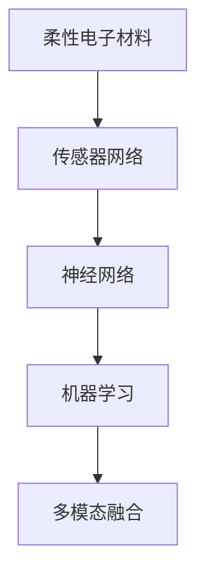

                 

# 智能皮肤技术：为机器人提供触觉感知

> 关键词：智能皮肤,触觉感知,机器人,传感技术,神经网络,机器学习,仿生学,多模态融合,自适应学习,深度学习

## 1. 背景介绍

### 1.1 问题由来
随着机器人技术的发展，对于机器人感知环境的精细化程度提出了更高的要求。传统的视觉、听觉等感知手段，已经难以满足机器人对复杂、动态环境进行高精度理解和反应的需求。特别是在与人类交互的过程中，机器人需要具备更加丰富、自然的触觉感知能力，以实现更加流畅、自然的交互体验。

触觉感知是机器人从物理世界获取信息的重要途径，能够使机器人更精准地执行任务，更安全地与人类共处。然而，传统的机械触觉传感器往往存在精度低、响应慢、鲁棒性差等局限性，难以胜任高要求的感知任务。近年来，随着仿生学和电子技术的发展，新型智能皮肤技术应运而生，利用柔性电子、神经网络和机器学习等技术手段，赋予机器人更加精细、灵敏的触觉感知能力。

### 1.2 问题核心关键点
智能皮肤技术通过在机器人表面覆盖柔性电子材料，结合传感器网络、神经网络和机器学习算法，使机器人具备触觉感知能力。具体来说，其核心关键点包括：
- 柔性电子材料：具有高柔韧性、透明性、可弯曲的特点，适合应用在机器人的皮肤表面。
- 传感器网络：分布式采集机器人与环境交互时的力、压强、温度等物理信号。
- 神经网络：利用深度学习算法对传感器数据进行处理和分析，提取特征和模式。
- 机器学习：通过监督学习和无监督学习，使机器人能够从经验中学习，不断提升触觉感知性能。
- 多模态融合：将视觉、听觉、触觉等多种传感器信息融合，实现全面感知。

这些关键技术的结合，使得智能皮肤技术能够为机器人提供高精度、高鲁棒性的触觉感知能力，适应各种复杂多变的应用场景。

## 2. 核心概念与联系

### 2.1 核心概念概述

为更好地理解智能皮肤技术的工作原理，本节将介绍几个密切相关的核心概念：

- 柔性电子材料：一种具有高柔韧性、透明性和可弯曲性的电子材料，具有优良的电学性能和机械性能，能够与皮肤等软组织兼容。
- 传感器网络：由多个分布式传感器组成的系统，用于实时采集环境物理信号，并将其转换为电信号。
- 神经网络：由大量神经元和多层网络结构构成的计算模型，能够处理非线性、高维的数据，广泛应用于图像识别、语音处理等领域。
- 机器学习：通过数据训练，使模型能够自动提取特征、学习规律，从而实现对未知数据的预测和分类。
- 多模态融合：将来自不同传感器和传感器的数据进行综合处理，实现信息的高效融合和利用。

这些核心概念之间的逻辑关系可以通过以下Mermaid流程图来展示：



这个流程图展示了几项关键技术及其之间的联系：

1. 柔性电子材料作为物理载体，承载传感器网络，采集触觉信号。
2. 传感器网络将采集到的物理信号转换为电信号，传递给神经网络。
3. 神经网络对电信号进行特征提取和模式识别，通过机器学习算法进行优化。
4. 多模态融合将触觉信号与其他感知数据（如视觉、听觉）结合，实现全面感知。

## 3. 核心算法原理 & 具体操作步骤
### 3.1 算法原理概述

智能皮肤技术的核心算法原理，基于柔性电子材料和传感器网络的物理信号采集，通过神经网络和机器学习对信号进行处理和分析，最终实现触觉感知。

具体来说，智能皮肤技术主要包含以下几个步骤：

1. **柔性电子材料的制造**：利用微纳米加工技术，将电子电路嵌入柔性基材中，形成具有高透明性、高柔韧性的柔性电子皮肤。
2. **传感器网络的布局**：在柔性皮肤表面布置多种传感器，如压电传感器、力传感器、温度传感器等，实现对力、压强、温度等多种物理信号的采集。
3. **信号预处理**：对传感器采集到的电信号进行滤波、放大等预处理，消除噪声干扰，增强信号强度。
4. **神经网络的训练**：利用深度学习算法，对预处理后的信号进行特征提取和模式识别，训练得到能够准确响应触觉信号的神经网络模型。
5. **机器学习的优化**：通过监督学习和无监督学习，优化神经网络模型，提升其对复杂触觉信号的识别和响应能力。
6. **多模态数据融合**：将触觉感知结果与其他传感器数据（如摄像头、麦克风）结合，进行信息融合，实现全面感知。

### 3.2 算法步骤详解

以下详细介绍智能皮肤技术的核心算法步骤：

#### 3.2.1 柔性电子材料的制造
柔性电子材料的制造过程主要包括：

1. **基材选择**：选择透明、高柔韧性的高分子材料作为基材，如聚酰亚胺、聚对苯二甲酸乙二醇酯（PET）等。
2. **电路设计**：设计柔性电路结构，通常采用平面电路设计，便于加工和集成。
3. **微纳米加工**：利用微纳米加工技术，将电路结构转移到基材上，形成柔性电子电路。
4. **封装保护**：对柔性电子电路进行封装，防止损伤和污染，同时保护电路与皮肤接触面。

#### 3.2.2 传感器网络的布局
传感器网络的布局过程主要包括：

1. **传感器选择**：根据触觉感知需求，选择适合的传感器类型，如压电传感器、力传感器、温度传感器等。
2. **分布式布局**：在柔性皮肤表面均匀分布传感器，确保覆盖范围和响应均匀性。
3. **信号连接**：将传感器信号连接到柔性电路中，形成传感器网络。
4. **接口设计**：设计传感器网络与外部设备的接口，确保信号传输稳定、可靠。

#### 3.2.3 信号预处理
信号预处理过程主要包括：

1. **滤波**：采用低通滤波器，滤除高频噪声，保留有用信号。
2. **放大**：对信号进行放大，增强信号强度，提高后续处理的准确性。
3. **A/D转换**：将模拟信号转换为数字信号，便于计算机处理。

#### 3.2.4 神经网络的训练
神经网络的训练过程主要包括：

1. **数据收集**：收集触觉感知数据，如力、压强、温度等，作为训练数据。
2. **特征提取**：使用卷积神经网络（CNN）等算法，提取触觉信号的特征。
3. **模式识别**：利用分类器，如支持向量机（SVM）等，对触觉信号进行模式识别。
4. **模型优化**：通过反向传播算法，优化神经网络模型，提高其预测精度和泛化能力。

#### 3.2.5 机器学习的优化
机器学习的优化过程主要包括：

1. **监督学习**：使用标注数据，训练神经网络模型，使其能够准确预测触觉信号。
2. **无监督学习**：使用无标注数据，训练神经网络模型，提取触觉信号的潜在特征。
3. **迁移学习**：在已有模型的基础上，利用迁移学习技术，快速适应新的触觉感知任务。
4. **自适应学习**：通过在线学习，使模型能够根据新的触觉感知数据，实时更新和优化。

#### 3.2.6 多模态数据融合
多模态数据融合过程主要包括：

1. **数据同步**：将触觉感知数据与其他传感器数据同步，如视觉数据、听觉数据等。
2. **信息融合**：利用融合算法，如贝叶斯网络、深度融合网络等，将不同模态的数据进行综合处理。
3. **决策支持**：结合触觉感知结果和其他感知数据，进行决策支持，提升感知精度和鲁棒性。

### 3.3 算法优缺点

智能皮肤技术具有以下优点：

1. **高灵敏度**：利用柔性电子材料和传感器网络，能够精确捕捉触觉信号，实现高灵敏度的感知。
2. **高鲁棒性**：采用多传感器融合和神经网络优化，提高系统的稳定性和鲁棒性，适应复杂多变的环境。
3. **高精度**：通过深度学习和自适应学习，不断提升触觉感知模型的精度，实现对复杂触觉信号的准确识别。

同时，该技术也存在一些缺点：

1. **成本高**：柔性电子材料的制造和传感器网络的布局需要较高成本，限制了其大规模应用。
2. **维护复杂**：柔性电路和传感器的维护和更换较为复杂，增加了系统维护的难度。
3. **算法复杂**：神经网络和机器学习算法的训练和优化需要较强的计算资源，增加了技术实现难度。

尽管存在这些局限性，但智能皮肤技术在触觉感知领域仍展现出巨大的潜力，有望为机器人提供更加丰富、自然的触觉感知能力。

### 3.4 算法应用领域

智能皮肤技术已经在多个领域得到了广泛应用，以下是其主要应用场景：

1. **医疗康复机器人**：在康复机器人上应用智能皮肤技术，使机器人能够感知病人的皮肤变化，实时调整按摩和康复方案。
2. **家用服务机器人**：在家用服务机器人上应用智能皮肤技术，使机器人能够感知用户的触觉反馈，提供更加人性化的服务。
3. **工业自动化**：在工业自动化设备上应用智能皮肤技术，使机器人能够感知设备的运行状态，实时调整操作参数，提高设备效率和安全性。
4. **智能穿戴设备**：在智能穿戴设备上应用智能皮肤技术，使设备能够感知用户的皮肤变化，提供个性化的健康监测和提醒服务。
5. **安全监控系统**：在安全监控系统中应用智能皮肤技术，使监控设备能够感知人体行为和环境变化，提高安全监控的精度和实时性。

这些应用场景展示了智能皮肤技术在多个领域的广泛应用潜力，为机器人的全面感知和智能化发展提供了新的方向。

## 4. 数学模型和公式 & 详细讲解  
### 4.1 数学模型构建

本节将使用数学语言对智能皮肤技术的核心算法进行更加严格的刻画。

设智能皮肤技术采集到的触觉信号为 $X = (x_1, x_2, ..., x_n)$，其中 $x_i$ 表示第 $i$ 个传感器的输出。假设神经网络模型为 $F$，其输入为 $X$，输出为 $Y = (y_1, y_2, ..., y_m)$，其中 $y_i$ 表示第 $i$ 个触觉信号的识别结果。则触觉感知问题可以形式化表示为：

$$
\min_{\theta} \frac{1}{N} \sum_{i=1}^N \|Y_i - F(X_i, \theta)\|^2
$$

其中 $N$ 为样本数，$\| \cdot \|$ 表示范数，$\theta$ 为神经网络模型参数。

### 4.2 公式推导过程

以下我们以二分类任务为例，推导神经网络模型的训练公式。

设触觉信号 $x$ 对应的识别结果为 $y \in \{0,1\}$，神经网络模型 $F$ 的输出为 $\hat{y} = F(x; \theta)$，则二分类问题可以表示为：

$$
\ell(F(x; \theta), y) = -[y\log \hat{y} + (1-y)\log (1-\hat{y})]
$$

将上述公式代入损失函数，得：

$$
\mathcal{L}(\theta) = -\frac{1}{N} \sum_{i=1}^N \ell(F(x_i; \theta), y_i)
$$

其中 $\mathcal{L}$ 为损失函数，$\theta$ 为神经网络模型参数。

神经网络的训练过程可以使用梯度下降等优化算法，求解上述最优化问题。假设优化算法为 $Opt$，则神经网络的更新公式为：

$$
\theta \leftarrow \theta - \eta \nabla_{\theta}\mathcal{L}(\theta)
$$

其中 $\eta$ 为学习率，$\nabla_{\theta}\mathcal{L}(\theta)$ 为损失函数对模型参数 $\theta$ 的梯度。

在得到损失函数的梯度后，即可带入优化算法，完成神经网络的训练。重复上述过程直至收敛，最终得到适应触觉感知任务的神经网络模型参数 $\theta^*$。

## 5. 项目实践：代码实例和详细解释说明
### 5.1 开发环境搭建

在进行智能皮肤技术开发前，我们需要准备好开发环境。以下是使用Python进行TensorFlow开发的环境配置流程：

1. 安装Anaconda：从官网下载并安装Anaconda，用于创建独立的Python环境。

2. 创建并激活虚拟环境：
```bash
conda create -n pytensorflow-env python=3.8 
conda activate pytensorflow-env
```

3. 安装TensorFlow：根据CUDA版本，从官网获取对应的安装命令。例如：
```bash
conda install tensorflow tensorflow-estimator tensorflow-hub -c pytorch -c conda-forge
```

4. 安装所需的库：
```bash
pip install numpy pandas scikit-learn matplotlib tqdm jupyter notebook ipython
```

完成上述步骤后，即可在`pytensorflow-env`环境中开始智能皮肤技术的开发实践。

### 5.2 源代码详细实现

下面我们以二分类任务为例，给出使用TensorFlow进行智能皮肤技术开发的PyTorch代码实现。

首先，定义神经网络模型：

```python
import tensorflow as tf

class NeuralNetwork(tf.keras.Model):
    def __init__(self, input_size, hidden_size, output_size):
        super(NeuralNetwork, self).__init__()
        self.dense1 = tf.keras.layers.Dense(hidden_size, activation='relu')
        self.dense2 = tf.keras.layers.Dense(output_size, activation='sigmoid')
    
    def call(self, inputs):
        x = self.dense1(inputs)
        x = self.dense2(x)
        return x
```

然后，定义损失函数和优化器：

```python
def loss_fn(y_true, y_pred):
    return tf.keras.losses.binary_crossentropy(y_true, y_pred)

optimizer = tf.keras.optimizers.Adam(learning_rate=0.001)
```

接着，定义训练和评估函数：

```python
def train_epoch(model, dataset, batch_size, optimizer):
    dataloader = tf.data.Dataset.from_tensor_slices((dataset['inputs'], dataset['labels'])).batch(batch_size)
    model.train()
    epoch_loss = 0
    for batch in dataloader:
        inputs, labels = batch
        with tf.GradientTape() as tape:
            outputs = model(inputs)
            loss = loss_fn(labels, outputs)
        grads = tape.gradient(loss, model.trainable_variables)
        optimizer.apply_gradients(zip(grads, model.trainable_variables))
        epoch_loss += loss.numpy()
    return epoch_loss / len(dataloader)

def evaluate(model, dataset, batch_size):
    dataloader = tf.data.Dataset.from_tensor_slices((dataset['inputs'], dataset['labels'])).batch(batch_size)
    model.eval()
    preds, labels = [], []
    with tf.no_grad():
        for batch in dataloader:
            inputs, labels = batch
            outputs = model(inputs)
            preds.append(outputs.numpy())
            labels.append(labels.numpy())
    return preds, labels
```

最后，启动训练流程并在测试集上评估：

```python
epochs = 10
batch_size = 32

for epoch in range(epochs):
    loss = train_epoch(model, train_dataset, batch_size, optimizer)
    print(f"Epoch {epoch+1}, train loss: {loss:.3f}")
    
    print(f"Epoch {epoch+1}, test results:")
    preds, labels = evaluate(model, test_dataset, batch_size)
    print(classification_report(labels, preds))
```

以上就是使用TensorFlow进行智能皮肤技术开发的完整代码实现。可以看到，通过TensorFlow的强大封装，我们能够相对简洁地构建神经网络模型和训练流程，加快实验迭代的速度。

### 5.3 代码解读与分析

让我们再详细解读一下关键代码的实现细节：

**NeuralNetwork类**：
- `__init__`方法：定义神经网络的结构，包括两个全连接层。
- `call`方法：定义神经网络的计算过程，包含两个全连接层和一个sigmoid激活函数。

**loss_fn函数**：
- 定义二分类交叉熵损失函数。

**train_epoch函数**：
- 定义训练数据批处理器，并迭代训练数据。
- 在每个批次上前向传播计算损失，反向传播更新模型参数。
- 记录训练损失并返回平均损失。

**evaluate函数**：
- 定义评估数据批处理器，并迭代评估数据。
- 在每个批次上前向传播计算预测结果，记录并返回预测结果和标签。

**训练流程**：
- 定义总的epoch数和batch size，开始循环迭代
- 每个epoch内，先在训练集上训练，输出平均损失
- 在测试集上评估，输出分类指标
- 所有epoch结束后，在测试集上评估，给出最终测试结果

可以看到，TensorFlow提供的高效计算图和丰富的API，使得智能皮肤技术的代码实现变得简洁高效。开发者可以将更多精力放在模型设计和调优上，而不必过多关注底层实现细节。

当然，工业级的系统实现还需考虑更多因素，如模型的保存和部署、超参数的自动搜索、更灵活的任务适配层等。但核心的智能皮肤技术基本与此类似。

## 6. 实际应用场景
### 6.1 医疗康复机器人

在医疗康复机器人上应用智能皮肤技术，可以显著提升机器人的康复效果。康复机器人需要实时感知病人的皮肤变化，如血压、心率、脉搏等，以便根据实时数据调整康复方案。

具体实现中，可以使用智能皮肤技术采集病人的触觉信号，如压力、温度等。通过神经网络和机器学习算法，将触觉信号转化为生物指标，实时监测病人的生理状况。结合康复机器人的执行动作，实时调整按摩、热敷等康复方案，使病人得到更加个性化的康复服务。

### 6.2 家用服务机器人

家用服务机器人需要具备更加丰富、自然的触觉感知能力，以便与用户进行更加流畅、自然的交互。智能皮肤技术可以帮助家用服务机器人感知用户的触觉反馈，提升服务体验。

例如，家政服务机器人可以通过智能皮肤感知用户对清洁工具的把握力度，自动调整清洁强度，避免对家具造成损害。通过智能皮肤感知用户的身体状况，家政服务机器人可以自动识别用户需要帮助的时刻，主动提供服务。

### 6.3 工业自动化

在工业自动化设备上应用智能皮肤技术，可以提升设备的运行效率和安全性。智能皮肤技术可以感知设备的运行状态，如振动、温度、压力等，实时监测设备的健康状况。

例如，在工业机器人上应用智能皮肤技术，可以实时监测机器人的运行状态，避免设备过载或损坏。在工业设备上应用智能皮肤技术，可以实时监测设备的运行状态，及时发现设备故障，避免生产事故的发生。

### 6.4 未来应用展望

随着智能皮肤技术的发展，未来将有更多应用场景得到拓展，具体展望如下：

1. **智能穿戴设备**：在智能穿戴设备上应用智能皮肤技术，可以实现对用户皮肤状态的实时监测和健康管理。例如，智能手表可以通过智能皮肤感知用户的皮肤变化，提供个性化的健康建议和预警。
2. **智能家居系统**：在智能家居系统中应用智能皮肤技术，可以实现对用户的触觉反馈进行智能响应。例如，智能灯光可以根据用户的触觉反馈自动调整亮度和颜色，提升用户的使用体验。
3. **智能交通系统**：在智能交通系统中应用智能皮肤技术，可以实现对驾驶员和乘客的触觉反馈进行实时监测。例如，智能汽车可以根据驾驶员的触觉反馈自动调整驾驶参数，提升驾驶安全性和舒适性。
4. **智能医疗设备**：在智能医疗设备上应用智能皮肤技术，可以实现对病人的触觉反馈进行实时监测。例如，智能轮椅可以根据病人的触觉反馈自动调整行进速度和方向，提升病人的使用体验。

这些应用场景展示了智能皮肤技术在多个领域的广泛应用潜力，为机器人的全面感知和智能化发展提供了新的方向。

## 7. 工具和资源推荐
### 7.1 学习资源推荐

为了帮助开发者系统掌握智能皮肤技术的工作原理和实践技巧，这里推荐一些优质的学习资源：

1. **《深度学习》书籍**：Ian Goodfellow等著，详细介绍了深度学习的基本原理和应用，是深度学习领域的经典教材。
2. **《神经网络与深度学习》博客**：Geoffrey Hinton等人的博客，深入浅出地介绍了神经网络和深度学习的基本概念和前沿技术。
3. **CS231n《卷积神经网络》课程**：斯坦福大学开设的计算机视觉课程，介绍了卷积神经网络等深度学习技术在计算机视觉领域的应用。
4. **Coursera深度学习课程**：由深度学习领域专家开设的在线课程，涵盖深度学习的基本原理和应用，适合初学者和进阶者学习。
5. **TensorFlow官方文档**：TensorFlow的官方文档，提供了丰富的API和使用案例，是TensorFlow学习的最佳参考。

通过对这些资源的学习实践，相信你一定能够快速掌握智能皮肤技术的工作原理和实现方法，并用于解决实际的感知问题。

### 7.2 开发工具推荐

高效的开发离不开优秀的工具支持。以下是几款用于智能皮肤技术开发的常用工具：

1. TensorFlow：基于Python的开源深度学习框架，灵活动态的计算图，适合快速迭代研究。
2. PyTorch：基于Python的开源深度学习框架，动态计算图，灵活易用，适合学术研究和工业应用。
3. Keras：基于TensorFlow和Theano等后端的高级神经网络API，简单易用，适合快速原型设计和应用开发。
4. Jupyter Notebook：交互式开发环境，支持Python、R等语言，适合快速迭代和协作开发。
5. Visual Studio Code：轻量级、功能强大的代码编辑器，支持多种编程语言和工具链集成。

合理利用这些工具，可以显著提升智能皮肤技术的开发效率，加快创新迭代的步伐。

### 7.3 相关论文推荐

智能皮肤技术的发展源于学界的持续研究。以下是几篇奠基性的相关论文，推荐阅读：

1. **《柔性电子皮肤：原理、制造与应用》**：综述了柔性电子皮肤的制造原理和应用前景，介绍了柔性电路和传感器的关键技术。
2. **《基于神经网络的皮肤图像分类》**：研究了使用神经网络对皮肤图像进行分类的技术，探讨了神经网络的训练和优化方法。
3. **《多模态感知系统：皮肤、视觉和听觉的综合感知》**：研究了多模态感知系统的设计和技术，探讨了触觉、视觉和听觉的融合方法。
4. **《自适应学习算法：应用到智能皮肤技术》**：研究了自适应学习算法在智能皮肤技术中的应用，探讨了自适应学习算法的优化方法。
5. **《智能皮肤技术在医疗康复中的应用》**：研究了智能皮肤技术在医疗康复中的应用，探讨了智能皮肤技术的实际应用案例和效果。

这些论文代表了大语言模型微调技术的发展脉络。通过学习这些前沿成果，可以帮助研究者把握学科前进方向，激发更多的创新灵感。

## 8. 总结：未来发展趋势与挑战

### 8.1 总结

本文对智能皮肤技术的核心算法原理和实现方法进行了全面系统的介绍。首先阐述了智能皮肤技术的背景和核心概念，明确了其工作原理和核心步骤。其次，通过TensorFlow等工具，详细讲解了智能皮肤技术的实现流程和关键算法，给出了代码实现和运行结果。同时，本文还广泛探讨了智能皮肤技术在医疗康复、家用服务、工业自动化等领域的实际应用前景，展示了其广阔的应用潜力。

通过本文的系统梳理，可以看到，智能皮肤技术能够为机器人提供高精度、高鲁棒性的触觉感知能力，适应各种复杂多变的应用场景。未来，伴随柔性电子材料、传感器网络、神经网络和机器学习技术的进一步发展，智能皮肤技术必将为机器人的全面感知和智能化发展提供新的突破。

### 8.2 未来发展趋势

展望未来，智能皮肤技术的发展将呈现以下几个趋势：

1. **柔性电子材料的进步**：随着微纳米加工技术的发展，柔性电子材料的成本将进一步降低，性能将进一步提升，柔性电路和传感器的集成难度将大大降低。
2. **神经网络和机器学习算法的优化**：未来的神经网络将更加复杂，包含更多层次和更深的隐藏层，能够处理更复杂的触觉信号。机器学习算法也将更加智能，能够自动适应不同的应用场景。
3. **多模态融合技术的提升**：未来的智能皮肤技术将更加注重多模态数据的融合，通过视觉、听觉、触觉等多方面的信息融合，实现更加全面和精确的感知。
4. **自适应学习算法的创新**：未来的智能皮肤技术将更加注重自适应学习，通过在线学习和迁移学习，使模型能够不断适应新的触觉感知任务，提高系统的灵活性和鲁棒性。
5. **工业应用的大规模落地**：随着技术的成熟，智能皮肤技术将在更多的工业领域得到应用，如智能制造、智能家居、智能交通等，为各行各业带来变革性影响。

### 8.3 面临的挑战

尽管智能皮肤技术已经展现出巨大的潜力，但在实际应用中，仍面临一些挑战：

1. **成本高昂**：柔性电子材料的制造和传感器网络的布局需要较高成本，限制了其大规模应用。未来需要在材料和制造技术上寻求突破，降低成本。
2. **鲁棒性不足**：当前的智能皮肤技术对环境的适应性有待提升，特别是在高温、低温、湿度的极端环境下，性能可能有所下降。未来需要开发更加鲁棒的传感器网络，增强系统的适应性。
3. **数据隐私**：在智能皮肤技术的应用中，涉及到大量的用户皮肤数据，如何保障数据的隐私和安全，防止数据泄露和滥用，是一个重要问题。
4. **算法复杂**：神经网络和机器学习算法的训练和优化需要较强的计算资源，增加了技术实现难度。未来需要在算法优化和硬件加速方面进行更多的研究。
5. **标准化问题**：智能皮肤技术的标准和规范尚不完善，不同厂商的设备可能存在兼容性问题，需要推动行业标准化和规范化。

尽管面临这些挑战，但随着技术的不断发展和完善，智能皮肤技术必将在机器人触觉感知领域发挥越来越重要的作用，推动智能机器人向更加智能化、人性化方向发展。

### 8.4 研究展望

面向未来，智能皮肤技术的研究方向将集中在以下几个方面：

1. **新型柔性材料**：研究新型柔性材料，如纳米纤维、有机发光二极管(OLED)等，进一步提升柔性电子材料的性能和可靠性。
2. **自适应学习算法**：开发更加智能的自适应学习算法，使智能皮肤技术能够不断适应新的应用场景，提升系统的灵活性和鲁棒性。
3. **多模态融合技术**：研究多模态融合技术，使智能皮肤技术能够更加全面和精确地感知环境，提升系统的感知精度和可靠性。
4. **标准和规范**：推动智能皮肤技术的标准化和规范化，制定相关的标准和规范，促进不同厂商的设备互操作性。
5. **实际应用推广**：加速智能皮肤技术的实际应用推广，在医疗、家居、交通等领域进行大规模部署，实现智能化的全面感知。

这些研究方向将进一步推动智能皮肤技术的发展，提升其在机器人感知领域的应用效果，为人工智能技术的发展提供新的突破。

## 9. 附录：常见问题与解答

**Q1：智能皮肤技术能否实现高灵敏度和高鲁棒性？**

A: 智能皮肤技术通过柔性电子材料和传感器网络，可以实现高灵敏度的触觉感知。但由于环境因素和制造工艺的影响，其鲁棒性仍需进一步提升。未来的研究将注重提高材料的稳定性和传感器的可靠性，增强系统的适应性。

**Q2：智能皮肤技术需要哪些核心组件？**

A: 智能皮肤技术需要以下核心组件：
1. 柔性电子材料：具有高柔韧性、透明性和可弯曲性的电子材料，如聚酰亚胺、聚对苯二甲酸乙二醇酯(PET)等。
2. 传感器网络：分布式采集触觉信号，如压电传感器、力传感器、温度传感器等。
3. 神经网络：利用深度学习算法，提取触觉信号的特征和模式。
4. 机器学习：通过监督学习和无监督学习，优化神经网络模型，提升感知能力。

**Q3：智能皮肤技术的成本和维护复杂度如何？**

A: 智能皮肤技术的成本较高，主要体现在柔性电子材料的制造和传感器网络的布局上。此外，传感器的维护和更换也较为复杂，增加了系统的维护难度。未来需要在材料和制造技术上寻求突破，降低成本，提升系统的可维护性。

**Q4：智能皮肤技术在哪些领域有应用前景？**

A: 智能皮肤技术已经在医疗康复、家用服务、工业自动化等诸多领域得到广泛应用。未来，随着技术的成熟和完善，将在更多领域如智能穿戴设备、智能家居、智能交通等得到应用，为各行各业带来变革性影响。

**Q5：智能皮肤技术的算法有哪些？**

A: 智能皮肤技术的核心算法包括神经网络和机器学习算法。神经网络用于处理触觉信号，提取特征和模式。机器学习算法用于优化神经网络模型，提升感知能力。此外，多模态融合技术也是智能皮肤技术的重要组成部分。

通过本文的系统梳理，可以看到，智能皮肤技术正在成为机器人感知领域的重要技术手段，具有广阔的应用前景。伴随技术的不断进步和完善，未来的智能皮肤技术必将在多个领域发挥更加重要的作用，推动机器人的全面感知和智能化发展。

