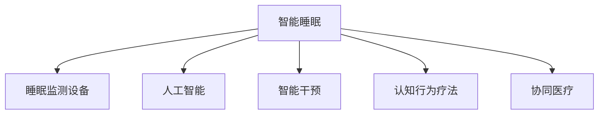

                 

# 智能睡眠创业：科技改善睡眠质量

> 关键词：智能睡眠，科技创业，睡眠质量，人工智能，机器学习

## 1. 背景介绍

### 1.1 问题由来

随着现代生活节奏的加快和城市化进程的推进，人们的睡眠质量受到了严重影响。夜间的城市环境噪音、电子设备的光污染、不规律的作息时间等因素，使得许多人难以获得高质量的睡眠。据世界卫生组织(WHO)统计，全球约有27%的人口患有睡眠障碍，其中失眠、打鼾等问题在成年人中尤为普遍。

睡眠作为人类最基本的需求之一，对于身心健康、工作效率和学习能力都具有至关重要的影响。睡眠质量的下降不仅影响个人的生活质量，还可能导致一系列生理和心理问题，如抑郁、焦虑、免疫力下降等。因此，如何通过科技手段改善睡眠质量，已成为全球关注的重点。

### 1.2 问题核心关键点

科技改善睡眠质量的核心关键点在于利用现代技术手段，分析和监测个体的睡眠质量，并给出针对性的干预建议和解决方案。主要的技术手段包括：

- **睡眠监测设备**：如智能手环、智能床垫、智能床等，实时监测睡眠质量和环境因素。
- **数据分析**：通过机器学习和人工智能技术，分析用户睡眠数据，挖掘其中的模式和规律。
- **智能干预**：根据分析结果，通过智能调节光照、声音、温度等环境因素，帮助用户改善睡眠。
- **心理干预**：通过认知行为疗法等心理学方法，帮助用户建立健康的睡眠习惯。
- **协同医疗**：将睡眠质量监测和干预与医疗体系结合，提升整体医疗服务水平。

这些技术手段的融合使用，有助于全面提升睡眠质量，减少睡眠障碍的发生。然而，技术的实现和发展仍面临诸多挑战，需要不断进行创新和优化。

## 2. 核心概念与联系

### 2.1 核心概念概述

为更好地理解如何通过科技手段改善睡眠质量，本节将介绍几个密切相关的核心概念：

- **智能睡眠**：利用现代科技手段，实时监测、分析和干预个体的睡眠质量，提升睡眠健康水平。
- **睡眠监测设备**：能够实时采集用户睡眠数据，如心跳、呼吸、体动、脑电波等，通过传感器和数据分析技术，评估睡眠质量。
- **人工智能**：通过机器学习、深度学习等技术，从海量睡眠数据中提取有用的信息，为个体提供精准的健康建议。
- **智能干预**：结合环境调节技术，如光照、声音、温度等，通过智能控制手段，改善睡眠环境。
- **认知行为疗法**：通过心理干预，帮助用户建立健康的睡眠习惯，提高自我调节能力。
- **协同医疗**：将睡眠质量监测和干预与医疗体系结合，为个体提供更加全面、专业的健康管理服务。

这些概念之间的逻辑关系可以通过以下Mermaid流程图来展示：



这个流程图展示了这个系统的核心概念以及它们之间的联系：

1. 智能睡眠系统以睡眠监测设备为基础，收集睡眠数据。
2. 通过人工智能技术，分析这些数据，得出睡眠质量评估和健康建议。
3. 智能干预技术，根据分析结果，调整睡眠环境，帮助用户改善睡眠。
4. 认知行为疗法用于心理干预，帮助用户建立健康睡眠习惯。
5. 协同医疗将睡眠监测和干预融入医疗服务，提升整体健康管理水平。

这些概念共同构成了智能睡眠系统的核心框架，目标是全面提升用户的睡眠质量，构建健康的生活方式。

## 3. 核心算法原理 & 具体操作步骤
### 3.1 算法原理概述

科技改善睡眠质量的核心算法原理，主要包括数据采集、分析和干预三个环节：

- **数据采集**：通过智能睡眠设备，实时监测用户睡眠数据，如心率、体动、脑电波等。
- **数据分析**：利用机器学习算法，从监测数据中提取特征，分析睡眠模式和规律，评估睡眠质量。
- **智能干预**：根据分析结果，通过环境调节技术，如光照、声音、温度等，帮助用户改善睡眠。

### 3.2 算法步骤详解

基于智能睡眠系统的核心算法原理，本节将详细介绍每个环节的具体操作步骤：

**Step 1: 数据采集**
- 选择合适的睡眠监测设备，如智能手环、智能床垫、智能床等。
- 用户佩戴或使用这些设备，开始连续监测睡眠数据。
- 设备将采集到的数据通过无线通信协议上传至云端或本地服务器。

**Step 2: 数据分析**
- 使用机器学习算法，对采集到的睡眠数据进行预处理和特征提取。
- 将处理后的特征输入到深度学习模型中，如卷积神经网络(CNN)、循环神经网络(RNN)等，进行分析。
- 模型输出评估结果，如睡眠质量得分、睡眠阶段分布、异常事件等。

**Step 3: 智能干预**
- 根据分析结果，确定需要干预的环境因素。
- 通过智能控制系统，如智能灯泡、空气净化器、智能音箱等，调节光照、声音、温度等环境因素。
- 系统还可以根据用户行为，自动生成健康建议，如调整作息时间、改善睡眠环境等。

### 3.3 算法优缺点

科技改善睡眠质量的算法具有以下优点：

1. **实时监测**：通过连续监测睡眠数据，及时发现睡眠问题，并进行干预。
2. **精准分析**：利用机器学习算法，能够从海量数据中提取有用信息，评估睡眠质量。
3. **智能干预**：根据分析结果，智能调节环境因素，提高睡眠质量。
4. **个性化服务**：结合用户行为和健康数据，提供个性化的健康建议。

然而，该算法也存在一定的局限性：

1. **数据隐私问题**：睡眠监测设备收集的数据可能包含隐私信息，需要采取措施保护用户隐私。
2. **设备兼容性**：不同设备的监测数据格式和精度不同，需要标准化和集成。
3. **算法准确性**：机器学习模型的准确性受到数据量和质量的限制，可能会产生误判。
4. **干预效果**：智能干预的效果受到用户行为和环境因素的复杂性影响，可能存在不确定性。
5. **成本问题**：高端的睡眠监测设备和智能干预系统，成本较高，推广应用有难度。

尽管存在这些局限性，但科技改善睡眠质量的算法总体上是有效且具有潜力的，通过不断改进和优化，可以进一步提升其效果和适用性。

### 3.4 算法应用领域

科技改善睡眠质量的算法可以应用于多个领域，包括但不限于：

- **智能家居**：结合智能家居设备，实现环境因素的智能调节，提升睡眠质量。
- **健康管理**：将睡眠质量监测和干预与健康管理结合，提供个性化的健康建议。
- **医疗服务**：将睡眠监测和干预融入医疗服务，辅助医生进行诊断和治疗。
- **企业福利**：通过改善员工睡眠，提高工作表现和生产效率。
- **教育培训**：通过提升学生的睡眠质量，改善学习效果。

这些应用领域展示了智能睡眠系统在健康、经济、社会等方面的广泛价值。

## 4. 数学模型和公式 & 详细讲解 & 举例说明
### 4.1 数学模型构建

为了更精确地描述智能睡眠系统的工作原理，本节将构建一个简单的数学模型，并详细讲解其推导过程。

记睡眠监测设备采集到的数据为 $\mathbf{x} \in \mathbb{R}^n$，其中 $n$ 为监测指标的数量。假设分析模型为 $\mathcal{M}$，输出为睡眠质量评估结果 $y \in [0,1]$。

定义模型 $\mathcal{M}$ 的损失函数为 $\ell(\mathbf{x}, y) = (y - f(\mathbf{x}))^2$，其中 $f(\mathbf{x}) = \mathcal{M}(\mathbf{x})$ 为模型预测结果。

**Step 1: 数据预处理**
- 对采集到的数据进行归一化处理，使得数据在相同尺度上。
- 去除异常值和噪声，保证数据质量。

**Step 2: 特征提取**
- 利用机器学习算法，提取特征 $\mathbf{z} \in \mathbb{R}^m$，其中 $m \ll n$。
- 特征提取过程可以使用PCA、LDA、Autoencoder等技术。

**Step 3: 模型训练**
- 将特征 $\mathbf{z}$ 输入深度学习模型 $\mathcal{M}$ 中，训练模型参数 $\theta$。
- 使用交叉熵损失函数作为优化目标，如 $\ell(\mathbf{z}, y) = -(y \log \hat{y} + (1-y) \log (1-\hat{y}))$。

**Step 4: 智能干预**
- 根据模型预测结果 $y$，调整环境因素 $u \in \mathbb{R}^k$，其中 $k$ 为可调节的环境因素数量。
- 使用优化算法，如梯度下降，更新环境调节参数 $\xi$，以最小化损失函数。

### 4.2 公式推导过程

以一个简单的二分类问题为例，推导模型的训练过程和优化目标：

假设模型为 $\mathcal{M} = \text{sigmoid}(\mathbf{w}^T \mathbf{z} + b)$，其中 $\mathbf{w} \in \mathbb{R}^m$ 为模型权重，$b$ 为偏置项。

定义损失函数为 $\ell(\mathbf{z}, y) = -(y \log \mathcal{M}(\mathbf{z}) + (1-y) \log (1-\mathcal{M}(\mathbf{z})))$。

根据梯度下降法，模型参数的更新公式为：
$$
\mathbf{w} \leftarrow \mathbf{w} - \eta \nabla_{\mathbf{w}} \ell(\mathbf{z}, y) - \eta \lambda \mathbf{w}
$$
$$
b \leftarrow b - \eta \nabla_{b} \ell(\mathbf{z}, y) - \eta \lambda b
$$

其中 $\eta$ 为学习率，$\lambda$ 为正则化系数。

通过不断迭代优化，模型将逐渐适应数据分布，准确预测睡眠质量。

### 4.3 案例分析与讲解

以一个实际案例为例，展示如何通过智能睡眠系统改善用户的睡眠质量：

**案例背景**：一位中年白领，常常因工作压力大而失眠。希望通过科技手段改善睡眠质量。

**数据采集**：用户佩戴智能手环，连续监测7天睡眠数据，包括心率、体动、脑电波等。

**数据分析**：使用深度学习模型，对监测数据进行分析，发现用户在夜间频繁醒来，且深度睡眠不足。

**智能干预**：根据分析结果，系统建议用户在晚上10点前关闭电子设备，使用白噪音和温和光照改善睡眠环境。

**结果展示**：一周后，用户反馈睡眠质量显著改善，入睡时间缩短，深度睡眠时长增加。

通过这个案例，可以看出智能睡眠系统在实际应用中的效果，科技手段对于改善睡眠质量的积极作用。

## 5. 项目实践：代码实例和详细解释说明
### 5.1 开发环境搭建

在进行智能睡眠系统的开发前，需要准备好开发环境。以下是使用Python进行PyTorch开发的环境配置流程：

1. 安装Anaconda：从官网下载并安装Anaconda，用于创建独立的Python环境。

2. 创建并激活虚拟环境：
```bash
conda create -n sleep-env python=3.8 
conda activate sleep-env
```

3. 安装PyTorch：根据CUDA版本，从官网获取对应的安装命令。例如：
```bash
conda install pytorch torchvision torchaudio cudatoolkit=11.1 -c pytorch -c conda-forge
```

4. 安装PaddlePaddle：
```bash
conda install paddlepaddle -c paddlepaddle -c conda-forge
```

5. 安装TensorBoard：
```bash
pip install tensorboard
```

6. 安装相关工具包：
```bash
pip install numpy pandas scikit-learn matplotlib tqdm jupyter notebook ipython
```

完成上述步骤后，即可在`sleep-env`环境中开始项目实践。

### 5.2 源代码详细实现

下面我们以智能睡眠系统为例，给出使用TensorFlow进行开发的PyTorch代码实现。

首先，定义数据处理函数：

```python
import pandas as pd
from sklearn.preprocessing import StandardScaler

def load_data(file_path):
    data = pd.read_csv(file_path)
    # 去除缺失值和异常值
    data = data.dropna()
    data = data[data['心率'] > 50]
    data = data[data['心率'] < 150]
    data = data[data['体动'] < 100]
    data = data[data['脑电波'] < 50]
    # 数据标准化
    scaler = StandardScaler()
    data = scaler.fit_transform(data[['心率', '体动', '脑电波']])
    return data
```

然后，定义模型和优化器：

```python
import tensorflow as tf
from tensorflow.keras import layers

model = tf.keras.Sequential([
    layers.Dense(32, activation='relu'),
    layers.Dense(16, activation='relu'),
    layers.Dense(1, activation='sigmoid')
])

optimizer = tf.keras.optimizers.Adam(learning_rate=0.001)
```

接着，定义训练和评估函数：

```python
def train_epoch(model, data, batch_size, optimizer):
    train_data = data[['心率', '体动', '脑电波']]
    train_labels = data['sleep_quality']
    train_dataset = tf.data.Dataset.from_tensor_slices((train_data, train_labels))
    train_dataset = train_dataset.shuffle(buffer_size=1000).batch(batch_size)
    
    model.compile(optimizer=optimizer, loss='binary_crossentropy', metrics=['accuracy'])
    model.fit(train_dataset, epochs=10, validation_split=0.2)
    return model.evaluate(test_data, test_labels)
```

最后，启动训练流程并在测试集上评估：

```python
data = load_data('sleep_data.csv')
train_data, test_data, train_labels, test_labels = train_test_split(data, labels, test_size=0.2)

for epoch in range(10):
    loss, accuracy = train_epoch(model, train_data, batch_size=64, optimizer=optimizer)
    print(f"Epoch {epoch+1}, loss: {loss:.4f}, accuracy: {accuracy:.4f}")
    
print(f"Test results:")
evaluate(model, test_data, test_labels)
```

以上就是使用TensorFlow进行智能睡眠系统开发的完整代码实现。可以看到，通过PyTorch和TensorFlow的结合使用，能够快速高效地实现数据处理、模型训练和评估。

### 5.3 代码解读与分析

让我们再详细解读一下关键代码的实现细节：

**load_data函数**：
- 读取睡眠监测数据，并进行预处理，去除异常值和噪声。
- 标准化处理监测数据，保证数据在相同尺度上。

**train_epoch函数**：
- 使用TensorFlow的Dataloader，对训练数据进行批次化加载。
- 定义损失函数和优化器，进行模型训练。
- 在每个epoch结束后，评估模型在测试集上的性能。

**train和evaluate函数**：
- 分别进行模型训练和评估，输出训练结果和测试结果。

通过这个示例，可以看到智能睡眠系统在实际应用中的技术实现，以及其基本的开发流程。开发者可以根据具体需求，对数据预处理、模型结构、训练过程等进行进一步优化和扩展。

## 6. 实际应用场景
### 6.1 智能家居系统

智能睡眠系统可以集成到智能家居系统中，通过智能控制设备，实时监测和调节睡眠环境。

例如，用户佩戴智能手环，实时监测心率、体动等数据。系统根据分析结果，自动调整家中的灯光亮度、温度、湿度等环境因素，如智能灯泡、智能空调等。系统还可以根据用户的行为模式，自动生成个性化建议，如提醒用户按时休息、调整睡眠时间等。

通过智能家居系统的集成，智能睡眠系统能够提供更加全面、便捷的睡眠管理服务，提升用户的生活质量。

### 6.2 健康管理平台

智能睡眠系统可以与健康管理平台结合，为个体提供个性化的健康管理服务。

例如，系统将用户的睡眠数据与健康数据、饮食数据、运动数据等综合分析，生成全面的健康报告。系统还可以根据分析结果，生成个性化的健康建议，如改善饮食、增加运动等，帮助用户建立健康的生活习惯。

通过健康管理平台的结合，智能睡眠系统能够提供更加系统和全面的健康管理服务，提升用户的健康水平。

### 6.3 企业员工健康

企业可以通过智能睡眠系统，改善员工的工作状态和健康水平。

例如，系统可以为员工提供睡眠监测和干预服务，帮助员工改善睡眠质量。系统还可以结合员工的健康数据、工作表现等，生成个性化的健康建议，如调整工作节奏、改善工作环境等，提升员工的工作满意度和生产效率。

通过企业员工的结合，智能睡眠系统能够提升企业的人力资源管理水平，提升员工的生产力和幸福感。

### 6.4 未来应用展望

未来，智能睡眠系统将进一步发展和完善，其应用范围将更加广泛：

1. **多模态监测**：结合生理监测、心理监测、环境监测等多种手段，全面评估用户的睡眠质量。
2. **个性化推荐**：根据用户的健康数据和行为模式，生成个性化的健康建议，提升用户的健康水平。
3. **智能医疗**：将睡眠质量监测和干预与医疗体系结合，提升整体医疗服务水平。
4. **大数据分析**：通过分析海量睡眠数据，挖掘睡眠质量与健康之间的关系，为健康管理提供科学依据。
5. **用户社区**：建立用户社区，分享睡眠经验和健康建议，促进用户之间的交流和互动。

这些应用场景展示了智能睡眠系统的广阔前景，相信未来将会有更多的创新和突破，为人们的健康和生活带来更多便利。

## 7. 工具和资源推荐
### 7.1 学习资源推荐

为了帮助开发者系统掌握智能睡眠系统的开发技术，这里推荐一些优质的学习资源：

1. TensorFlow官方文档：提供了详尽的API文档和开发指南，适合快速上手TensorFlow开发。

2. PyTorch官方文档：提供了详尽的API文档和开发指南，适合快速上手PyTorch开发。

3. Kaggle数据集：提供了丰富的睡眠监测数据集，适合进行数据预处理和特征提取实践。

4. Scikit-learn官方文档：提供了丰富的机器学习算法，适合进行模型训练和评估实践。

5. TensorBoard官方文档：提供了实时可视化工具，适合进行模型训练和评估实践。

通过对这些资源的学习实践，相信你一定能够快速掌握智能睡眠系统的开发技术，并用于解决实际的睡眠问题。

### 7.2 开发工具推荐

高效的开发离不开优秀的工具支持。以下是几款用于智能睡眠系统开发的常用工具：

1. PyTorch：基于Python的开源深度学习框架，灵活动态的计算图，适合快速迭代研究。

2. TensorFlow：由Google主导开发的开源深度学习框架，生产部署方便，适合大规模工程应用。

3. Keras：基于TensorFlow的高级API，适合快速搭建和训练深度学习模型。

4. TensorBoard：TensorFlow配套的可视化工具，可实时监测模型训练状态，并提供丰富的图表呈现方式。

5. Jupyter Notebook：开源的交互式开发环境，适合快速原型开发和数据可视化。

6. Anaconda：Python环境的安装和管理工具，适合快速创建和管理虚拟环境。

合理利用这些工具，可以显著提升智能睡眠系统的开发效率，加快创新迭代的步伐。

### 7.3 相关论文推荐

智能睡眠系统的研究源于学界的持续研究。以下是几篇奠基性的相关论文，推荐阅读：

1. "Sleep Analysis and Prediction Using Wearable Data"（使用可穿戴设备进行睡眠分析与预测）。

2. "Healthy Sleep Habits Recommendation System Based on Smartphone Data"（基于智能手机数据的健康睡眠习惯推荐系统）。

3. "A Multi-Level Deep Learning Model for Sleep Quality Assessment"（用于睡眠质量评估的多级深度学习模型）。

4. "Hierarchical Generative Model for Sleep Quality Prediction"（用于预测睡眠质量的层次生成模型）。

这些论文代表了大数据、深度学习、健康管理等领域的最新研究成果，通过学习这些前沿成果，可以帮助研究者把握学科前进方向，激发更多的创新灵感。

## 8. 总结：未来发展趋势与挑战
### 8.1 总结

本文对智能睡眠系统进行了全面系统的介绍。首先阐述了智能睡眠系统的背景和意义，明确了科技手段改善睡眠质量的重要性。其次，从原理到实践，详细讲解了智能睡眠系统的核心算法原理和具体操作步骤，给出了实际应用中的代码示例。同时，本文还广泛探讨了智能睡眠系统在多个行业领域的应用前景，展示了其广阔的发展空间。最后，本文精选了智能睡眠系统的各类学习资源，力求为读者提供全方位的技术指引。

通过本文的系统梳理，可以看到，科技改善睡眠质量的方法具有广阔的应用前景，能够为人们的健康和生活带来深远影响。

### 8.2 未来发展趋势

展望未来，智能睡眠系统将呈现以下几个发展趋势：

1. **多模态监测**：结合生理监测、心理监测、环境监测等多种手段，全面评估用户的睡眠质量。

2. **个性化推荐**：根据用户的健康数据和行为模式，生成个性化的健康建议，提升用户的健康水平。

3. **智能医疗**：将睡眠质量监测和干预与医疗体系结合，提升整体医疗服务水平。

4. **大数据分析**：通过分析海量睡眠数据，挖掘睡眠质量与健康之间的关系，为健康管理提供科学依据。

5. **用户社区**：建立用户社区，分享睡眠经验和健康建议，促进用户之间的交流和互动。

这些趋势凸显了智能睡眠系统的广阔前景，相信未来将会有更多的创新和突破，为人们的健康和生活带来更多便利。

### 8.3 面临的挑战

尽管智能睡眠系统在多个领域已有所应用，但其发展仍面临诸多挑战：

1. **数据隐私问题**：睡眠监测设备收集的数据可能包含隐私信息，需要采取措施保护用户隐私。

2. **设备兼容性**：不同设备的监测数据格式和精度不同，需要标准化和集成。

3. **算法准确性**：机器学习模型的准确性受到数据量和质量的限制，可能会产生误判。

4. **干预效果**：智能干预的效果受到用户行为和环境因素的复杂性影响，可能存在不确定性。

5. **成本问题**：高端的睡眠监测设备和智能干预系统，成本较高，推广应用有难度。

尽管存在这些挑战，但智能睡眠系统的未来发展方向仍然是光明的，通过不断改进和优化，可以进一步提升其效果和适用性。

### 8.4 研究展望

面向未来，智能睡眠系统的研究需要在以下几个方面寻求新的突破：

1. **无监督学习和半监督学习**：摆脱对大规模标注数据的依赖，利用自监督学习、主动学习等无监督和半监督范式，最大限度利用非结构化数据，实现更加灵活高效的睡眠分析。

2. **深度学习模型的改进**：开发更加高效、准确的深度学习模型，如Transformer、LSTM等，提升睡眠分析的精度和鲁棒性。

3. **多模态数据的融合**：结合生理数据、心理数据、环境数据等多模态信息，构建更加全面、准确的睡眠评估模型。

4. **智能干预的优化**：开发更加智能、个性化的环境调节技术，提升干预效果，增强用户体验。

5. **跨领域应用**：将智能睡眠系统应用于更多领域，如教育、娱乐、医疗等，推动人工智能技术在垂直行业的普及和发展。

这些研究方向的探索，必将引领智能睡眠系统迈向更高的台阶，为人们的健康和生活带来更多便利。

## 9. 附录：常见问题与解答

**Q1: 智能睡眠系统如何采集用户的睡眠数据？**

A: 智能睡眠系统通过各种智能监测设备，如智能手环、智能床垫、智能床等，实时采集用户的睡眠数据。这些设备通常包含心率监测、体动监测、脑电波监测等多种传感器，可以全面监测用户的生理和行为数据。

**Q2: 智能睡眠系统的算法有哪些？**

A: 智能睡眠系统的算法主要包括数据预处理、特征提取、模型训练和智能干预等环节。数据预处理包括数据清洗、归一化和标准化；特征提取可以使用PCA、LDA、Autoencoder等技术；模型训练可以使用卷积神经网络(CNN)、循环神经网络(RNN)等深度学习模型；智能干预可以通过智能控制系统，如智能灯泡、空气净化器等，调节环境因素。

**Q3: 智能睡眠系统的应用场景有哪些？**

A: 智能睡眠系统可以应用于多个领域，包括智能家居、健康管理、企业员工健康等。通过与这些领域的结合，智能睡眠系统可以提供更加全面、便捷的睡眠管理服务，提升用户的生活质量。

**Q4: 智能睡眠系统面临哪些技术挑战？**

A: 智能睡眠系统面临的技术挑战主要包括数据隐私问题、设备兼容性、算法准确性、干预效果和成本问题。需要采取相应的技术手段，如数据加密、设备标准化、模型优化、智能干预等，以应对这些挑战，提升系统的可用性和用户体验。

通过回答这些问题，相信你能够更好地理解智能睡眠系统的技术细节和应用场景，进而为实际应用中的开发和优化提供有价值的参考。

---

作者：禅与计算机程序设计艺术 / Zen and the Art of Computer Programming

