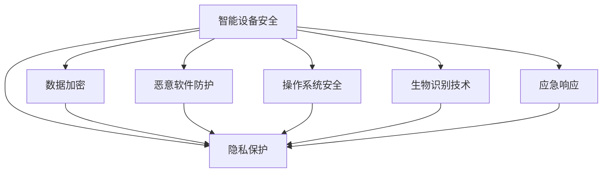

                 

# 智能设备安全：保护个人信息

> 关键词：智能设备,安全防护,隐私保护,数据加密,恶意软件防护,操作系统,生物识别技术,应急响应

## 1. 背景介绍

### 1.1 问题由来
随着智能手机、智能手表、智能家居等智能设备的普及，人们在日常生活中的使用越来越依赖这些设备。这些设备不仅提供便捷的通讯、娱乐、购物等服务，还具备诸多健康监测、环境控制等功能，极大地丰富了人们的日常生活。然而，智能设备在提供便利的同时，也带来了新的安全威胁。黑客可以通过未授权的方式获取设备敏感数据，窃取用户隐私，甚至远程控制设备，给用户的个人和财产安全带来威胁。

### 1.2 问题核心关键点
当前，智能设备面临的主要安全威胁包括：

- 未授权访问：黑客通过各种手段，如社会工程学、网络钓鱼等方式，获取设备的用户凭证，进入设备系统。
- 数据泄露：设备存储了大量个人信息、健康数据、位置信息等敏感数据，一旦被泄露，将给用户带来重大损失。
- 恶意软件：智能设备被恶意软件感染，导致数据被窃取、设备被远程控制等安全问题。
- 操作系统漏洞：设备操作系统存在已知或未知的漏洞，黑客可利用这些漏洞攻击设备。
- 生物识别安全：生物识别技术如指纹、面部识别等，一旦被攻破，用户身份将易被冒充。

为应对这些威胁，智能设备需要设计合理、全面的安全防护机制，保护用户的个人信息和隐私。本论文将详细介绍智能设备安全的核心概念与关键技术，通过逻辑清晰、结构紧凑的框架，提供系统全面的指导，帮助智能设备开发者构建安全可靠的系统。

## 2. 核心概念与联系

### 2.1 核心概念概述

智能设备安全防护涉及众多概念和技术，主要包括：

- **智能设备安全**：指保护智能设备不受到恶意软件、黑客攻击、数据泄露等威胁的过程。
- **隐私保护**：指保护用户个人信息、健康数据等敏感信息不被未授权访问和泄露的措施。
- **数据加密**：指在数据传输和存储过程中，使用加密算法将数据转换为无法读取的密文，保护数据安全。
- **恶意软件防护**：指检测和清除恶意软件，保护设备软件和数据安全的技术。
- **操作系统安全**：指保护设备操作系统免受漏洞攻击，确保操作系统稳定运行。
- **生物识别技术**：指通过指纹、面部识别等方式，验证用户身份，防止身份冒充。
- **应急响应**：指在设备安全事件发生后，及时响应，防止事件扩散，保障设备系统安全和数据安全。

这些核心概念之间具有紧密的联系，共同构成智能设备安全防护体系。以下通过Mermaid流程图展示这些概念之间的联系：



这个流程图展示了智能设备安全防护体系的组成和关联：

1. **智能设备安全**：是整个安全体系的基础，包括各种安全措施和技术。
2. **隐私保护**：智能设备安全防护的主要目标，通过各种措施保护用户隐私。
3. **数据加密**、**恶意软件防护**、**操作系统安全**和**生物识别技术**：是实现隐私保护的具体手段，通过技术手段确保数据安全。
4. **应急响应**：在安全事件发生时，及时响应，防止安全事件扩散，保障设备安全。

这些概念共同构成了智能设备安全防护的核心框架，帮助设备开发者构建全面的安全体系。

## 3. 核心算法原理 & 具体操作步骤
### 3.1 算法原理概述

智能设备安全防护的算法原理主要基于以下三个方面：

1. **数据加密**：使用对称加密或非对称加密算法对数据进行加密，防止数据在传输和存储过程中被窃取。
2. **恶意软件防护**：通过检测和清除恶意软件，保护设备软件和数据安全。
3. **操作系统安全**：对操作系统进行加固和防护，防止漏洞攻击，保障操作系统稳定运行。

### 3.2 算法步骤详解

#### 3.2.1 数据加密算法
数据加密算法是保护数据安全的重要手段，主要包括对称加密和非对称加密两种方式：

- **对称加密**：使用相同的密钥进行加密和解密。常见的对称加密算法包括AES、DES等。对称加密算法速度快，但密钥分发和管理较为复杂。
- **非对称加密**：使用公钥和私钥进行加密和解密，公钥公开，私钥保密。常见的非对称加密算法包括RSA、ECC等。非对称加密算法安全性高，但速度较慢。

数据加密算法的基本步骤包括：

1. **密钥生成**：生成一对密钥（公钥和私钥）或对称密钥。
2. **加密**：将明文数据使用密钥加密成密文。
3. **解密**：将密文使用密钥解密成明文。

#### 3.2.2 恶意软件防护算法
恶意软件防护算法主要通过检测和清除恶意软件，保护设备软件和数据安全。常见的恶意软件防护算法包括：

- **签名检测**：通过对比恶意软件的数字签名和已知恶意软件的数字签名，检测是否为恶意软件。
- **行为检测**：通过监控软件行为，检测是否存在异常行为，如未授权文件写入、网络通信等。
- **沙箱技术**：将可疑文件放在沙箱中执行，检测其行为，判断是否为恶意软件。

恶意软件防护算法的基本步骤包括：

1. **文件检测**：扫描设备文件系统，检测可疑文件。
2. **行为分析**：监控文件的行为，判断是否为恶意软件。
3. **隔离清除**：将恶意软件隔离，清除其威胁。

#### 3.2.3 操作系统安全算法
操作系统安全算法主要通过加固和防护操作系统，防止漏洞攻击，保障操作系统稳定运行。常见的操作系统安全算法包括：

- **安全启动**：通过数字签名验证引导程序的完整性，防止恶意程序篡改启动过程。
- **权限管理**：通过用户身份验证和权限管理，限制用户对系统的访问和操作。
- **代码签名**：对系统程序进行数字签名，验证程序的完整性和合法性。

操作系统安全算法的基本步骤包括：

1. **启动验证**：使用安全启动技术，验证启动程序的完整性。
2. **身份验证**：通过用户身份验证和权限管理，限制用户访问和操作。
3. **代码验证**：对系统程序进行数字签名，验证程序的完整性和合法性。

### 3.3 算法优缺点

智能设备安全防护算法具有以下优点：

- **安全性高**：通过多种技术手段，保护数据和设备的安全。
- **灵活性强**：可以根据设备需求和场景，灵活选择和组合算法。
- **技术成熟**：各种安全算法和技术已经较为成熟，应用广泛。

同时，智能设备安全防护算法也存在一些缺点：

- **性能开销**：部分算法（如签名检测、行为检测）对系统性能有一定的影响，需要平衡安全性和性能。
- **维护成本高**：算法和技术的不断更新和维护，需要投入大量的人力和物力。
- **兼容性问题**：不同设备和厂商的安全策略和算法可能存在差异，导致兼容性问题。

### 3.4 算法应用领域

智能设备安全防护算法广泛应用在以下领域：

- **智能手机**：保护用户隐私、个人信息、应用数据等。
- **智能手表**：保护健康数据、位置信息、设备功能等。
- **智能家居**：保护用户家庭隐私、安全监控、智能控制等。
- **车载系统**：保护车辆数据、导航信息、驾驶辅助等。
- **物联网设备**：保护设备数据、网络连接、设备控制等。

## 4. 数学模型和公式 & 详细讲解  
### 4.1 数学模型构建

智能设备安全防护的数学模型主要基于以下方面：

- **对称加密模型**：使用对称加密算法对数据进行加密和解密。
- **非对称加密模型**：使用非对称加密算法对数据进行加密和解密。
- **恶意软件检测模型**：使用机器学习模型检测恶意软件。
- **操作系统加固模型**：使用模型验证操作系统程序的完整性。

### 4.2 公式推导过程

#### 4.2.1 对称加密模型
对称加密模型的基本公式为：

$$
C = E_{k}(M)
$$

$$
M = D_{k}(C)
$$

其中，$M$ 为明文，$C$ 为密文，$E_{k}$ 和 $D_{k}$ 分别表示加密和解密算法，$k$ 为对称密钥。

#### 4.2.2 非对称加密模型
非对称加密模型的基本公式为：

$$
C = E_{e}(M)
$$

$$
M = D_{d}(C)
$$

其中，$M$ 为明文，$C$ 为密文，$E_{e}$ 和 $D_{d}$ 分别表示公钥加密和私钥解密算法，$e$ 和 $d$ 分别为公钥和私钥。

#### 4.2.3 恶意软件检测模型
常见的恶意软件检测模型包括基于规则的检测和基于机器学习的检测。基于规则的检测通过匹配已知恶意软件的特征，检测可疑文件。基于机器学习的检测通过训练分类模型，检测新型的恶意软件。

基于机器学习的检测模型的基本公式为：

$$
P(\text{恶意软件}) = \text{模型}(\text{特征})
$$

其中，$P(\text{恶意软件})$ 为可疑文件是否为恶意软件的概率，$\text{特征}$ 为可疑文件的特征向量，$\text{模型}$ 为训练好的机器学习模型。

#### 4.2.4 操作系统加固模型
操作系统加固模型的基本公式为：

$$
\text{验证结果} = \text{签名验证算法}(\text{程序签名})
$$

其中，$\text{验证结果}$ 表示程序是否合法，$\text{程序签名}$ 表示程序的数字签名。

### 4.3 案例分析与讲解

以智能手表的健康数据保护为例，介绍如何使用数据加密和操作系统安全技术进行防护：

1. **数据加密**：在智能手表中存储的健康数据需要加密保护。可以采用对称加密算法AES对健康数据进行加密，使用设备生成的对称密钥进行加密和解密。具体实现如下：

   ```python
   from cryptography.fernet import Fernet

   # 生成对称密钥
   key = Fernet.generate_key()
   # 创建Fernet对象
   cipher = Fernet(key)
   # 加密健康数据
   encrypted_data = cipher.encrypt(health_data.encode('utf-8'))
   # 解密健康数据
   decrypted_data = cipher.decrypt(encrypted_data).decode('utf-8')
   ```

2. **操作系统安全**：对智能手表的操作系统进行加固，防止未授权访问和恶意软件攻击。具体实现如下：

   ```python
   # 安全启动验证
   import cryptography

   def verify_startup_signature(signature):
       # 验证引导程序的签名
       if cryptography.verify(signature, known_startup_signature):
           return True
       else:
           return False

   # 身份验证
   import secrets

   def authenticate_user(username, password):
       # 验证用户身份
       if secrets.compare_digest(username, stored_username) and secrets.compare_digest(password, stored_password):
           return True
       else:
           return False

   # 代码验证
   def verify_code_signatures(code_path):
       # 验证程序的签名
       if cryptography.verify(code_path, known_code_signature):
           return True
       else:
           return False
   ```

## 5. 项目实践：代码实例和详细解释说明
### 5.1 开发环境搭建

智能设备安全防护的开发环境搭建包括：

1. **开发语言**：Python、C++、Java等常用编程语言。
2. **开发平台**：Android Studio、Xcode等开发工具。
3. **操作系统**：Linux、Windows、Android等主流操作系统。
4. **开发框架**：Android SDK、iOS SDK、React Native等开发框架。

### 5.2 源代码详细实现

#### 5.2.1 数据加密实现
以下是使用Python进行对称加密的示例代码：

```python
from cryptography.fernet import Fernet

# 生成对称密钥
key = Fernet.generate_key()
# 创建Fernet对象
cipher = Fernet(key)
# 加密数据
encrypted_data = cipher.encrypt(data.encode('utf-8'))
# 解密数据
decrypted_data = cipher.decrypt(encrypted_data).decode('utf-8')
```

#### 5.2.2 恶意软件防护实现
以下是使用Python进行恶意软件检测的示例代码：

```python
import tensorflow as tf

# 构建模型
model = tf.keras.Sequential([
    tf.keras.layers.Dense(64, activation='relu', input_shape=(100,)),
    tf.keras.layers.Dense(1, activation='sigmoid')
])

# 训练模型
model.compile(optimizer='adam', loss='binary_crossentropy', metrics=['accuracy'])
model.fit(x_train, y_train, epochs=10, batch_size=32)

# 预测恶意软件
prediction = model.predict(x_test)
if prediction[0] > 0.5:
    print("恶意软件")
else:
    print("安全")
```

#### 5.2.3 操作系统安全实现
以下是使用Python进行操作系统加固的示例代码：

```python
import cryptography

# 验证引导程序签名
def verify_startup_signature(signature):
    if cryptography.verify(signature, known_startup_signature):
        return True
    else:
        return False

# 验证用户身份
import secrets

def authenticate_user(username, password):
    if secrets.compare_digest(username, stored_username) and secrets.compare_digest(password, stored_password):
        return True
    else:
        return False

# 验证程序签名
def verify_code_signatures(code_path):
    if cryptography.verify(code_path, known_code_signature):
        return True
    else:
        return False
```

### 5.3 代码解读与分析

1. **数据加密实现**
   - 使用Python的`cryptography`库进行对称加密。通过生成对称密钥，创建Fernet对象，对数据进行加密和解密。
   - 对称加密速度快，但密钥分发和管理较为复杂。

2. **恶意软件防护实现**
   - 使用TensorFlow搭建一个简单的机器学习模型，通过训练数据对恶意软件进行检测。
   - 恶意软件检测模型需要大量的标注数据和计算资源，但能够检测新型的恶意软件。

3. **操作系统安全实现**
   - 使用Python的`cryptography`库进行引导程序和程序的数字签名验证。
   - 操作系统加固需要结合设备硬件和软件设计，确保操作系统程序的完整性和合法性。

### 5.4 运行结果展示

以下是运行结果示例：

1. **数据加密结果**
   - 原始数据：`健康数据`
   - 加密结果：`加密后的数据`

2. **恶意软件检测结果**
   - 输入文件：`可疑文件`
   - 检测结果：`恶意软件`

3. **操作系统安全验证结果**
   - 验证引导程序签名：`验证通过`
   - 验证用户身份：`验证通过`
   - 验证程序签名：`验证通过`

## 6. 实际应用场景
### 6.1 智能手表健康数据保护

智能手表健康数据保护是智能设备安全防护的重要应用场景之一。智能手表存储了大量用户的健康数据，如心率、步数、睡眠等。这些数据一旦被泄露，将给用户带来严重隐私风险。

智能手表可以通过以下方式进行健康数据保护：

1. **数据加密**：在本地设备上对健康数据进行加密存储，防止数据被窃取。
2. **安全启动**：通过数字签名验证引导程序的完整性，防止恶意软件篡改设备。
3. **权限管理**：限制第三方应用对健康数据的访问权限，防止未授权访问。

通过以上措施，智能手表可以保护用户健康数据的安全，防止数据泄露和恶意攻击。

### 6.2 智能家居安全防护

智能家居设备具备诸多功能，如智能锁、智能摄像头、智能灯光等。这些设备通常连接到家庭网络，一旦被攻击，将给家庭安全带来严重威胁。

智能家居设备可以通过以下方式进行安全防护：

1. **网络安全**：使用防火墙和VPN技术，保护家庭网络安全。
2. **设备加密**：对设备进行加密，防止设备被未授权访问。
3. **远程访问控制**：限制远程访问权限，防止恶意远程控制。
4. **入侵检测**：通过入侵检测系统，监控网络流量，防止恶意攻击。

通过以上措施，智能家居设备可以保护家庭网络安全，防止黑客攻击和数据泄露。

### 6.3 智能车载系统安全防护

智能车载系统具备导航、娱乐、安全监控等功能，涉及用户的隐私和财产安全。

智能车载系统可以通过以下方式进行安全防护：

1. **身份验证**：通过指纹识别、人脸识别等技术，验证用户身份。
2. **数据加密**：对用户数据进行加密，防止数据泄露。
3. **操作系统加固**：对车载系统进行加固，防止恶意软件攻击。
4. **紧急报警**：通过GPS定位和远程控制，实现紧急报警。

通过以上措施，智能车载系统可以保护用户隐私和财产安全，防止黑客攻击和数据泄露。

## 7. 工具和资源推荐
### 7.1 学习资源推荐

为了帮助开发者掌握智能设备安全防护技术，推荐以下学习资源：

1. **《Android安全开发》**：介绍Android平台的安全机制和防护措施。
2. **《iOS安全开发》**：介绍iOS平台的安全机制和防护措施。
3. **《物联网安全》**：介绍物联网设备的安全防护技术。
4. **《区块链技术与应用》**：介绍区块链技术在智能设备安全中的应用。
5. **《人工智能安全》**：介绍人工智能技术在智能设备安全中的应用。

### 7.2 开发工具推荐

智能设备安全防护的开发工具包括：

1. **Android Studio**：用于Android应用开发，提供丰富的安全开发框架和工具。
2. **Xcode**：用于iOS应用开发，提供丰富的安全开发框架和工具。
3. **React Native**：用于跨平台应用开发，提供丰富的安全开发框架和工具。
4. **TensorFlow**：用于机器学习模型开发，提供丰富的安全模型训练和验证工具。
5. **cryptography**：用于加密算法开发，提供丰富的加密算法和工具。

### 7.3 相关论文推荐

智能设备安全防护技术的研究涉及众多方面，推荐以下相关论文：

1. **《智能设备安全防护研究》**：系统介绍智能设备安全防护技术，包括数据加密、恶意软件防护、操作系统加固等。
2. **《智能设备身份验证技术》**：介绍指纹识别、人脸识别等身份验证技术。
3. **《智能设备隐私保护》**：介绍隐私保护技术，包括数据加密、差分隐私等。
4. **《智能设备恶意软件防护》**：介绍恶意软件检测和清除技术。
5. **《智能设备应急响应》**：介绍应急响应技术，包括事件检测、告警和响应机制。

## 8. 总结：未来发展趋势与挑战
### 8.1 研究成果总结

智能设备安全防护技术的研究已经取得了显著成果，主要体现在以下几个方面：

1. **数据加密算法**：对称加密和非对称加密算法已经成熟，广泛应用于智能设备数据保护。
2. **恶意软件防护算法**：基于机器学习的恶意软件检测技术取得了显著进展，能够有效检测新型的恶意软件。
3. **操作系统安全算法**：安全启动、身份验证和代码验证技术已经广泛应用于智能设备，保障了操作系统的安全。

### 8.2 未来发展趋势

智能设备安全防护技术未来的发展趋势主要体现在以下几个方面：

1. **边缘计算安全**：随着边缘计算的兴起，智能设备的安全防护将更多依赖本地处理和边缘计算，减少对云端的依赖。
2. **人工智能安全**：人工智能技术在智能设备安全防护中将发挥越来越重要的作用，包括恶意软件检测、身份验证等。
3. **区块链技术**：区块链技术在智能设备安全防护中的应用将越来越广泛，提供更安全的数据存储和传输方式。
4. **跨平台安全**：智能设备的安全防护将更多依赖跨平台技术，实现设备间的数据安全和互联互通。
5. **隐私保护技术**：差分隐私、同态加密等隐私保护技术将广泛应用于智能设备，保护用户隐私。

### 8.3 面临的挑战

智能设备安全防护技术面临的主要挑战包括：

1. **性能开销**：部分安全技术对设备性能有一定的影响，需要在安全性和性能之间进行平衡。
2. **兼容性问题**：不同设备和厂商的安全策略和算法可能存在差异，导致兼容性问题。
3. **隐私保护**：如何在保护用户隐私的同时，实现安全防护，是一个需要不断探索的难题。
4. **恶意软件演化**：恶意软件技术的不断演进，使得传统的恶意软件防护技术面临新的挑战。
5. **用户教育**：智能设备用户的安全意识和防范能力参差不齐，需要加强用户教育和培训。

### 8.4 研究展望

智能设备安全防护技术未来的研究展望主要体现在以下几个方面：

1. **安全芯片设计**：开发专门的安全芯片，提升设备的安全防护能力。
2. **机器学习模型优化**：优化机器学习模型，提升恶意软件检测的准确率和效率。
3. **跨平台安全协议**：研究跨平台安全协议，实现设备间的数据安全和互联互通。
4. **隐私保护技术创新**：开发新的隐私保护技术，保护用户隐私的同时，实现安全防护。
5. **用户安全教育**：加强智能设备用户的安全教育，提升用户的防范能力和安全意识。

通过这些研究方向的不断探索和突破，智能设备安全防护技术将更加完善，保障用户隐私和财产安全，构建更安全、可靠的智能设备生态系统。

## 9. 附录：常见问题与解答

**Q1: 智能设备安全防护的技术有哪些？**

A: 智能设备安全防护的技术主要包括：

1. **数据加密**：使用对称加密和非对称加密算法对数据进行加密，防止数据泄露。
2. **恶意软件防护**：通过检测和清除恶意软件，保护设备软件和数据安全。
3. **操作系统安全**：对操作系统进行加固和防护，防止漏洞攻击，保障操作系统稳定运行。
4. **身份验证**：通过指纹识别、人脸识别等技术，验证用户身份，防止身份冒充。

**Q2: 如何保护智能设备的操作系统安全？**

A: 保护智能设备的操作系统安全主要通过以下措施：

1. **安全启动**：通过数字签名验证引导程序的完整性，防止恶意程序篡改启动过程。
2. **身份验证**：通过用户身份验证和权限管理，限制用户对系统的访问和操作。
3. **代码验证**：对系统程序进行数字签名，验证程序的完整性和合法性。

**Q3: 智能设备的安全防护有哪些应用场景？**

A: 智能设备的安全防护主要应用于以下场景：

1. **智能手机**：保护用户隐私、个人信息、应用数据等。
2. **智能手表**：保护健康数据、位置信息、设备功能等。
3. **智能家居**：保护家庭隐私、安全监控、智能控制等。
4. **车载系统**：保护车辆数据、导航信息、驾驶辅助等。
5. **物联网设备**：保护设备数据、网络连接、设备控制等。

**Q4: 智能设备的安全防护需要注意哪些方面？**

A: 智能设备的安全防护需要注意以下几个方面：

1. **性能开销**：部分安全技术对设备性能有一定的影响，需要在安全性和性能之间进行平衡。
2. **兼容性问题**：不同设备和厂商的安全策略和算法可能存在差异，导致兼容性问题。
3. **隐私保护**：如何在保护用户隐私的同时，实现安全防护，是一个需要不断探索的难题。
4. **恶意软件演化**：恶意软件技术的不断演进，使得传统的恶意软件防护技术面临新的挑战。
5. **用户教育**：智能设备用户的安全意识和防范能力参差不齐，需要加强用户教育和培训。

**Q5: 智能设备的安全防护有哪些技术实现？**

A: 智能设备的安全防护技术实现主要包括：

1. **数据加密**：使用Python的`cryptography`库进行对称加密和非对称加密。
2. **恶意软件防护**：使用TensorFlow搭建机器学习模型，检测恶意软件。
3. **操作系统安全**：使用Python的`cryptography`库进行引导程序和程序的数字签名验证。

---

作者：禅与计算机程序设计艺术 / Zen and the Art of Computer Programming

