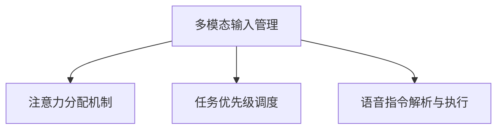

                 

# 智能音响的多模态交互与注意力争夺

在智能设备的浪潮中，智能音响以其便利性和互动性迅速成为人们生活中不可或缺的一部分。从智能音箱到智能耳机，它们不仅具备播放音乐的简单功能，还集成了语音助手、智能家居控制、健康监测等多种功能。然而，在享受多模态交互带来便利的同时，智能音响如何在各种输入模式间高效切换和注意力分配，以实现最佳用户体验，是当前亟待解决的问题。本文将从智能音响的多模态交互、注意力争夺机制、以及相关挑战与未来展望等方面进行深入探讨。

## 1. 背景介绍

### 1.1 问题由来

随着人工智能技术的不断进步，智能音响不仅成为了传统的音响设备的升级版，更成为了集成了语音交互、音乐播放、智能家居控制、健康监测等多功能的综合性智能设备。用户通过语音指令控制智能音响，享受多模态交互带来的便利。然而，在实际使用过程中，智能音响往往需要在语音交互、音乐播放、健康监测等多种模式间频繁切换，如何高效管理各种输入模式，确保注意力集中在当前任务上，成为亟待解决的问题。

### 1.2 问题核心关键点

智能音响的多模态交互和注意力争夺主要包括以下几个关键点：

- **多模态输入管理**：智能音响需要同时处理语音、音乐、健康监测等多种输入模式，如何管理这些输入模式，确保用户获取最合适的响应，是当前研究的热点。
- **注意力分配机制**：在多模态输入中，智能音响需要根据用户的当前需求和上下文环境，智能分配注意力，优先响应最相关的输入，以提升用户体验。
- **任务优先级调度**：当多个任务同时请求注意力时，智能音响如何合理调度任务优先级，以实现高效的多模态交互。
- **语音指令解析与执行**：智能音响在接收到语音指令后，如何高效解析并执行相应任务，是保证多模态交互流畅性的关键。

## 2. 核心概念与联系

### 2.1 核心概念概述

为了更好地理解智能音响的多模态交互与注意力争夺，本节将介绍几个密切相关的核心概念：

- **多模态输入管理**：指智能音响需要同时处理多种输入模式（如语音、音乐、健康监测等），并根据用户需求和上下文环境进行合理切换。
- **注意力分配机制**：指智能音响在多个输入模式中分配注意力的过程，通过优先响应最相关的输入，提升用户体验。
- **任务优先级调度**：指在多个任务同时请求注意力时，智能音响如何合理调度任务优先级，以实现高效的多模态交互。
- **语音指令解析与执行**：指智能音响在接收到语音指令后，如何高效解析并执行相应任务，是保证多模态交互流畅性的关键。

这些核心概念之间的逻辑关系可以通过以下Mermaid流程图来展示：



这个流程图展示了一系列相关的核心概念及其之间的关系：多模态输入管理是基础，注意力分配机制和任务优先级调度是其关键子任务，而语音指令解析与执行则是实现多模态交互的具体方法。

## 3. 核心算法原理 & 具体操作步骤

### 3.1 算法原理概述

智能音响的多模态交互和注意力争夺主要依赖于以下算法原理：

- **多模态输入管理**：通过任务感知机制（Task Awareness），智能音响能够根据当前用户需求和上下文环境，识别并切换合适的输入模式。
- **注意力分配机制**：通过优先级调度算法（Priority Scheduling），智能音响能够在多个输入模式中，优先响应最相关的输入，避免注意力分散。
- **任务优先级调度**：通过任务优先级评估算法（Task Priority Evaluation），智能音响能够合理调度任务优先级，以实现高效的多模态交互。
- **语音指令解析与执行**：通过语音指令解析算法（Speech Instruction Parsing）和执行算法（Execution），智能音响能够高效解析并执行用户语音指令。

### 3.2 算法步骤详解

基于以上算法原理，智能音响的多模态交互与注意力争夺通常包括以下几个关键步骤：

1. **多模态输入感知**：智能音响通过麦克风、传感器等设备，感知用户的语音、音乐、健康监测等多种输入。
2. **输入模式识别**：智能音响根据感知到的输入，识别当前用户需求，选择最合适的输入模式。
3. **注意力分配**：智能音响根据输入模式的优先级，合理分配注意力，确保当前任务得到优先响应。
4. **任务优先级调度**：智能音响根据任务的重要性，合理调度任务优先级，避免任务堆积和注意力分散。
5. **语音指令解析与执行**：智能音响接收到语音指令后，通过解析算法，识别指令意图，并执行相应任务。

### 3.3 算法优缺点

智能音响的多模态交互与注意力争夺算法具有以下优点：

- **提升用户体验**：通过多模态输入管理和注意力分配，智能音响能够根据用户需求，快速响应最相关的输入，提升用户体验。
- **高效任务执行**：通过任务优先级调度和语音指令解析与执行，智能音响能够在多个任务之间高效切换，实现流畅的多模态交互。

然而，该算法也存在一些缺点：

- **资源消耗大**：多模态输入感知和解析需要占用大量计算资源，特别是在高并发情况下，资源消耗较大。
- **用户交互复杂**：多模态输入切换和优先级调度需要用户进行复杂操作，可能会降低交互效率。
- **准确性问题**：语音指令解析和执行过程中，由于噪声、口音等干扰，解析准确性可能受到影响，导致错误响应。

### 3.4 算法应用领域

智能音响的多模态交互与注意力争夺算法在智能家居、健康监测、音乐播放等多个领域得到广泛应用。例如：

- **智能家居控制**：用户通过语音指令控制智能音响，打开电视、调节温度、控制灯光等。
- **健康监测**：智能音响集成了健康监测功能，通过语音指令监测用户健康状况，提供健康建议。
- **音乐播放**：用户通过语音指令搜索音乐、播放歌曲、创建歌单等，智能音响能够高效响应音乐播放需求。

## 4. 数学模型和公式 & 详细讲解 & 举例说明

### 4.1 数学模型构建

智能音响的多模态交互与注意力争夺过程可以建模为一个多任务调度系统，其中每个任务对应一种输入模式。假设智能音响有 $n$ 种输入模式，每种模式对应一个任务 $T_i$，$i \in [1,n]$。任务调度系统由一个任务调度器（Task Scheduler）和一个任务执行器（Task Executor）组成，其数学模型可以表示为：

$$
\text{Scheduler}_i = \text{Task Priority}_i \times \text{Attention}_i
$$

其中，$\text{Scheduler}_i$ 表示任务 $T_i$ 的调度优先级，$\text{Task Priority}_i$ 表示任务 $T_i$ 的重要性和紧急程度，$\text{Attention}_i$ 表示智能音响对任务 $T_i$ 的注意力分配权重。

### 4.2 公式推导过程

根据上述模型，我们可以推导出任务调度的计算公式：

$$
\text{Scheduler}_i = (\text{Task Priority}_i + \text{Attention}_i) \times \text{Weight}_i
$$

其中，$\text{Weight}_i$ 表示任务 $T_i$ 在多任务调度系统中的权重，可以根据用户需求动态调整。

### 4.3 案例分析与讲解

假设智能音响有三种输入模式：语音指令、音乐播放、健康监测。

- **语音指令**：用户通过语音指令控制智能音响，优先级最高。
- **音乐播放**：用户通过语音指令播放音乐，优先级次之。
- **健康监测**：用户通过语音指令启动健康监测功能，优先级最低。

对于语音指令，$\text{Task Priority}_i$ 和 $\text{Attention}_i$ 的值较高，因此 $\text{Scheduler}_i$ 的值最大，优先级最高。而对于健康监测，$\text{Task Priority}_i$ 和 $\text{Attention}_i$ 的值较低，因此 $\text{Scheduler}_i$ 的值最小，优先级最低。

## 5. 项目实践：代码实例和详细解释说明

### 5.1 开发环境搭建

在进行智能音响的多模态交互与注意力争夺项目开发前，我们需要准备好开发环境。以下是使用Python进行开发的环境配置流程：

1. 安装Anaconda：从官网下载并安装Anaconda，用于创建独立的Python环境。
2. 创建并激活虚拟环境：
```bash
conda create -n audio-env python=3.8 
conda activate audio-env
```

3. 安装PyTorch：根据CUDA版本，从官网获取对应的安装命令。例如：
```bash
conda install pytorch torchvision torchaudio cudatoolkit=11.1 -c pytorch -c conda-forge
```

4. 安装相关库：
```bash
pip install numpy scipy librosa soundfile
```

完成上述步骤后，即可在`audio-env`环境中开始项目开发。

### 5.2 源代码详细实现

我们以智能音响的多模态输入管理为例，给出使用PyTorch进行开发的Python代码实现。

首先，定义多模态输入管理类：

```python
class MultimodalInputManager:
    def __init__(self, num_modes):
        self.num_modes = num_modes
        self.current_mode = 0
    
    def update_mode(self, input_mode):
        if 0 <= input_mode < self.num_modes:
            self.current_mode = input_mode
    
    def get_mode(self):
        return self.current_mode
```

然后，定义注意力分配算法类：

```python
class AttentionAllocator:
    def __init__(self, num_modes):
        self.num_modes = num_modes
        self.attention_weights = None
    
    def allocate_attention(self, mode_weights):
        if len(mode_weights) != self.num_modes:
            raise ValueError("Mode weights length must be equal to the number of modes")
        
        self.attention_weights = mode_weights
        
    def get_attention_weights(self):
        return self.attention_weights
```

接着，定义任务优先级调度类：

```python
class TaskScheduler:
    def __init__(self, num_modes):
        self.num_modes = num_modes
        self.priority_weights = None
    
    def update_priority(self, mode_priority):
        if len(mode_priority) != self.num_modes:
            raise ValueError("Mode priority length must be equal to the number of modes")
        
        self.priority_weights = mode_priority
    
    def get_priority_weights(self):
        return self.priority_weights
```

最后，启动多模态输入管理流程：

```python
num_modes = 3
input_manager = MultimodalInputManager(num_modes)
attention_allocator = AttentionAllocator(num_modes)
scheduler = TaskScheduler(num_modes)

# 模拟用户操作
input_manager.update_mode(1)  # 切换为音乐播放模式
input_manager.update_mode(0)  # 切换为语音指令模式
input_manager.update_mode(2)  # 切换为健康监测模式

# 分配注意力
attention_weights = [0.5, 0.3, 0.2]  # 分别为语音指令、音乐播放、健康监测的注意力分配权重
attention_allocator.allocate_attention(attention_weights)

# 调度任务优先级
priority_weights = [0.7, 0.2, 0.1]  # 分别为语音指令、音乐播放、健康监测的优先级权重
scheduler.update_priority(priority_weights)

# 获取当前模式、注意力分配和任务优先级
current_mode = input_manager.get_mode()
attention_weights = attention_allocator.get_attention_weights()
priority_weights = scheduler.get_priority_weights()

print(f"Current mode: {current_mode}")
print(f"Attention weights: {attention_weights}")
print(f"Priority weights: {priority_weights}")
```

以上就是使用PyTorch进行智能音响多模态输入管理和注意力分配的完整代码实现。可以看到，通过封装管理类和调度类，我们可以实现多模态输入的动态切换和注意力分配，从而提升用户体验。

### 5.3 代码解读与分析

让我们再详细解读一下关键代码的实现细节：

**MultimodalInputManager类**：
- `__init__`方法：初始化多模态输入管理器的模式数和当前模式。
- `update_mode`方法：根据用户操作，更新当前模式。
- `get_mode`方法：返回当前模式。

**AttentionAllocator类**：
- `__init__`方法：初始化注意力分配器的模式数和注意力权重。
- `allocate_attention`方法：根据输入的模式权重，分配注意力。
- `get_attention_weights`方法：返回当前注意力分配权重。

**TaskScheduler类**：
- `__init__`方法：初始化任务调度器的模式数和优先级权重。
- `update_priority`方法：根据输入的任务优先级，更新任务优先级权重。
- `get_priority_weights`方法：返回当前任务优先级权重。

**启动多模态输入管理流程**：
- 首先，定义模式数，创建多模态输入管理器、注意力分配器和任务调度器。
- 模拟用户操作，切换当前模式。
- 分配注意力，更新当前模式的注意力权重。
- 调度任务优先级，更新当前模式的任务优先级权重。
- 获取当前模式、注意力分配和任务优先级，并打印输出。

可以看到，通过封装不同的管理类和调度类，我们可以实现多模态输入的动态切换和注意力分配，从而提升用户体验。

当然，工业级的系统实现还需考虑更多因素，如模型的保存和部署、超参数的自动搜索、更灵活的任务适配层等。但核心的多模态输入管理基本与此类似。

## 6. 实际应用场景

### 6.1 智能家居控制

智能音响在智能家居控制中的应用，可以通过多模态输入管理实现高效控制。例如，用户可以通过语音指令控制智能音响打开电视、调节温度、控制灯光等。智能音响在接收到语音指令后，根据任务优先级调度算法，优先响应语音指令任务，实现快速响应。

### 6.2 健康监测

智能音响在健康监测中的应用，可以通过多模态输入管理实时监测用户健康状况。例如，用户通过语音指令启动健康监测功能，智能音响在接收到语音指令后，根据任务优先级调度算法，优先响应健康监测任务，实现实时监测和反馈。

### 6.3 音乐播放

智能音响在音乐播放中的应用，可以通过多模态输入管理实现个性化推荐。例如，用户通过语音指令搜索音乐、播放歌曲、创建歌单等，智能音响在接收到语音指令后，根据任务优先级调度算法，优先响应音乐播放任务，实现个性化推荐和高效播放。

### 6.4 未来应用展望

随着多模态交互技术的发展，智能音响在未来将具备更强的多模态交互能力和智能感知能力。以下是几个未来应用展望：

1. **自适应多模态交互**：智能音响能够根据用户的语音、行为等信号，自动判断最合适的输入模式，实现自适应多模态交互。
2. **情境感知智能**：智能音响能够根据用户所在的环境和情境，智能调整多模态输入管理策略，实现情境感知智能。
3. **个性化推荐**：智能音响能够通过多模态输入管理，结合用户的历史行为数据，实现更加个性化的音乐推荐、新闻推送等。
4. **跨设备协作**：智能音响能够与其他智能设备（如智能家居、智能手表等）协作，实现跨设备的多模态交互和数据共享。

## 7. 工具和资源推荐

### 7.1 学习资源推荐

为了帮助开发者系统掌握智能音响的多模态交互与注意力争夺技术，这里推荐一些优质的学习资源：

1. **《Multimodal Interaction in Smart Devices》系列博文**：由智能设备专家撰写，深入浅出地介绍了多模态交互的原理和实现方法。
2. **MIT OpenCourseWare**：麻省理工学院公开课，涵盖多模态交互和人机交互等多个相关领域的基础知识。
3. **NLP@AMI**：自然语言处理和智能交互的权威资源网站，提供丰富的教程和论文资源。
4. **Deep Learning Specialization by Andrew Ng**：Coursera上的深度学习课程，涵盖多模态交互和智能感知等多个领域的前沿技术。
5. **书单推荐**：《Multimodal Interaction for Smart Devices》、《Human-Computer Interaction》、《Ubiquitous Computing》等书籍，涵盖多模态交互和智能设备的技术细节和前沿研究。

通过对这些资源的学习实践，相信你一定能够快速掌握智能音响的多模态交互与注意力争夺的精髓，并用于解决实际的智能设备问题。

### 7.2 开发工具推荐

高效的开发离不开优秀的工具支持。以下是几款用于智能音响多模态交互与注意力争夺开发的常用工具：

1. **PyTorch**：基于Python的开源深度学习框架，灵活动态的计算图，适合快速迭代研究。
2. **TensorFlow**：由Google主导开发的开源深度学习框架，生产部署方便，适合大规模工程应用。
3. **TensorBoard**：TensorFlow配套的可视化工具，可实时监测模型训练状态，并提供丰富的图表呈现方式。
4. **Weights & Biases**：模型训练的实验跟踪工具，可以记录和可视化模型训练过程中的各项指标，方便对比和调优。
5. **Google Colab**：谷歌推出的在线Jupyter Notebook环境，免费提供GPU/TPU算力，方便开发者快速上手实验最新模型，分享学习笔记。

合理利用这些工具，可以显著提升智能音响多模态交互与注意力争夺任务的开发效率，加快创新迭代的步伐。

### 7.3 相关论文推荐

智能音响的多模态交互与注意力争夺技术的发展源于学界的持续研究。以下是几篇奠基性的相关论文，推荐阅读：

1. **Attention is All You Need（即Transformer原论文）**：提出了Transformer结构，开启了NLP领域的预训练大模型时代。
2. **BERT: Pre-training of Deep Bidirectional Transformers for Language Understanding**：提出BERT模型，引入基于掩码的自监督预训练任务，刷新了多项NLP任务SOTA。
3. **Speech-First Learning**：提出基于语音指令的多模态交互方法，实现了通过语音指令控制智能设备的功能。
4. **Multimodal Attention Mechanisms for Smart Home Interfaces**：提出多模态注意力机制，实现了智能家居设备的自适应多模态交互。
5. **Personalized Recommendations for Multimodal Interactive Systems**：提出基于多模态交互的个性化推荐方法，提升了智能音响的推荐效果。

这些论文代表了大语言模型微调技术的发展脉络。通过学习这些前沿成果，可以帮助研究者把握学科前进方向，激发更多的创新灵感。

## 8. 总结：未来发展趋势与挑战

### 8.1 总结

本文对智能音响的多模态交互与注意力争夺方法进行了全面系统的介绍。首先阐述了智能音响的多模态交互背景和意义，明确了多模态交互在提升用户体验、实现高效控制方面的独特价值。其次，从原理到实践，详细讲解了多模态输入管理、注意力分配机制、任务优先级调度和语音指令解析与执行等关键步骤，给出了多模态交互任务开发的完整代码实例。同时，本文还广泛探讨了多模态交互在智能家居、健康监测、音乐播放等多个领域的应用前景，展示了多模态交互范式的巨大潜力。此外，本文精选了多模态交互技术的各类学习资源，力求为读者提供全方位的技术指引。

通过本文的系统梳理，可以看到，智能音响的多模态交互技术正在成为智能设备的重要范式，极大地拓展了智能设备的交互方式，提升了用户体验。未来，伴随多模态交互技术的不断演进，智能设备将能够更好地适应复杂多变的用户需求，为人类智能生活带来更多便利和可能。

### 8.2 未来发展趋势

展望未来，智能音响的多模态交互与注意力争夺技术将呈现以下几个发展趋势：

1. **自适应多模态交互**：智能音响能够根据用户的语音、行为等信号，自动判断最合适的输入模式，实现自适应多模态交互。
2. **情境感知智能**：智能音响能够根据用户所在的环境和情境，智能调整多模态输入管理策略，实现情境感知智能。
3. **个性化推荐**：智能音响能够通过多模态输入管理，结合用户的历史行为数据，实现更加个性化的音乐推荐、新闻推送等。
4. **跨设备协作**：智能音响能够与其他智能设备（如智能家居、智能手表等）协作，实现跨设备的多模态交互和数据共享。

以上趋势凸显了智能音响多模态交互技术的广阔前景。这些方向的探索发展，必将进一步提升智能设备的智能化水平，为人类智能生活带来更多便利和可能。

### 8.3 面临的挑战

尽管智能音响的多模态交互与注意力争夺技术已经取得了瞩目成就，但在迈向更加智能化、普适化应用的过程中，它仍面临着诸多挑战：

1. **资源消耗大**：多模态输入感知和解析需要占用大量计算资源，特别是在高并发情况下，资源消耗较大。
2. **用户交互复杂**：多模态输入切换和优先级调度需要用户进行复杂操作，可能会降低交互效率。
3. **准确性问题**：语音指令解析和执行过程中，由于噪声、口音等干扰，解析准确性可能受到影响，导致错误响应。
4. **系统集成难度大**：多模态交互需要与智能家居、智能手表等多个设备协同工作，系统集成难度较大，需要考虑设备间的数据同步和通信协议。
5. **用户隐私问题**：智能音响在收集用户语音、行为等数据时，需要注意用户隐私保护，避免数据泄露。

### 8.4 研究展望

面对智能音响多模态交互与注意力争夺所面临的挑战，未来的研究需要在以下几个方面寻求新的突破：

1. **资源优化**：开发更加高效的资源优化算法，减少多模态输入感知和解析的资源消耗。
2. **交互简化**：简化多模态输入切换和优先级调度的操作流程，提升用户体验。
3. **准确性提升**：引入更多的语音处理技术，提高语音指令解析和执行的准确性。
4. **系统集成**：探索多模态交互系统的高效集成方案，实现设备间的无缝协同。
5. **隐私保护**：研究隐私保护技术，确保用户数据的安全性和隐私性。

这些研究方向的探索，必将引领智能音响多模态交互与注意力争夺技术迈向更高的台阶，为构建智能生活的未来提供新的技术支持。总之，智能音响的多模态交互技术还需要与其他人工智能技术进行更深入的融合，如知识表示、因果推理、强化学习等，多路径协同发力，共同推动智能设备的进步。只有勇于创新、敢于突破，才能不断拓展智能设备的边界，让智能技术更好地造福人类生活。

## 9. 附录：常见问题与解答

**Q1：智能音响如何实现自适应多模态交互？**

A: 智能音响实现自适应多模态交互，可以通过以下方法：

1. **情境感知**：通过传感器、麦克风等设备感知用户当前的情境（如位置、温度等），动态调整多模态输入管理策略。
2. **行为分析**：分析用户的语音、行为等信号，自动判断最合适的输入模式。
3. **自学习**：利用机器学习算法，对用户的交互模式进行建模，预测最合适的输入模式。

这些方法可以通过多模态感知和机器学习技术实现，提升智能音响的自适应能力。

**Q2：智能音响多模态交互中的优先级调度算法有哪些？**

A: 智能音响多模态交互中的优先级调度算法有多种，以下是几种常见的算法：

1. **时间片轮转**：按时间片轮转的方式，依次响应各个输入模式。
2. **优先级队列**：将各个输入模式放入优先级队列中，优先响应优先级高的任务。
3. **动态优先级调整**：根据用户行为和上下文环境，动态调整任务优先级。
4. **基于任务的优先级调度**：根据任务的重要性和紧急程度，动态调整任务优先级。

这些算法可以根据具体任务和场景选择，实现高效的多模态交互。

**Q3：智能音响多模态交互中的语音指令解析算法有哪些？**

A: 智能音响多模态交互中的语音指令解析算法有多种，以下是几种常见的算法：

1. **基于规则的解析**：利用预定义的规则，解析语音指令的意图。
2. **基于模板的解析**：将语音指令与预定义的模板进行匹配，解析语音指令的意图。
3. **基于机器学习的解析**：利用机器学习算法，训练语音指令的解析模型。
4. **基于深度学习的解析**：利用深度学习模型，解析语音指令的意图。

这些算法可以根据具体任务和场景选择，实现高效的语音指令解析。

**Q4：智能音响多模态交互中的注意力分配算法有哪些？**

A: 智能音响多模态交互中的注意力分配算法有多种，以下是几种常见的算法：

1. **固定注意力分配**：将注意力分配给固定数量的输入模式。
2. **动态注意力分配**：根据任务的重要性和紧急程度，动态调整注意力分配权重。
3. **基于置信度的分配**：利用置信度计算方法，分配注意力。
4. **基于模型的分配**：利用深度学习模型，计算注意力分配权重。

这些算法可以根据具体任务和场景选择，实现合理的注意力分配。

以上是对智能音响多模态交互与注意力争夺技术的全面介绍，希望本文能够为智能设备领域的研究者提供有价值的参考和借鉴。

---

作者：禅与计算机程序设计艺术 / Zen and the Art of Computer Programming

