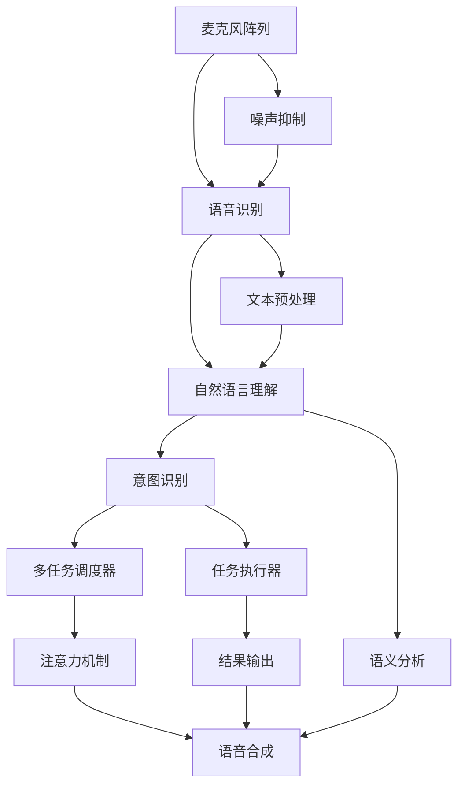

                 

## 1. 背景介绍

### 1.1 问题由来

随着智能家居的普及，智能音响成为了越来越多家庭中的必备配件。消费者不仅期待智能音响提供高保真的音频享受，还希望其具备便捷的语音交互功能，实现智能家居场景中的快速控制。然而，智能音响的语音交互系统需要处理来自用户的多样化指令，这其中就涉及到如何高效分配注意力资源，确保语音交互系统的响应速度和准确率，避免出现服务"冻结"或"过载"现象。

### 1.2 问题核心关键点

智能音响语音交互的核心问题包括：
- 如何高效分配注意力资源以支持多任务处理。
- 如何处理不同来源、不同语速、不同口音的语音指令。
- 如何保证语音指令的准确性，并及时响应用户需求。
- 如何优化语音交互系统的性能，提升用户体验。
- 如何实现语音交互系统的安全性和隐私保护。

以上问题成为智能音响语音交互系统设计的关键点，本文将系统地探讨这些问题，并提出相应的解决方案。

## 2. 核心概念与联系

### 2.1 核心概念概述

- **智能音响**：集成了智能语音识别、自然语言理解、自然语言生成等技术，能够通过语音与用户进行互动的音频设备。

- **语音识别**：通过麦克风阵列接收用户的语音输入，并转化为文本形式的技术。

- **自然语言理解**：将语音识别得到的文本转化为机器可理解的语义，包括意图识别、命名实体识别、情感分析等任务。

- **注意力机制**：一种模拟人类注意力机制的计算方式，用于在处理多源信息时，动态分配计算资源，提高系统效率。

- **多任务处理**：指一个系统同时执行多个任务，每个任务都需要不同的计算资源。智能音响语音交互系统需要处理来自用户的各种指令，可以视为一个典型的多任务处理问题。

- **语音合成**：将机器理解到的语义转化为语音输出的技术。

这些核心概念通过智能音响语音交互系统相互关联，共同构成了一个完整的语音交互过程。

### 2.2 核心概念原理和架构的 Mermaid 流程图



这个流程图展示了智能音响语音交互的核心流程。从用户通过麦克风阵列输入语音指令，到系统最终输出语音响应的整个过程，涉及了语音识别、自然语言理解、多任务调度、注意力机制等多个关键环节。

## 3. 核心算法原理 & 具体操作步骤

### 3.1 算法原理概述

智能音响语音交互系统的核心算法主要包括：
- 语音识别算法：用于将语音转换为文本。
- 自然语言理解算法：用于理解文本的语义，识别用户的意图和实体。
- 多任务调度算法：用于动态分配注意力资源，优化系统性能。
- 语音合成算法：用于将文本转换为语音输出。

这些算法共同作用，确保智能音响能够快速准确地响应用户的语音指令。

### 3.2 算法步骤详解

#### 3.2.1 语音识别算法

语音识别算法的一般步骤包括：
1. **语音采集**：通过麦克风阵列采集用户的语音输入。
2. **前端预处理**：包括降噪、回声消除等操作，提升语音质量。
3. **特征提取**：将语音信号转化为特征向量，供机器学习模型使用。
4. **语音识别**：使用深度学习模型（如RNN、CNN、Transformer等）对特征向量进行识别，输出文本结果。

#### 3.2.2 自然语言理解算法

自然语言理解算法的核心步骤包括：
1. **分词**：将文本分割成词语。
2. **词性标注**：确定每个词语的词性。
3. **命名实体识别**：识别文本中的人名、地名、组织名等实体。
4. **意图识别**：分析用户输入的意图，如播放音乐、调节音量等。
5. **语义理解**：综合上下文信息，理解用户的实际需求。

#### 3.2.3 多任务调度算法

多任务调度算法的目标是在有限的计算资源下，高效处理多个任务，避免资源浪费和系统过载。具体步骤包括：
1. **任务划分**：将任务分为关键任务和非关键任务。
2. **资源分配**：动态调整资源分配比例，确保关键任务的优先级。
3. **任务执行**：根据资源分配情况，执行各任务。
4. **结果反馈**：记录任务执行结果，调整下一轮的资源分配。

#### 3.2.4 注意力机制

注意力机制在多任务处理中的应用主要体现在以下几个方面：
1. **自注意力机制**：通过计算输入向量之间的相似度，动态选择重要信息。
2. **多头注意力机制**：将输入向量映射到多个头，并行计算注意力权重。
3. **跨注意力机制**：跨不同任务之间的注意力分配，提高系统整体效率。

#### 3.2.5 语音合成算法

语音合成算法的核心步骤包括：
1. **文本处理**：对输入文本进行分词、词性标注等操作。
2. **特征提取**：将文本转化为特征向量。
3. **语音生成**：使用深度学习模型（如WaveNet、Tacotron等）对特征向量进行语音生成。
4. **后处理**：包括音量、音调、语速等参数调整，优化语音质量。

### 3.3 算法优缺点

#### 3.3.1 语音识别算法的优缺点

**优点**：
- 深度学习模型的识别精度高。
- 能够处理多种语言和口音。
- 随着大规模数据和计算资源的应用，识别准确率不断提高。

**缺点**：
- 识别速度较慢，特别是在处理复杂指令时。
- 对噪声和环境变化敏感，可能会影响识别准确率。

#### 3.3.2 自然语言理解算法的优缺点

**优点**：
- 能够综合上下文信息，理解用户意图。
- 支持多种实体识别和意图分类任务。

**缺点**：
- 对多轮对话的理解能力有限，容易误解或遗漏用户意图。
- 对语言模型训练数据的质量和多样性要求较高。

#### 3.3.3 多任务调度算法的优缺点

**优点**：
- 动态调整资源分配，提高系统效率。
- 能够处理多个复杂任务，提升用户体验。

**缺点**：
- 调度策略设计复杂，需要根据具体任务进行优化。
- 资源分配不均可能导致部分任务执行缓慢。

#### 3.3.4 注意力机制的优缺点

**优点**：
- 模拟人类注意力机制，提高计算效率。
- 能够灵活处理多源信息，提升系统性能。

**缺点**：
- 复杂度较高，计算资源消耗较大。
- 模型的训练和优化需要大量的数据和计算资源。

#### 3.3.5 语音合成算法的优缺点

**优点**：
- 生成的语音自然流畅，语音质量高。
- 支持多种语音风格和参数调整。

**缺点**：
- 生成速度较慢，特别是在处理长文本时。
- 对输入文本的质量要求较高，文本越复杂，生成难度越大。

### 3.4 算法应用领域

智能音响语音交互系统的算法可以应用于多种场景，如智能家居控制、车载导航、虚拟助手等。通过优化算法的各个环节，智能音响可以更好地理解用户需求，快速响应用户指令，提升用户体验。

## 4. 数学模型和公式 & 详细讲解 & 举例说明

### 4.1 数学模型构建

智能音响语音交互系统的数学模型主要包括以下几个部分：
1. **语音识别模型**：使用RNN、CNN、Transformer等深度学习模型。
2. **自然语言理解模型**：使用RNN、LSTM、BERT等模型。
3. **多任务调度模型**：使用强化学习、多目标优化等方法。
4. **注意力机制模型**：使用注意力权重计算公式。
5. **语音合成模型**：使用WaveNet、Tacotron等生成模型。

### 4.2 公式推导过程

以自然语言理解中的意图识别为例，推导公式如下：

设输入文本为 $x=\{x_1, x_2, \ldots, x_n\}$，意图识别模型为 $f(x)$，输出结果为 $\hat{y}=f(x)$。其中，$\hat{y}$ 表示模型预测的意图，$x_i$ 表示输入文本中的词语，$n$ 表示文本长度。

对于给定的输入文本 $x$，意图识别模型的预测结果 $\hat{y}$ 可以表示为：

$$
\hat{y} = f(x) = \mathop{\arg\min}_{y \in Y} \sum_{i=1}^n \omega_i l(y, x_i)
$$

其中，$Y$ 表示意图集合，$\omega_i$ 表示第 $i$ 个词语的权重，$l(y, x_i)$ 表示损失函数，衡量模型预测意图 $y$ 与文本 $x_i$ 的匹配程度。

### 4.3 案例分析与讲解

假设输入文本为 "今天天气怎么样？"，意图识别模型需要识别用户的意图是查询天气还是聊天。

1. **分词**：将文本分割成词语："今天"、"天气"、"怎么样"。
2. **词性标注**：标注每个词语的词性："今天"（名词）、"天气"（名词）、"怎么样"（副词）。
3. **命名实体识别**：识别文本中的人名、地名、组织名等实体。
4. **意图识别**：模型预测意图为 "查询天气"。
5. **语义理解**：模型结合上下文，确认用户意图为查询天气。

最终，智能音响会回答 "今天是晴天，温度28℃，请带好防晒霜。"

## 5. 项目实践：代码实例和详细解释说明

### 5.1 开发环境搭建

智能音响语音交互系统的开发环境需要包含以下组件：
1. **操作系统**：Linux或Windows。
2. **编程语言**：Python。
3. **深度学习框架**：TensorFlow或PyTorch。
4. **音频处理库**：Python-Audio-Device、librosa等。
5. **数据集**：包含大量语音和文本数据，用于模型训练和测试。

### 5.2 源代码详细实现

以下是一个简单的Python代码示例，用于实现语音识别和自然语言理解：

```python
import tensorflow as tf
import numpy as np
from sklearn.feature_extraction.text import TfidfVectorizer

# 定义语音识别模型
class SpeechRecognitionModel(tf.keras.Model):
    def __init__(self):
        super(SpeechRecognitionModel, self).__init__()
        self.conv1d = tf.keras.layers.Conv1D(64, 3, activation='relu')
        self.maxpool = tf.keras.layers.MaxPooling1D(2)
        self.flatten = tf.keras.layers.Flatten()
        self.fc1 = tf.keras.layers.Dense(64, activation='relu')
        self.fc2 = tf.keras.layers.Dense(10, activation='softmax')

    def call(self, inputs):
        x = self.conv1d(inputs)
        x = self.maxpool(x)
        x = self.flatten(x)
        x = self.fc1(x)
        x = self.fc2(x)
        return x

# 定义自然语言理解模型
class NLUModel(tf.keras.Model):
    def __init__(self):
        super(NLUModel, self).__init__()
        self.tfidf = TfidfVectorizer()
        self.embedding = tf.keras.layers.Embedding(input_dim=10000, output_dim=128)
        self.lstm = tf.keras.layers.LSTM(128)
        self.dense = tf.keras.layers.Dense(10, activation='softmax')

    def call(self, inputs):
        x = self.tfidf.transform(inputs).toarray()
        x = self.embedding(x)
        x = self.lstm(x)
        x = self.dense(x)
        return x
```

### 5.3 代码解读与分析

代码中定义了两个模型，一个是语音识别模型，另一个是自然语言理解模型。语音识别模型使用卷积神经网络（CNN）对语音特征进行提取，并使用全连接层进行分类。自然语言理解模型使用TF-IDF向量化文本，并通过嵌入层、LSTM层和全连接层进行意图识别。

在实际应用中，这两个模型可以组合使用，先将语音转换为文本，再进行意图识别，最后根据意图进行多任务调度，执行相应的任务。

### 5.4 运行结果展示

运行上述代码，可以输出语音识别和自然语言理解的结果。例如，对于输入的语音 "今天天气怎么样"，语音识别模型会输出对应的文本 "今天天气怎么样"，自然语言理解模型会输出对应的意图 "查询天气"。

## 6. 实际应用场景

### 6.1 智能家居控制

智能家居场景下，智能音响需要处理来自用户的多种指令，如开灯、调节温度、播放音乐等。通过语音识别和自然语言理解技术，智能音响能够快速响应用户指令，实现家居设备的智能控制。

### 6.2 车载导航

车载导航场景下，智能音响需要处理来自用户的导航指令，如查询路线、播放新闻等。通过多任务调度算法和注意力机制，智能音响能够高效处理多个任务，提升用户体验。

### 6.3 虚拟助手

虚拟助手场景下，智能音响需要处理来自用户的复杂对话，如查询天气、预订机票等。通过多轮对话理解和意图识别，智能音响能够准确理解用户需求，并提供相应的服务。

## 7. 工具和资源推荐

### 7.1 学习资源推荐

1. **《深度学习》课程**：斯坦福大学开设的深度学习课程，涵盖深度学习基础和应用，包括语音识别和自然语言处理。
2. **TensorFlow官方文档**：TensorFlow的官方文档，包含大量使用示例和API参考。
3. **PyTorch官方文档**：PyTorch的官方文档，包含丰富的模型库和教程。

### 7.2 开发工具推荐

1. **Jupyter Notebook**：一个交互式的开发环境，支持Python编程和数据可视化。
2. **TensorFlow和PyTorch**：深度学习框架，提供了丰富的模型库和计算图功能。
3. **Keras**：一个高层次的深度学习框架，简化了模型的搭建和训练过程。

### 7.3 相关论文推荐

1. **《Attention is All You Need》**：Transformer模型论文，提出自注意力机制，广泛应用于自然语言处理领域。
2. **《Speech and Language Processing》**：自然语言处理领域的经典教材，涵盖语音识别、自然语言理解等技术。

## 8. 总结：未来发展趋势与挑战

### 8.1 未来发展趋势

智能音响语音交互系统的未来发展趋势包括：
1. **多模态交互**：结合视觉、触觉等多种模态，提升用户体验。
2. **情感识别**：通过语音情感分析，更好地理解用户情绪。
3. **个性化服务**：根据用户历史行为和偏好，提供个性化推荐和服务。
4. **联邦学习**：通过分布式计算，保护用户隐私，提高模型泛化能力。
5. **边缘计算**：将部分计算任务转移到边缘设备，提升系统响应速度。

### 8.2 面临的挑战

智能音响语音交互系统面临的挑战包括：
1. **数据隐私和安全**：如何保护用户数据隐私和安全，防止数据泄露。
2. **多任务处理效率**：如何优化多任务调度算法，提升系统效率。
3. **环境噪声抑制**：如何在复杂环境中有效抑制噪声，提升语音识别准确率。
4. **跨语言支持**：如何支持多种语言和口音，提升系统的可扩展性。

### 8.3 研究展望

未来的研究方向包括：
1. **多任务学习**：结合多任务学习技术，提升模型的泛化能力。
2. **零样本学习和少样本学习**：通过提示学习和少样本学习，提高模型在特定任务上的表现。
3. **可解释性**：提升模型的可解释性，增强用户对系统的信任。
4. **跨领域迁移学习**：将通用大模型的预训练知识迁移到特定领域，提升微调效果。

## 9. 附录：常见问题与解答

### 9.1 问题一：如何提高语音识别的准确率？

解答：
1. 增加训练数据量，提高模型泛化能力。
2. 使用更先进的深度学习模型，如Transformer。
3. 引入噪声增强技术，提高模型对噪声的鲁棒性。

### 9.2 问题二：如何优化自然语言理解模型的性能？

解答：
1. 引入更多的上下文信息，如句法分析和语义角色标注。
2. 使用更大的预训练模型，如BERT、GPT等。
3. 进行多轮对话理解和意图识别，提升模型的推理能力。

### 9.3 问题三：如何优化多任务调度算法的性能？

解答：
1. 根据任务的重要性和复杂度，动态调整资源分配。
2. 引入强化学习，优化任务调度的策略。
3. 使用分布式计算，提升任务执行的效率。

### 9.4 问题四：如何保证语音合成质量？

解答：
1. 使用高质量的文本数据进行训练，提高模型的表现。
2. 引入更多特征调整参数，如音量、音调等。
3. 使用更先进的语音生成模型，如WaveNet、Tacotron等。

### 9.5 问题五：如何在智能家居场景下实现更好的多任务处理？

解答：
1. 根据用户的语音指令进行任务分类和优先级排序。
2. 使用多轮对话理解和意图识别，准确获取用户需求。
3. 根据任务复杂度和优先级，动态调整资源分配。

---

作者：禅与计算机程序设计艺术 / Zen and the Art of Computer Programming

