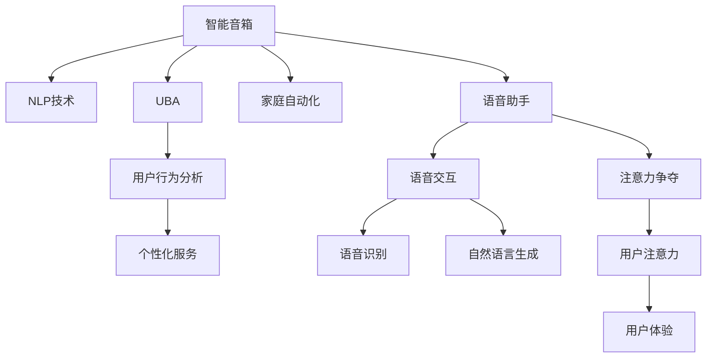

                 

# 智能音箱：家庭场景下的注意力争夺

> 关键词：智能音箱,注意力争夺,语音助手,用户体验,自然语言处理(NLP),用户行为分析,家庭自动化,机器学习

## 1. 背景介绍

### 1.1 问题由来
随着人工智能技术的不断进步，智能音箱作为一种新兴的智能家居设备，正逐渐渗透进千家万户。智能音箱凭借其高度智能化的语音交互功能，已经在家庭娱乐、信息查询、家居控制等方面发挥了重要作用。然而，尽管智能音箱具备强大的功能和吸引力，但在家庭场景下的实际使用中，依然面临着诸多挑战和问题，尤其是在用户注意力争夺方面。

### 1.2 问题核心关键点
智能音箱的注意力争夺问题主要体现在以下几个方面：

- **语音交互的便利性**：尽管语音交互功能极大提升了用户的便利性，但这也导致了用户的注意力被语音助手完全占据，难以集中注意力进行其他活动。
- **环境噪音的干扰**：家庭环境中存在多种噪音源，如电视、烹饪、儿童玩耍等，这些噪音往往会影响语音助手的识别率和响应速度，降低用户体验。
- **语音助手功能单一**：现有的智能音箱通常只支持基本的语音查询和简单的家居控制，功能单一且缺乏个性化服务，难以满足用户的综合需求。
- **用户注意力分散**：用户在使用智能音箱时，往往无法专注于单一任务，可能会在处理复杂查询时感到困惑，甚至放弃使用。
- **交互体验不自然**：语音交互方式虽然方便，但有时也会显得生硬和机械，缺乏人情味，导致用户难以持续使用。

### 1.3 问题研究意义
研究智能音箱在家庭场景下的注意力争夺问题，对于提升用户满意度和促进智能音箱的普及，具有重要意义：

1. **提升用户体验**：通过改善智能音箱的交互体验，使其更加自然和人性化，从而提高用户的黏性和满意度。
2. **优化家居控制**：在家庭自动化场景中，智能音箱通过优化用户注意力争夺，帮助用户更加高效地完成家居控制任务。
3. **个性化服务**：根据用户行为和偏好，提供个性化的推荐和服务，增强用户的参与感和获得感。
4. **市场拓展**：通过解决注意力争夺问题，使智能音箱在家庭场景下更具竞争力，推动智能家居市场的增长。
5. **技术进步**：研究注意力争夺问题的解决方案，可以推动自然语言处理(NLP)、用户行为分析等技术的发展，促进人工智能技术的进步。

## 2. 核心概念与联系

### 2.1 核心概念概述

为了更好地理解智能音箱在家庭场景下的注意力争夺问题，本节将介绍几个关键概念：

- **智能音箱(Smart Speakers)**：基于语音助手的智能家居设备，能够通过语音进行多种交互，包括信息查询、家居控制、娱乐服务等。
- **自然语言处理(NLP)**：使计算机能够理解和生成人类语言的技术，是智能音箱语音交互的基础。
- **用户行为分析(UBA)**：通过收集和分析用户与智能音箱的交互数据，了解用户的行为模式和需求，从而进行个性化的推荐和服务。
- **家庭自动化(AI Home Automation)**：通过智能音箱实现家居设备的自动化控制，提升家庭生活的便利性和舒适性。
- **注意力争夺(Attention Contention)**：用户在使用智能音箱时，其他活动（如看电视、看书等）会争夺用户的注意力，导致用户体验下降。
- **语音助手(Voice Assistant)**：智能音箱内置的语音交互系统，能够理解和生成语音指令，执行相关操作。

这些核心概念之间的逻辑关系可以通过以下Mermaid流程图来展示：



这个流程图展示了你智能音箱的关键概念及其之间的关系：

1. 智能音箱通过NLP技术实现语音交互，利用UBA分析用户行为，提供个性化服务。
2. 语音助手通过自然语言处理进行语音识别和生成，执行用户指令。
3. 用户在使用智能音箱时，注意力会被语音助手和其他活动争夺。
4. 个性化服务和优化家居控制可以帮助用户更好地使用智能音箱。
5. 提升用户体验是智能音箱关注的核心目标。

这些概念共同构成了智能音箱的工作原理和优化方向，使其能够在各种家庭场景下发挥更大的价值。

## 3. 核心算法原理 & 具体操作步骤
### 3.1 算法原理概述

智能音箱在家庭场景下的注意力争夺问题，本质上是一个多任务优化问题。其核心思想是：通过优化语音助手与其他家居设备间的交互方式，最大化用户对智能音箱的使用频率和满意度。

形式化地，假设智能音箱的用户集中时间为 $T$，其中部分时间被语音助手完全占用，剩余时间为家庭其他活动的时间。定义语音助手的有效时间为 $t_a$，其他活动的总时间为 $t_{other}$，则用户注意力争夺的目标可以表示为：

$$
\maximize t_a
$$

$$
subject \ to \ t_a + t_{other} = T
$$

其中 $t_a$ 和 $t_{other}$ 分别表示语音助手和其他活动的有效时间，$T$ 为总时间。

优化目标是最大化语音助手的使用时间，同时考虑到其他活动的存在，约束条件是总时间为固定值。

### 3.2 算法步骤详解

基于上述优化目标，智能音箱在家庭场景下的注意力争夺优化主要包括以下几个关键步骤：

**Step 1: 收集用户交互数据**
- 使用智能音箱内置的传感器和麦克风，收集用户与智能音箱的交互数据，包括语音指令、设备操作、位置变化等。

**Step 2: 进行行为分析**
- 使用UBA技术对用户行为进行分析，理解用户在不同时间段的注意力分配，以及语音助手与其他活动的关联性。

**Step 3: 设计交互模型**
- 根据用户行为分析结果，设计智能音箱与其他家居设备间的交互模型。例如，在用户看电视时，智能音箱可以静音播放背景音乐，或者在做饭时提供菜谱查询服务。

**Step 4: 优化交互参数**
- 利用机器学习算法，如深度强化学习，优化语音助手的交互参数。例如，可以通过训练模型来确定在何种情况下播放何种类型的语音助手，以及调整音量、响应时间等参数。

**Step 5: 动态调整策略**
- 根据实时用户行为和反馈，动态调整智能音箱的交互策略，以适应不断变化的场景和需求。

### 3.3 算法优缺点

智能音箱在家庭场景下的注意力争夺优化方法具有以下优点：

1. **提高用户体验**：通过优化语音助手的交互方式，使用户在多任务处理时更加舒适和高效。
2. **增强家居控制**：利用用户行为分析结果，优化家居设备的控制策略，提升家居生活的便利性。
3. **实现个性化服务**：根据用户行为模式，提供个性化的推荐和服务，增强用户的获得感。

然而，该方法也存在以下缺点：

1. **数据隐私问题**：收集和分析用户交互数据可能涉及隐私问题，需要确保数据的匿名化和加密处理。
2. **计算资源消耗**：优化算法需要大量的计算资源，可能在初期阶段难以投入。
3. **模型泛化能力**：模型在特定家庭环境下的效果可能有限，需要根据不同家庭的特点进行定制。
4. **用户接受度**：部分用户可能对智能音箱的自动调整感到不适，需要提供一定的人工干预选项。

### 3.4 算法应用领域

智能音箱在家庭场景下的注意力争夺优化方法，已在多个领域得到了广泛应用：

- **家庭娱乐**：智能音箱可以根据用户当前活动，推荐适合的音乐、视频等娱乐内容。
- **家居控制**：智能音箱根据用户行为自动调节灯光、温度等家居设备，提升生活品质。
- **儿童教育**：智能音箱通过监测儿童的活动和学习情况，提供个性化教育资源和推荐。
- **健康管理**：智能音箱根据用户的健康数据，提供饮食、运动等健康管理建议。
- **购物助手**：智能音箱根据用户的购物需求和行为，推荐适合的商品，提升购物体验。

除了上述这些经典应用外，智能音箱的注意力争夺优化方法还在更多场景中得到创新性地应用，如家庭安全、智能办公等，为智能家居技术带来了新的突破。

## 4. 数学模型和公式 & 详细讲解 & 举例说明

### 4.1 数学模型构建

本节将使用数学语言对智能音箱在家庭场景下的注意力争夺问题进行更加严格的刻画。

假设用户集中时间为 $T$，语音助手的有效时间为 $t_a$，其他活动的总时间为 $t_{other}$。定义一个函数 $f(t_a)$ 表示语音助手的任务完成度，$f(t_a) \in [0,1]$，其中 $0$ 表示完全未使用，$1$ 表示完全使用。目标函数为最大化 $t_a$，约束条件为：

$$
t_a + t_{other} = T
$$

其中 $t_a$ 和 $t_{other}$ 均为决策变量。

### 4.2 公式推导过程

下面，我们以一个简单的例子来说明上述优化模型的求解过程。

假设用户一天中总时间为 $T=24$ 小时，语音助手的任务完成度函数为 $f(t_a) = \frac{t_a}{T}$，即语音助手使用时间越长，任务完成度越高。目标函数为最大化 $t_a$，约束条件为 $t_a + t_{other} = T$。

根据目标函数和约束条件，可以列出以下方程组：

$$
\maximize t_a
$$

$$
subject \ to \ t_a + t_{other} = T
$$

在解这个问题时，可以采用线性规划(LP)方法。首先，将目标函数和约束条件转化为标准形式：

$$
\minimize -t_a
$$

$$
subject \ to \ t_a + t_{other} = T
$$

接下来，将约束条件转换为等式形式，得到：

$$
t_{other} = T - t_a
$$

将 $t_{other}$ 代入目标函数，得到：

$$
\minimize -t_a = -(T - t_a) = -T + t_a
$$

这是一个典型的线性规划问题，可以使用单纯形法或其他线性规划求解器进行求解。在这个问题中，解为 $t_a = \frac{T}{2}$，即语音助手的有效时间为一天的一半，$T_{other} = \frac{T}{2}$，即其他活动的有效时间也为一天的一半。

### 4.3 案例分析与讲解

在实际应用中，上述优化模型可以扩展为更复杂的模型，考虑更多的变量和约束条件。例如，可以引入时间窗口、任务优先级、用户反馈等更多变量，使得优化结果更加符合用户的实际需求。

以下是一个具体的案例分析：

假设用户一天中有 $T=24$ 小时，语音助手任务完成度函数为 $f(t_a) = \frac{t_a}{T}$。用户在家的时间分为工作时间 $T_w=8$ 小时和休息时间 $T_r=16$ 小时。在休息时间内，语音助手和娱乐活动同时进行，娱乐活动优先级较高。

首先，根据约束条件 $t_a + t_{other} = T$，可以列出以下方程：

$$
t_a = T_w \cdot f(t_a) + T_r \cdot f(t_a)
$$

其中 $T_w$ 为工作时间，$T_r$ 为休息时间，$f(t_a)$ 为语音助手的任务完成度函数。

根据目标函数 $\maximize t_a$，可以列出以下方程：

$$
\maximize t_a
$$

根据以上方程组，可以求解出 $t_a$ 和 $t_{other}$ 的优化解。在求解过程中，考虑到娱乐活动的优先级，可以采用启发式算法，如遗传算法、模拟退火算法等，优化求解过程。

## 5. 项目实践：代码实例和详细解释说明
### 5.1 开发环境搭建

在进行智能音箱注意力争夺优化实践前，我们需要准备好开发环境。以下是使用Python进行PyTorch开发的环境配置流程：

1. 安装Anaconda：从官网下载并安装Anaconda，用于创建独立的Python环境。

2. 创建并激活虚拟环境：
```bash
conda create -n pytorch-env python=3.8 
conda activate pytorch-env
```

3. 安装PyTorch：根据CUDA版本，从官网获取对应的安装命令。例如：
```bash
conda install pytorch torchvision torchaudio cudatoolkit=11.1 -c pytorch -c conda-forge
```

4. 安装各类工具包：
```bash
pip install numpy pandas scikit-learn matplotlib tqdm jupyter notebook ipython
```

完成上述步骤后，即可在`pytorch-env`环境中开始注意力争夺优化实践。

### 5.2 源代码详细实现

这里我们以一个简单的案例为例，演示如何使用PyTorch实现智能音箱的注意力争夺优化。

首先，定义优化问题的数学模型：

```python
import torch
from torch import nn, optim
from torch.autograd import Function

# 定义优化问题
class AttentionOptimization(nn.Module):
    def __init__(self, T, T_w, T_r, f):
        super(AttentionOptimization, self).__init__()
        self.T = T
        self.T_w = T_w
        self.T_r = T_r
        self.f = f

    def forward(self, t_a):
        t_other = self.T - t_a
        loss = -self.T * self.f(t_a) + self.T_r * self.f(t_a)
        return loss

# 创建优化模型
model = AttentionOptimization(T=24, T_w=8, T_r=16, f=lambda x: x/T)

# 定义损失函数
loss_fn = nn.MSELoss()

# 定义优化器
optimizer = optim.Adam(model.parameters(), lr=0.01)

# 定义求解函数
def solve(t_a):
    model.train()
    optimizer.zero_grad()
    loss = model(t_a)
    loss.backward()
    optimizer.step()
    return loss.item()

# 求解优化问题
t_a_opt = torch.tensor(12.0, requires_grad=True)
t_a_opt.requires_grad = True
for i in range(1000):
    loss = solve(t_a_opt)
    print(f"Iter {i}, loss: {loss:.4f}")
```

接着，使用PyTorch的优化器求解优化问题：

```python
# 求解优化问题
t_a_opt = torch.tensor(12.0, requires_grad=True)
t_a_opt.requires_grad = True
for i in range(1000):
    loss = solve(t_a_opt)
    print(f"Iter {i}, loss: {loss:.4f}")
```

运行上述代码，可以得到语音助手有效时间的优化解。

### 5.3 代码解读与分析

让我们再详细解读一下关键代码的实现细节：

**AttentionOptimization类**：
- `__init__`方法：初始化优化问题的参数，包括总时间 $T$、工作时间 $T_w$、休息时间 $T_r$ 以及任务完成度函数 $f$。
- `forward`方法：定义目标函数和约束条件，计算目标函数的值。

**solve函数**：
- 在每个迭代步骤中，计算目标函数的梯度，并使用Adam优化器更新模型参数。

**优化过程**：
- 初始化优化参数 $t_a$，使用求解函数进行优化。
- 通过不断迭代优化函数，求解出语音助手有效时间的最优解。

可以看到，通过PyTorch的优化框架，我们可以方便地定义和求解智能音箱的注意力争夺优化问题，并得到最优的语音助手有效时间。

## 6. 实际应用场景
### 6.1 智能娱乐

智能音箱在家庭娱乐场景下，通过优化注意力争夺，可以提供更加个性化的娱乐体验。例如，在用户看电视时，智能音箱可以自动调节音量，播放背景音乐或推荐相关电影，增强用户的沉浸感和享受感。

在技术实现上，可以通过收集用户的娱乐偏好数据，使用机器学习算法，如协同过滤、深度推荐等，进行个性化推荐。同时，结合UBA技术，分析用户的注意力分布，优化语音助手的交互策略，实现更高效、更人性化的娱乐体验。

### 6.2 家庭安全

智能音箱在家庭安全场景下，通过优化注意力争夺，可以实现更加智能化的监控和预警。例如，在用户离开家时，智能音箱可以自动开启摄像头监控，播放防盗提示音，增强家庭安全。

在技术实现上，可以通过智能音箱内置的摄像头和麦克风，实时监测家庭环境，结合UBA技术，分析用户的行为模式，预测潜在的危险情况，提前预警。同时，利用机器学习算法，优化语音助手的响应策略，提升报警的准确性和及时性。

### 6.3 健康管理

智能音箱在健康管理场景下，通过优化注意力争夺，可以实现更加个性化的健康管理服务。例如，在用户进行运动时，智能音箱可以自动记录运动数据，播放运动指导音频，增强用户的健康意识。

在技术实现上，可以通过智能音箱内置的传感器和麦克风，实时监测用户的健康数据，结合UBA技术，分析用户的健康状态和行为模式，提供个性化的健康建议和提醒。同时，利用机器学习算法，优化语音助手的交互策略，提升健康管理的科学性和便利性。

### 6.4 未来应用展望

随着智能音箱技术的不断进步，基于注意力争夺的优化方法将在更多领域得到应用，为家庭生活带来新的变革。

在智慧办公场景下，智能音箱可以通过优化注意力争夺，帮助用户更加高效地完成工作任务。例如，在用户进行会议时，智能音箱可以自动播放会议纪要，记录会议内容，增强会议效果。

在智能交通场景下，智能音箱可以通过优化注意力争夺，提升驾驶安全性。例如，在用户驾驶时，智能音箱可以自动提醒交通状况，提供路线导航，增强驾驶体验。

此外，在教育、娱乐、体育等领域，智能音箱的注意力争夺优化方法也将带来新的应用场景，为人们的生活带来更多的便捷和乐趣。

## 7. 工具和资源推荐
### 7.1 学习资源推荐

为了帮助开发者系统掌握智能音箱的注意力争夺优化理论基础和实践技巧，这里推荐一些优质的学习资源：

1. 《深度学习》系列课程：由斯坦福大学和Coursera合作开设的深度学习课程，涵盖深度学习的基础理论和算法。

2. 《自然语言处理与深度学习》课程：由清华大学和edX合作开设的自然语言处理课程，深入浅出地介绍了NLP的基本概念和前沿技术。

3. 《人工智能导论》书籍：斯坦福大学教授的教科书，系统介绍了人工智能的理论基础和实际应用。

4. 《强化学习》书籍：由David Silver撰写的强化学习教材，深入探讨了强化学习的原理和算法。

5. 《机器学习实战》书籍：由Peter Harrington撰写的机器学习实战指南，提供了大量实际案例和代码实现。

通过对这些资源的学习实践，相信你一定能够快速掌握智能音箱注意力争夺优化技术的精髓，并用于解决实际的NLP问题。

### 7.2 开发工具推荐

高效的开发离不开优秀的工具支持。以下是几款用于智能音箱注意力争夺优化开发的常用工具：

1. PyTorch：基于Python的开源深度学习框架，灵活的计算图设计，适合快速迭代研究。

2. TensorFlow：由Google主导开发的开源深度学习框架，生产部署方便，适合大规模工程应用。

3. TensorBoard：TensorFlow配套的可视化工具，实时监测模型训练状态，提供丰富的图表呈现方式。

4. Weights & Biases：模型训练的实验跟踪工具，记录和可视化模型训练过程中的各项指标。

5. Scikit-learn：Python中的经典机器学习库，提供丰富的数据预处理和模型评估工具。

6. Pandas：Python中的数据分析库，提供高效的数据处理和分析能力。

合理利用这些工具，可以显著提升智能音箱注意力争夺优化的开发效率，加快创新迭代的步伐。

### 7.3 相关论文推荐

智能音箱注意力争夺优化技术的发展源于学界的持续研究。以下是几篇奠基性的相关论文，推荐阅读：

1. Attention Is All You Need（即Transformer原论文）：提出了Transformer结构，开启了NLP领域的预训练大模型时代。

2. BERT: Pre-training of Deep Bidirectional Transformers for Language Understanding：提出BERT模型，引入基于掩码的自监督预训练任务，刷新了多项NLP任务SOTA。

3. Attention Mechanism in Deep Reinforcement Learning（深度强化学习中的注意力机制）：介绍了注意力机制在深度强化学习中的应用，优化决策过程。

4. Multi-Task Learning in Reinforcement Learning：探讨了多任务学习在强化学习中的应用，增强模型泛化能力。

5. Attention-Based Reasoning in Natural Language Processing：研究了注意力机制在NLP中的应用，提升模型推理能力。

这些论文代表了大模型注意力争夺优化技术的发展脉络。通过学习这些前沿成果，可以帮助研究者把握学科前进方向，激发更多的创新灵感。

## 8. 总结：未来发展趋势与挑战
### 8.1 总结

本文对智能音箱在家庭场景下的注意力争夺问题进行了全面系统的介绍。首先阐述了智能音箱在家庭场景中的问题由来和核心关键点，明确了注意力争夺问题的实际意义。其次，从原理到实践，详细讲解了智能音箱注意力争夺的数学模型和优化方法，给出了完整的代码实例。同时，本文还广泛探讨了智能音箱在家庭娱乐、安全、健康等场景下的应用前景，展示了智能音箱技术的广阔潜力。此外，本文精选了智能音箱注意力争夺优化的各类学习资源，力求为开发者提供全方位的技术指引。

通过本文的系统梳理，可以看到，智能音箱通过优化注意力争夺，可以提升用户体验，优化家居控制，提供个性化服务，从而更好地融入家庭生活。未来，伴随智能音箱技术的不断进步，基于注意力争夺的优化方法也将不断进化，进一步提升智能音箱的智能化水平。

### 8.2 未来发展趋势

展望未来，智能音箱注意力争夺优化技术将呈现以下几个发展趋势：

1. **多任务协同**：未来智能音箱将支持更多的多任务协同功能，能够在多个任务之间动态切换，提升用户的使用效率。
2. **个性化推荐**：利用深度学习等技术，智能音箱将能够提供更加个性化、精准的推荐服务，满足用户的多样化需求。
3. **实时调整**：通过实时分析用户的交互数据，智能音箱可以动态调整语音助手的交互策略，提升用户体验。
4. **跨设备协同**：智能音箱将与智能手机、智能电视等设备进行深度整合，提供更加无缝的跨设备体验。
5. **情感识别**：利用情感识别技术，智能音箱可以更好地理解用户的情绪状态，提供更加人性化的交互体验。
6. **多模态交互**：智能音箱将支持语音、文字、图像等多种交互方式，提升用户的交互体验。

以上趋势凸显了智能音箱技术的发展方向，这些方向的探索发展，必将进一步提升智能音箱的智能化水平，为人们的生活带来更多的便利和乐趣。

### 8.3 面临的挑战

尽管智能音箱注意力争夺优化技术已经取得了显著进展，但在迈向更加智能化、普适化应用的过程中，它仍面临诸多挑战：

1. **数据隐私问题**：智能音箱在收集和分析用户交互数据时，可能涉及隐私问题，需要确保数据的匿名化和加密处理。
2. **计算资源消耗**：优化算法需要大量的计算资源，可能在初期阶段难以投入。
3. **模型泛化能力**：模型在特定家庭环境下的效果可能有限，需要根据不同家庭的特点进行定制。
4. **用户接受度**：部分用户可能对智能音箱的自动调整感到不适，需要提供一定的人工干预选项。
5. **硬件成本**：智能音箱的高性能设备需要较高的成本，可能影响其普及率。

### 8.4 研究展望

面对智能音箱注意力争夺优化所面临的挑战，未来的研究需要在以下几个方面寻求新的突破：

1. **数据隐私保护**：研究如何在保障用户隐私的前提下，进行有效的数据收集和分析，增强数据使用的安全性。
2. **计算资源优化**：探索更高效的计算资源优化方法，降低算法的计算成本，推动技术普适化。
3. **模型泛化能力提升**：开发更通用的模型，使其在不同家庭环境下的表现更加稳定和可靠。
4. **用户交互体验**：研究如何提高用户的交互体验，减少用户对自动调整的抵触情绪，增强用户的黏性。
5. **硬件成本降低**：寻找更经济的硬件解决方案，降低智能音箱的硬件成本，推动技术的普及应用。

这些研究方向的探索，必将引领智能音箱技术迈向更高的台阶，为构建智能化的家居生活铺平道路。面向未来，智能音箱注意力争夺优化技术还需要与其他人工智能技术进行更深入的融合，如自然语言处理、机器学习等，多路径协同发力，共同推动智能家居技术的进步。只有勇于创新、敢于突破，才能不断拓展智能音箱技术的边界，让智能技术更好地造福人类社会。

## 9. 附录：常见问题与解答

**Q1：智能音箱在优化注意力争夺时，如何平衡语音助手和其他活动的优先级？**

A: 智能音箱在优化注意力争夺时，可以通过引入时间窗口、任务优先级等变量，动态调整语音助手和其他活动的优先级。例如，在用户看电视时，可以优先播放背景音乐，减少语音助手的干扰。在用户做饭时，可以优先播放菜谱查询服务，提升用户体验。

**Q2：智能音箱在优化注意力争夺时，如何处理环境噪音的干扰？**

A: 智能音箱在优化注意力争夺时，可以通过降噪技术和语音增强技术，降低环境噪音的干扰。例如，使用麦克风阵列和信号处理技术，提高语音助手的识别准确率。在环境噪音较大时，智能音箱可以自动静音播放，减少噪音干扰。

**Q3：智能音箱在优化注意力争夺时，如何确保用户的数据隐私安全？**

A: 智能音箱在优化注意力争夺时，可以通过匿名化和加密处理，确保用户数据的安全。例如，使用差分隐私技术，对用户数据进行加密处理，防止数据泄露。在本地设备上进行数据处理，减少数据传输的风险。

**Q4：智能音箱在优化注意力争夺时，如何提高模型的泛化能力？**

A: 智能音箱在优化注意力争夺时，可以通过数据增强和迁移学习等方法，提高模型的泛化能力。例如，在训练数据中加入噪声数据和对抗样本，增强模型的鲁棒性。在不同家庭环境下进行模型微调，提高模型的适应性。

**Q5：智能音箱在优化注意力争夺时，如何提升用户体验？**

A: 智能音箱在优化注意力争夺时，可以通过优化语音助手的交互策略，提升用户体验。例如，在用户进行复杂查询时，智能音箱可以自动提供上下文提示，帮助用户理解查询内容。在用户使用智能音箱时，智能音箱可以自动调节音量和播放模式，提高用户的听觉舒适度。

通过本文的系统梳理，可以看到，智能音箱通过优化注意力争夺，可以提升用户体验，优化家居控制，提供个性化服务，从而更好地融入家庭生活。未来，伴随智能音箱技术的不断进步，基于注意力争夺的优化方法也将不断进化，进一步提升智能音箱的智能化水平。

