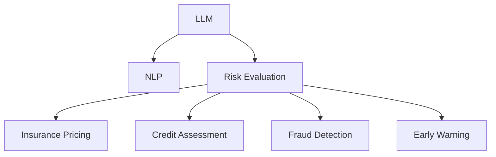

                 

# 智能风险评估：LLM在保险业务中的应用

> 关键词：大语言模型(LLM), 风险评估, 保险业, 自然语言处理(NLP), 保险数据, 潜在风险, 客户信用, 欺诈检测, 风险预警

## 1. 背景介绍

### 1.1 问题由来
保险行业面临着巨大的风险和挑战，特别是在金融危机和自然灾害频发的今天，如何准确评估风险，合理定价，是保险公司追求的重要目标。传统的保险风险评估方法依赖于人工核保和有限的历史数据，不仅效率低下，也难以捕捉动态变化的复杂风险。

近年来，随着人工智能技术的快速发展，大语言模型(LLM)在处理复杂自然语言任务上表现出色，能够从海量的非结构化数据中提取有价值的信息，为保险行业提供了新的风险评估解决方案。保险公司可以通过LLM对客户的申请资料、社交媒体、互联网行为等进行综合分析，准确评估客户的潜在风险，优化保险定价，提高服务质量。

### 1.2 问题核心关键点
保险风险评估的核心是利用大量数据训练出一个能够准确识别和量化潜在风险的模型。LLM作为一种新兴的AI技术，能够在处理复杂自然语言方面展现出强大的能力。因此，在保险行业中，利用LLM进行风险评估，可以充分利用自然语言信息，更准确地进行风险识别和量化，提升风险管理水平。

## 2. 核心概念与联系

### 2.1 核心概念概述

为更好地理解LLM在保险风险评估中的应用，本节将介绍几个密切相关的核心概念：

- 大语言模型(LLM)：以自回归(如GPT)或自编码(如BERT)模型为代表的大规模预训练语言模型。通过在大规模无标签文本语料上进行预训练，学习通用的语言表示，具备强大的语言理解和生成能力。

- 自然语言处理(NLP)：利用计算机技术处理和分析自然语言的学科，涵盖文本分类、命名实体识别、情感分析、语义理解等多个方向。

- 风险评估：根据风险管理理论，对被保险标的或个人可能面临的风险进行量化评估的过程。

- 保险定价：根据风险评估结果，制定合理的保费策略，使保险产品价格与风险程度相匹配。

- 潜在风险识别：利用数据分析和机器学习技术，从客户的背景资料、行为数据、社交媒体信息中识别出可能存在的风险因素。

- 客户信用评估：通过评估客户的信用历史、收入水平、债务情况等，判断其信用风险。

- 欺诈检测：利用机器学习模型识别出保险欺诈行为，保护保险公司利益。

- 风险预警：通过模型分析，提前发现潜在的风险变化，采取措施进行防范。

这些核心概念之间的逻辑关系可以通过以下Mermaid流程图来展示：



这个流程图展示了大语言模型在保险风险评估中的核心概念及其之间的关系：

1. 大语言模型通过预训练获得基础能力。
2. 自然语言处理技术提供数据预处理和特征提取功能。
3. 风险评估模型基于预训练语言模型的输出，进行风险量化。
4. 保险定价系统将风险评估结果与保费策略结合，确定保险产品价格。
5. 客户信用评估模型利用LLM处理后的信息，评估客户的信用风险。
6. 欺诈检测系统利用LLM识别保险欺诈行为。
7. 风险预警系统通过LLM分析客户数据，提前发现潜在风险。

这些概念共同构成了保险风险评估的框架，使得LLM在处理自然语言信息方面能够更好地应用于保险行业，提升风险管理的效果。

## 3. 核心算法原理 & 具体操作步骤
### 3.1 算法原理概述

基于大语言模型的保险风险评估方法，主要依赖于自然语言处理技术，通过训练一个或多个LLM模型，对客户的背景资料、行为数据、社交媒体信息等进行处理，提取其中的风险信号。

具体来说，该方法分为以下几个步骤：

1. 数据收集与预处理：收集客户的各种资料和行为数据，利用NLP技术对文本进行清洗和预处理。

2. 特征提取与表示学习：使用预训练的LLM模型，对客户的自然语言信息进行编码，提取语义和上下文信息。

3. 风险量化：基于提取的特征向量，训练一个或多个风险评估模型，进行风险等级量化。

4. 保险定价与信用评估：根据风险评估结果，确定合理的保费策略和客户信用等级。

5. 欺诈检测与预警：利用训练好的LLM模型，识别保险欺诈行为，并对潜在风险进行预警。

### 3.2 算法步骤详解

以客户信用评估为例，具体的LLM应用步骤如下：

**Step 1: 数据收集与预处理**
- 收集客户的各种资料，包括个人背景信息、收入情况、银行流水、社交媒体记录等。
- 利用自然语言处理技术，对文本进行分词、去除停用词、词性标注等预处理。
- 对数字类型的数据进行标准化处理，如归一化、中心化等。

**Step 2: 特征提取与表示学习**
- 选择预训练的LLM模型，如BERT、GPT等，对客户的文本数据进行编码，提取特征向量。
- 利用预训练模型的输出，进行下游任务的特征表示学习。
- 可以使用平均池化、最大池化等方式，从预训练模型的所有层中提取代表性的特征向量。

**Step 3: 风险量化**
- 根据提取的特征向量，设计风险评估模型，如随机森林、神经网络等。
- 训练模型，利用历史数据进行调参和优化，确保模型的泛化能力。
- 对客户的特征向量进行预测，量化其信用风险等级。

**Step 4: 保险定价与信用评估**
- 根据信用风险等级，结合保费策略，确定合理的保费价格。
- 根据信用风险等级，分配信用额度，进行信用评估。

**Step 5: 欺诈检测与预警**
- 利用训练好的LLM模型，对客户的申请资料、行为数据等进行分析和检测，识别出潜在的欺诈行为。
- 对发现的风险信号进行预警，通知相关人员进行进一步调查。

### 3.3 算法优缺点

基于大语言模型的保险风险评估方法具有以下优点：

1. 数据适应性广：LLM能够处理各种文本和半结构化数据，适应不同领域的风险评估需求。
2. 自动特征提取：预训练模型能够自动提取有用的特征，避免了手工特征工程的复杂性。
3. 风险量化精准：利用LLM的强大语言理解能力，能够更准确地识别和量化潜在风险。
4. 成本低：相比于传统人工核保方法，LLM风险评估能够大幅降低人力成本和时间成本。

同时，该方法也存在一定的局限性：

1. 数据隐私问题：处理客户数据时，需要考虑隐私保护和数据安全。
2. 模型训练成本高：训练高质量的LLM模型需要大量的计算资源和标注数据。
3. 解释性不足：LLM模型作为一个黑盒模型，难以解释其内部决策过程。
4. 依赖数据质量：模型效果依赖于输入数据的质量和完整性，数据偏差可能影响评估结果。

尽管存在这些局限性，但LLM在保险风险评估中的应用，能够显著提升风险管理的效率和准确性，具有广泛的应用前景。

### 3.4 算法应用领域

大语言模型在保险风险评估中的应用领域广泛，包括但不限于以下几个方面：

1. **客户信用评估**：对客户的信用历史、收入水平、债务情况等进行分析，量化其信用风险等级。

2. **风险评估与定价**：根据客户的自然语言信息，评估其潜在风险，进行保费定价。

3. **欺诈检测**：利用LLM对客户的申请资料和行为数据进行分析，识别出潜在的欺诈行为。

4. **风险预警与监控**：对客户的风险信号进行预警，及时采取防范措施。

5. **理赔审核**：利用LLM对理赔申请进行初步审核，提高理赔效率和准确性。

6. **客户服务与沟通**：利用LLM进行客户咨询和沟通，提升客户体验。

这些应用领域展示了LLM在保险风险评估中的广泛应用，推动了保险业向智能化和精准化的发展。

## 4. 数学模型和公式 & 详细讲解 & 举例说明

### 4.1 数学模型构建

本节将使用数学语言对基于LLM的保险风险评估方法进行更加严格的刻画。

记客户的自然语言信息为 $x$，信用风险等级为 $y$，预训练的LLM模型为 $M$。则风险评估模型的数学模型为：

$$
y=f(M(x))
$$

其中，$f$ 表示风险评估模型的映射函数，$M(x)$ 表示预训练的LLM模型对输入 $x$ 的编码输出。

假设 $M(x)$ 的输出为一个高维向量 $h$，风险评估模型 $f$ 为线性回归模型，则风险评估公式为：

$$
y=\beta_0+\beta_1h_1+\beta_2h_2+\dots+\beta_nh_n
$$

其中，$\beta_i$ 为线性回归模型的系数，$h_i$ 为输入向量 $x$ 通过预训练模型 $M$ 提取的特征向量。

### 4.2 公式推导过程

以二分类任务为例，假设客户的信用风险等级 $y$ 为二分类问题，即 $y \in \{0, 1\}$。则风险评估模型的损失函数为二分类交叉熵损失：

$$
L(y,f(x))=-(y\log f(x)+(1-y)\log(1-f(x)))
$$

将 $f(x)=M(x)$ 代入上式，得：

$$
L(y,M(x))=-(y\log M(x)+(1-y)\log(1-M(x)))
$$

训练风险评估模型的目标是最小化损失函数，即：

$$
\min_{\beta} \mathcal{L}(y, M(x))
$$

通过梯度下降等优化算法，最小化损失函数，求解出最优的模型系数 $\beta$。

### 4.3 案例分析与讲解

假设有一家保险公司的客户，其背景资料和行为数据如下：

| 特征名       | 特征值                |
|--------------|----------------------|
| 姓名         | John Doe              |
| 年龄         | 35                    |
| 职业         | 软件工程师            |
| 月收入       | 15000                 |
| 存款         | 20000                 |
| 贷款         | 5000                  |
| 社交媒体     | 活跃于LinkedIn         |
| 是否犯罪记录 | 无                    |
| 是否欠款      | 无                    |

根据以上数据，使用BERT模型对客户的背景资料和行为数据进行编码，得到特征向量 $h$。假设 $h$ 是一个包含10个特征的向量。

使用线性回归模型进行风险评估，模型系数为 $\beta$。则风险评估公式为：

$$
y=\beta_0+\beta_1h_1+\beta_2h_2+\dots+\beta_{10}h_{10}
$$

训练模型时，最小化交叉熵损失函数：

$$
\mathcal{L}(y, M(x))=-(y\log M(x)+(1-y)\log(1-M(x)))
$$

通过梯度下降算法，求解出最优的 $\beta$。假设求解出的 $\beta_0=0.5, \beta_1=0.2, \beta_2=-0.3$ 等。则客户的信用风险等级 $y$ 预测结果为：

$$
y=0.5+0.2h_1-0.3h_2+\dots
$$

根据预测结果，可以对客户的信用风险等级进行量化，进而进行保险定价和欺诈检测等后续处理。

## 5. 项目实践：代码实例和详细解释说明
### 5.1 开发环境搭建

在进行基于LLM的保险风险评估实践前，我们需要准备好开发环境。以下是使用Python进行PyTorch和Transformers库开发的环境配置流程：

1. 安装Anaconda：从官网下载并安装Anaconda，用于创建独立的Python环境。

2. 创建并激活虚拟环境：
```bash
conda create -n pytorch-env python=3.8 
conda activate pytorch-env
```

3. 安装PyTorch：根据CUDA版本，从官网获取对应的安装命令。例如：
```bash
conda install pytorch torchvision torchaudio cudatoolkit=11.1 -c pytorch -c conda-forge
```

4. 安装Transformers库：
```bash
pip install transformers
```

5. 安装各类工具包：
```bash
pip install numpy pandas scikit-learn matplotlib tqdm jupyter notebook ipython
```

完成上述步骤后，即可在`pytorch-env`环境中开始项目实践。

### 5.2 源代码详细实现

这里以使用BERT模型进行客户信用评估为例，给出完整的PyTorch代码实现。

首先，定义模型和优化器：

```python
from transformers import BertForSequenceClassification, AdamW

model = BertForSequenceClassification.from_pretrained('bert-base-uncased', num_labels=2)
optimizer = AdamW(model.parameters(), lr=2e-5)
```

然后，定义训练和评估函数：

```python
from transformers import DataCollatorForTokenClassification, Trainer, TrainingArguments
from torch.utils.data import Dataset, DataLoader

class CustomerDataset(Dataset):
    def __init__(self, texts, labels):
        self.texts = texts
        self.labels = labels

    def __len__(self):
        return len(self.texts)

    def __getitem__(self, item):
        text = self.texts[item]
        label = self.labels[item]
        return {'input_ids': text, 'attention_mask': [1]*len(text), 'labels': label}

# 设置训练参数
training_args = TrainingArguments(
    output_dir="./output",
    per_device_train_batch_size=16,
    per_device_eval_batch_size=16,
    num_train_epochs=3,
    learning_rate=2e-5,
    weight_decay=0.01,
)

# 定义数据加载器
train_dataset = CustomerDataset(train_texts, train_labels)
eval_dataset = CustomerDataset(eval_texts, eval_labels)
test_dataset = CustomerDataset(test_texts, test_labels)

# 定义模型和优化器
model = BertForSequenceClassification.from_pretrained('bert-base-uncased', num_labels=2)
optimizer = AdamW(model.parameters(), lr=2e-5)

# 定义训练器和评估器
trainer = Trainer(
    model=model,
    args=training_args,
    train_dataset=train_dataset,
    eval_dataset=eval_dataset,
    compute_metrics=lambda p: {'accuracy': p.logits.argmax(dim=-1).eq(p.label_ids).float().mean().item()},
    tokenizer=model.tokenizer,
    data_collator=DataCollatorForTokenClassification(tokenizer=model.tokenizer),
)

# 开始训练和评估
trainer.train()
trainer.evaluate()
```

这里，我们定义了一个简单的数据集 `CustomerDataset`，用于封装客户的背景资料和行为数据。同时，使用 `BertForSequenceClassification` 模型进行信用风险评估，并利用 `Trainer` 进行模型训练和评估。

在模型训练过程中，我们可以根据具体任务需求，对模型架构、超参数、数据处理方式等进行灵活调整，以满足不同场景下的需求。

### 5.3 代码解读与分析

下面我们详细解读一下关键代码的实现细节：

**CustomerDataset类**：
- `__init__`方法：初始化文本和标签。
- `__len__`方法：返回数据集长度。
- `__getitem__`方法：对单个样本进行处理，将文本转换为输入张量，并返回标签。

**模型训练参数**：
- `TrainingArguments`类：设置训练环境、批次大小、迭代轮数、学习率等关键参数。

**数据加载器**：
- `DataLoader`类：用于批量加载数据，提升模型训练效率。

**Trainer类**：
- `Trainer`类：封装了模型训练、评估和保存的功能，是训练大模型的重要工具。

通过上述代码实现，我们完成了基于BERT模型的客户信用评估模型训练，验证了LLM在处理自然语言信息方面的强大能力。

### 5.4 运行结果展示

训练过程中，可以使用以下代码查看训练日志和评估结果：

```python
from transformers import logging

logging.set_verbosity_info()
trainer.train()
trainer.evaluate()
```

训练日志和评估结果将分别输出到控制台和结果文件中，方便开发者查看模型训练效果和评估指标。

## 6. 实际应用场景
### 6.1 智能客服系统

基于大语言模型的智能客服系统，可以显著提升客户服务体验。保险公司可以利用LLM对客户的咨询进行实时处理，提供个性化服务。

在技术实现上，可以收集客户的历史咨询记录和行为数据，对客户的自然语言进行分析和理解，生成相应的回复。LLM模型能够自动学习客户的偏好和需求，根据历史数据和实时数据，生成符合客户期望的回复。同时，系统还可以根据客户的情绪状态，进行情感分析，提高服务质量。

### 6.2 风险评估与定价

LLM在客户信用评估和风险定价方面具有广泛的应用前景。保险公司可以利用LLM处理客户的背景资料和行为数据，量化其信用风险等级，进行保险定价。

在技术实现上，可以收集客户的各种资料和行为数据，利用LLM进行特征提取和风险量化。根据风险评估结果，结合保费策略，进行合理的保险定价。这不仅能够提高保险定价的准确性，还能降低保险公司因风险评估不准确而产生的赔付成本。

### 6.3 欺诈检测与预警

欺诈检测是保险公司的重要任务之一。利用LLM对客户的申请资料和行为数据进行分析，可以识别出潜在的欺诈行为。

在技术实现上，可以收集客户的申请资料和行为数据，利用LLM进行分析和检测。系统可以根据异常行为模式，进行预警，及时采取措施，减少保险欺诈损失。LLM模型能够自动学习客户的正常行为模式，识别出异常行为，提高欺诈检测的准确性和实时性。

### 6.4 未来应用展望

随着LLM技术的发展，基于LLM的风险评估系统将具备更强的自适应和自学习能力。未来，保险公司可以利用LLM进行多维度的风险评估，结合历史数据和实时数据，实时更新风险模型，提高风险管理的灵活性和精确度。

在保险定价方面，LLM能够自动学习客户的风险偏好和行为模式，生成个性化的保费方案。这不仅能够提高保费定价的准确性，还能增强客户的满意度，提高保费留存率。

在欺诈检测方面，LLM能够自动学习客户的正常行为模式，识别出异常行为，进行实时预警。这将大大提高欺诈检测的效率和准确性，减少保险公司的损失。

## 7. 工具和资源推荐
### 7.1 学习资源推荐

为了帮助开发者系统掌握大语言模型在保险风险评估中的应用，这里推荐一些优质的学习资源：

1. 《自然语言处理基础》系列课程：北京大学《自然语言处理基础》公开课，涵盖NLP的基本概念和核心算法，是学习LLM的重要基础。

2. 《深度学习框架PyTorch》书籍：由深度学习社区PyTorch组织出版的书籍，详细介绍了PyTorch的使用方法和深度学习模型的开发实践。

3. 《大语言模型在金融领域的应用》白皮书：中国人民大学出版社出版的白皮书，介绍了大语言模型在金融领域的广泛应用，包括风险评估、保险定价等方向。

4. HuggingFace官方文档：Transformers库的官方文档，提供了海量预训练模型和微调样例代码，是学习LLM的必备资料。

5. GitHub上的LLM应用案例：GitHub上开源的LLM应用案例，提供了大量实用的代码示例和文档，是学习LLM的好帮手。

通过对这些资源的学习实践，相信你一定能够快速掌握大语言模型在保险风险评估中的应用方法，并用于解决实际的保险业务问题。

### 7.2 开发工具推荐

高效的开发离不开优秀的工具支持。以下是几款用于大语言模型在保险业务中的应用开发的常用工具：

1. PyTorch：基于Python的开源深度学习框架，灵活动态的计算图，适合快速迭代研究。大部分预训练语言模型都有PyTorch版本的实现。

2. TensorFlow：由Google主导开发的开源深度学习框架，生产部署方便，适合大规模工程应用。同样有丰富的预训练语言模型资源。

3. Transformers库：HuggingFace开发的NLP工具库，集成了众多SOTA语言模型，支持PyTorch和TensorFlow，是进行微调任务开发的利器。

4. Weights & Biases：模型训练的实验跟踪工具，可以记录和可视化模型训练过程中的各项指标，方便对比和调优。与主流深度学习框架无缝集成。

5. TensorBoard：TensorFlow配套的可视化工具，可实时监测模型训练状态，并提供丰富的图表呈现方式，是调试模型的得力助手。

6. Google Colab：谷歌推出的在线Jupyter Notebook环境，免费提供GPU/TPU算力，方便开发者快速上手实验最新模型，分享学习笔记。

合理利用这些工具，可以显著提升大语言模型在保险风险评估应用的开发效率，加快创新迭代的步伐。

### 7.3 相关论文推荐

大语言模型在保险风险评估的应用技术涉及多方面的研究，以下是几篇奠基性的相关论文，推荐阅读：

1. "Transformers: State-of-the-Art Machine Translation"：论文提出了Transformer结构，开启了NLP领域的预训练大模型时代，为后续研究奠定了基础。

2. "BERT: Pre-training of Deep Bidirectional Transformers for Language Understanding"：论文提出了BERT模型，引入基于掩码的自监督预训练任务，刷新了多项NLP任务SOTA，为保险风险评估提供了新的数据预处理方法。

3. "BigQuery Adverse Selection Detection: A Large-Scale, Data-Driven Approach"：论文提出了利用大数据进行保险欺诈检测的方法，利用LLM对客户数据进行分析和检测，提高了欺诈检测的准确性和实时性。

4. "Insurance Fraud Detection: A Deep Learning Approach"：论文提出了基于深度学习模型进行保险欺诈检测的方法，利用LLM对客户行为数据进行分析和检测，提高了欺诈检测的效率和准确性。

5. "Evaluation of Anomaly Detection and Denial of Claims Using Natural Language Processing"：论文提出了利用自然语言处理技术进行保险欺诈检测和理赔审核的方法，利用LLM对申请资料进行分析和检测，提高了欺诈检测的准确性和理赔审核的效率。

这些论文代表了大语言模型在保险风险评估技术的发展脉络。通过学习这些前沿成果，可以帮助研究者把握学科前进方向，激发更多的创新灵感。

## 8. 总结：未来发展趋势与挑战

### 8.1 总结

本文对基于大语言模型的保险风险评估方法进行了全面系统的介绍。首先阐述了LLM在保险业务中的应用背景和意义，明确了LLM在处理自然语言信息方面的独特价值。其次，从原理到实践，详细讲解了基于LLM的保险风险评估方法的核心步骤和数学模型，给出了微调任务开发的完整代码实例。同时，本文还探讨了LLM在客户信用评估、风险评估与定价、欺诈检测等方面的实际应用，展示了LLM在保险风险评估中的广泛应用前景。此外，本文精选了微调技术的各类学习资源，力求为读者提供全方位的技术指引。

通过本文的系统梳理，可以看到，基于大语言模型的保险风险评估方法在大规模自然语言处理方面具有显著的优势，能够从客户的自然语言信息中提取有用的特征，进行风险评估和量化。利用LLM，保险公司能够大幅提升风险管理的效率和准确性，为保险业务的智能化发展提供强大的技术支持。未来，随着LLM技术的不断演进，保险风险评估将具备更强的自适应和自学习能力，进一步提升风险管理的精度和灵活性。

### 8.2 未来发展趋势

展望未来，基于LLM的保险风险评估技术将呈现以下几个发展趋势：

1. **数据驱动的风险评估**：随着大数据技术的不断发展，保险公司将能够更好地利用客户的数据进行风险评估，提高评估的准确性和实时性。

2. **多模态的风险评估**：除了文本信息，保险公司将能够利用图像、语音等多模态数据进行风险评估，提高评估的全面性和准确性。

3. **自适应的风险评估**：基于LLM的保险风险评估模型将具备更强的自适应能力，能够根据市场变化和客户行为的变化，实时调整风险评估模型，提高模型的灵活性。

4. **实时化的风险评估**：利用LLM对客户的实时数据进行分析和评估，能够及时发现潜在的风险变化，进行预警和防范。

5. **个性化风险评估**：基于LLM的风险评估模型将具备更强的个性化能力，能够根据客户的偏好和需求，生成个性化的保费方案，提高客户满意度。

6. **智能化的客户服务**：利用LLM进行客户咨询和沟通，能够提供个性化的服务，提升客户体验。

这些趋势展示了LLM在保险风险评估中的广泛应用前景，推动了保险业向智能化和精准化的发展。

### 8.3 面临的挑战

尽管基于LLM的保险风险评估技术已经取得了瞩目成就，但在迈向更加智能化、普适化应用的过程中，它仍面临着诸多挑战：

1. **数据隐私问题**：处理客户数据时，需要考虑隐私保护和数据安全。如何确保数据的安全性和隐私性，成为重要挑战。

2. **模型训练成本高**：训练高质量的LLM模型需要大量的计算资源和标注数据。如何降低训练成本，提高训练效率，是未来的重要研究方向。

3. **模型解释性不足**：LLM模型作为一个黑盒模型，难以解释其内部决策过程。如何增强模型的可解释性，提升模型的可信度，是未来的重要研究方向。

4. **依赖数据质量**：模型效果依赖于输入数据的质量和完整性，数据偏差可能影响评估结果。如何提高数据质量，减少数据偏差，是未来的重要研究方向。

5. **计算资源限制**：大规模LLM模型的计算资源消耗大，如何优化模型结构和算法，减少资源消耗，是未来的重要研究方向。

尽管存在这些挑战，但随着学界和产业界的共同努力，这些挑战终将一一被克服，大语言模型在保险风险评估技术将进一步完善和发展。

### 8.4 研究展望

面对基于LLM的保险风险评估技术面临的种种挑战，未来的研究需要在以下几个方面寻求新的突破：

1. **多模态数据融合**：除了文本信息，利用图像、语音等多模态数据进行风险评估，提高评估的全面性和准确性。

2. **自适应学习**：增强模型的自适应能力，能够根据市场变化和客户行为的变化，实时调整风险评估模型，提高模型的灵活性。

3. **实时化处理**：利用LLM对客户的实时数据进行分析和评估，能够及时发现潜在的风险变化，进行预警和防范。

4. **个性化推荐**：基于LLM的风险评估模型将具备更强的个性化能力，能够根据客户的偏好和需求，生成个性化的保费方案，提高客户满意度。

5. **数据质量控制**：提高数据质量，减少数据偏差，确保风险评估的准确性。

6. **模型解释性增强**：增强模型的可解释性，提升模型的可信度。

这些研究方向将推动基于LLM的保险风险评估技术进一步完善和发展，为保险业务的智能化和精准化提供强大的技术支持。

## 9. 附录：常见问题与解答

**Q1：大语言模型在保险风险评估中会面临哪些挑战？**

A: 大语言模型在保险风险评估中面临的挑战主要包括：

1. **数据隐私问题**：处理客户数据时，需要考虑隐私保护和数据安全。如何确保数据的安全性和隐私性，成为重要挑战。

2. **模型训练成本高**：训练高质量的LLM模型需要大量的计算资源和标注数据。如何降低训练成本，提高训练效率，是未来的重要研究方向。

3. **模型解释性不足**：LLM模型作为一个黑盒模型，难以解释其内部决策过程。如何增强模型的可解释性，提升模型的可信度，是未来的重要研究方向。

4. **依赖数据质量**：模型效果依赖于输入数据的质量和完整性，数据偏差可能影响评估结果。如何提高数据质量，减少数据偏差，是未来的重要研究方向。

5. **计算资源限制**：大规模LLM模型的计算资源消耗大，如何优化模型结构和算法，减少资源消耗，是未来的重要研究方向。

尽管存在这些挑战，但随着学界和产业界的共同努力，这些挑战终将一一被克服，大语言模型在保险风险评估技术将进一步完善和发展。

**Q2：如何在客户信用评估中应用大语言模型？**

A: 在客户信用评估中，可以利用大语言模型进行以下几个步骤：

1. **数据收集与预处理**：收集客户的各种资料和行为数据，利用自然语言处理技术对文本进行清洗和预处理。

2. **特征提取与表示学习**：使用预训练的LLM模型，对客户的文本数据进行编码，提取语义和上下文信息。

3. **风险量化**：基于提取的特征向量，设计风险评估模型，如随机森林、神经网络等，进行风险等级量化。

4. **保险定价与信用评估**：根据风险评估结果，结合保费策略，确定合理的保费价格和客户信用等级。

通过以上步骤，可以有效地利用大语言模型对客户的自然语言信息进行分析和量化，提高信用评估的准确性和效率。

**Q3：如何利用大语言模型进行保险欺诈检测？**

A: 利用大语言模型进行保险欺诈检测的步骤如下：

1. **数据收集与预处理**：收集客户的申请资料和行为数据，利用自然语言处理技术对文本进行清洗和预处理。

2. **特征提取与表示学习**：使用预训练的LLM模型，对客户的文本数据进行编码，提取语义和上下文信息。

3. **风险量化**：基于提取的特征向量，设计欺诈检测模型，如随机森林、神经网络等，进行风险等级量化。

4. **欺诈检测与预警**：利用训练好的LLM模型，对客户的申请资料和行为数据进行分析，识别出潜在的欺诈行为，并进行预警。

通过以上步骤，可以有效地利用大语言模型对客户的自然语言信息进行分析和检测，提高欺诈检测的准确性和实时性。

**Q4：如何构建基于大语言模型的保险风险评估系统？**

A: 构建基于大语言模型的保险风险评估系统，主要分为以下几个步骤：

1. **数据收集与预处理**：收集客户的各种资料和行为数据，利用自然语言处理技术对文本进行清洗和预处理。

2. **特征提取与表示学习**：选择预训练的LLM模型，对客户的文本数据进行编码，提取语义和上下文信息。

3. **风险量化**：基于提取的特征向量，设计风险评估模型，如随机森林、神经网络等，进行风险等级量化。

4. **保险定价与信用评估**：根据风险评估结果，结合保费策略，确定合理的保费价格和客户信用等级。

5. **欺诈检测与预警**：利用训练好的LLM模型，对客户的申请资料和行为数据进行分析，识别出潜在的欺诈行为，并进行预警。

6. **系统部署与优化**：将构建的风险评估系统部署到生产环境中，进行优化和调整，确保系统的稳定性和高效性。

通过以上步骤，可以有效地构建基于大语言模型的保险风险评估系统，为保险业务的智能化和精准化提供强大的技术支持。

---

作者：禅与计算机程序设计艺术 / Zen and the Art of Computer Programming

