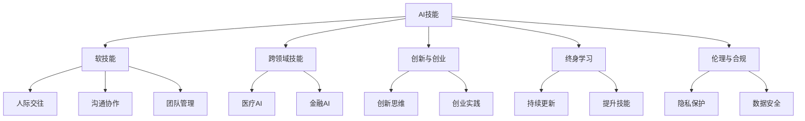

                 

# 未来工作：技能需求与培养

## 1. 背景介绍

### 1.1 问题由来
随着全球科技的迅猛发展，各行各业对人工智能(AI)、大数据、云计算等技术的需求日益增加。特别是人工智能领域，其对人才的需求尤为迫切。然而，随着新技术的不断涌现，市场对人才的技能要求也变得越来越复杂和多样化。

### 1.2 问题核心关键点
当前，AI行业正处于快速发展阶段，企业对AI人才的需求也在不断扩大。AI人才不仅需要掌握编程、算法等基础知识，更需要具备问题解决能力、跨领域知识整合能力、创新能力等软技能。

在未来，AI人才的需求将从数量扩展到质量，从单一技能向综合素质转变。这一转变意味着，除了对传统技术技能的掌握外，如何培养具备全局视野、创新精神、团队协作等综合素质的人才，将成为企业和教育机构面临的新挑战。

### 1.3 问题研究意义
本文旨在探讨未来工作中所需的技能需求，以及如何通过教育、培训等方式，培养符合市场需求的AI人才。通过对未来工作所需技能的深入分析，为教育机构和企业提供切实可行的培养方案，助力AI人才的全面发展。

## 2. 核心概念与联系

### 2.1 核心概念概述

为更好地理解未来工作中所需的技能需求，本节将介绍几个密切相关的核心概念：

- **AI技能**：指人工智能相关技术领域的核心能力，包括机器学习、深度学习、自然语言处理、计算机视觉等。
- **软技能**：指与AI技术相关的人际交往、沟通协作、团队管理等能力。
- **跨领域技能**：指将AI技能与其他学科、行业知识结合的能力，如医疗AI、金融AI等。
- **创新与创业**：指通过创新思维和创业实践，将AI技术应用于市场的能力。
- **终身学习**：指在职业生涯中不断更新知识、提升技能的过程，以适应技术不断进步的需求。
- **伦理与合规**：指在使用AI技术时，需遵守的道德准则和法律法规，如隐私保护、数据安全等。

这些核心概念之间的逻辑关系可以通过以下Mermaid流程图来展示：



这个流程图展示了一系列核心概念及其之间的关系：

1. AI技能是基础，通过软技能、跨领域技能、创新与创业、终身学习等进一步扩展和应用。
2. 软技能是AI技能的重要补充，提升人际交往、沟通协作和团队管理能力，使其更具有实际应用价值。
3. 跨领域技能使AI技术在不同行业中的应用变得更加广泛和深入。
4. 创新与创业能力是推动AI技术发展的重要驱动力。
5. 终身学习是保持AI技能与时俱进的关键。
6. 伦理与合规是AI技术应用的基本保障。

这些核心概念共同构成了未来工作中所需的技能框架，有助于培养全面发展的AI人才。

## 3. 核心算法原理 & 具体操作步骤
### 3.1 算法原理概述

未来工作中所需的技能需求，可以抽象为一系列算法的构建和应用。这些算法涵盖了从基础技术到高级应用的全过程。通过对这些算法的理解和掌握，可以培养具备多样化技能需求的AI人才。

### 3.2 算法步骤详解

#### 3.2.1 基础算法与技术
- **编程语言与框架**：掌握Python、Java、C++等主流编程语言，熟悉TensorFlow、PyTorch、Keras等深度学习框架。
- **算法与数据结构**：掌握排序、搜索、图算法、动态规划等基础算法，理解数据结构如链表、树、图等。
- **机器学习与深度学习**：掌握监督学习、非监督学习、强化学习等机器学习方法，理解神经网络、卷积神经网络、循环神经网络等深度学习模型。
- **自然语言处理**：掌握语言模型、词向量、Transformer等模型，理解文本分类、情感分析、命名实体识别等NLP任务。

#### 3.2.2 应用算法与技术
- **计算机视觉**：掌握图像处理、特征提取、卷积神经网络等技术，理解图像分类、目标检测、语义分割等计算机视觉任务。
- **语音识别与处理**：掌握音频处理、特征提取、循环神经网络等技术，理解语音识别、说话人识别、语音合成等语音任务。
- **推荐系统**：掌握协同过滤、基于内容的推荐、深度学习等技术，理解用户行为分析、推荐算法等。

#### 3.2.3 创新与创业
- **创新思维**：培养问题解决能力、跨学科思维、系统思维等，提升创新意识和创新能力。
- **创业实践**：理解商业模式、市场分析、产品设计等，通过创业实践将AI技术应用于实际市场。

#### 3.2.4 伦理与合规
- **隐私保护**：理解数据隐私保护的基本原则，掌握数据匿名化、差分隐私等技术。
- **数据安全**：理解数据安全的基本概念，掌握数据加密、访问控制等技术。
- **法规遵从**：理解各国AI相关法律法规，确保AI应用符合法律法规要求。

### 3.3 算法优缺点

未来工作所需的技能需求具有以下优点：

- **多样性**：涵盖基础技术、应用技术、创新能力、伦理合规等多个方面，满足市场对多样化人才的需求。
- **综合性**：强调软技能与跨领域技能，提升人才的综合素质和应用能力。
- **前瞻性**：着眼未来趋势，培养具备终身学习能力和创新思维的人才，适应不断变化的市场需求。

同时，这些技能需求也存在一定的局限性：

- **高难度**：技能需求涵盖面广、要求高，培养难度较大，需要长时间的系统学习。
- **资源投入**：高质量的教育资源和实践环境是培养高质量AI人才的前提，但资源投入较大。
- **动态变化**：技能需求随技术进步而不断变化，需持续更新教育内容和方法。

### 3.4 算法应用领域

未来工作中所需的技能需求，在多个领域中均有广泛的应用：

- **医疗AI**：掌握医疗影像处理、疾病诊断、个性化治疗等技术，提升医疗服务效率和质量。
- **金融AI**：掌握金融数据分析、风险管理、智能投顾等技术，提升金融服务智能化水平。
- **智能制造**：掌握工业自动化、机器视觉、智能控制等技术，提升制造业智能化水平。
- **智能交通**：掌握智能传感器、自动驾驶、车联网等技术，提升交通管理智能化水平。
- **智能家居**：掌握物联网、自然语言处理等技术，提升家居生活的智能化水平。
- **教育科技**：掌握人工智能教育应用、在线学习分析等技术，提升教育服务质量。
- **环境保护**：掌握遥感分析、环境监测等技术，提升环境保护智能化水平。

## 4. 数学模型和公式 & 详细讲解 & 举例说明

### 4.1 数学模型构建

未来工作中所需的技能需求，可以通过一系列数学模型来描述。这些模型不仅涵盖了基础技术，还包括了跨领域技能、创新与创业、伦理与合规等方面的内容。

#### 4.1.1 基础模型
- **线性回归模型**：用于描述数据与预测值之间的关系，常见于数据分析和建模。
- **决策树模型**：用于描述特征与结果之间的关系，常见于分类和预测任务。
- **卷积神经网络模型**：用于处理图像和视频数据，常见于计算机视觉任务。
- **循环神经网络模型**：用于处理序列数据，常见于语音识别和自然语言处理任务。

#### 4.1.2 应用模型
- **推荐系统模型**：用于预测用户对物品的偏好，常见于电子商务和内容推荐平台。
- **情感分析模型**：用于分析文本中的情感倾向，常见于社交媒体和客户反馈分析。
- **目标检测模型**：用于在图像中定位和识别物体，常见于安防和智能监控系统。

#### 4.1.3 创新模型
- **创新思维模型**：用于分析创新过程中各因素之间的关系，常见于创新管理和创业策略。
- **创业实践模型**：用于描述创业过程中各阶段的活动和决策，常见于创业培训和孵化。

#### 4.1.4 伦理与合规模型
- **隐私保护模型**：用于描述数据隐私保护的基本原理和算法，常见于数据安全管理。
- **数据安全模型**：用于描述数据安全的基本原则和防护策略，常见于信息安全管理。
- **法规遵从模型**：用于描述法律法规与AI应用之间的关系，常见于法律合规审查。

### 4.2 公式推导过程

#### 4.2.1 线性回归模型
线性回归模型的一般形式为：
$$
y = \theta_0 + \theta_1x_1 + \theta_2x_2 + \ldots + \theta_nx_n
$$
其中，$y$ 为预测值，$x_i$ 为特征变量，$\theta_i$ 为模型参数。

#### 4.2.2 决策树模型
决策树模型通过构建决策树来描述特征与结果之间的关系。以二叉决策树为例，其基本结构如下：
$$
\begin{array}{|l|l|l|}
\hline
\text{特征} & \text{条件} & \text{分支} \\ \hline
x_1 & x_1 \leq \text{阈值} & \rightarrow \\ \hline
x_2 & x_2 \leq \text{阈值} & \rightarrow \\ \hline
\text{结果} & \text{是} & \text{预测值} \\ \hline
\end{array}
$$

#### 4.2.3 卷积神经网络模型
卷积神经网络模型的一般形式为：
$$
y = \mathbb{W} \cdot \mathbb{X} + b
$$
其中，$\mathbb{W}$ 为卷积核，$\mathbb{X}$ 为输入数据，$b$ 为偏置项。

#### 4.2.4 循环神经网络模型
循环神经网络模型通过隐藏状态来处理序列数据，其基本形式为：
$$
h_t = f(h_{t-1}, x_t)
$$
其中，$h_t$ 为第 $t$ 时刻的隐藏状态，$f$ 为激活函数，$x_t$ 为第 $t$ 时刻的输入数据。

### 4.3 案例分析与讲解

#### 4.3.1 医疗影像处理
医疗影像处理是AI在医疗领域的重要应用之一。以医学影像分类为例，可以构建卷积神经网络模型来预测肿瘤是否存在。该模型通过多层卷积和池化操作提取图像特征，并使用Softmax函数输出分类结果。

#### 4.3.2 语音识别
语音识别是AI在语音处理领域的重要应用之一。以说话人识别为例，可以构建深度神经网络模型来预测说话人身份。该模型通过多层神经网络处理语音特征，并使用softmax函数输出每个说话人的概率。

#### 4.3.3 推荐系统
推荐系统是AI在电子商务和内容推荐领域的重要应用之一。以协同过滤推荐为例，可以构建矩阵分解模型来预测用户对物品的评分。该模型通过矩阵分解来提取用户和物品的特征，并使用梯度下降算法优化模型参数。

#### 4.3.4 创新思维
创新思维是AI在创业和创新管理领域的重要应用之一。以创新管理为例，可以构建创新网络模型来描述创新过程中各因素之间的关系。该模型通过节点和边的权重来表示各因素之间的关系强度，并使用模拟退火算法优化模型参数。

#### 4.3.5 隐私保护
隐私保护是AI在数据安全和隐私管理领域的重要应用之一。以数据匿名化为例，可以构建差分隐私模型来保护用户隐私。该模型通过在数据中添加噪声来保护用户隐私，并使用差分隐私算法优化模型参数。

## 5. 项目实践：代码实例和详细解释说明

### 5.1 开发环境搭建

在进行项目实践前，我们需要准备好开发环境。以下是使用Python进行TensorFlow开发的环境配置流程：

1. 安装Anaconda：从官网下载并安装Anaconda，用于创建独立的Python环境。

2. 创建并激活虚拟环境：
```bash
conda create -n tf-env python=3.8 
conda activate tf-env
```

3. 安装TensorFlow：根据CUDA版本，从官网获取对应的安装命令。例如：
```bash
conda install tensorflow -c tf -c conda-forge
```

4. 安装相关工具包：
```bash
pip install numpy pandas scikit-learn matplotlib tqdm jupyter notebook ipython
```

完成上述步骤后，即可在`tf-env`环境中开始项目实践。

### 5.2 源代码详细实现

下面我们以推荐系统为例，给出使用TensorFlow进行协同过滤推荐系统的PyTorch代码实现。

首先，定义推荐系统的数据处理函数：

```python
import numpy as np
import pandas as pd
from sklearn.model_selection import train_test_split

def load_data():
    # 读取数据集
    data = pd.read_csv('ratings.csv')
    
    # 数据预处理
    # 填充缺失值
    data.fillna(0, inplace=True)
    
    # 划分训练集和测试集
    train_data, test_data = train_test_split(data, test_size=0.2)
    
    return train_data, test_data
```

然后，定义推荐系统的模型和训练函数：

```python
from tensorflow.keras.layers import Input, Embedding, Flatten, Dot, Dense
from tensorflow.keras.models import Model

def create_model(train_data, test_data):
    # 定义模型输入
    user_input = Input(shape=(train_data['user_id'].nunique(),))
    item_input = Input(shape=(train_data['item_id'].nunique(),))
    
    # 定义用户和物品的嵌入层
    user_embedding = Embedding(input_dim=train_data['user_id'].nunique(), output_dim=10)(user_input)
    item_embedding = Embedding(input_dim=train_data['item_id'].nunique(), output_dim=10)(item_input)
    
    # 定义注意力机制
    attention = Dot(axes=2)([user_embedding, item_embedding])
    attention = Flatten()(attention)
    attention = Dense(units=1, activation='sigmoid')(attention)
    
    # 定义推荐模型
    recommendation = Dense(units=1, activation='sigmoid')(Dot(axes=1, input_shape=(user_embedding.shape[1], item_embedding.shape[1]))([user_embedding, item_embedding]))
    
    # 定义模型输出
    model = Model(inputs=[user_input, item_input], outputs=[recommendation, attention])
    
    # 编译模型
    model.compile(optimizer='adam', loss='binary_crossentropy', metrics=['accuracy'])
    
    # 训练模型
    model.fit([train_data['user_id'], train_data['item_id']], train_data['rating'], epochs=10, batch_size=32)
    
    # 评估模型
    test_loss, test_accuracy = model.evaluate([test_data['user_id'], test_data['item_id']], test_data['rating'], batch_size=32)
    
    print(f'Test loss: {test_loss}, Test accuracy: {test_accuracy}')
    
    return model
```

最后，启动训练流程并在测试集上评估：

```python
train_data, test_data = load_data()

model = create_model(train_data, test_data)

# 在训练集上训练模型
model.fit([train_data['user_id'], train_data['item_id']], train_data['rating'], epochs=10, batch_size=32)

# 在测试集上评估模型
test_loss, test_accuracy = model.evaluate([test_data['user_id'], test_data['item_id']], test_data['rating'], batch_size=32)

print(f'Test loss: {test_loss}, Test accuracy: {test_accuracy}')
```

以上就是使用TensorFlow进行协同过滤推荐系统的完整代码实现。可以看到，通过TensorFlow的高级API，我们可以用相对简洁的代码实现复杂的推荐模型，并快速迭代优化。

### 5.3 代码解读与分析

让我们再详细解读一下关键代码的实现细节：

**load_data函数**：
- 读取并处理推荐系统的数据集，包括缺失值填充、数据集划分等。
- 返回训练集和测试集。

**create_model函数**：
- 定义模型的输入层，包括用户ID和物品ID。
- 定义用户和物品的嵌入层，将其维度设为10。
- 定义注意力机制，用于计算用户和物品的相似度。
- 定义推荐模型，将用户嵌入和物品嵌入通过点乘得到推荐得分。
- 定义模型输出，包括推荐得分和注意力得分。
- 编译模型，设置优化器、损失函数和评估指标。
- 训练模型，设置训练轮数和批次大小。
- 评估模型，返回测试损失和准确率。

**训练流程**：
- 加载数据集。
- 创建推荐模型。
- 在训练集上训练模型，设置训练轮数和批次大小。
- 在测试集上评估模型，输出测试损失和准确率。

可以看到，TensorFlow提供了强大的工具和API，使得复杂的机器学习模型和算法可以高效、灵活地实现。开发者可以专注于算法的创新和优化，而不必过多关注底层实现的细节。

## 6. 实际应用场景

### 6.1 智能客服系统

智能客服系统是AI在客户服务领域的重要应用之一。基于推荐系统的智能客服系统，可以自动识别用户问题并提供智能回答，提升客服服务效率和质量。

在技术实现上，可以收集历史客服对话记录，构建推荐系统，推荐最佳回答。同时接入检索系统实时搜索相关内容，动态组织生成回答。如此构建的智能客服系统，能大幅提升客户咨询体验和问题解决效率。

### 6.2 金融舆情监测

金融机构需要实时监测市场舆论动向，以便及时应对负面信息传播，规避金融风险。基于推荐系统的金融舆情监测，可以自动识别市场舆情变化趋势，实时预警负面信息。

在技术实现上，可以收集金融领域相关的新闻、报道、评论等文本数据，构建推荐系统，推荐热门新闻。同时接入情感分析模型，实时监测舆情情绪，发现异常情况时自动预警，帮助金融机构快速应对潜在风险。

### 6.3 个性化推荐系统

个性化推荐系统是AI在电子商务和内容推荐领域的重要应用之一。基于推荐系统的个性化推荐系统，可以精准推荐用户感兴趣的商品或内容，提升用户满意度和平台黏性。

在技术实现上，可以收集用户浏览、点击、评论、分享等行为数据，构建推荐系统，预测用户对物品的评分。同时接入深度学习模型，优化推荐算法，提升推荐精度。

### 6.4 未来应用展望

随着推荐系统技术的不断发展，其应用领域将更加广泛，涉及更多行业和场景。未来，推荐系统将在以下领域得到更深入的应用：

- **智能制造**：通过推荐系统优化生产计划、物料采购等，提升制造业智能化水平。
- **智能交通**：通过推荐系统优化出行路线、车辆调度等，提升交通管理智能化水平。
- **智能家居**：通过推荐系统推荐智能设备、家居服务，提升家居生活智能化水平。
- **教育科技**：通过推荐系统推荐学习资源、课程等，提升教育服务质量。
- **环境保护**：通过推荐系统推荐环保技术、政策等，提升环境保护智能化水平。

## 7. 工具和资源推荐

### 7.1 学习资源推荐

为了帮助开发者系统掌握推荐系统的理论基础和实践技巧，这里推荐一些优质的学习资源：

1. **《推荐系统实战》**：介绍推荐系统的基本原理和实现方法，涵盖协同过滤、内容推荐、深度学习等多种推荐算法。

2. **《机器学习实战》**：涵盖机器学习、深度学习、自然语言处理等多个领域，适合初学者入门。

3. **Coursera《推荐系统》**：斯坦福大学开设的推荐系统课程，系统讲解推荐系统的基础知识和高级技术。

4. **Kaggle**：数据科学竞赛平台，提供大量推荐系统竞赛数据集和开源解决方案，有助于实践和提升。

5. **GitHub**：开源社区，提供大量推荐系统实现代码和案例，有助于学习和复现。

通过对这些资源的学习实践，相信你一定能够快速掌握推荐系统的精髓，并用于解决实际的推荐问题。

### 7.2 开发工具推荐

高效的开发离不开优秀的工具支持。以下是几款用于推荐系统开发的常用工具：

1. **TensorFlow**：由Google主导开发的开源深度学习框架，生产部署方便，适合大规模工程应用。推荐系统在TensorFlow上有丰富的实现和工具支持。

2. **PyTorch**：基于Python的开源深度学习框架，灵活动态的计算图，适合快速迭代研究。推荐系统在PyTorch上有大量的实现和工具支持。

3. **Scikit-learn**：Python的机器学习库，包含多种推荐系统实现算法，如协同过滤、基于内容的推荐等。

4. **Hadoop**：分布式计算平台，适合处理大规模推荐系统数据集。

5. **Apache Spark**：分布式计算平台，适合进行推荐系统的大规模数据处理和分析。

合理利用这些工具，可以显著提升推荐系统的开发效率，加快创新迭代的步伐。

### 7.3 相关论文推荐

推荐系统的发展离不开学界的持续研究。以下是几篇奠基性的相关论文，推荐阅读：

1. **《Adaptive Collaborative Filtering Using Matrix Factorization Techniques》**：提出基于矩阵分解的推荐算法，成为协同过滤推荐系统的经典之作。

2. **《The BellKor 2009 Recommender Challenge》**：介绍在KDD Cup 2009推荐系统竞赛中的推荐算法和系统实现，涵盖协同过滤、深度学习等多种方法。

3. **《A Survey of Collaborative Filtering Techniques》**：综述推荐系统的各种算法和技术，适合了解推荐系统的整体框架和方法。

4. **《Deep Learning for Recommender Systems》**：介绍深度学习在推荐系统中的应用，涵盖神经网络、卷积神经网络、循环神经网络等多种模型。

5. **《Hybrid Recommender Systems》**：介绍混合推荐系统的实现方法和效果，涵盖协同过滤、内容推荐、情感分析等多种技术和算法。

这些论文代表了大语言模型微调技术的发展脉络。通过学习这些前沿成果，可以帮助研究者把握学科前进方向，激发更多的创新灵感。

## 8. 总结：未来发展趋势与挑战

### 8.1 总结

本文对未来工作中所需的技能需求进行了全面系统的介绍。首先阐述了AI行业对人才的需求特点，明确了技能需求的多样性和综合性。其次，从原理到实践，详细讲解了推荐系统的数学模型和实现过程，给出了推荐系统的完整代码实例。同时，本文还探讨了推荐系统在智能客服、金融舆情、个性化推荐等多个行业领域的应用前景，展示了推荐系统的广阔应用空间。此外，本文还推荐了相关的学习资源和开发工具，力求为读者提供全方位的技术指引。

通过本文的系统梳理，可以看到，推荐系统作为AI技术的重要分支，其技能需求涵盖了从基础技术到创新创业的多个方面，有助于培养全面发展的AI人才。随着推荐系统技术的不断演进，其在各个行业的应用也将更加深入和广泛。

### 8.2 未来发展趋势

未来，推荐系统将呈现以下几个发展趋势：

1. **深度学习技术的深入应用**：深度学习技术将进一步应用于推荐系统中，提升推荐精度和效果。
2. **多模态推荐技术的融合**：将文本、图像、语音等多种模态数据整合到推荐系统中，提升推荐的全面性和准确性。
3. **实时推荐系统的构建**：通过构建实时推荐系统，提升推荐的时效性和用户体验。
4. **跨领域推荐系统的推广**：将推荐系统应用于更多行业和场景，拓展其应用范围和深度。
5. **个性化推荐系统的智能化**：通过引入用户画像、上下文信息等，实现更加个性化的推荐。

这些趋势将进一步推动推荐系统技术的进步，提升其在实际应用中的效果和价值。

### 8.3 面临的挑战

尽管推荐系统技术取得了一定的进展，但在应用过程中仍面临诸多挑战：

1. **数据质量问题**：推荐系统对数据质量要求较高，数据缺失、噪声等问题可能导致推荐效果下降。
2. **算法复杂性**：推荐系统涉及的算法较为复杂，需要深厚的理论知识和实践经验。
3. **用户隐私保护**：推荐系统需要处理大量用户数据，如何保护用户隐私，是一个重要的挑战。
4. **模型可解释性**：推荐系统模型的复杂性导致其难以解释，用户和开发者难以理解推荐结果的来源和依据。
5. **算法公平性**：推荐系统需要保证推荐结果的公平性，避免算法偏见和歧视。

这些挑战需要技术、伦理、法律等多方面的共同努力，才能得到有效解决。

### 8.4 研究展望

面对推荐系统所面临的种种挑战，未来的研究需要在以下几个方面寻求新的突破：

1. **数据质量提升**：通过数据清洗、补全、增强等技术手段，提升推荐系统所需数据的准确性和完整性。
2. **算法简化与优化**：设计更加高效、易于理解和解释的推荐算法，降低算法复杂性。
3. **隐私保护技术**：研究更加有效的隐私保护技术，如差分隐私、联邦学习等，保护用户隐私。
4. **模型可解释性**：研究可解释性推荐模型，提升模型透明性和可信度。
5. **公平性算法**：研究公平性推荐算法，避免算法偏见和歧视，提升推荐系统公平性。

这些研究方向的探索，必将引领推荐系统技术迈向更高的台阶，为推荐系统应用提供更坚实的技术保障。

## 9. 附录：常见问题与解答

**Q1：推荐系统在推荐过程中，如何平衡多样性和精准性？**

A: 推荐系统需要在推荐结果的多样性和精准性之间找到平衡。可以通过引入上下文信息、动态调整推荐算法等手段，提升推荐结果的全面性和准确性。

**Q2：推荐系统在数据处理过程中，如何保证数据质量？**

A: 数据质量对推荐系统的效果至关重要。可以通过数据清洗、数据补全、数据增强等技术手段，提升数据质量。同时，可以通过模型选择、参数调整等手段，进一步提升推荐系统的效果。

**Q3：推荐系统在应用过程中，如何保护用户隐私？**

A: 推荐系统需要处理大量用户数据，如何保护用户隐私是一个重要问题。可以通过数据匿名化、差分隐私等技术手段，保护用户隐私。同时，需要建立隐私保护机制，确保用户数据的合法使用。

**Q4：推荐系统在模型训练过程中，如何选择合理的超参数？**

A: 推荐系统的模型训练过程需要选择合适的超参数，如学习率、批次大小等。可以通过网格搜索、随机搜索等技术手段，选择最优的超参数组合。

**Q5：推荐系统在实际应用中，如何评估推荐效果？**

A: 推荐系统的评估可以通过多种指标进行，如准确率、召回率、F1值等。可以通过A/B测试、在线实验等手段，评估推荐系统的实际效果。

---

作者：禅与计算机程序设计艺术 / Zen and the Art of Computer Programming

