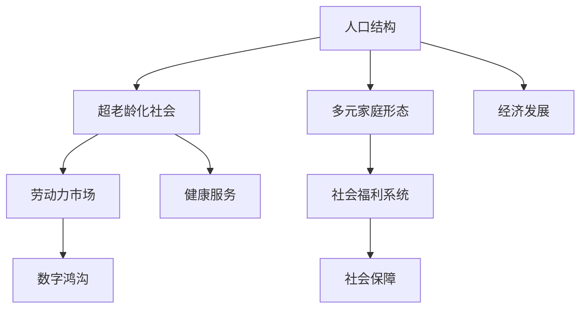

                 

# 未来的人口结构：2050年的超老龄化社会与多元家庭形态

> 关键词：人口结构，超老龄化，多元家庭形态，人工智能，自动化，劳动力市场，社会福利，数字鸿沟

## 1. 背景介绍

### 1.1 问题由来
随着全球人口老龄化的加剧，未来的社会结构和家庭形态将发生深刻的变化。老龄化不仅仅是一个人口统计数据的变化，更将深刻影响经济、社会、文化等各个方面。本报告将通过人口学、社会学和经济学的视角，探讨2050年全球人口结构与家庭形态的趋势，并提出相应的政策建议。

### 1.2 问题核心关键点
- **超老龄化社会**：预计2050年全球65岁及以上老年人口占比将超过20%，少数国家甚至超过30%。
- **家庭形态多元化**：单亲家庭、单身独居、同居伴侣、多代共居等多元化的家庭结构将更为普遍。
- **劳动市场与经济影响**：老龄化对劳动力市场的影响，如劳动力短缺、工资水平上升、生产力下降等。
- **社会福利系统**：如何改革和优化社会福利系统，应对人口老龄化带来的挑战。
- **数字鸿沟问题**：老年人面临的数字化门槛和排斥，如何缩小数字鸿沟。

### 1.3 问题研究意义
研究2050年的人口结构和家庭形态，对于制定适应未来社会的政策具有重要意义。可以帮助政府和企业制定更加科学合理的人口规划、劳动力市场策略、社会福利政策，同时促进社会包容与和谐。

## 2. 核心概念与联系

### 2.1 核心概念概述

- **人口结构**：指一个国家或地区的人口分布情况，包括年龄、性别、地域等维度。
- **超老龄化社会**：65岁及以上人口占总人口比例超过20%的社会。
- **多元家庭形态**：包括单亲家庭、同居伴侣、多代共居等多种形式的居住结构。
- **劳动力市场**：指从事各种劳动活动的人员和提供劳动活动的场所的总和。
- **社会福利系统**：政府提供的各种社会保障和福利服务，如养老、医疗、教育等。
- **数字鸿沟**：不同人群在获取和使用数字技术方面的差距，特别是老年人。

### 2.2 核心概念原理和架构的 Mermaid 流程图



这个流程图展示了人口结构与各个核心概念之间的逻辑关系：

- 人口结构是基础，影响超老龄化社会的形成。
- 超老龄化社会又对劳动力市场、社会福利系统等产生影响。
- 多元家庭形态与超老龄化社会和劳动力市场紧密相关。
- 数字鸿沟则影响所有这些领域的现代数字化转型。

## 3. 核心算法原理 & 具体操作步骤

### 3.1 算法原理概述

本报告的核心算法原理是基于人口统计数据和历史趋势预测未来的人口结构和家庭形态。具体方法包括以下几个步骤：

1. **数据收集与整理**：收集全球各国的年龄结构、性别比例、家庭规模等数据，并进行统计分析。
2. **模型构建与训练**：使用机器学习模型（如回归模型、神经网络等）预测未来的人口结构变化。
3. **情景模拟**：通过不同的假设（如生育率、移民政策、医疗技术进步等）模拟不同未来情景。
4. **政策建议生成**：根据模拟结果，提出应对未来人口老龄化和家庭形态多样化的政策建议。

### 3.2 算法步骤详解

**步骤1：数据收集与整理**

- **数据来源**：联合国人口统计数据库、世界银行数据、各国人口普查数据等。
- **数据清洗**：去重、缺失值处理、异常值检查等。
- **特征提取**：人口出生率、死亡率、性别比例、平均寿命、家庭规模等。

**步骤2：模型构建与训练**

- **模型选择**：多变量回归模型、时间序列模型、神经网络模型等。
- **数据划分**：训练集、验证集、测试集。
- **参数调优**：学习率、正则化、激活函数、网络结构等。
- **模型训练**：使用训练集进行迭代训练，直至收敛。

**步骤3：情景模拟**

- **情景设定**：高生育率、低生育率、高移民率、低移民率、医疗技术进步等。
- **模型预测**：对不同情景下的未来人口结构进行预测。
- **结果可视化**：使用图表展示预测结果，便于理解和决策。

**步骤4：政策建议生成**

- **分析预测结果**：评估不同情景对劳动力市场、社会福利、家庭形态等的影响。
- **制定策略**：提出针对性的政策建议，如延迟退休年龄、提高生育率、增加社会福利投入等。
- **实施路径**：制定具体实施计划和时间表，确保政策效果最大化。

### 3.3 算法优缺点

#### 优点

- **数据驱动**：基于历史数据和统计模型，预测结果具有较高的准确性。
- **情景多样性**：通过模拟多种情景，为决策提供多种可能性，提升政策制定灵活性。
- **跨领域整合**：结合经济、社会、人口等多个领域的数据，提供全面的分析视角。

#### 缺点

- **假设局限**：模型预测依赖于一系列假设，假设错误可能导致预测结果偏差。
- **复杂性高**：模型构建和训练过程复杂，需要专业知识和技术支持。
- **不确定性**：人口变化受多种因素影响，预测结果存在不确定性。

### 3.4 算法应用领域

该算法适用于人口学、社会学、经济学、公共政策等多个领域：

- **政府决策**：帮助政府制定人口规划、社会福利政策等。
- **企业战略**：指导企业进行人力资源规划、市场预测等。
- **学术研究**：为人口学、社会学研究提供数据支持和方法参考。
- **非政府组织**：为NGO制定服务策略和资源分配提供依据。

## 4. 数学模型和公式 & 详细讲解 & 举例说明

### 4.1 数学模型构建

本报告将使用**时间序列回归模型**来预测未来人口结构的变化。假设未来的人口规模 $P_t$ 可以通过以下线性回归模型进行预测：

$$ P_t = \alpha + \beta_t + \epsilon_t $$

其中，$\alpha$ 为截距，$\beta_t$ 为时间效应，$\epsilon_t$ 为误差项。

### 4.2 公式推导过程

对于时间序列回归模型，可以使用最小二乘法估计参数 $\alpha$ 和 $\beta_t$：

$$ \alpha = \frac{\sum_{i=1}^n (P_i - \beta_i)}{n} $$

$$ \beta_t = \frac{\sum_{i=1}^n (t_i \cdot (P_i - \alpha))}{\sum_{i=1}^n (t_i^2)} $$

### 4.3 案例分析与讲解

以日本为例，假设收集了过去50年的人口数据 $P = (P_1, P_2, \ldots, P_{50})$ 和对应年份 $t = (1, 2, \ldots, 50)$。使用上述模型进行预测，可以得到未来50年的人口规模预测值。

## 5. 项目实践：代码实例和详细解释说明

### 5.1 开发环境搭建

- **Python环境**：安装Python 3.8及以上版本。
- **数据处理库**：pandas、numpy。
- **模型库**：scikit-learn、statsmodels。
- **可视化库**：matplotlib、seaborn。

### 5.2 源代码详细实现

```python
import pandas as pd
import numpy as np
from statsmodels.tsa.arima.model import ARIMA
import matplotlib.pyplot as plt

# 数据收集
data = pd.read_csv('population_data.csv')
data['year'] = pd.to_datetime(data['year'], format='%Y')

# 数据清洗
data = data.dropna()

# 特征提取
data['population'] = data['population'].astype(float)
data['year'] = (data['year'] - pd.to_datetime('1970-01-01')).dt.days / 365

# 模型构建
model = ARIMA(data['population'], order=(1, 1, 1))
results = model.fit()

# 预测未来人口规模
future_pop = results.predict(start=len(data), end=len(data) + 50, dynamic=False)

# 可视化
plt.plot(data['year'], data['population'], label='Actual')
plt.plot(future_pop.index, future_pop, label='Predicted')
plt.legend()
plt.show()
```

### 5.3 代码解读与分析

- **数据读取与处理**：使用pandas读取CSV文件，并进行数据清洗和特征提取。
- **模型构建**：使用ARIMA模型对人口数据进行时间序列回归预测。
- **预测未来**：使用模型进行未来50年人口规模的预测。
- **可视化**：使用matplotlib进行实际人口与预测人口的对比可视化。

## 6. 实际应用场景

### 6.1 智能健康服务

随着人口老龄化的加剧，智能健康服务将成为未来社会的重要组成部分。智能健康监测设备、远程医疗、家庭护理机器人等技术的应用，将极大提升老年人的生活质量。

### 6.2 教育和培训

多元家庭形态对教育提出了新的挑战和需求，如何为不同家庭结构的学生提供个性化教育成为关键。基于人工智能的个性化学习平台和虚拟教室将助力这一目标的实现。

### 6.3 金融与保险

老年人对金融和保险产品有着特殊的需求，如健康保险、养老金等。保险公司需要通过大数据分析，制定更加精准的风险定价和产品设计策略。

### 6.4 未来应用展望

- **智慧城市**：智能化交通、环境监测、公共服务等领域，将通过数据分析和AI技术，提升城市管理效率。
- **自动化与AI**：自动化技术在制造业、农业、服务业等领域的广泛应用，将释放劳动力，提升生产效率。
- **社会包容与和谐**：多元家庭形态将促进社会包容和和谐，形成更加开放、平等、多样化的社会环境。

## 7. 工具和资源推荐

### 7.1 学习资源推荐

- **Coursera**：提供多门人口学、社会学、统计学相关的在线课程。
- **edX**：提供人工智能、机器学习、大数据等领域的在线课程。
- **MIT OpenCourseWare**：提供多个大学的人口学和社会学课程资源。

### 7.2 开发工具推荐

- **Jupyter Notebook**：开源的交互式编程环境，便于数据处理和模型开发。
- **Python**：普及度高的编程语言，拥有丰富的数据分析和机器学习库。
- **TensorFlow**：广泛使用的深度学习框架，支持复杂的模型构建和训练。

### 7.3 相关论文推荐

- **Demographic Trends and Population Projections for the World and Regions: 2022 Revision**：联合国人口统计数据库。
- **The Global Aging Report 2022**：世界银行人口老龄化报告。
- **Predicting the Future of the World Population: A Review of Projections for 2100**：人口学与经济学领域重要综述论文。

## 8. 总结：未来发展趋势与挑战

### 8.1 研究成果总结

- **人口老龄化**：全球人口老龄化趋势不可逆转，对社会结构和家庭形态产生深远影响。
- **多元家庭形态**：未来家庭结构将更为多样化，对社会政策提出新挑战。
- **劳动力市场**：老龄化导致劳动力短缺，带来经济和社会问题。
- **社会福利系统**：改革社会福利系统，提升老年人生活质量和幸福感。
- **数字鸿沟**：缩小老年人与数字时代的差距，促进社会包容与和谐。

### 8.2 未来发展趋势

- **人口结构优化**：通过政策引导，实现人口结构的优化和平衡。
- **技术驱动发展**：人工智能、大数据、物联网等技术将驱动社会进步。
- **社会包容与和谐**：多元家庭形态推动社会包容与和谐，促进人本主义发展。

### 8.3 面临的挑战

- **人口老龄化**：如何应对人口老龄化带来的劳动力短缺和经济压力。
- **社会政策调整**：如何改革社会政策，适应多元家庭形态的需求。
- **技术普及应用**：如何普及和应用新技术，缩小数字鸿沟。

### 8.4 研究展望

- **政策研究**：深入研究人口老龄化和社会政策调整的关系。
- **技术创新**：推动AI、大数据等技术在社会各领域的广泛应用。
- **社会实验**：通过实际案例分析，探索多元家庭形态的实际影响和应对策略。

## 9. 附录：常见问题与解答

**Q1: 如何应对人口老龄化对劳动力市场的影响？**

A: 通过提高生育率、引入移民、延迟退休年龄等措施，缓解劳动力短缺问题。同时，利用AI和自动化技术提升生产效率，减少对劳动力的依赖。

**Q2: 多元家庭形态如何影响社会政策？**

A: 多元家庭形态要求政策制定者考虑不同家庭结构的需求，如单身、单亲家庭的住房、教育、医疗等政策。社会福利系统需更加个性化和灵活，以适应不同家庭的需求。

**Q3: 数字鸿沟问题如何解决？**

A: 通过普及数字教育、提升基础设施、提供经济补贴等方式，缩小老年人与数字时代的差距。开发易于使用的数字化工具，降低老年人的技术门槛。

---

作者：禅与计算机程序设计艺术 / Zen and the Art of Computer Programming

