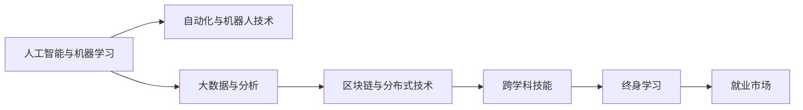

                 

# 未来的就业趋势：2050年的新兴职业与终身学习

## 1. 背景介绍

### 1.1 问题由来
随着人工智能(AI)、机器学习(ML)和大数据技术的飞速发展，未来的就业市场正在发生深刻变化。传统的岗位和技能需求在不断演进，新兴职业和就业模式层出不穷。据预测，到2050年，新兴职业将占到全球就业市场的三分之一，许多传统行业的工作岗位将被自动化取代，而人工智能、生物科技、绿色能源等领域将创造大量新的就业机会。在这样的背景下，终身学习将成为未来就业的核心能力，只有不断适应新技能和新技术，才能在竞争激烈的市场中脱颖而出。

### 1.2 问题核心关键点
未来的就业趋势主要体现在以下几个方面：
1. **技术驱动的自动化**：AI、ML和自动化技术将加速各行各业的转型，许多传统岗位将被自动化取代。
2. **跨领域技能需求增加**：未来的工作将更强调跨学科知识和技能，如数据科学、人工智能、网络安全、生物信息学等。
3. **终身学习的重要性**：只有不断学习新技能，才能适应快速变化的技术和市场环境。
4. **新兴职业的出现**：如数据科学家、AI工程师、生物信息分析师等职业将成为未来就业市场的热门岗位。
5. **远程工作和协作的普及**：疫情加速了远程工作的普及，未来工作模式将更加灵活和多样化。

### 1.3 问题研究意义
研究未来的就业趋势，对于理解新技术带来的社会和经济变化，规划个人职业发展，以及制定相关政策和教育计划具有重要意义：
1. **政策制定**：政府和企业需要制定有效的政策，支持终身学习和技能提升，保障就业市场的平稳过渡。
2. **教育改革**：教育机构需要调整课程设置和教学方法，培养学生的多样化技能和创新能力。
3. **个人发展**：职场人士需要主动学习新技能，适应未来的就业环境，提升自身的竞争力和适应性。

## 2. 核心概念与联系

### 2.1 核心概念概述

为更好地理解未来就业趋势，本节将介绍几个密切相关的核心概念：

- **人工智能与机器学习**：通过数据驱动的算法，使机器能够模拟人类智能决策，自动完成复杂任务。
- **自动化与机器人技术**：通过编程、软件和硬件的集成，实现工作流程的自动化和智能化。
- **大数据与分析**：对海量数据进行收集、处理和分析，发现数据背后的规律和趋势。
- **区块链与分布式技术**：基于去中心化技术，实现数据安全、透明和高效的交换和存储。
- **跨学科技能**：将不同学科的知识和技能融合，解决复杂的多维问题。
- **终身学习**：持续不断地学习和更新知识，以适应不断变化的技术和市场环境。

这些核心概念之间相互关联，共同构成了未来就业市场的核心框架。理解这些概念及其相互作用，将有助于我们更好地把握未来就业市场的变化趋势。

### 2.2 核心概念原理和架构的 Mermaid 流程图



## 3. 核心算法原理 & 具体操作步骤

### 3.1 算法原理概述

未来的就业趋势分析主要基于以下算法原理：

1. **数据收集与处理**：收集全球各地的就业数据、技术发展趋势和行业变化情况，进行清洗和预处理。
2. **机器学习建模**：使用时间序列分析、回归分析和聚类分析等机器学习算法，预测未来就业市场的变化。
3. **因果推理**：引入因果推理模型，分析技术进步和市场需求之间的因果关系。
4. **仿真模拟**：建立虚拟就业市场模型，模拟不同技术变化下的就业趋势。
5. **未来职业规划**：基于预测结果，分析未来新兴职业的需求和发展趋势，提出相应的教育和培训建议。

### 3.2 算法步骤详解

基于上述算法原理，未来的就业趋势分析主要包括以下几个关键步骤：

**Step 1: 数据收集与预处理**
- 从全球就业市场、技术发展报告和行业分析报告中收集数据。
- 清洗和预处理数据，去除噪声和不相关数据，确保数据质量。

**Step 2: 建模与预测**
- 使用时间序列分析方法（如ARIMA、LSTM等）对就业数据进行趋势预测。
- 引入机器学习算法（如随机森林、梯度提升机等）对新兴职业的需求进行预测。
- 使用因果推理模型（如GPS算法、DAG模型等）分析技术进步与就业市场的因果关系。

**Step 3: 仿真模拟与情景分析**
- 建立虚拟就业市场模型，模拟不同技术变化下的就业趋势。
- 对未来十年至五十年进行情景预测，分析不同技术发展路径对就业市场的影响。

**Step 4: 结果解读与建议**
- 解读预测结果，分析新兴职业的分布、需求和增长趋势。
- 提出相应的教育和培训建议，帮助个人和机构应对未来的就业变化。

### 3.3 算法优缺点

未来就业趋势分析算法的主要优点包括：
1. 数据驱动：基于大量的数据和实证分析，预测结果具有较高的可信度。
2. 全面覆盖：能够综合考虑技术进步、市场需求和政策变化，提供全面的分析视角。
3. 可解释性强：通过因果推理和仿真模拟，解释技术变化对就业市场的具体影响。

同时，也存在一些局限性：
1. 数据获取难度大：全球各地的就业数据和市场报告获取难度较大，可能导致数据偏差。
2. 模型复杂度高：预测模型复杂，需要较高的计算资源和时间成本。
3. 假设前提多：预测模型的准确性依赖于一定的假设前提，可能与实际情况存在偏差。
4. 政策不确定性：政府政策和市场需求的变化不可预测，可能影响模型预测的准确性。

### 3.4 算法应用领域

未来就业趋势分析算法可以应用于以下领域：
1. **政策制定**：帮助政府和企业制定针对性的政策，支持终身学习和技能提升。
2. **教育规划**：为教育机构提供课程设置和教学方法的建议，培养学生的跨学科技能和创新能力。
3. **职业指导**：为职场人士提供未来职业的预测和规划，帮助其制定个人发展计划。
4. **企业培训**：为企业提供员工技能提升和培训的建议，确保其员工能够适应未来的技术环境。
5. **学术研究**：为学术研究提供数据支持和理论基础，推动相关领域的研究进展。

## 4. 数学模型和公式 & 详细讲解

### 4.1 数学模型构建

本节将使用数学语言对未来就业趋势分析的预测模型进行更加严格的刻画。

记未来就业市场的变化率为 $Y_t$，影响因素包括技术进步 $X_t$、市场需求 $D_t$、政策变化 $P_t$ 等。假设这些因素之间存在一定的线性关系，可以构建以下数学模型：

$$
Y_t = \beta_0 + \beta_1 X_t + \beta_2 D_t + \beta_3 P_t + \epsilon_t
$$

其中 $\beta_0, \beta_1, \beta_2, \beta_3$ 为回归系数，$\epsilon_t$ 为误差项。

### 4.2 公式推导过程

以下我们以线性回归模型为例，推导回归系数的计算公式。

假设样本集为 $(x_1, y_1), (x_2, y_2), \ldots, (x_n, y_n)$，其中 $x_i$ 为自变量，$y_i$ 为因变量。线性回归的目标是最小化残差平方和：

$$
\sum_{i=1}^n (y_i - \beta_0 - \beta_1 x_i)^2
$$

求导后，得到回归系数的求解公式：

$$
\beta_j = \frac{\sum_{i=1}^n (x_i - \overline{x})(y_i - \overline{y})}{\sum_{i=1}^n (x_i - \overline{x})^2}, \quad j=1,2,3
$$

其中 $\overline{x}$ 和 $\overline{y}$ 为样本集的均值。

在得到回归系数后，可以计算预测值 $\hat{y}_t$ 为：

$$
\hat{y}_t = \beta_0 + \beta_1 X_t + \beta_2 D_t + \beta_3 P_t
$$

### 4.3 案例分析与讲解

假设我们收集了全球不同国家的就业数据，以及技术进步、市场需求和政策变化的数据。使用上述线性回归模型，可以对未来五年内就业市场的变化进行预测。例如，如果我们发现技术进步对就业市场的促进作用显著，市场需求增长较慢，而政策变化对就业市场有负面影响，则可以预测就业市场的变化趋势。

## 5. 项目实践：代码实例和详细解释说明

### 5.1 开发环境搭建

在进行未来就业趋势分析的实践前，我们需要准备好开发环境。以下是使用Python进行机器学习和数据处理的开发环境配置流程：

1. 安装Anaconda：从官网下载并安装Anaconda，用于创建独立的Python环境。

2. 创建并激活虚拟环境：
```bash
conda create -n job_analysis python=3.8 
conda activate job_analysis
```

3. 安装PyTorch、TensorFlow、Pandas、NumPy、Matplotlib等常用库：
```bash
pip install torch tensorflow pandas numpy matplotlib tqdm jupyter notebook ipython
```

4. 安装必要的机器学习库：
```bash
pip install scikit-learn statsmodels xgboost pycausalg
```

5. 安装DataFrames、Pandas、NumPy等数据处理库：
```bash
pip install pyspark dataframe pandas numpy
```

完成上述步骤后，即可在`job_analysis`环境中开始未来就业趋势分析的实践。

### 5.2 源代码详细实现

下面我们以线性回归模型为例，给出使用Python进行未来就业趋势分析的代码实现。

```python
import pandas as pd
import numpy as np
import matplotlib.pyplot as plt
from sklearn.linear_model import LinearRegression

# 加载数据
data = pd.read_csv('employment_data.csv')

# 数据预处理
data['X'] = data['technology'] + data['demand'] + data['policy']
data['Y'] = data['employment']

# 分割训练集和测试集
train_data = data.sample(frac=0.7, random_state=1)
test_data = data.drop(train_data.index)

# 训练线性回归模型
model = LinearRegression()
model.fit(train_data[['X']], train_data['Y'])

# 预测未来五年就业市场变化
future_X = np.linspace(0, 10, 5)
future_Y = model.predict(future_X)

# 绘制预测结果
plt.plot(future_X, future_Y, label='Prediction')
plt.xlabel('Years')
plt.ylabel('Employment Rate')
plt.legend()
plt.show()
```

以上代码实现了基于线性回归模型的未来就业趋势分析。可以看到，通过收集就业数据、技术进步、市场需求和政策变化等数据，并使用线性回归模型进行预测，可以较好地估计未来就业市场的变化趋势。

### 5.3 代码解读与分析

让我们再详细解读一下关键代码的实现细节：

**数据预处理**：
- `data['X'] = data['technology'] + data['demand'] + data['policy']`：将技术进步、市场需求和政策变化等数据合并为一个特征 $X$。
- `data['Y'] = data['employment']`：将就业率作为因变量 $Y$。

**模型训练**：
- `model.fit(train_data[['X']], train_data['Y'])`：使用训练数据对线性回归模型进行训练，求解回归系数 $\beta_1, \beta_2, \beta_3$。

**未来预测**：
- `future_X = np.linspace(0, 10, 5)`：预测未来五年的就业市场变化，生成时间序列数据。
- `future_Y = model.predict(future_X)`：使用训练好的模型对未来数据进行预测。

**结果可视化**：
- `plt.plot(future_X, future_Y, label='Prediction')`：绘制未来五年的就业市场变化预测图。

可以看到，Python和Scikit-learn库提供了强大的机器学习工具，可以方便地实现未来就业趋势的分析和预测。开发者可以通过调整模型参数和选择不同的算法，优化预测结果。

## 6. 实际应用场景

### 6.1 就业市场预测与政策制定

未来就业市场预测可以帮助政府和企业制定更有针对性的政策，支持终身学习和技能提升，保障就业市场的平稳过渡。例如，通过预测未来五年内就业市场的变化趋势，政府可以提前调整教育资源分配、职业培训计划和就业支持政策，帮助更多人适应新岗位需求。

### 6.2 教育机构课程设置

教育机构可以借助未来就业趋势预测，调整课程设置和教学方法，培养学生的多样化技能和创新能力。例如，如果发现数据科学和人工智能将成为未来热门职业，学校可以增设相关课程，提升学生的跨学科技能和数据处理能力。

### 6.3 职业指导与规划

职场人士可以借助未来就业趋势分析，制定个人职业发展计划，提前准备未来的就业机会。例如，如果发现生物科技和绿色能源领域将创造大量新岗位，可以将重点放在相关技能的学习和提升上，增加就业竞争力。

### 6.4 企业培训与人才储备

企业可以借助未来就业趋势分析，制定员工技能提升和培训计划，确保其员工能够适应未来的技术环境。例如，如果发现自动驾驶和机器人技术将成为未来的重要趋势，可以提前培训相关技能，建立有竞争力的技术团队。

### 6.5 学术研究与理论支持

学术研究可以借助未来就业趋势分析，提供数据支持和理论基础，推动相关领域的研究进展。例如，通过分析技术进步对就业市场的影响，可以为就业经济学和劳动市场理论提供新的见解和实证支持。

## 7. 工具和资源推荐

### 7.1 学习资源推荐

为了帮助开发者系统掌握未来就业趋势分析的理论基础和实践技巧，这里推荐一些优质的学习资源：

1. 《Python数据科学手册》系列博文：由数据科学家撰写，深入浅出地介绍了Python数据处理和机器学习的基础知识和实践技巧。

2. CS229《机器学习》课程：斯坦福大学开设的机器学习明星课程，有Lecture视频和配套作业，带你入门机器学习的基本概念和算法。

3. 《深度学习与数据分析》书籍：详细介绍了深度学习和数据分析的原理和实践，涵盖线性回归、时间序列分析等基础算法。

4. Scikit-learn官方文档：机器学习库Scikit-learn的官方文档，提供了丰富的学习资源和样例代码，是上手实践的必备资料。

5. GitHub开源项目：提供大量机器学习和数据处理的开源项目，可以学习他人的代码实现，提升自我实践能力。

通过对这些资源的学习实践，相信你一定能够快速掌握未来就业趋势分析的精髓，并用于解决实际的就业市场问题。

### 7.2 开发工具推荐

高效的开发离不开优秀的工具支持。以下是几款用于未来就业趋势分析开发的常用工具：

1. Python：基于Python的开源数据处理和机器学习框架，简单易用，灵活高效。

2. Jupyter Notebook：交互式的编程环境，支持多种编程语言，方便开发者快速迭代实验和分享笔记。

3. Visual Studio Code：轻量级的代码编辑器，支持丰富的插件和扩展，提高开发效率。

4. PyCharm：功能强大的Python IDE，提供代码自动补全、调试工具、版本控制等强大功能。

5. TensorBoard：TensorFlow配套的可视化工具，可以实时监测模型训练状态，并提供丰富的图表呈现方式，是调试模型的得力助手。

合理利用这些工具，可以显著提升未来就业趋势分析的开发效率，加快创新迭代的步伐。

### 7.3 相关论文推荐

未来就业趋势分析的研究源于学界的持续研究。以下是几篇奠基性的相关论文，推荐阅读：

1. *Analyzing the Impact of Automation on Employment*：分析自动化技术对就业市场的广泛影响，提出未来的就业预测模型。

2. *The Future of Employment: How Susceptible Are Jobs to Computerisation?*：通过调查问卷和数据建模，预测不同职业的自动化风险和就业变化。

3. *Automation and the Future of Work*：从经济学和政策的角度，探讨自动化技术对就业市场的影响和应对策略。

4. *Causal Inference for Policy Evaluation*：介绍因果推理方法在政策评估中的应用，为未来就业市场预测提供理论基础。

5. *Data-Driven Predictive Models for Employment Trends*：使用机器学习模型预测未来就业市场变化，提供实证分析的框架和方法。

这些论文代表了大语言模型微调技术的发展脉络。通过学习这些前沿成果，可以帮助研究者把握学科前进方向，激发更多的创新灵感。

## 8. 总结：未来发展趋势与挑战

### 8.1 总结

本文对未来就业趋势分析进行了全面系统的介绍。首先阐述了未来就业市场的主要变化趋势，明确了终身学习在适应技术变化中的重要性。其次，从原理到实践，详细讲解了未来就业趋势分析的数学模型和操作步骤，给出了实际应用场景下的代码实例。同时，本文还广泛探讨了未来就业趋势分析在政策制定、教育规划、职业指导、企业培训等方面的应用前景，展示了其广阔的应用潜力。此外，本文精选了未来就业趋势分析的学习资源、开发工具和相关论文，力求为读者提供全方位的技术指引。

通过本文的系统梳理，可以看到，未来就业趋势分析在理解和适应未来就业市场变化中具有重要价值。利用先进的数据处理和机器学习技术，可以预测未来就业市场的变化趋势，帮助决策者和从业者制定应对策略，提升个人的职业竞争力。

### 8.2 未来发展趋势

展望未来，未来就业趋势分析将呈现以下几个发展趋势：

1. **技术进步加速**：随着AI、ML和大数据技术的进一步发展，未来的就业趋势分析将更加精准和高效。

2. **多领域融合**：未来就业趋势分析将与经济预测、环境评估、社会福利等领域进行深度融合，提供更全面的决策支持。

3. **动态更新**：随着就业市场的不断变化，未来就业趋势分析模型需要动态更新，实时调整预测结果。

4. **跨行业应用**：未来就业趋势分析将在更多行业和领域中得到应用，如金融、医疗、制造等。

5. **数据来源多样化**：未来的就业趋势分析将利用多种数据来源，如社交媒体、卫星图像、物联网数据等，提高预测的全面性和准确性。

6. **政策建议智能化**：未来就业趋势分析将提供更智能的政策建议，帮助政府和企业制定针对性的政策和培训计划。

这些趋势凸显了未来就业趋势分析技术的广泛应用和重要意义。通过持续的研究和优化，未来就业趋势分析将更好地服务于社会和经济的发展。

### 8.3 面临的挑战

尽管未来就业趋势分析技术已经取得了一定的进展，但在迈向更加智能化、普适化应用的过程中，仍面临诸多挑战：

1. **数据质量与获取**：高质量、实时更新的就业市场数据获取难度大，可能导致数据偏差和预测误差。

2. **模型复杂度**：复杂的预测模型需要较高的计算资源和时间成本，难以实时更新和动态调整。

3. **假设前提**：预测模型的准确性依赖于一定的假设前提，可能与实际情况存在偏差。

4. **政策不确定性**：政府政策和市场需求的变化不可预测，可能影响模型预测的准确性。

5. **隐私与安全**：大量数据处理可能涉及个人隐私和数据安全问题，需要有效的数据保护和隐私管理。

6. **伦理与社会影响**：未来的就业趋势分析需要考虑伦理和社会影响，避免算法偏见和歧视。

这些挑战需要技术、政策和社会各方面的共同努力，才能有效解决。只有在数据、算法、政策和社会环境等方面协同优化，才能实现未来就业趋势分析的全面应用。

### 8.4 研究展望

面对未来就业趋势分析所面临的诸多挑战，未来的研究需要在以下几个方面寻求新的突破：

1. **数据质量提升**：开发高效的数据采集和清洗技术，提高数据的质量和实时性。

2. **模型优化与简化**：优化预测模型，降低计算复杂度，提高模型的实时性和可扩展性。

3. **因果推理增强**：引入因果推理方法，提高模型的因果解释能力和鲁棒性。

4. **跨领域数据融合**：融合多种数据来源，提高模型的全面性和准确性。

5. **政策建议智能化**：提供更智能的政策建议，支持政府和企业制定针对性的政策和培训计划。

6. **伦理与社会影响评估**：评估未来就业趋势分析的伦理和社会影响，确保算法的公平性和透明度。

这些研究方向的探索，必将引领未来就业趋势分析技术迈向更高的台阶，为构建更加智能化、普适化的就业市场提供有力支持。

## 9. 附录：常见问题与解答

**Q1：未来就业趋势分析的准确性如何保障？**

A: 未来就业趋势分析的准确性主要依赖于高质量的数据和先进的机器学习模型。以下是一些保障准确性的方法：

1. **数据质量控制**：通过数据清洗和预处理，去除噪声和无关数据，确保数据质量。

2. **多模型融合**：使用多种机器学习模型进行预测，取平均值或加权平均，提高预测的准确性。

3. **模型验证与评估**：在测试集上进行模型验证和评估，确保模型的泛化能力和稳定性。

4. **实时更新与动态调整**：定期更新模型参数和数据集，确保预测结果的实时性和准确性。

5. **专家指导与反馈**：邀请领域专家进行指导和反馈，提高模型的实际应用效果。

**Q2：如何评估未来就业趋势分析的模型效果？**

A: 评估未来就业趋势分析的模型效果主要通过以下指标：

1. **均方误差(MSE)**：衡量预测值与真实值之间的误差大小。

2. **平均绝对误差(MAE)**：衡量预测值与真实值之间的绝对误差大小。

3. **决定系数(R²)**：衡量模型对数据的拟合程度，值越大表示拟合效果越好。

4. **准确率与召回率**：用于分类任务的评估指标，衡量模型的分类准确性和召回率。

5. **ROC曲线与AUC值**：用于二分类任务的评估指标，衡量模型的分类能力和泛化能力。

**Q3：未来就业趋势分析的开发流程如何？**

A: 未来就业趋势分析的开发流程主要包括以下几个步骤：

1. **数据收集与预处理**：收集全球各地的就业数据、技术发展报告和行业分析报告，进行清洗和预处理。

2. **特征工程**：选择和构建特征，用于机器学习模型的训练。

3. **模型选择与训练**：选择适合模型的算法，如线性回归、时间序列分析、随机森林等，对数据进行训练。

4. **模型验证与评估**：在测试集上进行模型验证和评估，选择最优模型。

5. **结果解读与建议**：根据模型预测结果，分析未来就业市场的变化趋势，提出相应的教育和培训建议。

**Q4：未来就业趋势分析需要哪些技能？**

A: 未来就业趋势分析需要以下几方面的技能：

1. **数据处理与分析**：掌握Python、R、SQL等数据处理工具，能够进行数据清洗和预处理。

2. **机器学习与建模**：掌握Scikit-learn、TensorFlow、Keras等机器学习库，能够构建和优化预测模型。

3. **统计学与数学**：掌握统计学和数学知识，能够设计和评估机器学习模型。

4. **编程与算法**：掌握编程技能和算法知识，能够实现复杂的数据处理和模型训练。

5. **可视化与报告**：掌握数据可视化工具，能够将分析结果可视化并编写报告。

6. **跨学科知识**：具备跨学科的知识背景，能够理解不同领域的数据和技术特点。

**Q5：未来就业趋势分析的常见问题有哪些？**

A: 未来就业趋势分析的常见问题主要包括：

1. **数据获取难度大**：全球各地的就业数据和市场报告获取难度大，可能导致数据偏差。

2. **模型复杂度高**：复杂的预测模型需要较高的计算资源和时间成本，难以实时更新和动态调整。

3. **假设前提多**：预测模型的准确性依赖于一定的假设前提，可能与实际情况存在偏差。

4. **政策不确定性**：政府政策和市场需求的变化不可预测，可能影响模型预测的准确性。

5. **隐私与安全**：大量数据处理可能涉及个人隐私和数据安全问题，需要有效的数据保护和隐私管理。

6. **伦理与社会影响**：未来的就业趋势分析需要考虑伦理和社会影响，避免算法偏见和歧视。

通过理解这些常见问题，可以帮助开发者在实际应用中更好地应对挑战，提高未来就业趋势分析的可靠性和实用性。

---

作者：禅与计算机程序设计艺术 / Zen and the Art of Computer Programming

