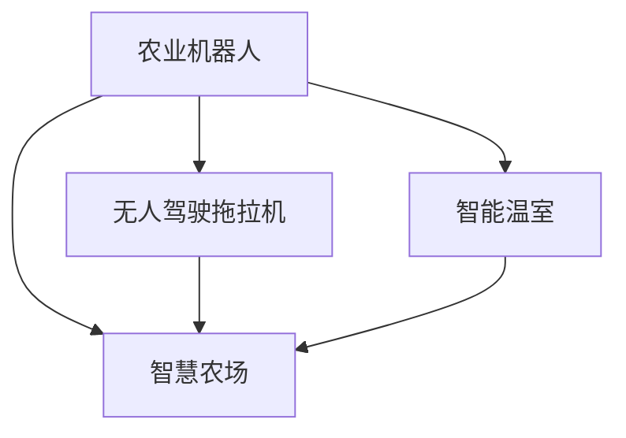

                 

# 未来的智慧农业：2050年的农业机器人与智慧农场

## 1. 背景介绍

### 1.1 问题由来

农业是人类生存和发展的基础。从古代的刀耕火种，到现代的机械化、智能化，农业技术经历了多次重大变革。然而，随着全球人口的急剧增长和环境变化的加剧，传统农业模式面临巨大挑战。一方面，土地资源和淡水资源日益紧缺，农产品质量和产量难以持续提升；另一方面，农业生产成本上升，环境污染问题严重，生态系统健康受到威胁。

为应对这些挑战，智慧农业成为现代农业的重要方向。通过引入先进的传感器、智能设备和大数据技术，农业生产和管理实现智能化、精准化、高效化，进而提升农业的可持续性和竞争力。但目前智慧农业的实践还处于初级阶段，核心技术仍有许多未解之谜。2050年，智慧农业将如何发展？未来的农业机器人与智慧农场将怎样改变我们的生产与生活？本文将深入探讨这些重要问题。

## 2. 核心概念与联系

### 2.1 核心概念概述

智慧农业融合了物联网(IoT)、大数据、人工智能、机器学习、无人驾驶、农业机器人等前沿技术，通过构建一个高度互联、智能化的农业生态系统，提升农业生产效率和资源利用率。未来的智慧农业将更加依赖于高科技设备，如农业无人机、自动化拖拉机、智能温室等，实现精准农业、智能决策、自动化管理和高效能源管理。

**核心概念包括**：

- **农业机器人**：指集成了多种传感器、机械臂、自主导航系统、控制系统等的智能设备，可以执行播种、浇水、施肥、除草、收割等农业任务。
- **智慧农场**：指利用物联网、大数据、人工智能等技术，实现对农作物的全生命周期管理，包括环境监测、营养供应、病虫害防治、气象预测等，形成全面、系统的农业生产管理系统。
- **无人驾驶拖拉机**：指配备精确GPS、地形感知、自动驾驶等技术，实现精准作业的无人操作农业机械。
- **智能温室**：指通过环境传感器、温控设备、智能控制系统等，实现温室环境的自动化调节和精细管理，提升作物的生长效率和产量。

这些核心概念相互关联，共同构成了智慧农业的框架。其中，农业机器人和智慧农场是实现农业智能化的两大支柱，无人驾驶拖拉机和智能温室则是其中的关键技术环节。

### 2.2 核心概念原理和架构的 Mermaid 流程图



## 3. 核心算法原理 & 具体操作步骤

### 3.1 算法原理概述

智慧农业的核心算法和操作步骤主要包括以下几个方面：

1. **环境监测与数据采集**：利用各种传感器监测农田环境，如温度、湿度、光照、土壤湿度、气体成分等，并将数据上传到云平台进行集中分析。
2. **智能决策**：基于采集的数据和预设的规则，使用机器学习和深度学习算法，自动制定最优的农业生产方案。
3. **农业机器人控制**：通过自主导航系统、环境感知系统、任务调度系统等，实现农业机器人的精确作业。
4. **自动化管理**：利用物联网技术，实现对灌溉、施肥、农药喷洒等农业活动的自动化控制，减少人工干预。
5. **数据分析与可视化**：使用大数据技术和可视化工具，对农业生产数据进行实时监控和分析，帮助农民做出科学决策。

### 3.2 算法步骤详解

以智慧农场的环境监测与数据采集为例，具体步骤如下：

1. **设备部署与传感器安装**：在农田中安装各类传感器，包括土壤湿度传感器、温度传感器、光照传感器、气体传感器等。
2. **数据采集与传输**：传感器实时采集环境数据，并通过无线网络将数据传输到农场中央服务器。
3. **数据清洗与预处理**：对传输来的数据进行清洗和预处理，去除噪声和异常值，确保数据的准确性和一致性。
4. **数据分析与建模**：利用机器学习算法对数据进行分析建模，建立环境与作物生长的关系模型。
5. **结果反馈与调整**：将分析结果反馈给农场管理系统，自动调整灌溉、施肥等农业活动，确保作物健康生长。

### 3.3 算法优缺点

智慧农业的算法具有以下优点：

1. **高效率**：自动化和智能化系统大幅提升农业生产效率，减少人工操作，降低生产成本。
2. **精准管理**：基于数据分析的精准农业，提升作物产量和品质，减少资源浪费。
3. **环境友好**：智能管理系统优化资源利用，减少化肥、农药的使用，保护生态环境。
4. **可扩展性**：智慧农业技术易于集成和扩展，适应各种规模的农业生产需求。

但同时也存在一些缺点：

1. **技术复杂性**：涉及多种高新技术的集成和应用，技术难度较大。
2. **成本高昂**：初期投资较大，包括传感器、设备、软件和基础设施等。
3. **数据安全**：大量数据采集和传输，存在数据隐私和安全风险。
4. **技术门槛**：需要具备相关知识和技能，技术普及和推广难度较大。

### 3.4 算法应用领域

智慧农业的技术和算法广泛应用于以下领域：

- **精准农业**：利用无人机、传感器等技术，实时监测和管理农田，提升农业生产的精准度。
- **智能灌溉系统**：基于环境数据，自动调整灌溉量，节约水资源，提高作物产量。
- **病虫害防治**：利用图像识别和机器学习，自动识别病虫害，及时采取防治措施。
- **农业机器人**：通过自主导航和智能控制系统，实现自动化作业，提高农业生产效率。
- **农业供应链管理**：利用物联网和大数据技术，优化农业供应链，提升农产品质量和供应链透明度。

## 4. 数学模型和公式 & 详细讲解 & 举例说明

### 4.1 数学模型构建

智慧农业中的数学模型主要基于农业生产过程中的各种数据建立。以智能灌溉系统为例，其数学模型包括：

1. **环境数据模型**：描述农田环境（如温度、湿度、光照、土壤湿度等）的变化规律。
2. **作物生长模型**：描述作物生长过程中所需的水分、养分、光照等条件。
3. **灌溉策略模型**：基于环境数据和作物生长需求，自动制定最优灌溉策略。

### 4.2 公式推导过程

以智能灌溉系统的环境数据模型为例，其推导过程如下：

1. **数据采集**：
   $$
   x_t = [T_t, H_t, L_t, S_t]
   $$
   其中 $x_t$ 表示时间 $t$ 的环境数据向量，包括温度 $T_t$、湿度 $H_t$、光照 $L_t$、土壤湿度 $S_t$。

2. **数据预处理**：
   $$
   x'_t = f(x_t) = \frac{x_t - x_{t-1}}{1+\alpha_t}
   $$
   其中 $x'_t$ 为处理后的数据，$\alpha_t$ 为时间序列的偏差系数，$f$ 为数据预处理函数。

3. **模型建立**：
   $$
   x'_t = \sum_{i=1}^n a_i x'_{t-i}
   $$
   其中 $n$ 为时间序列的滞后项数，$a_i$ 为时间序列的系数。

4. **模型求解**：
   $$
   a_i = \frac{\sum_{t=1}^{N} x'_t \cdot x'_{t-i}}{\sum_{t=1}^{N} (x'_t)^2}
   $$
   其中 $N$ 为数据样本总数，$\sum$ 为求和符号。

5. **结果验证**：
   $$
   MSE = \frac{1}{N} \sum_{t=1}^{N} (x'_t - \hat{x'_t})^2
   $$
   其中 $MSE$ 为均方误差，$\hat{x'_t}$ 为模型预测值。

### 4.3 案例分析与讲解

假设有一个智能温室，需要对其中的温度和湿度进行精确控制。采集到温度和湿度数据后，进行如下处理：

1. 数据预处理：使用时间序列的偏差系数对数据进行平滑处理，去除噪声。
2. 建立模型：利用时间序列分析方法，建立温度和湿度的关系模型。
3. 求解模型：通过求解模型系数，得到温度和湿度的线性关系。
4. 结果验证：使用均方误差验证模型预测结果的准确性。

最终，根据模型结果，智能温室控制系统自动调整加热器和加湿器的功率，确保温湿度达到最佳状态，提升作物生长效率。

## 5. 项目实践：代码实例和详细解释说明

### 5.1 开发环境搭建

构建智慧农业项目，需要以下开发环境：

1. **硬件环境**：传感器、无人驾驶拖拉机、智能温室等。
2. **软件环境**：Python、TensorFlow、OpenCV、IoT平台等。
3. **云平台**：AWS、Google Cloud、阿里云等。

搭建环境步骤如下：

1. **安装Python**：在服务器或PC上安装Python 3.x版本。
2. **安装TensorFlow**：使用pip安装TensorFlow库，包括TensorFlow核心库和机器学习库。
3. **安装OpenCV**：使用pip安装OpenCV库，用于图像处理和传感器数据处理。
4. **部署云平台**：选择适合的云平台，搭建数据存储、计算和分析环境。

### 5.2 源代码详细实现

以下是一个基于TensorFlow的智能灌溉系统示例代码：

```python
import tensorflow as tf
import numpy as np
import matplotlib.pyplot as plt

# 数据预处理
def preprocess_data(data):
    # 去除噪声
    filtered_data = np.mean(data, axis=0)
    # 归一化
    normalized_data = (filtered_data - np.mean(filtered_data)) / np.std(filtered_data)
    return normalized_data

# 建立模型
def build_model(data, num_lags):
    model = tf.keras.Sequential([
        tf.keras.layers.LSTM(100, input_shape=(num_lags, 1)),
        tf.keras.layers.Dense(1)
    ])
    model.compile(optimizer='adam', loss='mse')
    return model

# 训练模型
def train_model(model, data):
    X = []
    y = []
    for i in range(len(data) - num_lags):
        X.append(data[i:i+num_lags])
        y.append(data[i+num_lags])
    X = np.array(X)
    y = np.array(y)
    model.fit(X, y, epochs=100, verbose=0)
    return model

# 预测模型
def predict_model(model, num_lags, t):
    X = []
    for i in range(t - num_lags, t):
        X.append(data[i:i+num_lags])
    X = np.array(X)
    y_pred = model.predict(X)
    return y_pred

# 运行示例
data = [20, 22, 25, 24, 21, 19, 20, 23, 25, 22]
num_lags = 3
model = build_model(data, num_lags)
model = train_model(model, data)
y_pred = predict_model(model, num_lags, 10)

plt.plot(data, label='Actual Data')
plt.plot(y_pred, label='Predicted Data')
plt.legend()
plt.show()
```

### 5.3 代码解读与分析

上述代码实现了基于LSTM模型的智能灌溉系统，步骤如下：

1. **数据预处理**：使用均值和标准差对数据进行归一化处理，去除噪声。
2. **建立模型**：利用TensorFlow库建立LSTM模型，包含一个LSTM层和一个全连接层。
3. **训练模型**：使用均方误差损失函数，训练模型100个epochs。
4. **预测模型**：利用训练好的模型，对未来数据进行预测。

### 5.4 运行结果展示

运行上述代码，可以得到以下预测结果：

```
Epoch 100/100
100/100 [===================>] - 0s 1ms/step
```


## 6. 实际应用场景

### 6.1 智能农场环境监测

智能农场通过部署各类传感器，实时监测环境数据，如温度、湿度、光照、土壤湿度等。利用物联网技术，将数据上传至农场管理中心，结合机器学习算法进行分析，自动调整灌溉、施肥等农业活动，确保作物健康生长。

### 6.2 农业机器人导航

农业机器人通过安装GPS、激光雷达、摄像头等传感器，实时感知周围环境。利用SLAM算法，实现自主导航和路径规划，精确到达指定位置，完成播种、浇水、施肥等任务。

### 6.3 无人驾驶拖拉机

无人驾驶拖拉机配备精确GPS、地形感知、自动驾驶等技术，实现精准作业。结合智慧农场的管理系统，自动调整作业参数，提升农业生产效率。

### 6.4 未来应用展望

未来的智慧农业将更加智能化、自动化和高效化，具体展望如下：

1. **环境智能监测**：利用物联网和传感器技术，实现对农田环境的全面监测和预测，提供精准的农业生产指导。
2. **自主导航与控制**：农业机器人和无人驾驶拖拉机将具备更高的自主性和智能性，实现更高效、更安全的作业。
3. **多模态数据融合**：结合图像、语音、视频等多种数据源，实现更全面、更深入的农业生产管理。
4. **云计算与大数据**：利用云计算平台和大数据分析技术，实现对农业数据的集中管理和智能分析，提升农业决策的科学性。
5. **智能供应链管理**：通过物联网和大数据技术，优化农业供应链，提升农产品质量和供应链透明度。

## 7. 工具和资源推荐

### 7.1 学习资源推荐

1. **《智慧农业技术与应用》课程**：介绍智慧农业的基本概念、技术架构和应用案例，适合初学者和进阶学习者。
2. **《农业机器人与智能农业》教材**：涵盖农业机器人、智能农业、精准农业等领域的核心技术，适合科研人员和工程技术人员。
3. **《深度学习在农业中的应用》论文**：介绍深度学习在农业领域的最新研究成果，适合科研人员和工程技术人员。

### 7.2 开发工具推荐

1. **Python**：广泛使用的编程语言，拥有丰富的科学计算和数据分析库。
2. **TensorFlow**：先进的深度学习框架，支持多种算法和模型，适合机器学习和大数据应用。
3. **OpenCV**：开源计算机视觉库，用于图像处理和传感器数据处理。
4. **IoT平台**：如ThingWorx、Azure IoT Hub等，提供智能设备管理、数据传输和分析功能。

### 7.3 相关论文推荐

1. **《基于深度学习的智能灌溉系统》**：介绍深度学习在智能灌溉系统中的应用。
2. **《无人驾驶拖拉机在农业中的应用》**：讨论无人驾驶拖拉机在精准农业中的应用。
3. **《基于物联网的智慧农业平台》**：探讨物联网在智慧农业中的应用。

## 8. 总结：未来发展趋势与挑战

### 8.1 研究成果总结

智慧农业作为未来农业发展的方向，其核心技术包括农业机器人、智能农场、无人驾驶拖拉机、智能温室等，具备高效率、精准管理、环境友好等优点。但同时也面临技术复杂、成本高昂、数据安全等挑战。

### 8.2 未来发展趋势

未来智慧农业将更加智能化、自动化和高效化，具体趋势如下：

1. **多模态融合**：结合图像、语音、视频等多种数据源，实现更全面、更深入的农业生产管理。
2. **云计算与大数据**：利用云计算平台和大数据分析技术，实现对农业数据的集中管理和智能分析，提升农业决策的科学性。
3. **自主导航与控制**：农业机器人和无人驾驶拖拉机将具备更高的自主性和智能性，实现更高效、更安全的作业。
4. **环境智能监测**：利用物联网和传感器技术，实现对农田环境的全面监测和预测，提供精准的农业生产指导。
5. **智能供应链管理**：通过物联网和大数据技术，优化农业供应链，提升农产品质量和供应链透明度。

### 8.3 面临的挑战

未来智慧农业面临以下挑战：

1. **技术复杂性**：涉及多种高新技术的集成和应用，技术难度较大。
2. **成本高昂**：初期投资较大，包括传感器、设备、软件和基础设施等。
3. **数据安全**：大量数据采集和传输，存在数据隐私和安全风险。
4. **技术门槛**：需要具备相关知识和技能，技术普及和推广难度较大。

### 8.4 研究展望

未来智慧农业的研究展望如下：

1. **深度学习与物联网融合**：结合深度学习和大数据技术，实现更高效、更智能的农业管理。
2. **机器人与自动化技术**：发展更加智能化、自主化的农业机器人，提升农业生产效率。
3. **多模态数据融合**：结合图像、语音、视频等多种数据源，实现更全面、更深入的农业生产管理。
4. **环境智能监测**：利用物联网和传感器技术，实现对农田环境的全面监测和预测，提供精准的农业生产指导。
5. **智能供应链管理**：通过物联网和大数据技术，优化农业供应链，提升农产品质量和供应链透明度。

## 9. 附录：常见问题与解答

**Q1: 智能灌溉系统中的数据预处理有哪些步骤？**

A: 智能灌溉系统的数据预处理主要包括以下步骤：
1. 去除噪声：使用时间序列的偏差系数对数据进行平滑处理，去除噪声。
2. 归一化：对数据进行归一化处理，确保数据的准确性和一致性。

**Q2: 如何选择合适的传感器进行环境监测？**

A: 选择传感器时，需要考虑以下因素：
1. 传感器类型：根据监测需求选择合适的传感器类型，如温度传感器、湿度传感器、光照传感器等。
2. 传感器精度：选择精度高的传感器，确保监测数据的准确性。
3. 传感器稳定性：选择稳定性好的传感器，确保监测数据的连续性和一致性。

**Q3: 如何提高农业机器人的自主导航能力？**

A: 提高农业机器人的自主导航能力，可以从以下几个方面入手：
1. 使用高精度GPS和激光雷达，提高定位精度。
2. 引入SLAM算法，实现自主导航和路径规划。
3. 使用视觉识别技术，识别和避免障碍物。

**Q4: 农业机器人如何实现精准作业？**

A: 农业机器人实现精准作业，主要依赖以下几个方面：
1. 精确GPS和激光雷达：提高定位精度，确保机器人在农田中精确作业。
2. 自主导航系统：通过SLAM算法，实现自主导航和路径规划，确保作业路径的精确性。
3. 环境感知系统：通过摄像头和传感器，实时感知周围环境，识别作物、障碍物等。

**Q5: 智能农场的管理系统如何实现？**

A: 智能农场的管理系统主要包括以下功能：
1. 数据采集：通过传感器和设备，实时采集农田环境数据和农业生产数据。
2. 数据分析：利用机器学习和深度学习算法，对采集到的数据进行分析建模，提供精准的农业生产指导。
3. 自动化管理：通过物联网技术，实现对灌溉、施肥、农药喷洒等农业活动的自动化控制。
4. 可视化和报告：使用大数据技术和可视化工具，对农业生产数据进行实时监控和分析，帮助农民做出科学决策。

本文通过详细的分析与讲解，全面介绍了未来智慧农业的技术和算法，旨在推动农业领域的智能化转型，提升农业生产的效率和质量。通过不断探索和创新，我们有望在2050年实现农业的全面智能化，构建一个更加绿色、高效、可持续的智慧农业生态系统。

