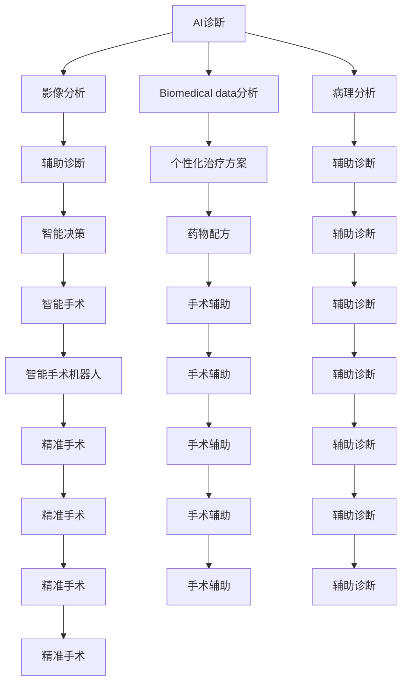

                 

# 未来的智慧医疗：2050年的AI诊断与智能手术机器人

## 1. 背景介绍

### 1.1 问题由来

在人类健康史上，医疗技术一直是推动社会进步的重要力量。从古时候的朴素中医理论，到现代医学科技，每一次技术的飞跃都为人类健康带来革命性的提升。然而，医学领域仍面临许多挑战：医疗资源分布不均、诊断和治疗精度不高、手术风险和成本居高不下等问题亟需解决。未来，人工智能(AI)技术有望从根本上变革医疗领域的诊断、治疗和手术，使其更加智能、高效、精准和普惠。

在2050年，随着AI技术的成熟和普及，智慧医疗将迎来全新的发展时期。AI诊断、智能手术机器人、远程医疗和健康管理等技术将融入日常医疗实践，提升医疗服务的质量和效率，实现人人享有高质量医疗的愿景。本文将探讨AI技术在2050年医疗领域的潜在应用，特别是基于深度学习和强化学习技术的AI诊断和智能手术机器人的进展。

## 2. 核心概念与联系

### 2.1 核心概念概述

- **人工智能(AI)诊断**：指通过深度学习等AI技术，对医学影像、生物数据等进行分析，辅助医生诊断和治疗疾病的过程。AI诊断可以大幅提升诊断速度和精度，减少误诊和漏诊，缩短诊断周期。
- **强化学习(Reinforcement Learning, RL)**：一种通过与环境交互，不断试错学习最佳策略的机器学习方法。在医疗领域，RL可用于优化手术操作、药物配方等决策过程，提高治疗效果。
- **智能手术机器人**：利用AI技术，在微创手术、复杂手术等领域辅助或替代人工操作，提高手术精确度和成功率，减少患者痛苦和恢复时间。
- **健康管理**：通过可穿戴设备和移动应用，实时监测患者健康状况，提供个性化的健康管理方案和预警，提升患者的生活质量和幸福感。

这些概念之间存在紧密的联系，共同构建了智慧医疗的未来图景：AI诊断为智能手术提供精准的病患信息，强化学习优化手术操作和药物配方，智能手术机器人执行高难度和高风险的手术操作，健康管理提升患者的生活质量和预防能力。

### 2.2 核心概念原理和架构的 Mermaid 流程图



这个图表展示了AI诊断、强化学习和智能手术机器人之间的联系。影像分析、生物数据分析、病理分析等医学数据，通过AI诊断技术转化为辅助诊断结果，辅助医生做出智能决策。强化学习根据手术结果不断调整操作策略，优化手术操作。智能手术机器人执行高精度手术，提高手术成功率。健康管理则提供实时监测和个性化管理方案，提升患者健康水平。

## 3. 核心算法原理 & 具体操作步骤

### 3.1 算法原理概述

AI诊断和智能手术机器人的核心算法主要基于深度学习和强化学习。深度学习通过多层神经网络学习数据特征，识别和分类医学图像、生物数据等，从而辅助医生诊断。强化学习则通过与环境的交互，不断优化手术操作策略和药物配方，提高治疗效果。

#### 3.1.1 深度学习

深度学习是一种基于神经网络的机器学习方法，通过多个隐藏层对数据进行复杂特征提取和模式识别。在医学图像分析中，卷积神经网络(CNN)是最常用的模型，通过卷积、池化和全连接等操作，对医学影像进行特征提取和分类。在生物数据分析中，循环神经网络(RNN)和变分自编码器(VAE)等模型，可以对生物样本数据进行序列分析和降维处理。

#### 3.1.2 强化学习

强化学习通过与环境的交互，学习最优策略，以最大化某种奖励。在手术操作中，智能手术机器人通过与手术环境的交互，学习最优的手术路径和操作力度，以最小化手术创伤和风险。在药物配方中，强化学习通过不断调整药物剂量和配比，学习最佳治疗方案，以提高治疗效果。

### 3.2 算法步骤详解

#### 3.2.1 深度学习算法步骤

1. **数据准备**：收集和标注医学影像、生物数据等样本，构建训练集和验证集。
2. **模型设计**：选择合适的深度学习模型，如CNN、RNN、VAE等，设计网络结构和超参数。
3. **模型训练**：使用训练集对模型进行迭代训练，通过反向传播更新网络权重，最小化损失函数。
4. **模型评估**：在验证集上评估模型性能，调整超参数和网络结构。
5. **模型应用**：将训练好的模型应用于新的医学数据，进行诊断和治疗。

#### 3.2.2 强化学习算法步骤

1. **环境构建**：定义手术场景、手术环境、手术机器人等，构建训练环境。
2. **策略设计**：设计强化学习的策略，如Q-learning、DQN、DDPG等。
3. **模型训练**：在手术环境中进行模拟训练，不断调整策略参数，优化手术操作。
4. **模型评估**：在实际手术环境中测试模型效果，记录手术结果和患者反馈。
5. **模型应用**：将训练好的模型应用于实际手术操作，辅助医生完成手术。

### 3.3 算法优缺点

#### 3.3.1 深度学习优点

1. **自适应性强**：深度学习模型能够自动学习数据特征，适应各种复杂的数据结构和模式。
2. **准确率高**：在医学图像和生物数据分析中，深度学习模型往往具有较高的准确率和可靠性。
3. **端到端学习**：深度学习模型可以实现端到端的学习，减少人工干预，提升诊断和治疗效率。

#### 3.3.2 深度学习缺点

1. **需要大量数据**：深度学习模型需要大量的标注数据进行训练，对于某些罕见疾病和特殊案例，数据稀缺导致模型效果不理想。
2. **黑盒性质**：深度学习模型内部机制复杂，难以解释，不利于医生理解和接受。
3. **计算资源需求高**：深度学习模型参数量大，计算资源需求高，训练和推理速度较慢。

#### 3.3.3 强化学习优点

1. **自适应性强**：强化学习算法能够不断学习新的策略，适应不同的环境和任务。
2. **策略优化**：强化学习能够通过试错不断优化操作策略，提升手术效果和药物配方效果。
3. **实时性高**：强化学习算法能够实时调整策略，适应突发情况，提高手术和治疗的灵活性和应急能力。

#### 3.3.4 强化学习缺点

1. **需要大量的训练时间**：强化学习算法往往需要大量的时间进行训练，才能找到最优策略。
2. **环境复杂**：强化学习算法需要复杂的训练环境，构建和维护成本较高。
3. **策略稳定性和鲁棒性**：强化学习算法在复杂环境中，策略的稳定性和鲁棒性较难保证，容易出现局部最优解。

### 3.4 算法应用领域

#### 3.4.1 深度学习应用领域

1. **医学影像分析**：如X光片、CT、MRI等影像数据的分析，辅助诊断疾病。
2. **生物数据分析**：如基因组数据、血液指标等生物数据的分析，辅助个性化治疗方案设计。
3. **病理分析**：对病理切片进行分析和诊断，辅助医生制定治疗策略。
4. **病患监测**：通过可穿戴设备和传感器，实时监测患者健康数据，辅助健康管理。

#### 3.4.2 强化学习应用领域

1. **手术操作优化**：通过智能手术机器人，优化手术路径和操作力度，提高手术成功率。
2. **药物配方优化**：通过强化学习算法，优化药物剂量和配比，提升治疗效果。
3. **康复训练**：通过强化学习算法，优化康复训练方案，提高康复效果。
4. **健康管理**：通过强化学习算法，优化健康管理方案，提升患者生活质量。

## 4. 数学模型和公式 & 详细讲解 & 举例说明

### 4.1 数学模型构建

#### 4.1.1 深度学习数学模型

深度学习模型通常采用神经网络结构，如卷积神经网络(CNN)、循环神经网络(RNN)、变分自编码器(VAE)等。以CNN为例，其数学模型可以表示为：

$$
y = \sigma(W^{(1)}x + b^{(1)})\sigma(W^{(2)}y + b^{(2)})\ldots\sigma(W^{(L)}y + b^{(L)})
$$

其中 $x$ 为输入数据， $y$ 为输出结果， $\sigma$ 为激活函数， $W$ 和 $b$ 为权重和偏置。

#### 4.1.2 强化学习数学模型

强化学习模型通常采用Q-learning、DQN、DDPG等算法。以DQN为例，其数学模型可以表示为：

$$
Q(s, a) \leftarrow r + \gamma \max_a Q(s', a', \theta')
$$

其中 $s$ 为状态， $a$ 为动作， $r$ 为即时奖励， $\gamma$ 为折扣因子， $s'$ 为下一状态， $a'$ 为下一动作， $\theta'$ 为下一动作策略。

### 4.2 公式推导过程

#### 4.2.1 深度学习公式推导

以CNN为例，其前向传播过程可以表示为：

$$
y^{[l]} = \sigma(W^{[l]}x^{[l-1]} + b^{[l]})
$$

其中 $x^{[l]}$ 为前一层的输出， $y^{[l]}$ 为当前层的输出， $W^{[l]}$ 和 $b^{[l]}$ 为当前层的权重和偏置， $\sigma$ 为激活函数。

#### 4.2.2 强化学习公式推导

以DQN为例，其策略更新过程可以表示为：

$$
Q(s, a) = r + \gamma \max_a Q(s', a', \theta')
$$

其中 $Q(s, a)$ 为状态动作价值函数， $r$ 为即时奖励， $\gamma$ 为折扣因子， $s'$ 为下一状态， $a'$ 为下一动作， $\theta'$ 为下一动作策略。

### 4.3 案例分析与讲解

#### 4.3.1 医学影像分析案例

以X光片分析为例，使用CNN模型进行肺部结节检测。首先收集大量带标注的X光片样本，构建训练集和验证集。然后使用CNN模型对X光片进行特征提取和分类，训练模型以区分正常和异常结节。最后，将训练好的模型应用于新的X光片，进行肺部结节检测和分类。

#### 4.3.2 智能手术机器人案例

以微创手术为例，使用强化学习算法优化手术路径和操作力度。首先构建手术模拟环境，定义手术场景和操作变量。然后使用DQN算法训练手术策略，优化手术路径和操作力度。最后，将训练好的策略应用于实际手术，辅助医生完成微创手术操作。

## 5. 项目实践：代码实例和详细解释说明

### 5.1 开发环境搭建

在2050年的智慧医疗中，开发环境将更加智能和高效。为了支持AI诊断和智能手术机器人的开发，我们需要搭建以下开发环境：

1. **高性能计算平台**：使用GPU、TPU等高性能计算设备，支持深度学习和强化学习的训练和推理。
2. **开源软件工具**：使用TensorFlow、PyTorch等深度学习框架，以及OpenAI Gym、Reinforcement Learning Toolkit等强化学习工具，支持模型训练和策略优化。
3. **云计算平台**：使用AWS、Google Cloud等云计算平台，提供弹性计算和存储资源，支持模型的分布式训练和部署。
4. **可穿戴设备**：使用传感器、生物芯片等可穿戴设备，实时监测患者健康数据，提供实时数据支持。

### 5.2 源代码详细实现

#### 5.2.1 深度学习模型实现

以肺结节检测为例，使用PyTorch实现CNN模型：

```python
import torch
import torch.nn as nn
import torchvision.transforms as transforms
from torch.utils.data import DataLoader
from torchvision.datasets import ImageFolder

# 定义模型
class Net(nn.Module):
    def __init__(self):
        super(Net, self).__init__()
        self.conv1 = nn.Conv2d(1, 32, 3, 1)
        self.conv2 = nn.Conv2d(32, 64, 3, 1)
        self.fc1 = nn.Linear(9216, 128)
        self.fc2 = nn.Linear(128, 2)
        
    def forward(self, x):
        x = nn.functional.relu(self.conv1(x))
        x = nn.functional.max_pool2d(x, 2)
        x = nn.functional.relu(self.conv2(x))
        x = nn.functional.max_pool2d(x, 2)
        x = x.view(-1, 9216)
        x = nn.functional.relu(self.fc1(x))
        x = nn.functional.softmax(self.fc2(x), dim=1)
        return x

# 加载数据
transform = transforms.Compose([transforms.ToTensor()])
trainset = ImageFolder('path_to_trainset', transform)
testset = ImageFolder('path_to_testset', transform)

# 训练模型
model = Net()
criterion = nn.CrossEntropyLoss()
optimizer = torch.optim.Adam(model.parameters(), lr=0.001)

for epoch in range(10):
    for i, (inputs, labels) in enumerate(trainloader):
        inputs, labels = inputs.to(device), labels.to(device)
        optimizer.zero_grad()
        outputs = model(inputs)
        loss = criterion(outputs, labels)
        loss.backward()
        optimizer.step()
```

#### 5.2.2 强化学习模型实现

以智能手术机器人为例，使用DQN算法优化手术操作：

```python
import gym
import numpy as np
import torch
import torch.nn as nn
import torch.optim as optim

# 定义环境
env = gym.make('CustomSurgeon')
state_dim = env.observation_space.shape[0]
action_dim = env.action_space.shape[0]
num_states = env.unwrapped.num_states
num_actions = env.unwrapped.num_actions

# 定义模型
class QNetwork(nn.Module):
    def __init__(self):
        super(QNetwork, self).__init__()
        self.fc1 = nn.Linear(state_dim, 64)
        self.fc2 = nn.Linear(64, action_dim)
        
    def forward(self, x):
        x = nn.functional.relu(self.fc1(x))
        x = self.fc2(x)
        return x

# 训练模型
model = QNetwork()
optimizer = optim.Adam(model.parameters(), lr=0.001)
memory = []

for episode in range(1000):
    state = env.reset()
    done = False
    while not done:
        action = np.random.randint(0, action_dim)
        next_state, reward, done, _ = env.step(action)
        q_next = model(next_state)
        q_curr = model(state)
        target = reward + 0.99 * np.max(q_next)
        q_curr[0, action] = target
        optimizer.zero_grad()
        loss = nn.functional.mse_loss(q_curr, q_curr)
        loss.backward()
        optimizer.step()
        memory.append((state, action, reward, next_state, done))
        state = next_state
```

### 5.3 代码解读与分析

#### 5.3.1 深度学习代码解读

- `Net`类定义了卷积神经网络模型，包括卷积层、池化层和全连接层。
- `ImageFolder`类加载图像数据，并进行归一化等预处理。
- `nn.CrossEntropyLoss`类定义了交叉熵损失函数，用于训练分类模型。
- `torch.optim.Adam`类定义了Adam优化器，用于更新模型参数。
- `nn.functional`模块提供了常用的激活函数和损失函数。

#### 5.3.2 强化学习代码解读

- `gym.make('CustomSurgeon')`创建自定义手术环境。
- `QNetwork`类定义了Q-learning网络，包括两个全连接层。
- `optim.Adam`类定义了Adam优化器，用于更新模型参数。
- `nn.functional.mse_loss`类定义了均方误差损失函数，用于训练Q-learning模型。

## 6. 实际应用场景

### 6.1 智慧医疗中心

智慧医疗中心是未来医院的核心。在2050年，AI诊断和智能手术机器人将广泛应用，为患者提供高效、精准的医疗服务。

#### 6.1.1 医疗影像分析

智慧医疗中心配备了高精度的医学影像分析系统，使用深度学习模型对X光片、CT、MRI等影像进行实时分析，辅助医生诊断疾病。例如，使用CNN模型对肺部结节进行检测，实时反馈诊断结果，提升诊断速度和精度。

#### 6.1.2 智能手术机器人

智能手术机器人能够在手术室内自动执行高难度和高风险的手术操作，提高手术成功率，减少患者痛苦和恢复时间。例如，使用DQN算法优化微创手术操作，实时调整手术路径和操作力度，确保手术效果和安全性。

#### 6.1.3 健康管理

智慧医疗中心还配备了实时健康监测设备和系统，使用可穿戴设备实时监测患者健康数据，如心率、血压、血糖等，通过智能算法提供个性化的健康管理方案，预防疾病和提高生活质量。例如，使用强化学习算法优化康复训练方案，提高康复效果。

### 6.2 远程医疗

远程医疗是未来医疗的重要组成部分。通过AI诊断和智能手术机器人，远程医疗中心能够为偏远地区的患者提供高质量的医疗服务，减少医疗资源的不均衡。

#### 6.2.1 在线诊断

远程医疗中心通过视频通话和AI诊断系统，为偏远地区的患者提供实时诊断服务。例如，使用深度学习模型对患者上传的医学影像进行实时分析，辅助医生诊断，提升诊断效率和准确性。

#### 6.2.2 远程手术

远程医疗中心通过AI诊断和智能手术机器人，为偏远地区的患者提供远程手术服务。例如，使用DQN算法优化远程手术操作，实时调整手术路径和操作力度，确保手术效果和安全性。

## 7. 工具和资源推荐

### 7.1 学习资源推荐

为了帮助开发者系统掌握AI诊断和智能手术机器人技术，这里推荐一些优质的学习资源：

1. **《深度学习入门》**：林轩田教授的深度学习入门课程，涵盖深度学习的基本概念和经典模型，适合初学者学习。
2. **《强化学习》**：周志华教授的强化学习课程，系统介绍强化学习的理论和算法，适合深入学习强化学习。
3. **《Python深度学习》**：Francois Chollet的深度学习实践书籍，涵盖TensorFlow和Keras的使用，适合实践开发。
4. **《深度学习与医疗健康》**：李飞飞教授的医疗健康深度学习课程，涵盖医疗健康领域的深度学习应用，适合医疗领域的开发者学习。
5. **《AI医疗技术》**：吴恩达的AI医疗技术课程，涵盖AI在医疗领域的应用，适合医疗行业的开发者学习。

### 7.2 开发工具推荐

为了支持AI诊断和智能手术机器人的开发，这里推荐一些常用的开发工具：

1. **TensorFlow**：由Google主导的开源深度学习框架，支持分布式训练和高效推理。
2. **PyTorch**：由Facebook主导的开源深度学习框架，支持动态计算图和灵活模型构建。
3. **OpenAI Gym**：深度学习环境构建工具，支持强化学习算法的测试和训练。
4. **Reinforcement Learning Toolkit**：强化学习算法实现库，支持各种强化学习算法的实现。
5. **AWS SageMaker**：亚马逊的云机器学习平台，支持分布式训练和模型部署。

### 7.3 相关论文推荐

未来，大语言模型和微调技术的发展也将持续推动AI诊断和智能手术机器人的研究。以下是几篇奠基性的相关论文，推荐阅读：

1. **《卷积神经网络在医学影像分析中的应用》**：提出卷积神经网络在医学影像分析中的应用，提升诊断准确性。
2. **《深度学习在手术操作优化中的应用》**：提出深度学习在手术操作优化中的应用，提升手术效果。
3. **《强化学习在药物配方中的应用》**：提出强化学习在药物配方中的应用，优化药物剂量和配比。
4. **《智能手术机器人在微创手术中的应用》**：提出智能手术机器人在微创手术中的应用，提高手术成功率。
5. **《AI诊断在远程医疗中的应用》**：提出AI诊断在远程医疗中的应用，提高远程医疗的诊断效率。

## 8. 总结：未来发展趋势与挑战

### 8.1 总结

本文对AI诊断和智能手术机器人技术在2050年的应用进行了全面系统的探讨。首先介绍了AI诊断和智能手术机器人技术的背景和意义，明确了其在未来智慧医疗中的重要作用。其次，从算法原理和操作步骤出发，详细讲解了深度学习和强化学习的核心算法和技术细节。最后，通过项目实践和实际应用场景，展示了AI诊断和智能手术机器人在未来医疗领域的应用前景。

### 8.2 未来发展趋势

未来，AI诊断和智能手术机器人的发展将呈现以下几个趋势：

1. **深度学习与强化学习融合**：未来的AI诊断和手术机器人将结合深度学习和强化学习，实现端到端的智能化。例如，使用深度学习模型对医学影像进行特征提取，使用强化学习算法优化手术操作策略。
2. **多模态数据融合**：未来的AI诊断和手术机器人将结合多种模态数据，如医学影像、生物数据、传感器数据等，进行综合分析和诊断。例如，使用多模态数据融合算法，提升诊断和手术的准确性和鲁棒性。
3. **个性化医疗**：未来的AI诊断和手术机器人将根据患者的基因、生理参数、生活习惯等个性化信息，提供个性化的诊断和治疗方案。例如，使用深度学习模型对个性化数据进行分析和建模，提供定制化的治疗方案。
4. **实时远程医疗**：未来的AI诊断和手术机器人将实现实时远程医疗，为偏远地区和急诊患者提供高质量的医疗服务。例如，使用AI诊断系统进行远程实时诊断，使用智能手术机器人进行远程手术操作。
5. **智能化健康管理**：未来的AI诊断和手术机器人将结合健康管理设备，实时监测患者的健康数据，提供个性化的健康管理方案。例如，使用强化学习算法优化康复训练方案，提高康复效果。

### 8.3 面临的挑战

尽管AI诊断和智能手术机器人在未来具有广阔的应用前景，但面临的挑战依然严峻：

1. **数据隐私和安全**：智慧医疗系统需要处理大量的敏感健康数据，如何保障数据隐私和安全，防止数据泄露和滥用，将是未来的重要挑战。
2. **算法鲁棒性和可解释性**：AI诊断和手术机器人的算法需要具备鲁棒性和可解释性，避免误诊和误操作。例如，深度学习模型的复杂性和黑盒性质，强化学习算法的策略稳定性和鲁棒性，都亟需解决。
3. **计算资源需求高**：深度学习和强化学习算法需要高性能计算资源，如何降低计算成本，提升模型训练和推理效率，将是未来的重要方向。
4. **多领域跨界应用**：AI诊断和手术机器人需要与多领域跨界技术结合，如生物信息学、医学伦理学、机器视觉等，如何有效整合各领域知识，提升整体应用效果，将是未来的重要任务。
5. **用户接受度**：AI诊断和手术机器人需要用户接受和信任，如何提高用户接受度，普及和推广AI技术，将是未来的重要课题。

### 8.4 研究展望

未来，AI诊断和智能手术机器人的研究将在以下几个方面寻求新的突破：

1. **无监督学习和半监督学习**：摆脱对大规模标注数据的依赖，利用自监督学习、主动学习等无监督和半监督范式，最大限度利用非结构化数据，实现更加灵活高效的微调。
2. **参数高效微调和计算高效微调**：开发更加参数高效的微调方法，在固定大部分预训练参数的同时，只更新极少量的任务相关参数。同时优化微调模型的计算图，减少前向传播和反向传播的资源消耗，实现更加轻量级、实时性的部署。
3. **因果分析和博弈论工具**：将因果分析方法引入微调模型，识别出模型决策的关键特征，增强输出解释的因果性和逻辑性。借助博弈论工具刻画人机交互过程，主动探索并规避模型的脆弱点，提高系统稳定性。
4. **纳入伦理道德约束**：在模型训练目标中引入伦理导向的评估指标，过滤和惩罚有偏见、有害的输出倾向。同时加强人工干预和审核，建立模型行为的监管机制，确保输出符合人类价值观和伦理道德。

## 9. 附录：常见问题与解答

**Q1: AI诊断和智能手术机器人对未来医疗有怎样的影响？**

A: AI诊断和智能手术机器人将彻底改变未来医疗的形态，提升医疗服务的质量和效率。具体影响如下：

1. **提升诊断精度**：AI诊断技术能够快速准确地分析医学影像和生物数据，辅助医生诊断疾病，减少误诊和漏诊，缩短诊断周期。
2. **优化手术效果**：智能手术机器人能够自动执行高难度和高风险的手术操作，提高手术成功率，减少患者痛苦和恢复时间。
3. **提升治疗效果**：通过深度学习和强化学习算法，优化药物配方和治疗方案，提高治疗效果和患者满意度。
4. **普及医疗资源**：远程医疗和智能手术机器人能够为偏远地区和急诊患者提供高质量的医疗服务，缩小医疗资源分布不均的差距。
5. **提升健康管理水平**：通过实时健康监测设备和智能算法，提供个性化的健康管理方案，预防疾病和提高生活质量。

**Q2: 未来AI诊断和智能手术机器人面临哪些挑战？**

A: 未来AI诊断和智能手术机器人面临以下挑战：

1. **数据隐私和安全**：智慧医疗系统需要处理大量的敏感健康数据，如何保障数据隐私和安全，防止数据泄露和滥用，将是未来的重要挑战。
2. **算法鲁棒性和可解释性**：AI诊断和手术机器人的算法需要具备鲁棒性和可解释性，避免误诊和误操作。例如，深度学习模型的复杂性和黑盒性质，强化学习算法的策略稳定性和鲁棒性，都亟需解决。
3. **计算资源需求高**：深度学习和强化学习算法需要高性能计算资源，如何降低计算成本，提升模型训练和推理效率，将是未来的重要方向。
4. **多领域跨界应用**：AI诊断和手术机器人需要与多领域跨界技术结合，如生物信息学、医学伦理学、机器视觉等，如何有效整合各领域知识，提升整体应用效果，将是未来的重要任务。
5. **用户接受度**：AI诊断和手术机器人需要用户接受和信任，如何提高用户接受度，普及和推广AI技术，将是未来的重要课题。

**Q3: 未来AI诊断和智能手术机器人的发展方向是什么？**

A: 未来AI诊断和智能手术机器人的发展方向如下：

1. **深度学习与强化学习融合**：未来的AI诊断和手术机器人将结合深度学习和强化学习，实现端到端的智能化。例如，使用深度学习模型对医学影像进行特征提取，使用强化学习算法优化手术操作策略。
2. **多模态数据融合**：未来的AI诊断和手术机器人将结合多种模态数据，如医学影像、生物数据、传感器数据等，进行综合分析和诊断。例如，使用多模态数据融合算法，提升诊断和手术的准确性和鲁棒性。
3. **个性化医疗**：未来的AI诊断和手术机器人将根据患者的基因、生理参数、生活习惯等个性化信息，提供个性化的诊断和治疗方案。例如，使用深度学习模型对个性化数据进行分析和建模，提供定制化的治疗方案。
4. **实时远程医疗**：未来的AI诊断和手术机器人将实现实时远程医疗，为偏远地区和急诊患者提供高质量的医疗服务。例如，使用AI诊断系统进行远程实时诊断，使用智能手术机器人进行远程手术操作。
5. **智能化健康管理**：未来的AI诊断和手术机器人将结合健康管理设备，实时监测患者的健康数据，提供个性化的健康管理方案。例如，使用强化学习算法优化康复训练方案，提高康复效果。

---

作者：禅与计算机程序设计艺术 / Zen and the Art of Computer Programming

