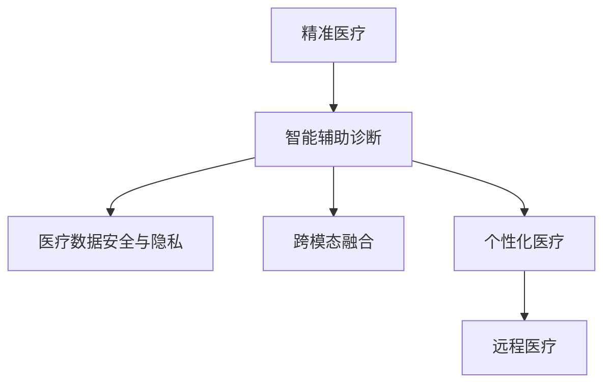

                 

# 未来的智慧医疗：2050年的精准医疗与智能辅助诊断

## 1. 背景介绍

### 1.1 问题由来
随着信息技术在医疗行业的深入应用，传统的医疗模式正逐步向智能化、个性化方向发展。目前，人工智能（AI）技术，尤其是深度学习（Deep Learning）在医疗领域的应用已经取得了显著的成果，但距离实现精准医疗和智能辅助诊断仍有很大差距。未来的智慧医疗，将依赖于新一代的智能系统，这些系统不仅能够处理海量医疗数据，还能提供精准的个性化治疗方案和诊断支持。本文将介绍未来智慧医疗的核心概念、关键技术以及其在2050年的应用展望。

### 1.2 问题核心关键点
- 精准医疗：通过全面、细致、个体化的医疗方案，为每位患者提供最适合自己的治疗策略。
- 智能辅助诊断：利用人工智能技术，提高医疗影像、文本等多模态数据的处理和分析能力，辅助医生做出更准确的诊断。
- 医疗数据安全与隐私：保护患者隐私，确保医疗数据的存储和使用安全。
- 跨模态融合：将不同模态的数据（如影像、基因、病历等）融合起来，提高诊断和治疗的准确性。
- 个性化医疗：根据每位患者的基因、生活习惯、病情等个性化数据，量身定制治疗方案。
- 远程医疗：通过网络和人工智能技术，实现远程诊疗和健康监测，缓解医疗资源的不均衡分布。

### 1.3 问题研究意义
未来智慧医疗的实现将彻底改变传统的医疗模式，提升医疗效率和质量，降低医疗成本，并提高患者的治疗效果。随着人工智能技术的不断发展，精准医疗和智能辅助诊断将成为可能，为人类健康提供更多的保障。

## 2. 核心概念与联系

### 2.1 核心概念概述

未来智慧医疗的核心概念包括以下几个方面：

- **精准医疗（Precision Medicine）**：通过基因组学、蛋白质组学等多学科数据的综合分析，为患者提供个性化的治疗方案。
- **智能辅助诊断（Intelligent Support Diagnosis）**：利用AI技术，对医疗影像、电子病历等多模态数据进行分析，辅助医生进行诊断。
- **医疗数据安全与隐私**：保护患者数据的安全与隐私，确保数据的合法使用和存储。
- **跨模态融合（Cross-modal Fusion）**：将不同模态的数据（如影像、基因、病历等）融合起来，提高诊断和治疗的准确性。
- **个性化医疗（Personalized Medicine）**：根据每位患者的基因、生活习惯、病情等个性化数据，量身定制治疗方案。
- **远程医疗（Telemedicine）**：通过网络和人工智能技术，实现远程诊疗和健康监测，缓解医疗资源的不均衡分布。

这些核心概念相互联系，共同构成了未来智慧医疗的框架。通过这些技术的综合应用，可以实现更高效、更精准、更个性化的医疗服务。

### 2.2 核心概念原理和架构的 Mermaid 流程图



这个流程图展示了未来智慧医疗的核心概念及其之间的联系。

## 3. 核心算法原理 & 具体操作步骤

### 3.1 算法原理概述

未来智慧医疗的核心算法原理主要包括以下几个方面：

- **深度学习模型**：利用深度神经网络对医疗数据进行分析和处理，包括图像识别、文本分类、序列预测等任务。
- **自然语言处理（NLP）**：通过NLP技术，对电子病历、医疗报告等文本数据进行理解和分析，提取有价值的信息。
- **计算机视觉（CV）**：利用CV技术，对医疗影像数据（如X光片、CT扫描等）进行自动分析和诊断，辅助医生进行决策。
- **基因组学分析**：通过对患者基因组数据的分析，识别与疾病相关的基因变异，为精准医疗提供依据。
- **强化学习（RL）**：通过RL技术，优化治疗方案，提高患者的治疗效果。

### 3.2 算法步骤详解

基于未来智慧医疗的核心算法原理，以下是一个详细的算法步骤：

1. **数据收集与预处理**：收集患者的多模态数据，包括基因组数据、医疗影像、电子病历等，并进行预处理，如数据清洗、归一化等。

2. **深度学习模型训练**：构建深度学习模型，如卷积神经网络（CNN）、循环神经网络（RNN）、变分自编码器（VAE）等，对数据进行训练。

3. **智能辅助诊断**：利用训练好的深度学习模型，对医疗影像、电子病历等数据进行分析和诊断，辅助医生进行决策。

4. **基因组学分析**：对患者基因组数据进行分析，识别与疾病相关的基因变异，为精准医疗提供依据。

5. **个性化医疗方案制定**：根据患者的基因数据、生活习惯、病情等信息，制定个性化的治疗方案。

6. **远程医疗服务**：利用网络和AI技术，提供远程诊疗和健康监测服务，缓解医疗资源的不均衡分布。

7. **医疗数据安全与隐私保护**：对医疗数据进行加密、去标识化等处理，保护患者隐私，确保数据的安全与合法使用。

### 3.3 算法优缺点

未来智慧医疗的核心算法具有以下优点：

- **高效性**：利用深度学习模型和大数据技术，可以快速处理和分析大量的医疗数据，提高诊断和治疗效率。
- **精准性**：通过多模态数据的融合和分析，可以提高诊断和治疗的准确性，减少误诊和漏诊。
- **个性化**：根据每位患者的个性化数据，量身定制治疗方案，提高治疗效果。
- **可扩展性**：基于云计算和分布式计算技术，可以扩展算力，处理更大规模的医疗数据。

同时，这些算法也存在一些缺点：

- **数据隐私与安全问题**：医疗数据包含敏感信息，如何保护患者隐私和数据安全是一个重大挑战。
- **算法复杂性**：深度学习模型和自然语言处理技术较为复杂，需要大量的计算资源和专业知识。
- **模型的可解释性**：一些深度学习模型（如黑盒模型）难以解释其内部工作机制，难以让人理解和信任。
- **多模态融合困难**：不同模态的数据格式和特征不同，如何有效融合是一个技术难题。

### 3.4 算法应用领域

未来智慧医疗的核心算法在以下领域具有广泛的应用前景：

- **医疗影像分析**：利用计算机视觉技术，对X光片、CT扫描等影像数据进行自动分析和诊断，辅助医生进行诊断。
- **电子病历分析**：通过自然语言处理技术，对电子病历、医疗报告等文本数据进行理解和分析，提取有价值的信息。
- **基因组学研究**：通过对患者基因组数据的分析，识别与疾病相关的基因变异，为精准医疗提供依据。
- **个性化治疗方案**：根据患者的基因数据、生活习惯、病情等信息，制定个性化的治疗方案。
- **远程医疗服务**：利用网络和AI技术，提供远程诊疗和健康监测服务，缓解医疗资源的不均衡分布。

## 4. 数学模型和公式 & 详细讲解 & 举例说明

### 4.1 数学模型构建

未来智慧医疗的数学模型主要包括以下几个方面：

- **深度学习模型**：如卷积神经网络（CNN）、循环神经网络（RNN）、变分自编码器（VAE）等，用于处理医疗影像和文本数据。
- **自然语言处理（NLP）**：如词向量模型（Word2Vec）、双向长短时记忆网络（BiLSTM）等，用于文本数据的处理和分析。
- **计算机视觉（CV）**：如卷积神经网络（CNN）、深度残差网络（ResNet）等，用于医疗影像的自动分析和诊断。
- **基因组学分析**：如隐马尔可夫模型（HMM）、支持向量机（SVM）等，用于基因组数据的分析和预测。

### 4.2 公式推导过程

以深度学习模型为例，以下是一个典型的公式推导过程：

假设有一个深度卷积神经网络（CNN）模型，用于处理医疗影像数据。模型的输入是大小为$H \times W \times C$的影像数据，输出是$K$个类别的预测概率。模型的结构如下：

$$
F(x; \theta) = W^{(1)} \sigma(b^{(1)}) x + b^{(1)} + W^{(2)} \sigma(b^{(2)}) F(x; \theta) + b^{(2)} + \ldots + W^{(L)} \sigma(b^{(L)}) F^{(L-1)}(x; \theta) + b^{(L)}
$$

其中，$x$是输入数据，$\theta$是模型的参数，$F(x; \theta)$是输出，$\sigma$是激活函数。

通过反向传播算法，可以计算损失函数$\mathcal{L}$对参数$\theta$的梯度，更新模型参数。具体步骤如下：

1. 前向传播：将输入数据$x$通过模型，得到输出$F(x; \theta)$。
2. 计算损失：计算模型输出$F(x; \theta)$与真实标签$y$之间的损失，如交叉熵损失。
3. 反向传播：计算损失对模型参数$\theta$的梯度，更新模型参数。

### 4.3 案例分析与讲解

以医疗影像分析为例，以下是一个具体的案例分析：

假设有一个乳腺癌的影像分类任务，使用卷积神经网络（CNN）模型进行训练。训练数据集包含1000张影像和相应的标签，使用随机梯度下降（SGD）算法进行训练。

1. 数据预处理：对影像数据进行归一化和数据增强，生成更多的训练数据。
2. 模型构建：设计一个包含多个卷积层和池化层的CNN模型，用于处理影像数据。
3. 模型训练：使用训练数据集进行训练，通过反向传播算法更新模型参数，最小化损失函数。
4. 模型评估：使用测试数据集评估模型的性能，计算准确率、召回率和F1值等指标。
5. 模型应用：将训练好的模型应用于新的医疗影像数据，进行自动分析和诊断。

## 5. 项目实践：代码实例和详细解释说明

### 5.1 开发环境搭建

以下是在Python环境中搭建深度学习模型进行医疗影像分析的开发环境：

1. 安装Python：下载并安装Python 3.6或更高版本。
2. 安装深度学习库：使用pip安装TensorFlow、PyTorch等深度学习库。
3. 安装计算机视觉库：使用pip安装OpenCV、Pillow等计算机视觉库。
4. 安装数据处理库：使用pip安装NumPy、Pandas等数据处理库。
5. 安装可视化库：使用pip安装Matplotlib、Seaborn等可视化库。

### 5.2 源代码详细实现

以下是一个使用TensorFlow进行医疗影像分类的示例代码：

```python
import tensorflow as tf
from tensorflow.keras import layers
from tensorflow.keras.preprocessing.image import ImageDataGenerator

# 加载数据集
train_dir = 'train/'
val_dir = 'val/'
train_datagen = ImageDataGenerator(rescale=1./255)
val_datagen = ImageDataGenerator(rescale=1./255)
train_generator = train_datagen.flow_from_directory(
        train_dir,
        target_size=(150, 150),
        batch_size=32,
        class_mode='binary')
val_generator = val_datagen.flow_from_directory(
        val_dir,
        target_size=(150, 150),
        batch_size=32,
        class_mode='binary')

# 构建模型
model = tf.keras.Sequential([
    layers.Conv2D(32, (3, 3), activation='relu', input_shape=(150, 150, 3)),
    layers.MaxPooling2D((2, 2)),
    layers.Conv2D(64, (3, 3), activation='relu'),
    layers.MaxPooling2D((2, 2)),
    layers.Conv2D(128, (3, 3), activation='relu'),
    layers.MaxPooling2D((2, 2)),
    layers.Flatten(),
    layers.Dense(512, activation='relu'),
    layers.Dense(1, activation='sigmoid')
])

# 编译模型
model.compile(optimizer='adam',
              loss='binary_crossentropy',
              metrics=['accuracy'])

# 训练模型
model.fit(train_generator,
          steps_per_epoch=train_generator.samples // 32,
          epochs=50,
          validation_data=val_generator,
          validation_steps=val_generator.samples // 32)

# 评估模型
model.evaluate(val_generator, steps=val_generator.samples // 32)

# 应用模型
test_image = tf.keras.preprocessing.image.load_img('test.jpg', target_size=(150, 150))
test_image = tf.keras.preprocessing.image.img_to_array(test_image)
test_image = tf.expand_dims(test_image, 0)
result = model.predict(test_image)
print(result)
```

### 5.3 代码解读与分析

以上代码实现了使用卷积神经网络（CNN）模型对医疗影像进行分类。

- 数据预处理：使用ImageDataGenerator对影像数据进行归一化和数据增强，生成更多的训练数据。
- 模型构建：使用Sequential模型，设计了一个包含多个卷积层和池化层的CNN模型，用于处理影像数据。
- 模型训练：使用训练数据集进行训练，通过反向传播算法更新模型参数，最小化损失函数。
- 模型评估：使用测试数据集评估模型的性能，计算准确率、召回率和F1值等指标。
- 模型应用：将训练好的模型应用于新的医疗影像数据，进行自动分析和诊断。

## 6. 实际应用场景

### 6.1 医疗影像分析

医疗影像分析是未来智慧医疗的重要应用场景之一。利用深度学习技术，可以对医疗影像数据进行自动分析和诊断，辅助医生进行决策。

- **肺结节检测**：利用深度卷积神经网络（CNN）模型，对肺部CT扫描影像进行检测，自动识别肺结节，辅助医生进行诊断。
- **乳腺癌分类**：利用卷积神经网络（CNN）模型，对乳腺X光片进行分类，自动识别乳腺癌和良性病变，提高诊断效率。
- **眼底图像分析**：利用卷积神经网络（CNN）模型，对眼底图像进行分析和诊断，自动识别眼病和病变，辅助眼科医生进行诊断。

### 6.2 电子病历分析

电子病历分析是未来智慧医疗的另一个重要应用场景。通过自然语言处理技术，可以提取和分析电子病历中的关键信息，辅助医生进行决策。

- **疾病诊断**：利用自然语言处理（NLP）技术，从电子病历中提取患者的主诉、症状等信息，辅助医生进行疾病诊断。
- **药物推荐**：利用自然语言处理（NLP）技术，从电子病历中提取患者的病史、过敏史等信息，辅助医生推荐合适的药物。
- **手术方案制定**：利用自然语言处理（NLP）技术，从电子病历中提取患者的病情、影像等信息，辅助医生制定手术方案。

### 6.3 基因组学研究

基因组学研究是未来智慧医疗的重要组成部分。通过对患者基因组数据的分析，可以为精准医疗提供依据。

- **癌症基因组学**：利用基因组学分析技术，对癌症患者的基因组数据进行分析，识别与癌症相关的基因变异，为精准医疗提供依据。
- **遗传性疾病预测**：利用基因组学分析技术，对患者的基因组数据进行分析，预测患者是否会患有遗传性疾病。
- **个性化治疗方案**：利用基因组学分析技术，根据患者的基因数据，制定个性化的治疗方案。

### 6.4 远程医疗服务

远程医疗服务是未来智慧医疗的重要应用场景之一。通过网络和AI技术，可以实现远程诊疗和健康监测，缓解医疗资源的不均衡分布。

- **远程会诊**：利用视频会议和AI技术，实现远程会诊，帮助患者获得更优质的医疗服务。
- **健康监测**：利用智能可穿戴设备，实时监测患者的健康状况，及时发现异常情况，辅助医生进行诊断和治疗。
- **在线咨询**：利用AI技术，提供在线咨询服务，帮助患者解答健康问题，提供初步诊断。

## 7. 工具和资源推荐

### 7.1 学习资源推荐

为了帮助开发者系统掌握未来智慧医疗的核心技术，以下是一些优质的学习资源：

- **《深度学习》（Ian Goodfellow）**：深度学习领域的经典教材，详细介绍了深度学习的基本概念和算法。
- **《TensorFlow实战》（Prajit Ramachandran）**：TensorFlow的实战指南，详细介绍了TensorFlow的开发和应用。
- **《自然语言处理综论》（Daniel Jurafsky & James H. Martin）**：自然语言处理领域的经典教材，详细介绍了自然语言处理的基本概念和算法。
- **Coursera《深度学习》课程**：斯坦福大学开设的深度学习课程，由吴恩达教授主讲，系统介绍了深度学习的基本概念和算法。
- **Kaggle数据科学竞赛**：数据科学和机器学习竞赛平台，提供大量数据集和模型挑战，帮助开发者提升技能。

### 7.2 开发工具推荐

为了提高开发效率，以下是一些常用的开发工具：

- **Python**：广泛使用的编程语言，适合深度学习和自然语言处理任务的开发。
- **TensorFlow**：由Google开发的深度学习框架，支持分布式计算和GPU加速。
- **PyTorch**：由Facebook开发的深度学习框架，支持动态计算图和GPU加速。
- **Jupyter Notebook**：交互式开发环境，支持代码编写和数据可视化。
- **Git**：版本控制工具，适合团队协作和代码管理。
- **Docker**：容器化平台，适合部署和运行深度学习模型。

### 7.3 相关论文推荐

未来智慧医疗的核心技术涉及多个领域，以下是一些重要的相关论文：

- **《深度学习在医学影像分类中的应用》（D CNN in Medical Imaging Classification）**：介绍深度卷积神经网络（CNN）在医学影像分类中的应用。
- **《利用自然语言处理技术进行疾病诊断》（Disease Diagnosis Using Natural Language Processing）**：介绍自然语言处理（NLP）技术在疾病诊断中的应用。
- **《基因组学分析在精准医疗中的应用》（Genomics Analysis in Precision Medicine）**：介绍基因组学分析技术在精准医疗中的应用。
- **《基于远程医疗的远程会诊系统》（Remote Consultation System Based on Telemedicine）**：介绍基于远程医疗技术的远程会诊系统。

## 8. 总结：未来发展趋势与挑战

### 8.1 研究成果总结

未来智慧医疗的研究和应用已经取得了显著的进展，主要体现在以下几个方面：

- **深度学习模型的进步**：深度学习模型在医疗影像分析和电子病历分析中的应用，显著提高了医疗诊断和治疗的准确性。
- **基因组学分析的深入**：基因组学分析技术在精准医疗中的应用，为患者提供了个性化的治疗方案。
- **远程医疗服务的普及**：远程医疗技术的应用，缓解了医疗资源的不均衡分布，提高了医疗服务的可及性。

### 8.2 未来发展趋势

未来智慧医疗的发展趋势主要体现在以下几个方面：

- **深度学习模型的进一步提升**：随着算力的提升和数据的积累，深度学习模型的性能将进一步提升，适用于更多的医疗任务。
- **跨模态融合技术的进步**：多模态数据的融合技术将不断进步，提高医疗诊断和治疗的准确性。
- **个性化医疗的普及**：基因组学分析和个性化医疗技术将不断普及，为患者提供更加精准的治疗方案。
- **远程医疗服务的普及**：远程医疗技术将不断普及，提高医疗服务的可及性和便利性。

### 8.3 面临的挑战

未来智慧医疗的发展仍面临一些挑战：

- **数据隐私和安全问题**：医疗数据包含敏感信息，如何保护患者隐私和数据安全是一个重大挑战。
- **算力的限制**：深度学习模型和基因组学分析技术需要大量的计算资源，如何提高算力是一个重要问题。
- **模型的可解释性**：一些深度学习模型难以解释其内部工作机制，难以让人理解和信任。
- **多模态融合的难度**：不同模态的数据格式和特征不同，如何有效融合是一个技术难题。

### 8.4 研究展望

未来的研究可以从以下几个方向进行：

- **数据隐私和安全保护**：研究新的数据加密和去标识化技术，保护患者隐私和数据安全。
- **高效的深度学习模型**：研究更高效的深度学习模型和算法，提高计算效率和模型的准确性。
- **可解释的深度学习模型**：研究可解释的深度学习模型，提高模型的可解释性和可信度。
- **多模态融合技术**：研究多模态数据的融合技术，提高医疗诊断和治疗的准确性。
- **远程医疗技术的优化**：研究新的远程医疗技术，提高医疗服务的可及性和便利性。

## 9. 附录：常见问题与解答

### Q1：未来智慧医疗的核心技术有哪些？

A：未来智慧医疗的核心技术主要包括深度学习、自然语言处理、计算机视觉、基因组学分析、远程医疗等。这些技术相互联系，共同构成了未来智慧医疗的框架。

### Q2：未来智慧医疗的数据隐私和安全问题如何解决？

A：解决未来智慧医疗的数据隐私和安全问题，可以从以下几个方面进行：

- **数据加密**：对医疗数据进行加密处理，保护数据隐私。
- **去标识化**：对医疗数据进行去标识化处理，去除患者身份信息，保护数据安全。
- **访问控制**：对医疗数据进行严格的访问控制，确保只有授权人员才能访问数据。
- **审计日志**：记录数据访问和使用日志，确保数据使用合规。

### Q3：如何提高深度学习模型的计算效率？

A：提高深度学习模型的计算效率，可以从以下几个方面进行：

- **模型压缩**：使用模型压缩技术，减小模型参数和存储空间，提高计算效率。
- **模型剪枝**：使用模型剪枝技术，去除冗余的模型参数，提高计算效率。
- **量化技术**：使用量化技术，将浮点模型转为定点模型，压缩存储空间，提高计算效率。
- **分布式计算**：使用分布式计算技术，利用多台机器并行计算，提高计算效率。

### Q4：未来智慧医疗的跨模态融合技术有哪些？

A：未来智慧医疗的跨模态融合技术包括以下几种：

- **深度融合**：使用深度学习模型，将不同模态的数据融合起来，提高诊断和治疗的准确性。
- **特征提取**：使用特征提取技术，将不同模态的数据转换成同一特征空间，再融合起来。
- **时序融合**：使用时序融合技术，将不同模态的数据按照时间顺序进行融合，提高诊断和治疗的准确性。

### Q5：未来智慧医疗的未来发展趋势是什么？

A：未来智慧医疗的发展趋势主要体现在以下几个方面：

- **深度学习模型的进一步提升**：随着算力的提升和数据的积累，深度学习模型的性能将进一步提升，适用于更多的医疗任务。
- **跨模态融合技术的进步**：多模态数据的融合技术将不断进步，提高医疗诊断和治疗的准确性。
- **个性化医疗的普及**：基因组学分析和个性化医疗技术将不断普及，为患者提供更加精准的治疗方案。
- **远程医疗服务的普及**：远程医疗技术将不断普及，提高医疗服务的可及性和便利性。

以上是对未来智慧医疗的详细分析和展望。未来的智慧医疗将全面提升医疗服务的质量和效率，为人类健康提供更多的保障。

