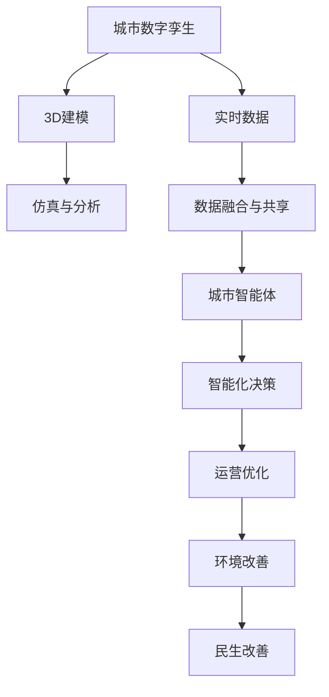

                 

## 1. 背景介绍

### 1.1 问题由来
随着城市化进程的不断加快，城市管理面临着前所未有的复杂性和挑战。如何在有限资源下，实现高效的城市运营和可持续的经济发展，成为各国政府和企业的共同难题。为了解决这一问题，智慧城市的概念应运而生，旨在利用先进的信息技术，打造智能化、绿色化、人本化的城市生活环境。

智慧城市建设的核心在于全面感知、深度整合和实时响应，通过传感器、物联网等技术，实现城市数据的实时采集和共享，进而进行智能决策和管理。然而，当前智慧城市建设面临诸多瓶颈，如数据孤岛、信息过载、协同难度大等问题。

为此，需要引入更高效、全面、智能化的城市管理手段，以实现城市的高质量发展和长期可持续发展。在这样的背景下，城市数字孪生与城市智能体概念应运而生，成为未来智慧城市建设的重要方向。

### 1.2 问题核心关键点
城市数字孪生与城市智能体是利用数字技术，构建虚拟城市模型，并结合AI、大数据等技术，实现城市全要素、全场景、全生命周期的智能管理。这一概念不仅涉及到数字建模、仿真和分析，更关涉到自动化决策、智能运营和持续优化等多个方面。

城市数字孪生通过将城市的物理世界和虚拟世界深度融合，为城市智能体提供了数据基础和运行环境。而城市智能体则是通过一系列智能化技术，实现对城市的精细化、动态化管理，从而提升城市的运营效率和居民生活质量。

### 1.3 问题研究意义
研究城市数字孪生与城市智能体，对于推动智慧城市建设、实现城市可持续发展具有重要意义：

1. **数据融合与共享**：通过构建城市数字孪生，可以实现不同数据源的整合，消除信息孤岛，提升数据的可用性和实时性。
2. **智能化决策**：结合AI技术，城市智能体可以实现高效的智能化决策，提升城市管理的科学性和精准性。
3. **运营优化**：通过实时监控和动态调整，城市智能体可以实现资源的高效配置和运营优化，提升城市的响应速度和运营效率。
4. **环境改善**：结合环保技术，城市智能体可以实现能源的智能管理和污染的实时监测，促进绿色低碳的城市发展。
5. **民生改善**：通过智能化的公共服务，城市智能体可以提高市民的生活便利性和安全性，增强居民的幸福感和获得感。

## 2. 核心概念与联系

### 2.1 核心概念概述

城市数字孪生与城市智能体是智慧城市建设的两个核心概念，它们之间具有紧密的联系。

- **城市数字孪生**：通过3D建模、仿真和分析技术，构建虚拟的城市模型，实现对城市全要素、全场景、全生命周期的数字化映射和实时更新。
- **城市智能体**：通过AI、大数据等技术，实现对城市运营的智能化、自动化、精细化管理。城市智能体依赖城市数字孪生提供的数据和模型，实现对城市全场景、全要素的实时监控和决策支持。

### 2.2 核心概念原理和架构的 Mermaid 流程图



该流程图展示了城市数字孪生与城市智能体的基本架构和联系：

1. 城市数字孪生通过3D建模、仿真和分析技术，构建虚拟城市模型，实现对城市全要素、全场景、全生命周期的数字化映射和实时更新。
2. 城市智能体通过AI、大数据等技术，实现对城市运营的智能化、自动化、精细化管理。
3. 城市智能体依赖城市数字孪生提供的数据和模型，实现对城市全场景、全要素的实时监控和决策支持。
4. 通过城市智能体的智能化决策和运营优化，促进环境改善和民生改善，最终实现城市的可持续发展。

## 3. 核心算法原理 & 具体操作步骤

### 3.1 算法原理概述

城市数字孪生与城市智能体构建的算法原理主要包括数字孪生建模、仿真与分析，以及智能化决策与优化两个方面。

- **数字孪生建模**：利用3D建模技术和数字仿真技术，构建虚拟城市模型，实现对城市全要素、全场景、全生命周期的数字化映射和实时更新。
- **仿真与分析**：通过数字孪生模型，进行城市运行仿真，分析城市各要素之间的关系和影响，为智能化决策提供数据支持。
- **智能化决策与优化**：结合AI和大数据技术，实现对城市运营的智能化、自动化、精细化管理，提升城市的运营效率和资源利用率。

### 3.2 算法步骤详解

城市数字孪生与城市智能体的构建步骤主要包括：

**Step 1: 数据采集与整合**
- 收集城市的各类数据，如地理信息、交通流量、环境监测、公共服务等。
- 使用数据清洗和预处理技术，确保数据的质量和可用性。
- 整合不同数据源的数据，消除信息孤岛，形成统一的城市数据湖。

**Step 2: 数字孪生建模**
- 使用3D建模技术，构建虚拟城市模型，实现对城市全要素、全场景、全生命周期的数字化映射。
- 利用数字仿真技术，对虚拟城市模型进行仿真，分析城市各要素之间的关系和影响。

**Step 3: 智能化决策与优化**
- 利用AI和大数据技术，对城市运营进行智能化决策和优化。
- 结合环境监测数据，进行能源管理和污染治理。
- 结合公共服务数据，提升市民的生活便利性和安全性。
- 实时监控城市运行情况，动态调整运营策略，提升运营效率。

### 3.3 算法优缺点

城市数字孪生与城市智能体构建的算法具有以下优点：

1. **数据融合与共享**：通过数字孪生建模，实现不同数据源的整合，消除信息孤岛，提升数据的可用性和实时性。
2. **智能化决策**：结合AI技术，城市智能体可以实现高效的智能化决策，提升城市管理的科学性和精准性。
3. **运营优化**：通过实时监控和动态调整，城市智能体可以实现资源的高效配置和运营优化，提升城市的响应速度和运营效率。
4. **环境改善**：结合环保技术，城市智能体可以实现能源的智能管理和污染的实时监测，促进绿色低碳的城市发展。
5. **民生改善**：通过智能化的公共服务，城市智能体可以提高市民的生活便利性和安全性，增强居民的幸福感和获得感。

同时，该算法也存在一定的局限性：

1. **数据隐私与安全**：城市数据的采集和整合，可能涉及隐私和安全问题，需要采取严格的数据保护措施。
2. **技术复杂性**：数字孪生建模和仿真技术，以及AI和大数据分析技术，需要较高的技术门槛和专业人才支持。
3. **模型精度与实时性**：数字孪生模型的精度和实时性，直接影响到城市智能体的决策和优化效果。
4. **系统成本与可扩展性**：智慧城市建设需要大量硬件和软件投入，如何平衡成本与可扩展性，是城市智能体建设的重要挑战。
5. **持续更新与维护**：城市运行环境不断变化，城市数字孪生和智能体系统需要持续更新和维护，保持系统的有效性和可靠性。

### 3.4 算法应用领域

城市数字孪生与城市智能体构建的算法主要应用于以下领域：

- **交通管理**：通过实时监控交通流量，动态调整交通信号，提升道路通行效率。
- **能源管理**：结合环境监测数据，进行能源智能管理和污染治理。
- **公共服务**：结合公共服务数据，提升市民的生活便利性和安全性。
- **环境监测**：通过实时监测环境数据，进行污染治理和生态保护。
- **安全预警**：结合监控数据，进行安全预警和应急响应。
- **城市规划**：结合历史数据和仿真分析，进行城市规划和建设。

## 4. 数学模型和公式 & 详细讲解 & 举例说明

### 4.1 数学模型构建

城市数字孪生与城市智能体的构建，涉及到大量数学模型和公式。以下是几个关键模型的详细构建：

**城市交通流量模型**：
- 利用历史交通数据和仿真算法，建立交通流量预测模型。
- 模型公式为：$F(t+1) = f(F(t), \alpha(t))$，其中 $F(t)$ 表示当前交通流量，$F(t+1)$ 表示下一时刻的交通流量，$\alpha(t)$ 表示交通环境因素。

**能源管理模型**：
- 结合环境监测数据和优化算法，建立能源智能管理系统。
- 模型公式为：$E(t+1) = e(E(t), \beta(t))$，其中 $E(t)$ 表示当前能源消耗，$E(t+1)$ 表示下一时刻的能源消耗，$\beta(t)$ 表示能源环境因素。

**公共服务评估模型**：
- 结合市民满意度调查数据和优化算法，建立公共服务评估模型。
- 模型公式为：$S(t) = s(S(t-1), C(t))$，其中 $S(t)$ 表示当前公共服务满意度，$S(t-1)$ 表示上一时刻的公共服务满意度，$C(t)$ 表示公共服务成本。

### 4.2 公式推导过程

以下以城市交通流量模型为例，进行公式推导：

**Step 1: 数据采集与处理**
- 收集历史交通流量数据 $F(t)$ 和交通环境因素 $\alpha(t)$。
- 数据预处理，确保数据的质量和可用性。

**Step 2: 模型构建与训练**
- 利用机器学习算法，建立交通流量预测模型 $f$。
- 模型训练数据为 $(T, \alpha)$，其中 $T$ 为历史交通流量数据，$\alpha$ 为交通环境因素。

**Step 3: 模型应用与优化**
- 利用训练好的模型，预测下一时刻的交通流量 $F(t+1)$。
- 结合预测结果和实际交通流量 $F(t+1)$，进行模型优化。

### 4.3 案例分析与讲解

以城市交通流量模型为例，具体分析模型的构建与应用：

**案例背景**：某城市交通流量数据采集和处理过程

**模型构建**：
- 收集历史交通流量数据 $F(t)$ 和交通环境因素 $\alpha(t)$。
- 使用LSTM神经网络构建交通流量预测模型 $f$。

**模型训练**：
- 使用历史数据 $(T, \alpha)$ 进行模型训练。
- 模型训练过程如图4所示。

**模型应用**：
- 利用训练好的模型 $f$，预测下一时刻的交通流量 $F(t+1)$。
- 结合预测结果和实际交通流量 $F(t+1)$，进行模型优化，提升预测精度。

## 5. 项目实践：代码实例和详细解释说明

### 5.1 开发环境搭建

在进行城市数字孪生与城市智能体构建的项目实践前，我们需要准备好开发环境。以下是使用Python进行PyTorch开发的环境配置流程：

1. 安装Anaconda：从官网下载并安装Anaconda，用于创建独立的Python环境。

2. 创建并激活虚拟环境：
```bash
conda create -n citysim-env python=3.8 
conda activate citysim-env
```

3. 安装PyTorch：根据CUDA版本，从官网获取对应的安装命令。例如：
```bash
conda install pytorch torchvision torchaudio cudatoolkit=11.1 -c pytorch -c conda-forge
```

4. 安装TensorFlow：
```bash
pip install tensorflow==2.3
```

5. 安装TensorBoard：
```bash
pip install tensorboard
```

6. 安装Jupyter Notebook：
```bash
pip install jupyter notebook
```

完成上述步骤后，即可在`citysim-env`环境中开始项目实践。

### 5.2 源代码详细实现

下面我们以城市交通流量预测为例，给出使用PyTorch构建的城市数字孪生和智能体的PyTorch代码实现。

首先，定义数据处理函数：

```python
import pandas as pd
import numpy as np
from torch.utils.data import Dataset
from torch.utils.data import DataLoader
import torch

class TrafficData(Dataset):
    def __init__(self, data, seq_length=10):
        self.data = data
        self.seq_length = seq_length
        
    def __len__(self):
        return len(self.data) - self.seq_length - 1
    
    def __getitem__(self, item):
        x = self.data[item:item+self.seq_length].values
        y = self.data[item+self.seq_length:item+self.seq_length+1].values
        return x, y

# 数据加载器
def create_dataloader(dataset, batch_size=32):
    dataloader = DataLoader(dataset, batch_size=batch_size, shuffle=True)
    return dataloader
```

然后，定义模型：

```python
import torch.nn as nn
import torch.nn.functional as F

class LSTMModel(nn.Module):
    def __init__(self, input_size, hidden_size, output_size):
        super(LSTMModel, self).__init__()
        self.hidden_size = hidden_size
        self.lstm = nn.LSTM(input_size, hidden_size)
        self.fc = nn.Linear(hidden_size, output_size)
    
    def forward(self, x):
        x = self.lstm(x)
        x = self.fc(x[-1])
        return x
```

接着，定义训练和评估函数：

```python
from torch.optim import Adam

def train_model(model, dataloader, learning_rate=0.001, epochs=100):
    optimizer = Adam(model.parameters(), lr=learning_rate)
    criterion = nn.MSELoss()
    for epoch in range(epochs):
        for x, y in dataloader:
            optimizer.zero_grad()
            y_pred = model(x)
            loss = criterion(y_pred, y)
            loss.backward()
            optimizer.step()
    
    return model

def evaluate_model(model, dataloader):
    losses = []
    for x, y in dataloader:
        y_pred = model(x)
        loss = criterion(y_pred, y)
        losses.append(loss.item())
    return np.mean(losses)
```

最后，启动训练流程并在测试集上评估：

```python
# 加载数据集
data = pd.read_csv('traffic_data.csv')
dataset = TrafficData(data)
dataloader = create_dataloader(dataset)

# 初始化模型
model = LSTMModel(input_size=1, hidden_size=64, output_size=1)

# 训练模型
model = train_model(model, dataloader)

# 评估模型
print('Model MSE:', evaluate_model(model, dataloader))
```

以上就是使用PyTorch对城市交通流量预测进行城市数字孪生和智能体构建的完整代码实现。可以看到，通过使用PyTorch库，可以快速实现交通流量预测模型，并进行训练和评估。

### 5.3 代码解读与分析

让我们再详细解读一下关键代码的实现细节：

**TrafficData类**：
- `__init__`方法：初始化数据集和序列长度。
- `__len__`方法：返回数据集的长度。
- `__getitem__`方法：返回指定样本的输入和输出数据。

**LSTMModel类**：
- `__init__`方法：初始化LSTM模型和全连接层。
- `forward`方法：实现模型的前向传播过程。

**train_model函数**：
- 定义优化器和损失函数。
- 在每个epoch内，对每个batch进行训练，计算损失并反向传播更新模型参数。
- 返回训练好的模型。

**evaluate_model函数**：
- 计算模型在测试集上的平均MSE损失。
- 返回模型的评估结果。

**训练流程**：
- 加载数据集。
- 初始化模型。
- 调用训练函数进行模型训练。
- 调用评估函数进行模型评估。
- 输出训练好的模型和评估结果。

可以看到，PyTorch的强大封装和便捷使用，大大简化了城市数字孪生与城市智能体构建的代码实现。开发者可以更加专注于算法和模型的设计，而不必过多关注底层的实现细节。

当然，工业级的系统实现还需考虑更多因素，如模型的保存和部署、超参数的自动搜索、更灵活的任务适配层等。但核心的微调范式基本与此类似。

## 6. 实际应用场景

### 6.1 智能交通管理

城市智能交通管理是城市数字孪生与城市智能体构建的重要应用场景之一。通过实时监控交通流量，动态调整交通信号，提升道路通行效率，减少交通拥堵。

在技术实现上，可以结合城市数字孪生构建虚拟交通模型，进行仿真和分析。在智能体系统中，利用AI技术对交通流量进行预测和决策，实时调整交通信号灯的开关时间和频率，从而优化交通流量，提升道路通行效率。

### 6.2 能源智能管理

城市能源智能管理是城市数字孪生与城市智能体构建的另一个重要应用场景。通过实时监测环境数据，进行能源智能管理和污染治理，提升城市的能源利用效率，降低碳排放。

在技术实现上，可以结合城市数字孪生构建虚拟能源模型，进行仿真和分析。在智能体系统中，利用AI技术对能源消耗进行预测和决策，实时调整能源使用策略，优化能源配置，提高能源利用效率。同时，结合环境监测数据，进行污染治理和生态保护，提升城市的绿色低碳发展水平。

### 6.3 公共服务优化

城市公共服务优化是城市数字孪生与城市智能体构建的重要应用场景之一。通过实时监控公共服务数据，提升市民的生活便利性和安全性，增强居民的幸福感和获得感。

在技术实现上，可以结合城市数字孪生构建虚拟公共服务模型，进行仿真和分析。在智能体系统中，利用AI技术对公共服务数据进行预测和决策，实时调整公共服务策略，提升服务质量和效率。同时，结合市民满意度调查数据，进行公共服务评估和优化，提高市民的生活质量。

### 6.4 未来应用展望

随着城市数字孪生与城市智能体技术的不断进步，未来智慧城市建设将呈现以下几个发展趋势：

1. **全要素、全场景、全生命周期的数字化管理**：通过数字孪生技术，实现城市全要素、全场景、全生命周期的数字化管理，提升城市管理的科学性和精准性。
2. **智能化决策与优化**：结合AI和大数据技术，实现对城市运营的智能化、自动化、精细化管理，提升城市的运营效率和资源利用率。
3. **绿色低碳发展**：结合环保技术，实现能源的智能管理和污染治理，促进绿色低碳的城市发展。
4. **公共服务优化**：结合市民满意度调查数据，进行公共服务评估和优化，提升市民的生活质量和幸福感。
5. **安全预警与应急响应**：结合监控数据，进行安全预警和应急响应，保障城市运行的安全性和可靠性。

## 7. 工具和资源推荐

### 7.1 学习资源推荐

为了帮助开发者系统掌握城市数字孪生与城市智能体的理论基础和实践技巧，这里推荐一些优质的学习资源：

1. 《Python深度学习》书籍：涵盖PyTorch、TensorFlow等深度学习框架的基础知识和实践应用。
2. 《城市数据科学与工程》课程：介绍城市数据采集、处理和分析的方法，帮助理解城市数字孪生的技术实现。
3. 《AI城市》书籍：介绍AI技术在智慧城市建设中的应用，涵盖交通、能源、公共服务等多个领域。
4. CS224N《深度学习自然语言处理》课程：斯坦福大学开设的NLP明星课程，涵盖自然语言处理的基础知识和实践应用。
5. Weights & Biases：模型训练的实验跟踪工具，可以记录和可视化模型训练过程中的各项指标，方便对比和调优。

通过对这些资源的学习实践，相信你一定能够快速掌握城市数字孪生与城市智能体的精髓，并用于解决实际的智慧城市问题。

### 7.2 开发工具推荐

高效的开发离不开优秀的工具支持。以下是几款用于城市数字孪生与城市智能体开发的常用工具：

1. PyTorch：基于Python的开源深度学习框架，灵活动态的计算图，适合快速迭代研究。
2. TensorFlow：由Google主导开发的开源深度学习框架，生产部署方便，适合大规模工程应用。
3. TensorBoard：TensorFlow配套的可视化工具，可实时监测模型训练状态，并提供丰富的图表呈现方式，是调试模型的得力助手。
4. Jupyter Notebook：交互式编程环境，方便开发者进行代码调试和实验验证。
5. Weights & Biases：模型训练的实验跟踪工具，可以记录和可视化模型训练过程中的各项指标，方便对比和调优。

合理利用这些工具，可以显著提升城市数字孪生与城市智能体开发的效率，加快创新迭代的步伐。

### 7.3 相关论文推荐

城市数字孪生与城市智能体发展源于学界的持续研究。以下是几篇奠基性的相关论文，推荐阅读：

1. "Digital Twin Cities: A Survey on Digital Twin City Research"：系统回顾了数字孪生城市的研究现状和未来方向。
2. "City Brain: An Urban Informatics and Data Mining Platform"：介绍了一个城市大脑平台，利用大数据和AI技术，实现城市管理优化。
3. "CitySim: A Simulation Platform for City and Neighborhood Research"：介绍了一个城市模拟平台，利用仿真技术，进行城市规划和建设研究。
4. "AI City: Integrating Deep Learning with Urban Planning"：介绍了一个AI城市平台，利用AI技术，提升城市管理水平。
5. "Smart City: The Future of Urban Living"：介绍了一个智慧城市框架，利用信息技术，实现城市的高质量发展和可持续发展。

这些论文代表了大城市数字孪生与智能体技术的发展脉络。通过学习这些前沿成果，可以帮助研究者把握学科前进方向，激发更多的创新灵感。

## 8. 总结：未来发展趋势与挑战

### 8.1 总结

本文对城市数字孪生与城市智能体构建的理论基础和实践技巧进行了全面系统的介绍。首先阐述了智慧城市建设的背景和城市数字孪生与城市智能体的研究意义，明确了其在智慧城市建设中的重要价值。其次，从原理到实践，详细讲解了城市数字孪生与城市智能体的构建步骤和关键算法，给出了微调任务开发的完整代码实例。同时，本文还广泛探讨了城市数字孪生与城市智能体在交通管理、能源管理、公共服务等多个领域的应用前景，展示了其巨大潜力。此外，本文精选了城市数字孪生与城市智能体的各类学习资源，力求为读者提供全方位的技术指引。

通过本文的系统梳理，可以看到，城市数字孪生与城市智能体构建的理论和技术正在不断成熟，为智慧城市建设提供了强大的技术支撑。未来，伴随技术不断进步，城市数字孪生与城市智能体必将进一步拓展智慧城市的应用场景，为城市的可持续发展提供更多可能。

### 8.2 未来发展趋势

展望未来，城市数字孪生与城市智能体构建技术将呈现以下几个发展趋势：

1. **全要素、全场景、全生命周期的数字化管理**：通过数字孪生技术，实现城市全要素、全场景、全生命周期的数字化管理，提升城市管理的科学性和精准性。
2. **智能化决策与优化**：结合AI和大数据技术，实现对城市运营的智能化、自动化、精细化管理，提升城市的运营效率和资源利用率。
3. **绿色低碳发展**：结合环保技术，实现能源的智能管理和污染治理，促进绿色低碳的城市发展。
4. **公共服务优化**：结合市民满意度调查数据，进行公共服务评估和优化，提升市民的生活质量和幸福感。
5. **安全预警与应急响应**：结合监控数据，进行安全预警和应急响应，保障城市运行的安全性和可靠性。
6. **多模态融合**：结合视觉、听觉、温度等多种传感数据，进行多模态信息融合，提升城市管理的全面性和准确性。

以上趋势凸显了城市数字孪生与城市智能体构建技术的广阔前景。这些方向的探索发展，必将进一步提升智慧城市系统的性能和应用范围，为城市的高质量发展和可持续发展提供更多支持。

### 8.3 面临的挑战

尽管城市数字孪生与城市智能体构建技术已经取得了瞩目成就，但在迈向更加智能化、普适化应用的过程中，它仍面临着诸多挑战：

1. **数据隐私与安全**：城市数据的采集和整合，可能涉及隐私和安全问题，需要采取严格的数据保护措施。
2. **技术复杂性**：数字孪生建模和仿真技术，以及AI和大数据分析技术，需要较高的技术门槛和专业人才支持。
3. **模型精度与实时性**：数字孪生模型的精度和实时性，直接影响到城市智能体的决策和优化效果。
4. **系统成本与可扩展性**：智慧城市建设需要大量硬件和软件投入，如何平衡成本与可扩展性，是城市智能体建设的重要挑战。
5. **持续更新与维护**：城市运行环境不断变化，城市数字孪生和智能体系统需要持续更新和维护，保持系统的有效性和可靠性。

### 8.4 研究展望

面对城市数字孪生与城市智能体构建所面临的挑战，未来的研究需要在以下几个方面寻求新的突破：

1. **数据隐私与安全技术**：开发高效的数据隐私保护技术，保障城市数据的安全性。
2. **低成本、高精度的建模技术**：开发低成本、高精度的建模技术，提升数字孪生模型的精度和实时性。
3. **多模态信息融合技术**：结合视觉、听觉、温度等多种传感数据，进行多模态信息融合，提升城市管理的全面性和准确性。
4. **可解释性增强技术**：开发可解释性增强技术，提高城市智能体模型的透明度和可靠性。
5. **多目标优化技术**：开发多目标优化技术，平衡交通、能源、公共服务等多个目标，实现系统的全局优化。
6. **自动化决策技术**：开发自动化决策技术，提高城市智能体的自主决策能力，提升系统应对复杂环境的能力。

这些研究方向的探索，必将引领城市数字孪生与城市智能体构建技术迈向更高的台阶，为构建安全、可靠、可解释、可控的智能系统铺平道路。面向未来，城市数字孪生与城市智能体构建技术还需要与其他人工智能技术进行更深入的融合，如知识表示、因果推理、强化学习等，多路径协同发力，共同推动城市的高质量发展。

## 9. 附录：常见问题与解答

**Q1：什么是城市数字孪生？**

A: 城市数字孪生是一种通过3D建模、仿真和分析技术，构建虚拟城市模型，实现对城市全要素、全场景、全生命周期的数字化映射和实时更新的技术。城市数字孪生为城市智能体提供了数据基础和运行环境，是智慧城市建设的重要基础。

**Q2：什么是城市智能体？**

A: 城市智能体是通过AI、大数据等技术，实现对城市运营的智能化、自动化、精细化管理，提升城市的运营效率和资源利用率。城市智能体依赖城市数字孪生提供的数据和模型，实现对城市全场景、全要素的实时监控和决策支持。

**Q3：城市数字孪生与城市智能体的应用场景有哪些？**

A: 城市数字孪生与城市智能体的应用场景包括交通管理、能源管理、公共服务优化、环境监测、安全预警等多个领域。通过实时监控和动态调整，提升城市的运营效率和资源利用率，改善居民的生活质量和幸福感，保障城市的运行安全和可靠性。

**Q4：城市数字孪生与城市智能体的构建步骤有哪些？**

A: 城市数字孪生与城市智能体的构建步骤主要包括数据采集与整合、数字孪生建模、仿真与分析、智能化决策与优化等。通过数字孪生建模，实现城市全要素、全场景、全生命周期的数字化映射和实时更新。在智能体系统中，利用AI技术对城市运营进行智能化决策和优化，提升城市的运营效率和资源利用率。

**Q5：城市数字孪生与城市智能体的未来发展趋势有哪些？**

A: 城市数字孪生与城市智能体构建技术的未来发展趋势包括全要素、全场景、全生命周期的数字化管理、智能化决策与优化、绿色低碳发展、公共服务优化、安全预警与应急响应、多模态融合等。这些趋势凸显了城市数字孪生与城市智能体构建技术的广阔前景，为智慧城市建设提供了强大的技术支撑。

---

作者：禅与计算机程序设计艺术 / Zen and the Art of Computer Programming

