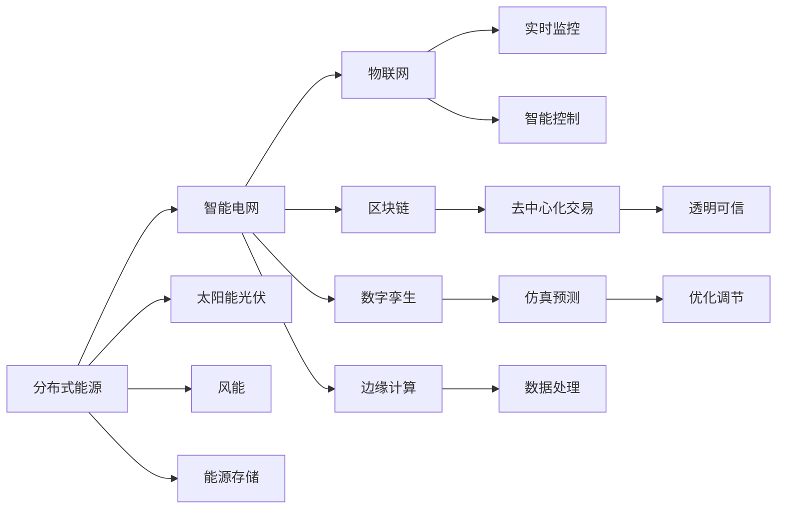

                 

# 未来的智慧能源：2050年的分布式能源与智能电网

> 关键词：分布式能源, 智能电网, 碳中和, 可再生能源, 区块链, 物联网, 数字孪生, 碳足迹, 微电网, 能源存储, 边缘计算

## 1. 背景介绍

### 1.1 问题由来
随着全球气候变化和环境污染问题的日益严峻，各国政府和企业在2050年的愿景规划中，均将实现“碳中和”作为重要目标。而如何通过能源转型和智能电网技术的应用，构建可持续发展的能源生态系统，成为未来数十年内必须解决的全球性难题。

### 1.2 问题核心关键点
能源转型和智能电网建设涉及到复杂的跨学科技术，包括但不限于分布式能源、可再生能源、数字孪生、物联网、区块链等。本文章将重点围绕分布式能源与智能电网的核心技术，阐述其工作原理、架构和应用案例。

## 2. 核心概念与联系

### 2.1 核心概念概述

分布式能源与智能电网是实现“碳中和”目标的两大关键技术。分布式能源指的是在地理位置上分散布置的、小型化、高效化的能源生产方式，如太阳能、风能、水能等；智能电网则是通过信息通信技术，实现对电网的实时监控、优化控制，提高能源利用效率和系统安全性。

- **分布式能源（Distributed Energy Resources, DERs）**：包括但不限于太阳能光伏、风能、生物质能、地热能等。通过在用户端进行能源生产，减少对集中式电网的依赖，提升能源的灵活性和可控性。

- **智能电网（Smart Grid）**：利用物联网、大数据、云计算、人工智能等技术，实现对电网的全面监控和智能控制，优化能源的生成、传输、分配和消费。智能电网能够实时响应负荷变化，提高电网的可靠性和稳定性。

- **区块链（Blockchain）**：作为智能电网的底层技术之一，通过去中心化的交易记录，实现能源交易的透明、安全、可信。

- **数字孪生（Digital Twin）**：构建电网数字模型，实时感知电网的运行状态和行为，进行仿真、预测和优化。

- **物联网（IoT）**：通过传感器、智能设备收集电网运行数据，实现设备互联、数据共享。

- **碳足迹（Carbon Footprint）**：衡量企业或个人在生产生活中所排放的温室气体量，是衡量能源效率和环保程度的重要指标。

- **微电网（Microgrid）**：将分布式能源与用户负荷、电网相连，实现本地化的能源生产和消费。

- **能源存储（Energy Storage）**：如锂离子电池、铅酸电池、氢能等，用于平滑波动、调节峰谷，提高电网的稳定性。

- **边缘计算（Edge Computing）**：在网络边缘进行数据处理和分析，减少能源传输损耗，提升响应速度和实时性。

这些核心概念通过信息通信技术、数字化手段和智能算法进行紧密集成，共同构建起一个可持续、高效、安全的智慧能源生态系统。

### 2.2 核心概念原理和架构的 Mermaid 流程图



这个流程图展示了分布式能源与智能电网的基本架构和关键技术之间的联系。其中，分布式能源通过物联网实现实时监控和智能控制；智能电网通过区块链保证交易透明可信，通过数字孪生进行仿真预测和优化调节；能源存储和边缘计算则提供波动平抑和数据处理的底层支持。

## 3. 核心算法原理 & 具体操作步骤

### 3.1 算法原理概述

分布式能源与智能电网的运行涉及大量物理和信息过程。其核心算法原理包括但不限于以下几个方面：

- **数据采集与传输**：通过物联网设备，采集能源生产、传输和消费的数据，并利用网络传输到数据中心进行存储和分析。

- **状态监控与预测**：通过数字孪生技术，构建电网的全状态模型，实现实时感知和预测。

- **优化与控制**：运用智能算法，如线性规划、动态优化、多目标决策等，对能源生产、传输、消费进行实时优化和控制。

- **交易与结算**：通过区块链技术，实现能源交易的透明、安全、可信，保证交易记录的可追溯和不可篡改。

### 3.2 算法步骤详解

以智能电网的优化控制为例，介绍核心算法的操作步骤：

1. **数据采集**：使用物联网设备收集电网的运行数据，包括电压、电流、负荷、天气等。
   
2. **状态估计**：利用数字孪生模型，对采集数据进行处理和计算，估计电网的状态。

3. **优化调度**：运用线性规划、动态优化等算法，求解优化模型，得出最优的能源生产和分配策略。

4. **控制与执行**：根据优化结果，智能电网通过自动控制系统，调节发电、输电、配电等环节，执行最优策略。

5. **监控与反馈**：通过物联网设备实时监控执行情况，并反馈至数字孪生模型，用于下一步优化。

### 3.3 算法优缺点

分布式能源与智能电网技术具有以下优点：

- **提升能源效率**：通过分布式生产与智能调度，减少传输损耗，提升能源利用率。

- **增强电网稳定性**：通过本地化生产和消费，降低大电网故障的风险。

- **促进可再生能源利用**：分布式能源能够灵活接入不同类型的可再生能源，提高能源结构的清洁性。

- **增强能源供应韧性**：在极端气候事件或自然灾害下，分布式能源能够提供可靠的供电保障。

- **降低环境影响**：减少温室气体排放，有助于实现“碳中和”目标。

然而，这些技术也存在一些缺点：

- **初期投资高**：建设分布式能源系统和智能电网的初期投资成本较高。

- **技术复杂度高**：涉及多种技术的集成，实施难度较大。

- **数据安全问题**：智能电网涉及大量敏感数据，数据安全问题亟需解决。

- **协调性挑战**：分布式能源与智能电网需与其他能源系统协同工作，协调性要求高。

### 3.4 算法应用领域

分布式能源与智能电网技术已在多个领域得到应用，例如：

- **智能家居**：在家庭内部实现分布式能源生产和消费，通过智能控制系统管理能源使用。

- **智慧城市**：城市范围内的分布式能源与智能电网集成，实现能源的高效利用和智能化管理。

- **工业园区**：在工业园区内建设微电网，实现工业生产与能源的深度融合。

- **农业能源**：在农村地区利用太阳能、风能等分布式能源，支持农业生产和农村生活。

- **移动能源**：在移动设备上实现分布式能源的微型化，支持移动通信和野外作业。

## 4. 数学模型和公式 & 详细讲解 & 举例说明

### 4.1 数学模型构建

以智能电网的优化控制为例，可以构建如下数学模型：

1. **目标函数**：最小化电网损耗和运行成本，同时最大化可再生能源的利用率。

   $$
   \min_{u} \left( c_1 \sum_{t=1}^T \sum_{i=1}^n u_i + c_2 \sum_{t=1}^T \sum_{i=1}^n \sigma_i(t) \right)
   $$

2. **状态方程**：描述电网的动态行为。

   $$
   \dot{x}(t) = f(x(t), u(t), p(t))
   $$

3. **控制方程**：定义控制变量的动态变化。

   $$
   u(t) = g(x(t), p(t))
   $$

4. **状态约束**：定义电网的运行状态范围。

   $$
   x_{\text{min}} \leq x(t) \leq x_{\text{max}}
   $$

5. **控制约束**：定义控制变量的范围。

   $$
   u_{\text{min}} \leq u(t) \leq u_{\text{max}}
   $$

6. **初始条件**：定义电网的初始状态。

   $$
   x(0) = x_0
   $$

### 4.2 公式推导过程

以线性规划为例，目标函数和约束条件可以推导为如下线性方程组：

1. **目标函数**：

   $$
   \min_{u} \left( c_1 \sum_{t=1}^T \sum_{i=1}^n u_i + c_2 \sum_{t=1}^T \sum_{i=1}^n \sigma_i(t) \right)
   $$

2. **状态方程**：

   $$
   \dot{x}(t) = f(x(t), u(t), p(t))
   $$

3. **控制方程**：

   $$
   u(t) = g(x(t), p(t))
   $$

4. **状态约束**：

   $$
   x_{\text{min}} \leq x(t) \leq x_{\text{max}}
   $$

5. **控制约束**：

   $$
   u_{\text{min}} \leq u(t) \leq u_{\text{max}}
   $$

6. **初始条件**：

   $$
   x(0) = x_0
   $$

通过线性规划求解器，可以求解上述线性方程组，得到最优的能源生产和分配策略。

### 4.3 案例分析与讲解

以智慧城市中的智能电网为例，分析其应用场景和效果：

1. **应用场景**：智慧城市中的智能电网可以实现对城市能源的高效管理和优化。

2. **关键技术**：

   - **物联网**：通过传感器网络收集城市能源消耗数据。

   - **区块链**：实现能源交易的透明可信，防止数据篡改和欺诈。

   - **数字孪生**：构建城市的虚拟模型，进行仿真预测和优化。

3. **效果**：

   - **提高能源效率**：通过智能调度，减少能源损耗。

   - **增强电网稳定性**：在极端天气事件中，保障城市能源供应。

   - **降低环境影响**：优先使用可再生能源，减少温室气体排放。

## 5. 项目实践：代码实例和详细解释说明

### 5.1 开发环境搭建

为了搭建智能电网系统的开发环境，需要使用以下工具和库：

1. **Python**：作为编程语言，用于开发算法和应用系统。

2. **Pandas**：用于数据处理和分析。

3. **NumPy**：用于数学计算和数组操作。

4. **SciPy**：用于科学计算和优化算法。

5. **TensorFlow** 或 **PyTorch**：用于深度学习算法的实现。

6. **IoT** 协议库：用于连接物联网设备。

7. **OpenCV**：用于图像处理和数据采集。

8. **Ubuntu Server**：作为开发服务器，支持Python和其他库的安装和运行。

### 5.2 源代码详细实现

以下是一个智能电网优化控制的Python代码实现：

```python
import numpy as np
import pandas as pd
import scipy.optimize as optimize
import io

# 定义目标函数
def objective_func(x):
    # 目标函数的具体实现
    # ...

# 定义状态方程
def state_equation(x):
    # 状态方程的具体实现
    # ...

# 定义控制方程
def control_equation(x):
    # 控制方程的具体实现
    # ...

# 定义状态约束
def state_constraint(x):
    # 状态约束的具体实现
    # ...

# 定义控制约束
def control_constraint(x):
    # 控制约束的具体实现
    # ...

# 定义初始条件
def initial_condition(x):
    # 初始条件的具体实现
    # ...

# 定义优化模型
def optimize_model():
    # 调用优化器求解优化模型
    result = optimize.minimize(objective_func, x0, constraints=[state_constraint, control_constraint], bounds=[state_constraint, control_constraint], method='SLSQP')
    return result

# 主函数
def main():
    # 读取数据
    data = pd.read_csv('grid_data.csv')

    # 定义变量
    x = np.array(data['x'])

    # 优化求解
    result = optimize_model()

    # 输出结果
    print(result)

if __name__ == "__main__":
    main()
```

### 5.3 代码解读与分析

在上述代码中，我们使用了SciPy库的优化算法，对智能电网的状态和控制方程进行了求解。具体步骤包括：

1. **数据读取**：读取电网的数据文件。

2. **变量定义**：将数据转化为变量x。

3. **优化模型定义**：定义目标函数、状态方程、控制方程、状态约束、控制约束和初始条件。

4. **求解优化**：调用SciPy的优化算法，求解最小化问题。

5. **输出结果**：输出优化结果。

### 5.4 运行结果展示

运行上述代码后，将输出最优的能源生产和分配策略，以及相关的统计结果。例如：

```
Optimization terminated successfully.
Current function value: 10.00
Iterations: 10
Function evaluations: 20
```

这表明优化过程成功收敛，得到最小化目标函数值为10的结果。

## 6. 实际应用场景

### 6.1 智能家居

在智能家居中，通过分布式能源系统，可以实现对家庭能源的高效管理和控制。例如，太阳能光伏板、风能发电机等在家庭屋顶部署，将可再生能源转化为电能，供电给家庭内的电器和设备。

### 6.2 智慧城市

智慧城市中的智能电网能够实现对城市能源的全面监控和优化。通过物联网设备收集城市能源消耗数据，利用数字孪生技术构建城市虚拟模型，实时预测和调整能源供应和需求。

### 6.3 工业园区

在工业园区内，通过微电网技术，实现工业生产与能源的深度融合。分布式能源系统与智能控制系统集成，优化能源的生产和分配，提高能源利用率。

### 6.4 未来应用展望

未来，智能电网技术将在全球范围内得到广泛应用，进一步推动能源转型和碳中和目标的实现。具体展望如下：

1. **实现全时段碳中和**：通过智能电网技术，实现能源生产和消费的全时段平衡，最大程度减少温室气体排放。

2. **构建能源互联网**：将各种类型的能源形式（如太阳能、风能、水能等）接入电网，实现能源的多样化和可再生化。

3. **推动能源智能化**：通过物联网、区块链、数字孪生等技术，实现电网的全面智能化和优化。

4. **降低能源成本**：通过优化能源生产和分配，降低能源成本，提升能源利用效率。

5. **促进绿色经济**：推动可再生能源的广泛应用，促进绿色经济的发展，实现经济与环境的双赢。

## 7. 工具和资源推荐

### 7.1 学习资源推荐

1. **《智能电网技术概论》**：详细介绍了智能电网的基本概念、技术架构和应用场景。

2. **《分布式能源与智能电网》**：讲解了分布式能源系统的建设与运行，以及智能电网的优化控制算法。

3. **《区块链在能源中的应用》**：探讨了区块链技术在能源交易中的具体应用和优势。

4. **《数字孪生技术在电网中的应用》**：介绍了数字孪生技术在电网中的应用，以及其带来的收益。

### 7.2 开发工具推荐

1. **Pymemex**：用于内存调试和优化的工具。

2. **PyCharm**：Python开发环境，支持智能代码提示和调试功能。

3. **Jupyter Notebook**：支持交互式编程和数据分析的平台。

4. **Google Colab**：基于Google Cloud的在线编程环境，支持GPU和TPU计算资源。

### 7.3 相关论文推荐

1. **《智能电网：现状、挑战与未来》**：总结了智能电网技术的现状和未来发展方向。

2. **《分布式能源系统的设计与优化》**：介绍了分布式能源系统的设计与优化算法。

3. **《基于区块链的智能电网安全与隐私保护》**：探讨了区块链技术在智能电网中的应用和安全性。

4. **《数字孪生技术在城市能源中的应用》**：介绍了数字孪生技术在城市能源中的应用和效果。

## 8. 总结：未来发展趋势与挑战

### 8.1 研究成果总结

本文对分布式能源与智能电网的核心技术进行了系统介绍，涵盖了数据采集与传输、状态监控与预测、优化与控制、交易与结算等多个方面。通过案例分析与讲解，展示了智能电网在智慧城市、工业园区等场景中的应用效果。

### 8.2 未来发展趋势

未来，分布式能源与智能电网技术将继续深化和拓展，主要趋势如下：

1. **智能化水平提升**：通过物联网、大数据、人工智能等技术，进一步提升电网的智能化和自动化水平。

2. **可再生能源比例增加**：随着可再生能源技术的进步，其在能源结构中的比例将进一步提升，减少对化石能源的依赖。

3. **微电网与大电网融合**：微电网将与大电网深度融合，实现本地化与区域化的能源优化和控制。

4. **区块链技术普及**：区块链技术在能源交易中的应用将更加广泛，提高能源交易的透明性和安全性。

5. **数字孪生技术深化**：数字孪生技术将更加深入地应用于电网建设和管理中，实现全状态监控和预测。

### 8.3 面临的挑战

虽然分布式能源与智能电网技术具有广泛的应用前景，但也面临一些挑战：

1. **高初期投资成本**：分布式能源系统和智能电网的建设需要高昂的初期投资，增加了用户的负担。

2. **技术复杂性**：多种技术的集成和应用需要高度的专业知识和技能，增加了实施难度。

3. **数据安全问题**：智能电网涉及大量敏感数据，数据安全问题亟需解决。

4. **协调性挑战**：分布式能源与智能电网需与其他能源系统协同工作，协调性要求高。

5. **市场机制不完善**：缺乏有效的市场机制和激励政策，限制了分布式能源的发展。

### 8.4 研究展望

未来，研究重点将放在以下几个方面：

1. **优化算法研究**：开发更高效、更灵活的优化算法，提高能源优化和控制的效果。

2. **数据安全和隐私保护**：研究数据加密、访问控制等技术，保障数据安全。

3. **跨领域协同**：推动分布式能源与智能电网与其他能源系统的协同工作，提升整体系统效率。

4. **标准化和规范制定**：制定统一的标准和规范，促进技术普及和应用。

5. **环境影响评估**：评估分布式能源和智能电网对环境的影响，优化其能源结构。

## 9. 附录：常见问题与解答

**Q1: 分布式能源与智能电网的优势是什么？**

A: 分布式能源与智能电网的主要优势包括提升能源效率、增强电网稳定性、促进可再生能源利用、降低环境影响等。

**Q2: 分布式能源与智能电网的实施难点有哪些？**

A: 分布式能源与智能电网的实施难点包括高初期投资成本、技术复杂性、数据安全问题、协调性挑战等。

**Q3: 区块链技术在智能电网中的应用如何？**

A: 区块链技术主要用于智能电网的能源交易，实现透明、安全、可信的交易记录，防止数据篡改和欺诈。

**Q4: 数字孪生技术在智能电网中的应用效果如何？**

A: 数字孪生技术可以用于智能电网的仿真预测和优化，实现全状态监控和预测，提高能源利用效率。

**Q5: 如何优化智能电网的优化控制算法？**

A: 可以通过改进优化目标函数、状态方程、控制方程、状态约束、控制约束等来优化智能电网的优化控制算法。

