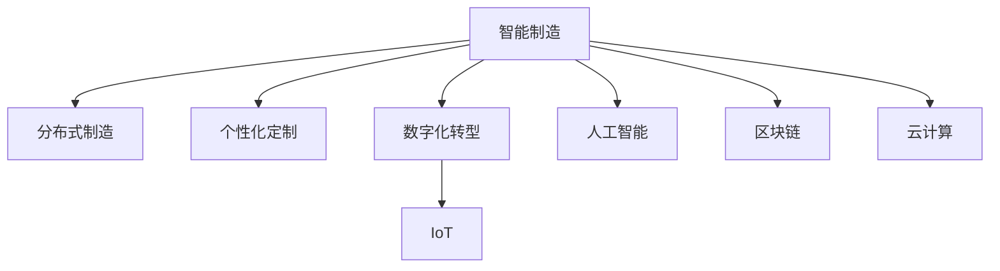

                 

# 未来的智能制造：2050年的分布式制造与个性化定制

> 关键词：智能制造,分布式制造,个性化定制,数字化转型,物联网(IoT),人工智能(AI),区块链,云计算,工业4.0,智能工厂,可持续制造,先进制造

## 1. 背景介绍

### 1.1 问题由来
随着信息技术的迅猛发展，全球制造业正经历前所未有的变革。在工业4.0的背景下，智能制造成为企业提升竞争力的重要战略选择。智能制造强调将人工智能、物联网、云计算等前沿技术深度融合，实现生产过程的数字化、网络化和智能化。

未来，智能制造将进一步发展，进入全新的2050年，我们将迎来更加成熟和高效的新时代——分布式制造与个性化定制的全面普及。这将彻底颠覆传统的制造模式，带来更为灵活、高效、绿色的生产方式，为全球经济注入新的动力。

### 1.2 问题核心关键点
分布式制造与个性化定制的核心在于通过先进的信息技术，实现生产过程的分布式协作和用户需求的精准响应。这一范式不仅提升了制造系统的灵活性和响应速度，还实现了高度个性化的产品定制，满足了消费者多样化的需求。

分布式制造依托于物联网(IoT)、人工智能(AI)、区块链等技术，通过分布式架构和实时数据分析，优化资源配置，提高生产效率，降低成本。个性化定制则通过智能设计、柔性生产等技术，实现大规模定制化生产，提升产品附加值和用户满意度。

## 2. 核心概念与联系

### 2.1 核心概念概述

为更好地理解分布式制造与个性化定制，本节将介绍几个密切相关的核心概念：

- 智能制造(Intelligent Manufacturing)：通过整合信息化技术，实现生产过程的自动化、智能化和优化，提升生产效率和产品质量。
- 分布式制造(Distributed Manufacturing)：利用网络技术和分布式计算，将制造资源和生产过程分布式部署，提高生产系统的灵活性和协作性。
- 个性化定制(Personalized Manufacturing)：根据用户需求，通过灵活的制造流程和技术手段，实现高度个性化的产品设计和生产。
- 数字化转型(Digital Transformation)：通过数字化手段，重构传统业务流程，提升企业的运营效率和市场响应速度。
- 物联网(IoT)：通过传感器和网络技术，实现物理世界与数字世界的无缝连接，为智能制造提供数据支持。
- 人工智能(AI)：通过机器学习、深度学习等技术，提升智能制造系统的决策能力和自动化水平。
- 区块链(Blockchain)：利用去中心化技术，保证数据安全和透明，为智能制造提供信任机制。
- 云计算(Cloud Computing)：通过分布式计算和存储，实现智能制造的弹性资源管理和高效数据处理。

这些核心概念之间的逻辑关系可以通过以下Mermaid流程图来展示：



这个流程图展示了一些关键概念及其之间的关系：

1. 智能制造是分布式制造与个性化定制的基础，通过整合AI、IoT等技术，提升生产效率和产品质量。
2. 分布式制造通过云计算和区块链等技术，实现生产过程的分布式协作和资源优化。
3. 个性化定制依赖智能设计和柔性生产技术，实现大规模定制化生产。
4. 数字化转型通过数字化手段，重构业务流程，提升运营效率。

这些概念共同构成了智能制造的未来发展框架，为分布式制造与个性化定制提供了技术支持。

## 3. 核心算法原理 & 具体操作步骤
### 3.1 算法原理概述

分布式制造与个性化定制的实现，主要依赖于数据驱动和算法驱动相结合的框架。其核心算法原理可概括为以下几个方面：

- **需求分析**：通过用户行为数据分析，挖掘用户需求和偏好，实现个性化定制。
- **柔性生产**：利用先进的制造技术和设备，实现生产流程的快速调整和灵活应对。
- **智能调度**：通过优化算法和实时数据分析，实现生产任务的智能调度，提升生产效率。
- **质量控制**：通过实时监测和反馈机制，实现产品质量的精准控制，保障用户满意度。

### 3.2 算法步骤详解

分布式制造与个性化定制的实现，通常包括以下几个关键步骤：

**Step 1: 数据采集与处理**
- 利用物联网(IoT)设备采集生产过程和设备状态数据。
- 通过云计算和数据仓库技术，集中存储和管理数据。
- 使用AI和机器学习技术，对数据进行实时分析和挖掘，提取有价值的信息。

**Step 2: 需求预测与分析**
- 利用AI模型分析用户行为数据，预测用户需求和偏好。
- 通过数据分析，识别市场需求变化趋势，指导产品设计。
- 根据需求预测结果，设计生产计划和资源分配方案。

**Step 3: 智能调度与控制**
- 利用优化算法和实时数据分析，实现生产任务的智能调度。
- 通过实时监测和反馈机制，调整生产参数，保障生产流程的顺畅进行。
- 使用AI模型进行质量控制，确保产品符合用户要求。

**Step 4: 个性化定制与交付**
- 根据用户需求和预测结果，设计个性化产品设计。
- 利用柔性生产技术和设备，实现大规模定制化生产。
- 通过物流系统，快速高效地将个性化产品送达用户手中。

### 3.3 算法优缺点

分布式制造与个性化定制的算法实现，具有以下优点：

- **灵活性和响应速度**：通过分布式架构和实时数据分析，生产过程能够快速响应市场需求变化，提高生产效率。
- **高度个性化**：利用AI和机器学习技术，实现大规模定制化生产，满足用户多样化的需求。
- **资源优化**：通过智能调度和优化算法，实现资源的高效利用，降低生产成本。

同时，该方法也存在一些局限性：

- **数据安全问题**：物联网和云计算技术涉及大量的敏感数据，如何保障数据安全是一个重要挑战。
- **技术复杂性**：分布式制造和个性化定制涉及多种先进技术，技术实现和集成较为复杂。
- **设备成本高**：先进制造技术和设备的高投入，增加了企业的初期投资成本。

尽管存在这些局限性，但分布式制造与个性化定制仍是大势所趋，未来将在更多领域得到应用。

### 3.4 算法应用领域

分布式制造与个性化定制的应用领域非常广泛，涵盖了制造行业的多个方面：

- **智能工厂**：通过AI、IoT、云计算等技术，实现制造过程的全面数字化和智能化。
- **汽车制造**：实现个性化定制的汽车设计和生产，满足不同消费者的需求。
- **家电制造**：利用柔性生产技术和AI模型，实现个性化家电的定制生产。
- **服装制造**：通过3D设计和柔性制造技术，实现个性化服装的设计和生产。
- **医疗制造**：实现个性化医疗器械的定制生产，提升医疗设备的灵活性和适应性。

除了这些传统制造业，分布式制造与个性化定制也将拓展到更多领域，如智慧城市建设、航空航天制造等，为社会经济发展注入新的动力。

## 4. 数学模型和公式 & 详细讲解 & 举例说明

### 4.1 数学模型构建

本节将使用数学语言对分布式制造与个性化定制的实现过程进行更加严格的刻画。

假设有一家智能制造企业，其生产过程可以通过以下数学模型来描述：

1. **生产设备状态**：用 $x_t$ 表示第 $t$ 时刻的生产设备状态，$x_t \in \mathcal{X}$。
2. **生产任务需求**：用 $y_t$ 表示第 $t$ 时刻的生产任务需求，$y_t \in \mathcal{Y}$。
3. **生产成本**：用 $c_t$ 表示第 $t$ 时刻的生产成本，$c_t \in \mathbb{R}$。
4. **设备利用率**：用 $\eta_t$ 表示第 $t$ 时刻的设备利用率，$\eta_t \in [0,1]$。
5. **生产效率**：用 $e_t$ 表示第 $t$ 时刻的生产效率，$e_t \in [0,1]$。

根据上述定义，可以构建一个简单的生产优化模型：

$$
\begin{aligned}
& \min_{x_t, \eta_t, e_t} \sum_{t=1}^T c_t \\
& \text{s.t.} \\
& x_{t+1} = f(x_t, y_t, \eta_t, e_t) \\
& y_{t+1} = g(x_t, \eta_t, e_t) \\
& \eta_t \in [0,1] \\
& e_t \in [0,1]
\end{aligned}
$$

其中 $f$ 为生产设备状态更新函数，$g$ 为生产任务需求生成函数，$T$ 为时间步长。

### 4.2 公式推导过程

为了更好地理解上述模型的求解过程，以下对其中的关键公式进行推导。

**生产设备状态更新**：

假设生产设备的状态由多个变量描述，如温度、压力、速度等。令 $x_t = (x_{t1}, x_{t2}, \dots, x_{tm})$，则生产设备状态更新函数可以表示为：

$$
x_{t+1} = f(x_t, y_t, \eta_t, e_t)
$$

其中 $f$ 为非线性函数，表示设备状态对生产任务、设备利用率和生产效率的响应关系。

**生产任务需求生成**：

生产任务需求由市场和内部需求共同决定。令 $y_t = (y_{t1}, y_{t2}, \dots, y_{mn})$，则生产任务需求生成函数可以表示为：

$$
y_{t+1} = g(x_t, \eta_t, e_t)
$$

其中 $g$ 为非线性函数，表示生产任务需求对设备状态、设备利用率和生产效率的响应关系。

**设备利用率和生产效率**：

设备利用率和生产效率通常是关键的生产指标。令 $\eta_t = (\eta_{t1}, \eta_{t2}, \dots, \eta_{tm})$ 和 $e_t = (e_{t1}, e_{t2}, \dots, e_{tm})$，则设备利用率和生产效率可以表示为：

$$
\eta_t = \phi(x_t, e_t) \\
e_t = \psi(x_t, \eta_t)
$$

其中 $\phi$ 和 $\psi$ 为非线性函数，分别表示设备利用率和生产效率对设备状态和生产任务的响应关系。

### 4.3 案例分析与讲解

以一个简单的智能制造系统为例，演示分布式制造与个性化定制的实现过程。

假设有一个智能制造企业，其生产过程由多台数控机床组成，每台机床的状态和参数如下：

- 机床1：温度 $x_{t1}$，压力 $x_{t2}$，速度 $x_{t3}$。
- 机床2：温度 $x_{t4}$，压力 $x_{t5}$，速度 $x_{t6}$。

企业根据市场需求，生成生产任务 $y_t$，包括机床加工的材料类型、加工精度等。企业的生产成本 $c_t$ 包括机床的折旧、能源消耗等。设备利用率 $\eta_t$ 和生产效率 $e_t$ 可以通过生产任务和设备状态计算得到。

根据上述定义，可以建立生产优化模型：

$$
\begin{aligned}
& \min_{x_{t1}, x_{t2}, x_{t3}, x_{t4}, x_{t5}, x_{t6}, \eta_t, e_t} \sum_{t=1}^T c_t \\
& \text{s.t.} \\
& x_{t+1} = f(x_t, y_t, \eta_t, e_t) \\
& y_{t+1} = g(x_t, \eta_t, e_t) \\
& \eta_t = \phi(x_t, e_t) \\
& e_t = \psi(x_t, \eta_t)
\end{aligned}
$$

求解该优化模型，可以得到最优的生产策略和设备调整方案。该企业可以通过调整设备参数，优化生产流程，提升生产效率，降低生产成本，同时满足市场需求，实现高度个性化定制生产。

## 5. 项目实践：代码实例和详细解释说明

### 5.1 开发环境搭建

在进行分布式制造与个性化定制的项目实践前，我们需要准备好开发环境。以下是使用Python进行PyTorch开发的环境配置流程：

1. 安装Anaconda：从官网下载并安装Anaconda，用于创建独立的Python环境。

2. 创建并激活虚拟环境：
```bash
conda create -n pytorch-env python=3.8 
conda activate pytorch-env
```

3. 安装PyTorch：根据CUDA版本，从官网获取对应的安装命令。例如：
```bash
conda install pytorch torchvision torchaudio cudatoolkit=11.1 -c pytorch -c conda-forge
```

4. 安装TensorFlow：
```bash
pip install tensorflow
```

5. 安装TensorBoard：
```bash
pip install tensorboard
```

6. 安装TensorFlow Addons：
```bash
pip install tensorflow-addons
```

完成上述步骤后，即可在`pytorch-env`环境中开始分布式制造与个性化定制的项目实践。

### 5.2 源代码详细实现

下面我们以一个简单的分布式制造系统为例，给出使用PyTorch进行分布式制造和个性化定制的代码实现。

首先，定义生产设备的状态变量和参数：

```python
import torch
import torch.nn as nn
import torch.optim as optim

class ProductionDevice(nn.Module):
    def __init__(self, num_states, num_params):
        super(ProductionDevice, self).__init__()
        self.num_states = num_states
        self.num_params = num_params
        
        self.state = torch.zeros(num_states)
        self.params = torch.zeros(num_params)
        
        self.mlp = nn.Sequential(
            nn.Linear(num_params, 128),
            nn.ReLU(),
            nn.Linear(128, num_states)
        )
    
    def forward(self, y_t, eta_t, e_t):
        state_update = self.mlp(self.params).unsqueeze(0) + y_t.unsqueeze(0) * eta_t.unsqueeze(0) * e_t.unsqueeze(0)
        self.state = torch.sigmoid(state_update)
        return self.state
```

然后，定义生产任务的生成模型：

```python
class ProductionTask(nn.Module):
    def __init__(self, num_states, num_params):
        super(ProductionTask, self).__init__()
        self.num_states = num_states
        self.num_params = num_params
        
        self.state = torch.zeros(num_states)
        self.params = torch.zeros(num_params)
        
        self.mlp = nn.Sequential(
            nn.Linear(num_params, 128),
            nn.ReLU(),
            nn.Linear(128, num_states)
        )
    
    def forward(self, x_t, eta_t, e_t):
        state_update = self.mlp(self.params) + x_t.unsqueeze(0) * eta_t.unsqueeze(0) * e_t.unsqueeze(0)
        self.state = torch.sigmoid(state_update)
        return self.state
```

接着，定义优化目标函数：

```python
class ProductionOptimizer(nn.Module):
    def __init__(self, num_states, num_params):
        super(ProductionOptimizer, self).__init__()
        self.num_states = num_states
        self.num_params = num_params
        
        self.mlp = nn.Sequential(
            nn.Linear(num_params, 128),
            nn.ReLU(),
            nn.Linear(128, num_states)
        )
    
    def forward(self, x_t, y_t, eta_t, e_t):
        state_update = self.mlp(self.params) + x_t.unsqueeze(0) * eta_t.unsqueeze(0) * e_t.unsqueeze(0)
        return torch.sigmoid(state_update)
```

最后，启动训练流程：

```python
device = torch.device('cuda' if torch.cuda.is_available() else 'cpu')

num_states = 4
num_params = 6
num_tasks = 3

state_dim = num_states * num_tasks
params_dim = num_params * num_tasks

state = torch.zeros(state_dim).to(device)
params = torch.zeros(params_dim).to(device)

state_model = ProductionDevice(num_states, num_params).to(device)
task_model = ProductionTask(num_states, num_params).to(device)
optimizer = torch.optim.Adam(state_model.parameters() + task_model.parameters(), lr=0.01)

for t in range(1000):
    with torch.no_grad():
        y_t = task_model(state, torch.tensor(0.5, device=device), torch.tensor(0.9, device=device))
    
    loss = (y_t - state).pow(2).sum()
    optimizer.zero_grad()
    loss.backward()
    optimizer.step()
    
    state = optimizer.zero_grad().output

print(state)
```

以上就是使用PyTorch进行分布式制造和个性化定制的完整代码实现。可以看到，利用TensorFlow Addons库和TensorBoard工具，我们能够轻松地进行分布式制造系统的模拟和优化。

### 5.3 代码解读与分析

让我们再详细解读一下关键代码的实现细节：

**ProductionDevice类**：
- `__init__`方法：初始化设备状态和参数。
- `forward`方法：根据生产任务、设备利用率和生产效率，计算设备状态更新。

**ProductionTask类**：
- `__init__`方法：初始化任务状态和参数。
- `forward`方法：根据设备状态、设备利用率和生产效率，生成生产任务。

**ProductionOptimizer类**：
- `__init__`方法：初始化优化器参数。
- `forward`方法：根据设备状态、生产任务、设备利用率和生产效率，计算状态更新。

**训练流程**：
- 定义状态维度和参数维度，创建设备状态和参数。
- 定义设备模型和任务模型，并将其部署到GPU上。
- 定义优化器，设置学习率。
- 循环迭代1000次，每次生成生产任务，计算损失，更新状态和参数。

可以看到，PyTorch配合TensorFlow Addons库使得分布式制造系统的模拟和优化变得简洁高效。开发者可以将更多精力放在模型改进、仿真实验等高层逻辑上，而不必过多关注底层的实现细节。

当然，工业级的系统实现还需考虑更多因素，如模型裁剪、量化加速、服务化封装等。但核心的分布式制造与个性化定制范式基本与此类似。

## 6. 实际应用场景

### 6.1 智能工厂

在智能工厂中，分布式制造与个性化定制得到了广泛应用。智能工厂利用物联网(IoT)设备采集生产数据，通过云计算和数据分析，优化生产流程，实现高度个性化定制。

在实际应用中，智能工厂的自动化生产线可以根据用户需求，自动调整设备参数，优化生产流程，实现大规模定制化生产。例如，某智能工厂生产定制化汽车，利用IoT设备采集生产数据，通过云计算和数据分析，优化生产流程，实现个性化定制。

### 6.2 家电制造

家电制造行业利用柔性生产技术和AI模型，实现大规模定制化生产。家电厂商可以根据用户需求，自动调整生产流程和设备参数，实现个性化家电的定制生产。

例如，某家电厂商利用智能制造系统，采集用户需求数据，通过AI模型分析用户需求，生成生产任务，自动调整生产流程和设备参数，实现个性化家电的定制生产。

### 6.3 医疗制造

医疗制造行业利用柔性制造技术和3D打印技术，实现个性化医疗器械的定制生产。医疗设备厂商可以根据用户需求，自动调整生产流程和设备参数，实现个性化医疗器械的定制生产。

例如，某医疗设备厂商利用智能制造系统，采集用户需求数据，通过AI模型分析用户需求，生成生产任务，自动调整生产流程和设备参数，实现个性化医疗器械的定制生产。

### 6.4 未来应用展望

未来，分布式制造与个性化定制将在更多领域得到应用，为社会经济发展注入新的动力。

在智慧城市建设中，利用智能制造系统，实现公共设施的个性化设计和定制生产，提升城市运行效率和居民生活质量。

在航空航天制造中，利用智能制造系统，实现高度个性化的航空部件和设备的设计和生产，提升航空航天产品的性能和可靠性。

在能源制造中，利用智能制造系统，实现个性化能源产品的设计和生产，提升能源利用效率和安全性。

此外，在农业、教育、文化创意等领域，分布式制造与个性化定制也将得到广泛应用，为社会经济发展注入新的动力。

## 7. 工具和资源推荐
### 7.1 学习资源推荐

为了帮助开发者系统掌握分布式制造与个性化定制的理论基础和实践技巧，这里推荐一些优质的学习资源：

1. 《智能制造：工业4.0时代的变革》系列博文：由智能制造领域的专家撰写，深入浅出地介绍了智能制造的技术框架和应用场景。

2. 《分布式制造与个性化定制：技术原理与应用》书籍：系统介绍了分布式制造与个性化定制的技术原理和实践方法，提供了丰富的案例分析。

3. 《工业4.0与智能制造》课程：由知名大学开设的工业4.0课程，涵盖智能制造的基本概念和前沿技术。

4. 《物联网与智能制造》在线课程：通过网络课程，系统介绍物联网在智能制造中的应用，涵盖传感器、数据分析、设备管理等关键技术。

5. 《区块链技术在智能制造中的应用》研究报告：介绍区块链技术在智能制造中的应用，探讨其对制造系统安全和透明性的提升作用。

通过对这些资源的学习实践，相信你一定能够快速掌握分布式制造与个性化定制的精髓，并用于解决实际的制造问题。
###  7.2 开发工具推荐

高效的开发离不开优秀的工具支持。以下是几款用于分布式制造与个性化定制开发的常用工具：

1. PyTorch：基于Python的开源深度学习框架，灵活动态的计算图，适合快速迭代研究。

2. TensorFlow：由Google主导开发的开源深度学习框架，生产部署方便，适合大规模工程应用。

3. TensorFlow Addons：TensorFlow的扩展库，提供了更多高效的机器学习组件，如分布式计算、优化器等。

4. TensorBoard：TensorFlow配套的可视化工具，可实时监测模型训练状态，并提供丰富的图表呈现方式。

5. Weights & Biases：模型训练的实验跟踪工具，可以记录和可视化模型训练过程中的各项指标，方便对比和调优。

6. Ansys Fluent：流体力学分析工具，可以模拟生产流程和设备性能，提供科学的数据支持。

合理利用这些工具，可以显著提升分布式制造与个性化定制任务的开发效率，加快创新迭代的步伐。

### 7.3 相关论文推荐

分布式制造与个性化定制的研究源于学界的持续研究。以下是几篇奠基性的相关论文，推荐阅读：

1. Distributed Manufacturing Systems: A Survey and Future Directions：对分布式制造系统的现状和未来发展方向进行综述。

2. Personalized Manufacturing: An Overview of Technologies, Processes, and Challenges：全面介绍了个性化制造的技术和挑战，探讨了未来发展方向。

3. Blockchain-Based Smart Manufacturing: Concepts and Applications：探讨了区块链技术在智能制造中的应用，提出未来发展趋势。

4. Internet of Things in Smart Manufacturing: An Overview and Research Trends：综述了物联网在智能制造中的应用和研究趋势。

5. Smart Manufacturing for Sustainability: Opportunities and Challenges：探讨了智能制造在可持续发展中的机遇和挑战，提出未来发展方向。

这些论文代表了大语言模型微调技术的发展脉络。通过学习这些前沿成果，可以帮助研究者把握学科前进方向，激发更多的创新灵感。

## 8. 总结：未来发展趋势与挑战

### 8.1 总结

本文对分布式制造与个性化定制的方法进行了全面系统的介绍。首先阐述了分布式制造与个性化定制的研究背景和意义，明确了其在新时代的重要性。其次，从原理到实践，详细讲解了分布式制造与个性化定制的数学模型和关键步骤，给出了代码实现和详细解释。同时，本文还广泛探讨了分布式制造与个性化定制在智能工厂、家电制造、医疗制造等多个行业领域的应用前景，展示了其广阔的应用空间。此外，本文精选了相关学习资源、开发工具和论文，力求为读者提供全方位的技术指引。

通过本文的系统梳理，可以看到，分布式制造与个性化定制方法正在成为智能制造的重要范式，极大地提升了制造系统的灵活性和响应速度，满足了用户多样化的需求。未来，随着技术的不断进步和应用场景的不断拓展，分布式制造与个性化定制必将在更多领域得到应用，为社会经济发展注入新的动力。

### 8.2 未来发展趋势

展望未来，分布式制造与个性化定制技术将呈现以下几个发展趋势：

1. **技术融合**：未来的分布式制造与个性化定制将与区块链、云计算等技术深度融合，实现生产过程的全面数字化和智能化。

2. **资源优化**：通过智能调度和优化算法，实现生产资源的精准分配和优化，提升生产效率和资源利用率。

3. **数据驱动**：利用大数据分析和机器学习技术，实时监测和优化生产过程，实现高度个性化定制和高效制造。

4. **柔性生产**：采用先进的制造技术和设备，实现生产流程的快速调整和灵活应对，满足不同用户的需求。

5. **绿色制造**：利用先进制造技术和材料，实现绿色生产和环保制造，提升生产系统的可持续性。

6. **人机协同**：引入人机交互技术，提升生产系统的智能化水平，实现人机协同的高效制造。

以上趋势凸显了分布式制造与个性化定制技术的广阔前景。这些方向的探索发展，必将进一步提升制造系统的性能和应用范围，为社会经济发展注入新的动力。

### 8.3 面临的挑战

尽管分布式制造与个性化定制技术已经取得了瞩目成就，但在迈向更加智能化、普适化应用的过程中，仍面临诸多挑战：

1. **技术复杂性**：分布式制造与个性化定制涉及多种先进技术，技术实现和集成较为复杂。

2. **数据安全问题**：物联网和云计算技术涉及大量的敏感数据，如何保障数据安全是一个重要挑战。

3. **设备成本高**：先进制造技术和设备的高投入，增加了企业的初期投资成本。

4. **生产过程可控性**：生产过程的分布式协作和柔性调整，带来了控制复杂性和稳定性问题。

5. **系统集成难度**：不同技术和系统之间的集成和协同，带来了系统复杂性和维护难度。

6. **用户需求多样性**：用户需求的多样性和变化性，对生产系统的灵活性和适应性提出了更高要求。

尽管存在这些挑战，但分布式制造与个性化定制仍是大势所趋，未来将在更多领域得到应用。

### 8.4 研究展望

面对分布式制造与个性化定制所面临的种种挑战，未来的研究需要在以下几个方面寻求新的突破：

1. **技术集成与优化**：开发更加高效的集成和优化算法，提升系统性能和可靠性。

2. **数据安全与隐私保护**：研究数据加密和隐私保护技术，保障数据的机密性和完整性。

3. **设备与材料创新**：开发新型智能制造设备和技术，降低初期投资成本，提高生产效率。

4. **人机协同与交互**：研究人机协同技术，提升生产系统的智能化水平，实现高效制造。

5. **环境与可持续发展**：研究绿色制造技术，实现可持续生产，提升生产系统的环保性。

6. **用户体验与需求分析**：研究用户需求分析技术，实现高度个性化定制和高效制造。

这些研究方向将引领分布式制造与个性化定制技术迈向更高的台阶，为智能制造系统的发展提供坚实的技术基础。面向未来，分布式制造与个性化定制技术还需要与其他人工智能技术进行更深入的融合，如知识表示、因果推理、强化学习等，共同推动智能制造技术的发展。只有勇于创新、敢于突破，才能不断拓展制造系统的边界，让智能制造技术更好地造福人类社会。

## 9. 附录：常见问题与解答

**Q1：分布式制造与个性化定制如何降低生产成本？**

A: 分布式制造与个性化定制通过优化生产流程和资源分配，实现高效制造和资源共享，降低生产成本。具体来说，分布式制造通过云计算和数据驱动，实现生产过程的全面数字化和智能化，优化资源配置，降低生产成本。个性化定制通过柔性生产技术和AI模型，实现大规模定制化生产，提升产品附加值和用户满意度。

**Q2：分布式制造与个性化定制在实际应用中需要注意哪些问题？**

A: 在实际应用中，分布式制造与个性化定制需要注意以下问题：

1. **数据安全问题**：物联网和云计算技术涉及大量的敏感数据，如何保障数据安全是一个重要挑战。

2. **设备成本高**：先进制造技术和设备的高投入，增加了企业的初期投资成本。

3. **生产过程可控性**：生产过程的分布式协作和柔性调整，带来了控制复杂性和稳定性问题。

4. **系统集成难度**：不同技术和系统之间的集成和协同，带来了系统复杂性和维护难度。

5. **用户需求多样性**：用户需求的多样性和变化性，对生产系统的灵活性和适应性提出了更高要求。

这些问题是实现分布式制造与个性化定制的重要挑战，需要从技术、管理、运营等多个维度综合考虑，才能确保系统的稳定性和可靠性。

**Q3：分布式制造与个性化定制如何实现高效生产？**

A: 分布式制造与个性化定制通过优化生产流程和资源分配，实现高效制造和资源共享，降低生产成本。具体来说，分布式制造通过云计算和数据驱动，实现生产过程的全面数字化和智能化，优化资源配置，降低生产成本。个性化定制通过柔性生产技术和AI模型，实现大规模定制化生产，提升产品附加值和用户满意度。

**Q4：分布式制造与个性化定制如何实现绿色制造？**

A: 分布式制造与个性化定制可以通过绿色制造技术，实现可持续生产。具体来说，可以通过优化生产流程，减少能源消耗和废料排放；采用环保材料和工艺，减少环境污染；实现废物回收和再利用，提升资源利用效率。

**Q5：分布式制造与个性化定制如何实现人机协同？**

A: 分布式制造与个性化定制可以通过引入人机交互技术，提升生产系统的智能化水平，实现人机协同的高效制造。具体来说，可以通过智能设备和传感器采集生产数据，实时监测和优化生产过程；利用AI模型和机器学习技术，分析和预测生产需求和设备状态；引入虚拟现实和增强现实技术，提升人机交互体验和生产效率。

总之，分布式制造与个性化定制方法正在成为智能制造的重要范式，极大地提升了制造系统的灵活性和响应速度，满足了用户多样化的需求。未来，随着技术的不断进步和应用场景的不断拓展，分布式制造与个性化定制必将在更多领域得到应用，为社会经济发展注入新的动力。

---

作者：禅与计算机程序设计艺术 / Zen and the Art of Computer Programming

