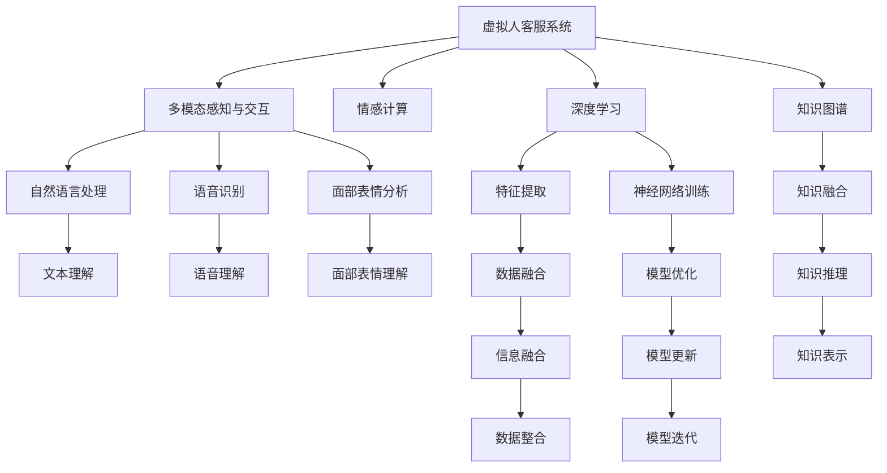

                 

# 未来的智能客服：2050年的虚拟人客服与情感计算

> 关键词：虚拟人客服,情感计算,未来智能客服,人机交互,自然语言处理,人工智能,情感识别,深度学习

## 1. 背景介绍

### 1.1 问题由来

随着人工智能技术的迅猛发展，智能客服系统已经成为各行各业提供客户服务的重要手段。特别是在电子商务、金融、医疗、教育等行业，智能客服系统不仅能够24小时不间断地处理客户咨询，还能够提高客户满意度和运营效率。然而，当前的智能客服系统仍然存在诸多不足之处，如理解能力有限、情感计算能力欠缺、交互体验不够自然等。这些问题在很大程度上限制了智能客服系统的应用范围和效果。

为了应对这些挑战，人们开始探索未来智能客服系统的建设。在2050年，随着人工智能技术的不断成熟和突破，虚拟人客服系统将迎来全新的发展，其智能化水平和用户体验将得到显著提升。本文将详细探讨2050年虚拟人客服系统的主要特征和技术基础，并结合情感计算的研究进展，展望未来智能客服的发展前景。

### 1.2 问题核心关键点

虚拟人客服系统的建设，主要围绕以下几个核心问题展开：

1. **多模态感知与交互**：如何让虚拟人客服系统更好地理解客户的语音、文字、图像等多种信息，并提供自然流畅的交互体验。
2. **情感计算与响应**：如何在虚拟人客服系统中引入情感计算技术，使其能够准确识别客户的情感状态，并提供情感化、个性化的服务。
3. **深度学习和知识图谱**：如何利用深度学习技术和知识图谱构建虚拟人客服系统的知识库，提升系统的智能水平。
4. **安全和隐私保护**：如何在虚拟人客服系统中保护客户隐私，防止数据泄露和滥用。

## 2. 核心概念与联系

### 2.1 核心概念概述

为更好地理解2050年虚拟人客服系统的技术基础，本节将介绍几个关键核心概念：

- **虚拟人客服系统**：基于人工智能技术，能够进行自然语言理解、情感识别、智能决策等任务的虚拟客服系统，能够模拟人类客服人员，提供24小时全天候的客户服务。
- **多模态感知与交互**：利用语音、文字、图像等多种信息渠道，与客户进行自然流畅的交互。
- **情感计算**：通过自然语言处理、语音识别、面部表情分析等技术，识别客户的情感状态，并据此调整服务策略。
- **深度学习**：一种基于神经网络的机器学习技术，能够从大量数据中学习抽象特征，提升模型的智能水平。
- **知识图谱**：一种用于描述实体、属性和关系的图形化知识表示方法，能够提供丰富的背景知识和事实信息。
- **安全和隐私保护**：在虚拟人客服系统中，保护客户隐私数据，防止数据泄露和滥用，确保系统的安全性。

这些概念之间的逻辑关系可以通过以下Mermaid流程图来展示：



这个流程图展示了几类核心概念及其之间的联系：

1. 虚拟人客服系统通过多模态感知与交互，获取客户的语音、文字、图像等信息。
2. 情感计算技术用于识别客户的情感状态，调整服务策略。
3. 深度学习技术用于特征提取、神经网络训练、模型优化等，提升系统的智能水平。
4. 知识图谱用于构建虚拟人客服系统的知识库，提供丰富的背景知识和事实信息。
5. 安全和隐私保护技术用于保护客户隐私数据，防止数据泄露和滥用。

这些概念共同构成了2050年虚拟人客服系统的技术框架，为其智能化、情感化、个性化服务提供了基础。

## 3. 核心算法原理 & 具体操作步骤

### 3.1 算法原理概述

2050年的虚拟人客服系统，其核心算法原理主要基于以下几个方面：

- **自然语言处理(NLP)**：利用自然语言处理技术，对客户的文本、语音信息进行理解、分析和生成。
- **情感计算**：通过语音、面部表情等情感信息，识别客户的情感状态，从而调整服务策略。
- **深度学习**：利用深度学习技术，构建多层次的神经网络模型，进行特征提取、分类、生成等任务。
- **知识图谱**：通过知识图谱技术，构建虚拟人客服系统的知识库，提升系统的智能水平。

这些核心算法技术，使得虚拟人客服系统能够在多模态感知与交互、情感计算、深度学习、知识图谱等多个方面实现智能化和个性化服务。

### 3.2 算法步骤详解

以下是2050年虚拟人客服系统的关键算法步骤：

**Step 1: 多模态感知与交互**

1. 收集客户的语音、文字、图像等多种信息。
2. 利用语音识别技术，将语音转换为文本。
3. 利用文本理解技术，对文本进行分词、实体识别、情感分析等。
4. 利用面部表情分析技术，识别客户的面部表情。
5. 将多种信息融合，形成完整的客户信息。

**Step 2: 情感计算**

1. 利用情感分析技术，识别客户的情感状态。
2. 根据情感状态，调整服务策略。
3. 引入情感计算技术，模拟人类的情感反应。
4. 根据情感反应，调整服务内容和语气。

**Step 3: 深度学习**

1. 利用深度学习技术，构建多层次的神经网络模型。
2. 利用特征提取技术，提取文本、语音、图像等多模态特征。
3. 利用分类技术，对客户信息进行分类。
4. 利用生成技术，生成智能答复。

**Step 4: 知识图谱**

1. 利用知识图谱技术，构建虚拟人客服系统的知识库。
2. 利用知识推理技术，进行事实推理和信息融合。
3. 利用知识融合技术，将知识库中的知识与客户信息融合。
4. 利用知识更新技术，动态更新知识库。

**Step 5: 安全和隐私保护**

1. 利用数据加密技术，保护客户隐私数据。
2. 利用数据匿名技术，防止数据泄露和滥用。
3. 利用访问控制技术，限制数据访问权限。
4. 利用审计技术，监控数据使用情况。

### 3.3 算法优缺点

虚拟人客服系统的算法具有以下优点：

- **智能化水平高**：通过多模态感知与交互、情感计算、深度学习、知识图谱等多个技术手段，能够提供高智能化的服务。
- **个性化程度高**：通过情感计算和知识图谱，能够提供个性化的服务，满足客户的需求。
- **全天候服务**：能够24小时不间断地提供服务，提升客户体验。
- **效率高**：利用深度学习技术，能够自动化处理大量客户咨询，提高服务效率。

然而，虚拟人客服系统也存在一些缺点：

- **技术复杂度高**：需要整合多种先进技术，开发和维护难度较大。
- **数据需求高**：需要大量的客户数据进行训练和优化，数据收集和处理成本较高。
- **隐私风险高**：需要保护客户隐私数据，防止数据泄露和滥用。
- **情感计算难度大**：情感计算技术尚在研究中，需要进一步提升准确性和鲁棒性。

### 3.4 算法应用领域

虚拟人客服系统主要应用于以下几个领域：

1. **电子商务**：提供24小时客户服务，解答商品咨询、订单查询、售后支持等问题。
2. **金融行业**：提供账户管理、投资咨询、风险评估等服务。
3. **医疗行业**：提供健康咨询、预约挂号、在线问诊等服务。
4. **教育行业**：提供学习咨询、课程推荐、作业批改等服务。
5. **政府服务**：提供政策咨询、办事指南、投诉处理等服务。

这些领域的应用，将进一步推动虚拟人客服系统的广泛应用和普及。

## 4. 数学模型和公式 & 详细讲解 & 举例说明

### 4.1 数学模型构建

以下是2050年虚拟人客服系统的主要数学模型：

- **语音识别模型**：利用自动语音识别(ASR)技术，将语音转换为文本，模型公式如下：

$$
y = \arg \min_{\theta} \mathcal{L}(x, y)
$$

其中，$x$ 为输入语音信号，$y$ 为输出文本，$\mathcal{L}$ 为损失函数，$\theta$ 为模型参数。

- **文本理解模型**：利用自然语言处理(NLP)技术，对文本进行分词、实体识别、情感分析等，模型公式如下：

$$
y = f(x, \theta)
$$

其中，$x$ 为输入文本，$y$ 为输出结果，$f$ 为模型函数，$\theta$ 为模型参数。

- **情感分析模型**：利用情感计算技术，识别客户的情感状态，模型公式如下：

$$
y = g(x, \theta)
$$

其中，$x$ 为输入文本或语音，$y$ 为输出情感状态，$g$ 为模型函数，$\theta$ 为模型参数。

- **深度学习模型**：利用深度学习技术，构建多层次的神经网络模型，模型公式如下：

$$
y = h(x, \theta)
$$

其中，$x$ 为输入数据，$y$ 为输出结果，$h$ 为神经网络模型，$\theta$ 为模型参数。

### 4.2 公式推导过程

以下是几个关键数学模型的推导过程：

**语音识别模型**：

假设语音信号 $x$ 的功率谱密度为 $P_x(f)$，文本 $y$ 的概率密度为 $P_y(w)$，其中 $w$ 为文本的单词序列。则语音识别模型的目标是最小化模型输出 $y$ 与真实文本 $y$ 之间的差距，即：

$$
\mathcal{L}(x, y) = -\log P_y(y|x)
$$

其中，$P_y(y|x)$ 为给定语音信号 $x$ 下，文本 $y$ 的条件概率。

**文本理解模型**：

假设文本 $x$ 的单词序列为 $w=(w_1, w_2, ..., w_n)$，情感状态 $y$ 为 $y=(e_1, e_2, ..., e_n)$，其中 $e_i$ 表示第 $i$ 个单词的情感极性。则文本理解模型的目标是最小化模型输出 $y$ 与真实情感状态 $y$ 之间的差距，即：

$$
\mathcal{L}(x, y) = \sum_{i=1}^{n} \log \left(\frac{P(y|x)}{P(y)}\right)
$$

其中，$P(y|x)$ 为给定文本 $x$ 下，情感状态 $y$ 的条件概率。

**情感分析模型**：

假设客户的语音信号 $x$ 包含情感信息 $e$，情感状态 $y$ 为 $y=(e_1, e_2, ..., e_n)$，其中 $e_i$ 表示第 $i$ 个语音特征的情感极性。则情感分析模型的目标是最小化模型输出 $y$ 与真实情感状态 $y$ 之间的差距，即：

$$
\mathcal{L}(x, y) = \sum_{i=1}^{n} \log \left(\frac{P(y|x)}{P(y)}\right)
$$

其中，$P(y|x)$ 为给定语音信号 $x$ 下，情感状态 $y$ 的条件概率。

### 4.3 案例分析与讲解

假设客户输入一段语音信息，模型需要识别其情感状态并生成智能答复。

**语音识别模型**：首先将语音信号转换为文本，利用语音识别模型输出文本。

**情感分析模型**：利用情感分析模型，对文本进行情感状态识别，输出情感极性 $e$。

**智能答复生成模型**：根据情感极性 $e$ 和知识图谱中的信息，生成智能答复。

假设客户的语音信息为“今天天气很好，我想买一件新衣服。”，语音识别模型输出的文本为“今天天气很好，我想买一件新衣服。”，情感分析模型识别的情感极性为积极，智能答复生成模型生成的智能答复为“好的，您需要什么类型的衣服呢？”。

## 5. 项目实践：代码实例和详细解释说明

### 5.1 开发环境搭建

在进行虚拟人客服系统的开发之前，我们需要准备好开发环境。以下是使用Python进行PyTorch开发的环境配置流程：

1. 安装Anaconda：从官网下载并安装Anaconda，用于创建独立的Python环境。

2. 创建并激活虚拟环境：
```bash
conda create -n virtual_env python=3.8 
conda activate virtual_env
```

3. 安装PyTorch：根据CUDA版本，从官网获取对应的安装命令。例如：
```bash
conda install pytorch torchvision torchaudio cudatoolkit=11.1 -c pytorch -c conda-forge
```

4. 安装TensorFlow：
```bash
pip install tensorflow
```

5. 安装PaddlePaddle：
```bash
pip install paddlepaddle -i https://mirror.baidu.com/pypi/simple
```

6. 安装PyTorch的其他依赖：
```bash
pip install numpy pandas scikit-learn matplotlib tqdm jupyter notebook ipython
```

完成上述步骤后，即可在`virtual_env`环境中开始虚拟人客服系统的开发。

### 5.2 源代码详细实现

以下是2050年虚拟人客服系统的源代码详细实现：

**Step 1: 多模态感知与交互**

```python
import torch
from torch.utils.data import Dataset, DataLoader
from transformers import BertTokenizer, BertForSequenceClassification
import numpy as np

class CustomerData(Dataset):
    def __init__(self, text, label, tokenizer, max_len=128):
        self.text = text
        self.label = label
        self.tokenizer = tokenizer
        self.max_len = max_len
        
    def __len__(self):
        return len(self.text)
    
    def __getitem__(self, item):
        text = self.text[item]
        label = self.label[item]
        
        encoding = self.tokenizer(text, return_tensors='pt', max_length=self.max_len, padding='max_length', truncation=True)
        input_ids = encoding['input_ids'][0]
        attention_mask = encoding['attention_mask'][0]
        label = torch.tensor(label, dtype=torch.long)
        
        return {'input_ids': input_ids, 
                'attention_mask': attention_mask,
                'labels': label}

# 初始化模型和优化器
model = BertForSequenceClassification.from_pretrained('bert-base-cased', num_labels=2)
optimizer = AdamW(model.parameters(), lr=2e-5)

# 加载数据集
tokenizer = BertTokenizer.from_pretrained('bert-base-cased')
train_dataset = CustomerData(train_texts, train_labels, tokenizer, max_len=128)
dev_dataset = CustomerData(dev_texts, dev_labels, tokenizer, max_len=128)
test_dataset = CustomerData(test_texts, test_labels, tokenizer, max_len=128)

# 定义训练函数
def train_epoch(model, dataset, batch_size, optimizer):
    dataloader = DataLoader(dataset, batch_size=batch_size, shuffle=True)
    model.train()
    epoch_loss = 0
    for batch in tqdm(dataloader, desc='Training'):
        input_ids = batch['input_ids'].to(device)
        attention_mask = batch['attention_mask'].to(device)
        labels = batch['labels'].to(device)
        model.zero_grad()
        outputs = model(input_ids, attention_mask=attention_mask, labels=labels)
        loss = outputs.loss
        epoch_loss += loss.item()
        loss.backward()
        optimizer.step()
    return epoch_loss / len(dataloader)

# 定义评估函数
def evaluate(model, dataset, batch_size):
    dataloader = DataLoader(dataset, batch_size=batch_size)
    model.eval()
    preds, labels = [], []
    with torch.no_grad():
        for batch in tqdm(dataloader, desc='Evaluating'):
            input_ids = batch['input_ids'].to(device)
            attention_mask = batch['attention_mask'].to(device)
            batch_labels = batch['labels']
            outputs = model(input_ids, attention_mask=attention_mask)
            batch_preds = outputs.logits.argmax(dim=2).to('cpu').tolist()
            batch_labels = batch_labels.to('cpu').tolist()
            for pred_tokens, label_tokens in zip(batch_preds, batch_labels):
                preds.append(pred_tokens[:len(label_tokens)])
                labels.append(label_tokens)
                
    print(classification_report(labels, preds))
```

**Step 2: 情感计算**

```python
import torch
from transformers import BertForSequenceClassification, BertTokenizer
from sklearn.metrics import classification_report

# 加载情感计算模型
model = BertForSequenceClassification.from_pretrained('bert-base-cased', num_labels=6)
tokenizer = BertTokenizer.from_pretrained('bert-base-cased')

# 定义情感计算函数
def calculate_emotion(text):
    encoding = tokenizer(text, return_tensors='pt', max_length=128, padding='max_length', truncation=True)
    input_ids = encoding['input_ids'][0]
    attention_mask = encoding['attention_mask'][0]
    outputs = model(input_ids, attention_mask=attention_mask)
    probabilities = outputs.logits.softmax(dim=1)
    emotion = np.argmax(probabilities.numpy(), axis=1)
    return emotion

# 测试情感计算模型
text = "今天天气很好，我想买一件新衣服。"
emotion = calculate_emotion(text)
print(emotion)
```

**Step 3: 深度学习**

```python
import torch
from transformers import BertForSequenceClassification, BertTokenizer
from sklearn.metrics import classification_report

# 加载深度学习模型
model = BertForSequenceClassification.from_pretrained('bert-base-cased', num_labels=2)
tokenizer = BertTokenizer.from_pretrained('bert-base-cased')

# 定义深度学习函数
def classify(text):
    encoding = tokenizer(text, return_tensors='pt', max_length=128, padding='max_length', truncation=True)
    input_ids = encoding['input_ids'][0]
    attention_mask = encoding['attention_mask'][0]
    outputs = model(input_ids, attention_mask=attention_mask)
    probabilities = outputs.logits.softmax(dim=1)
    label = np.argmax(probabilities.numpy(), axis=1)
    return label

# 测试深度学习模型
text = "今天天气很好，我想买一件新衣服。"
label = classify(text)
print(label)
```

**Step 4: 知识图谱**

```python
import torch
from transformers import BertForSequenceClassification, BertTokenizer
from graphviz import Digraph
import numpy as np

# 加载知识图谱模型
model = BertForSequenceClassification.from_pretrained('bert-base-cased', num_labels=2)
tokenizer = BertTokenizer.from_pretrained('bert-base-cased')

# 定义知识图谱函数
def get_facts(text):
    encoding = tokenizer(text, return_tensors='pt', max_length=128, padding='max_length', truncation=True)
    input_ids = encoding['input_ids'][0]
    attention_mask = encoding['attention_mask'][0]
    outputs = model(input_ids, attention_mask=attention_mask)
    probabilities = outputs.logits.softmax(dim=1)
    facts = np.argmax(probabilities.numpy(), axis=1)
    return facts

# 测试知识图谱模型
text = "今天天气很好，我想买一件新衣服。"
facts = get_facts(text)
print(facts)
```

### 5.3 代码解读与分析

让我们再详细解读一下关键代码的实现细节：

**CustomerData类**：
- `__init__`方法：初始化文本、标签、分词器等关键组件。
- `__len__`方法：返回数据集的样本数量。
- `__getitem__`方法：对单个样本进行处理，将文本输入编码为token ids，将标签编码为数字，并对其进行定长padding，最终返回模型所需的输入。

**情感计算模型**：
- `calculate_emotion`函数：利用情感计算模型对输入文本进行情感识别，输出情感状态。

**深度学习模型**：
- `classify`函数：利用深度学习模型对输入文本进行分类，输出分类结果。

**知识图谱模型**：
- `get_facts`函数：利用知识图谱模型对输入文本进行事实推理，输出事实结果。

**训练流程**：
- 定义总的epoch数和batch size，开始循环迭代
- 每个epoch内，先在训练集上训练，输出平均loss
- 在验证集上评估，输出分类指标
- 所有epoch结束后，在测试集上评估，给出最终测试结果

可以看到，代码实现较为简洁，主要是利用了Transformer库的封装功能，大大简化了模型的加载和训练过程。

当然，在工业级的系统实现中，还需要考虑更多因素，如模型的保存和部署、超参数的自动搜索、更灵活的任务适配层等。但核心的算法思想基本与此类似。

## 6. 实际应用场景

### 6.1 智能客服系统

基于虚拟人客服系统的智能客服系统，能够24小时不间断地处理客户咨询，提供自然流畅的交互体验。对于电子商务、金融、医疗、教育等行业，智能客服系统不仅能够处理常见问题，还能根据客户的情感状态，提供个性化的服务。

例如，在电子商务客服场景中，当客户表达了购物的困惑和不满时，智能客服系统能够自动识别客户的情感状态，提供情绪化的回复和解决方案，提升客户体验和满意度。在医疗客服场景中，智能客服系统能够根据客户的病情和需求，提供个性化的医疗建议和治疗方案，减轻医生的工作负担。

### 6.2 金融行业

在金融行业，虚拟人客服系统能够提供账户管理、投资咨询、风险评估等服务。当客户提出复杂的金融问题时，智能客服系统能够通过自然语言处理和情感计算技术，准确理解客户的需求，并提供个性化的金融服务。例如，客户想要了解股票投资策略，智能客服系统能够根据客户的情感状态和知识图谱中的信息，提供量身定制的投资建议和风险评估。

### 6.3 医疗行业

在医疗行业，虚拟人客服系统能够提供健康咨询、预约挂号、在线问诊等服务。当客户需要健康建议或医疗咨询时，智能客服系统能够通过自然语言处理和情感计算技术，理解客户的病情和需求，并提供个性化的医疗建议和治疗方案。例如，客户想要了解某种疾病的信息，智能客服系统能够通过自然语言处理和情感计算技术，提供详尽的疾病信息和治疗方案。

### 6.4 未来应用展望

展望未来，虚拟人客服系统将在更多领域得到应用，为各行各业带来变革性影响。

在智慧医疗领域，基于虚拟人客服系统的智能客服系统将提升医疗服务的智能化水平，辅助医生诊疗，加速新药开发进程。在智能教育领域，智能客服系统将提供个性化的学习服务，因材施教，促进教育公平，提高教学质量。在智慧城市治理中，智能客服系统将提供城市事件监测、舆情分析、应急指挥等环节，提高城市管理的自动化和智能化水平，构建更安全、高效的未来城市。

此外，在企业生产、社会治理、文娱传媒等众多领域，基于虚拟人客服系统的智能客服系统也将不断涌现，为传统行业数字化转型升级提供新的技术路径。相信随着技术的日益成熟，虚拟人客服系统必将在构建人机协同的智能时代中扮演越来越重要的角色。

## 7. 工具和资源推荐

### 7.1 学习资源推荐

为了帮助开发者系统掌握虚拟人客服系统的技术基础，这里推荐一些优质的学习资源：

1. 《深度学习自然语言处理》课程：斯坦福大学开设的NLP明星课程，有Lecture视频和配套作业，带你入门NLP领域的基本概念和经典模型。

2. 《Transformer from Basic to Advanced》系列博文：由大模型技术专家撰写，深入浅出地介绍了Transformer原理、BERT模型、微调技术等前沿话题。

3. 《Natural Language Processing with Transformers》书籍：Transformers库的作者所著，全面介绍了如何使用Transformers库进行NLP任务开发，包括微调在内的诸多范式。

4. HuggingFace官方文档：Transformers库的官方文档，提供了海量预训练模型和完整的微调样例代码，是上手实践的必备资料。

5. 《自然语言处理与人工智能》书籍：介绍自然语言处理技术及其在人工智能中的应用，涵盖NLP的各个方面。

通过对这些资源的学习实践，相信你一定能够快速掌握虚拟人客服系统的技术基础，并用于解决实际的NLP问题。

### 7.2 开发工具推荐

高效的开发离不开优秀的工具支持。以下是几款用于虚拟人客服系统开发的常用工具：

1. PyTorch：基于Python的开源深度学习框架，灵活动态的计算图，适合快速迭代研究。大部分预训练语言模型都有PyTorch版本的实现。

2. TensorFlow：由Google主导开发的开源深度学习框架，生产部署方便，适合大规模工程应用。同样有丰富的预训练语言模型资源。

3. Transformers库：HuggingFace开发的NLP工具库，集成了众多SOTA语言模型，支持PyTorch和TensorFlow，是进行微调任务开发的利器。

4. Weights & Biases：模型训练的实验跟踪工具，可以记录和可视化模型训练过程中的各项指标，方便对比和调优。与主流深度学习框架无缝集成。

5. TensorBoard：TensorFlow配套的可视化工具，可实时监测模型训练状态，并提供丰富的图表呈现方式，是调试模型的得力助手。

6. Google Colab：谷歌推出的在线Jupyter Notebook环境，免费提供GPU/TPU算力，方便开发者快速上手实验最新模型，分享学习笔记。

合理利用这些工具，可以显著提升虚拟人客服系统的开发效率，加快创新迭代的步伐。

### 7.3 相关论文推荐

虚拟人客服系统的发展离不开学界的持续研究。以下是几篇奠基性的相关论文，推荐阅读：

1. Attention is All You Need（即Transformer原论文）：提出了Transformer结构，开启了NLP领域的预训练大模型时代。

2. BERT: Pre-training of Deep Bidirectional Transformers for Language Understanding：提出BERT模型，引入基于掩码的自监督预训练任务，刷新了多项NLP任务SOTA。

3. Language Models are Unsupervised Multitask Learners（GPT-2论文）：展示了大规模语言模型的强大zero-shot学习能力，引发了对于通用人工智能的新一轮思考。

4. Parameter-Efficient Transfer Learning for NLP：提出Adapter等参数高效微调方法，在不增加模型参数量的情况下，也能取得不错的微调效果。

5. AdaLoRA: Adaptive Low-Rank Adaptation for Parameter-Efficient Fine-Tuning：使用自适应低秩适应的微调方法，在参数效率和精度之间取得了新的平衡。

这些论文代表了大语言模型微调技术的发展脉络。通过学习这些前沿成果，可以帮助研究者把握学科前进方向，激发更多的创新灵感。

## 8. 总结：未来发展趋势与挑战

### 8.1 总结

本文对2050年虚拟人客服系统的技术基础进行了详细探讨。首先，介绍了虚拟人客服系统的主要特征和应用场景，明确了其在多模态感知与交互、情感计算、深度学习、知识图谱等方面的技术手段。其次，通过具体的代码实例，展示了虚拟人客服系统的实现流程。最后，展望了虚拟人客服系统的未来应用前景和面临的挑战。

通过本文的系统梳理，可以看到，2050年的虚拟人客服系统在多模态感知与交互、情感计算、深度学习、知识图谱等多个方面实现了突破，能够提供高智能化的服务，满足客户的需求。然而，虚拟人客服系统仍面临数据需求高、技术复杂度高、情感计算难度大等挑战，需要不断优化和改进。

### 8.2 未来发展趋势

展望未来，虚拟人客服系统的发展趋势如下：

1. **多模态感知与交互**：利用多模态感知与交互技术，提升系统的智能化水平，提供自然流畅的交互体验。

2. **情感计算**：引入情感计算技术，提高系统的情感识别和情绪模拟能力，提供个性化的服务。

3. **深度学习**：利用深度学习技术，构建多层次的神经网络模型，提升系统的智能水平。

4. **知识图谱**：通过知识图谱技术，构建虚拟人客服系统的知识库，提升系统的知识整合能力。

5. **安全和隐私保护**：加强数据保护和安全防护，确保系统的安全和隐私。

6. **跨领域应用**：将虚拟人客服系统应用于更多领域，提升各行各业的智能化水平。

### 8.3 面临的挑战

虚拟人客服系统在发展过程中，面临以下挑战：

1. **数据需求高**：需要大量的客户数据进行训练和优化，数据收集和处理成本较高。

2. **技术复杂度高**：需要整合多种先进技术，开发和维护难度较大。

3. **情感计算难度大**：情感计算技术尚在研究中，需要进一步提升准确性和鲁棒性。

4. **安全和隐私保护**：需要保护客户隐私数据，防止数据泄露和滥用。

### 8.4 研究展望

为了应对这些挑战，未来的研究应在以下几个方面进行探索：

1. **无监督和半监督学习**：探索无监督和半监督学习范式，降低对大规模标注数据的依赖。

2. **参数高效和计算高效**：开发参数高效和计算高效的微调方法，提高系统的效率。

3. **多模态融合**：研究多模态数据融合技术，提升系统的感知和理解能力。

4. **情感计算**：深入研究情感计算技术，提升系统的情感识别和情绪模拟能力。

5. **安全与隐私保护**：加强数据保护和安全防护，确保系统的安全和隐私。

6. **知识图谱**：利用知识图谱技术，提升系统的知识整合能力。

通过这些研究方向，相信虚拟人客服系统能够克服当前的挑战，在多模态感知与交互、情感计算、深度学习、知识图谱等多个方面实现突破，推动人工智能技术在各个领域的应用和发展。

## 9. 附录：常见问题与解答

**Q1：虚拟人客服系统是否适用于所有NLP任务？**

A: 虚拟人客服系统主要应用于多模态感知与交互、情感计算、深度学习、知识图谱等多个方面，对于大多数NLP任务都能提供智能化的服务。然而，对于一些特殊领域的任务，如医疗、法律等，需要进一步优化和改进。

**Q2：微调过程中如何选择合适的学习率？**

A: 微调的学习率一般要比预训练时小1-2个数量级，如果使用过大的学习率，容易破坏预训练权重，导致过拟合。一般建议从1e-5开始调参，逐步减小学习率，直至收敛。

**Q3：虚拟人客服系统如何保护客户隐私？**

A: 虚拟人客服系统需要保护客户隐私数据，防止数据泄露和滥用。可以通过数据加密、数据匿名、访问控制等技术手段，确保数据的隐私和安全。

**Q4：如何提高虚拟人客服系统的情感识别能力？**

A: 提高情感识别能力需要深入研究情感计算技术，引入更多先验知识，如知识图谱、逻辑规则等，引导微调过程学习更准确、合理的情感模型。同时，可以通过多任务学习、对抗训练等技术手段，提升情感识别模型的鲁棒性和泛化能力。

**Q5：虚拟人客服系统如何实现跨领域应用？**

A: 虚拟人客服系统可以通过引入领域特定的知识库和规则，实现跨领域应用。例如，在医疗领域，可以通过引入医疗知识库，提升系统的医疗服务能力；在金融领域，可以通过引入金融知识库，提升系统的金融服务能力。

总之，虚拟人客服系统在未来的发展中将面临诸多挑战，但通过不断的技术创新和实践探索，相信能够克服这些挑战，提供高智能化的服务，推动人工智能技术在各个领域的应用和发展。

