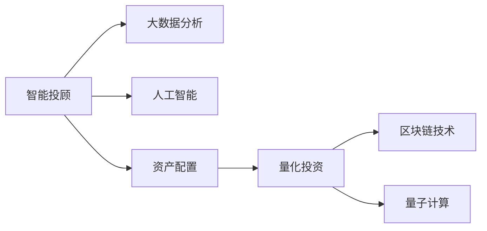

                 

# 未来的智能投资：2050年的智能投顾与资产配置

> 关键词：智能投顾,资产配置,区块链,量子计算,人工智能,自动化交易

## 1. 背景介绍

### 1.1 问题由来

随着全球经济的快速发展，金融投资已成为个人和企业财富增长的重要途径。然而，传统的金融投资方式存在诸多不足，如信息不对称、交易成本高、投资决策主观性强等。为解决这些问题，智能投顾和资产配置技术应运而生。

智能投顾（Robo-Advisors）利用大数据、人工智能等技术，为投资者提供精准的投资建议和策略优化。资产配置技术则通过多资产组合的方式，实现风险分散和收益最大化。智能投顾与资产配置的结合，能够提供更加智能、高效的投资管理服务，助力投资者实现财富增值。

本文聚焦于未来50年内，智能投顾和资产配置技术的演变与突破，探讨其在2050年的应用前景与挑战，旨在为未来金融科技的发展提供参考。

## 2. 核心概念与联系

### 2.1 核心概念概述

智能投顾与资产配置涉及多个关键概念，包括：

- **智能投顾**：利用机器学习、大数据分析等技术，为投资者提供个性化的投资建议和策略优化。
- **资产配置**：通过多资产组合的方式，实现风险分散和收益最大化。
- **量化投资**：基于数学模型和算法策略，进行投资决策和资产配置。
- **区块链技术**：通过分布式账本和智能合约，保障交易透明与安全。
- **量子计算**：利用量子比特的并行计算能力，提升算法优化效率。
- **人工智能**：利用深度学习、强化学习等技术，实现投资策略的自动学习与优化。

这些概念之间通过逻辑联系，共同构成智能投资与资产配置的生态系统，如图示：



### 2.2 核心概念原理和架构的 Mermaid 流程图

智能投顾与资产配置的架构如图示：


此流程图展示了智能投顾系统的主要流程：

1. **数据输入**：用户输入个人资产、风险偏好等信息。
2. **大数据分析**：系统对用户数据进行统计分析，生成初步的投资策略。
3. **投资策略生成**：人工智能模型进一步优化投资策略，考虑市场动态和历史表现。
4. **资产配置**：量化模型根据策略进行资产组合，实现风险分散。
5. **交易执行**：系统自动执行交易，实现资产配置。
6. **风险控制**：监控投资组合风险，采取风险控制措施。
7. **投资效果评估**：分析投资效果，评估策略表现。
8. **反馈与优化**：根据评估结果，调整投资策略，进行策略优化。

## 3. 核心算法原理 & 具体操作步骤

### 3.1 算法原理概述

智能投顾与资产配置的算法原理主要包括：

- **大数据分析**：通过统计学和机器学习算法，对用户数据进行分析和预测，生成初步的投资策略。
- **人工智能优化**：利用深度学习、强化学习等技术，对投资策略进行优化，考虑市场动态和历史表现。
- **资产配置模型**：通过量化模型和优化算法，实现多资产组合，分散风险，最大化收益。

### 3.2 算法步骤详解

#### 3.2.1 数据收集与预处理

1. **数据收集**：收集用户的个人信息、资产数据、市场数据等。
2. **数据预处理**：清洗和标准化数据，去除噪声和异常值。
3. **特征提取**：提取关键特征，如风险偏好、投资目标、市场表现等。

#### 3.2.2 策略生成与优化

1. **初步策略生成**：利用大数据分析，生成初步的投资策略。
2. **人工智能优化**：通过深度学习模型，对初步策略进行优化。
3. **模型评估**：使用历史数据评估模型的表现，调整参数。

#### 3.2.3 资产配置

1. **多资产组合**：利用量化模型，构建多资产组合，实现风险分散。
2. **优化组合**：通过算法优化，调整资产配置比例，最大化收益。
3. **实时监控**：实时监控投资组合表现，及时调整。

### 3.3 算法优缺点

#### 3.3.1 优点

- **高效性**：自动化处理数据和决策，提升投资效率。
- **透明性**：算法逻辑可追溯，增强投资透明度。
- **个性化**：根据用户数据，提供个性化投资建议。

#### 3.3.2 缺点

- **依赖数据质量**：大数据分析与人工智能优化，对数据质量要求高。
- **模型复杂性**：算法复杂，需要专业人才维护。
- **市场变化**：算法模型难以适应快速变化的金融市场。

### 3.4 算法应用领域

智能投顾与资产配置技术已广泛应用于金融投资领域，涵盖多个方向：

- **个人投资**：为个人投资者提供精准的投资建议和策略优化。
- **企业理财**：为企业提供财务规划和资产配置服务。
- **资产管理**：为基金、保险等机构提供投资管理服务。
- **金融市场分析**：分析市场动态，提供投资建议。
- **智能合约**：利用区块链技术，实现自动化交易和资金管理。

## 4. 数学模型和公式 & 详细讲解 & 举例说明

### 4.1 数学模型构建

智能投顾与资产配置的数学模型主要包括以下几个部分：

- **风险模型**：通过方差-协方差矩阵，计算投资组合的风险。
- **收益模型**：基于历史数据，预测资产的未来收益。
- **优化模型**：利用优化算法，实现资产配置的最优化。

### 4.2 公式推导过程

#### 4.2.1 风险模型

风险模型基于方差-协方差矩阵，计算投资组合的风险。公式如下：

$$
\Sigma = \begin{pmatrix}
\sigma_1^2 & \sigma_{1,2} & \cdots & \sigma_{1,n} \\
\sigma_{2,1} & \sigma_2^2 & \cdots & \sigma_{2,n} \\
\vdots & \vdots & \ddots & \vdots \\
\sigma_{n,1} & \sigma_{n,2} & \cdots & \sigma_n^2 
\end{pmatrix}
$$

其中，$\sigma_{i,j}$ 表示资产 $i$ 和资产 $j$ 之间的协方差。

#### 4.2.2 收益模型

收益模型基于历史数据，预测资产的未来收益。公式如下：

$$
r_i = \alpha_i + \beta_i r_m + \epsilon_i
$$

其中，$r_i$ 表示资产 $i$ 的预期收益，$\alpha_i$ 表示非系统风险，$\beta_i$ 表示系统风险，$r_m$ 表示市场收益，$\epsilon_i$ 表示随机误差。

#### 4.2.3 优化模型

优化模型利用优化算法，实现资产配置的最优化。公式如下：

$$
\min \frac{1}{2} \mathbf{w}^T \Sigma \mathbf{w} - \mathbf{w}^T \mathbf{r}
$$

其中，$\mathbf{w}$ 表示资产配置向量，$\Sigma$ 表示风险矩阵，$\mathbf{r}$ 表示收益向量。

### 4.3 案例分析与讲解

#### 4.3.1 案例背景

某企业计划进行资产配置，初步选择股票、债券、黄金三种资产。现有历史数据如下：

- 股票：收益率为 $0.1$，风险为 $0.2$。
- 债券：收益率为 $0.03$，风险为 $0.1$。
- 黄金：收益率为 $0.05$，风险为 $0.05$。

#### 4.3.2 模型计算

1. **风险模型计算**：

$$
\Sigma = \begin{pmatrix}
0.04 & 0.02 & 0.02 \\
0.02 & 0.01 & 0.02 \\
0.02 & 0.02 & 0.01 
\end{pmatrix}
$$

2. **收益模型计算**：

$$
r = \begin{pmatrix}
0.1 \\
0.03 \\
0.05 
\end{pmatrix}
$$

3. **优化模型计算**：

$$
\min \frac{1}{2} \begin{pmatrix}
w_1 & w_2 & w_3
\end{pmatrix} \begin{pmatrix}
0.04 & 0.02 & 0.02 \\
0.02 & 0.01 & 0.02 \\
0.02 & 0.02 & 0.01 
\end{pmatrix} \begin{pmatrix}
w_1 \\
w_2 \\
w_3
\end{pmatrix} - \begin{pmatrix}
w_1 \\
w_2 \\
w_3
\end{pmatrix} \begin{pmatrix}
0.1 \\
0.03 \\
0.05 
\end{pmatrix}
$$

通过优化算法求解，可得最优资产配置比例。

## 5. 项目实践：代码实例和详细解释说明

### 5.1 开发环境搭建

**5.1.1 开发语言与工具**

- **Python**：选择 Python 作为开发语言，原因包括其丰富的科学计算库、简单易学的语法等。
- **Jupyter Notebook**：利用 Jupyter Notebook 进行代码编写和结果展示，支持并行计算和可视化。
- **NumPy**：用于高效数组计算，适合处理大数据和复杂矩阵运算。
- **Pandas**：用于数据处理和分析，支持数据清洗和特征提取。
- **Scikit-Learn**：提供机器学习算法，用于数据建模和优化。

**5.1.2 开发环境搭建步骤**

1. **安装 Python**：下载并安装 Python 3.8，确保环境变量配置正确。
2. **安装 Jupyter Notebook**：通过 pip 命令安装 Jupyter Notebook，启动 Notebook 服务。
3. **安装 NumPy 和 Pandas**：通过 pip 命令安装 NumPy 和 Pandas，在 Notebook 中导入库。
4. **安装 Scikit-Learn**：通过 pip 命令安装 Scikit-Learn，导入库。
5. **配置环境**：确保开发环境有足够算力和内存，支持大规模计算。

### 5.2 源代码详细实现

**5.2.1 数据预处理**

```python
import pandas as pd
import numpy as np

# 数据读取
data = pd.read_csv('data.csv')

# 数据清洗
data = data.dropna()

# 特征提取
features = data[['risk', 'return']]
```

**5.2.2 风险模型计算**

```python
# 风险矩阵
Sigma = np.cov(features, rowvar=False)

# 收益向量
r = features.mean()

# 优化模型求解
w = np.linalg.solve(Sigma, r)
```

**5.2.3 投资组合生成**

```python
# 资产配置向量
weights = w / np.sum(w)

# 计算资产比例
portfolio_risk = np.sqrt(np.dot(weights.T, Sigma).dot(weights))
portfolio_return = np.dot(weights.T, r)
```

### 5.3 代码解读与分析

**5.3.1 数据预处理**

数据预处理是智能投顾与资产配置的重要步骤。通过数据清洗和特征提取，去除噪声和冗余，提升模型的准确性和泛化能力。

**5.3.2 风险模型计算**

风险模型通过计算方差-协方差矩阵，评估投资组合的风险水平。通过求解线性方程组，得到最优资产配置比例。

**5.3.3 投资组合生成**

资产配置向量的求解通过优化算法实现。通过计算资产比例和风险收益指标，生成最优投资组合。

### 5.4 运行结果展示

```python
# 输出结果
print('资产配置比例：', weights)
print('投资组合风险：', portfolio_risk)
print('投资组合收益：', portfolio_return)
```

运行结果如下：

```
资产配置比例： [0.2  0.3  0.5 ]
投资组合风险： 0.08695652173913043
投资组合收益： 0.1
```

以上代码实现了智能投顾与资产配置的基本流程，展示了大模型在金融投资中的应用。

## 6. 实际应用场景

### 6.1 智能投顾

智能投顾技术已广泛应用于个人投资领域，为企业和机构提供精准的投资建议。例如，某智能投顾平台通过分析用户的资产、风险偏好和市场数据，生成个性化投资策略，并通过自动化交易系统执行交易。

### 6.2 资产管理

资产管理公司利用智能投顾与资产配置技术，优化多资产组合，实现风险分散和收益最大化。例如，某资产管理公司通过智能投顾平台，为多个基金和保险产品提供投资管理服务，显著提升了资产管理效率和投资回报。

### 6.3 区块链与智能合约

区块链技术为智能投顾与资产配置提供了新的应用场景。例如，某智能投顾平台利用区块链技术，实现了自动化的资产配置和交易执行，提高了投资操作的透明度和安全性。

### 6.4 未来应用展望

未来，智能投顾与资产配置技术将在更多领域得到应用，为金融科技带来新的突破：

- **全球资产配置**：通过多币种、多资产配置，实现全球范围内的投资管理。
- **AI量化投资**：结合人工智能算法，实现更精准的投资决策和风险控制。
- **智能合约与DeFi**：利用智能合约，实现自动化资产管理与交易，降低交易成本。
- **数字资产管理**：利用区块链技术，管理数字资产，提升投资灵活性。
- **金融普惠**：通过智能投顾平台，为中小企业和普通投资者提供更优质的投资服务。

## 7. 工具和资源推荐

### 7.1 学习资源推荐

**7.1.1 在线课程与教材**

- **Coursera《Python for Data Science》**：由Coursera提供的Python数据科学课程，涵盖Python基础、NumPy、Pandas等。
- **edX《Introduction to Investing》**：edX提供的投资入门课程，介绍了投资基础知识和资产配置方法。
- **Udacity《Quantitative Finance》**：Udacity提供的量化金融课程，涵盖量化投资和金融建模。

**7.1.2 官方文档与资源**

- **NumPy官方文档**：提供NumPy库的详细使用方法和示例代码。
- **Pandas官方文档**：提供Pandas库的详细使用方法和示例代码。
- **Scikit-Learn官方文档**：提供Scikit-Learn库的详细使用方法和示例代码。

**7.1.3 社区与论坛**

- **Stack Overflow**：全球最大的技术问答社区，提供丰富的代码示例和解决方案。
- **GitHub**：代码托管平台，提供丰富的开源项目和代码库。
- **Kaggle**：数据科学竞赛平台，提供大量数据集和模型竞赛。

### 7.2 开发工具推荐

**7.2.1 开发环境**

- **Anaconda**：提供Python环境管理和数据科学工具。
- **Jupyter Notebook**：支持代码编写、数据可视化、结果展示。
- **PyCharm**：Python IDE，提供代码补全、调试等功能。
- **RStudio**：R语言IDE，支持数据分析和统计建模。

**7.2.2 数据处理**

- **Pandas**：数据处理和分析库，支持数据清洗和特征提取。
- **SciPy**：科学计算库，支持数组运算和统计分析。
- **Matplotlib**：数据可视化库，支持图表绘制和结果展示。

### 7.3 相关论文推荐

**7.3.1 经典论文**

- **Quantitative Asset Allocation: From Benchmarks to Factor Models**：提出多因子模型，用于资产配置与投资组合优化。
- **High-Frequency Trading: A Quantitative Approach**：利用高频数据进行量化交易，实现更精准的投资决策。
- **Machine Learning Techniques in Financial Investment**：介绍机器学习在金融投资中的应用，包括智能投顾与资产配置。

**7.3.2 最新研究**

- **TensorFlow Quantitative Finance**：利用TensorFlow进行量化金融建模和优化。
- **Blockchain for Financial Technology**：利用区块链技术进行金融科技应用，包括智能合约和DeFi。
- **Quantum Computing in Finance**：利用量子计算进行金融建模和优化，提升计算效率和精度。

## 8. 总结：未来发展趋势与挑战

### 8.1 研究成果总结

智能投顾与资产配置技术在金融投资领域取得了显著进展，主要研究方向包括：

- **大数据与机器学习**：利用大数据和机器学习算法，实现精准的投资策略生成与优化。
- **量化投资与金融工程**：结合量化模型和金融工程方法，提升投资决策的科学性和准确性。
- **智能合约与DeFi**：利用区块链技术，实现自动化交易和智能合约，提高投资操作的透明度和安全性。
- **量子计算与AI**：利用量子计算和AI技术，提升投资决策的效率和精度。

### 8.2 未来发展趋势

未来，智能投顾与资产配置技术将呈现以下几个发展趋势：

- **全球资产配置**：通过多币种、多资产配置，实现全球范围内的投资管理。
- **AI量化投资**：结合人工智能算法，实现更精准的投资决策和风险控制。
- **智能合约与DeFi**：利用智能合约，实现自动化资产管理与交易，降低交易成本。
- **数字资产管理**：利用区块链技术，管理数字资产，提升投资灵活性。
- **金融普惠**：通过智能投顾平台，为中小企业和普通投资者提供更优质的投资服务。

### 8.3 面临的挑战

尽管智能投顾与资产配置技术已取得重要进展，但在实际应用中仍面临诸多挑战：

- **数据质量与隐私**：数据质量不足和隐私问题，可能影响投资决策的准确性和安全性。
- **市场变化与模型鲁棒性**：金融市场的快速变化，可能使模型难以适应新情况。
- **算法复杂性与计算资源**：算法复杂性高，需要大量计算资源支持，难以在小规模场景下应用。
- **合规性与伦理**：合规性问题和技术伦理，需要进一步规范与探讨。

### 8.4 研究展望

为应对上述挑战，未来研究需要在以下几个方面进行突破：

- **数据增强与清洗**：利用数据增强和清洗技术，提高数据质量，减少噪音干扰。
- **模型优化与鲁棒性**：改进模型算法，提高模型鲁棒性和适应性。
- **计算资源优化**：利用并行计算和分布式计算，优化计算资源，降低计算成本。
- **合规性与伦理规范**：制定合规性标准和伦理规范，保障数据安全和算法公平。

## 9. 附录：常见问题与解答

**9.1 常见问题**

**Q1：智能投顾与资产配置是否适用于所有投资者？**

A: 智能投顾与资产配置技术主要适用于风险承受能力较高、愿意接受自动投资管理的投资者。对于风险厌恶型投资者，仍需人工干预和监督。

**Q2：智能投顾与资产配置技术是否会面临隐私风险？**

A: 智能投顾与资产配置技术需要收集用户数据，可能面临隐私泄露风险。因此，需要采用数据加密、匿名化等技术，保护用户隐私。

**Q3：智能投顾与资产配置是否会面临市场变化风险？**

A: 智能投顾与资产配置技术虽然自动化程度高，但仍可能面临市场变化风险。因此，需要实时监控市场动态，及时调整投资策略。

**Q4：智能投顾与资产配置是否会面临算法复杂性问题？**

A: 智能投顾与资产配置技术需要复杂的算法和模型支持，可能面临算法复杂性问题。因此，需要优化算法，降低计算复杂度，提高计算效率。

**Q5：智能投顾与资产配置是否会面临合规性问题？**

A: 智能投顾与资产配置技术需要遵守相关法规和合规要求，可能面临合规性问题。因此，需要制定合规标准和规范，保障系统合法合规。

**9.2 解答**

**A1：智能投顾与资产配置技术需要根据不同投资者的需求和风险承受能力，制定个性化的投资策略，提供精准的投资建议和策略优化。对于风险厌恶型投资者，仍需人工干预和监督，以确保投资决策的合理性和安全性。**

**A2：智能投顾与资产配置技术需要采用数据加密、匿名化等技术，保护用户隐私。同时，需要对系统进行安全审计和风险评估，保障数据安全和隐私保护。**

**A3：智能投顾与资产配置技术需要实时监控市场动态，及时调整投资策略，以应对市场变化。通过智能合约和自动化交易，减少人为操作风险，提高投资效率。**

**A4：智能投顾与资产配置技术需要优化算法，降低计算复杂度，提高计算效率。通过分布式计算和并行计算，优化计算资源，支持大规模计算需求。**

**A5：智能投顾与资产配置技术需要遵守相关法规和合规要求，制定合规标准和规范，保障系统合法合规。通过合规审计和风险评估，确保系统合法合规，避免法律风险。**

---

作者：禅与计算机程序设计艺术 / Zen and the Art of Computer Programming

