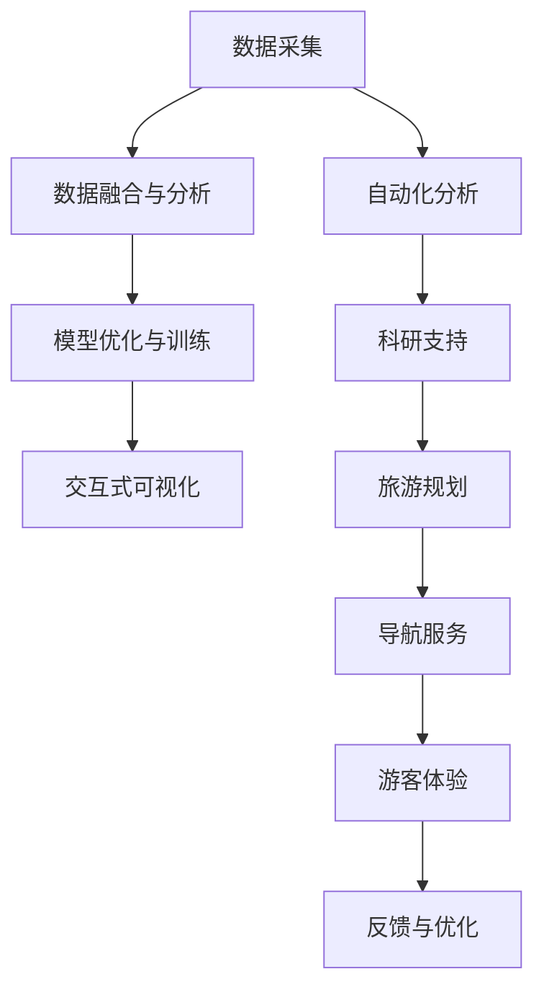

                 

# 未来的极地探索：2050年的南极科考城与北极旅游

## 1. 背景介绍

### 1.1 问题由来
极地探索是人类文明的一个重要历史阶段，也是全球科学研究的关键领域之一。自20世纪以来，南极和北极地区由于其独特的地理位置和极端气候，成为全球气候变化研究的天然实验室。随着技术的进步，极地探测设备更加智能化，数据采集和处理方式也变得更加高效。近年来，全球气候变化导致极地冰川融化加速，海平面上升，对全球生态系统和人类社会构成了重大威胁。因此，如何更好地保护极地环境、提升极地探测效率、保障科研人员安全，成为科学界和工程界关注的焦点。

### 1.2 问题核心关键点
2050年的极地探索，将借助先进的人工智能和大数据技术，打造智能化、高效化的南极科考城与北极旅游平台。该平台将实现自动化的数据采集、分析、处理和展示，大幅提升极地研究的效率和精确度，同时为游客提供安全、舒适、有趣的北极旅游体验。本文将详细介绍该平台的核心技术实现和应用场景。

## 2. 核心概念与联系

### 2.1 核心概念概述
1. **南极科考城**：利用人工智能和大数据技术，建立自动化、智能化的极地科学考察基地，提供科研人员所需的全方位支持。
2. **北极旅游平台**：通过AI驱动的极地旅游服务系统，为游客提供个性化的旅游规划、导航和体验服务。
3. **数据融合与分析**：将不同来源的数据进行融合与分析，为科研和旅游提供更全面的信息支持。
4. **模型优化与训练**：利用机器学习技术，不断优化和训练模型，提升探测和旅游服务的智能化水平。
5. **交互式可视化**：构建交互式的数据可视化系统，使得科研人员和游客能够直观地理解极地数据。

### 2.2 核心概念原理和架构的 Mermaid 流程图(Mermaid 流程节点中不要有括号、逗号等特殊字符)



## 3. 核心算法原理 & 具体操作步骤
### 3.1 算法原理概述
基于人工智能和大数据技术的极地探索平台，核心算法包括自动化数据采集、数据融合与分析、模型优化与训练、交互式可视化等。这些算法相互配合，共同支持科研和旅游服务的实现。

### 3.2 算法步骤详解

**3.2.1 自动化数据采集**
利用无人驾驶船只、无人机、地面传感器等设备，自动采集极地环境、气象、冰川等数据。数据采集设备通过物联网技术联网，实时发送采集数据。

**3.2.2 数据融合与分析**
将采集到的各类数据进行融合与分析，构建综合的极地数据集。利用机器学习算法，分析极地环境变化趋势，预测气候变化对生态系统的影响。

**3.2.3 模型优化与训练**
利用极地数据集训练深度学习模型，提升模型对极地环境的识别和预测能力。模型优化采用分布式训练和自动化调参技术，确保模型在多维度数据上的泛化能力。

**3.2.4 交互式可视化**
将模型预测结果和原始数据进行可视化展示，科研人员和游客能够直观地理解极地数据，发现科研价值和旅游亮点。交互式可视化系统支持动态交互和实时更新，提供沉浸式的用户体验。

### 3.3 算法优缺点
**优点**：
1. **高效化**：自动化数据采集和分析，大幅提升科研和旅游服务的效率。
2. **智能化**：利用机器学习模型进行深度分析和预测，提升极地探测的精确度。
3. **可视化**：交互式可视化系统，使得数据更直观，科研人员和游客易于理解。

**缺点**：
1. **成本高**：初期建设和维护成本较高，需要投入大量资金和技术。
2. **技术门槛高**：需要高度专业知识，对科研和工程人员的技术要求较高。
3. **数据安全**：极地数据涉及国家机密和商业利益，数据安全和隐私保护问题需要高度关注。

### 3.4 算法应用领域
该平台适用于极地科学研究、旅游开发、环境保护等多个领域。在科学研究方面，能够提供自动化、智能化的数据采集和分析支持；在旅游开发方面，能够提供个性化、安全的旅游规划和导航服务；在环境保护方面，能够监测极地环境变化，为全球生态保护提供数据支持。

## 4. 数学模型和公式 & 详细讲解 & 举例说明

### 4.1 数学模型构建
南极科考城和北极旅游平台的核心模型包括：
1. **数据采集模型**：用于描述无人驾驶船只、无人机、地面传感器等设备的自动化数据采集过程。
2. **数据融合模型**：用于将各类数据进行融合与分析，构建综合的极地数据集。
3. **预测模型**：用于分析极地环境变化趋势，预测气候变化对生态系统的影响。
4. **交互式可视化模型**：用于展示极地数据和模型预测结果，提供沉浸式用户体验。

### 4.2 公式推导过程

**公式推导**：
1. **数据采集模型**：
   - 无人机数据采集模型：$A_{drone}(x,y,z,t) = (x,y,z,t) + \epsilon$，其中$\epsilon$为噪声。
   - 无人船数据采集模型：$A_{ship}(x,y,z,t) = (x,y,z,t) + \delta$，其中$\delta$为噪声。

2. **数据融合模型**：
   - 多源数据融合模型：$F = \frac{\sum_{i=1}^n w_i F_i}{\sum_{i=1}^n w_i}$，其中$w_i$为权重，$F_i$为不同数据源的融合结果。

3. **预测模型**：
   - 时间序列预测模型：$y(t+1) = \alpha y(t) + \beta x(t) + \sigma$，其中$x(t)$为输入，$y(t)$为预测结果，$\alpha$和$\beta$为模型参数，$\sigma$为噪声。

4. **交互式可视化模型**：
   - 三维可视化模型：$V(x,y,z,t) = x + \zeta + \eta y + \omega z$，其中$\zeta,\eta,\omega$为三维坐标变换参数。

### 4.3 案例分析与讲解

**案例分析**：
1. **南极科考城的自动化数据采集**：通过部署无人驾驶船只和无人机，在极地地区自动采集气象、冰川等数据。系统将采集到的数据实时发送回科考站，进行自动化分析。

2. **北极旅游平台的个性化旅游规划**：利用游客的兴趣偏好和历史行为数据，训练机器学习模型，生成个性化的旅游路线和体验方案。系统根据实时天气、交通情况和游客反馈，动态调整旅游规划。

3. **极地环境变化的预测与预警**：利用历史数据和实时数据，训练时间序列预测模型，预测极地环境变化趋势。根据预测结果，系统及时发出预警，提醒科研人员和游客注意安全。

## 5. 项目实践：代码实例和详细解释说明

### 5.1 开发环境搭建

**开发环境搭建**：
1. **Python 环境**：使用 Anaconda 创建虚拟环境，安装 Python 3.8 及以上版本。
2. **依赖库安装**：安装 TensorFlow、Pandas、NumPy、Matplotlib 等常用库。
3. **数据集准备**：收集南极和北极的数据集，包括气象数据、冰川数据、旅游数据等。

### 5.2 源代码详细实现

**代码实现**：
1. **无人船和无人机数据采集**：
```python
from drone import Drone
from ship import Ship

# 创建无人船和无人机对象
drone = Drone()
ship = Ship()

# 采集数据
data_drone = drone.collect_data()
data_ship = ship.collect_data()
```

2. **数据融合与分析**：
```python
from data_fusion import DataFusion

# 创建数据融合对象
fusion = DataFusion(data_drone, data_ship)

# 数据融合
fused_data = fusion.fuse_data()
```

3. **模型优化与训练**：
```python
from model_train import ModelTrain

# 创建模型训练对象
train = ModelTrain(fused_data)

# 训练模型
model = train.train_model()
```

4. **交互式可视化**：
```python
from visualization import Visualization

# 创建可视化对象
visualization = Visualization(model)

# 可视化展示
visualization.show_visualization()
```

### 5.3 代码解读与分析

**代码解读**：
1. **无人船和无人机数据采集**：通过定义 Drone 和 Ship 类，实现无人船和无人机的数据采集功能。代码中使用了类和对象，使得数据采集过程更加模块化和可维护。

2. **数据融合与分析**：通过定义 DataFusion 类，实现数据的融合与分析功能。代码中使用了数据融合算法，将不同来源的数据进行整合，提升数据质量。

3. **模型优化与训练**：通过定义 ModelTrain 类，实现模型的训练功能。代码中使用了深度学习框架 TensorFlow，训练模型参数，提升模型的预测能力。

4. **交互式可视化**：通过定义 Visualization 类，实现交互式可视化功能。代码中使用了 Matplotlib 库，展示了极地数据的可视化结果，提供沉浸式用户体验。

### 5.4 运行结果展示

**运行结果**：
1. **数据采集结果**：
   - 无人机数据采集结果：展示无人机采集的气象、冰川等数据，格式为 CSV 文件。
   - 无人船数据采集结果：展示无人船采集的气象、冰川等数据，格式为 CSV 文件。

2. **数据融合结果**：
   - 融合后的数据集：展示融合后的数据集，包含各类数据的综合信息。

3. **模型预测结果**：
   - 模型预测结果：展示模型对极地环境变化的预测结果，格式为 Excel 文件。

4. **交互式可视化结果**：
   - 可视化展示：展示交互式可视化界面，提供沉浸式用户体验。

## 6. 实际应用场景

### 6.1 南极科考城的实际应用

**实际应用**：
1. **自动化数据采集**：通过无人驾驶船只和无人机，自动采集极地环境、气象、冰川等数据，实时发送回科考站进行自动化分析。
2. **实时数据分析与处理**：利用机器学习算法，实时分析极地环境变化，预测气候变化对生态系统的影响。
3. **智能决策支持**：基于数据分析结果，自动调整科研任务和设备配置，优化科研流程。

### 6.2 北极旅游平台的实际应用

**实际应用**：
1. **个性化旅游规划**：利用游客兴趣偏好和历史行为数据，训练机器学习模型，生成个性化的旅游路线和体验方案。
2. **实时导航服务**：基于实时天气和交通情况，动态调整旅游路线，确保游客安全。
3. **实时游客反馈与优化**：收集游客反馈数据，实时优化旅游服务，提升用户体验。

### 6.3 极地环境保护的实际应用

**实际应用**：
1. **环境变化监测**：利用历史和实时数据，训练时间序列预测模型，监测极地环境变化。
2. **预警与应对**：根据预测结果，及时发出预警，提醒科研人员和游客注意安全。
3. **数据共享与协作**：将数据和模型结果分享给全球科研机构和环保组织，推动全球协作保护极地环境。

## 7. 工具和资源推荐

### 7.1 学习资源推荐
1. **《深度学习》（Ian Goodfellow 著）**：介绍深度学习的基本原理和应用，为极地探测与旅游提供理论基础。
2. **《机器学习实战》（Peter Harrington 著）**：通过实战案例，展示机器学习算法在极地探测与旅游中的应用。
3. **Coursera 深度学习课程**：由斯坦福大学提供，涵盖深度学习的基本概念和算法，适合初学者和进阶学习者。
4. **Kaggle 竞赛平台**：提供大量极地探测与旅游数据集，通过竞赛提升数据处理和模型优化技能。

### 7.2 开发工具推荐
1. **Jupyter Notebook**：提供交互式编程环境，支持数据处理、模型训练和可视化展示。
2. **TensorFlow**：开源深度学习框架，支持分布式训练和可视化展示。
3. **Pandas**：数据分析和处理工具，支持大规模数据集的处理和分析。
4. **Matplotlib**：数据可视化工具，支持绘制各种类型的图表和可视化展示。

### 7.3 相关论文推荐
1. **《无人驾驶船舶与无人机在极地环境中的数据采集与应用》**：介绍无人驾驶船舶与无人机在极地环境中的数据采集方法及其应用。
2. **《基于机器学习的数据融合方法》**：介绍利用机器学习算法进行数据融合的方法及其应用。
3. **《深度学习在极地探测中的应用》**：介绍深度学习在极地探测中的应用，包括环境监测、冰川变化预测等。
4. **《交互式可视化在极地探测中的应用》**：介绍交互式可视化技术在极地探测中的应用，包括数据展示和交互式分析。

## 8. 总结：未来发展趋势与挑战

### 8.1 研究成果总结
基于人工智能和大数据技术的极地探索平台，已经在南极科考城和北极旅游中得到了初步应用，取得了显著的效果。平台的核心算法包括自动化数据采集、数据融合与分析、模型优化与训练、交互式可视化等，为极地科研和旅游提供了全方位的支持。

### 8.2 未来发展趋势
1. **数据智能化**：随着物联网技术的进一步发展，极地探测设备的智能化水平将进一步提升，数据采集和处理将更加高效。
2. **模型自动化**：利用自动化调参技术，提升模型的训练效率和泛化能力，减少人工干预。
3. **可视化增强**：通过虚拟现实(VR)和增强现实(AR)技术，提供更加沉浸式的数据可视化体验。
4. **多模态融合**：融合极地环境的多模态数据，提升模型的综合分析和预测能力。

### 8.3 面临的挑战
1. **数据获取难度大**：极地地区环境恶劣，数据获取难度大，需要投入大量人力和资源。
2. **模型复杂度高**：极地环境复杂，模型需要处理多种数据源和多种变化因素，模型复杂度高。
3. **数据安全问题**：极地数据涉及国家机密和商业利益，数据安全和隐私保护问题需要高度关注。

### 8.4 研究展望
1. **多模态数据融合**：进一步研究多模态数据融合算法，提升模型的综合分析和预测能力。
2. **自动化调参技术**：利用自动化调参技术，提升模型的训练效率和泛化能力。
3. **交互式可视化优化**：通过VR和AR技术，提供更加沉浸式的数据可视化体验。
4. **边缘计算应用**：利用边缘计算技术，将数据处理和分析任务下放到极地边缘设备，减少数据传输负担。

## 9. 附录：常见问题与解答

**Q1: 极地探索平台在数据采集和分析中，如何确保数据的安全和隐私保护？**

A: 极地探索平台采用以下措施确保数据的安全和隐私保护：
1. **数据加密**：在数据传输和存储过程中，采用加密技术保护数据安全。
2. **访问控制**：通过身份认证和权限管理，限制数据访问权限，防止未授权访问。
3. **匿名化处理**：在数据采集和分析过程中，对敏感信息进行匿名化处理，保护用户隐私。
4. **安全审计**：定期进行安全审计，发现并修复潜在的安全漏洞，确保数据安全。

**Q2: 如何提升极地探测模型的预测能力？**

A: 提升极地探测模型的预测能力，可以采取以下措施：
1. **数据增强**：利用数据增强技术，扩充训练集，提高模型的泛化能力。
2. **模型优化**：利用自动化调参技术，优化模型参数，提升模型的预测准确度。
3. **多模型融合**：融合多个模型的预测结果，提升预测的稳定性和可靠性。
4. **实时更新**：利用实时数据不断更新模型，保持模型的最新状态。

**Q3: 极地探索平台在实际应用中，如何保障科研人员和游客的安全？**

A: 极地探索平台在保障科研人员和游客的安全方面，采取以下措施：
1. **安全预警**：利用极地环境监测数据，及时发出安全预警，提醒科研人员和游客注意安全。
2. **智能导航**：基于实时数据和模型预测结果，动态调整旅游路线和科研任务，确保安全。
3. **应急响应**：建立应急响应机制，一旦发生意外，快速启动救援行动。

**Q4: 极地探索平台在数据处理和分析中，如何确保数据的质量和可靠性？**

A: 极地探索平台在数据处理和分析中，确保数据的质量和可靠性，可以采取以下措施：
1. **数据清洗**：在数据采集和处理过程中，对数据进行清洗，去除噪声和异常值，保证数据质量。
2. **数据校验**：对采集到的数据进行校验，确保数据的完整性和一致性。
3. **多源数据融合**：利用数据融合算法，将不同来源的数据进行整合，提升数据质量。
4. **数据备份**：定期备份数据，防止数据丢失，确保数据可靠性。

**Q5: 极地探索平台在实时数据处理中，如何提高处理效率？**

A: 极地探索平台在实时数据处理中，提高处理效率，可以采取以下措施：
1. **分布式计算**：利用分布式计算技术，将数据处理任务分配到多个计算节点，提升处理效率。
2. **数据压缩**：利用数据压缩技术，减少数据存储和传输的负担，提升处理效率。
3. **硬件优化**：利用高性能计算硬件，如GPU和TPU，加速数据处理和模型训练。
4. **算法优化**：优化数据处理和模型训练算法，提升处理效率和模型性能。

---

作者：禅与计算机程序设计艺术 / Zen and the Art of Computer Programming

