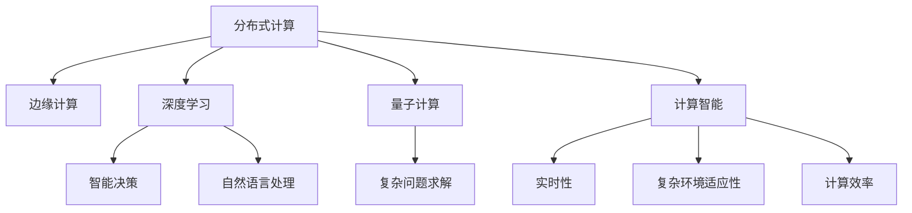

                 

# 构建更智能的世界：人类计算的应用场景

> 关键词：人工智能,计算智能,人类计算,深度学习,分布式计算,边缘计算,量子计算

## 1. 背景介绍

### 1.1 问题由来
人类计算（Human Computing）作为智能技术的一个重要方向，其核心是将人类的智慧与计算能力相结合，通过先进的算法和技术手段，在智能决策、自然语言处理、计算机视觉等领域实现超越人类水平的智能应用。在当今数字化和智能化的时代背景下，人类计算技术的应用范围和深度日益广泛，对人类生活的影响也越来越深远。

然而，传统的计算方式往往依赖于通用计算机和互联网基础设施，难以满足某些实时性要求高、计算量大的特殊场景。为了应对这些挑战，人们提出了各种新型计算模式，如分布式计算、边缘计算、量子计算等。这些计算模式充分利用了计算资源的分布性和多样性，为实现更智能的世界提供了新的途径。

### 1.2 问题核心关键点
人类计算技术的关键点在于将复杂计算任务分散到多种计算资源上，充分利用这些资源的异构性和分布性，以实现更高效、更智能的计算解决方案。人类计算不仅限于分布式和边缘计算，还包括对计算智能和深度学习等前沿技术的深度整合和应用。

1. **分布式计算**：通过多台计算机协作处理计算任务，有效提高计算效率，实现更大规模的数据处理和复杂计算。
2. **边缘计算**：将计算资源部署在数据源附近，减少数据传输延迟，提高实时性，适用于物联网、自动驾驶等领域。
3. **深度学习**：利用神经网络模型，通过大量数据进行训练，自动提取特征和规律，实现高效的智能决策和自然语言处理。
4. **量子计算**：利用量子比特的叠加和纠缠特性，实现更快速的数据处理和复杂问题的求解，有望在未来实现计算能力的革命性突破。

这些技术之间的相互结合，为构建更智能的世界提供了强有力的支持。

### 1.3 问题研究意义
研究人类计算的应用场景，对于推动计算技术和智能技术的发展，提升计算效率和智能水平，具有重要的理论和实践意义：

1. **提升计算效率**：通过分布式和边缘计算，能够在原有计算资源的基础上，大幅提升计算速度和处理能力，满足大规模数据的实时分析和处理需求。
2. **增强智能决策能力**：深度学习等智能技术的应用，使得计算系统具备更强的自我学习和优化能力，能够在复杂环境中进行高效智能决策。
3. **优化计算资源分配**：人类计算技术能够动态调整计算资源的分配策略，实现计算任务的智能化管理，提升资源利用率。
4. **促进产业升级**：计算技术的进步，将为各行各业带来全新的技术赋能，加速产业数字化转型和智能化升级。
5. **激发创新潜力**：计算智能的拓展，将激发更多创新灵感，推动计算技术在更多领域的应用和突破。

## 2. 核心概念与联系

### 2.1 核心概念概述

为更好地理解人类计算的应用场景，本节将介绍几个核心概念及其相互之间的关系：

- **分布式计算**：通过多台计算机协作处理计算任务，实现计算资源的有效利用和负载均衡。
- **边缘计算**：将计算资源部署在数据源附近，减少数据传输延迟，提升实时性。
- **深度学习**：利用神经网络模型，通过大量数据进行训练，实现高效的智能决策和自然语言处理。
- **量子计算**：利用量子比特的叠加和纠缠特性，实现更快速的数据处理和复杂问题的求解。
- **计算智能**：融合了多种计算技术，能够在复杂环境中实现高效、智能的计算和决策。

这些概念之间的逻辑关系可以通过以下Mermaid流程图来展示：



这个流程图展示了几大核心概念及其之间的相互关系：

1. 分布式计算、边缘计算和量子计算提供了高效、灵活的计算资源，是实现计算智能和深度学习的基础。
2. 深度学习模型通过大规模数据训练，提取特征和规律，用于智能决策和自然语言处理。
3. 计算智能通过融合多种计算技术，实现了高效、智能的计算和决策。
4. 智能决策和自然语言处理是计算智能在不同领域的具体应用，如智能客服、医疗诊断、智能交通等。
5. 量子计算和深度学习共同推动了复杂问题求解的突破，如药物设计、优化问题、图像识别等。

这些概念共同构成了人类计算的应用框架，为实现更智能的世界提供了强有力的技术支持。

## 3. 核心算法原理 & 具体操作步骤
### 3.1 算法原理概述

人类计算的核心算法原理主要包括以下几个方面：

1. **分布式计算**：通过多台计算机的并行处理，实现计算任务的高效执行。分布式计算框架包括Hadoop、Spark等，支持大规模数据的并行处理。
2. **边缘计算**：将计算资源部署在数据源附近，减少数据传输延迟，提升实时性。边缘计算平台如AWS Greengrass、Microsoft Azure IoT Edge等。
3. **深度学习**：利用神经网络模型，通过大量数据进行训练，实现高效的智能决策和自然语言处理。深度学习框架如TensorFlow、PyTorch等。
4. **量子计算**：利用量子比特的叠加和纠缠特性，实现更快速的数据处理和复杂问题的求解。量子计算平台如Google Sycamore、IBM Q System One等。

这些计算技术通过相互结合，共同实现高效、智能的计算和决策。

### 3.2 算法步骤详解

人类计算的核心算法步骤主要包括以下几个方面：

1. **数据准备**：收集和整理需要处理的数据，包括数据清洗、特征提取、数据分割等步骤。
2. **分布式处理**：将数据分配到多台计算机上进行并行处理，实现计算任务的高效执行。
3. **边缘计算**：将计算资源部署在数据源附近，减少数据传输延迟，提升实时性。
4. **深度学习模型训练**：利用神经网络模型，通过大量数据进行训练，实现高效的智能决策和自然语言处理。
5. **量子计算应用**：在特定场景下，利用量子计算技术进行复杂问题的求解，实现计算能力的革命性突破。
6. **计算智能应用**：将分布式计算、深度学习、边缘计算、量子计算等技术融合，实现高效、智能的计算和决策。

这些步骤通过合理的算法设计和技术手段，共同实现了高效、智能的计算和决策。

### 3.3 算法优缺点

人类计算技术具有以下优点：

1. **高效性**：通过分布式和边缘计算，能够在原有计算资源的基础上，大幅提升计算速度和处理能力，满足大规模数据的实时分析和处理需求。
2. **灵活性**：能够根据具体场景动态调整计算资源的分配策略，实现计算任务的智能化管理。
3. **广泛适用性**：适用于各种复杂环境下的计算任务，如智能交通、自动驾驶、医疗诊断等。
4. **计算智能**：通过深度学习等智能技术的应用，使得计算系统具备更强的自我学习和优化能力，能够在复杂环境中进行高效智能决策。

同时，该技术也存在一定的局限性：

1. **资源需求高**：需要大量的计算资源和存储空间，包括高性能计算机、存储设备和网络带宽等。
2. **技术门槛高**：涉及多种计算技术，需要高水平的技术支持和专业人才。
3. **数据依赖性强**：依赖于大规模、高质量的数据，数据质量和数量的波动可能影响计算效果。
4. **安全性和隐私保护**：涉及大量敏感数据的处理，需要严格的数据保护和安全措施。

尽管存在这些局限性，但就目前而言，人类计算技术仍是最先进、最有效的计算方法之一，广泛应用于各个领域。

### 3.4 算法应用领域

人类计算技术在多个领域已经得到了广泛的应用，例如：

- **智能交通**：通过分布式计算和边缘计算，实现实时交通数据处理和智能调度，提升交通管理效率。
- **自动驾驶**：利用深度学习和量子计算技术，实现车辆智能感知和决策，提升行车安全和效率。
- **医疗诊断**：通过分布式计算和深度学习模型，实现大规模医疗数据的快速分析和智能诊断，提升医疗水平。
- **金融分析**：利用分布式计算和深度学习模型，实现大规模金融数据的实时分析和预测，提升金融决策能力。
- **物联网**：通过边缘计算技术，实现实时数据处理和智能决策，提升物联网设备的智能化水平。
- **环境保护**：利用分布式计算和深度学习模型，实现环境数据的实时监测和智能分析，提升环境保护能力。

这些应用场景展示了人类计算技术的广泛应用和巨大潜力，为实现更智能的世界提供了重要支撑。

## 4. 数学模型和公式 & 详细讲解  
### 4.1 数学模型构建

人类计算的核心数学模型主要包括以下几个方面：

1. **分布式计算模型**：包括MapReduce、Spark等，用于实现大规模数据的并行处理。
2. **边缘计算模型**：包括IoT设备与云计算的结合，用于实现实时数据处理和智能决策。
3. **深度学习模型**：包括神经网络、卷积神经网络、循环神经网络等，用于实现高效的智能决策和自然语言处理。
4. **量子计算模型**：包括量子比特的叠加和纠缠特性，用于实现复杂问题的求解。

这些数学模型通过合理的算法设计和技术手段，共同实现了高效、智能的计算和决策。

### 4.2 公式推导过程

以下我们以分布式计算中的MapReduce模型为例，推导其计算过程及其优势。

假设有一个大规模数据集 $D$，需要进行数据处理和计算。使用MapReduce模型，将数据集 $D$ 分成若干个小数据块 $D_1, D_2, ..., D_n$，并分配到多台计算机上并行处理。假设共有 $m$ 台计算机参与计算。

1. **Map阶段**：每台计算机对分块数据 $D_i$ 进行处理，得到中间结果 $M_i$。
2. **Shuffle阶段**：将中间结果 $M_i$ 按照某个规则合并，得到新的数据块 $C_j$，其中 $j=1,2,...,k$。
3. **Reduce阶段**：对合并后的数据块 $C_j$ 进行汇总计算，得到最终结果 $R$。

计算过程可以表示为：

$$
R = Reduce(\bigcup_{j=1}^{k} C_j)
$$

其中 $Reduce$ 函数用于对数据块进行汇总计算，可以采用并行计算或分布式计算等技术。

MapReduce模型具有以下优点：

1. **高效性**：通过并行处理，能够在大规模数据集上实现高效计算。
2. **可扩展性**：可以根据实际需求动态调整计算机数量，实现计算资源的灵活分配。
3. **容错性**：具有自动故障检测和恢复机制，保证计算过程的可靠性。

这些优点使得MapReduce模型在分布式计算中具有广泛的应用。

### 4.3 案例分析与讲解

下面以智能交通中的实时数据处理为例，展示MapReduce模型在人类计算中的应用。

假设有一份实时交通数据集 $D$，包括车辆位置、车速、路线等信息。使用MapReduce模型，将数据集 $D$ 分成若干个小数据块 $D_1, D_2, ..., D_n$，并分配到多台计算机上并行处理。假设共有 $m$ 台计算机参与计算。

1. **Map阶段**：每台计算机对分块数据 $D_i$ 进行处理，得到中间结果 $M_i$。例如，计算每辆车的平均车速和最大车速。
2. **Shuffle阶段**：将中间结果 $M_i$ 按照某个规则合并，得到新的数据块 $C_j$，其中 $j=1,2,...,k$。例如，按照路线进行合并，得到每条路线的平均车速和最大车速。
3. **Reduce阶段**：对合并后的数据块 $C_j$ 进行汇总计算，得到最终结果 $R$。例如，计算每条路线的平均车速和最大车速，并生成交通热力图。

计算过程可以表示为：

$$
R = Reduce(\bigcup_{j=1}^{k} C_j)
$$

MapReduce模型在智能交通中的应用，展示了其在分布式计算中的高效性和可扩展性。通过实时处理大量交通数据，可以实现智能交通管理，提升交通管理效率。

## 5. 项目实践：代码实例和详细解释说明
### 5.1 开发环境搭建

在进行人类计算的实践前，我们需要准备好开发环境。以下是使用Python进行MapReduce开发的环境配置流程：

1. 安装Anaconda：从官网下载并安装Anaconda，用于创建独立的Python环境。

2. 创建并激活虚拟环境：
```bash
conda create -n mapreduce-env python=3.8 
conda activate mapreduce-env
```

3. 安装PySpark：从官网下载并安装Apache Spark，用于分布式计算。
```bash
conda install pyspark -c conda-forge
```

4. 安装各类工具包：
```bash
pip install numpy pandas scikit-learn matplotlib tqdm jupyter notebook ipython
```

完成上述步骤后，即可在`mapreduce-env`环境中开始人类计算的实践。

### 5.2 源代码详细实现

下面我们以智能交通中的实时数据处理为例，给出使用PySpark进行MapReduce计算的Python代码实现。

首先，定义数据处理函数：

```python
from pyspark.sql import SparkSession

spark = SparkSession.builder.appName("TrafficDataProcessing").getOrCreate()

def process_traffic_data(df):
    # 数据处理逻辑，例如计算每辆车的平均车速和最大车速
    ...

    # 将数据合并，按照路线进行分组
    ...

    # 汇总计算，生成交通热力图
    ...
```

然后，读取数据集并执行MapReduce计算：

```python
from pyspark.sql.functions import col, avg, max

# 读取数据集
traffic_df = spark.read.csv("traffic_data.csv", header=True, inferSchema=True)

# 对数据进行处理，例如计算每辆车的平均车速和最大车速
processed_df = traffic_df.map(lambda row: (row['id'], (row['speed_avg'], row['speed_max']))

# 将数据合并，按照路线进行分组
grouped_df = processed_df.reduceByKey(lambda x, y: (x[0], x[1], y[0], y[1]))

# 汇总计算，生成交通热力图
result_df = grouped_df.agg(col("key").alias("route"), col("value1").alias("avg_speed"), col("value2").alias("max_speed"))

# 输出结果
result_df.show()
```

以上就是使用PySpark进行MapReduce计算的完整代码实现。可以看到，得益于Spark的强大分布式计算能力，MapReduce的实现变得简洁高效。

### 5.3 代码解读与分析

让我们再详细解读一下关键代码的实现细节：

**process_traffic_data函数**：
- 定义数据处理逻辑，例如计算每辆车的平均车速和最大车速。
- 将数据合并，按照路线进行分组。
- 汇总计算，生成交通热力图。

**代码实现**：
- 使用PySpark的`map`函数对数据进行Map阶段处理，每个分区（Partition）进行计算。
- 使用`reduceByKey`函数对Map阶段输出的中间结果进行Shuffle和Reduce阶段处理，实现数据合并和汇总计算。
- 使用`agg`函数对汇总结果进行计算，生成最终的交通热力图。

通过MapReduce模型，可以实现高效、智能的实时数据处理和分析，为智能交通管理提供强有力的技术支持。

当然，工业级的系统实现还需考虑更多因素，如大数据量的分布式存储和检索、高并发的数据处理、数据质量的控制等。但核心的MapReduce范式基本与此类似。

## 6. 实际应用场景
### 6.1 智能交通

人类计算技术在智能交通领域的应用非常广泛，主要体现在以下几个方面：

- **实时交通数据处理**：通过分布式计算和边缘计算，实现实时交通数据的快速处理和分析。例如，实时计算每条路线的平均车速和最大车速，生成交通热力图。
- **智能调度系统**：利用深度学习模型进行交通流预测，实现智能交通调度。例如，根据预测的交通流量，自动调整信号灯时长，优化交通流量。
- **自动驾驶技术**：通过分布式计算和深度学习模型，实现车辆智能感知和决策。例如，通过实时处理传感器数据，进行环境感知和行为预测，实现自动驾驶。

这些应用展示了人类计算技术在智能交通领域的重要作用，为实现更智能的交通管理提供了强有力的支持。

### 6.2 医疗诊断

人类计算技术在医疗诊断领域的应用主要体现在以下几个方面：

- **大规模医疗数据处理**：通过分布式计算和深度学习模型，实现大规模医疗数据的快速分析和智能诊断。例如，实时处理患者数据，生成诊断报告。
- **疾病预测和预警**：利用深度学习模型进行疾病预测和预警，提升医疗水平。例如，根据患者历史数据和实时数据，预测疾病的发生概率，及时预警。
- **个性化医疗**：通过分布式计算和深度学习模型，实现个性化医疗方案的制定。例如，根据患者的基因数据和生活习惯，制定个性化的治疗方案。

这些应用展示了人类计算技术在医疗诊断领域的重要作用，为实现更智能的医疗服务提供了强有力的支持。

### 6.3 智能客服

人类计算技术在智能客服领域的应用主要体现在以下几个方面：

- **自然语言处理**：通过深度学习模型，实现自然语言理解和生成，提升智能客服的交互体验。例如，自动理解用户意图，生成回复。
- **智能推荐系统**：利用分布式计算和深度学习模型，实现个性化推荐。例如，根据用户的历史行为数据，推荐相关产品或服务。
- **知识图谱应用**：通过知识图谱技术，实现智能客服的上下文理解和知识查询。例如，根据用户提出的问题，查询相关知识库，生成回答。

这些应用展示了人类计算技术在智能客服领域的重要作用，为实现更智能的客户服务提供了强有力的支持。

### 6.4 未来应用展望

随着人类计算技术的不断进步，其在各个领域的应用前景将更加广阔：

- **智能城市**：利用边缘计算和分布式计算，实现城市环境的智能化管理。例如，实时处理城市监控数据，实现智能安防、智能照明等。
- **工业互联网**：通过边缘计算和分布式计算，实现工业设备的智能监测和维护。例如，实时处理工业设备数据，实现智能预测和故障诊断。
- **智慧农业**：利用分布式计算和深度学习模型，实现农业生产的智能化管理。例如，实时处理农业传感器数据，实现智能灌溉、智能施肥等。
- **智能制造**：通过分布式计算和深度学习模型，实现制造业的智能化生产。例如，实时处理生产线数据，实现智能调度、智能检测等。

未来，人类计算技术将在更多领域得到应用，为实现更智能的世界提供强有力的技术支持。

## 7. 工具和资源推荐
### 7.1 学习资源推荐

为了帮助开发者系统掌握人类计算的理论基础和实践技巧，这里推荐一些优质的学习资源：

1. 《分布式计算原理与实践》系列博文：由人类计算专家撰写，深入浅出地介绍了分布式计算的基本原理和应用场景。

2. 《边缘计算技术与应用》课程：物联网技术领域的经典课程，详细讲解了边缘计算的基本概念和应用实践。

3. 《深度学习与人类计算》书籍：介绍了深度学习在人类计算中的应用，涵盖了从基础到高级的多个知识点。

4. 《量子计算原理与技术》课程：量子计算领域的经典课程，详细讲解了量子计算的基本原理和应用实践。

5. 《人类计算技术与应用》博客：汇集了最新的研究进展和实践案例，展示了人类计算技术的广泛应用。

通过对这些资源的学习实践，相信你一定能够快速掌握人类计算的核心技术，并用于解决实际的计算问题。

### 7.2 开发工具推荐

高效的开发离不开优秀的工具支持。以下是几款用于人类计算开发的常用工具：

1. Apache Spark：分布式计算框架，支持大规模数据的并行处理。
2. Amazon AWS Greengrass：边缘计算平台，将计算资源部署在数据源附近，提升实时性。
3. TensorFlow：深度学习框架，支持大规模神经网络的训练和推理。
4. PySpark：基于Spark的Python API，支持分布式计算和深度学习模型训练。
5. IBM Q Experience：量子计算平台，提供量子计算的开发和实验环境。
6. Jupyter Notebook：数据科学和机器学习的交互式开发环境，支持多种编程语言和数据处理库。

合理利用这些工具，可以显著提升人类计算任务的开发效率，加快创新迭代的步伐。

### 7.3 相关论文推荐

人类计算技术的发展源于学界的持续研究。以下是几篇奠基性的相关论文，推荐阅读：

1. "MapReduce: Simplified Data Processing on Large Clusters"：谷歌提出的MapReduce框架，奠定了分布式计算的基础。

2. "An End-to-End Task Reasoning Framework for Smart Traffic Management"：利用深度学习模型和分布式计算，实现智能交通管理。

3. "Scalable Distributed Machine Learning with TensorFlow"：利用TensorFlow实现大规模机器学习的分布式计算。

4. "A Quantum Supremacy Route Based on the Quantum Volume"：谷歌提出的量子计算 supremacy 路线图，展示了量子计算的前景。

5. "Human-Computer Interaction: Cooperative, Distributed, and Hyper-Intelligent"：探讨了人类计算技术的发展方向和应用前景。

这些论文代表了大计算技术的发展脉络。通过学习这些前沿成果，可以帮助研究者把握学科前进方向，激发更多的创新灵感。

## 8. 总结：未来发展趋势与挑战
### 8.1 总结

本文对人类计算的应用场景进行了全面系统的介绍。首先阐述了人类计算技术的背景和意义，明确了其在智能决策、自然语言处理、计算机视觉等领域的重要作用。其次，从原理到实践，详细讲解了分布式计算、边缘计算、深度学习等核心算法的实现过程，给出了人类计算任务开发的完整代码实例。同时，本文还广泛探讨了人类计算技术在智能交通、医疗诊断、智能客服等多个行业领域的应用前景，展示了其广泛的应用和巨大的潜力。此外，本文精选了人类计算技术的各类学习资源，力求为读者提供全方位的技术指引。

通过本文的系统梳理，可以看到，人类计算技术正在成为智能化技术的重要支撑，极大地拓展了计算资源的应用范围，催生了更多的落地场景。受益于大规模计算资源的有效利用，人类计算技术将进一步提升计算效率和智能水平，推动计算技术在各行各业的应用和突破。未来，伴随计算智能和深度学习等前沿技术的深度整合，人类计算技术必将在更多领域得到广泛应用，为构建更智能的世界提供强有力的技术支持。

### 8.2 未来发展趋势

展望未来，人类计算技术将呈现以下几个发展趋势：

1. **计算智能进一步普及**：深度学习等智能技术将进一步普及，实现更高效、智能的计算和决策。
2. **边缘计算的广泛应用**：边缘计算将进一步普及，提升实时性和数据安全性，实现更智能的应用场景。
3. **量子计算的突破**：量子计算将逐步成熟，实现更快速的数据处理和复杂问题的求解。
4. **分布式计算的优化**：分布式计算框架将进一步优化，提升计算效率和系统可靠性。
5. **跨领域融合**：人类计算技术将与其他前沿技术（如物联网、人工智能等）进行更深入的融合，实现更多创新应用。

这些趋势凸显了人类计算技术的广阔前景，为实现更智能的世界提供了强有力的技术支撑。

### 8.3 面临的挑战

尽管人类计算技术已经取得了瞩目成就，但在迈向更加智能化、普适化应用的过程中，它仍面临着诸多挑战：

1. **资源需求高**：需要大量的计算资源和存储空间，包括高性能计算机、存储设备和网络带宽等。
2. **技术门槛高**：涉及多种计算技术，需要高水平的技术支持和专业人才。
3. **数据依赖性强**：依赖于大规模、高质量的数据，数据质量和数量的波动可能影响计算效果。
4. **安全性和隐私保护**：涉及大量敏感数据的处理，需要严格的数据保护和安全措施。
5. **跨领域融合难度**：与其他前沿技术的深度整合，需要克服技术和架构上的复杂性。

尽管存在这些挑战，但就目前而言，人类计算技术仍是最先进、最有效的计算方法之一，广泛应用于各个领域。

### 8.4 研究展望

面对人类计算技术所面临的挑战，未来的研究需要在以下几个方面寻求新的突破：

1. **优化资源利用**：通过算法和架构的优化，提高资源利用率，降低计算成本。
2. **提升数据质量**：加强数据清洗和预处理，提高数据质量，提升计算效果。
3. **增强安全性**：加强数据保护和安全措施，提升系统安全性，保障数据隐私。
4. **促进跨领域融合**：与其他前沿技术进行更深入的融合，实现更多创新应用。
5. **探索新技术**：探索新型的计算模式和技术手段，提升计算效率和智能水平。

这些研究方向的探索，必将引领人类计算技术迈向更高的台阶，为构建更智能的世界提供强有力的技术支撑。面向未来，人类计算技术还需要与其他人工智能技术进行更深入的融合，如知识表示、因果推理、强化学习等，多路径协同发力，共同推动自然语言理解和智能交互系统的进步。只有勇于创新、敢于突破，才能不断拓展计算技术的边界，让智能技术更好地造福人类社会。

## 9. 附录：常见问题与解答

**Q1：人类计算技术的核心优势是什么？**

A: 人类计算技术的核心优势在于其高效性、灵活性和智能性。通过分布式计算、边缘计算和量子计算等技术手段，能够在复杂环境中实现高效、智能的计算和决策。与传统的通用计算相比，人类计算技术具有更高的计算效率和更好的适应性。

**Q2：如何提高人类计算的资源利用效率？**

A: 提高人类计算的资源利用效率，主要从以下几个方面入手：
1. **优化算法**：采用高效的计算算法，减少资源消耗。
2. **并行计算**：利用多台计算机进行并行计算，提升计算速度。
3. **分布式存储**：采用分布式存储技术，减少数据传输延迟，提升实时性。
4. **资源调度**：动态调整计算资源的分配策略，实现资源的优化利用。
5. **数据压缩**：采用数据压缩技术，减少数据存储和传输的资源消耗。

这些措施可以通过合理的算法设计和架构优化，显著提高人类计算的资源利用效率。

**Q3：人类计算技术在医疗诊断中的应用前景如何？**

A: 人类计算技术在医疗诊断领域具有广泛的应用前景，主要体现在以下几个方面：
1. **大规模医疗数据处理**：通过分布式计算和深度学习模型，实现大规模医疗数据的快速分析和智能诊断。
2. **疾病预测和预警**：利用深度学习模型进行疾病预测和预警，提升医疗水平。
3. **个性化医疗**：通过分布式计算和深度学习模型，实现个性化医疗方案的制定。
4. **智能医疗助手**：利用自然语言处理技术，实现智能医疗助手的功能，提升医疗服务体验。

这些应用展示了人类计算技术在医疗诊断领域的重要作用，为实现更智能的医疗服务提供了强有力的支持。

**Q4：量子计算在人类计算中的应用前景如何？**

A: 量子计算在人类计算中的应用前景非常广阔，主要体现在以下几个方面：
1. **加速复杂问题求解**：量子计算利用量子比特的叠加和纠缠特性，能够实现更快速的数据处理和复杂问题的求解。
2. **提升加密安全性**：量子计算的强大计算能力，能够破解现有加密算法，提升数据安全性和隐私保护。
3. **优化系统设计**：量子计算技术可以用于优化系统设计，提升系统的效率和可靠性。
4. **促进跨领域融合**：量子计算技术可以与其他前沿技术进行更深入的融合，实现更多创新应用。

这些应用展示了量子计算在人类计算领域的重要作用，为实现更智能的世界提供了强有力的技术支撑。

**Q5：如何实现人类计算技术的商业化应用？**

A: 实现人类计算技术的商业化应用，主要从以下几个方面入手：
1. **技术积累**：加强技术积累和创新，提升技术的成熟度和稳定性。
2. **市场需求分析**：深入了解市场需求和客户痛点，针对性地开发解决方案。
3. **商业模式设计**：设计合理的商业模式，实现技术价值的最大化。
4. **合作伙伴关系**：建立与各类合作伙伴的关系，形成完整的生态系统。
5. **市场推广**：通过市场推广和营销，提升技术的应用范围和影响力。

通过这些措施，可以实现人类计算技术的商业化应用，为实现更智能的世界提供强有力的技术支撑。

---

作者：禅与计算机程序设计艺术 / Zen and the Art of Computer Programming

