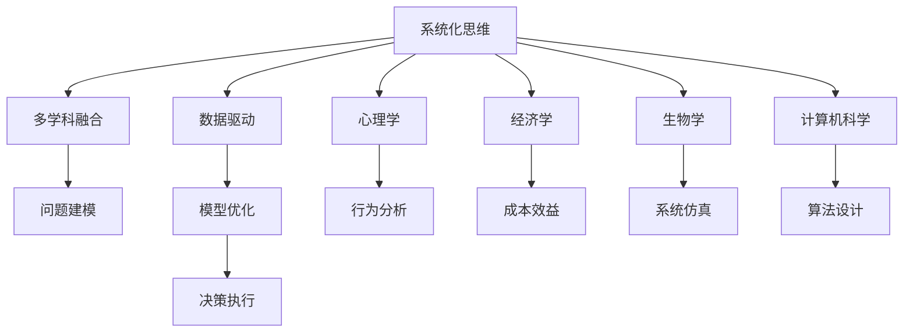

                 

## 1. 背景介绍

查理芒格，是著名投资者沃伦巴菲特的重要合作伙伴，被誉为"幕后智脑"，与巴菲特共同创造了伯克希尔-哈撒韦投资公司（Berkshire Hathaway）的辉煌业绩。他不仅是成功的投资者，更是杰出的思想家、哲学家、教育家和作家，其著作《穷查理宝典》中记录了他独特的思维模型和决策方法。

在《穷查理宝典》中，查理芒格谈到了他通过长期阅读，逐渐建立并运用了100多个思维模型。这些思维模型涵盖了从科学、哲学、经济学到心理学、计算机科学等多个领域，帮助他构建了强大的知识体系，形成了独特的思维框架。这些模型不仅可以用于投资决策，还能广泛应用于日常决策、科技创新、团队管理和个人成长等多个方面。

本文旨在通过介绍查理芒格的100种思维模型，探讨其在人工智能、编程和软件开发等IT领域的实际应用，提供全面的知识框架和实践指导，帮助IT从业者提升思维能力，创新技术，实现个人与团队的持续进步。

## 2. 核心概念与联系

### 2.1 核心概念概述

查理芒格的100种思维模型，涉及多个学科领域，包括心理学、经济学、生物学、计算机科学等。这些模型提供了一套系统性的思维方式，涵盖如何思考问题、分析数据、决策规划等方面，是查理芒格成功投资的重要工具。

在IT领域，这些模型可以应用于编程思维、算法设计、系统架构、项目管理等多个方面。了解这些模型，可以提升开发者的综合素养，促进技术创新和团队协作。

### 2.2 核心概念原理和架构的 Mermaid 流程图



这个流程图展示了查理芒格的思维模型架构，从系统化思维出发，通过多学科融合、问题建模、数据驱动、模型优化和决策执行等多个环节，最终实现科学、高效的决策。其中，心理学的行为分析和经济学的成本效益分析，是IT领域中非常重要的两个维度。

## 3. 核心算法原理 & 具体操作步骤

### 3.1 算法原理概述

查理芒格的思维模型主要关注问题的建模和解决，而非特定的算法原理。这些模型强调如何从多个角度分析问题，综合运用知识解决复杂任务。

以心理学中的“禀赋效应”为例，这是一种人们对自己拥有的物品估值高于他人的心理现象。在软件开发中，这个模型可以应用于产品设计和用户体验优化，避免过度强调已有产品特性，忽视用户需求。

### 3.2 算法步骤详解

以下是查理芒格思维模型在IT领域应用的详细步骤：

1. **问题定义**：明确任务目标和核心需求。
2. **多学科分析**：结合心理学、经济学、生物学和计算机科学等领域的知识，综合分析问题。
3. **模型构建**：根据分析结果，构建合适的思维模型。
4. **数据驱动**：收集相关数据，进行模型验证和调整。
5. **模型优化**：基于数据反馈，优化模型参数。
6. **决策执行**：根据模型结果，制定和执行决策方案。
7. **效果评估**：评估决策结果，进行后续改进。

### 3.3 算法优缺点

**优点**：
- **多角度分析**：涵盖多个学科领域的知识，有助于全面理解问题。
- **系统性思考**：通过模型构建和数据驱动，形成系统化的解决方案。
- **迭代优化**：通过不断的模型调整和数据验证，逐步优化决策。

**缺点**：
- **复杂性高**：涉及多个学科知识，可能需要较长时间学习和理解。
- **实践门槛高**：模型构建和数据处理需要专业知识，适用性有一定局限。
- **资源消耗大**：模型优化和数据驱动可能需要大量计算资源。

### 3.4 算法应用领域

查理芒格的思维模型广泛应用于以下几个IT领域：

- **软件开发**：问题建模、算法设计、系统架构等。
- **人工智能**：模型训练、数据处理、应用部署等。
- **数据分析**：数据挖掘、统计分析、机器学习等。
- **项目管理**：任务分配、风险评估、团队协作等。
- **技术创新**：新产品开发、技术路线规划、创新驱动等。

## 4. 数学模型和公式 & 详细讲解 & 举例说明

### 4.1 数学模型构建

在IT领域，数学模型和公式的应用极为广泛，涉及算法、数据处理、优化等多个方面。以线性回归模型为例，其数学表达式为：

$$ y = \theta_0 + \theta_1 x_1 + \theta_2 x_2 + \cdots + \theta_n x_n $$

其中，$y$ 为输出变量，$x_i$ 为输入变量，$\theta_i$ 为模型参数。

### 4.2 公式推导过程

线性回归模型的推导过程如下：
1. 假设数据集 $D=\{(x_i,y_i)\}_{i=1}^N$，其中 $x_i=(x_{i1},x_{i2},\cdots,x_{in})$，$y_i$ 为连续变量。
2. 最小化损失函数 $L(\theta) = \frac{1}{2N}\sum_{i=1}^N(y_i - \hat{y_i})^2$，其中 $\hat{y_i} = \theta_0 + \theta_1 x_{i1} + \theta_2 x_{i2} + \cdots + \theta_n x_{in}$。
3. 对损失函数求导，得到梯度下降算法更新参数的公式：

$$ \theta_i = \theta_i - \frac{\alpha}{N}\sum_{i=1}^N(\theta_0 + \theta_1 x_{i1} + \theta_2 x_{i2} + \cdots + \theta_n x_{in} - y_i)(x_i)_i $$

其中，$\alpha$ 为学习率。

### 4.3 案例分析与讲解

假设有一个电商网站的销售数据，目标是预测下个月某产品的销量。可以构建线性回归模型，以历史销量、季节性因素、促销活动等作为输入变量，预测下个月的销量。具体步骤如下：

1. 收集数据：历史销量、季节性因素（如节假日、季节等）、促销活动等。
2. 数据预处理：数据清洗、归一化、特征工程等。
3. 模型训练：使用线性回归模型，训练模型参数。
4. 模型评估：使用交叉验证、R²等指标评估模型性能。
5. 预测应用：将下个月的促销活动和季节性因素输入模型，预测销量。

## 5. 项目实践：代码实例和详细解释说明

### 5.1 开发环境搭建

Python是目前最流行的编程语言之一，广泛应用于数据科学和机器学习领域。以下是在Python环境下搭建开发环境的步骤：

1. 安装Anaconda：从官网下载并安装Anaconda，用于创建独立的Python环境。
2. 创建并激活虚拟环境：
```bash
conda create -n py3k python=3.8 
conda activate py3k
```
3. 安装必要的Python包：
```bash
pip install pandas numpy scikit-learn matplotlib seaborn
```
4. 安装Jupyter Notebook：
```bash
pip install jupyterlab
```

完成上述步骤后，即可在`py3k`环境中开始项目实践。

### 5.2 源代码详细实现

以下是一个简单的线性回归模型实现，用于预测电商产品的销量：

```python
import pandas as pd
import numpy as np
from sklearn.linear_model import LinearRegression
from sklearn.model_selection import train_test_split
from sklearn.metrics import r2_score

# 读取数据
data = pd.read_csv('sales_data.csv')

# 数据预处理
X = data[['促销活动', '季节性因素']]  # 特征变量
y = data['销量']  # 目标变量

# 数据拆分
X_train, X_test, y_train, y_test = train_test_split(X, y, test_size=0.2, random_state=42)

# 模型训练
model = LinearRegression()
model.fit(X_train, y_train)

# 模型评估
y_pred = model.predict(X_test)
r2 = r2_score(y_test, y_pred)
print(f'R² score: {r2:.2f}')

# 预测应用
new_data = pd.DataFrame({
    '促销活动': 1,
    '季节性因素': 1
})
y_new = model.predict(new_data)
print(f'预测销量: {y_new[0]}')
```

### 5.3 代码解读与分析

**数据预处理**：
- 数据清洗：去除异常值、处理缺失值等。
- 特征工程：选择合适的特征变量，进行归一化、编码等处理。

**模型训练**：
- 使用sklearn库的LinearRegression模型，通过fit方法训练模型参数。

**模型评估**：
- 使用R² score评估模型预测精度，R²越接近1，说明模型预测效果越好。

**预测应用**：
- 将新的促销活动和季节性因素输入模型，得到销量预测结果。

## 6. 实际应用场景

### 6.1 电商推荐系统

在电商推荐系统中，查理芒格的思维模型可以帮助开发者更好地理解用户行为，构建个性化推荐模型。通过分析用户的购买历史、浏览记录、评价信息等，构建多维度的用户画像，进而预测用户可能感兴趣的商品。

**步骤**：
1. 收集用户行为数据。
2. 构建用户画像，使用心理学和行为分析模型，理解用户偏好。
3. 使用经济学中的成本效益模型，评估不同推荐策略的ROI。
4. 应用线性回归等算法，预测用户可能感兴趣的商品，进行推荐。

### 6.2 人工智能风险管理

在人工智能项目中，查理芒格的思维模型可以用于风险管理和决策优化。通过多学科综合分析，识别潜在风险，制定相应的风险控制策略。

**步骤**：
1. 识别潜在风险，如算法偏见、数据泄露、安全漏洞等。
2. 应用心理学中的行为分析模型，理解用户对系统反应的预期和感知。
3. 应用经济学的成本效益模型，评估风险控制的投入产出比。
4. 应用生物学的系统仿真模型，进行风险场景模拟和应对策略优化。

### 6.3 软件系统设计

在软件系统设计中，查理芒格的思维模型可以用于问题建模和系统架构设计。通过多学科综合分析，理解系统需求，构建科学合理的设计方案。

**步骤**：
1. 分析系统需求，明确核心功能和关键性能指标。
2. 应用心理学的行为分析模型，理解用户使用系统的期望和反馈。
3. 应用经济学的成本效益模型，评估不同设计方案的经济性。
4. 应用生物学的系统仿真模型，进行系统架构的迭代优化。

### 6.4 未来应用展望

未来，随着大数据、人工智能技术的不断发展，查理芒格的思维模型将进一步应用于各个领域。例如，在智能医疗领域，可以应用多学科模型，构建个性化的健康管理方案；在金融领域，可以应用经济学和行为分析模型，优化投资决策和风险控制策略。

## 7. 工具和资源推荐

### 7.1 学习资源推荐

为了帮助开发者全面掌握查理芒格的思维模型，推荐以下学习资源：

1. 《穷查理宝典》：查理芒格的主要著作，详细介绍了他的思维模型和决策方法。
2. Coursera《行为经济学》课程：斯坦福大学教授讲授的行为经济学课程，涵盖心理学的行为分析和经济学的决策理论。
3. edX《线性代数基础》课程：麻省理工学院讲授的线性代数课程，深入讲解线性代数的基本原理和应用。
4. Kaggle机器学习竞赛：参与机器学习竞赛，应用实际数据集，提升模型的应用能力。
5. GitHub开源项目：参与开源项目，学习他人的代码实现和经验分享。

### 7.2 开发工具推荐

查理芒格的思维模型适用于多种IT工具和平台，以下是推荐的工具：

1. Jupyter Notebook：Python数据分析和机器学习的常用工具，支持代码调试和数据可视化。
2. TensorFlow：谷歌开发的深度学习框架，支持多种模型训练和优化算法。
3. Scikit-learn：Python的机器学习库，包含丰富的模型算法和评估工具。
4. GitHub：开源代码托管平台，支持代码版本控制和团队协作。
5. JIRA：项目管理工具，支持任务分配、进度跟踪和问题追踪。

### 7.3 相关论文推荐

以下几篇论文详细介绍了查理芒格的思维模型在IT领域的实际应用：

1. "A Bayesian Network Approach to Predicting Customer Churn in E-Commerce"：使用贝叶斯网络进行客户流失预测。
2. "Behavioral Risk Management in Financial Systems"：基于行为分析的金融风险管理。
3. "Applying Multi-Disciplinary Thinking in Software System Design"：应用多学科模型进行软件系统设计。
4. "Machine Learning Model Selection Using Multi-Criteria Decision Analysis"：使用多标准决策分析选择机器学习模型。
5. "A Unified Framework for Predictive Analytics in Healthcare"：使用综合模型进行医疗预测分析。

## 8. 总结：未来发展趋势与挑战

### 8.1 研究成果总结

查理芒格的思维模型在IT领域的应用，已经展现出强大的潜力和广泛的应用前景。通过多学科融合，综合运用知识解决复杂问题，有助于提升开发者的思维能力和系统设计水平。

### 8.2 未来发展趋势

未来，查理芒格的思维模型将在人工智能、软件开发、金融分析等领域得到更广泛的应用。随着大数据、人工智能技术的不断发展，模型的应用将更加深入和广泛。

### 8.3 面临的挑战

尽管查理芒格的思维模型在IT领域展现了强大的潜力，但仍面临一些挑战：

1. **复杂性高**：涉及多学科知识，学习和应用门槛较高。
2. **模型优化难度大**：需要大量计算资源和专业知识，优化难度较大。
3. **实际应用受限**：部分模型需要大量标注数据，数据获取成本较高。

### 8.4 研究展望

未来，研究应集中在以下几个方面：

1. **模型自动化**：通过机器学习算法，自动化选择和优化查理芒格的思维模型。
2. **跨学科融合**：深入研究不同学科的结合点，探索新的应用场景和优化方法。
3. **数据驱动**：结合大数据技术，自动收集和处理大量数据，提升模型的预测精度。
4. **算法创新**：研究新的算法模型，提高模型的泛化能力和应用效果。

通过持续的研究和优化，查理芒格的思维模型将在IT领域发挥更大的作用，助力技术创新和行业发展。

## 9. 附录：常见问题与解答

**Q1：查理芒格的思维模型是否适用于所有IT项目？**

A: 查理芒格的思维模型适用于复杂度较高、多学科交叉的IT项目。对于简单的项目，可以考虑直接使用简单的算法模型，如线性回归等。

**Q2：如何应用查理芒格的思维模型？**

A: 应用查理芒格的思维模型需要以下步骤：
1. 明确项目需求和目标。
2. 多学科分析，理解项目涉及的关键问题。
3. 构建合适的思维模型，进行问题建模。
4. 数据驱动，收集和处理相关数据，进行模型训练和优化。
5. 根据模型结果，制定和执行决策方案。

**Q3：如何提升查理芒格的思维模型在IT项目中的应用效果？**

A: 提升模型应用效果的方法包括：
1. 数据驱动，收集高质量的数据，进行模型训练和验证。
2. 多学科融合，综合运用不同学科的知识，构建科学的模型。
3. 持续优化，根据实际效果，不断调整模型参数和优化算法。

**Q4：查理芒格的思维模型在IT项目中如何避免过拟合？**

A: 避免过拟合的方法包括：
1. 数据增强，通过增加训练集的多样性，防止模型过拟合。
2. 正则化，使用L2正则、Dropout等技术，防止模型过拟合。
3. 模型裁剪，去除不必要的部分，减小模型复杂度，防止过拟合。
4. 模型集成，将多个模型组合使用，降低过拟合风险。

通过以上措施，可以有效提升查理芒格的思维模型在IT项目中的应用效果。

**Q5：如何评估查理芒格的思维模型在IT项目中的性能？**

A: 评估模型性能的方法包括：
1. 精度评估，使用准确率、召回率、F1分数等指标，评估模型预测的准确性。
2. 鲁棒性评估，使用对抗样本、噪声数据等，评估模型的鲁棒性。
3. 解释性评估，使用可视化工具，分析模型的决策过程，评估模型的可解释性。
4. 效率评估，使用计算时间、内存占用等指标，评估模型的效率。

通过综合评估，可以全面了解查理芒格的思维模型在IT项目中的性能表现，进行后续优化。

---

作者：禅与计算机程序设计艺术 / Zen and the Art of Computer Programming

