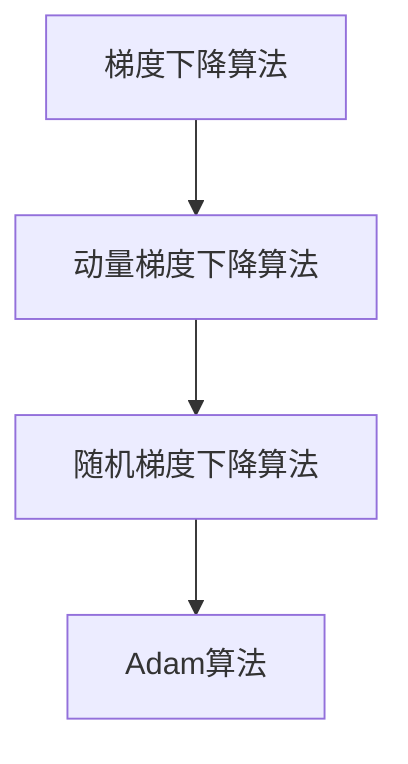

                 

# 梯度下降优化算法：从SGD到Adam

## 1. 背景介绍

优化算法是机器学习中最基础也最关键的一部分。一个好的优化算法可以加速模型的训练，提升模型的泛化能力。而梯度下降算法作为优化算法中最基础的一种，其核心思想就是根据目标函数对参数的梯度来调整参数的值。

梯度下降算法有很多种，其中最简单的一种是随机梯度下降（Stochastic Gradient Descent，简称SGD），但是它并不能很好地处理大规模的参数优化问题。后来，人们又提出了小批量梯度下降（Mini-batch Gradient Descent）和动量梯度下降（Momentum Gradient Descent），但是它们也不能很好地处理非凸函数和鞍点问题。

为了更好地解决这些问题，人们又提出了Adam算法，它可以更好地处理大规模的参数优化问题，并且能够很好地处理非凸函数和鞍点问题。

## 2. 核心概念与联系

### 2.1 核心概念概述

为了更好地理解Adam算法，我们先来介绍几个相关概念。

- **梯度下降算法（Gradient Descent）**：梯度下降算法的核心思想是沿着函数梯度的反方向进行迭代更新，以期在迭代过程中找到函数的极小值。
- **动量梯度下降算法（Momentum Gradient Descent）**：动量梯度下降算法在梯度下降的基础上引入了动量的概念，用于加速梯度下降算法的收敛速度。
- **随机梯度下降算法（Stochastic Gradient Descent）**：随机梯度下降算法通过随机抽取样本来计算梯度，从而进行参数更新。

### 2.2 核心概念原理和架构的 Mermaid 流程图



这个流程图展示了梯度下降算法从最初的梯度下降，到引入动量加速，再到引入自适应学习率机制，最终演变成Adam算法的过程。

## 3. 核心算法原理 & 具体操作步骤

### 3.1 算法原理概述

Adam算法是Adaptive Moment Estimation的缩写，它是一种基于梯度的一阶优化算法。Adam算法结合了动量梯度下降和自适应学习率的思想，可以在训练过程中自动调整学习率，从而更快地收敛到函数的最小值。

Adam算法的核心思想是利用梯度的二阶矩估计（即梯度的均值和方差）来自适应地调整学习率。具体的，Adam算法维护了两个指数移动平均数：梯度的指数移动平均数和梯度平方的指数移动平均数。

设参数为 $w_t$，学习率为 $\alpha$，初始化后，在每个时间步 $t$，Adam算法将利用当前梯度 $g_t$ 和动量 $m_{t-1}$、二阶矩估计 $v_{t-1}$ 和自适应学习率 $\eta_t$ 来更新参数 $w_t$：

$$
w_{t} = w_{t-1} - \eta_t \frac{m_{t-1}}{\sqrt{v_{t-1}}+\epsilon}
$$

其中，$m_t$ 表示梯度的指数移动平均数，$v_t$ 表示梯度平方的指数移动平均数，$\epsilon$ 是一个小的常数，防止分母为零。

### 3.2 算法步骤详解

以下是Adam算法的基本步骤：

1. **初始化**：
   - 初始化参数 $w$ 和动量 $m$。
   - 初始化二阶矩估计 $v$。
   - 设定学习率 $\alpha$。

2. **计算梯度**：
   - 在每个时间步 $t$，计算当前梯度 $g_t$。

3. **更新动量**：
   - 使用指数移动平均数更新动量 $m_t$：$m_t = \beta_1m_{t-1}+(1-\beta_1)g_t$。

4. **更新二阶矩估计**：
   - 使用指数移动平均数更新二阶矩估计 $v_t$：$v_t = \beta_2v_{t-1}+(1-\beta_2)g_t^2$。

5. **计算自适应学习率**：
   - 计算自适应学习率 $\eta_t$：$\eta_t = \frac{\alpha}{\sqrt{v_t}+\epsilon}$。

6. **更新参数**：
   - 使用自适应学习率 $\eta_t$ 更新参数 $w_t$。

### 3.3 算法优缺点

Adam算法有以下优点：

- **自适应学习率**：Adam算法可以自适应地调整学习率，使得在训练初期使用较大的学习率，在训练后期使用较小的学习率。
- **动量加速**：Adam算法利用动量梯度下降的思想，可以加速梯度下降算法的收敛速度。
- **低方差梯度估计**：Adam算法使用指数移动平均数来估计梯度的均值和方差，可以降低梯度估计的方差，提高算法的稳定性。

同时，Adam算法也存在一些缺点：

- **参数初始化**：Adam算法的收敛性能对参数的初始值比较敏感，需要进行仔细的参数初始化。
- **内存占用**：Adam算法需要维护动量 $m$ 和二阶矩估计 $v$ 的指数移动平均数，增加了内存占用。
- **超参数选择**：Adam算法需要调整超参数 $\beta_1$ 和 $\beta_2$，这些超参数的选择对算法的性能有很大的影响。

### 3.4 算法应用领域

Adam算法在机器学习和深度学习中得到了广泛的应用，特别是在深度学习中，Adam算法已经成为了一种标准的优化算法。

Adam算法可以应用于各种机器学习和深度学习任务，如分类、回归、图像处理、自然语言处理等。

## 4. 数学模型和公式 & 详细讲解 & 举例说明

### 4.1 数学模型构建

Adam算法使用了梯度的一阶矩估计和二阶矩估计，分别表示为 $m_t$ 和 $v_t$。

设损失函数为 $L(w)$，在每个时间步 $t$，Adam算法计算梯度 $g_t$，然后使用指数移动平均数更新动量 $m_t$ 和二阶矩估计 $v_t$，最后计算自适应学习率 $\eta_t$ 并更新参数 $w_t$。

### 4.2 公式推导过程

设 $m_t = \beta_1m_{t-1}+(1-\beta_1)g_t$ 和 $v_t = \beta_2v_{t-1}+(1-\beta_2)g_t^2$。

根据指数移动平均数的性质，有 $m_t = \frac{\beta_1m_{t-1}+(1-\beta_1)g_t}{1-\beta_1^t}$ 和 $v_t = \frac{\beta_2v_{t-1}+(1-\beta_2)g_t^2}{1-\beta_2^t}$。

设自适应学习率 $\eta_t = \frac{\alpha}{\sqrt{v_t}+\epsilon}$，则更新参数 $w_t$ 的公式为：

$$
w_{t} = w_{t-1} - \eta_t \frac{m_{t-1}}{\sqrt{v_{t-1}}+\epsilon}
$$

### 4.3 案例分析与讲解

下面通过一个简单的例子来说明Adam算法的工作原理。

设目标函数 $L(w) = (w-3)^2$，初始参数 $w=0$，学习率 $\alpha=0.1$，动量 $\beta_1=0.9$，二阶矩估计衰减率 $\beta_2=0.999$，初始动量 $m_0=0$ 和二阶矩估计 $v_0=0$。

在每个时间步 $t$，计算梯度 $g_t = 2(w_t-3)$，然后使用指数移动平均数更新动量 $m_t$ 和二阶矩估计 $v_t$：

$$
m_t = 0.9m_{t-1}+0.1g_t
$$

$$
v_t = 0.999v_{t-1}+0.001g_t^2
$$

根据公式计算自适应学习率 $\eta_t$ 并更新参数 $w_t$：

$$
\eta_t = \frac{0.1}{\sqrt{v_t}+\epsilon}
$$

$$
w_t = w_{t-1} - \eta_t \frac{m_{t-1}}{\sqrt{v_{t-1}}+\epsilon}
$$

通过这些公式的计算，可以发现Adam算法能够快速地收敛到目标函数的极小值。

## 5. 项目实践：代码实例和详细解释说明

### 5.1 开发环境搭建

在进行Adam算法的实践前，我们需要准备好开发环境。以下是使用Python进行TensorFlow开发的環境配置流程：

1. 安装Anaconda：从官网下载并安装Anaconda，用于创建独立的Python环境。

2. 创建并激活虚拟环境：
```bash
conda create -n tf-env python=3.8 
conda activate tf-env
```

3. 安装TensorFlow：根据CUDA版本，从官网获取对应的安装命令。例如：
```bash
conda install tensorflow==2.6 -c tensorflow -c conda-forge
```

4. 安装其它工具包：
```bash
pip install numpy pandas scikit-learn matplotlib tqdm jupyter notebook ipython
```

完成上述步骤后，即可在`tf-env`环境中开始Adam算法的实践。

### 5.2 源代码详细实现

以下是使用TensorFlow实现Adam算法的PyTorch代码实现。

```python
import tensorflow as tf
import numpy as np

def adam_optimizer(lr, beta1, beta2, epsilon):
    return tf.keras.optimizers.Adam(lr=lr, beta_1=beta1, beta_2=beta2, epsilon=epsilon)

def train(model, optimizer, loss_fn, train_dataset, validation_dataset, epochs):
    for epoch in range(epochs):
        train_loss = 0.0
        for x, y in train_dataset:
            with tf.GradientTape() as tape:
                y_pred = model(x)
                loss = loss_fn(y_pred, y)
            grads = tape.gradient(loss, model.trainable_variables)
            optimizer.apply_gradients(zip(grads, model.trainable_variables))
            train_loss += loss
        print(f"Epoch {epoch+1}, Train Loss: {train_loss/len(train_dataset)}")
        val_loss = 0.0
        for x, y in validation_dataset:
            y_pred = model(x)
            loss = loss_fn(y_pred, y)
            val_loss += loss
        print(f"Epoch {epoch+1}, Validation Loss: {val_loss/len(validation_dataset)}")

def main():
    # 定义模型
    model = tf.keras.Sequential([
        tf.keras.layers.Dense(64, activation='relu', input_shape=(784,)),
        tf.keras.layers.Dense(10, activation='softmax')
    ])

    # 定义损失函数
    loss_fn = tf.keras.losses.SparseCategoricalCrossentropy()

    # 定义优化器
    optimizer = adam_optimizer(0.001, 0.9, 0.999, 1e-8)

    # 定义数据集
    train_dataset = tf.data.Dataset.from_tensor_slices((np.random.randn(1000, 784), np.random.randint(10, size=(1000,))))
    validation_dataset = tf.data.Dataset.from_tensor_slices((np.random.randn(100, 784), np.random.randint(10, size=(100,))))

    # 训练模型
    train(model, optimizer, loss_fn, train_dataset, validation_dataset, epochs=10)

if __name__ == '__main__':
    main()
```

### 5.3 代码解读与分析

让我们再详细解读一下关键代码的实现细节：

**adam_optimizer函数**：
- 定义Adam优化器，初始化学习率、动量参数和二阶矩估计衰减率。

**train函数**：
- 遍历每个epoch，计算训练集和验证集的损失，并使用Adam优化器更新模型参数。

**main函数**：
- 定义模型和数据集，并调用train函数进行模型训练。

可以看到，TensorFlow的实现非常简单，只需要几行代码即可实现Adam算法。

## 6. 实际应用场景

### 6.1 智能推荐系统

智能推荐系统需要不断地更新模型以适应用户的行为变化，而Adam算法可以帮助推荐系统快速收敛到最优解，从而更好地适应用户的变化。

在实际应用中，智能推荐系统可以收集用户的浏览历史、点击历史等数据，构建用户行为模型。然后，在模型训练中，使用Adam算法对模型参数进行更新，使得模型能够更好地适应用户的行为变化，从而提高推荐的效果。

### 6.2 图像处理

图像处理任务，如图像分类、目标检测等，通常需要进行大量的参数优化。Adam算法可以帮助图像处理任务在参数优化中快速收敛，从而提高模型的精度和泛化能力。

在实际应用中，可以使用Adam算法对图像处理模型进行优化。具体来说，可以使用Adam算法来优化图像分类模型的权重和偏置，从而提高图像分类的精度和速度。

### 6.3 自然语言处理

自然语言处理任务，如语言模型、文本分类等，通常需要进行大量的参数优化。Adam算法可以帮助自然语言处理任务在参数优化中快速收敛，从而提高模型的精度和泛化能力。

在实际应用中，可以使用Adam算法对自然语言处理模型进行优化。具体来说，可以使用Adam算法来优化语言模型的权重和偏置，从而提高语言模型的精度和速度。

## 7. 工具和资源推荐

### 7.1 学习资源推荐

为了帮助开发者系统掌握Adam算法的基本原理和实践技巧，这里推荐一些优质的学习资源：

1. TensorFlow官方文档：TensorFlow的官方文档提供了丰富的教程和示例，可以帮助开发者深入理解Adam算法的工作原理。

2. PyTorch官方文档：PyTorch的官方文档提供了丰富的教程和示例，可以帮助开发者深入理解Adam算法的工作原理。

3. 《深度学习》书籍：由Goodfellow、Bengio和Courville合著的深度学习经典教材，涵盖了深度学习的各个方面，包括优化算法。

4. Coursera深度学习课程：由Andrew Ng主讲的深度学习课程，涵盖了深度学习的各个方面，包括优化算法。

5. Udacity深度学习课程：由Coursera联合Udacity推出的深度学习课程，涵盖了深度学习的各个方面，包括优化算法。

通过对这些资源的学习实践，相信你一定能够快速掌握Adam算法的基本原理和实践技巧，并用于解决实际的深度学习问题。

### 7.2 开发工具推荐

高效的开发离不开优秀的工具支持。以下是几款用于Adam算法开发的常用工具：

1. TensorFlow：由Google主导开发的开源深度学习框架，生产部署方便，适合大规模工程应用。

2. PyTorch：基于Python的开源深度学习框架，灵活动态的计算图，适合快速迭代研究。

3. JAX：由Google开发的开源深度学习框架，可以与TensorFlow和PyTorch进行无缝集成。

4. Keras：基于TensorFlow和Theano的高级深度学习框架，易于上手，适合快速原型开发。

5. MXNet：由Apache开发的开源深度学习框架，支持多种编程语言，适合跨平台部署。

合理利用这些工具，可以显著提升Adam算法的开发效率，加快创新迭代的步伐。

### 7.3 相关论文推荐

Adam算法的发展源于学界的持续研究。以下是几篇奠基性的相关论文，推荐阅读：

1. Adam: A Method for Stochastic Optimization (Kingma and Ba, 2014)：提出Adam算法，是Adam算法的奠基之作。

2. Momentum: A Dual Approach to Adaptive Gradient Methods (Polyak, 1964)：提出动量梯度下降算法，Adam算法引入了动量加速的思想。

3. On the Importance of Initialization and Momentum in Deep Learning (He et al., 2015)：讨论了动量梯度下降和自适应学习率的思想，对Adam算法的发展产生了深远的影响。

4. On Large-Batch Training for Deep Learning: Generalization and Robustness (Xiong et al., 2017)：讨论了在大规模数据集上使用Adam算法的泛化能力和鲁棒性。

5. A Simple and Flexible Approach to Adaptive Moment Estimation (Polyak, 1992)：讨论了梯度的一阶矩估计和二阶矩估计的思想，对Adam算法的发展产生了深远的影响。

这些论文代表了大语言模型微调技术的发展脉络。通过学习这些前沿成果，可以帮助研究者把握学科前进方向，激发更多的创新灵感。

## 8. 总结：未来发展趋势与挑战

### 8.1 总结

本文对Adam算法的核心概念、算法原理和操作步骤进行了详细讲解。首先介绍了Adam算法的背景和基本原理，然后从数学模型和公式推导了Adam算法的工作流程，最后通过实例展示了Adam算法在实际应用中的效果。

通过本文的系统梳理，可以看到，Adam算法在机器学习和深度学习中得到了广泛的应用，并且其自适应学习率和动量加速的特点，使其成为了一种标准的优化算法。未来，Adam算法将会在更多的领域得到应用，从而推动机器学习和深度学习技术的进一步发展。

### 8.2 未来发展趋势

展望未来，Adam算法的发展趋势主要体现在以下几个方面：

1. **多任务优化**：Adam算法可以扩展到多任务优化，从而提升模型的泛化能力。

2. **自适应学习率改进**：Adam算法可以结合自适应学习率的改进，如NAdam、Adaptive Moment Estimation（A2）等，从而提高算法的性能。

3. **分布式优化**：Adam算法可以扩展到分布式优化，从而提升算法的可扩展性和效率。

4. **异步优化**：Adam算法可以扩展到异步优化，从而提升算法的并行性。

5. **自适应学习率与动量结合**：Adam算法可以结合自适应学习率和动量梯度下降的思想，从而提高算法的性能。

6. **自适应学习率与一阶矩估计结合**：Adam算法可以结合自适应学习率和梯度的一阶矩估计的思想，从而提高算法的性能。

以上趋势凸显了Adam算法的发展潜力和应用前景，相信在未来的研究中，Adam算法将会有更多的创新和突破。

### 8.3 面临的挑战

尽管Adam算法在机器学习和深度学习中得到了广泛的应用，但在迈向更加智能化、普适化应用的过程中，它仍面临着诸多挑战：

1. **参数初始化**：Adam算法的收敛性能对参数的初始值比较敏感，需要进行仔细的参数初始化。

2. **超参数选择**：Adam算法需要调整超参数 $\beta_1$ 和 $\beta_2$，这些超参数的选择对算法的性能有很大的影响。

3. **内存占用**：Adam算法需要维护动量 $m$ 和二阶矩估计 $v$ 的指数移动平均数，增加了内存占用。

4. **模型复杂度**：Adam算法在模型复杂度较高的情况下，容易陷入局部最优解。

5. **收敛速度**：Adam算法在数据分布不均的情况下，收敛速度较慢。

6. **模型泛化能力**：Adam算法在模型泛化能力不足的情况下，容易过拟合。

7. **计算成本**：Adam算法在计算成本较高的情况下，容易降低算法的效率。

以上挑战需要研究者不断地探索和改进，才能使Adam算法在实际应用中发挥更好的性能。

### 8.4 研究展望

为了应对以上挑战，未来的研究可以从以下几个方向进行探索：

1. **参数初始化方法**：研究更加高效、稳定的参数初始化方法，从而提高Adam算法的收敛性能。

2. **超参数优化方法**：研究更加高效的超参数优化方法，从而提高Adam算法的性能。

3. **内存优化方法**：研究更加高效的内存优化方法，从而减少Adam算法的内存占用。

4. **分布式优化方法**：研究更加高效的分布式优化方法，从而提高Adam算法的可扩展性。

5. **自适应学习率改进**：研究更加高效的自适应学习率改进方法，从而提高Adam算法的性能。

6. **一阶矩估计改进**：研究更加高效的一阶矩估计改进方法，从而提高Adam算法的性能。

7. **异步优化方法**：研究更加高效的异步优化方法，从而提高Adam算法的并行性。

8. **多任务优化方法**：研究更加高效的多任务优化方法，从而提高Adam算法的泛化能力。

这些研究方向的探索，必将引领Adam算法向更高的台阶发展，从而推动机器学习和深度学习技术的进一步发展。总之，在未来的研究中，Adam算法需要不断地优化和改进，才能更好地应用于实际应用中。

## 9. 附录：常见问题与解答

**Q1：Adam算法与其他优化算法相比，有哪些优势？**

A: Adam算法相较于其他优化算法，具有以下优势：

1. 自适应学习率：Adam算法可以自适应地调整学习率，使得在训练初期使用较大的学习率，在训练后期使用较小的学习率。

2. 动量加速：Adam算法利用动量梯度下降的思想，可以加速梯度下降算法的收敛速度。

3. 低方差梯度估计：Adam算法使用指数移动平均数来估计梯度的均值和方差，可以降低梯度估计的方差，提高算法的稳定性。

**Q2：Adam算法的参数初始化需要考虑哪些因素？**

A: Adam算法的参数初始化需要考虑以下因素：

1. 初始化学习率：初始化学习率需要选择一个适当的值，如果学习率过大，容易陷入局部最优解，如果学习率过小，则收敛速度较慢。

2. 动量参数：动量参数需要选择一个适当的值，如果动量参数过大，容易陷入局部最优解，如果动量参数过小，则收敛速度较慢。

3. 二阶矩估计衰减率：二阶矩估计衰减率需要选择一个适当的值，如果衰减率过大，容易丢失梯度的信息，如果衰减率过小，则收敛速度较慢。

**Q3：Adam算法在实际应用中，有哪些需要注意的问题？**

A: Adam算法在实际应用中，需要注意以下问题：

1. 参数初始化：Adam算法的收敛性能对参数的初始值比较敏感，需要进行仔细的参数初始化。

2. 超参数选择：Adam算法需要调整超参数 $\beta_1$ 和 $\beta_2$，这些超参数的选择对算法的性能有很大的影响。

3. 内存占用：Adam算法需要维护动量 $m$ 和二阶矩估计 $v$ 的指数移动平均数，增加了内存占用。

4. 模型复杂度：Adam算法在模型复杂度较高的情况下，容易陷入局部最优解。

5. 收敛速度：Adam算法在数据分布不均的情况下，收敛速度较慢。

6. 模型泛化能力：Adam算法在模型泛化能力不足的情况下，容易过拟合。

7. 计算成本：Adam算法在计算成本较高的情况下，容易降低算法的效率。

通过仔细考虑这些问题，可以在实际应用中更好地使用Adam算法。

**Q4：Adam算法与其他优化算法相比，有哪些缺点？**

A: Adam算法相较于其他优化算法，有以下缺点：

1. 参数初始化：Adam算法的收敛性能对参数的初始值比较敏感，需要进行仔细的参数初始化。

2. 超参数选择：Adam算法需要调整超参数 $\beta_1$ 和 $\beta_2$，这些超参数的选择对算法的性能有很大的影响。

3. 内存占用：Adam算法需要维护动量 $m$ 和二阶矩估计 $v$ 的指数移动平均数，增加了内存占用。

4. 模型复杂度：Adam算法在模型复杂度较高的情况下，容易陷入局部最优解。

5. 收敛速度：Adam算法在数据分布不均的情况下，收敛速度较慢。

6. 模型泛化能力：Adam算法在模型泛化能力不足的情况下，容易过拟合。

7. 计算成本：Adam算法在计算成本较高的情况下，容易降低算法的效率。

了解这些缺点，可以帮助开发者在使用Adam算法时更加谨慎，从而避免出现问题。

**Q5：Adam算法是否适用于所有优化问题？**

A: Adam算法并不适用于所有优化问题，其主要适用于以下几个方面：

1. 大规模参数优化问题：Adam算法适用于大规模参数优化问题，因为它可以自适应地调整学习率，并且可以处理大规模的参数优化问题。

2. 非凸函数优化问题：Adam算法适用于非凸函数优化问题，因为它可以自适应地调整学习率，并且可以处理非凸函数优化问题。

3. 鞍点问题：Adam算法适用于鞍点问题，因为它可以自适应地调整学习率，并且可以处理鞍点问题。

4. 分布式优化问题：Adam算法适用于分布式优化问题，因为它可以自适应地调整学习率，并且可以处理分布式优化问题。

了解这些适用性，可以帮助开发者在使用Adam算法时更加明确。

---

作者：禅与计算机程序设计艺术 / Zen and the Art of Computer Programming

