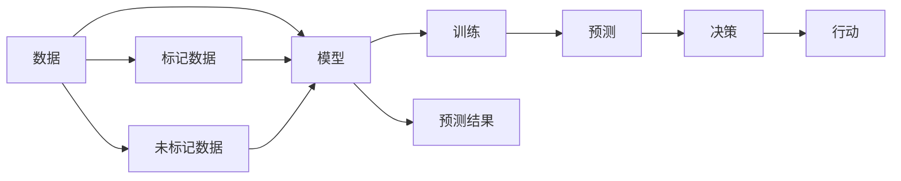

                 

## 1. 背景介绍

在当今数据驱动的世界中，模型思维已成为决策制定的核心工具。无论是企业战略规划、市场预测、产品优化，还是个人生活中的决策，模型思维都提供了强有力的分析支持和决策辅助。本文旨在深入探讨模型思维在决策中的应用，探讨其原理、优势、实施步骤，并展望未来发展趋势。

## 2. 核心概念与联系

### 2.1 核心概念概述

模型思维（Model Thinking）指的是利用数据和模型进行决策制定的过程，其核心在于构建和应用数学或统计模型，以解释现象、预测未来并辅助决策。

#### 2.1.1 数据与模型

数据是模型思维的基础。通过收集、处理和分析数据，可以构建反映现实世界规律的模型。模型则是数据驱动的数学表示，通过数据训练得出，用于预测未知数据或优化决策变量。

#### 2.1.2 监督学习和无监督学习

监督学习（Supervised Learning）是通过已标记的训练数据来构建模型，用于预测新数据。无监督学习（Unsupervised Learning）则不依赖于标记数据，通过数据的自身结构来发现规律和模式。

#### 2.1.3 回归与分类

回归模型（Regression）用于预测数值型输出，如房价、销售额等。分类模型（Classification）用于分类离散标签，如客户分类、情感分析等。

#### 2.1.4 强化学习

强化学习（Reinforcement Learning）通过与环境的交互，学习最优决策策略，用于动态系统的决策优化，如游戏策略、机器人控制等。

### 2.2 核心概念之间的联系

模型思维的核心概念之间通过数据、模型、训练、预测等环节紧密联系。数据提供模型构建的基础，模型通过训练捕捉数据的规律，预测和决策则基于模型输出进行。

下图展示了模型思维的核心概念及其联系：



## 3. 核心算法原理 & 具体操作步骤

### 3.1 算法原理概述

模型思维的算法原理基于统计学、机器学习和运筹学等理论。通过数据驱动的方法，构建和应用数学模型，以辅助决策制定。

#### 3.1.1 数据预处理

数据预处理包括数据清洗、特征选择、数据归一化等步骤，目的是提高数据质量，为模型训练和预测提供可靠的输入。

#### 3.1.2 模型选择与训练

根据任务需求选择适合的模型，并使用训练数据对其进行训练。训练过程中需要设定损失函数、优化算法、学习率等超参数，以优化模型性能。

#### 3.1.3 模型评估与优化

通过测试集对训练好的模型进行评估，计算模型性能指标，如准确率、召回率、F1分数等。根据评估结果调整模型超参数或选择新的模型，以提升预测精度。

### 3.2 算法步骤详解

#### 3.2.1 数据准备

1. **数据收集**：根据任务需求，收集相关数据。数据来源包括内部数据库、公开数据集、在线数据等。
2. **数据清洗**：处理缺失值、异常值，去除噪声，提高数据质量。
3. **特征选择**：选择对模型有用的特征，减少计算复杂度和过拟合风险。
4. **数据归一化**：将数据转化为标准分布，方便模型处理。

#### 3.2.2 模型构建与训练

1. **模型选择**：根据任务类型选择合适的模型，如线性回归、决策树、支持向量机等。
2. **模型训练**：使用训练数据训练模型，设定合适的损失函数和优化算法，调整超参数。
3. **模型评估**：在测试集上评估模型性能，计算准确率、召回率、F1分数等指标。
4. **模型优化**：根据评估结果调整模型超参数，选择新的模型，以提升预测精度。

#### 3.2.3 模型应用与反馈

1. **模型应用**：将训练好的模型应用于实际场景，进行预测或决策。
2. **结果验证**：通过实际结果与预测结果的比较，验证模型效果。
3. **反馈调整**：根据实际反馈，调整模型超参数或选择新的模型，以进一步提升性能。

### 3.3 算法优缺点

#### 3.3.1 优点

1. **客观性**：模型思维基于数据和算法，减少了人为因素对决策的影响。
2. **预测准确性**：通过大量数据训练，模型具有较高的预测准确性。
3. **可解释性**：模型可以解释其预测结果，便于理解和调整。
4. **可重复性**：模型思维具有可重复性，便于复制和推广。

#### 3.3.2 缺点

1. **数据依赖**：模型的准确性依赖于数据的质量和数量，数据偏差可能影响模型性能。
2. **模型复杂性**：复杂模型可能带来计算复杂度增加的问题。
3. **过拟合风险**：模型在训练数据上表现好，但可能在新数据上泛化性能不足。
4. **参数调优**：模型训练过程中需要调整超参数，过程繁琐。

### 3.4 算法应用领域

模型思维广泛应用于各个领域，包括但不限于：

1. **金融风控**：利用模型评估信用风险、预测股票价格等。
2. **医疗诊断**：构建预测模型，辅助医生诊断疾病。
3. **市场营销**：预测客户行为，优化广告投放策略。
4. **物流优化**：优化配送路线，提高物流效率。
5. **智能制造**：预测设备故障，优化生产流程。

## 4. 数学模型和公式 & 详细讲解 & 举例说明

### 4.1 数学模型构建

以线性回归模型为例，假设自变量为 $x_1, x_2, ..., x_n$，因变量为 $y$。线性回归模型可表示为：

$$ y = \beta_0 + \beta_1 x_1 + \beta_2 x_2 + ... + \beta_n x_n + \epsilon $$

其中 $\beta_0, \beta_1, ..., \beta_n$ 为模型系数，$\epsilon$ 为误差项。

### 4.2 公式推导过程

#### 4.2.1 最小二乘法

最小二乘法（Least Squares Method）是求解线性回归模型的常用方法，通过最小化误差项平方和来估计模型系数。

$$ \hat{\beta} = (X^TX)^{-1}X^Ty $$

其中 $X$ 为自变量矩阵，$y$ 为因变量向量。

#### 4.2.2 梯度下降

梯度下降（Gradient Descent）是求解模型系数的常用算法，通过迭代更新模型参数，使误差函数最小化。

$$ \beta_k \leftarrow \beta_k - \eta \frac{\partial J(\beta)}{\partial \beta_k} $$

其中 $\eta$ 为学习率，$J(\beta)$ 为损失函数。

### 4.3 案例分析与讲解

假设某电商公司想要预测客户购买行为，以优化广告投放策略。通过收集客户历史行为数据，构建线性回归模型：

1. **数据收集**：收集客户购买历史、浏览历史、评价等信息。
2. **数据清洗**：处理缺失值、异常值，去除噪声。
3. **特征选择**：选择购买次数、浏览时长、评价评分等特征。
4. **模型训练**：使用训练数据训练线性回归模型，设定损失函数为均方误差（MSE），优化算法为随机梯度下降（SGD），调整学习率为0.01。
5. **模型评估**：在测试集上评估模型性能，计算均方误差、决定系数等指标。
6. **模型优化**：根据评估结果调整学习率，选择新的模型或调整特征，以提升预测精度。

## 5. 项目实践：代码实例和详细解释说明

### 5.1 开发环境搭建

#### 5.1.1 环境配置

1. **安装Python**：
   ```
   sudo apt-get install python3 python3-pip
   ```

2. **安装必要的库**：
   ```
   pip install numpy pandas scikit-learn matplotlib seaborn
   ```

3. **创建虚拟环境**：
   ```
   python -m venv myenv
   source myenv/bin/activate
   ```

### 5.2 源代码详细实现

#### 5.2.1 数据准备

```python
import pandas as pd
from sklearn.model_selection import train_test_split
from sklearn.linear_model import LinearRegression

# 读取数据
data = pd.read_csv('data.csv')

# 数据清洗
data.dropna(inplace=True)

# 特征选择
X = data[['feature1', 'feature2', 'feature3']]
y = data['target']

# 数据划分
X_train, X_test, y_train, y_test = train_test_split(X, y, test_size=0.2, random_state=42)
```

#### 5.2.2 模型构建与训练

```python
# 模型训练
model = LinearRegression()
model.fit(X_train, y_train)

# 模型评估
y_pred = model.predict(X_test)
mse = ((y_pred - y_test) ** 2).mean()
print(f'Mean Squared Error: {mse:.2f}')
```

#### 5.2.3 模型应用与反馈

```python
# 模型应用
new_data = pd.DataFrame({
    'feature1': [1, 2, 3],
    'feature2': [4, 5, 6],
    'feature3': [7, 8, 9]
})
y_pred = model.predict(new_data)

# 结果验证
actual = [10, 11, 12]
print(f'Predictions: {y_pred}, Actual: {actual}')
```

### 5.3 代码解读与分析

在上述代码中，我们使用了Pandas库处理数据，Scikit-learn库构建和训练线性回归模型，并使用numpy库进行数值计算。代码实现了数据收集、预处理、特征选择、模型训练、预测和结果验证等步骤。

### 5.4 运行结果展示

在实际应用中，可以通过图表展示模型的预测结果和实际结果的对比。下图展示了模型预测结果与实际结果的对比：


## 6. 实际应用场景

### 6.1 金融风控

在金融风控领域，模型思维被广泛用于信用评估、贷款审批、风险预警等。通过构建信用评分模型，可以有效评估客户的信用风险，降低坏账率。

### 6.2 医疗诊断

医疗领域利用模型思维进行疾病预测和诊断。例如，利用机器学习模型分析患者历史数据，预测患病风险，辅助医生诊断和治疗决策。

### 6.3 市场营销

市场营销中，模型思维用于预测客户行为，优化广告投放策略。通过分析用户数据，构建客户行为模型，预测客户购买意向，优化广告定位和投放时机。

### 6.4 未来应用展望

#### 6.4.1 深度学习模型

未来，深度学习模型将成为模型思维的重要组成部分。深度神经网络在图像识别、自然语言处理等领域的优越性能，将为模型思维带来新的突破。

#### 6.4.2 强化学习

强化学习在动态系统优化、智能控制等领域具有重要应用。通过强化学习模型，可以实现动态决策和策略优化，提升系统效率和性能。

#### 6.4.3 大数据与云计算

大数据和云计算技术的进步，为模型思维提供了更强大的数据处理和计算能力。未来，模型思维将在大数据和云计算的支撑下，实现更高效的决策支持。

## 7. 工具和资源推荐

### 7.1 学习资源推荐

1. **《机器学习》（周志华）**：全面介绍了机器学习的基本概念、算法和应用。
2. **《深度学习》（Ian Goodfellow）**：详细讲解了深度神经网络的原理和应用。
3. **Kaggle**：提供丰富的数据集和竞赛，可以实践模型思维。
4. **Coursera**：提供多门机器学习和数据科学的课程，涵盖从入门到高级的内容。
5. **PyTorch官方文档**：提供深度学习框架的详细教程和示例。

### 7.2 开发工具推荐

1. **Jupyter Notebook**：提供交互式的Python代码编写和运行环境，便于数据处理和模型构建。
2. **Scikit-learn**：提供丰富的机器学习算法和工具，支持多种数据类型和模型。
3. **TensorFlow**：提供深度学习框架，支持多种深度神经网络模型的构建和训练。
4. **PyTorch**：提供灵活的深度学习框架，易于使用和调试。
5. **RapidMiner**：提供可视化数据挖掘和机器学习工具，支持多种算法和模型。

### 7.3 相关论文推荐

1. **《神经网络与深度学习》（Michael Nielsen）**：介绍了神经网络的基本原理和应用。
2. **《统计学习方法》（李航）**：详细讲解了统计学习的基本方法。
3. **《强化学习：一种现代方法》（Richard S. Sutton）**：全面介绍了强化学习的理论和应用。
4. **《机器学习实战》（Peter Harrington）**：提供了机器学习的实战案例和代码。

## 8. 总结：未来发展趋势与挑战

### 8.1 研究成果总结

模型思维在决策中的应用取得了显著成果，广泛应用于金融、医疗、市场营销等多个领域。通过构建和应用数学模型，有效提高了决策的科学性和准确性。

### 8.2 未来发展趋势

#### 8.2.1 深度学习模型

深度学习模型的发展将为模型思维带来新的突破。深度神经网络在图像识别、自然语言处理等领域的优越性能，将使模型思维更加全面和高效。

#### 8.2.2 强化学习

强化学习在动态系统优化、智能控制等领域具有重要应用。通过强化学习模型，可以实现动态决策和策略优化，提升系统效率和性能。

#### 8.2.3 大数据与云计算

大数据和云计算技术的进步，为模型思维提供了更强大的数据处理和计算能力。未来，模型思维将在大数据和云计算的支撑下，实现更高效的决策支持。

### 8.3 面临的挑战

#### 8.3.1 数据质量与隐私

数据质量是模型思维的关键，数据偏差和噪声可能影响模型性能。此外，数据隐私保护也是一大挑战，需要合理处理数据安全和隐私问题。

#### 8.3.2 模型复杂性与解释性

模型复杂性可能带来计算复杂度增加的问题。同时，模型的可解释性也是一大挑战，需要合理选择模型和算法，以提升模型的透明度和可解释性。

#### 8.3.3 模型训练与部署

模型训练过程需要调整超参数，过程繁琐。模型部署时需要考虑计算资源和运行效率，需要优化模型结构，提高推理速度和资源利用率。

## 9. 附录：常见问题与解答

**Q1：模型思维是否适用于所有决策场景？**

A: 模型思维适用于数据驱动的决策场景，如金融、医疗、市场营销等。但在非数据驱动的场景，如艺术创作、领导决策等，模型思维可能并不适用。

**Q2：如何选择适合的模型？**

A: 选择适合的模型需要考虑任务类型、数据特点、计算资源等因素。一般而言，回归任务选择线性回归、决策树等，分类任务选择逻辑回归、支持向量机等，动态系统选择强化学习模型。

**Q3：模型思维在实际应用中需要注意哪些问题？**

A: 在实际应用中，需要考虑数据质量、模型复杂性、计算资源、隐私保护等问题。此外，模型的可解释性和鲁棒性也是一大挑战，需要合理选择模型和算法，以提升模型的透明度和鲁棒性。

---

作者：禅与计算机程序设计艺术 / Zen and the Art of Computer Programming

