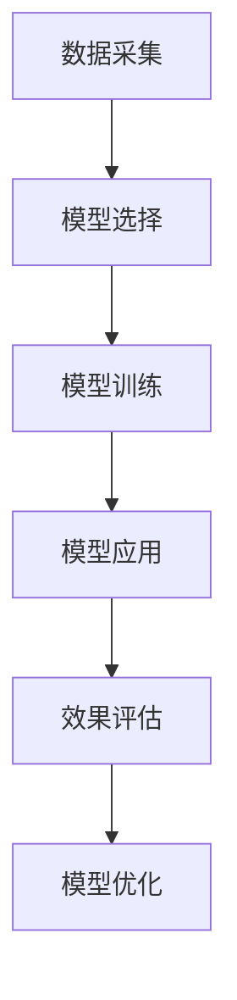

                 

## 1. 背景介绍

随着企业的发展，管理培训变得日益重要，如何提升员工的管理能力、优化管理流程，提高企业的运营效率，成为许多管理者关注的重点。在传统管理培训中，主要依靠专家讲解、案例分享、情景模拟等方法，但是这些方法存在很多局限性，如难以量化、效果不够显著等。模型思维作为一种全新的管理工具，以其精确、量化、可视化的特点，逐渐在管理培训中得到广泛应用。

### 1.1 问题由来

在现代企业管理中，决策质量直接影响着企业的生存和发展。然而，在实际工作中，管理者往往依赖经验和直觉进行决策，难以全面考虑各个方面的影响因素，导致决策失误和资源浪费。传统管理培训方法难以量化和直观展示这些决策的潜在影响，无法为管理者提供科学、系统的支持。

### 1.2 问题核心关键点

模型思维在管理培训中的运用主要解决以下几个核心问题：
1. **数据收集与处理**：如何高效收集和处理企业运营数据，以支撑决策模型。
2. **模型构建与优化**：如何构建适用于企业运营的决策模型，并对其进行优化和验证。
3. **模型应用与反馈**：如何将模型应用到实际决策中，并对模型效果进行持续反馈和改进。

### 1.3 问题研究意义

模型思维在管理培训中的应用，可以帮助管理者从数据驱动的角度，分析和优化企业的运营流程，提升决策的科学性和准确性。此外，通过模型训练和应用，还可以提高管理者的数据分析能力和模型思维能力，增强其系统思维和科学决策的意识。

## 2. 核心概念与联系

### 2.1 核心概念概述

模型思维是指使用数学模型和算法，对企业运营中的各种问题进行分析和预测，从而指导决策的一种思维模式。其核心概念包括：

1. **数据与模型**：数据是模型的输入，模型是数据的处理工具。
2. **训练与验证**：通过大量数据训练模型，并在验证集上进行效果评估。
3. **预测与优化**：使用训练好的模型进行预测，并根据预测结果进行模型优化。

模型思维在管理培训中的应用，可以包括以下几个关键环节：

1. **数据采集**：从企业运营数据中提取有价值的信息。
2. **模型选择**：选择合适的模型来处理和管理数据。
3. **模型训练**：使用训练集对模型进行训练，使其能够预测未来结果。
4. **模型应用**：将训练好的模型应用到实际的决策中。
5. **效果评估**：评估模型在实际应用中的效果，并进行持续优化。

这些概念和环节之间的逻辑关系可以通过以下Mermaid流程图来展示：



这个流程图展示了模型思维在管理培训中的主要流程和步骤。

## 3. 核心算法原理 & 具体操作步骤

### 3.1 算法原理概述

模型思维在管理培训中的应用，主要基于以下算法原理：

1. **回归分析**：通过数据拟合出最优的线性或非线性函数，用于预测未来结果。
2. **时间序列分析**：利用时间序列数据，预测未来的趋势和变化。
3. **优化算法**：如遗传算法、粒子群算法等，用于优化模型的参数和结构。
4. **决策树**：将决策过程可视化，用于分析和管理决策流程。

这些算法原理通过具体的数学模型和算法步骤，帮助管理者从数据中提取有价值的信息，并进行系统分析和预测。

### 3.2 算法步骤详解

模型思维在管理培训中的应用，主要包括以下几个步骤：

**Step 1: 数据采集与预处理**
- 收集企业运营数据，包括销售数据、客户数据、员工数据等。
- 对数据进行清洗、归一化等预处理，以便后续的模型构建。

**Step 2: 模型选择与训练**
- 根据具体问题，选择合适的模型进行构建，如线性回归、决策树、时间序列等。
- 使用训练集对模型进行训练，并使用交叉验证等方法进行参数调优。

**Step 3: 模型应用与预测**
- 将训练好的模型应用到实际问题中，进行预测和分析。
- 根据预测结果，提出改进建议，优化企业运营。

**Step 4: 效果评估与反馈**
- 使用测试集对模型进行效果评估，评估指标包括准确率、召回率等。
- 根据评估结果，进行模型优化和改进。

### 3.3 算法优缺点

模型思维在管理培训中的应用，具有以下优点：
1. **量化分析**：通过模型，可以精确地分析和预测各种管理问题，减少依赖经验和直觉的决策风险。
2. **可视化展示**：模型可以帮助管理者直观地看到决策的影响和效果，增强决策的科学性和可解释性。
3. **高效优化**：通过模型训练和优化，可以不断提升模型的预测能力和应用效果。

同时，模型思维也存在一些局限性：
1. **数据质量要求高**：模型需要大量高质量的数据进行训练和预测，数据质量直接影响模型的效果。
2. **模型复杂度高**：复杂的模型可能导致计算量大、资源消耗高，难以实时应用。
3. **结果解释困难**：模型的预测结果往往需要通过解释性分析才能理解，增加了模型的复杂性。

### 3.4 算法应用领域

模型思维在管理培训中的应用，可以广泛用于以下几个领域：

1. **销售预测与管理**：通过销售数据，预测未来的销售趋势，制定合理的销售策略。
2. **客户行为分析**：分析客户的购买行为，进行客户细分和个性化推荐。
3. **员工绩效评估**：利用员工数据，评估和优化员工绩效管理。
4. **库存管理**：通过库存数据，预测未来的需求和库存水平，优化库存管理。
5. **风险管理**：预测和评估企业运营中的各种风险，制定风险应对策略。

这些领域的应用，展示了模型思维在管理培训中的广泛价值。

## 4. 数学模型和公式 & 详细讲解 & 举例说明

### 4.1 数学模型构建

模型思维在管理培训中的应用，主要依赖数学模型和算法。以销售预测为例，可以使用线性回归模型进行建模，模型的数学表达式为：

$$
y = \beta_0 + \beta_1x_1 + \beta_2x_2 + \cdots + \beta_nx_n + \epsilon
$$

其中，$y$ 表示预测的销售量，$x_1, x_2, \cdots, x_n$ 表示影响销售的各种因素，$\beta_0, \beta_1, \cdots, \beta_n$ 表示各个因素的系数，$\epsilon$ 表示误差项。

### 4.2 公式推导过程

线性回归模型的推导过程如下：

1. **假设**：假设销售量 $y$ 与各个影响因素 $x_i$ 之间存在线性关系。
2. **最小二乘法**：通过最小二乘法，求出最优的回归系数 $\beta_0, \beta_1, \cdots, \beta_n$，使得预测误差最小。
3. **模型评估**：使用测试集评估模型的预测效果，评估指标包括均方误差（MSE）、决定系数（R²）等。

通过这些步骤，可以构建一个适用于企业销售预测的线性回归模型。

### 4.3 案例分析与讲解

假设某电商平台收集了过去一年的销售数据，包括广告投入、促销活动、季节性因素等，我们想要预测未来的销售量。可以按照以下步骤进行：

1. **数据采集**：收集历史销售数据，以及广告投入、促销活动等相关信息。
2. **数据预处理**：对数据进行清洗、归一化等处理。
3. **模型构建**：使用线性回归模型，构建预测模型。
4. **模型训练**：使用历史数据对模型进行训练，并进行参数调优。
5. **模型应用**：将训练好的模型应用到未来的预测中。
6. **效果评估**：使用测试集对模型进行评估，评估其预测效果。

通过模型思维，我们可以高效地预测未来的销售趋势，制定合理的销售策略，提升企业的运营效率。

## 5. 项目实践：代码实例和详细解释说明

### 5.1 开发环境搭建

在进行模型思维应用开发前，需要先搭建好开发环境。以下是使用Python进行模型构建和训练的环境配置流程：

1. 安装Anaconda：从官网下载并安装Anaconda，用于创建独立的Python环境。

2. 创建并激活虚拟环境：
```bash
conda create -n model-env python=3.8 
conda activate model-env
```

3. 安装相关库：
```bash
conda install numpy pandas scikit-learn matplotlib
```

4. 安装TensorFlow或PyTorch：
```bash
conda install tensorflow==2.3
# 或者
conda install pytorch torchvision torchaudio
```

完成上述步骤后，即可在`model-env`环境中进行模型构建和训练。

### 5.2 源代码详细实现

以下是使用TensorFlow进行销售预测的代码实现：

```python
import tensorflow as tf
from tensorflow.keras.models import Sequential
from tensorflow.keras.layers import Dense, Dropout, LSTM
from sklearn.model_selection import train_test_split
from sklearn.preprocessing import MinMaxScaler
import pandas as pd

# 加载数据
data = pd.read_csv('sales_data.csv')

# 数据预处理
scaler = MinMaxScaler(feature_range=(0, 1))
scaled_data = scaler.fit_transform(data[['Sales']])

# 划分训练集和测试集
train_data, test_data = train_test_split(scaled_data, test_size=0.2, shuffle=False)

# 构建模型
model = Sequential()
model.add(LSTM(units=50, return_sequences=True, input_shape=(X_train.shape[1], 1)))
model.add(LSTM(units=50))
model.add(Dense(units=1))

# 编译模型
model.compile(optimizer='adam', loss='mean_squared_error')

# 训练模型
model.fit(X_train, y_train, epochs=100, batch_size=32)

# 模型应用
forecast = model.predict(X_test)

# 数据反归一化
forecast = scaler.inverse_transform(forecast)
```

### 5.3 代码解读与分析

让我们再详细解读一下关键代码的实现细节：

**数据预处理**：
- `MinMaxScaler`：对数据进行归一化处理，使得数据在0-1之间。
- `train_test_split`：将数据划分为训练集和测试集。

**模型构建**：
- `Sequential`：定义一个顺序模型，可以添加多个层次。
- `LSTM`：添加LSTM层次，用于处理时间序列数据。
- `Dense`：添加全连接层次，用于输出预测结果。

**模型训练**：
- `compile`：编译模型，指定优化器和损失函数。
- `fit`：训练模型，使用训练集进行迭代优化。

**模型应用**：
- `predict`：使用训练好的模型进行预测。
- `inverse_transform`：对预测结果进行反归一化处理。

可以看到，TensorFlow提供了方便的模型构建和训练接口，使得销售预测的代码实现相对简洁高效。

## 6. 实际应用场景

### 6.1 销售预测与管理

在电商平台上，销售预测是核心管理任务之一。通过模型思维，电商平台可以精准预测未来的销售趋势，制定合理的销售策略，优化库存管理，提升运营效率。

具体而言，可以使用线性回归、LSTM等模型，对历史销售数据进行建模和预测。模型不仅能够预测未来的销售量，还能分析不同因素对销售的影响，从而优化营销和促销策略，减少库存积压和资金占用。

### 6.2 客户行为分析

客户行为分析是企业客户管理的重要环节。通过模型思维，企业可以深入分析客户的购买行为，进行客户细分和个性化推荐，提升客户满意度和忠诚度。

具体而言，可以收集客户的购买记录、浏览历史、评分反馈等数据，使用聚类算法进行客户细分。然后，针对不同的客户群体，使用推荐系统进行个性化推荐，提升客户体验和销售额。

### 6.3 员工绩效评估

员工绩效评估是企业人力资源管理的重要任务。通过模型思维，企业可以全面分析员工的工作表现，进行科学合理的绩效评估和管理。

具体而言，可以收集员工的工作量、工作质量、项目完成时间等数据，使用回归分析等模型进行绩效评估。同时，还可以结合员工满意度、离职率等指标，进行综合评估和优化。

### 6.4 库存管理

库存管理是企业运营的核心环节之一。通过模型思维，企业可以精准预测未来的库存需求，优化库存水平，减少资金占用和浪费。

具体而言，可以收集历史销售数据、促销活动、季节性因素等，使用时间序列分析等模型进行库存预测。同时，还可以结合供应链管理，优化库存调配和物流管理，提升运营效率。

### 6.5 风险管理

风险管理是企业运营中不可忽视的重要环节。通过模型思维，企业可以全面分析各种风险因素，制定合理的风险应对策略，减少潜在损失。

具体而言，可以收集企业财务数据、市场数据、政策法规等，使用回归分析、决策树等模型进行风险评估。同时，还可以结合实时监测和预警系统，及时发现和应对风险事件。

## 7. 工具和资源推荐

### 7.1 学习资源推荐

为了帮助开发者系统掌握模型思维在管理培训中的应用，这里推荐一些优质的学习资源：

1. 《Python机器学习》系列书籍：由知名机器学习专家编写，全面介绍Python机器学习的基础知识和实践技巧。
2. Coursera《机器学习》课程：由斯坦福大学教授Andrew Ng主讲，涵盖机器学习的基础理论和算法。
3. Kaggle数据竞赛平台：提供大量公开数据集和竞赛任务，通过实践积累数据处理和模型构建的经验。
4. TensorFlow官方文档：提供丰富的模型构建和训练示例，帮助开发者快速上手。
5. GitHub开源项目：通过参与开源项目，学习他人的代码实现，积累实际应用经验。

通过对这些资源的学习实践，相信你一定能够快速掌握模型思维在管理培训中的应用，并用于解决实际的管理问题。

### 7.2 开发工具推荐

高效的开发离不开优秀的工具支持。以下是几款用于模型思维开发常用的工具：

1. Python：作为数据科学和机器学习的标准语言，Python提供了丰富的科学计算和数据处理库，如NumPy、Pandas等。
2. TensorFlow：由Google主导开发的深度学习框架，支持分布式计算和模型训练。
3. PyTorch：由Facebook开发的深度学习框架，支持动态计算图和灵活的模型构建。
4. Jupyter Notebook：开源的交互式开发环境，支持代码和结果的同步展示，便于调试和分析。
5. Visual Studio Code：轻量级的IDE，支持多种编程语言和工具集成，提高开发效率。

合理利用这些工具，可以显著提升模型思维应用开发的效率，加速创新迭代的步伐。

### 7.3 相关论文推荐

模型思维在管理培训中的应用，源于学界的持续研究。以下是几篇奠基性的相关论文，推荐阅读：

1. G. James, D. Witten, T. Hastie, and R. Tibshirani. 《An Introduction to Statistical Learning》：介绍统计学习的基本方法和应用。
2. Y. Bengio, G. Hinton, and S. Courville. 《Deep Learning》：介绍深度学习的基本理论和算法。
3. D. Silver. 《Prediction and its Applications》：介绍预测模型在各个领域的应用。
4. J. Han and M. Kamber. 《Data Mining: Concepts and Techniques》：介绍数据挖掘的基本方法和应用。
5. R. Tibshirani. 《The Elements of Statistical Learning》：介绍统计学习的基本理论和算法。

这些论文代表了大数据和机器学习领域的经典成果，对于理解模型思维在管理培训中的应用具有重要参考价值。

## 8. 总结：未来发展趋势与挑战

### 8.1 总结

本文对模型思维在管理培训中的应用进行了全面系统的介绍。首先阐述了模型思维的定义、核心概念和应用流程，明确了其在管理培训中的重要性和实践意义。其次，从原理到实践，详细讲解了模型思维在销售预测、客户行为分析、员工绩效评估、库存管理和风险管理等多个实际应用场景中的应用方法和技术细节。同时，本文还精选了模型思维的学习资源、开发工具和相关论文，力求为读者提供全方位的技术指引。

通过本文的系统梳理，可以看到，模型思维在管理培训中的应用，为管理者提供了科学、量化的决策工具，大大提升了企业的运营效率和管理水平。未来，随着模型思维的不断演进，其在管理培训中的应用将更加广泛和深入，推动企业向智能化、数据化方向发展。

### 8.2 未来发展趋势

展望未来，模型思维在管理培训中的应用，将呈现以下几个发展趋势：

1. **数据驱动决策**：随着大数据和人工智能技术的不断发展，模型思维将成为企业决策的主要依据，减少依赖经验和直觉的决策风险。
2. **实时预测与分析**：通过实时数据收集和分析，模型思维可以提供更加精准和及时的预测结果，优化企业的运营决策。
3. **跨领域应用**：模型思维不仅应用于传统行业，还将拓展到金融、医疗、教育等更多领域，提供全面的决策支持。
4. **自动化与智能化**：未来，模型思维将与自动化和智能化技术深度融合，提升模型构建和应用效率。
5. **多模态融合**：结合语音、图像、文本等多种模态数据，模型思维将提供更加全面和深入的决策支持。

以上趋势凸显了模型思维在管理培训中的广阔前景，其应用范围和效果将不断拓展，为企业管理者提供更加精准和全面的决策支持。

### 8.3 面临的挑战

尽管模型思维在管理培训中的应用已经取得了一定成果，但在实际应用过程中，仍面临诸多挑战：

1. **数据质量与数据隐私**：高质量的数据是模型思维的基础，但数据的采集和处理需要耗费大量时间和资源。同时，如何保护数据隐私和安全，也成为亟待解决的问题。
2. **模型复杂性与可解释性**：复杂的模型可能导致计算量大、结果难以解释。如何在保证模型效果的同时，增强模型的可解释性，是未来的重要研究方向。
3. **模型部署与维护**：模型思维的实际应用需要高效的模型部署和维护机制，以支持持续的预测和优化。如何在分布式系统中部署和管理模型，是未来的关键技术挑战。
4. **跨部门协作**：模型思维的应用需要跨部门的协作和数据共享，但各部门的数据和流程存在差异，如何协同工作，提高模型应用的效率和效果，是未来的重要研究方向。

### 8.4 研究展望

面对模型思维在管理培训中面临的挑战，未来的研究需要在以下几个方面寻求新的突破：

1. **数据自动化采集**：开发自动化的数据采集工具，减少数据采集和处理的时间成本，提高数据质量和隐私保护。
2. **模型可解释性增强**：开发更加可解释的模型，增强模型的可解释性，降低决策风险。
3. **高效模型部署**：开发高效的模型部署和维护机制，支持分布式系统的应用和优化。
4. **跨部门协同**：构建跨部门的协同工作机制，提高数据共享和模型应用的效果。

这些研究方向的探索，必将引领模型思维在管理培训中的技术演进，为企业管理者提供更加科学、精准和可靠的决策支持。面向未来，模型思维将成为企业管理中的重要工具，为企业的持续发展和创新提供有力保障。

## 9. 附录：常见问题与解答

**Q1：模型思维在管理培训中是否适用于所有管理问题？**

A: 模型思维在管理培训中的应用，主要适用于有大量数据支持的管理问题，如销售预测、客户行为分析等。对于一些依赖经验和直觉的管理问题，如领导力和团队建设等，模型思维可能难以完全覆盖。

**Q2：如何选择合适的模型进行建模？**

A: 选择合适的模型需要考虑多个因素，如问题的复杂性、数据的类型、数据的规模等。一般来说，可以使用简单的模型进行初步建模，如线性回归、决策树等。如果模型效果不理想，可以逐步引入复杂的模型，如神经网络、深度学习等。

**Q3：模型思维在管理培训中的应用需要哪些资源支持？**

A: 模型思维在管理培训中的应用，需要大量的数据支持、高性能的计算资源、专业的技术人才等。企业需要建立完善的数据采集和处理机制，搭建高效的计算平台，培养专业的数据科学家和模型工程师，才能实现模型思维的广泛应用。

**Q4：如何评估模型的效果？**

A: 模型效果的评估可以通过多种指标进行，如准确率、召回率、均方误差等。同时，还可以结合业务场景进行综合评估，如预测结果的实用性和可解释性等。

**Q5：模型思维在管理培训中的实际应用案例有哪些？**

A: 实际应用案例包括销售预测、客户行为分析、员工绩效评估、库存管理和风险管理等。这些案例展示了模型思维在各个领域的具体应用和效果。

---

作者：禅与计算机程序设计艺术 / Zen and the Art of Computer Programming

