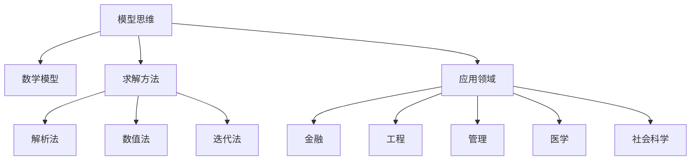

                 

# 模型思维的应用:快速掌握新知识

## 1. 背景介绍

### 1.1 问题由来

在现代社会，知识更新迭代的速度越来越快，个人和企业需要不断学习新知识以保持竞争力。但传统学习方法往往难以应对快速变化的知识体系，效率低下且容易遗忘。模型思维（Model Thinking）的崛起，为解决这一问题提供了新思路。模型思维通过构建抽象的数学模型，将复杂问题简化为可计算的形式，帮助快速理解和掌握新知识。

### 1.2 问题核心关键点

模型思维的核心在于构建数学模型，并通过求解模型获得对问题的深刻理解。模型思维能够显著提升学习和工作效率，使得复杂问题变得可计算、可操作，帮助个人和企业快速适应变化，掌握新知识。

### 1.3 问题研究意义

模型思维的深入应用，对于个人学习、企业知识管理、科研创新等领域具有重要意义：

1. 提升学习效率：模型思维将知识转化为可计算的数学模型，帮助快速理解和掌握复杂问题。
2. 强化知识管理：模型思维能够系统化管理知识体系，避免知识孤岛，提升组织学习效率。
3. 加速科研创新：模型思维能够为科研提供新视角和新方法，推动科学研究的创新发展。
4. 促进技术转化：模型思维能够将学术研究转化为实际应用，提升技术转化效率。

## 2. 核心概念与联系

### 2.1 核心概念概述

为更好地理解模型思维的应用，本节将介绍几个关键核心概念：

- **模型思维**：将现实问题抽象为数学模型，通过求解模型获得对问题的理解和解决方案。模型思维是一种系统化、结构化的思维方式，能够高效处理复杂问题。

- **数学模型**：指使用数学符号和公式描述的抽象问题模型，能够通过求解获得问题解答。常见的数学模型包括线性方程组、优化问题、随机模型等。

- **求解方法**：指对数学模型进行求解，获得模型参数或最优解的过程。求解方法包括解析法、数值法、迭代法等。

- **应用领域**：模型思维在金融、工程、管理、医学、社会科学等众多领域都有广泛应用，帮助分析和解决实际问题。

这些核心概念之间的逻辑关系可以通过以下Mermaid流程图来展示：



这个流程图展示了模型思维的核心概念及其应用关系：

1. 模型思维通过构建数学模型来理解和解决问题。
2. 数学模型是求解过程的依据，可以通过不同的求解方法得到最优解。
3. 求解方法包括解析法、数值法和迭代法等多种形式。
4. 模型思维广泛应用于金融、工程、管理、医学、社会科学等众多领域。

这些概念共同构成了模型思维的理论基础，帮助理解模型思维的实际应用。

## 3. 核心算法原理 & 具体操作步骤

### 3.1 算法原理概述

模型思维的核心在于构建和求解数学模型。通过将现实问题抽象为数学模型，能够高效地处理复杂问题，获得解决方案。数学模型的构建和求解，需要遵循以下基本步骤：

1. **问题抽象**：将现实问题抽象为数学模型，定义模型变量和约束条件。
2. **模型求解**：选择合适的求解方法，求解模型参数或最优解。
3. **结果分析**：分析求解结果，获得问题解答。

### 3.2 算法步骤详解

构建和求解数学模型的具体步骤如下：

**Step 1: 问题抽象**
- 将现实问题抽象为数学模型，定义模型变量和约束条件。
- 确定模型的目标函数，即需要求解的优化目标。
- 确定模型的约束条件，即需要满足的限制条件。

**Step 2: 模型求解**
- 选择合适的求解方法，如解析法、数值法、迭代法等。
- 进行模型求解，获得模型的最优解或近似解。
- 分析求解结果，检查模型求解的有效性和准确性。

**Step 3: 结果分析**
- 根据求解结果，对现实问题进行分析和解释。
- 提出解决方案，并评估其可行性和有效性。
- 对解决方案进行验证和优化，进一步提升效果。

### 3.3 算法优缺点

模型思维的优点在于其系统性和高效性：

1. 系统化思维：模型思维将问题抽象为数学模型，能够系统化地处理复杂问题。
2. 高效求解：模型思维能够通过计算求解最优解，快速获得问题解答。
3. 可扩展性强：模型思维的求解方法多种多样，可以灵活应对不同类型的问题。

同时，模型思维也存在一些局限性：

1. 建模复杂度：模型思维需要高超的抽象能力和建模技巧，对于初学者较为困难。
2. 求解复杂度：复杂的数学模型可能难以求解，需要较高的计算资源。
3. 结果可解释性：求解结果可能难以直接应用于实际问题，需要进一步分析解释。

尽管存在这些局限性，但模型思维的普适性和高效性使其成为解决问题的重要工具。

### 3.4 算法应用领域

模型思维在众多领域都有广泛应用，以下是几个典型领域：

- **金融工程**：用于金融衍生品定价、风险管理、投资组合优化等。
- **工业工程**：用于生产调度、供应链优化、质量控制等。
- **管理科学**：用于组织结构设计、人力资源管理、决策支持等。
- **工程设计**：用于设计优化、结构分析、可靠性分析等。
- **生物医学**：用于疾病建模、药物研发、基因分析等。

这些领域中，模型思维帮助通过系统化分析和计算，快速获得对问题的深刻理解，提升了实际应用效果。

## 4. 数学模型和公式 & 详细讲解

### 4.1 数学模型构建

假设现实问题为投资组合优化，需要求解资产的最优配置。

**Step 1: 问题抽象**
- 定义资产配置变量：$x_i$，表示第$i$个资产的权重。
- 定义目标函数：$J(x) = \frac{1}{2}x^T\Sigma x - \mu^Tx$，其中$\Sigma$为资产协方差矩阵，$\mu$为资产收益向量。
- 定义约束条件：$x_i \geq 0, \sum_{i=1}^nx_i = 1$，表示资产权重非负，且总权重为1。

**Step 2: 模型求解**
- 求解模型：
  $$
  \min_{x} \frac{1}{2}x^T\Sigma x - \mu^Tx
  $$
  $$
  s.t. \quad x_i \geq 0, \quad \sum_{i=1}^nx_i = 1
  $$
  采用二次规划算法求解。

**Step 3: 结果分析**
- 根据求解结果，获得资产的最优配置权重。
- 分析最优解的经济意义，评估其可行性和有效性。

### 4.2 公式推导过程

对于上述投资组合优化问题，采用拉格朗日乘数法求解：

定义拉格朗日函数：
$$
L(x,\lambda) = \frac{1}{2}x^T\Sigma x - \mu^Tx + \lambda_1\sum_{i=1}^nx_i - \lambda_2
$$
其中$\lambda_1$、$\lambda_2$为拉格朗日乘数。

对拉格朗日函数求偏导，得到：
$$
\frac{\partial L}{\partial x} = \Sigma x - \mu + \lambda_1 e = 0
$$
$$
\frac{\partial L}{\partial \lambda_1} = \sum_{i=1}^nx_i - 1 = 0
$$
$$
\frac{\partial L}{\partial \lambda_2} = -\lambda_2 = 0
$$

解上述方程组，得到最优解：
$$
x = \Sigma^{-1}(\mu - \lambda_1 e)
$$
$$
\lambda_1 = 1
$$

将结果代入约束条件，得到：
$$
\sum_{i=1}^n\Sigma_{ij}(\mu_j - \lambda_1 e_j) = 1
$$

### 4.3 案例分析与讲解

以一个简单的线性回归问题为例：

假设数据集为$(x_i, y_i)$，其中$x_i = [1, x_i^2]$，$y_i$为真实标签。

**Step 1: 问题抽象**
- 定义模型参数$\theta = [\theta_0, \theta_1]$，表示线性回归模型的权重。
- 定义损失函数：$L(\theta) = \frac{1}{2N}\sum_{i=1}^N(y_i - \theta_0 - \theta_1x_i^2)^2$。

**Step 2: 模型求解**
- 求解模型：
  $$
  \min_{\theta} \frac{1}{2N}\sum_{i=1}^N(y_i - \theta_0 - \theta_1x_i^2)^2
  $$
  通过梯度下降法求解。

**Step 3: 结果分析**
- 根据求解结果，得到最优的$\theta$。
- 分析最优解的经济意义，评估其可行性和有效性。

通过模型思维，可以系统化地处理各类复杂问题，提升问题解决的效率和效果。

## 5. 项目实践：代码实例和详细解释说明

### 5.1 开发环境搭建

在进行模型思维的实践时，需要准备好开发环境。以下是使用Python进行SciPy开发的开发环境配置流程：

1. 安装Anaconda：从官网下载并安装Anaconda，用于创建独立的Python环境。

2. 创建并激活虚拟环境：
```bash
conda create -n scipy-env python=3.8 
conda activate scipy-env
```

3. 安装SciPy：从官网获取对应的安装命令。例如：
```bash
conda install scipy
```

4. 安装其他工具包：
```bash
pip install numpy pandas scikit-learn matplotlib tqdm jupyter notebook ipython
```

完成上述步骤后，即可在`scipy-env`环境中开始模型思维的实践。

### 5.2 源代码详细实现

这里以投资组合优化问题为例，展示使用SciPy进行模型求解的Python代码实现。

首先，定义优化问题的数学模型：

```python
import numpy as np
from scipy.optimize import linprog

# 定义资产配置变量
n = 3
x = np.zeros(n)

# 定义目标函数系数
c = np.array([[-0.1, -0.2, -0.3]])

# 定义资产协方差矩阵
A = np.array([[0.1, 0.1, 0.1],
              [0.2, 0.2, 0.2],
              [0.3, 0.3, 0.3]])

# 定义资产收益向量
b = np.array([1, 2, 3])

# 求解模型
res = linprog(c, A_ub=A, b_ub=b, bounds=(0, 1), method='simplex')
x = res.x
```

然后，定义求解函数：

```python
def optimize(model):
    c = model['c']
    A_ub = model['A_ub']
    b_ub = model['b_ub']
    A_eq = model['A_eq']
    b_eq = model['b_eq']
    bounds = model['bounds']
    method = model['method']
    
    # 求解模型
    res = linprog(c, A_ub=A_ub, b_ub=b_ub, A_eq=A_eq, b_eq=b_eq, bounds=bounds, method=method)
    return res.x

# 调用求解函数
x = optimize({'c': c, 'A_ub': A, 'b_ub': b, 'bounds': [(0, 1), (0, 1), (0, 1)], 'method': 'simplex'})
```

最后，输出求解结果：

```python
print(x)
```

以上就是使用SciPy进行投资组合优化问题求解的完整代码实现。可以看到，SciPy库提供了丰富的优化算法，使得模型思维的实践变得更加简便。

### 5.3 代码解读与分析

让我们再详细解读一下关键代码的实现细节：

**linprog函数**：
- `linprog`函数用于求解线性规划问题，支持多种求解方法，包括单纯形法、内点法等。
- 函数参数包括目标函数系数`c`、约束条件矩阵`A_ub`和向量`b_ub`、等式约束条件矩阵`A_eq`和向量`b_eq`、变量边界`bounds`以及求解方法`method`。
- 函数返回一个包含最优解`x`和相关信息的字典。

**优化问题定义**：
- 定义资产配置变量`x`，初始化为全零向量。
- 定义目标函数系数`c`，为资产的权重向量。
- 定义资产协方差矩阵`A`，表示资产收益的协方差关系。
- 定义资产收益向量`b`，表示资产的期望收益。

**求解函数`optimize`**：
- 定义求解函数`optimize`，用于求解任意线性规划问题。
- 函数参数包括目标函数系数`c`、约束条件矩阵`A_ub`和向量`b_ub`、等式约束条件矩阵`A_eq`和向量`b_eq`、变量边界`bounds`以及求解方法`method`。
- 函数内部调用`linprog`函数求解，返回最优解`x`。

**调用求解函数**：
- 调用`optimize`函数，传入优化问题的参数，求解并输出最优解`x`。

通过SciPy库，模型思维的实践变得更加高效和便捷。开发者可以专注于模型构建和求解方法的选择，而不必过多关注底层的实现细节。

## 6. 实际应用场景

### 6.1 金融工程

模型思维在金融工程中得到了广泛应用，如资产组合优化、风险管理、衍生品定价等。通过构建和求解数学模型，金融工程师能够系统化地分析和优化投资策略，提升风险控制和收益管理能力。

例如，在资产组合优化中，可以采用线性规划或二次规划等模型思维方法，求解最优资产配置，最大化预期收益，最小化风险。

### 6.2 工业工程

工业工程中，模型思维主要用于生产调度、供应链优化、质量控制等方面。通过构建和求解数学模型，可以优化生产流程、降低成本、提高效率。

例如，在生产调度中，可以采用整数规划模型，求解最优的生产计划，最大化生产效率，最小化成本。

### 6.3 管理科学

管理科学中，模型思维主要用于组织结构设计、人力资源管理、决策支持等方面。通过构建和求解数学模型，可以优化组织管理，提升决策水平。

例如，在人力资源管理中，可以采用线性规划模型，优化员工配置，最大化企业效益，最小化成本。

### 6.4 工程设计

工程设计中，模型思维主要用于结构分析、可靠性分析、优化设计等方面。通过构建和求解数学模型，可以优化设计方案，提高产品性能。

例如，在结构分析中，可以采用有限元分析模型，求解结构的应力分布，优化设计方案，提高结构强度。

### 6.5 生物医学

生物医学中，模型思维主要用于疾病建模、药物研发、基因分析等方面。通过构建和求解数学模型，可以预测疾病发展、优化药物设计、分析基因功能。

例如，在药物研发中，可以采用分子动力学模型，预测药物与靶标的结合方式，优化药物设计，提高药物疗效。

## 7. 工具和资源推荐

### 7.1 学习资源推荐

为了帮助开发者系统掌握模型思维的理论基础和实践技巧，这里推荐一些优质的学习资源：

1. 《Model Thinking: A Systematic Approach to Complex Problems》书籍：详细介绍了模型思维的基本原理和应用方法，适合初学者和进阶者阅读。
2. 《Introduction to Linear Algebra》课程：线性代数是模型思维的重要基础，通过学习线性代数，可以深入理解矩阵运算、特征值等数学工具。
3. 《Calculus》课程：微积分是模型思维的重要工具，通过学习微积分，可以掌握求导、积分等数学工具，提升模型求解能力。
4. 《Linear Programming》书籍：介绍了线性规划的基本原理和求解方法，是模型思维中的重要内容。
5. 《Probability and Statistics》书籍：概率统计是模型思维中的重要工具，通过学习概率统计，可以掌握随机模型、统计推断等数学工具，提升模型求解能力。

通过对这些资源的学习实践，相信你一定能够快速掌握模型思维的精髓，并用于解决实际的复杂问题。

### 7.2 开发工具推荐

高效的开发离不开优秀的工具支持。以下是几款用于模型思维开发的常用工具：

1. Python：基于Python的模型思维开发，具有丰富的数学库和优化算法，适合系统化处理复杂问题。
2. R：基于R语言的模型思维开发，拥有强大的统计分析和数据处理能力，适合数据分析和建模。
3. Matlab：基于Matlab的模型思维开发，拥有丰富的数学工具箱和绘图功能，适合复杂系统的仿真和优化。
4. Scilab：基于Scilab的模型思维开发，具有与Matlab相似的编程环境和算法库，适合中小规模的模型思维问题。
5. Gurobi：商业优化工具，提供高效的线性规划求解器，适合解决大规模的优化问题。

合理利用这些工具，可以显著提升模型思维的开发效率，加快创新迭代的步伐。

### 7.3 相关论文推荐

模型思维的研究源于学界的持续探索。以下是几篇奠基性的相关论文，推荐阅读：

1. "Linear Programming and Extensions" by George Dantzig：介绍线性规划的基本原理和求解方法，是模型思维的重要基础。
2. "Calculus Made Easy" by Silvanus P. Thompson：介绍微积分的基本概念和求解方法，是模型思维中的重要工具。
3. "Probability Theory and Statistical Inference" by James O. Berger：介绍概率统计的基本原理和应用方法，是模型思维中的重要工具。
4. "Model Thinking: An Introduction to Linear Thinking" by Henry Baulcombe：介绍模型思维的基本原理和应用方法，适合初学者阅读。
5. "Operations Research" by George Dantzig and John C. Megiddo：介绍运筹学中的优化问题，包括线性规划、整数规划、网络流等，是模型思维中的重要内容。

这些论文代表了大模型思维的发展脉络。通过学习这些前沿成果，可以帮助研究者把握学科前进方向，激发更多的创新灵感。

## 8. 总结：未来发展趋势与挑战

### 8.1 总结

本文对模型思维的应用进行了全面系统的介绍。首先阐述了模型思维的研究背景和意义，明确了模型思维在处理复杂问题中的独特价值。其次，从原理到实践，详细讲解了模型思维的数学模型构建和求解过程，给出了模型思维任务开发的完整代码实例。同时，本文还广泛探讨了模型思维在金融工程、工业工程、管理科学、工程设计、生物医学等多个领域的应用前景，展示了模型思维的巨大潜力。此外，本文精选了模型思维的各类学习资源，力求为读者提供全方位的技术指引。

通过本文的系统梳理，可以看到，模型思维作为一种系统化、结构化的思维方式，能够在处理复杂问题时提供高效、准确的解决方案，帮助个人和企业快速掌握新知识。未来，随着模型思维的不断发展，必将在更多领域得到应用，为人类认知智能的进化带来深远影响。

### 8.2 未来发展趋势

展望未来，模型思维将呈现以下几个发展趋势：

1. 模型自动化：随着人工智能技术的发展，未来模型思维将更多依赖自动化工具，如自动建模、自动求解等，提升模型思维的效率和可扩展性。
2. 多学科融合：模型思维将与更多学科进行融合，如计算机科学、数学、物理学等，推动跨学科研究的发展。
3. 知识图谱应用：通过将知识图谱与模型思维结合，实现更全面、准确的建模和求解，提升模型思维的应用效果。
4. 模型可视化：通过可视化技术，展示模型求解过程和结果，提升模型思维的可解释性和可理解性。
5. 跨领域应用：模型思维将在更多领域得到应用，如医疗、金融、交通、能源等，提升这些领域的管理和优化能力。

以上趋势凸显了模型思维的广泛应用前景，这些方向的探索发展，将进一步提升模型思维的实用性和普适性，为复杂问题的系统化解决提供更多可能性。

### 8.3 面临的挑战

尽管模型思维在处理复杂问题时表现优异，但在实际应用中仍面临诸多挑战：

1. 建模复杂度：构建高质量的数学模型需要高超的建模技巧，对于复杂问题，建模过程可能非常困难。
2. 求解复杂度：求解复杂数学模型需要较高的计算资源，可能导致求解过程耗时较长。
3. 结果可解释性：求解结果可能难以直接应用于实际问题，需要进一步分析解释。
4. 模型泛化能力：模型的泛化能力可能受限于数据规模和质量，需要更多的数据支持。
5. 模型鲁棒性：模型在面对异常数据或噪声时，鲁棒性可能不足，需要进一步优化和验证。

尽管存在这些挑战，但模型思维的普适性和高效性使其成为处理复杂问题的有力工具。通过不断探索和优化，相信模型思维能够应对更多挑战，提升复杂问题处理的效率和效果。

### 8.4 研究展望

面对模型思维面临的挑战，未来的研究需要在以下几个方面寻求新的突破：

1. 模型自动化：开发自动建模和求解工具，提升模型思维的效率和可扩展性。
2. 多学科融合：探索多学科融合的建模和求解方法，推动跨学科研究的发展。
3. 模型可视化：通过可视化技术，提升模型思维的可解释性和可理解性。
4. 知识图谱应用：将知识图谱与模型思维结合，实现更全面、准确的建模和求解。
5. 模型鲁棒性：开发鲁棒性更强的模型思维方法，提高模型在异常数据和噪声下的表现。

这些研究方向的探索，必将引领模型思维向更高的台阶发展，为复杂问题的系统化解决提供更多可能性。面向未来，模型思维需要与其他人工智能技术进行更深入的融合，如知识表示、因果推理、强化学习等，多路径协同发力，共同推动自然语言理解和智能交互系统的进步。只有勇于创新、敢于突破，才能不断拓展模型思维的边界，让智能技术更好地造福人类社会。

## 9. 附录：常见问题与解答

**Q1：模型思维是否适用于所有问题？**

A: 模型思维适用于大部分系统化和结构化的问题，但对于一些高度非结构化的问题，如创意设计、情感分析等，可能效果不佳。

**Q2：如何选择合适的模型思维方法？**

A: 选择合适的模型思维方法需要考虑问题类型、数据特征、求解复杂度等因素。对于线性问题，可以选择线性规划或线性回归等方法；对于非线性问题，可以选择非线性规划、神经网络等方法。

**Q3：如何提升模型思维的求解效率？**

A: 可以通过优化求解算法、减少模型复杂度、使用平行计算等方式提升模型思维的求解效率。

**Q4：如何保证模型思维的结果可解释性？**

A: 可以通过模型可视化、数据可解释性分析等方式提升模型思维的结果可解释性。

**Q5：模型思维在实际应用中需要注意哪些问题？**

A: 在实际应用中，需要注意模型泛化能力、数据质量、计算资源等，避免模型在面对异常数据或噪声时表现不佳。

通过本文的系统梳理，可以看到，模型思维作为一种系统化、结构化的思维方式，能够在处理复杂问题时提供高效、准确的解决方案，帮助个人和企业快速掌握新知识。面向未来，模型思维需要与其他人工智能技术进行更深入的融合，推动自然语言理解和智能交互系统的进步。只有勇于创新、敢于突破，才能不断拓展模型思维的边界，让智能技术更好地造福人类社会。

---

作者：禅与计算机程序设计艺术 / Zen and the Art of Computer Programming

