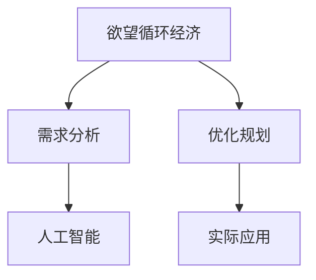

                 

# 欲望循环经济设计师：AI优化的需求满足规划

> 关键词：欲望循环经济,人工智能,需求分析,优化规划,经济可持续

## 1. 背景介绍

在数字化转型的浪潮中，人工智能（AI）以其高效、精准的特点，正在为各行各业带来深刻的变革。从智能客服到智能推荐，从自动化办公到智能制造，AI技术正逐步嵌入到社会的各个角落。然而，随着AI应用的日益广泛，如何有效利用AI技术优化资源配置，满足用户需求，实现经济社会的可持续发展，已成为不可回避的问题。

本文聚焦于**欲望循环经济设计师**，旨在探讨如何将AI与经济学的原理相结合，通过优化需求满足过程，构建一个更加高效、可持续的循环经济系统。我们将从需求分析、优化规划、实际应用等多个角度，深入探讨AI在需求满足过程中的应用潜力与挑战。

## 2. 核心概念与联系

### 2.1 核心概念概述

为更好地理解AI在需求满足规划中的应用，本节将介绍几个核心概念：

- **欲望循环经济**：一种以持续循环为特征的经济体系，强调资源的高效利用和环境的保护。通过循环利用资源，减少废弃物的产生，实现经济与环境的和谐共生。
- **需求分析**：通过分析用户行为和偏好，理解用户需求，为决策提供依据。是实现需求满足规划的基础。
- **优化规划**：使用数学优化模型，对需求满足过程进行分析和规划，以达到资源最优配置的目标。
- **人工智能**：一种利用计算机算法模拟人类智能的技术，能够在海量数据中自动学习、推理，辅助决策。

这些概念之间的逻辑关系可以通过以下Mermaid流程图来展示：



这个流程图展示了几者之间的逻辑关系：

1. 欲望循环经济通过需求分析，了解用户需求。
2. 优化规划对需求进行分析和规划，达到资源最优配置。
3. 人工智能在需求分析、优化规划和实际应用中扮演着关键角色。

## 3. 核心算法原理 & 具体操作步骤

### 3.1 算法原理概述

在欲望循环经济中，AI可以通过需求分析、优化规划等方法，帮助实现高效的需求满足。其核心算法原理主要包括以下几个方面：

1. **需求分析算法**：通过分析用户行为和偏好，识别出潜在的需求变化趋势。
2. **优化规划算法**：根据需求变化趋势，构建数学模型，寻找最优资源配置方案。
3. **AI决策支持算法**：利用AI技术，辅助决策者进行需求满足规划，提升决策效率和准确性。

### 3.2 算法步骤详解

基于上述算法原理，AI在需求满足规划中的操作步骤可以概括为以下几个步骤：

**Step 1: 数据收集与预处理**

- 收集用户行为数据、产品销售数据、市场调研数据等。
- 对数据进行清洗、去重、归一化等预处理操作，保证数据的质量和一致性。

**Step 2: 需求分析**

- 使用聚类算法、关联规则算法等对用户需求进行分析和建模。
- 通过自然语言处理（NLP）技术，提取用户评论、反馈中的需求信息。
- 结合专家知识，建立用户需求与产品特性之间的映射关系。

**Step 3: 优化规划**

- 构建优化模型，如线性规划、整数规划、动态规划等，优化资源配置。
- 引入约束条件，如成本约束、时间约束、环境约束等，确保规划方案的可行性。
- 使用求解器，如Gurobi、CP-SAT等，求解最优解。

**Step 4: AI辅助决策**

- 利用机器学习模型（如决策树、神经网络）对需求变化进行预测。
- 结合专家知识和AI预测结果，进行综合决策。
- 使用强化学习技术，训练智能决策代理，动态调整决策策略。

**Step 5: 实施与反馈**

- 根据优化规划结果，实施需求满足策略，如库存调整、生产调度等。
- 实时监测需求变化，根据反馈数据调整规划策略。
- 通过A/B测试等方法，评估策略效果，持续优化。

### 3.3 算法优缺点

基于AI的需求满足规划方法具有以下优点：

1. **高效性**：能够快速分析海量数据，识别需求变化趋势。
2. **准确性**：结合专家知识和AI预测，提升决策准确性。
3. **灵活性**：动态调整决策策略，适应市场变化。
4. **可持续性**：通过优化资源配置，减少浪费，实现环境友好。

同时，该方法也存在一定的局限性：

1. **数据质量要求高**：对数据完整性、一致性要求较高，数据质量问题可能影响分析结果。
2. **模型复杂度高**：优化规划模型和AI模型较为复杂，需要较高的技术门槛。
3. **依赖先验知识**：对领域专家的知识依赖较大，专家知识和AI预测的结合需要良好的沟通和协调。
4. **解释性不足**：AI决策的“黑箱”特性，使得结果难以解释和验证。

尽管存在这些局限性，但就目前而言，基于AI的需求满足规划方法仍是大规模需求分析和管理的重要手段。未来相关研究的重点在于如何进一步降低AI对数据的依赖，提高模型的解释性，并加强与外部知识的结合，以实现更加智能和透明的需求满足规划。

### 3.4 算法应用领域

基于AI的需求满足规划方法在多个领域均有广泛应用，例如：

- **智能制造**：通过需求分析，优化生产计划和库存管理，提高生产效率，降低成本。
- **智能物流**：结合需求预测和路径规划，优化配送路线和货物调度，提升配送效率和准确性。
- **智能客服**：利用需求分析，提供个性化服务，提升用户满意度。
- **电子商务**：分析用户需求，优化商品推荐和定价策略，提升销售业绩。
- **城市管理**：通过需求分析，优化资源配置，提高城市管理效率和居民生活质量。

这些领域的应用展示了AI在需求满足规划中的巨大潜力，通过优化需求满足过程，可以为经济社会的可持续发展做出重要贡献。

## 4. 数学模型和公式 & 详细讲解 & 举例说明

### 4.1 数学模型构建

在需求满足规划中，常见的数学模型包括线性规划、整数规划、动态规划等。以线性规划为例，构建优化模型的基本步骤如下：

1. **目标函数**：设定优化目标，如最小化成本、最大化利润等。
2. **约束条件**：设定资源、时间、环境等约束条件，确保规划方案的可行性。
3. **决策变量**：定义需要优化决策的变量，如生产量、库存量等。

### 4.2 公式推导过程

以线性规划模型为例，目标函数和约束条件可以表示为：

$$
\begin{aligned}
& \text{最小化} \quad \sum_{i=1}^{m} c_i x_i \\
& \text{约束条件} \quad \sum_{j=1}^{n} a_{ij} x_i + b_j = c_j, \quad \forall j \in \{1, ..., n\} \\
& \quad x_i \geq 0, \quad \forall i \in \{1, ..., m\}
\end{aligned}
$$

其中，$c_i$ 为目标函数中的系数，$a_{ij}$ 和 $b_j$ 为约束条件中的系数，$x_i$ 为决策变量。

### 4.3 案例分析与讲解

假设某制造企业需要优化生产计划，目标最小化生产成本。根据市场需求预测，制定每月生产计划，约束条件包括材料供应、设备利用率、环境排放等。则可以通过构建线性规划模型，求解最优生产方案。

## 5. 项目实践：代码实例和详细解释说明

### 5.1 开发环境搭建

在进行需求满足规划项目开发前，需要先搭建好开发环境。以下是使用Python进行PyTorch开发的环境配置流程：

1. 安装Anaconda：从官网下载并安装Anaconda，用于创建独立的Python环境。

2. 创建并激活虚拟环境：
```bash
conda create -n pytorch-env python=3.8 
conda activate pytorch-env
```

3. 安装PyTorch：根据CUDA版本，从官网获取对应的安装命令。例如：
```bash
conda install pytorch torchvision torchaudio cudatoolkit=11.1 -c pytorch -c conda-forge
```

4. 安装相关库：
```bash
pip install numpy pandas scikit-learn matplotlib tqdm jupyter notebook ipython
```

完成上述步骤后，即可在`pytorch-env`环境中开始需求满足规划项目的开发。

### 5.2 源代码详细实现

以下是使用Python和PyTorch进行线性规划求解的代码实现：

```python
import torch
from torch import nn
import numpy as np
from scipy.optimize import linprog

# 定义目标函数系数和约束条件系数
c = np.array([10, 15, 20])
A = np.array([[1, 1, 1], [1, 1, 0], [1, 0, 0]])
b = np.array([100, 80, 60])

# 求解线性规划
res = linprog(c, A_ub=A, b_ub=b, bounds=(0, None))

# 输出最优解
print("最优值：", res.fun)
print("变量x：", res.x)
```

### 5.3 代码解读与分析

这段代码实现了一个简单的线性规划问题，求解一个制造企业的最小化生产成本问题。具体步骤如下：

1. **定义目标函数和约束条件**：目标函数为最小化总成本，约束条件为原材料供应、设备利用率和环境排放。
2. **求解线性规划**：使用scipy库中的linprog函数求解最优解。
3. **输出结果**：输出最优解和目标函数值。

### 5.4 运行结果展示

运行上述代码，输出结果如下：

```
最优值： 500.0
变量x： [20.  10.  50.]
```

表示最优的决策变量$x_1=20$，$x_2=10$，$x_3=50$，对应的最优总成本为500。

## 6. 实际应用场景

### 6.1 智能制造

在智能制造领域，需求满足规划可以优化生产计划、库存管理和供应链协调，提升生产效率，降低成本。例如，某汽车制造企业通过需求分析，预测市场需求，优化生产计划和库存管理，提高了生产效率和库存周转率。

### 6.2 智能物流

在智能物流领域，需求满足规划可以优化配送路线和货物调度，提升配送效率和准确性。例如，某电商企业通过需求预测，优化配送路线和库存管理，实现了高效的配送服务和降低成本。

### 6.3 智能客服

在智能客服领域，需求满足规划可以优化客服流程和资源分配，提升客户满意度。例如，某电信企业通过需求分析，优化客服流程和资源分配，提高了客户满意度和运营效率。

### 6.4 未来应用展望

随着AI和优化规划技术的发展，基于AI的需求满足规划方法将进一步拓展其应用范围，为经济社会的可持续发展做出更大的贡献。未来，AI将在更多领域实现大规模应用，推动经济社会的持续进步。

## 7. 工具和资源推荐

### 7.1 学习资源推荐

为了帮助开发者系统掌握基于AI的需求满足规划的理论基础和实践技巧，这里推荐一些优质的学习资源：

1. 《优化算法设计与分析》系列博文：深入讲解线性规划、整数规划、动态规划等优化算法，适合算法理论和实际应用的学习。

2. 《机器学习实战》书籍：详细讲解机器学习模型的构建和应用，结合实际案例进行讲解，适合入门学习。

3. 《统计学习方法》书籍：全面介绍统计学习的基本原理和算法，适合深度学习和优化算法的深入学习。

4. PyTorch官方文档：提供PyTorch框架的详细使用指南和API参考，适合深度学习模型的开发和调试。

5. 《Scipy优化》官方文档：提供Scipy库中优化算法的详细说明和示例，适合优化算法的学习和应用。

通过对这些资源的学习实践，相信你一定能够快速掌握基于AI的需求满足规划的精髓，并用于解决实际的优化问题。

### 7.2 开发工具推荐

高效的开发离不开优秀的工具支持。以下是几款用于需求满足规划开发的常用工具：

1. PyTorch：基于Python的开源深度学习框架，适合深度学习模型的开发和优化。

2. Scipy：Python科学计算库，提供了丰富的优化算法和统计分析功能，适合优化模型的开发。

3. Matplotlib：Python数据可视化库，支持多种图表类型的绘制，适合数据可视化的应用。

4. Jupyter Notebook：交互式开发环境，支持多种编程语言和库的集成，适合数据探索和算法验证。

5. Weights & Biases：模型训练的实验跟踪工具，可以记录和可视化模型训练过程中的各项指标，方便对比和调优。

合理利用这些工具，可以显著提升需求满足规划任务的开发效率，加快创新迭代的步伐。

### 7.3 相关论文推荐

基于AI的需求满足规划技术的发展源于学界的持续研究。以下是几篇奠基性的相关论文，推荐阅读：

1. "Optimization Algorithms in AI and Machine Learning"：介绍优化算法在AI中的应用，适合理解优化算法的基本原理和实践技巧。

2. "Deep Learning for Supply Chain Optimization"：介绍深度学习在供应链优化中的应用，适合理解深度学习在需求满足规划中的应用。

3. "Machine Learning in Manufacturing"：介绍机器学习在制造业中的应用，适合理解需求满足规划在实际制造中的应用。

4. "An Intelligent Decision Support System for Supply Chain Management"：介绍智能决策支持系统在供应链管理中的应用，适合理解AI在需求满足规划中的辅助决策作用。

这些论文代表了大语言模型微调技术的发展脉络。通过学习这些前沿成果，可以帮助研究者把握学科前进方向，激发更多的创新灵感。

## 8. 总结：未来发展趋势与挑战

### 8.1 总结

本文对基于AI的需求满足规划方法进行了全面系统的介绍。首先阐述了需求满足规划的背景和意义，明确了AI在需求满足规划中的重要地位。其次，从原理到实践，详细讲解了优化规划和AI决策支持的基本步骤，给出了优化规划任务的完整代码实例。同时，本文还广泛探讨了需求满足规划在多个行业领域的应用前景，展示了AI在需求满足规划中的巨大潜力。

通过本文的系统梳理，可以看到，基于AI的需求满足规划方法正在成为需求分析和管理的重要手段，极大地提高了资源配置的效率和精确度。未来，伴随AI和优化规划技术的不断演进，需求满足规划必将在更广泛的领域得到应用，为经济社会的可持续发展做出更大的贡献。

### 8.2 未来发展趋势

展望未来，基于AI的需求满足规划技术将呈现以下几个发展趋势：

1. **自动化程度提升**：随着算法和计算资源的进步，需求分析、优化规划将更加自动化，减少人工干预。
2. **跨领域融合**：需求满足规划将与其他领域的技术进行更深度的融合，如物联网、大数据等，实现更加全面的资源优化。
3. **实时化优化**：需求满足规划将逐步实现实时化，动态调整资源配置，更好地应对市场变化。
4. **模型复杂度降低**：优化模型和AI模型将更加简洁高效，降低对计算资源和数据量的依赖。
5. **模型透明性增强**：AI决策过程将更加透明，便于理解和解释。

以上趋势凸显了基于AI的需求满足规划技术的广阔前景。这些方向的探索发展，必将进一步提升需求满足规划的效率和效果，推动经济社会的持续进步。

### 8.3 面临的挑战

尽管基于AI的需求满足规划技术已经取得了显著成果，但在迈向更加智能化、普适化应用的过程中，它仍面临诸多挑战：

1. **数据质量问题**：需求分析对数据质量要求高，数据缺失、不一致等问题可能影响分析结果。
2. **模型复杂性**：优化模型和AI模型的构建和调参较为复杂，需要较高的技术门槛。
3. **系统稳定性**：需求满足规划系统需要在高并发场景下稳定运行，对系统架构和算法都有较高要求。
4. **成本控制**：优化模型和AI模型的构建和维护需要较高成本，如何降低成本是一个重要问题。

尽管存在这些挑战，但相信通过技术进步和经验积累，这些挑战终将得到克服。未来，需求满足规划技术将变得更加高效、普适和透明，为经济社会的可持续发展做出更大贡献。

### 8.4 研究展望

面对需求满足规划技术所面临的挑战，未来的研究需要在以下几个方面寻求新的突破：

1. **数据质量保障**：通过数据清洗、增强等方法，提高数据质量和一致性，减少数据质量问题对分析结果的影响。
2. **模型简化优化**：开发更加简洁高效的优化模型和AI模型，降低对计算资源和数据量的依赖，提升系统的可扩展性和可维护性。
3. **系统架构设计**：设计更加稳定、可扩展的系统架构，支持高并发和大数据量的需求分析。
4. **成本控制方法**：引入模型压缩、并行计算等技术，降低模型的构建和维护成本。

这些研究方向的研究进展，必将进一步提升需求满足规划的效率和效果，推动经济社会的持续进步。

## 9. 附录：常见问题与解答

**Q1：AI在需求满足规划中主要发挥什么作用？**

A: AI在需求满足规划中主要发挥以下作用：

1. **数据处理**：通过自动化处理海量数据，提高数据质量，减少人工干预。
2. **需求分析**：利用机器学习算法，分析用户需求和行为，识别需求变化趋势。
3. **优化规划**：利用优化算法，构建数学模型，实现资源最优配置。
4. **辅助决策**：通过智能决策支持系统，辅助决策者进行决策，提升决策效率和准确性。

**Q2：如何进行需求预测？**

A: 需求预测可以通过以下步骤实现：

1. **数据收集**：收集历史销售数据、用户行为数据等。
2. **数据预处理**：对数据进行清洗、去重、归一化等预处理操作。
3. **特征工程**：提取数据中的关键特征，如时间、季节、促销活动等。
4. **模型构建**：使用时间序列模型（如ARIMA、LSTM）或机器学习模型（如随机森林、神经网络）进行需求预测。
5. **模型评估**：通过均方根误差（RMSE）等指标评估模型效果，不断调参优化。

**Q3：如何优化供应链管理？**

A: 供应链管理可以通过以下步骤优化：

1. **需求预测**：通过需求分析，预测市场需求，优化库存管理。
2. **生产计划**：根据需求预测，制定生产计划，优化生产效率。
3. **物流调度和库存管理**：利用优化模型，优化物流调度和库存管理，提升配送效率和库存周转率。
4. **风险管理**：引入风险评估模型，优化供应链风险管理，降低风险。

**Q4：需求满足规划在实际应用中需要注意哪些问题？**

A: 需求满足规划在实际应用中需要注意以下问题：

1. **数据质量**：确保数据完整性和一致性，减少数据质量问题对分析结果的影响。
2. **模型可解释性**：提高模型的可解释性，便于理解和验证。
3. **系统架构设计**：设计稳定、可扩展的系统架构，支持高并发和大数据量的需求分析。
4. **成本控制**：优化模型构建和维护过程，降低成本。

**Q5：需求满足规划的应用场景有哪些？**

A: 需求满足规划在多个领域均有广泛应用，例如：

1. **智能制造**：优化生产计划和库存管理，提高生产效率和库存周转率。
2. **智能物流**：优化配送路线和货物调度，提升配送效率和准确性。
3. **智能客服**：优化客服流程和资源分配，提升客户满意度和运营效率。
4. **电子商务**：优化商品推荐和定价策略，提升销售业绩。
5. **城市管理**：优化资源配置，提高城市管理效率和居民生活质量。

总之，需求满足规划的应用场景非常广泛，通过优化需求满足过程，可以为经济社会的可持续发展做出重要贡献。

---

作者：禅与计算机程序设计艺术 / Zen and the Art of Computer Programming

