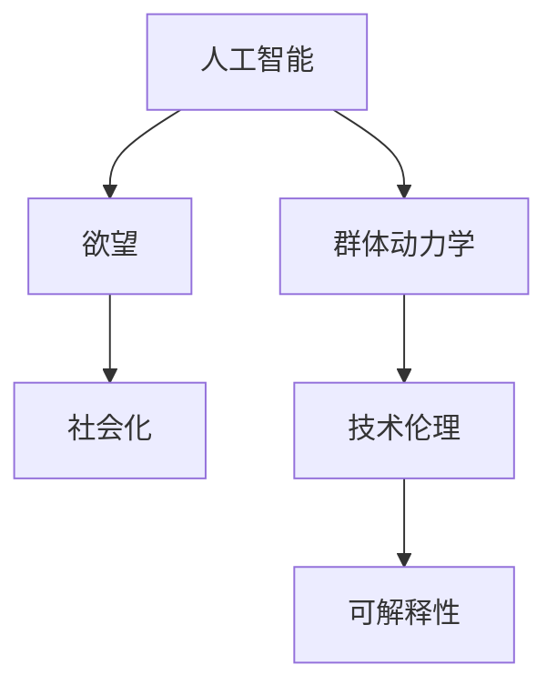

                 

# 欲望的社会化：AI驱动的群体动力学

## 1. 背景介绍

### 1.1 问题由来

随着人工智能（AI）技术的发展，我们逐渐看到了AI对社会行为的深刻影响。从推荐算法到自动驾驶，从智能家居到在线广告，AI技术几乎渗透到了社会生活的各个角落。然而，AI不仅改变了我们的生产生活方式，也在悄然塑造着人们的欲望和行为。

在本博客中，我们将探讨AI如何通过群体动力学的机制，驱动和影响人类的欲望和社会行为。通过深入分析，我们希望揭示AI如何重塑社会，以及在这种趋势下，我们应如何应对和引导这种变化。

### 1.2 问题核心关键点

- **AI与社会欲望的交互**：AI如何通过算法和数据挖掘，预测和满足人类欲望，并影响群体行为。
- **群体动力学在AI中的体现**：AI系统如何模拟群体动力学的复杂性，驱动个体和群体的行为变化。
- **欲望的社会化**：AI如何通过群体动力学的机制，塑造和传播欲望，改变社会行为模式。
- **技术伦理与责任**：在AI驱动的社会变革中，我们应如何平衡技术进步与伦理责任，确保AI的良性发展。

这些关键点将贯穿全篇，帮助我们全面理解AI在欲望社会化中的作用，以及如何应对这一挑战。

## 2. 核心概念与联系

### 2.1 核心概念概述

- **人工智能（AI）**：利用计算机算法和数据，使机器能够执行人类通常需要智能才能完成的任务。

- **群体动力学**：研究群体中个体间相互作用、影响和决策过程的科学，探讨群体如何形成、维持和变化。

- **欲望（Desire）**：驱动个体行为的内在需求或愿望，通常与满足感、幸福感相关。

- **社会化（Socialization）**：个体通过与他人的互动，学习社会规范、价值观和行为准则的过程。

- **技术伦理（Technological Ethics）**：研究技术发展对社会、伦理、法律等方面的影响，以及如何确保技术的负责任应用。

- **可解释性（Explainability）**：AI系统应具有解释其决策过程的能力，以增强信任和透明度。

这些概念之间的联系可以通过以下Mermaid流程图来展示：



这个流程图展示了大语言模型与群体动力学的基本关系，即AI通过技术手段驱动和影响群体的欲望和行为，并通过伦理和可解释性来平衡技术发展与人类福祉。

## 3. 核心算法原理 & 具体操作步骤

### 3.1 算法原理概述

AI驱动的群体动力学涉及多个层次的算法和模型。本节将重点介绍其中的一些核心算法原理：

- **推荐算法**：利用用户行为数据和产品特征，预测用户偏好，推荐符合用户需求的物品或内容。
- **情感分析**：通过文本处理技术，识别和分析用户情感，以了解用户需求和反馈。
- **聚类算法**：通过数据挖掘技术，识别用户群体特征，实现个性化推荐和服务。
- **强化学习**：通过奖励机制，训练AI模型，使其在特定环境中优化行为策略。

这些算法共同作用，使得AI能够预测和满足用户欲望，进而影响群体行为。

### 3.2 算法步骤详解

以下是一个基于AI的推荐系统的工作流程，展示了推荐的各个步骤：

1. **数据收集**：收集用户行为数据、产品特征、用户画像等。
2. **特征提取**：利用机器学习算法，从原始数据中提取有用特征。
3. **模型训练**：利用推荐算法和情感分析，训练预测模型。
4. **推荐生成**：根据用户行为和模型预测，生成个性化推荐。
5. **效果评估**：评估推荐效果，并不断优化模型。

### 3.3 算法优缺点

基于AI的群体动力学推荐系统具有以下优点：

- **高效性**：利用大数据分析和机器学习，快速生成个性化推荐。
- **准确性**：通过精准的数据分析和模型训练，提高推荐的准确性和个性化程度。

同时，也存在一些缺点：

- **隐私问题**：收集和分析用户数据可能导致隐私泄露。
- **算法偏见**：模型训练依赖于数据质量，可能存在算法偏见。
- **动态变化**：用户偏好和群体行为不断变化，模型需要持续更新以适应新的变化。

### 3.4 算法应用领域

AI驱动的群体动力学推荐系统广泛应用于多个领域：

- **电商推荐**：根据用户浏览和购买历史，推荐相似或相关商品。
- **新闻推荐**：根据用户阅读习惯，推荐相关新闻和文章。
- **内容推荐**：根据用户观看历史，推荐影视作品、音乐、书籍等。
- **社交推荐**：根据用户互动和兴趣，推荐好友和兴趣小组。

这些应用展示了AI如何通过群体动力学机制，影响和驱动用户欲望和社会行为。

## 4. 数学模型和公式 & 详细讲解

### 4.1 数学模型构建

推荐系统的一般数学模型为：

$$
f(x_i, y_i) = \sum_{k=1}^K w_k \phi_k(x_i) \theta_k + b
$$

其中，$x_i$为第$i$个用户的特征向量，$y_i$为对应的行为标签（如购买、阅读等），$w_k$为第$k$个特征的权重，$\phi_k(x_i)$为特征$k$的转换函数，$\theta_k$为模型参数，$b$为截距。

### 4.2 公式推导过程

推荐系统的目标是最小化预测误差，即：

$$
\min_{\theta} \sum_{i=1}^N \ell(f(x_i, y_i), y_i)
$$

其中，$\ell$为损失函数（如均方误差、交叉熵等）。

通过梯度下降等优化算法，求解上述最小化问题，得到最优参数$\theta^*$。

### 4.3 案例分析与讲解

以电商推荐系统为例，我们可以使用协同过滤算法来实现个性化推荐。协同过滤算法基于用户行为数据，通过矩阵分解和相似度计算，找到用户与物品之间的相似度，并根据相似度推荐物品。

协同过滤算法的主要步骤如下：

1. **构建用户-物品评分矩阵**：收集用户对物品的评分数据，构建评分矩阵。
2. **矩阵分解**：对评分矩阵进行奇异值分解（SVD），得到用户和物品的潜在特征矩阵。
3. **相似度计算**：根据用户特征和物品特征，计算用户与物品之间的相似度。
4. **推荐生成**：根据相似度排序，生成推荐列表。

## 5. 项目实践：代码实例和详细解释说明

### 5.1 开发环境搭建

在本节中，我们将使用Python的Scikit-learn库实现协同过滤算法，并展示其代码实现。

1. 安装Scikit-learn库：
```
pip install scikit-learn
```

2. 准备数据集：
- 收集用户-物品评分数据，构建评分矩阵。
- 使用SVD分解评分矩阵，得到用户和物品的潜在特征矩阵。

### 5.2 源代码详细实现

以下是协同过滤算法的Python代码实现：

```python
from sklearn.decomposition import TruncatedSVD
from sklearn.metrics.pairwise import cosine_similarity

# 构建评分矩阵
scores = [[5, 4, 0, 0], [0, 0, 5, 4], [4, 5, 0, 0], [0, 0, 4, 5]]

# 矩阵分解
svd = TruncatedSVD(n_components=2)
user_features = svd.fit_transform(scores)

# 计算相似度
similarity_matrix = cosine_similarity(user_features, user_features)

# 生成推荐列表
top_n = 3
recommendations = []
for user in range(len(similarity_matrix)):
    similar_users = similarity_matrix[user].argsort()[-top_n:]
    recommendations.append(similar_users)

print(recommendations)
```

### 5.3 代码解读与分析

以上代码实现了协同过滤算法的核心步骤，具体解读如下：

- `TruncatedSVD`类用于矩阵分解，`n_components`参数指定保留的奇异值数量。
- `cosine_similarity`函数用于计算相似度，返回相似度矩阵。
- 最后，根据相似度排序，生成推荐列表。

## 6. 实际应用场景

### 6.1 智能广告推荐

智能广告推荐系统利用AI技术，通过分析用户行为和兴趣，生成个性化的广告推荐，从而提高广告的点击率和转化率。

具体而言，广告推荐系统会根据用户的浏览历史、搜索行为、点击记录等数据，使用协同过滤、深度学习等算法，预测用户对不同广告的兴趣，生成推荐列表，并将广告精准投放给潜在用户。

### 6.2 社交网络推荐

社交网络推荐系统通过分析用户间的互动数据，推荐可能感兴趣的内容、好友和群组。

例如，Facebook的推荐算法会根据用户的好友关系、兴趣标签、点赞和评论记录等数据，生成个性化的内容推荐和好友推荐，使用户在社交网络上获得更丰富的体验。

### 6.3 内容聚合与分发

内容聚合与分发系统利用AI技术，根据用户行为数据和内容特征，自动筛选和推荐优质内容，提高内容的分发效率和用户满意度。

例如，Netflix的内容推荐系统会根据用户的观看历史和评分数据，生成个性化电影和电视剧推荐列表，提升用户体验。

### 6.4 未来应用展望

未来，AI驱动的群体动力学将在更多领域得到应用，带来深远影响：

- **健康医疗**：AI可以分析大量病历数据，推荐个性化治疗方案，提升医疗服务质量。
- **金融服务**：AI可以预测市场趋势，推荐投资策略，降低投资风险。
- **教育培训**：AI可以分析学习行为数据，推荐个性化课程和教材，提升教育效果。
- **环境保护**：AI可以监测环境数据，预测气候变化，推荐环境保护措施。

这些应用展示了AI在群体动力学中的应用潜力，为未来社会的发展提供了新的方向。

## 7. 工具和资源推荐

### 7.1 学习资源推荐

为了深入理解AI驱动的群体动力学，我们推荐以下学习资源：

1. **《深度学习》课程**：斯坦福大学Andrew Ng教授的Coursera课程，详细讲解深度学习的基本原理和应用。
2. **《推荐系统》书籍**：Kuncheva教授的推荐系统书籍，系统介绍推荐系统的算法和应用。
3. **《群体动力学》课程**：Coursera上的群体动力学课程，涵盖群体行为和社会变革的基本理论。
4. **《人工智能伦理》书籍**：Russell教授的人工智能伦理书籍，探讨AI技术的社会影响和伦理责任。
5. **Kaggle竞赛平台**：参加推荐系统竞赛，实践和提升推荐算法技能。

### 7.2 开发工具推荐

为了高效开发AI驱动的群体动力学系统，我们推荐以下开发工具：

1. **Python**：作为AI开发的主流语言，Python具有丰富的机器学习和数据科学库，如Scikit-learn、TensorFlow等。
2. **Jupyter Notebook**：用于数据探索、算法实验和模型验证，支持动态计算和可视化。
3. **TensorBoard**：用于模型训练和可视化的工具，可以实时监测模型训练状态和效果。
4. **Weights & Biases**：用于实验跟踪和模型管理，可以记录和比较不同模型和算法的性能。

### 7.3 相关论文推荐

为了深入研究AI驱动的群体动力学，我们推荐以下相关论文：

1. **《深度学习中的推荐系统》**：Liu et al.（2020），系统介绍深度学习在推荐系统中的应用。
2. **《基于群体动力学的推荐算法》**：Li et al.（2017），探讨群体动力学在推荐算法中的应用。
3. **《社交网络中的推荐系统》**：Kandpal et al.（2015），分析社交网络中的推荐算法和用户行为。
4. **《AI伦理与可解释性》**：Mitic et al.（2020），探讨AI伦理和可解释性在推荐系统中的应用。

## 8. 总结：未来发展趋势与挑战

### 8.1 研究成果总结

本文探讨了AI驱动的群体动力学如何通过算法和数据，预测和满足人类欲望，从而影响群体行为。通过深入分析，我们发现AI在推荐系统、社交网络等领域的应用，已经显著改变了社会行为和消费模式。

### 8.2 未来发展趋势

未来，AI驱动的群体动力学将在更多领域得到应用，带来深远影响：

1. **算法与模型**：深度学习、强化学习等算法将更加成熟和高效，带来更好的推荐效果。
2. **数据与隐私**：大数据和隐私保护技术将进一步发展，解决数据收集和使用中的隐私问题。
3. **伦理与社会**：AI伦理和社会责任将得到更多关注，确保AI技术对社会的积极影响。

### 8.3 面临的挑战

尽管AI驱动的群体动力学带来了诸多便利，但也面临以下挑战：

1. **算法偏见**：AI模型可能学习到数据中的偏见，导致不公正的决策。
2. **隐私问题**：数据收集和使用中的隐私问题亟待解决，以确保用户数据的安全。
3. **技术复杂性**：AI技术的复杂性和技术门槛较高，需要更多的教育和培训。

### 8.4 研究展望

未来，我们需要在以下几个方面进行深入研究：

1. **算法公平性**：设计更加公平和透明的算法，避免算法偏见。
2. **隐私保护**：开发隐私保护技术，确保数据使用的合法性和安全性。
3. **模型可解释性**：提升模型的可解释性，增强用户对AI系统的信任。

总之，AI驱动的群体动力学在未来的发展中，需要在技术创新和伦理责任之间找到平衡，确保AI技术对社会产生积极的影响。

## 9. 附录：常见问题与解答

**Q1: 如何确保AI推荐的公平性？**

A: 为了确保AI推荐的公平性，可以从以下几个方面入手：
1. **数据平衡**：确保训练数据中不同群体的样本分布均衡。
2. **算法设计**：引入公平性约束，如平衡误差、反偏见算法等。
3. **监控与调整**：定期监测推荐结果，发现偏差及时调整算法。

**Q2: AI推荐系统如何保护用户隐私？**

A: AI推荐系统保护用户隐私可以从以下几个方面入手：
1. **匿名化处理**：对用户数据进行匿名化处理，保护用户隐私。
2. **差分隐私**：引入差分隐私技术，确保数据处理过程中的隐私保护。
3. **透明机制**：建立透明的隐私政策和用户知情权机制，确保用户数据的使用透明。

**Q3: AI推荐系统的局限性有哪些？**

A: AI推荐系统的局限性主要包括：
1. **数据质量**：推荐系统的性能依赖于数据质量，数据缺失或偏差会导致推荐效果不佳。
2. **冷启动问题**：对于新用户或新物品，推荐系统难以提供准确的推荐。
3. **多样性问题**：推荐系统可能过于依赖用户历史数据，导致推荐结果单一。

**Q4: 如何提升AI推荐系统的可解释性？**

A: 提升AI推荐系统的可解释性可以从以下几个方面入手：
1. **透明模型**：选择透明度较高的算法，如决策树、规则系统等。
2. **特征解释**：提供特征重要性解释，帮助用户理解推荐依据。
3. **可视化工具**：开发可视化工具，帮助用户理解推荐过程和结果。

---

作者：禅与计算机程序设计艺术 / Zen and the Art of Computer Programming

